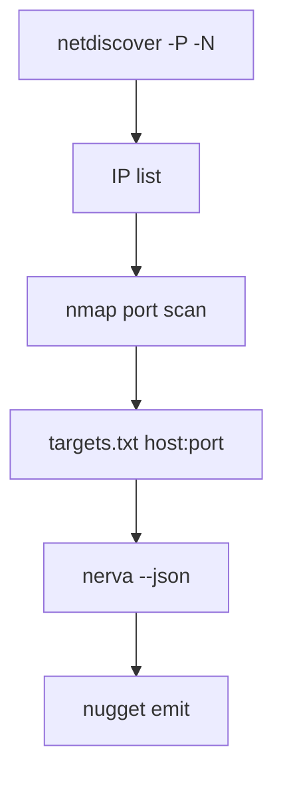

# Nerva Tactics

Service fingerprinting playbooks: port discovery → Nerva, and full **netdiscover → Nmap → Nerva** pipeline.

## Core principle

**Discovery and fingerprinting are separate stages.**

| Stage | Tool | Output |
|-------|------|--------|
| L2 host discovery | netdiscover | IP, MAC, vendor |
| Port discovery | Nmap, Naabu, Masscan | open `host:port` |
| Service fingerprint | **Nerva** | protocol + metadata JSON |

Nerva never replaces port scanners.

---

## Pipeline: netdiscover → nmap → nerva

```bash
# 1. Live hosts (local VLAN)
sudo netdiscover -P -N -r 192.168.1.0/24 | awk '{print $1}' | sort -u > ips.txt

# 2. Open ports
nmap -p- --open -T4 -iL ips.txt -oG /tmp/nmap.gnmap

# 3. Build nerva targets
awk '/\/open\//{
  ip=$2
  gsub(/.*Ports: /,"")
  n=split($0,a,",")
  for(i=1;i<=n;i++){
    split(a[i],f,"/")
    if(f[2]=="open") print ip":"f[1]
  }
}' /tmp/nmap.gnmap | sort -u > targets.txt

# 4. Fingerprint
nerva -l targets.txt --json -o fingerprints.jsonl
```

### Mermaid overview



---

## Port scanner handoffs

### Naabu (fast, simple pipe)

```bash
naabu -host example.com -silent | nerva --json
naabu -host 10.0.0.0/24 -silent | nerva --json -o results.jsonl
```

### Masscan (large scale)

```bash
masscan -p1-65535 10.0.0.0/24 --rate=10000 -oL - | \
  grep '^open' | \
  awk '{print $4":"$3}' | \
  nerva --json -o results.jsonl
```

### Nmap greppable

```bash
nmap -p- --open 192.168.1.0/24 -oG - | \
  awk '/Ports:/{ ... }' > targets.txt   # see pipeline above
nerva -l targets.txt --json
```

### Nmap + explicit service follow-up

When you already have `TCP_PORT_OPEN` events in SpiderFeet, batch targets:

```python
targets = [f"{ip}:{port}" for ip, port in open_ports]
Path("targets.txt").write_text("\n".join(targets))
# nerva -l targets.txt --json
```

---

## TCP vs UDP vs SCTP strategy

### Phase 1 — TCP (default)

```bash
nerva -l tcp_targets.txt --json -o tcp.jsonl
```

Covers web, databases, remote access, most corporate services.

### Phase 2 — UDP (selective)

Build `udp_targets.txt` from Nmap UDP scan or known UDP ports:

```
10.0.0.1:53
10.0.0.2:161
10.0.0.3:123
```

```bash
sudo nerva -l udp_targets.txt -U --json -o udp.jsonl
```

### Phase 3 — SCTP (telecom / Linux)

```bash
nerva -t mme.example.com:3868 -S --json
```

---

## Performance tactics

| Situation | Approach |
|-----------|----------|
| 10k+ open ports | `nerva -l targets.txt --fast --json` |
| Missed fingerprints on odd ports | Re-run subset **without** `--fast` |
| Timeouts | `-w 5000` or higher |
| Parallel batches | Split `targets.txt`; run multiple nerva processes |
| jq triage | `nerva ... \| jq 'select(.protocol=="http")'` |

### Two-pass fingerprinting

1. **Fast pass** — `--fast` on entire set
2. **Deep pass** — full nerva on ports where fast pass returned nothing or `unknown`

---

## Adapting to results

| Result | Next action |
|--------|-------------|
| `protocol: https` + technologies | Web assessment, nuclei, cmseek |
| `protocol: ssh` + banner | Credential testing policy check |
| `protocol: redis` / `mongodb` unauth | High-risk finding path |
| `protocol: kubernetes` | API exposure review |
| No JSON line | Confirm port open with nmap; retry `-w`; try `-U`/`-S` |
| `modbus`, `diameter` | ICS/telecom workflow |

---

## JSON processing patterns

### Filter SSH only

```bash
nerva -l targets.txt --json | jq 'select(.protocol=="ssh")'
```

### Count by protocol

```bash
nerva -l targets.txt --json | jq -s 'group_by(.protocol) | map({protocol: .[0].protocol, count: length})'
```

### Python batch

```python
import json, subprocess

proc = subprocess.run(
    ["nerva", "-l", "targets.txt", "--json"],
    capture_output=True, text=True, check=False,
)
for line in proc.stdout.splitlines():
    if line.strip():
        svc = json.loads(line)
        handle_service(svc)
```

---

## CI/CD snapshot

```bash
echo "app.example.com:443" > targets.txt
nerva -l targets.txt --json | tee fingerprints.jsonl
UNEXPECTED=$(jq -r 'select(.protocol != "http" and .protocol != "https") | .protocol' fingerprints.jsonl)
test -z "$UNEXPECTED" || echo "Unexpected: $UNEXPECTED"
```

---

## Anti-patterns

- Running nerva against `/24` without prior port scan
- Parsing `ssh://` text lines in production modules
- Expecting nerva to discover hosts (use netdiscover)
- Single `--fast` pass on non-standard port services without follow-up
- Ignoring UDP when DNS/SNMP/NTP are in scope

---

## Related docs

- [`../../netdiscover/references/tactics.md`](../../netdiscover/references/tactics.md)
- [`.docs/docs-for-cli-tools/Nerva-Zero-to-Hero.md`](../../../.docs/docs-for-cli-tools/Nerva-Zero-to-Hero.md)
- Integration guide: https://github.com/praetorian-inc/nerva/wiki/Integration-Guide
