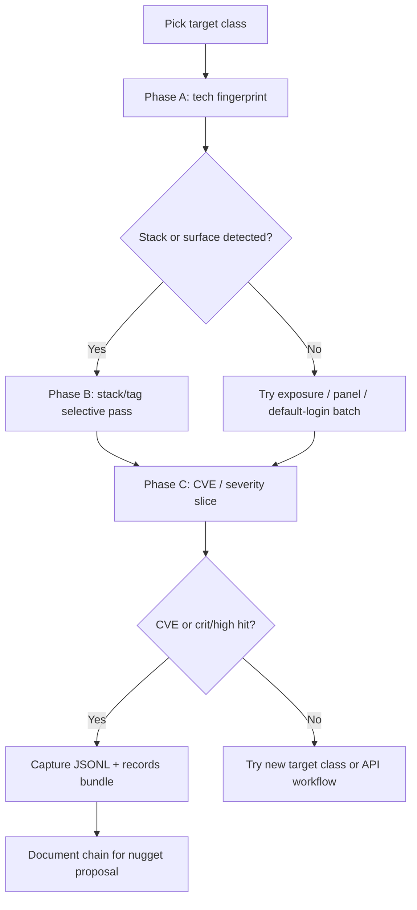

# Sequential Playbook — Examination Tuning

Multi-phase scan sequences synthesized from `.seed/03EB_Rethinking_Nuclei_Strategy.md` and [nuclei tactics](../../nuclei/references/tactics.md).

## When to use this playbook

- Retuning **nuclei CLI examination** scenarios after full-template runs produced noise or empty critical/high exports
- Hunting **rich JSONL** with CVE or critical/high severity on **smaller, less-protected** targets
- Building **scenario matrices** where each row is one batch goal, not one monolithic “all templates” run

## Playbook overview



## Phase A — Fingerprint for chaining

**Goal:** “This scan is just tech fingerprinting for chaining.”

```bash
nuclei -u https://target.example -tags tech -severity info \
  -silent -jsonl -no-interactsh -t .tools/nuclei-templates
```

**Parse:** `template-id`, `info.tags`, `info.severity`, `matched-at`, `type`.

**Decide next batch** from tags: `wordpress`, `apache`, `jira`, `panel`, swagger paths, etc.

## Phase B — Category-selective passes

Run **separate examination scenarios** (separate JSONL exports)—one per row:

| Scenario ID pattern | Command focus |
|---------------------|---------------|
| `{target}_cve_all` | `-tags cve` (all severities — full CVE template range) |
| `{target}_cves_path` | `-t .../http/cves` (4091+ CVE templates, all severities) |
| `{target}_panels` | `-tags panel,exposure` |
| `{target}_default_logins` | `-t .../default-logins/` |
| `{target}_misconfig` | `-tags misconfiguration` |
| `{target}_wordpress` | `-tags wordpress` (+ Wordfence repo if WP confirmed) |
| `{target}_apache` | `-tags apache` |
| `{target}_api_swagger` | custom swagger-detect or API workflow parent |

Apply **chainability gate** before each row: skip categories with no plausible follow-up on this target class.

## Phase C — CVE and severity escalation

After Phase B signal or on permissive lab hosts:

```bash
nuclei -u https://target.example -tags cve \
  -severity critical -severity high -severity medium \
  -silent -jsonl -no-interactsh -t .tools/nuclei-templates
```

Add year tags when hunting recent CVE templates: `-tags cve2024`, `cve2025`.

## Phase D — API workflow depth

When Phase A/B shows API or swagger surface:

```bash
nuclei -w api-pentest-workflow.yaml -u https://api.target.example -silent -jsonl
```

See [api-pentest-techniques.md](api-pentest-techniques.md).

## Target selection guidance

| Target class | Use for |
|--------------|---------|
| Permissive lab (e.g. scanme) | Severity semantics (medium/low/info); baseline “something matched” |
| Smaller / less CDN-hardened sites | CVE, exposure, panel, auth batches |
| Major CDN-backed corporate sites | Clean-miss critical/high scenarios; **not** primary rich-CVE discovery |

## Response matrix

| Observation | Next action |
|-------------|-------------|
| Full template → only `info` noise | Stop using full tree for CVE goals; run selective tags |
| Critical/high empty on corporate CDN | Expected; add smaller target or exposure/panel batch |
| Medium findings on lab host | Valid examination; capture as severity-semantics scenario |
| WordPress tag in Phase A | Phase B wordpress + optional Wordfence CVE repo |
| Swagger hit | Run API workflow subtemplates |
| All selective passes empty | New target class—not “run all 12k templates again” |

## Corpus artifact checklist (per scenario)

1. `command.txt` — single-goal command
2. `*_output_text.txt` — derived summary lines
3. `*_output_structured.json` — `records[]` list of dicts (not raw JSONL)
4. `manifest.json` — scenario_id reflects **goal**, not generic “all_templates”
5. `review.status.json` — operator review pending

## Related

- [scanning-principles.md](scanning-principles.md)
- [selective-scan-techniques.md](selective-scan-techniques.md)
- [../../cli_app_profiling/SKILL.md](../../cli_app_profiling/SKILL.md)
