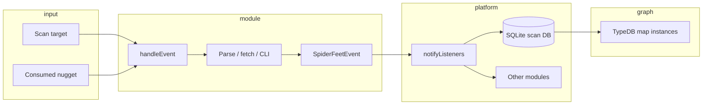

# Architecture: raw data → typed nuggets

## Core object: `SpiderFeetEvent`

Every finding is a **`SpiderFeetEvent`** (`spiderfeet/event.py`):

| Field | Role |
|-------|------|
| `eventType` | **Nugget type ID** (e.g. `TCP_PORT_OPEN`) — must exist in the type registry |
| `data` | **Payload** — always a `str`; structure is conventional, not schema-enforced |
| `module` | Producer module id (`sfp_shodan`, `sfp_tool_nmap`, …) |
| `sourceEvent` | Parent event in the discovery chain (provenance) |
| `confidence`, `visibility`, `risk` | Optional scoring (default 100/100/0) |
| `moduleDataSource` | Attribution when parsing upstream content (e.g. email found in a page) |

```python
evt = SpiderFeetEvent("IP_ADDRESS", "8.8.8.8", self.__name__, parent_event)
self.notifyListeners(evt)
```

**There is no separate “Nugget” class at scan time.** In the map layer and UI, `eventType` + `data` are persisted as nugget instances (`nugget_event_type`, `nugget_data` in TypeDB).

## Pipeline stages



### 1. Target anchoring

A scan starts with a **ROOT** event whose `eventType` matches the target class (`DOMAIN_NAME`, `IP_ADDRESS`, …) and `data` is the target string.

### 2. Module dispatch

`SpiderFeetScanner` loads modules whose `watchedEvents()` includes the incoming type. Each module implements `handleEvent(event)`.

### 3. Conversion (this document set’s focus)

Inside `handleEvent`, the module:

1. **Acquires** raw material — HTTP body, JSON, CLI stdout, DNS answer, page HTML, …
2. **Parses** with ad hoc logic (regex, `json.loads`, line splits, BeautifulSoup, …)
3. **Maps** fragments to one or more `eventType` strings
4. **Formats** `data` as a string (often `host:port`, free text, or serialised blob)
5. **Emits** via `notifyListeners`

### 4. Fan-out and deduplication

`notifyListeners` (`spiderfeet/plugin.py`):

- Persists to the scan database
- Notifies listener modules whose `watchedEvents()` matches
- Applies duplicate suppression (same data from same lineage)

### 5. Type registry

`spiderfeet/db.py` `eventTypes()` and `.docs/analysis/nuggets.json` define the **allowed** nugget IDs. Modules declare intent in `producedEvents()` but nothing validates runtime emissions against that list.

### 6. Map / graph projection

The TypeDB map schema (`/.seed/spiderfeet_map.tql`) defines:

- **Archetype** entities per nugget id (e.g. `ip-address` sub `nugget`)
- **Instance** attributes: `nugget_data`, `nugget_event_type`, provenance fields
- **Routes** linking consumed → produced types per `osint-service`
- **Scan records** linking a module run to consumed/produced instances

Today, nesting (host owns many ports) is implied by **provenance chains** and string encoding (`8.8.8.8:443`), not by explicit TypeQL relations between entity instances.

## Declared vs actual production

| Declaration | Where | Enforced? |
|-------------|-------|-----------|
| `producedEvents()` | Each module | No — documentation / module picker only |
| `osint_services.json` routes | Catalogue | Used for map routes and tests |
| Runtime `SpiderFeetEvent` | Module code | Must use known `eventType` or storage/UI may break |

Static analysis in `modules/*.md` flags types **declared only** vs **seen in code** — gaps indicate dead declarations or dynamic emission.

## String encoding conventions (implicit schema)

Because `data` is always a string, modules rely on **tribal knowledge**:

| Nugget type | Typical `data` shape | Example |
|-------------|---------------------|---------|
| `IP_ADDRESS` | IPv4/IPv6 literal | `8.8.8.8` |
| `TCP_PORT_OPEN` | `ip:port` | `8.8.8.8:443` |
| `OPERATING_SYSTEM` | OS guess, often with context | `Linux 3.x (8.8.8.8)` |
| `EMAILADDR` | Email address | `user@example.com` |
| `RAW_RIR_DATA` / `RAW_DNS_RECORDS` | `str(dict)` or JSON-ish blob | Full API response |
| `VULNERABILITY_CVE_*` | CVE description text from `sf.cveInfo()` | `CVE-2021-… (severity …)` |
| `GEOINFO` | Comma-separated place | `Mountain View, United States` |
| `WEB_ANALYTICS_ID` | `Network: id` | `Google Analytics: UA-…` |

**Risk:** downstream consumers must parse strings again for graph nesting unless we introduce structured payloads.

## Relation to OSINT services catalogue

Each OSINT service entry documents **one primary route**: consumed nugget → produced nuggets. That route is the **contract** for Stage 4 tests (`module_test_seeds.json`). Conversion quality is “proven” when a seed input yields expected produced types — not when parsing code is formally verified.

## Summary

Conversion to types is **distributed**: ~231 modules each embed their own parsers. The platform provides:

- the event bus (`notifyListeners`)
- shared validators/extractors (`sflib`, `helpers`)
- a large flat type vocabulary (`nuggets.json`)
- provenance linking

It does **not** yet provide a unified parsing framework, structured payloads, or graph-native nesting — see [06-recommendations-and-roadmap.md](06-recommendations-and-roadmap.md).
