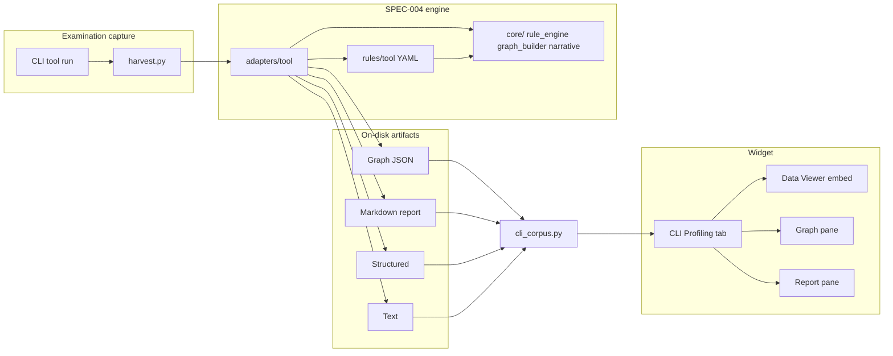

# SPEC-004 system guide — structured → graph → narrative

**Audience:** Operators reviewing CLI Profiling in the widget, and developers onboarding new CLI tools.  
**Spec:** `.governance/specs/SPEC-004-cli-graph-rules-engine.md`  
**Program status:** `.governance/project/continuity/SPEC004_PROGRAM_COMPLETION.md`  
**Active refinement (SPEC-005):** narrative engine v2 + IP classify — [agent plan](../../.governance/project/SPEC005_AGENT_PLAN.md) · [issue index](../../.governance/project/SPEC005_ISSUE_INDEX.md) · [spec](../../.governance/specs/SPEC-005-narrative-v2-ip-classify.md)

---

## What this system does

SpiderFeet formal **CLI examination** turns each tool run into four review artifacts:

| Output | Purpose | Typical file |
|--------|---------|--------------|
| **Text** | Human-readable scan summary or native stdout | `*_output_text.txt` |
| **Structured** | Single-root JSON or XML for Data Viewer | `*_output_structured.json` |
| **Graph** | Common ontology `nodes[]` + `edges[]` | `nugget_structure/<tool>_<scenario>_proposed_nuggets_edges.json` |
| **Markdown report** | Narrative + appendix of every node/edge | `nugget_structure/<tool>_<scenario>_proposed_nuggets_edges_description.md` |

The **CLI Profiling** tab in the widget loads these via FastAPI (`/api/v1/cli-corpus/*`). You do not need to open files on disk during normal review.

---

## Architecture (high level)



**Design principle:** ~80% declarative YAML under `rules/`, ~20% cited Python hooks in `adapters/<tool>/hooks.py`. No per-tool hardcoded full mappers when YAML can express the mapping.

---

## Directory map

| Path | Role |
|------|------|
| `.seed/scripts/cli_corpus/adapters/<tool>/` | Per-tool parse/normalize, `build_outputs`, cited hooks |
| `.seed/scripts/cli_corpus/rules/<tool>/mapping.yaml` | Field → nugget mapping, scan head, topology |
| `.seed/scripts/cli_corpus/rules/<tool>/narrative.yaml` | Report sections, phrasing, appendix rules |
| `.seed/scripts/cli_corpus/rules/_shared/` | Relations, scan head, CDN/ASN lists, validation |
| `.seed/scripts/cli_corpus/core/` | `rule_engine`, `graph_builder`, `narrative_profile`, `correlation_engine` |
| `.seed/scripts/cli_corpus/harvest.py` | Runs scenarios; writes four outputs for adapter tools |
| `.docs/docs-for-cli-tools/app_examination_docs/<tool>/` | Examination bundles (manifest, text, structured) |
| `.docs/docs-for-cli-tools/nugget_structure/` | Graph JSON, narrative MD, tool-level structure docs |
| `spiderfeet/api/services/cli_corpus.py` | API reader for the profiling UI |
| `spiderfeet-widget/src/js/profiling.js` | CLI Profiling UI (tabs, graph, markdown, Data Viewer) |

**Adapter tools today (eight):** `netdiscover`, `nmap`, `nerva`, `pius`, `subfinder`, `httpx`, `katana`, `nuclei`.

---

## Capture families

Each adapter declares exactly one family (see `proj-07-cli-graph-rules-engine.mdc`):

- **`structured_native`** — Tool emits JSON/XML/JSONL; adapter normalizes to a bundle (`records[]` where applicable) and **derives** the Text pane.
- **`text_native`** — Tool emits TUI/text; adapter keeps native text and produces Structured (e.g. TextFSM for netdiscover).

---

## Centralized capabilities (`core/`)

| Module | Responsibility |
|--------|------------------|
| `graph_builder.py` | `GraphBuilder`, `nugget_node`, **single** `nugget_instance_id` (`nugget_id--uuid5(seed, nugget_data)`) |
| `rule_engine.py` | Load YAML packs, scan head, descriptor mapping, topology templates |
| `narrative_profile.py` | Generic §4.3 narrative builder from `narrative.yaml` |
| `correlation_engine.py` | Nerva Ruleset A→C→B host/CDN correlation (loads `rules/_shared/cdn_signatures.yaml`, `edge_asns.yaml`) |
| `correlation_lists.py` | Versioned CDN/ASN list loader |

**Identity rule:** Never add alternate UUID helpers. All instance ids use `ONTOLOGY_NAMESPACE` from `graph_builder.py`.

**Relations (default):** `contains`, `had`, `listens-to` — see `proj-05-spiderfeet-nugget-ontology.mdc`.

---

## Rules packs (`rules/`)

### Per-tool

- **`mapping.yaml`** — Maps structured fields to nugget types, scan record head, edges.
- **`narrative.yaml`** — Section order, phrasing keys, appendix requirements.

### Shared (`rules/_shared/`)

- `relations.yaml`, `scan_head.yaml`, `categories.yaml`, `identity.yaml`, `validation.yaml`
- `four_outputs.yaml` — Contract documentation
- `cdn_signatures.yaml`, `edge_asns.yaml` — Nerva correlation (Ruleset C)

### Seed documents (source of truth for hooks)

| Tool | Seeds |
|------|-------|
| Nmap | `.seed/06B_NMAP_Ontology_Update_Ruleset.md` |
| Nerva | `.seed/07_Nerva_Scan_Record_Host_Correlation_Rulesets.md` + `.seed/07B_Nerva_Ontology_Rules.md` |
| Pius | `.seed/08_Rules_for_Pius.md` |
| Subfinder | `.seed/09_Ontology_For_Subfinder.md` |
| Httpx | `.seed/10_Rules_For_Httpx.md` |
| Katana | (httpx-fed crawl bundles; mapping in `rules/katana/`) |
| Nuclei | `.seed/11_Ontology_for_Nuclei.md` + `.seed/11B_Rules_for_Nuclei.md` |
| Overview | `.seed/14_Business_Rules_for_Converting_Structured_Data_to_Graph.md` |

Every function in `hooks.py` must cite seed rule ids in its docstring (governance test `test_spec004_governance.py`).

---

## Adapter public API

Each `adapters/<tool>/__init__.py` exposes:

```text
to_structured(...)   # normalize raw capture
to_text(...)         # Text pane (derived or paired)
to_graph(...)        # nodes + edges
to_narrative(...)    # Markdown report
build_outputs(...)   # all four + structured_json for harvest
```

`harvest.py` calls `build_outputs` for `ADAPTER_TOOLS` and writes:

```text
nugget_structure/<tool>_<scenario_key>_proposed_nuggets_edges.json
nugget_structure/<tool>_<scenario_key>_proposed_nuggets_edges_description.md
```

---

## Viewing in the UI

**Preconditions**

1. Backend running (e.g. `./start.ps1` in spiderfeet).
2. Widget built/served (same start script or webpack dev).
3. Open widget → **CLI Profiling** navbar tab.

**Per scenario row**

- **T** / **S** / **G** / **MD** badges = `has_text`, `has_structured`, `has_graph`, `has_markdown` from API.
- **Complete** (internal flag) = all four present.
- Detail view tabs: Text, Structured (Data Viewer iframe), Graph (force layout), Markdown report.

**API surface** (`cli_corpus.py`)

- `GET /api/v1/cli-corpus/tools` — corpus index
- `GET /api/v1/cli-corpus/tools/{tool_id}/scenarios` — scenario list with artifact flags
- `GET /api/v1/cli-corpus/tools/{tool_id}/scenarios/{scenario_key}` — full detail including `graph_proposal` and `graph_description_markdown`

Graph/markdown resolution order:

1. Bundle-local `proposed_nuggets_edges.json` / `.md` (if scenario uses `scenarios/<key>/` layout)
2. Else `nugget_structure/<tool>_<scenario_key>_*.json|md`

---

## Regenerating graph + narrative (without re-running CLI)

If adapters were updated but examination corpora are older, regenerate from existing structured files:

```bash
cd C:\projects\spiderfeet
python .seed/scripts/cli_corpus/backfill_adapter_four_outputs.py
```

Options:

- `--tool pius` (repeatable) — limit tools
- `--force` — overwrite existing graph+markdown pairs
- `--dry-run` — print planned writes only

Full re-capture (re-runs the CLI tool):

```bash
python .seed/scripts/cli_corpus/harvest.py --tool pius --scenario crt_linode_ndjson
```

---

## Tests and governance

| Test file | Proves |
|-----------|--------|
| `test_spec004_governance.py` | Anti-sprawl, hook citations, adapter layout |
| `test_spec004_structural_goldens.py` | Graph connectivity/signatures (not byte-locked) |
| `test_spec004_narrative_coverage.py` | Every node value appears in appendix |
| `test_harvest_adapter_dispatch.py` | Harvest wires all adapter tools |
| `test_*_adapter.py` | Per-tool adapter behavior |

**Visual review gate (R4-01-08):** `.governance/project/SPEC004_VISUAL_REVIEW_CHECKLIST.md` — complete before locking byte goldens.

**Issue index / epics:** `.governance/project/SPEC004_ISSUE_INDEX.md` (program closed; use for traceability).

---

## Epic E — runtime bridge (second push)

Production modules can call adapters without duplicating the engine:

- `sfp_adapter_bridge.py` — thin bridge for `sfp_tool_*` wrappers
- `.governance/project/SPEC004_SFP_THIN_WRAPPER_PATTERN.md`
- `.governance/project/SPEC004_GRAPH_TO_EVENT.md` — graph → SpiderFoot event shape (design)

Full `sfp_*` rewrites are **out of scope** until operator approves per-module work (#723).

---

## Onboarding a new CLI tool

Follow **`.seed/scripts/cli_corpus/ONBOARDING.md`** (phased checklist). Short path:

1. Explore → semantic outcome matrix (proj-06) — no harvest until classified  
2. Pick `structured_native` vs `text_native`; define bundle/schema  
3. Copy `rules/_template/` + `adapters/_template/`  
4. Author seed (if needed) + `mapping.yaml` + `narrative.yaml`  
5. Implement four-output adapter; use `classify_ip` + shared narrative engine  
6. Wire `harvest.py` `ADAPTER_TOOLS`; run harvest / backfill  
7. Add `nugget_structure/<tool>_nugget_graph_structure.md`  
8. CLI Profiling visual review (T/S/G/MD) → structural tests → goldens after sign-off  

Rules: `.cursor/rules/proj-07-cli-graph-rules-engine.mdc`. Refinement program: SPEC-005.

---

## Quick reference links

| Doc | Path |
|-----|------|
| Spec (graph engine) | `.governance/specs/SPEC-004-cli-graph-rules-engine.md` |
| Spec (narrative v2 + IP) | `.governance/specs/SPEC-005-narrative-v2-ip-classify.md` |
| Agent plan (SPEC-005) | `.governance/project/SPEC005_AGENT_PLAN.md` |
| Onboarding checklist | `.seed/scripts/cli_corpus/ONBOARDING.md` |
| Rule (proj-07) | `.cursor/rules/proj-07-cli-graph-rules-engine.mdc` |
| CLI exercising | `.cursor/rules/proj-06-spiderfeet-cli-app-exercising.mdc` |
| Ontology | `.cursor/rules/proj-05-spiderfeet-nugget-ontology.mdc` |
| Corpus index | `.docs/docs-for-cli-tools/corpus_index.json` |
| Data Viewer embed | `@spiderfeet-widget/.docs/data-viewer-embed.md` |
| Program completion | `.governance/project/continuity/SPEC004_PROGRAM_COMPLETION.md` |
