# Current CLI Profiling Ontology

Living summary of the **unified** nugget graph model built incrementally from CLI application profiling. Individual tools each contribute **sub-graphs** — validated slices of the same ontology — that **compose** into one semantic investigation graph. Start here for the full-extent vocabulary; drill into per-tool structure docs and generators when implementing parsers.

| Sub-graph (tool) | Status | Structure doc | Generator |
|------------------|--------|---------------|-----------|
| **Nmap** | implemented | [nmap_nugget_graph_structure.md](nugget_structure/nmap_nugget_graph_structure.md) | `.seed/scripts/cli_corpus/adapters/nmap` |
| **Netdiscover** | implemented | [netdiscover_nugget_graph_structure.md](nugget_structure/netdiscover_nugget_graph_structure.md) | `.seed/scripts/cli_corpus/adapters/netdiscover` |
| **Nerva** | implemented | [nerva_nugget_graph_structure.md](nugget_structure/nerva_nugget_graph_structure.md) | `.seed/scripts/cli_corpus/adapters/nerva` |
| **Pius** | implemented | [pius_nugget_graph_structure.md](nugget_structure/pius_nugget_graph_structure.md) | `.seed/scripts/cli_corpus/adapters/pius` |
| **Subfinder** | implemented | [subfinder_nugget_graph_structure.md](nugget_structure/subfinder_nugget_graph_structure.md) | `.seed/scripts/cli_corpus/adapters/subfinder` |
| **httpx** | implemented | [httpx_nugget_graph_structure.md](nugget_structure/httpx_nugget_graph_structure.md) | `.seed/scripts/cli_corpus/adapters/httpx` |
| **Katana** | implemented | [katana_nugget_graph_structure.md](nugget_structure/katana_nugget_graph_structure.md) | `.seed/scripts/cli_corpus/adapters/katana` |
| **Nuclei** | implemented | [nuclei_nugget_graph_structure.md](nugget_structure/nuclei_nugget_graph_structure.md) | `.seed/scripts/cli_corpus/adapters/nuclei` |

Canonical seed: `.seed/05_Onotology_for_Nuggets.md` · Vocabulary: `.docs/analysis/nuggets.json` + `.docs/analysis/nuggets_extension.json` · Correlation: `.seed/07_Nerva_Scan_Record_Host_Correlation_Rulesets.md`

---

## Unified model (full extent)

Every profiled CLI app emits a graph that **plugs into** the same top-level shape:

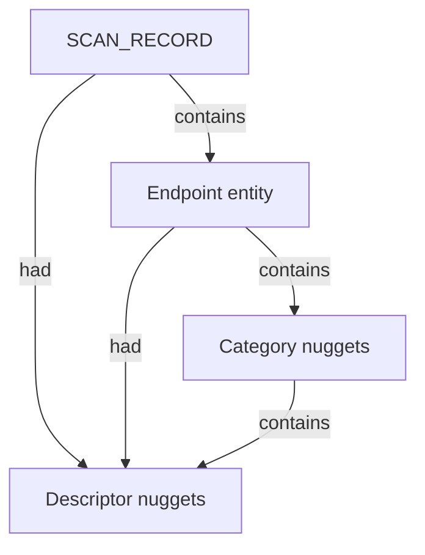

| Layer | Role | Shared across tools |
|-------|------|---------------------|
| **Scan head** | One `SCAN_RECORD` per examination run; tool-specific metadata as `had` descriptors | Always |
| **Endpoint** | `SYSTEM`, `HOST`, `DEVICE`, `MOBILE`, `SERVER`, `CDN`, `DOMAIN_NAME`, `COMPANY_NAME`, … | Variant per evidence |
| **Categories** | `NETWORKS`, `APPLICATIONS`, `ENVIRONMENT`, `VULNERABILITIES`, `SECURITY`, … | As evidence allows |
| **Facts** | Descriptor nuggets linked via `had` or nested `contains` | As evidence allows |

**Composition rule:** later scans **add** nodes and edges to the same investigation; they do not define a parallel ontology.

---

## Relations (global)

| Relation | Direction | Meaning |
|----------|-----------|---------|
| `contains` | parent → child | Structural ownership |
| `had` | entity → descriptor | Attribute fact on a node |
| `listens-to` | service → port | Application service associated with a transport port |

Instance ids use `nugget_id--uuid5(ontology_seed, nugget_data)` — see `core/graph_builder.py`.

---

## System qualification hierarchy

Endpoint subclass is a qualification decision within the unified model. ARP-level scans emit **`SYSTEM`**; port/service scans justify **`HOST`** or **`CDN`**; org tools emit **`COMPANY_NAME`** and **`DOMAIN_NAME`** trees.

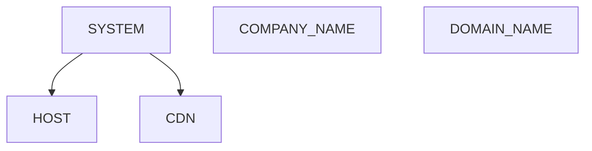

| Depth | Typical tools | Endpoint | Categories typically present |
|-------|---------------|----------|------------------------------|
| L2 / ARP | Netdiscover | `SYSTEM` | `NETWORKS` → IP/MAC |
| L3 + ports | Nmap, Nerva | `HOST` / `CDN` | `NETWORKS`, `APPLICATIONS` |
| DNS / org | Subfinder, Pius | `DOMAIN_NAME`, `COMPANY_NAME` | domain descriptors, netblocks |
| Web probe | httpx, Katana | `HOST` / `CDN` | `APPLICATIONS`, URL entities |
| Vuln scan | Nuclei | `HOST` | `SECURITY` → `FINDINGS` |

---

## Sub-graph: Nmap

*Nmap contributes validated nodes and edges via `.seed/scripts/cli_corpus/adapters/nmap`. See the per-tool Structure doc for field tables and scenario coverage.*

### Host reachability

HOST_STATUS and HOST_STATUS_REASON attach to HOST via had when reachability is reported.

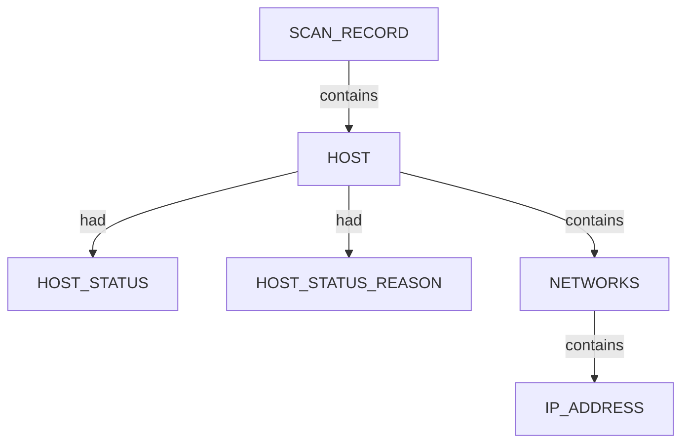

### Host port and service tree

Qualified HOST scans extend NETWORKS with TRANSPORT and PORT; APPLICATIONS contains SERVICE entities that listens-to their PORT. Port protocol and state are descriptors.

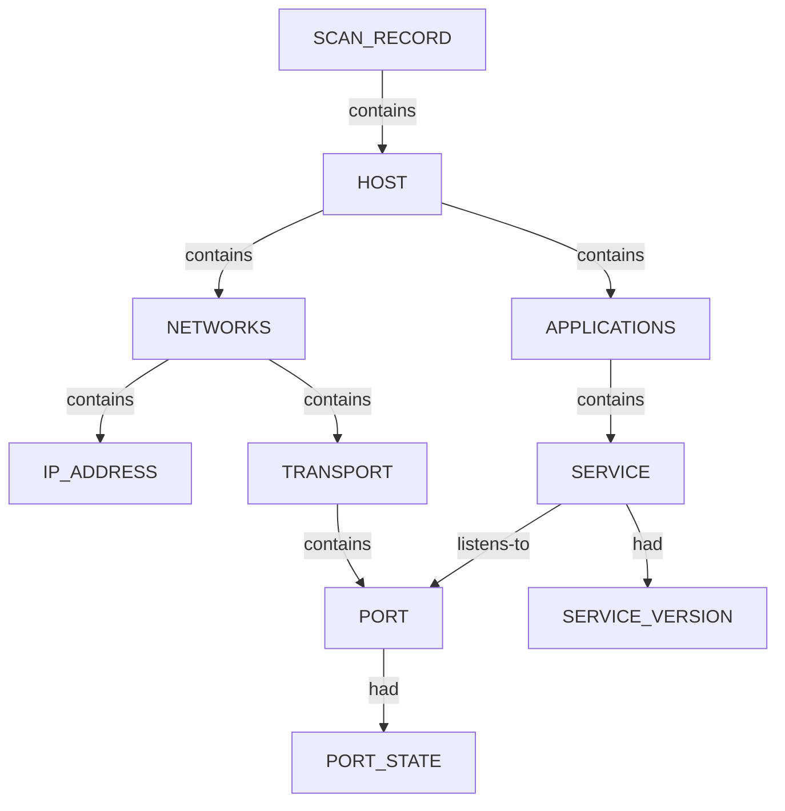

### SSH service and host keys

When SSH host-key scripts fire, APPLICATIONS contains an SSH SERVICE that listens-to the open PORT and contains key SUBENTITY nodes (RSA, ECDSA, EDDSA, DSA) with SSH_KEY_* descriptors.

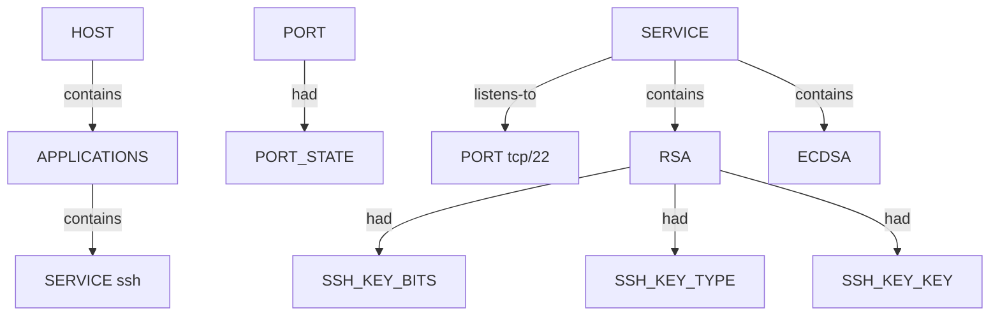

Full Structure doc: [nmap_nugget_graph_structure.md](_Current_Ontology.md).

## Sub-graph: Netdiscover

*Netdiscover contributes validated nodes and edges via `.seed/scripts/cli_corpus/adapters/netdiscover`. See the per-tool Structure doc for field tables and scenario coverage.*

### System tree (L2 provisional)

When only L2/L3 identity is known, emit SYSTEM (not HOST). Each system owns a NETWORKS category containing IPv4 and L2 facts; MAC_VENDOR attaches via had on MAC_ADDRESS.

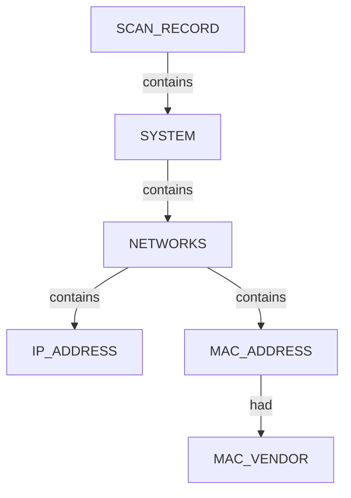

Full Structure doc: [netdiscover_nugget_graph_structure.md](_Current_Ontology.md).

## Sub-graph: Nerva

*Nerva contributes validated nodes and edges via `.seed/scripts/cli_corpus/adapters/nerva`. See the per-tool Structure doc for field tables and scenario coverage.*

### Host port and service tree

Qualified HOST scans extend NETWORKS with TRANSPORT and PORT; APPLICATIONS contains SERVICE entities that listens-to their PORT. Port protocol and state are descriptors.

Full Structure doc: [nerva_nugget_graph_structure.md](_Current_Ontology.md).

## Sub-graph: Pius

*Pius contributes validated nodes and edges via `.seed/scripts/cli_corpus/adapters/pius`. See the per-tool Structure doc for field tables and scenario coverage.*

### Organisation company tree

Pius scans contain a COMPANY_NAME root with category buckets (DOMAINS, NETBLOCKS, …) holding INTERNET_NAME and NETBLOCK_OWNER findings plus PIUS_SOURCE descriptors.

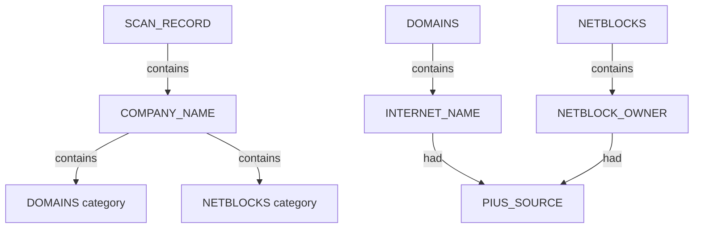

Full Structure doc: [pius_nugget_graph_structure.md](_Current_Ontology.md).

## Sub-graph: Subfinder

*Subfinder contributes validated nodes and edges via `.seed/scripts/cli_corpus/adapters/subfinder`. See the per-tool Structure doc for field tables and scenario coverage.*

### Domain apex tree

Org-intelligence and DNS tools root at DOMAIN_NAME entities under SCAN_RECORD. Subdomains are sibling DOMAIN_NAME nodes; descriptors capture discovery mode, sources, and liveness.

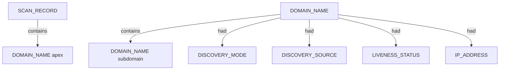

Full Structure doc: [subfinder_nugget_graph_structure.md](_Current_Ontology.md).

## Sub-graph: httpx

*httpx contributes validated nodes and edges via `.seed/scripts/cli_corpus/adapters/httpx`. See the per-tool Structure doc for field tables and scenario coverage.*

### Web URL probe tree

httpx attaches LINKED_URL_INTERNAL per live probe under SCAN_RECORD and DOMAIN_NAME apex. HOST or CDN endpoints own NETWORKS port chains and APPLICATIONS SERVICE facts.

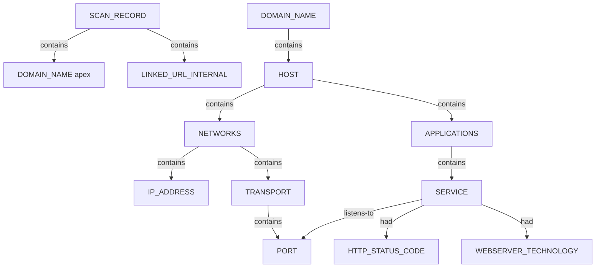

Full Structure doc: [httpx_nugget_graph_structure.md](_Current_Ontology.md).

## Sub-graph: Katana

*Katana contributes validated nodes and edges via `.seed/scripts/cli_corpus/adapters/katana`. See the per-tool Structure doc for field tables and scenario coverage.*

### Crawl URL tree

Katana extends the web surface with LINKED_URL_INTERNAL nodes under SCAN_RECORD and nests URLs under discovered DOMAIN_NAME hosts within the crawl scope.

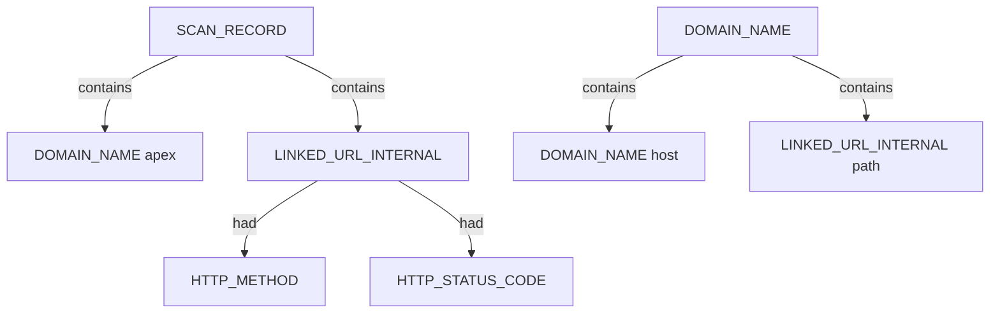

Full Structure doc: [katana_nugget_graph_structure.md](_Current_Ontology.md).

## Sub-graph: Nuclei

*Nuclei contributes validated nodes and edges via `.seed/scripts/cli_corpus/adapters/nuclei`. See the per-tool Structure doc for field tables and scenario coverage.*

### Vulnerability findings tree

Nuclei attaches SECURITY under HOST with FINDINGS severity buckets, NUCLEI_FINDING rows, NUCLEI_VULNERABILITY observations, and optional CVE tier descriptors.

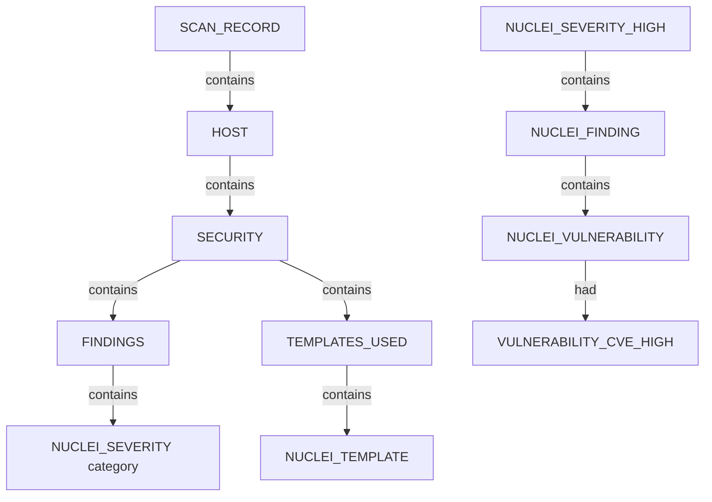

Full Structure doc: [nuclei_nugget_graph_structure.md](_Current_Ontology.md).

## Composing sub-graphs

The **investigation graph** is the union of contributed sub-graphs, correlated by shared keys (`IP_ADDRESS`, `INTERNET_NAME` / `DOMAIN_NAME`, URLs, findings):

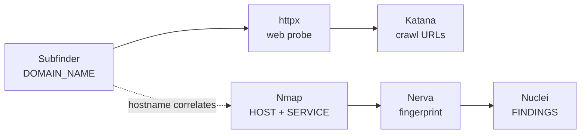

Shallow discovery leaves provisional endpoints until deeper sub-graphs justify reclassification.

---

## Expansion policy

- Prefer **extending** the unified model over forking per-tool ontologies.
- Keep each Mermaid diagram focused (≤12 nodes where possible).
- Document parser mappings in per-tool `*_nugget_graph_structure.md`; keep this file as the composed view.
- Regenerate via `render_structure_docs.py --ontology` after structure pack changes.
