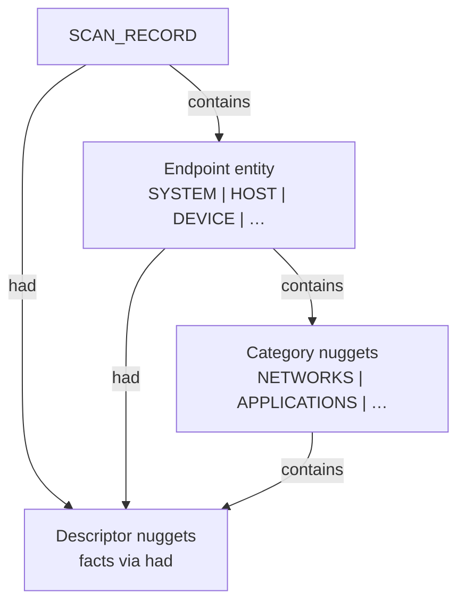
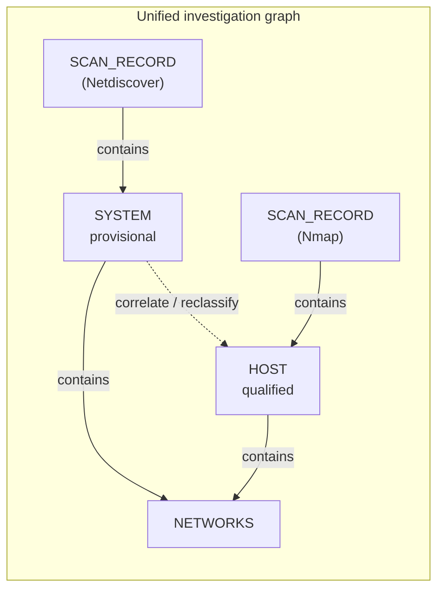
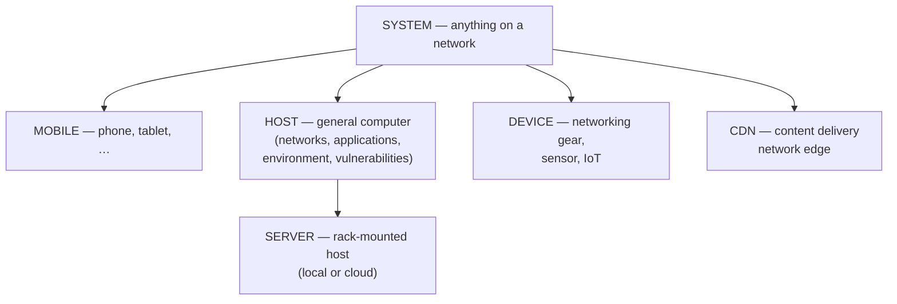
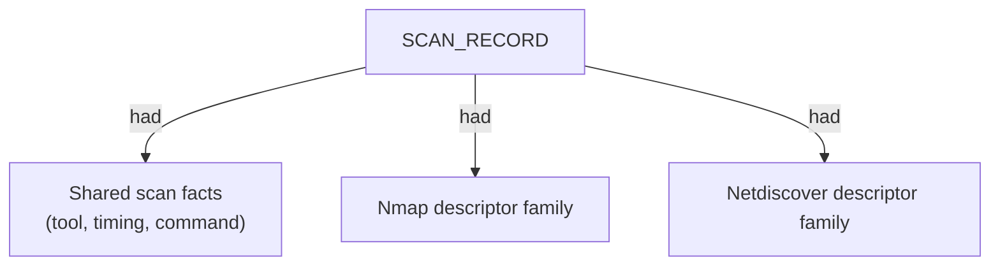
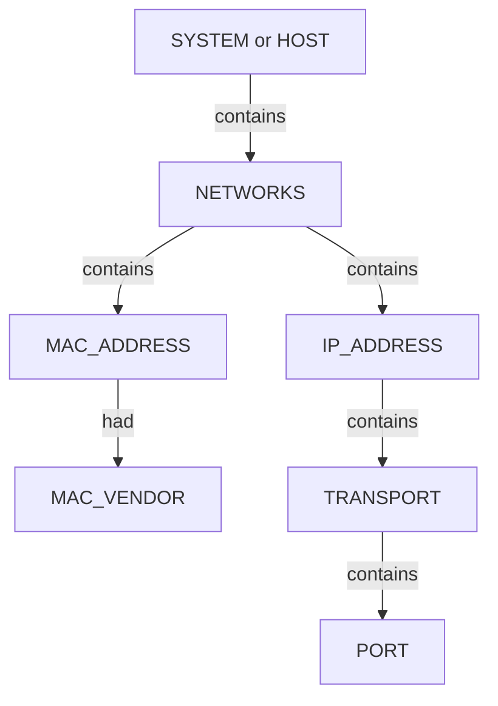
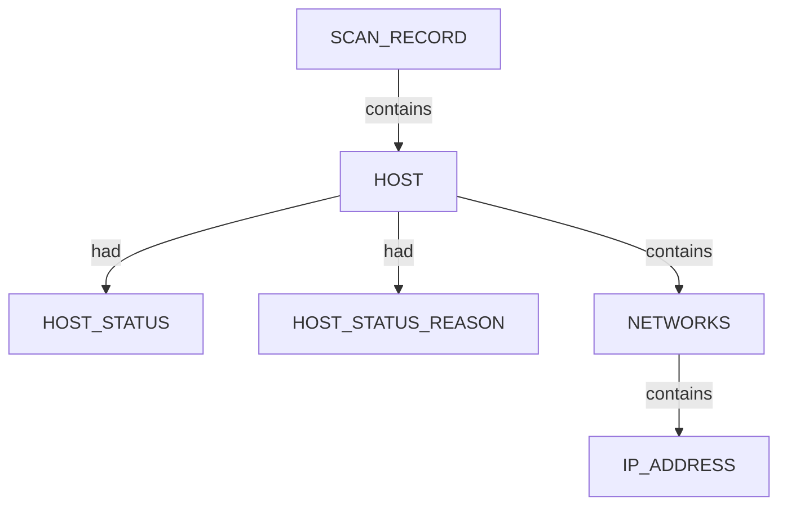
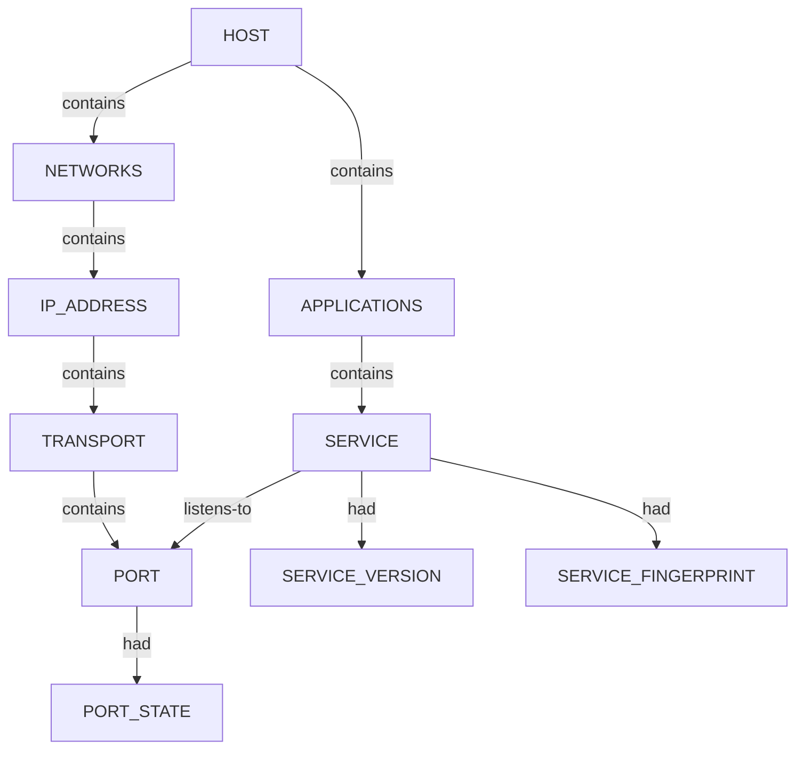
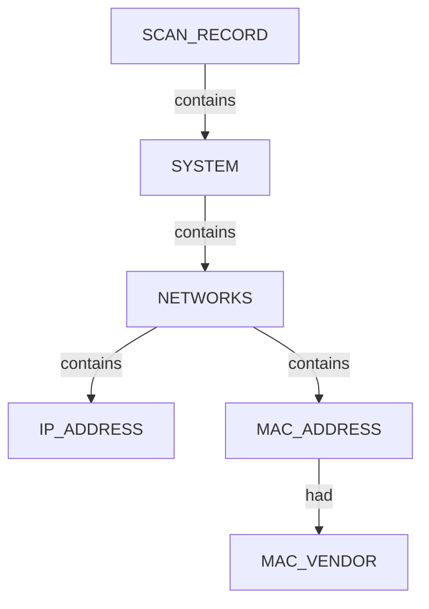
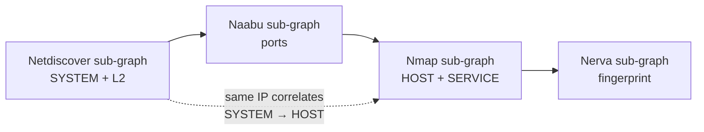

# Current CLI Profiling Ontology

Living summary of the **unified** nugget graph model built incrementally from CLI application profiling. Individual tools (Nmap, Netdiscover, and ~10 more planned) each contribute **sub-graphs** — validated slices of the same ontology — that **compose** into one semantic investigation graph. Start here for the full-extent vocabulary; drill into per-tool structure docs and generators when implementing parsers.

| Sub-graph (tool) | Status | Structure doc | Generator |
|------------------|--------|---------------|-----------|
| **Nmap** | implemented | [nmap_nugget_graph_structure.md](nugget_structure/nmap_nugget_graph_structure.md) | `.seed/scripts/cli_corpus/nmap_xml_to_graph.py` |
| **Netdiscover** | implemented | [netdiscover_nugget_graph_structure.md](nugget_structure/netdiscover_nugget_graph_structure.md) | `.seed/scripts/cli_corpus/netdiscover_json_to_graph.py` |
| Nerva, Naabu, Pius, … | planned / partial | per-tool `*_nugget_graph_structure.md` | per-tool generator |

Canonical seed: `.seed/05_Onotology_for_Nuggets.md` · Vocabulary: `.docs/analysis/nuggets.json` + `.docs/analysis/nuggets_extension.json` · Correlation: `.seed/07_Scan_Record_Host_Correlation_Rulesets.md`

---

## Unified model (full extent)

Every profiled CLI app emits a graph that **plugs into** the same top-level shape:

| Layer | Role | Shared across tools |
|-------|------|---------------------|
| **Scan head** | One `SCAN_RECORD` per examination run; tool-specific metadata as `had` descriptors | Always |
| **Endpoint** | `SYSTEM`, `HOST`, `DEVICE`, `MOBILE`, `SERVER`, `CDN`, … — qualification level depends on evidence | Always (variant chosen per scan) |
| **Categories** | Structural buckets under an endpoint: `NETWORKS`, `APPLICATIONS`, `ENVIRONMENT`, `VULNERABILITIES`, … | As evidence allows |
| **Facts** | Descriptor nuggets (`IP_ADDRESS`, `MAC_VENDOR`, `SERVICE`, …) linked via `had` or nested `contains` | As evidence allows |

**Composition rule:** later scans **add** nodes and edges to the same investigation; they do not define a parallel ontology. Netdiscover is not a separate product vocabulary — it is a **shallow slice** of the unified model (L2/L3 + provisional `SYSTEM`). Nmap is a **deeper slice** (qualified `HOST` + ports + services + OS). Together they describe one network; correlation merges overlapping endpoints across scan records.

---

## Relations (global)

| Relation | Direction | Meaning |
|----------|-----------|---------|
| `contains` | parent → child | Structural ownership (scan→endpoint, endpoint→category, transport→port) |
| `had` | entity → descriptor | Attribute fact on a node (status, version, vendor) |
| `listens-to` | service → port | Application service associated with a transport port (Nmap sub-graph) |

Instance ids use `uuid5(ontology_seed, nugget_data)` — see each tool’s graph builder.

---

## System qualification hierarchy

Endpoint **subclass** is a qualification decision within the unified model — not a tool-specific choice. The same `NETWORKS` category appears under both provisional `SYSTEM` and qualified `HOST`; what differs is how much else the scan justified.

### Type lattice

Anything on a network is at minimum a **`SYSTEM`**. Narrower classes are subclasses of `SYSTEM` (`SERVER` further specialises `HOST`):

| Nugget | Parent | Meaning |
|--------|--------|---------|
| **`SYSTEM`** | — (root network endpoint) | Provisional: *something* on the network; class not yet qualified |
| **`MOBILE`** | `SYSTEM` | Phone, tablet, or other mobile endpoint |
| **`HOST`** | `SYSTEM` | General-purpose computer; may own full category trees |
| **`SERVER`** | `SYSTEM` / `HOST` | Rack-mounted host — on-prem or cloud |
| **`DEVICE`** | `SYSTEM` | Network appliance, sensor, or IoT (not a general computer) |
| **`CDN`** | `SYSTEM` | CDN edge / anycast — on the network but not an origin `HOST` |

### Evidence → subclass (which sub-graph runs)

| Depth | Typical tools | Endpoint in unified model | Categories typically present |
|-------|---------------|---------------------------|------------------------------|
| L2 / ARP | **Netdiscover** sub-graph | **`SYSTEM`** (provisional) | `NETWORKS` → `IP_ADDRESS`, `MAC_ADDRESS`, `MAC_VENDOR` |
| L3 + ports | **Nmap** sub-graph | **`HOST`** | `NETWORKS` → `IP_ADDRESS`, `TRANSPORT` → `PORT`; `HOST_STATUS` |
| Service ID | Nerva (planned merge) | **`HOST`** or **`CDN`** | `APPLICATIONS` / service facts on ports |
| OS / vulns | Nmap NSE, … | **`HOST`** | `ENVIRONMENT`, `VULNERABILITIES` |

ARP-level scans **cannot** justify `HOST`, `DEVICE`, `MOBILE`, `SERVER`, or `CDN` — only **`SYSTEM`**. Port and service scans **cannot** invent `MAC_VENDOR` without L2 evidence — that nugget enters via the Netdiscover (or equivalent) sub-graph.

**`SYSTEM` is often temporary:** create with shallow discovery → investigate with deeper sub-graphs → reclassify to `HOST`, `DEVICE`, `MOBILE`, `SERVER`, or `CDN` when evidence supports it (`.seed/07_Scan_Record_Host_Correlation_Rulesets.md`).

---

## Scan head (union of descriptors)

All tools root at **`SCAN_RECORD`**. Descriptor **names** extend the unified scan vocabulary as new tools are profiled; parsers only emit descriptors their CLI actually provides.

| Descriptor family | Introduced by | Examples |
|-------------------|---------------|----------|
| **Nmap** | Nmap sub-graph | `SCAN_CLI`, `SCAN_TARGET`, `SCAN_VERSION`, `SCAN_START`, `SCAN_SUMMARY`, `SCAN_ELAPSED`, `SCAN_TOOL` |
| **Netdiscover** | Netdiscover sub-graph | `SCAN_ARGS`, `SCAN_TIMESTAMP`, `SCAN_END_TIME`, `SCAN_EXIT_STATUS`, `SCAN_TRIES`, `SCAN_EMPTY_SCANS`, `SCAN_DISCOVERED` |
| *(future)* | each new CLI app | added here without changing scan-head shape |

---

## NETWORKS category (shared backbone)

`NETWORKS` is the **shared category** under any endpoint (`SYSTEM` or `HOST`). Tools extend which facts hang beneath it:

| Nugget | Sub-graph that introduces it | Notes |
|--------|---------------------------|-------|
| `IP_ADDRESS` | **Both** (required) | Canonical L3 key for correlation |
| `MAC_ADDRESS` | **Netdiscover** extension | L2; not in typical Nmap XML |
| `MAC_VENDOR` | **Netdiscover** extension | `had` on `MAC_ADDRESS`; not `RAW_RIR_DATA` |
| `TRANSPORT` → `PORT` | **Nmap** extension | Port state, protocol, services |
| `INTERNET_NAME` | **Nmap** (primarily) | Hostname on `HOST` via `had` |

Netdiscover therefore **extends** the unified ontology with L2 nuggets and a provisional endpoint class; Nmap **extends** it with L4/application/environment depth on a qualified `HOST`. A full LAN investigation uses **both** sub-graphs on the same semantic app.

---

## Sub-graph: Nmap (host depth)

*Nmap contributes qualified **`HOST`** trees, port/service/application structure, OS fingerprint, and traceroute. Implemented in corpus.*

### Host + reachability

- `HOST` canonical key: primary IPv4 (or first address).

### Port and service tree

| Nugget | Role |
|--------|------|
| `PORT_STATE` | `open`, `filtered`, `closed`, `open\|filtered` (UDP) |
| `PORT_PROTOCOL` | `tcp` / `udp` on the port node |
| `SERVICE_VERSION` | `product` + `version` from service detection |
| `SERVICE_FINGERPRINT` | Nmap `servicefp` probe string |
| `SERVICE_EXTRAINFO` | Banner fragment / OS hint in `extrainfo` |
| `CPE_URL` | CPE URIs under the service |

### SSH host keys (NSE)

When `ssh-hostkey` fires, **`SERVICE`** **`contains`** key **`SUBENTITY`** nodes (`RSA`, `ECDSA`, `EDDSA`, `DSA`) with bit length, type, and public key descriptors.

### OS fingerprint

**`ENVIRONMENT` → `OPERATING_SYSTEM`** with optional **`OS_MATCH_ACCURACY`**. Best `osmatch` by accuracy when multiple exist.

### Traceroute

**`TRACE`** under the scan with ordered **`TRACE_HOP`** → **`HOST`** per hop. Descriptors: `HOP_ORDER`, `HOP_TTL`, `HOP_RTT`, `TRACE_PROTOCOL`.

---

## Sub-graph: Netdiscover (L2 provisional slice)

*Netdiscover extends the unified model with **`SYSTEM`** endpoints and L2 facts. It reuses `SCAN_RECORD` + `NETWORKS` + `IP_ADDRESS` and adds `MAC_ADDRESS` / `MAC_VENDOR`. Implemented in corpus.*

### System tree (provisional endpoint)

- `NETWORKS` is a **CATEGORY** nugget (`#14B8A6`).
- Identical vendor strings dedupe to one `MAC_VENDOR` node.
- Does **not** emit `APPLICATIONS`, `ENVIRONMENT`, `TRACE`, or vulnerability categories — those come from other sub-graphs when run.

### Multi-system scan

One `SCAN_RECORD` may `contains` many `SYSTEM` nodes (subnet discovery). Each expands to its own `NETWORKS` tree keyed by IPv4.

### Netdiscover scan descriptors

Run statistics attach to the shared scan head: `SCAN_ARGS`, `SCAN_TIMESTAMP`, `SCAN_TRIES`, `SCAN_EMPTY_SCANS`, `SCAN_DISCOVERED`, etc.

---

## Composing Nmap + Netdiscover

The **investigation graph** is the union of contributed sub-graphs, correlated by shared keys (primarily `IP_ADDRESS`, later MAC and identity artifacts):

| Unified concept | Netdiscover contributes | Nmap contributes |
|-----------------|-------------------------|------------------|
| Scan head | Netdiscover descriptor family | Nmap descriptor family |
| Endpoint | `SYSTEM` (provisional) | `HOST` (qualified) |
| `NETWORKS` | `IP_ADDRESS`, `MAC_ADDRESS`, `MAC_VENDOR` | `IP_ADDRESS`, `TRANSPORT` → `PORT` |
| Reachability | implicit (discovered) | `HOST_STATUS`, `HOST_STATUS_REASON` |
| Applications | — | `APPLICATIONS` / `SERVICE` / `listens-to` |
| Environment / trace | — | `ENVIRONMENT`, `TRACE` |

**Typical composition order** (each step adds a sub-graph to the same semantic app):

Shallow discovery leaves **`SYSTEM`** until deeper sub-graphs justify **`HOST`**, **`DEVICE`**, **`MOBILE`**, **`SERVER`**, or **`CDN`**.

---

## Adding the next CLI apps (~10 planned)

Use this checklist when profiling each new tool — **identify components, map to unified layers, add a sub-graph section**:

1. **Scan head** — which new `SCAN_*` descriptors does this CLI provide?
2. **Endpoint class** — `SYSTEM`, `HOST`, or narrower? Only emit what evidence supports.
3. **Category extensions** — new categories under endpoint, or new facts under existing `NETWORKS` / `APPLICATIONS` / …?
4. **New nugget types** — register in vocabulary docs if not already in `nuggets.json` / `nuggets_extension.json`.
5. **Relations** — reuse `contains` / `had` / `listens-to` unless the tool introduces a genuinely new semantic edge (rare; spec-first).
6. **Correlation** — how do this tool’s nodes merge with prior sub-graphs (IP, hostname, cert, SSH key, …)?
7. **Generator** — `*_xml_to_graph.py` / `*_json_to_graph.py` emits a sub-graph that validates against the unified shape.

Update the sub-graph table at the top of this doc and [CLI_Tool_Skills_&_Documentation.md](CLI_Tool_Skills_&_Documentation.md) when a tool lands an approved `*_nugget_graph_structure.md`.

---

## Expansion policy

- Prefer **extending** the unified model (new descriptors, new facts under `NETWORKS`, new categories) over forking per-tool ontologies.
- Keep each Mermaid diagram focused (≤10 nodes where possible).
- Document tool-specific parser mappings in per-tool `*_nugget_graph_structure.md`; keep this file as the **composed** full-extent view.
- When Nerva, Naabu, Pius, and others land, add **Sub-graph: &lt;tool&gt;** sections here and show how they attach to `HOST` / `PORT` / `SCAN_RECORD` already defined above.
