# Current CLI Profiling Ontology

Living summary of nugget graph structures produced by CLI application profiling. Start here for cross-tool vocabulary; drill into per-tool generators and field mappings when implementing parsers.

| Tool | Structure doc | Generator |
|------|---------------|-----------|
| Nmap | [nmap_nugget_graph_structure.md](nugget_structure/nmap_nugget_graph_structure.md) | `.seed/scripts/cli_corpus/nmap_xml_to_graph.py` |
| Netdiscover | [netdiscover_nugget_graph_structure.md](nugget_structure/netdiscover_nugget_graph_structure.md) | `.seed/scripts/cli_corpus/netdiscover_json_to_graph.py` |

Canonical seed: `.seed/05_Onotology_for_Nuggets.md` · Vocabulary: `.docs/analysis/nuggets.json` + `.docs/analysis/nuggets_extension.json` · Correlation: `.seed/07_Scan_Record_Host_Correlation_Rulesets.md`

---

## System qualification hierarchy

The difference between **`SYSTEM`**, **`HOST`**, **`DEVICE`**, **`MOBILE`**, **`SERVER`**, and **`CDN`** is **level of qualification** — how much evidence a scan provides about what kind of endpoint was found. Not every tool returns enough detail to assign a specific class; parsers must emit only what the evidence supports.

### Type lattice

Anything observed on a network is at minimum a **`SYSTEM`**. More specific classes are subclasses of `SYSTEM` (and `SERVER` is further specialised under `HOST`):

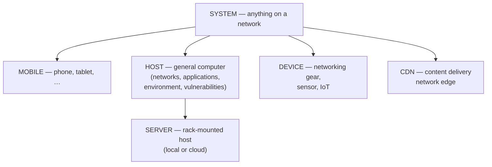

| Nugget | Parent | Meaning |
|--------|--------|---------|
| **`SYSTEM`** | — (root network endpoint) | Provisional: *something* on the network; class not yet qualified |
| **`MOBILE`** | `SYSTEM` | Phone, tablet, or other mobile endpoint |
| **`HOST`** | `SYSTEM` | General-purpose computer; may own category trees (`NETWORKS`, `APPLICATIONS`, `ENVIRONMENT`, `VULNERABILITIES`, …) |
| **`SERVER`** | `SYSTEM` / `HOST` | A `HOST` that is rack-mounted — on-prem or cloud |
| **`DEVICE`** | `SYSTEM` | Network appliance, sensor, or IoT endpoint (not a general computer) |
| **`CDN`** | `SYSTEM` | Content delivery network edge or anycast presence (e.g. Cloudflare, Akamai, Fastly) — on the network but not an origin `HOST` |

### Evidence sufficiency

| Scan class | Typical tools | Endpoint nugget | What you can assert |
|------------|---------------|-----------------|---------------------|
| L2 / ARP discovery | Netdiscover, ARP tables | **`SYSTEM`** | IPv4, MAC, MAC vendor under `NETWORKS` only |
| L3 reachability + ports | Nmap, Naabu | **`HOST`** | Reachability, ports, services when probed |
| Service fingerprint | Nerva | **`HOST`** (via port graph) | Protocol, banners, TLS, misconfigs on open ports |
| CDN / edge detection | Nerva, Nmap headers | **`CDN`** | Edge vendor headers (`Server: cloudflare`, `CF-Ray`, …); not origin infrastructure |
| Deep OS / app stack | Nmap NSE, CMSeeK, … | **`HOST`** + categories | `APPLICATIONS`, `ENVIRONMENT`, `VULNERABILITIES` as evidence allows |

ARP and similar shallow discovery **cannot** justify `HOST`, `DEVICE`, `MOBILE`, `SERVER`, or `CDN` — only **`SYSTEM`** with a **`NETWORKS`** category (`IP_ADDRESS`, `MAC_ADDRESS`, `MAC_VENDOR`). Vendor strings are hints, not proof of class.

When service fingerprinting reveals a **CDN front** (multiple anycast IPs, vendor-specific headers, TLS terminated at edge), classify as **`CDN`** rather than counting each edge IP as a separate origin **`HOST`**. See Ruleset C in `.seed/07_Scan_Record_Host_Correlation_Rulesets.md`.

### `SYSTEM` as a temporary nugget

**`SYSTEM` nodes are provisional.** They represent “an endpoint exists here” until follow-on scans supply enough identity and behaviour to reclassify:

1. **Create** — shallow scan (e.g. Netdiscover) emits `SCAN_RECORD` `contains` `SYSTEM` with `NETWORKS` facts.
2. **Investigate** — port scan, service fingerprint, OS detection, or other enrichment on the same IP/MAC.
3. **Reclassify** — when evidence supports it, replace or correlate the `SYSTEM` with the appropriate qualified type (`HOST`, `DEVICE`, `MOBILE`, `SERVER`, `CDN`) and attach the relevant category subtrees.

Do not promote a `SYSTEM` to `HOST` (or any narrower class) without scan evidence that meets the qualification bar for that class. Correlation and merge rules live in `.seed/07_Scan_Record_Host_Correlation_Rulesets.md`.

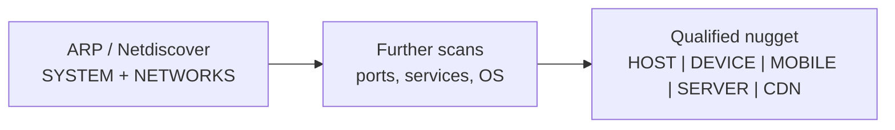

### Tool mapping (today)

| Tool | Endpoint entity | Rationale |
|------|-----------------|-----------|
| **Netdiscover** | `SYSTEM` | IP + MAC + vendor only — insufficient to qualify as `HOST` or `DEVICE` |
| **Nmap** | `HOST` | Reachability, ports, services, OS, trace — general computer evidence |
| **Nerva** | `HOST` (in port/service graph) | Fingerprints open ports; attaches to host/port model, not bare ARP. CDN-fronted targets may warrant **`CDN`** when edge evidence dominates (not yet emitted in corpus graphs) |

Future pipeline stages should **consume** provisional `SYSTEM` nuggets and **emit** qualified replacements rather than duplicating unrelated endpoint nodes.

---

| Relation | Direction | Meaning |
|----------|-----------|---------|
| `contains` | parent → child | Structural ownership (scan→host, host→category, transport→port) |
| `had` | entity → descriptor | Attribute fact on a node (status, version, vendor) |
| `listens-to` | service → port | Application service associated with a transport port (Nmap) |

Instance ids use `uuid5(ontology_seed, nugget_data)` — see each tool’s graph builder.

---

## Shared scan head

Both Nmap and Netdiscover graphs root at one **`SCAN_RECORD`** entity. Scan metadata is attached via **`had`** descriptors (tool-specific names).

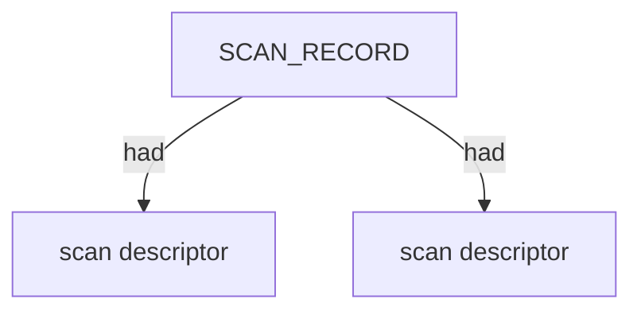

| Tool | Typical scan descriptors |
|------|-------------------------|
| Nmap | `SCAN_CLI`, `SCAN_TARGET`, `SCAN_VERSION`, `SCAN_START`, `SCAN_SUMMARY`, `SCAN_ELAPSED`, `SCAN_TOOL` |
| Netdiscover | `SCAN_ARGS`, `SCAN_TIMESTAMP`, `SCAN_END_TIME`, `SCAN_SUMMARY`, `SCAN_EXIT_STATUS`, `SCAN_TRIES`, `SCAN_EMPTY_SCANS`, `SCAN_DISCOVERED` |

---

## Nmap — host tree

Nmap models reachable **`HOST`** nodes (qualified general computers — not provisional `SYSTEM`). Each host carries reachability descriptors and a **`NETWORKS`** category for L3/L4 facts. See [System qualification hierarchy](#system-qualification-hierarchy).

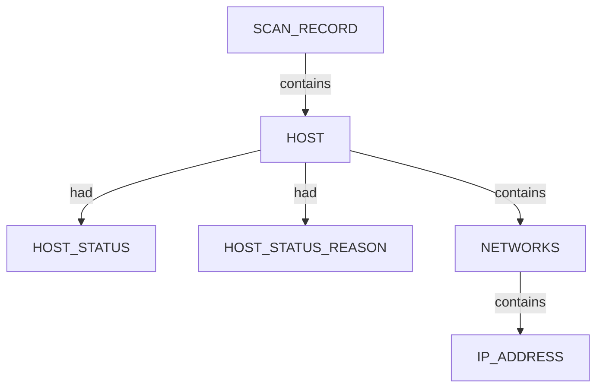

- `HOST` canonical key: primary IPv4 (or first address).
- `INTERNET_NAME` descriptors on `HOST` when Nmap reports hostnames.

---

## Nmap — port and service tree

Port scans add **`APPLICATIONS`** under the host and **`TRANSPORT` → `PORT`** under the IP. Each reported service **`listens-to`** its port whenever Nmap emits `<service name="…">` (including filtered/table-derived names).

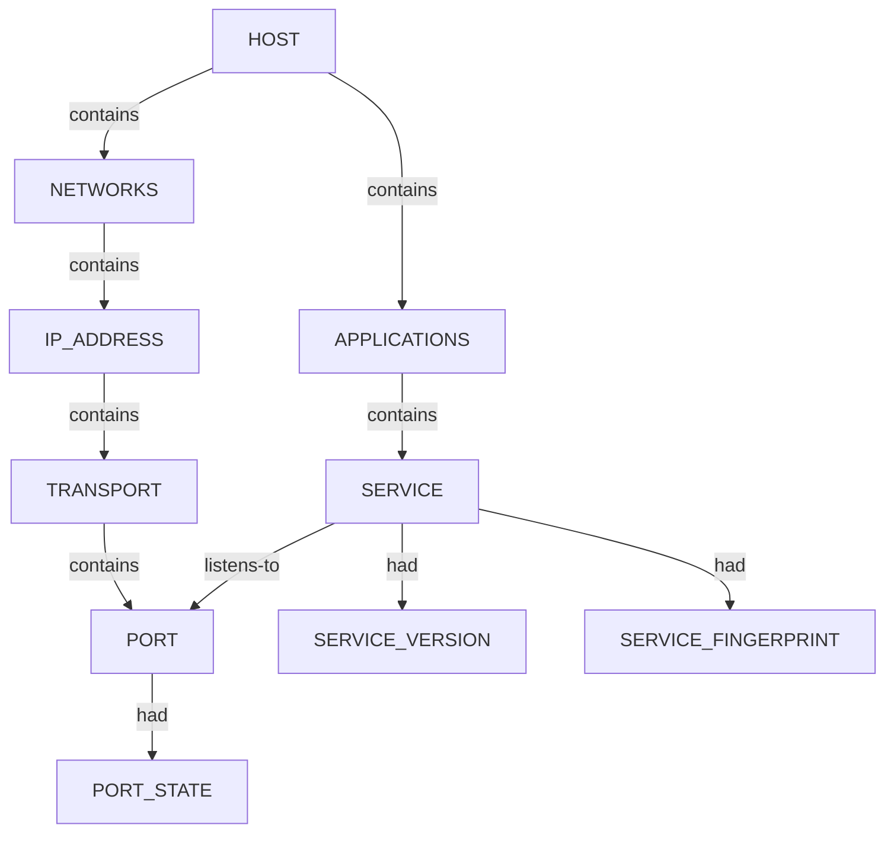

| Nugget | Role |
|--------|------|
| `PORT_STATE` | `open`, `filtered`, `closed`, `open\|filtered` (UDP) |
| `PORT_PROTOCOL` | `tcp` / `udp` on the port node |
| `SERVICE_VERSION` | `product` + `version` from service detection |
| `SERVICE_FINGERPRINT` | Nmap `servicefp` probe string |
| `SERVICE_EXTRAINFO` | Banner fragment / OS hint in `extrainfo` |
| `CPE_URL` | CPE URIs under the service |

---

## Nmap — SSH host keys (NSE)

When `ssh-hostkey` fires on an open SSH port, the **`SERVICE`** **`contains`** key **`SUBENTITY`** nodes (`RSA`, `ECDSA`, `EDDSA`, `DSA`) with bit length, type, and public key descriptors.

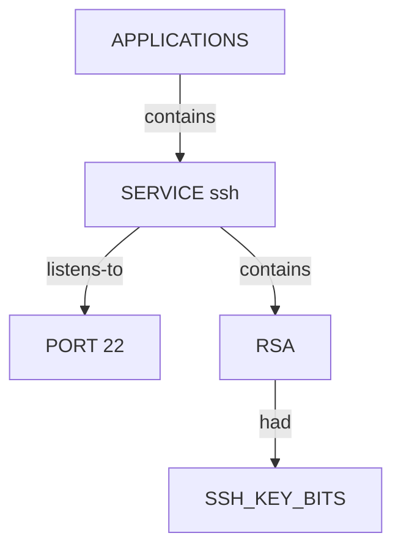

---

## Nmap — OS fingerprint

OS detection adds **`ENVIRONMENT` → `OPERATING_SYSTEM`** with optional **`OS_MATCH_ACCURACY`**.

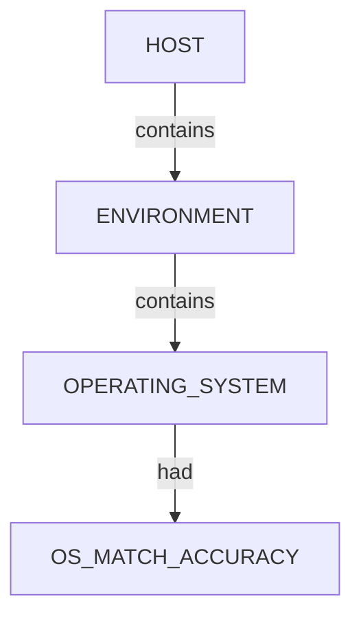

Best `osmatch` by accuracy is selected when multiple matches exist.

---

## Nmap — traceroute trace

Traceroute scenarios add **`TRACE`** under the scan with ordered **`TRACE_HOP`** entities. Each hop **`contains`** a **`HOST`** (router or target).

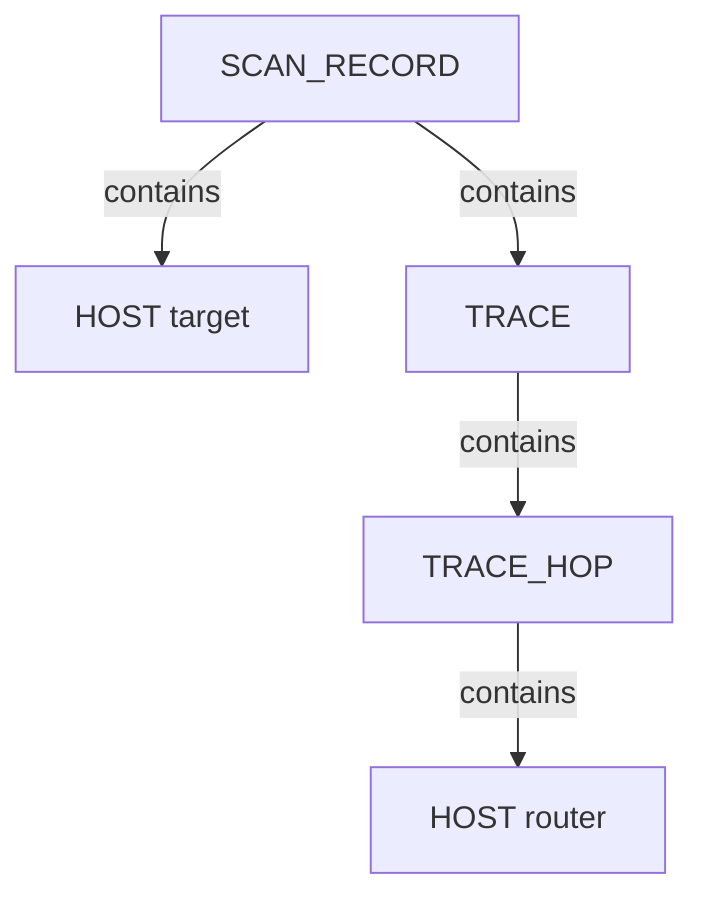

Hop descriptors: `HOP_ORDER`, `HOP_TTL`, `HOP_RTT`, `TRACE_PROTOCOL` on `TRACE`.

---

## Netdiscover — scan head detail

Netdiscover attaches run statistics as scan descriptors (TUI frame counts, discovered host tally).

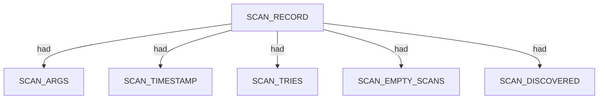

---

## Netdiscover — system tree (provisional)

LAN discovery emits **`SYSTEM`** nodes — **provisional** classification when only MAC vendor and L2/L3 addressing are known (see [System qualification hierarchy](#system-qualification-hierarchy)). Each system owns a **`NETWORKS`** category with IPv4, MAC, and vendor facts. Further scans are required before reclassifying as `HOST`, `DEVICE`, `MOBILE`, `SERVER`, or `CDN`.

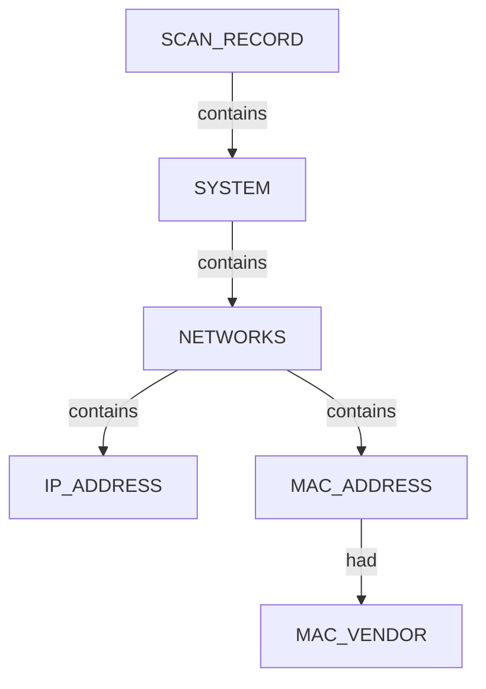

- `NETWORKS` is a **CATEGORY** nugget (`#14B8A6`).
- Identical vendor strings dedupe to one `MAC_VENDOR` node; each MAC links via its own `had` edge.
- Do **not** use `RAW_RIR_DATA` for vendor strings — use `MAC_VENDOR`.

---

## Netdiscover — multi-system scan

Rich subnet scenarios attach many systems to one scan record.

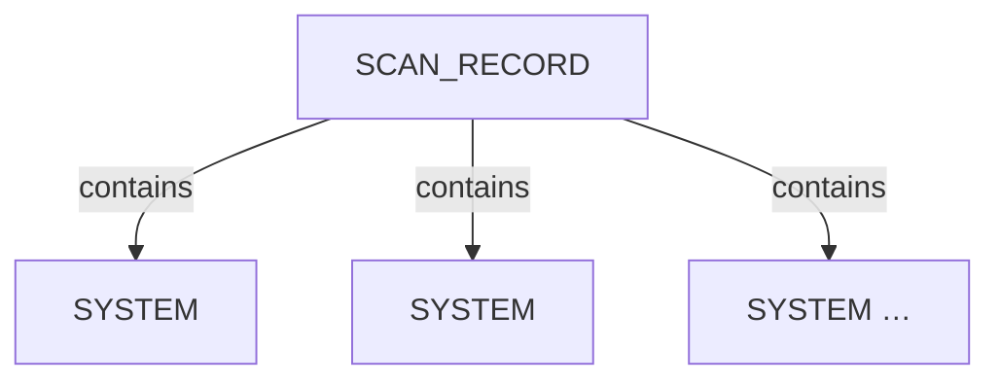

Each system expands to the system tree above (unique `NETWORKS` per IPv4).

Netdiscover examinations do **not** emit `TRACE`, `APPLICATIONS`, or vulnerability categories.

---

## HOST vs SYSTEM (cross-tool)

This table summarises **implemented** CLI profiling output. The qualification model is defined in [System qualification hierarchy](#system-qualification-hierarchy): `SYSTEM` is temporary until enrichment scans justify a narrower class.

| Concept | Nmap | Netdiscover |
|---------|------|-------------|
| Endpoint entity | `HOST` (qualified general computer) | `SYSTEM` (provisional — investigate further) |
| Qualification level | Ports, reachability, services, OS | L2/L3 only: IP, MAC, vendor |
| Reachability | `HOST_STATUS`, `HOST_STATUS_REASON` | (implicit via discovery) |
| L3 address | `IP_ADDRESS` under `NETWORKS` | `IP_ADDRESS` under `NETWORKS` |
| L2 facts | Rare in XML scans | `MAC_ADDRESS` + `MAC_VENDOR` |
| Applications | `APPLICATIONS` / `SERVICE` / ports | Not in scope |
| Next step | Service/OS enrichment (Nerva, …); CDN detection when edge headers present | Port scan → qualify as `HOST`, `DEVICE`, `CDN`, etc. |

Correlation and reclassification rules: `.seed/07_Scan_Record_Host_Correlation_Rulesets.md`.

---

## Typical pipeline placement

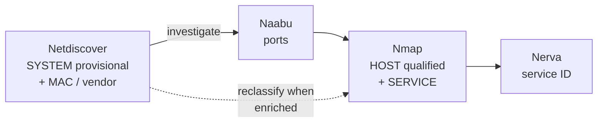

Shallow discovery leaves endpoints as **`SYSTEM`** until port/service/OS evidence supports **`HOST`**, **`DEVICE`**, **`MOBILE`**, **`SERVER`**, or **`CDN`**. Naabu and Nerva skills document downstream enrichment; this doc covers structures **implemented** in the CLI profiling corpus today (Nmap + Netdiscover).

---

## Expansion policy

Add new sections here when a tool lands an approved `*_nugget_graph_structure.md` and graph generator. Keep each Mermaid diagram focused (≤10 nodes where possible). Update the tool table at the top and the master skills index in [CLI_Tool_Skills_&_Documentation.md](CLI_Tool_Skills_&_Documentation.md).
