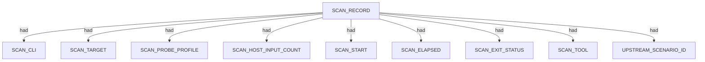
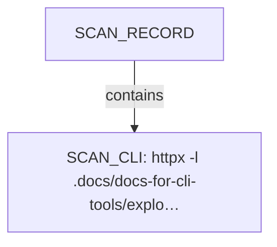
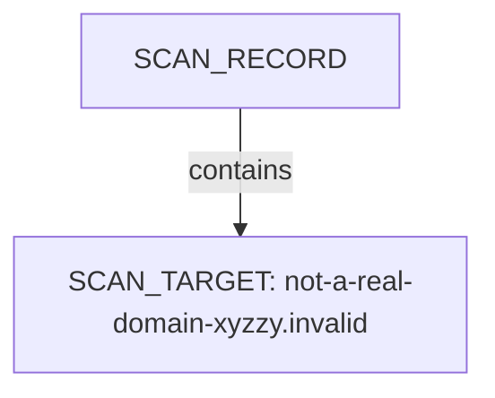
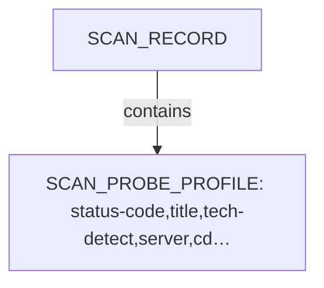
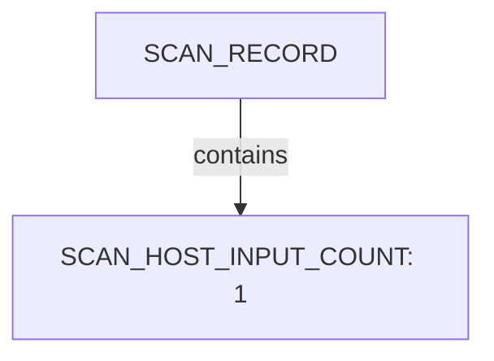
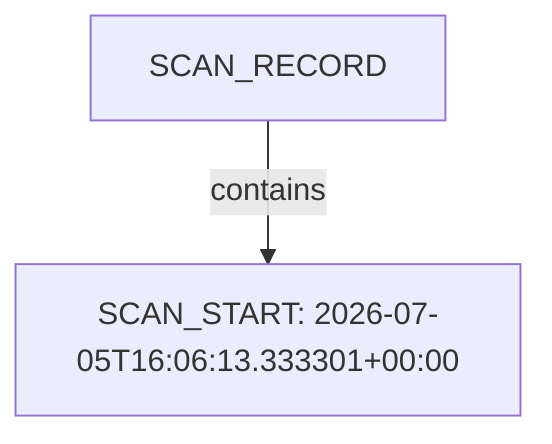
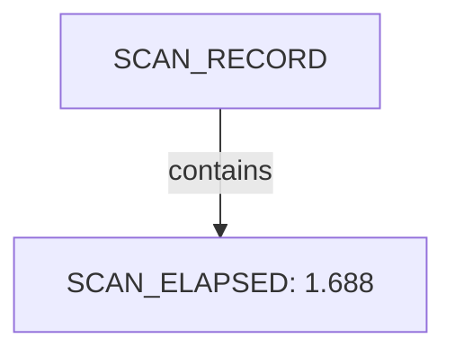
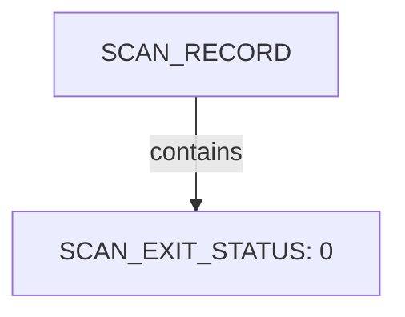
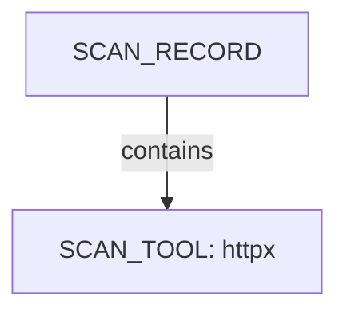
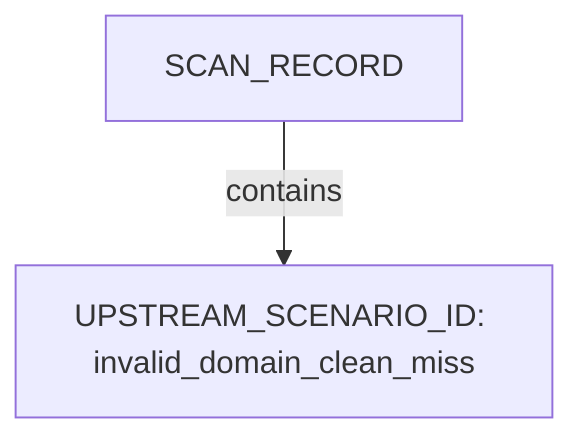

# Httpx scan narrative — `from_subfinder_invalid_clean_miss`

## Introduction

Httpx confirms live web endpoints, HTTP metadata, and technology signals for each probed host under the 10 H0-H7 ruleset.

## Scan

Every examination has one SCAN_RECORD with scan descriptors linked via had. This scan includes **1** Scan root node(s) (e.g. `httpx:not-a-real-domain-xyzzy.invalid:httpx -l .docs/docs-for-cli-tools/exploration_scratch/httpx/hosts/from_subfinder_invalid_clean_miss_hosts.txt -status-code -title -tech-detect -server -cdn -ip -json -no-stdin -o .docs/docs-for-cli-tools/exploration_scratch/httpx/exams/from_subfinder_invalid_clean_miss.jsonl -silent -threads 2 -timeout 10`). Linked structures: `SCAN_CLI`, `SCAN_TARGET`, `SCAN_PROBE_PROFILE`, `SCAN_HOST_INPUT_COUNT`, `SCAN_START`, `SCAN_ELAPSED`.

### Structure overview

### `SCAN_CLI`

| Nugget | Value |
| --- | --- |
| `SCAN_CLI` | `httpx -l .docs/docs-for-cli-tools/exploration_scratch/httpx/hosts/from_subfinder_invalid_clean_miss_hosts.txt -status-code -title -tech-detect -server -cdn -ip -json -no-stdin -o .docs/docs-for-cli-tools/exploration_scratch/httpx/exams/from_subfinder_invalid_clean_miss.jsonl -silent -threads 2 -timeout 10` |

### `SCAN_TARGET`

| Nugget | Value |
| --- | --- |
| `SCAN_TARGET` | `not-a-real-domain-xyzzy.invalid` |

### `SCAN_PROBE_PROFILE`

| Nugget | Value |
| --- | --- |
| `SCAN_PROBE_PROFILE` | `status-code,title,tech-detect,server,cdn,ip` |

### `SCAN_HOST_INPUT_COUNT`

| Nugget | Value |
| --- | --- |
| `SCAN_HOST_INPUT_COUNT` | `1` |

### `SCAN_START`

| Nugget | Value |
| --- | --- |
| `SCAN_START` | `2026-07-05T16:06:13.333301+00:00` |

### `SCAN_ELAPSED`

| Nugget | Value |
| --- | --- |
| `SCAN_ELAPSED` | `1.688` |

### `SCAN_EXIT_STATUS`

| Nugget | Value |
| --- | --- |
| `SCAN_EXIT_STATUS` | `0` |

### `SCAN_TOOL`

| Nugget | Value |
| --- | --- |
| `SCAN_TOOL` | `httpx` |

### `UPSTREAM_SCENARIO_ID`

| Nugget | Value |
| --- | --- |
| `UPSTREAM_SCENARIO_ID` | `invalid_domain_clean_miss` |

## Domains

Apex DOMAIN_NAME entities contain subdomain DOMAIN_NAME children; descriptors capture discovery mode, sources, and liveness. This scan includes **1** Domains root node(s) (e.g. `not-a-real-domain-xyzzy.invalid`). Linked structures: no child categories.

### Structure overview

### Values

| Nugget | Value |
| --- | --- |
| `DOMAIN_NAME` | `not-a-real-domain-xyzzy.invalid` |

## Conclusion

See the appendix for the full node and edge inventory.

## Appendix

### Nodes

| Nugget | Value |
| --- | --- |
| `DOMAIN_NAME` | `not-a-real-domain-xyzzy.invalid` |
| `HTTP_LIVENESS_STATUS` | `unconfirmed` |
| `SCAN_CLI` | `httpx -l .docs/docs-for-cli-tools/exploration_scratch/httpx/hosts/from_subfinder_invalid_clean_miss_hosts.txt -status-code -title -tech-detect -server -cdn -ip -json -no-stdin -o .docs/docs-for-cli-tools/exploration_scratch/httpx/exams/from_subfinder_invalid_clean_miss.jsonl -silent -threads 2 -timeout 10` |
| `SCAN_ELAPSED` | `1.688` |
| `SCAN_EXIT_STATUS` | `0` |
| `SCAN_HOST_INPUT_COUNT` | `1` |
| `SCAN_PROBE_PROFILE` | `status-code,title,tech-detect,server,cdn,ip` |
| `SCAN_RECORD` | `httpx:not-a-real-domain-xyzzy.invalid:httpx -l .docs/docs-for-cli-tools/exploration_scratch/httpx/hosts/from_subfinder_invalid_clean_miss_hosts.txt -status-code -title -tech-detect -server -cdn -ip -json -no-stdin -o .docs/docs-for-cli-tools/exploration_scratch/httpx/exams/from_subfinder_invalid_clean_miss.jsonl -silent -threads 2 -timeout 10` |
| `SCAN_START` | `2026-07-05T16:06:13.333301+00:00` |
| `SCAN_TARGET` | `not-a-real-domain-xyzzy.invalid` |
| `SCAN_TOOL` | `httpx` |
| `UPSTREAM_SCENARIO_ID` | `invalid_domain_clean_miss` |

### Edges

| Source | Relation | Target |
| --- | --- | --- |
| `SCAN_RECORD` | `had` | `SCAN_CLI` |
| `SCAN_RECORD` | `had` | `SCAN_TARGET` |
| `SCAN_RECORD` | `had` | `SCAN_PROBE_PROFILE` |
| `SCAN_RECORD` | `had` | `SCAN_HOST_INPUT_COUNT` |
| `SCAN_RECORD` | `had` | `SCAN_START` |
| `SCAN_RECORD` | `had` | `SCAN_ELAPSED` |
| `SCAN_RECORD` | `had` | `SCAN_EXIT_STATUS` |
| `SCAN_RECORD` | `had` | `SCAN_TOOL` |
| `SCAN_RECORD` | `contains` | `DOMAIN_NAME` |
| `SCAN_RECORD` | `had` | `UPSTREAM_SCENARIO_ID` |
| `DOMAIN_NAME` | `had` | `HTTP_LIVENESS_STATUS` |
---

*OS-Intel Scan*
