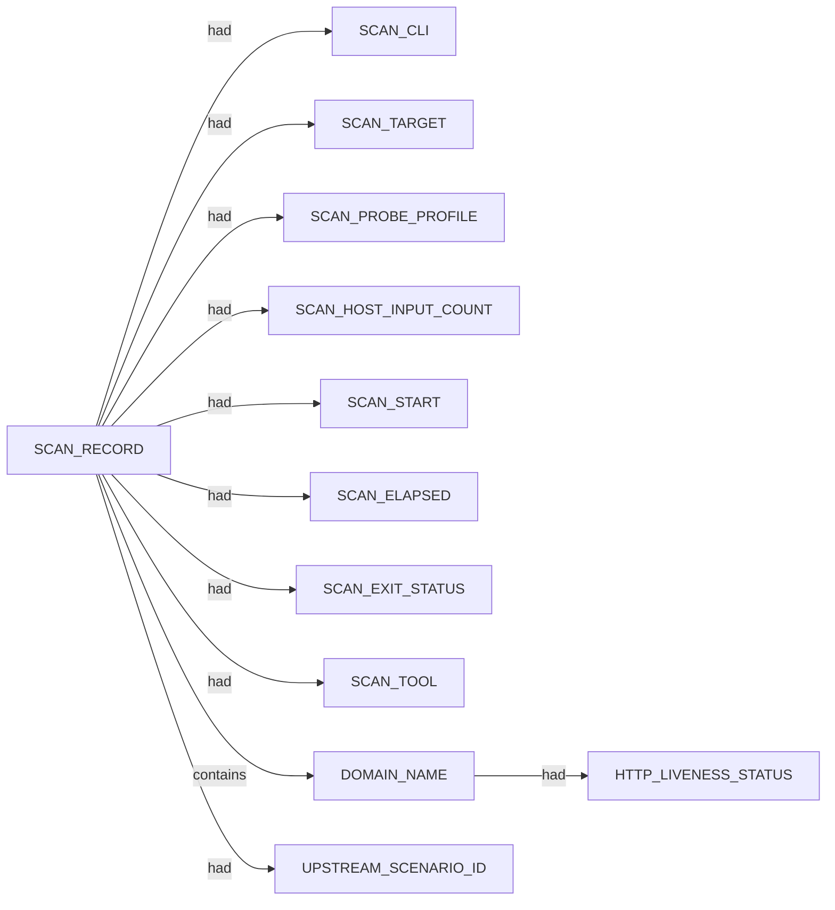

# Httpx scan narrative — `from_subfinder_invalid_clean_miss`

## Introduction

Httpx confirms live web endpoints, HTTP metadata, and technology signals for each probed host under the 10 H0-H7 ruleset.

## Systems

- (none)

## Graph structure (types)

## Trace

_Trace section omitted when no TRACE nodes present._

## Appendix

### Nodes

- `DOMAIN_NAME`: not-a-real-domain-xyzzy.invalid
- `HTTP_LIVENESS_STATUS`: unconfirmed
- `SCAN_CLI`: httpx -l .docs/docs-for-cli-tools/exploration_scratch/httpx/hosts/from_subfinder_invalid_clean_miss_hosts.txt -status-code -title -tech-detect -server -cdn -ip -json -no-stdin -o .docs/docs-for-cli-tools/exploration_scratch/httpx/exams/from_subfinder_invalid_clean_miss.jsonl -silent -threads 2 -timeout 10
- `SCAN_ELAPSED`: 1.688
- `SCAN_EXIT_STATUS`: 0
- `SCAN_HOST_INPUT_COUNT`: 1
- `SCAN_PROBE_PROFILE`: status-code,title,tech-detect,server,cdn,ip
- `SCAN_RECORD`: httpx:not-a-real-domain-xyzzy.invalid:httpx -l .docs/docs-for-cli-tools/exploration_scratch/httpx/hosts/from_subfinder_invalid_clean_miss_hosts.txt -status-code -title -tech-detect -server -cdn -ip -json -no-stdin -o .docs/docs-for-cli-tools/exploration_scratch/httpx/exams/from_subfinder_invalid_clean_miss.jsonl -silent -threads 2 -timeout 10
- `SCAN_START`: 2026-07-05T16:06:13.333301+00:00
- `SCAN_TARGET`: not-a-real-domain-xyzzy.invalid
- `SCAN_TOOL`: httpx
- `UPSTREAM_SCENARIO_ID`: invalid_domain_clean_miss

### Edges

- `SCAN_RECORD` `had` `SCAN_CLI`
- `SCAN_RECORD` `had` `SCAN_TARGET`
- `SCAN_RECORD` `had` `SCAN_PROBE_PROFILE`
- `SCAN_RECORD` `had` `SCAN_HOST_INPUT_COUNT`
- `SCAN_RECORD` `had` `SCAN_START`
- `SCAN_RECORD` `had` `SCAN_ELAPSED`
- `SCAN_RECORD` `had` `SCAN_EXIT_STATUS`
- `SCAN_RECORD` `had` `SCAN_TOOL`
- `SCAN_RECORD` `contains` `DOMAIN_NAME`
- `SCAN_RECORD` `had` `UPSTREAM_SCENARIO_ID`
- `DOMAIN_NAME` `had` `HTTP_LIVENESS_STATUS`
---

*OS-Intel Scan*
