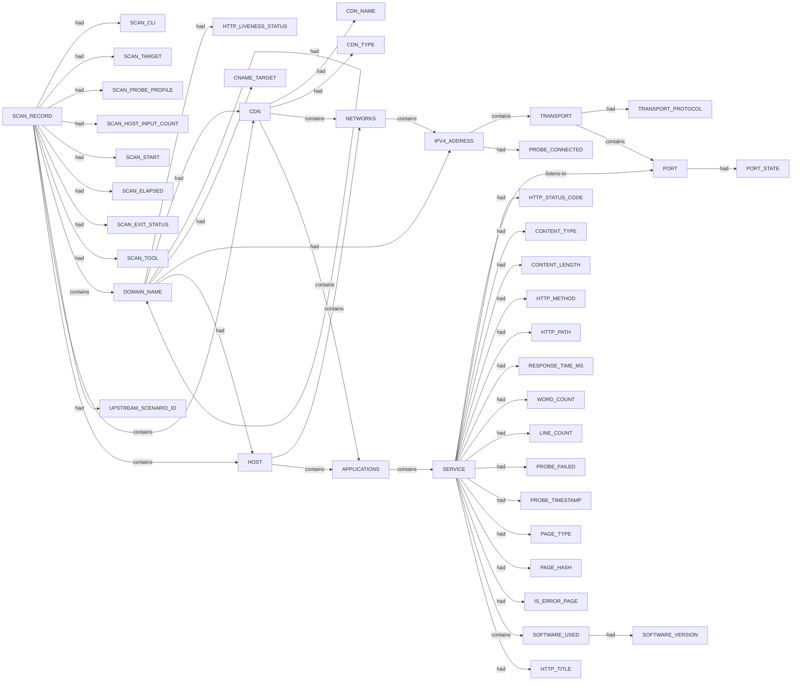

# Httpx scan narrative — `from_subfinder_k2am_passive`

## Introduction

Httpx confirms live web endpoints, HTTP metadata, and technology signals for each probed host under the 10 H0-H7 ruleset.

## Systems

- `CDN` `104.18.34.21`
- `HOST` `101.0.68.158`
- `HOST` `170.187.131.209`

## Graph structure (types)

## Trace

_Trace section omitted when no TRACE nodes present._

## Appendix

### Nodes

- `APPLICATIONS`: APPLICATIONS
- `CDN`: 104.18.34.21
- `CDN_NAME`: cloudflare
- `CDN_TYPE`: waf
- `CNAME_TARGET`: track.smtp2go.net
- `CNAME_TARGET`: unbouncepages.com
- `CONTENT_LENGTH`: 13336
- `CONTENT_LENGTH`: 16
- `CONTENT_LENGTH`: 2334
- `CONTENT_TYPE`: text/html
- `CONTENT_TYPE`: text/plain
- `DOMAIN_NAME`: k2am.com.au
- `DOMAIN_NAME`: kii.k2am.com.au
- `DOMAIN_NAME`: ksm.k2am.com.au
- `DOMAIN_NAME`: link.k2am.com.au
- `DOMAIN_NAME`: track.smtp2go.net
- `DOMAIN_NAME`: unbouncepages.com
- `DOMAIN_NAME`: www.k2am.com.au
- `HOST`: 101.0.68.158
- `HOST`: 170.187.131.209
- `HTTP_LIVENESS_STATUS`: confirmed
- `HTTP_LIVENESS_STATUS`: unconfirmed
- `HTTP_METHOD`: GET
- `HTTP_PATH`: /
- `HTTP_STATUS_CODE`: 200
- `HTTP_STATUS_CODE`: 409
- `HTTP_TITLE`: Home
- `HTTP_TITLE`: SMTP2GO
- `IPV4_ADDRESS`: 101.0.68.158
- `IPV4_ADDRESS`: 104.18.34.21
- `IPV4_ADDRESS`: 170.187.131.209
- `IPV4_ADDRESS`: 172.64.153.235
- `IPV4_ADDRESS`: 185.3.93.228
- `IS_ERROR_PAGE`: true
- `LINE_COUNT`: 1
- `LINE_COUNT`: 419
- `LINE_COUNT`: 84
- `NETWORKS`: NETWORKS
- `PAGE_HASH`: 0
- `PAGE_TYPE`: error
- `PAGE_TYPE`: nonerror
- `PORT`: 443
- `PORT`: 80
- `PORT_STATE`: open
- `PROBE_CONNECTED`: false
- `PROBE_CONNECTED`: true
- `PROBE_FAILED`: False
- `PROBE_TIMESTAMP`: 2026-07-06T02:05:05.3292777+10:00
- `PROBE_TIMESTAMP`: 2026-07-06T02:05:05.3361793+10:00
- `PROBE_TIMESTAMP`: 2026-07-06T02:05:05.4655046+10:00
- `PROBE_TIMESTAMP`: 2026-07-06T02:05:06.2194447+10:00
- `RESPONSE_TIME_MS`: 120.6392ms
- `RESPONSE_TIME_MS`: 23.1847ms
- `RESPONSE_TIME_MS`: 26.6143ms
- `RESPONSE_TIME_MS`: 966.9239ms
- `SCAN_CLI`: httpx -l .docs/docs-for-cli-tools/exploration_scratch/httpx/hosts/from_subfinder_k2am_passive_hosts.txt -status-code -title -tech-detect -server -cdn -ip -json -no-stdin -o .docs/docs-for-cli-tools/exploration_scratch/httpx/exams/from_subfinder_k2am_passive.jsonl -silent -threads 15 -timeout 15 -rate-limit 30
- `SCAN_ELAPSED`: 21.782
- `SCAN_EXIT_STATUS`: 0
- `SCAN_HOST_INPUT_COUNT`: 18
- `SCAN_PROBE_PROFILE`: status-code,title,tech-detect,server,cdn,ip
- `SCAN_RECORD`: httpx:k2am.com.au:httpx -l .docs/docs-for-cli-tools/exploration_scratch/httpx/hosts/from_subfinder_k2am_passive_hosts.txt -status-code -title -tech-detect -server -cdn -ip -json -no-stdin -o .docs/docs-for-cli-tools/exploration_scratch/httpx/exams/from_subfinder_k2am_passive.jsonl -silent -threads 15 -timeout 15 -rate-limit 30
- `SCAN_START`: 2026-07-05T16:05:03.491676+00:00
- `SCAN_TARGET`: k2am.com.au
- `SCAN_TOOL`: httpx
- `SERVICE`: http
- `SERVICE`: https
- `SOFTWARE_USED`: Apache
- `SOFTWARE_USED`: Apache HTTP Server
- `SOFTWARE_USED`: Bootstrap
- `SOFTWARE_USED`: Chart.js
- `SOFTWARE_USED`: Cloudflare
- `SOFTWARE_USED`: D3
- `SOFTWARE_USED`: Google Hosted Libraries
- `SOFTWARE_USED`: HSTS
- `SOFTWARE_USED`: Modernizr
- `SOFTWARE_USED`: PHP
- `SOFTWARE_USED`: Slick
- `SOFTWARE_USED`: cdnjs
- `SOFTWARE_USED`: cloudflare
- `SOFTWARE_USED`: jQuery
- `SOFTWARE_VERSION`: 2.4.0
- `TRANSPORT`: tcp
- `TRANSPORT_PROTOCOL`: tcp
- `UPSTREAM_SCENARIO_ID`: corporate_k2am_passive_cs
- `WORD_COUNT`: 1070
- `WORD_COUNT`: 3
- `WORD_COUNT`: 642

### Edges

- `SCAN_RECORD` `had` `SCAN_CLI`
- `SCAN_RECORD` `had` `SCAN_TARGET`
- `SCAN_RECORD` `had` `SCAN_PROBE_PROFILE`
- `SCAN_RECORD` `had` `SCAN_HOST_INPUT_COUNT`
- `SCAN_RECORD` `had` `SCAN_START`
- `SCAN_RECORD` `had` `SCAN_ELAPSED`
- `SCAN_RECORD` `had` `SCAN_EXIT_STATUS`
- `SCAN_RECORD` `had` `SCAN_TOOL`
- `SCAN_RECORD` `contains` `DOMAIN_NAME`
- `SCAN_RECORD` `had` `UPSTREAM_SCENARIO_ID`
- `SCAN_RECORD` `contains` `DOMAIN_NAME`
- `DOMAIN_NAME` `had` `HTTP_LIVENESS_STATUS`
- `SCAN_RECORD` `contains` `CDN`
- `DOMAIN_NAME` `had` `CDN`
- `CDN` `had` `CDN_NAME`
- `CDN` `had` `CDN_TYPE`
- `CDN` `contains` `NETWORKS`
- `NETWORKS` `contains` `IPV4_ADDRESS`
- `IPV4_ADDRESS` `contains` `TRANSPORT`
- `TRANSPORT` `had` `TRANSPORT_PROTOCOL`
- `TRANSPORT` `contains` `PORT`
- `PORT` `had` `PORT_STATE`
- `CDN` `contains` `APPLICATIONS`
- `APPLICATIONS` `contains` `SERVICE`
- `SERVICE` `listens-to` `PORT`
- `SERVICE` `had` `HTTP_STATUS_CODE`
- `SERVICE` `had` `CONTENT_TYPE`
- `SERVICE` `had` `CONTENT_LENGTH`
- `SERVICE` `had` `HTTP_METHOD`
- `SERVICE` `had` `HTTP_PATH`
- `SERVICE` `had` `RESPONSE_TIME_MS`
- `SERVICE` `had` `WORD_COUNT`
- `SERVICE` `had` `LINE_COUNT`
- `SERVICE` `had` `PROBE_FAILED`
- `SERVICE` `had` `PROBE_TIMESTAMP`
- `SERVICE` `had` `PAGE_TYPE`
- `SERVICE` `had` `PAGE_HASH`
- `SERVICE` `had` `IS_ERROR_PAGE`
- `SERVICE` `contains` `SOFTWARE_USED`
- `SERVICE` `contains` `SOFTWARE_USED`
- `DOMAIN_NAME` `had` `DOMAIN_NAME`
- `DOMAIN_NAME` `had` `CNAME_TARGET`
- `DOMAIN_NAME` `had` `IPV4_ADDRESS`
- `IPV4_ADDRESS` `had` `PROBE_CONNECTED`
- `DOMAIN_NAME` `had` `IPV4_ADDRESS`
- `IPV4_ADDRESS` `had` `PROBE_CONNECTED`
- `SCAN_RECORD` `contains` `DOMAIN_NAME`
- `DOMAIN_NAME` `had` `HTTP_LIVENESS_STATUS`
- `DOMAIN_NAME` `had` `CDN`
- `NETWORKS` `contains` `IPV4_ADDRESS`
- `IPV4_ADDRESS` `contains` `TRANSPORT`
- `SERVICE` `had` `RESPONSE_TIME_MS`
- `SERVICE` `had` `PROBE_TIMESTAMP`
- `DOMAIN_NAME` `had` `DOMAIN_NAME`
- `DOMAIN_NAME` `had` `CNAME_TARGET`
- `DOMAIN_NAME` `had` `IPV4_ADDRESS`
- `DOMAIN_NAME` `had` `IPV4_ADDRESS`
- `SCAN_RECORD` `contains` `DOMAIN_NAME`
- `DOMAIN_NAME` `had` `HTTP_LIVENESS_STATUS`
- `SCAN_RECORD` `contains` `HOST`
- `DOMAIN_NAME` `had` `HOST`
- `HOST` `contains` `NETWORKS`
- `NETWORKS` `contains` `IPV4_ADDRESS`
- `IPV4_ADDRESS` `contains` `TRANSPORT`
- `TRANSPORT` `contains` `PORT`
- `PORT` `had` `PORT_STATE`
- `HOST` `contains` `APPLICATIONS`
- `APPLICATIONS` `contains` `SERVICE`
- `SERVICE` `listens-to` `PORT`
- `SERVICE` `had` `HTTP_STATUS_CODE`
- `SERVICE` `had` `HTTP_TITLE`
- `SERVICE` `had` `CONTENT_TYPE`
- `SERVICE` `had` `CONTENT_LENGTH`
- `SERVICE` `had` `HTTP_METHOD`
- `SERVICE` `had` `HTTP_PATH`
- `SERVICE` `had` `RESPONSE_TIME_MS`
- `SERVICE` `had` `WORD_COUNT`
- `SERVICE` `had` `LINE_COUNT`
- `SERVICE` `had` `PROBE_FAILED`
- `SERVICE` `had` `PROBE_TIMESTAMP`
- `SERVICE` `had` `PAGE_TYPE`
- `SERVICE` `had` `PAGE_HASH`
- `SERVICE` `contains` `SOFTWARE_USED`
- `SERVICE` `contains` `SOFTWARE_USED`
- `SERVICE` `contains` `SOFTWARE_USED`
- `SERVICE` `contains` `SOFTWARE_USED`
- `SOFTWARE_USED` `had` `SOFTWARE_VERSION`
- `SERVICE` `contains` `SOFTWARE_USED`
- `SERVICE` `contains` `SOFTWARE_USED`
- `SERVICE` `contains` `SOFTWARE_USED`
- `SERVICE` `contains` `SOFTWARE_USED`
- `SERVICE` `contains` `SOFTWARE_USED`
- `SERVICE` `contains` `SOFTWARE_USED`
- `SERVICE` `contains` `SOFTWARE_USED`
- `SERVICE` `contains` `SOFTWARE_USED`
- `DOMAIN_NAME` `had` `IPV4_ADDRESS`
- `IPV4_ADDRESS` `had` `PROBE_CONNECTED`
- `SCAN_RECORD` `contains` `DOMAIN_NAME`
- `DOMAIN_NAME` `had` `HTTP_LIVENESS_STATUS`
- `SCAN_RECORD` `contains` `HOST`
- `DOMAIN_NAME` `had` `HOST`
- `HOST` `contains` `NETWORKS`
- `NETWORKS` `contains` `IPV4_ADDRESS`
- `IPV4_ADDRESS` `contains` `TRANSPORT`
- `HOST` `contains` `APPLICATIONS`
- `SERVICE` `had` `HTTP_TITLE`
- `SERVICE` `had` `CONTENT_LENGTH`
- `SERVICE` `had` `RESPONSE_TIME_MS`
- `SERVICE` `had` `WORD_COUNT`
- `SERVICE` `had` `LINE_COUNT`
- `SERVICE` `had` `PROBE_TIMESTAMP`
- `SERVICE` `contains` `SOFTWARE_USED`
- `DOMAIN_NAME` `had` `DOMAIN_NAME`
- `DOMAIN_NAME` `had` `CNAME_TARGET`
- `DOMAIN_NAME` `had` `IPV4_ADDRESS`
- `IPV4_ADDRESS` `had` `PROBE_CONNECTED`
- `DOMAIN_NAME` `had` `IPV4_ADDRESS`
- `IPV4_ADDRESS` `had` `PROBE_CONNECTED`
- `DOMAIN_NAME` `had` `HTTP_LIVENESS_STATUS`
---

*OS-Intel Scan*
