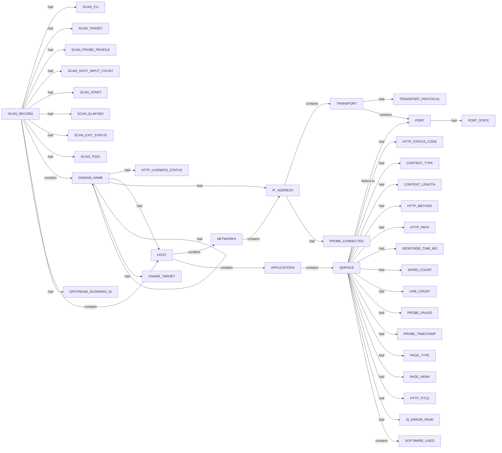

# Httpx scan narrative — `from_subfinder_sbs`

## Introduction

Httpx confirms live web endpoints, HTTP metadata, and technology signals for each probed host under the 10 H0-H7 ruleset.

## Systems

- `HOST` `13.210.120.114`
- `HOST` `13.210.130.172`
- `HOST` `13.237.12.131`
- `HOST` `13.237.197.229`
- `HOST` `13.237.58.83`
- `HOST` `13.238.34.135`
- `HOST` `13.54.122.52`
- `HOST` `13.54.222.221`
- `HOST` `13.54.88.31`
- `HOST` `15.135.231.191`
- `HOST` `15.135.250.251`
- `HOST` `16.176.78.230`
- `HOST` `203.134.85.130`
- `HOST` `23.221.132.253`
- `HOST` `2403:4800:2003:2a6::1b99`
- `HOST` `3.104.193.132`
- `HOST` `3.104.24.28`
- `HOST` `3.104.41.239`
- `HOST` `3.104.69.171`
- `HOST` `3.105.227.54`
- `HOST` `3.106.25.208`
- `HOST` `3.175.115.32`
- `HOST` `3.24.131.34`
- `HOST` `3.24.143.83`
- `HOST` `3.24.27.97`
- `HOST` `3.24.91.49`
- `HOST` `3.25.21.202`
- `HOST` `3.33.238.52`
- `HOST` `32.236.178.94`
- `HOST` `32.236.21.220`
- `HOST` `32.236.214.47`
- `HOST` `32.236.65.92`
- `HOST` `32.237.2.14`
- `HOST` `32.237.8.204`
- `HOST` `34.198.3.175`
- `HOST` `52.62.1.74`
- `HOST` `52.62.18.15`
- `HOST` `52.63.142.191`
- `HOST` `52.63.158.242`
- `HOST` `52.63.78.84`
- `HOST` `52.64.156.164`
- `HOST` `52.64.45.174`
- `HOST` `52.65.212.70`
- `HOST` `54.153.170.132`
- `HOST` `54.252.110.155`
- `HOST` `54.252.83.34`
- `HOST` `54.253.119.201`
- `HOST` `54.253.45.17`
- `HOST` `54.66.100.140`
- `HOST` `54.79.234.201`

## Graph structure (types)

## Trace

_Trace section omitted when no TRACE nodes present._

## Appendix

### Nodes

- `APPLICATIONS`: APPLICATIONS
- `CNAME_TARGET`: account-sbs-com-au.uc17.janrain.ws
- `CNAME_TARGET`: api.sbs.com.au.edgekey.net
- `CNAME_TARGET`: apix-auth.sbs.com.au.edgekey.net
- `CNAME_TARGET`: e116036.b.akamaiedge.net
- `CNAME_TARGET`: e7065.b.akamaiedge.net
- `CNAME_TARGET`: e7065.dsct.akamaiedge.net
- `CNAME_TARGET`: images.sbs.com.au.edgekey.net
- `CNAME_TARGET`: nginx-direct.edsprd01.aws.sbs.com.au
- `CNAME_TARGET`: www.prod.sbs.com.au
- `CONTENT_LENGTH`: 0
- `CONTENT_LENGTH`: 134
- `CONTENT_LENGTH`: 1344
- `CONTENT_LENGTH`: 18
- `CONTENT_LENGTH`: 2046
- `CONTENT_LENGTH`: 2180
- `CONTENT_LENGTH`: 23
- `CONTENT_LENGTH`: 230
- `CONTENT_LENGTH`: 263
- `CONTENT_LENGTH`: 36
- `CONTENT_LENGTH`: 42
- `CONTENT_LENGTH`: 50
- `CONTENT_LENGTH`: 548
- `CONTENT_TYPE`: application/json
- `CONTENT_TYPE`: application/xml
- `CONTENT_TYPE`: text/html
- `CONTENT_TYPE`: text/plain
- `DOMAIN_NAME`: account-sbs-com-au.uc17.janrain.ws
- `DOMAIN_NAME`: account.sbs.com.au
- `DOMAIN_NAME`: after64.sbs.com.au
- `DOMAIN_NAME`: amp.sbs.com.au
- `DOMAIN_NAME`: api.sbs.com.au
- `DOMAIN_NAME`: api.sbs.com.au.edgekey.net
- `DOMAIN_NAME`: apix-auth.sbs.com.au.edgekey.net
- `DOMAIN_NAME`: assets.sbs.com.au
- `DOMAIN_NAME`: auth.sbs.com.au
- `DOMAIN_NAME`: e116036.b.akamaiedge.net
- `DOMAIN_NAME`: e7065.b.akamaiedge.net
- `DOMAIN_NAME`: e7065.dsct.akamaiedge.net
- `DOMAIN_NAME`: epgservice.c.aws.sbs.com.au
- `DOMAIN_NAME`: fda-docs.c.aws.sbs.com.au
- `DOMAIN_NAME`: fos.adobe.edsqa01.aws.sbs.com.au
- `DOMAIN_NAME`: fos.alego-1.edsqa01.aws.sbs.com.au
- `DOMAIN_NAME`: fos.alego.edsqa01.aws.sbs.com.au
- `DOMAIN_NAME`: fos.alejandrogo.edsqa01.aws.sbs.com.au
- `DOMAIN_NAME`: fos.analytics.edsqa01.aws.sbs.com.au
- `DOMAIN_NAME`: fos.beta.edsqa01.aws.sbs.com.au
- `DOMAIN_NAME`: fos.bspcloud.edsqa01.aws.sbs.com.au
- `DOMAIN_NAME`: fos.chrisfo-1.edsqa01.aws.sbs.com.au
- `DOMAIN_NAME`: fos.chrisfo.edsqa01.aws.sbs.com.au
- `DOMAIN_NAME`: fos.cloud.edsqa01.aws.sbs.com.au
- `DOMAIN_NAME`: fos.dan-1.edsqa01.aws.sbs.com.au
- `DOMAIN_NAME`: fos.dan.edsdev01.aws.sbs.com.au
- `DOMAIN_NAME`: fos.dan.edsqa01.aws.sbs.com.au
- `DOMAIN_NAME`: fos.freeze.edsdev01.aws.sbs.com.au
- `DOMAIN_NAME`: fos.mad-1.edsdev01.aws.sbs.com.au
- `DOMAIN_NAME`: fos.migrate.edsprd01.aws.sbs.com.au
- `DOMAIN_NAME`: fos.mkoga-1.edsdev01.aws.sbs.com.au
- `DOMAIN_NAME`: fos.mkoga-2.edsdev01.aws.sbs.com.au
- `DOMAIN_NAME`: fos.pform.edsprd01.aws.sbs.com.au
- `DOMAIN_NAME`: fos.platform.edsprd01.aws.sbs.com.au
- `DOMAIN_NAME`: fos.prod.edsprd01.aws.sbs.com.au
- `DOMAIN_NAME`: fos.sdk.edsdev01.aws.sbs.com.au
- `DOMAIN_NAME`: fos.xander-1.edsdev01.aws.sbs.com.au
- `DOMAIN_NAME`: fos.xanderbo.edsdev01.aws.sbs.com.au
- `DOMAIN_NAME`: fusion-ses.prod.edsprd01.aws.sbs.com.au
- `DOMAIN_NAME`: images.sbs.com.au.edgekey.net
- `DOMAIN_NAME`: mobilelayer-dev01.edsdev02.aws.sbs.com.au
- `DOMAIN_NAME`: mobilelayer-dev02.edsdev02.aws.sbs.com.au
- `DOMAIN_NAME`: mobilelayer.edsdev02.aws.sbs.com.au
- `DOMAIN_NAME`: mobilelayer.edsprd01.aws.sbs.com.au
- `DOMAIN_NAME`: nginx-direct.edsprd01.aws.sbs.com.au
- `DOMAIN_NAME`: nginx-video.edsprd01.aws.sbs.com.au
- `DOMAIN_NAME`: phoenix.analytics.edsqa01.aws.sbs.com.au
- `DOMAIN_NAME`: phoenix.beta.edsqa01.aws.sbs.com.au
- `DOMAIN_NAME`: phoenix.chrisfo-1.edsqa01.aws.sbs.com.au
- `DOMAIN_NAME`: phoenix.chrisfo-2.edsqa01.aws.sbs.com.au
- `DOMAIN_NAME`: phoenix.chrisfo-40.edsqa01.aws.sbs.com.au
- `DOMAIN_NAME`: phoenix.chrisfo.edsqa01.aws.sbs.com.au
- `DOMAIN_NAME`: phoenix.chrisha.edsqa01.aws.sbs.com.au
- `DOMAIN_NAME`: phoenix.danielpe-1.edsqa01.aws.sbs.com.au
- `DOMAIN_NAME`: phoenix.danielpe-2.edsqa01.aws.sbs.com.au
- `DOMAIN_NAME`: phoenix.danielpe-3.edsqa01.aws.sbs.com.au
- `DOMAIN_NAME`: phoenix.freeze.edsdev01.aws.sbs.com.au
- `DOMAIN_NAME`: phoenix.prod.edsprd01.aws.sbs.com.au
- `DOMAIN_NAME`: sbs.com.au
- `DOMAIN_NAME`: www.prod.sbs.com.au
- `HOST`: 13.210.120.114
- `HOST`: 13.210.130.172
- `HOST`: 13.237.12.131
- `HOST`: 13.237.197.229
- `HOST`: 13.237.58.83
- `HOST`: 13.238.34.135
- `HOST`: 13.54.122.52
- `HOST`: 13.54.222.221
- `HOST`: 13.54.88.31
- `HOST`: 15.135.231.191
- `HOST`: 15.135.250.251
- `HOST`: 16.176.78.230
- `HOST`: 203.134.85.130
- `HOST`: 23.221.132.253
- `HOST`: 2403:4800:2003:2a6::1b99
- `HOST`: 3.104.193.132
- `HOST`: 3.104.24.28
- `HOST`: 3.104.41.239
- `HOST`: 3.104.69.171
- `HOST`: 3.105.227.54
- `HOST`: 3.106.25.208
- `HOST`: 3.175.115.32
- `HOST`: 3.24.131.34
- `HOST`: 3.24.143.83
- `HOST`: 3.24.27.97
- `HOST`: 3.24.91.49
- `HOST`: 3.25.21.202
- `HOST`: 3.33.238.52
- `HOST`: 32.236.178.94
- `HOST`: 32.236.21.220
- `HOST`: 32.236.214.47
- `HOST`: 32.236.65.92
- `HOST`: 32.237.2.14
- `HOST`: 32.237.8.204
- `HOST`: 34.198.3.175
- `HOST`: 52.62.1.74
- `HOST`: 52.62.18.15
- `HOST`: 52.63.142.191
- `HOST`: 52.63.158.242
- `HOST`: 52.63.78.84
- `HOST`: 52.64.156.164
- `HOST`: 52.64.45.174
- `HOST`: 52.65.212.70
- `HOST`: 54.153.170.132
- `HOST`: 54.252.110.155
- `HOST`: 54.252.83.34
- `HOST`: 54.253.119.201
- `HOST`: 54.253.45.17
- `HOST`: 54.66.100.140
- `HOST`: 54.79.234.201
- `HTTP_LIVENESS_STATUS`: confirmed
- `HTTP_LIVENESS_STATUS`: unconfirmed
- `HTTP_METHOD`: GET
- `HTTP_PATH`: /
- `HTTP_STATUS_CODE`: 200
- `HTTP_STATUS_CODE`: 301
- `HTTP_STATUS_CODE`: 401
- `HTTP_STATUS_CODE`: 403
- `HTTP_STATUS_CODE`: 404
- `HTTP_STATUS_CODE`: 500
- `HTTP_TITLE`: 301 Moved Permanently
- `HTTP_TITLE`: 404 Not Found
- `HTTP_TITLE`: Login Form
- `IP_ADDRESS`: 13.210.120.114
- `IP_ADDRESS`: 13.210.130.172
- `IP_ADDRESS`: 13.210.214.39
- `IP_ADDRESS`: 13.210.60.51
- `IP_ADDRESS`: 13.211.120.68
- `IP_ADDRESS`: 13.211.183.227
- `IP_ADDRESS`: 13.236.149.221
- `IP_ADDRESS`: 13.236.22.8
- `IP_ADDRESS`: 13.236.249.149
- `IP_ADDRESS`: 13.237.119.135
- `IP_ADDRESS`: 13.237.12.131
- `IP_ADDRESS`: 13.237.143.49
- `IP_ADDRESS`: 13.237.146.126
- `IP_ADDRESS`: 13.237.197.229
- `IP_ADDRESS`: 13.237.238.217
- `IP_ADDRESS`: 13.237.58.83
- `IP_ADDRESS`: 13.238.16.115
- `IP_ADDRESS`: 13.238.162.164
- `IP_ADDRESS`: 13.238.234.29
- `IP_ADDRESS`: 13.238.246.184
- `IP_ADDRESS`: 13.238.34.135
- `IP_ADDRESS`: 13.238.54.62
- `IP_ADDRESS`: 13.238.57.62
- `IP_ADDRESS`: 13.238.69.233
- `IP_ADDRESS`: 13.238.8.247
- `IP_ADDRESS`: 13.238.85.150
- `IP_ADDRESS`: 13.54.122.52
- `IP_ADDRESS`: 13.54.177.114
- `IP_ADDRESS`: 13.54.201.213
- `IP_ADDRESS`: 13.54.222.221
- `IP_ADDRESS`: 13.54.35.250
- `IP_ADDRESS`: 13.54.88.31
- `IP_ADDRESS`: 13.55.163.12
- `IP_ADDRESS`: 13.55.238.1
- `IP_ADDRESS`: 13.55.61.35
- `IP_ADDRESS`: 15.134.108.21
- `IP_ADDRESS`: 15.134.147.169
- `IP_ADDRESS`: 15.134.177.243
- `IP_ADDRESS`: 15.134.193.138
- `IP_ADDRESS`: 15.134.83.107
- `IP_ADDRESS`: 15.135.102.109
- `IP_ADDRESS`: 15.135.16.204
- `IP_ADDRESS`: 15.135.231.191
- `IP_ADDRESS`: 15.135.250.251
- `IP_ADDRESS`: 15.197.243.27
- `IP_ADDRESS`: 16.176.112.161
- `IP_ADDRESS`: 16.176.235.198
- `IP_ADDRESS`: 16.176.43.10
- `IP_ADDRESS`: 16.176.68.125
- `IP_ADDRESS`: 16.176.78.230
- `IP_ADDRESS`: 2.18.109.51
- `IP_ADDRESS`: 203.134.85.114
- `IP_ADDRESS`: 203.134.85.130
- `IP_ADDRESS`: 23.221.132.253
- `IP_ADDRESS`: 3.104.127.208
- `IP_ADDRESS`: 3.104.133.8
- `IP_ADDRESS`: 3.104.193.132
- `IP_ADDRESS`: 3.104.22.44
- `IP_ADDRESS`: 3.104.24.28
- `IP_ADDRESS`: 3.104.41.239
- `IP_ADDRESS`: 3.104.69.171
- `IP_ADDRESS`: 3.105.140.230
- `IP_ADDRESS`: 3.105.221.184
- `IP_ADDRESS`: 3.105.227.54
- `IP_ADDRESS`: 3.106.158.95
- `IP_ADDRESS`: 3.106.177.141
- `IP_ADDRESS`: 3.106.25.208
- `IP_ADDRESS`: 3.106.71.19
- `IP_ADDRESS`: 3.175.115.20
- `IP_ADDRESS`: 3.175.115.32
- `IP_ADDRESS`: 3.175.115.62
- `IP_ADDRESS`: 3.175.115.69
- `IP_ADDRESS`: 3.24.131.34
- `IP_ADDRESS`: 3.24.142.167
- `IP_ADDRESS`: 3.24.143.83
- `IP_ADDRESS`: 3.24.243.194
- `IP_ADDRESS`: 3.24.27.97
- `IP_ADDRESS`: 3.24.82.167
- `IP_ADDRESS`: 3.24.91.49
- `IP_ADDRESS`: 3.24.93.166
- `IP_ADDRESS`: 3.25.16.170
- `IP_ADDRESS`: 3.25.21.202
- `IP_ADDRESS`: 3.25.247.150
- `IP_ADDRESS`: 3.33.238.52
- `IP_ADDRESS`: 32.236.110.5
- `IP_ADDRESS`: 32.236.123.159
- `IP_ADDRESS`: 32.236.178.119
- `IP_ADDRESS`: 32.236.178.94
- `IP_ADDRESS`: 32.236.21.220
- `IP_ADDRESS`: 32.236.214.47
- `IP_ADDRESS`: 32.236.244.145
- `IP_ADDRESS`: 32.236.247.81
- `IP_ADDRESS`: 32.236.65.92
- `IP_ADDRESS`: 32.236.68.181
- `IP_ADDRESS`: 32.237.2.14
- `IP_ADDRESS`: 32.237.8.204
- `IP_ADDRESS`: 34.197.146.191
- `IP_ADDRESS`: 34.198.3.175
- `IP_ADDRESS`: 35.153.221.201
- `IP_ADDRESS`: 52.201.19.17
- `IP_ADDRESS`: 52.62.1.74
- `IP_ADDRESS`: 52.62.148.123
- `IP_ADDRESS`: 52.62.18.15
- `IP_ADDRESS`: 52.62.214.158
- `IP_ADDRESS`: 52.62.216.77
- `IP_ADDRESS`: 52.62.58.46
- `IP_ADDRESS`: 52.62.80.127
- `IP_ADDRESS`: 52.63.142.191
- `IP_ADDRESS`: 52.63.158.242
- `IP_ADDRESS`: 52.63.78.84
- `IP_ADDRESS`: 52.64.106.73
- `IP_ADDRESS`: 52.64.156.164
- `IP_ADDRESS`: 52.64.206.168
- `IP_ADDRESS`: 52.64.251.45
- `IP_ADDRESS`: 52.64.45.174
- `IP_ADDRESS`: 52.64.94.126
- `IP_ADDRESS`: 52.65.202.190
- `IP_ADDRESS`: 52.65.212.70
- `IP_ADDRESS`: 54.153.167.45
- `IP_ADDRESS`: 54.153.170.132
- `IP_ADDRESS`: 54.206.80.61
- `IP_ADDRESS`: 54.252.110.155
- `IP_ADDRESS`: 54.252.83.34
- `IP_ADDRESS`: 54.253.119.201
- `IP_ADDRESS`: 54.253.177.204
- `IP_ADDRESS`: 54.253.200.91
- `IP_ADDRESS`: 54.253.212.250
- `IP_ADDRESS`: 54.253.45.17
- `IP_ADDRESS`: 54.253.92.41
- `IP_ADDRESS`: 54.66.100.140
- `IP_ADDRESS`: 54.66.11.221
- `IP_ADDRESS`: 54.66.158.34
- `IP_ADDRESS`: 54.66.161.248
- `IP_ADDRESS`: 54.66.194.201
- `IP_ADDRESS`: 54.79.173.122
- `IP_ADDRESS`: 54.79.234.201
- `IP_ADDRESS`: 54.79.238.221
- `IP_ADDRESS`: 54.79.69.117
- `IS_ERROR_PAGE`: true
- `LINE_COUNT`: 0
- `LINE_COUNT`: 1
- `LINE_COUNT`: 13
- `LINE_COUNT`: 2
- `LINE_COUNT`: 27
- `LINE_COUNT`: 6
- `LINE_COUNT`: 72
- `LINE_COUNT`: 74
- `NETWORKS`: NETWORKS
- `PAGE_HASH`: 0
- `PAGE_TYPE`: error
- `PAGE_TYPE`: login
- `PAGE_TYPE`: nonerror
- `PAGE_TYPE`: other
- `PORT`: 443
- `PORT_STATE`: open
- `PROBE_CONNECTED`: false
- `PROBE_CONNECTED`: true
- `PROBE_FAILED`: False
- `PROBE_TIMESTAMP`: 2026-07-06T02:06:10.6493162+10:00
- `PROBE_TIMESTAMP`: 2026-07-06T02:06:10.6577173+10:00
- `PROBE_TIMESTAMP`: 2026-07-06T02:06:10.6582234+10:00
- `PROBE_TIMESTAMP`: 2026-07-06T02:06:10.6619842+10:00
- `PROBE_TIMESTAMP`: 2026-07-06T02:06:10.6649133+10:00
- `PROBE_TIMESTAMP`: 2026-07-06T02:06:10.6664882+10:00
- `PROBE_TIMESTAMP`: 2026-07-06T02:06:10.6680103+10:00
- `PROBE_TIMESTAMP`: 2026-07-06T02:06:10.6703765+10:00
- `PROBE_TIMESTAMP`: 2026-07-06T02:06:10.6763544+10:00
- `PROBE_TIMESTAMP`: 2026-07-06T02:06:10.6790481+10:00
- `PROBE_TIMESTAMP`: 2026-07-06T02:06:10.6871212+10:00
- `PROBE_TIMESTAMP`: 2026-07-06T02:06:10.7003864+10:00
- `PROBE_TIMESTAMP`: 2026-07-06T02:06:10.7039851+10:00
- `PROBE_TIMESTAMP`: 2026-07-06T02:06:10.7059926+10:00
- `PROBE_TIMESTAMP`: 2026-07-06T02:06:10.7095175+10:00
- `PROBE_TIMESTAMP`: 2026-07-06T02:06:10.747851+10:00
- `PROBE_TIMESTAMP`: 2026-07-06T02:06:10.7603019+10:00
- `PROBE_TIMESTAMP`: 2026-07-06T02:06:10.7613033+10:00
- `PROBE_TIMESTAMP`: 2026-07-06T02:06:10.7677842+10:00
- `PROBE_TIMESTAMP`: 2026-07-06T02:06:10.7802533+10:00
- `PROBE_TIMESTAMP`: 2026-07-06T02:06:10.783402+10:00
- `PROBE_TIMESTAMP`: 2026-07-06T02:06:10.7839559+10:00
- `PROBE_TIMESTAMP`: 2026-07-06T02:06:10.7860645+10:00
- `PROBE_TIMESTAMP`: 2026-07-06T02:06:10.7919168+10:00
- `PROBE_TIMESTAMP`: 2026-07-06T02:06:10.7978507+10:00
- `PROBE_TIMESTAMP`: 2026-07-06T02:06:10.819457+10:00
- `PROBE_TIMESTAMP`: 2026-07-06T02:06:10.8199622+10:00
- `PROBE_TIMESTAMP`: 2026-07-06T02:06:10.8274035+10:00
- `PROBE_TIMESTAMP`: 2026-07-06T02:06:10.8279524+10:00
- `PROBE_TIMESTAMP`: 2026-07-06T02:06:10.8366627+10:00
- `PROBE_TIMESTAMP`: 2026-07-06T02:06:10.8371983+10:00
- `PROBE_TIMESTAMP`: 2026-07-06T02:06:10.837716+10:00
- `PROBE_TIMESTAMP`: 2026-07-06T02:06:10.841355+10:00
- `PROBE_TIMESTAMP`: 2026-07-06T02:06:10.8704175+10:00
- `PROBE_TIMESTAMP`: 2026-07-06T02:06:10.9031813+10:00
- `PROBE_TIMESTAMP`: 2026-07-06T02:06:11.0553755+10:00
- `PROBE_TIMESTAMP`: 2026-07-06T02:06:11.6617577+10:00
- `PROBE_TIMESTAMP`: 2026-07-06T02:06:13.0438489+10:00
- `PROBE_TIMESTAMP`: 2026-07-06T02:06:13.1764064+10:00
- `PROBE_TIMESTAMP`: 2026-07-06T02:06:13.2392313+10:00
- `RESPONSE_TIME_MS`: 1.0875631s
- `RESPONSE_TIME_MS`: 100.4299ms
- `RESPONSE_TIME_MS`: 100.6654ms
- `RESPONSE_TIME_MS`: 100.7061ms
- `RESPONSE_TIME_MS`: 101.0712ms
- `RESPONSE_TIME_MS`: 102.0785ms
- `RESPONSE_TIME_MS`: 102.337ms
- `RESPONSE_TIME_MS`: 103.1068ms
- `RESPONSE_TIME_MS`: 105.1468ms
- `RESPONSE_TIME_MS`: 105.296ms
- `RESPONSE_TIME_MS`: 105.6129ms
- `RESPONSE_TIME_MS`: 106.2961ms
- `RESPONSE_TIME_MS`: 106.7217ms
- `RESPONSE_TIME_MS`: 108.1256ms
- `RESPONSE_TIME_MS`: 108.932ms
- `RESPONSE_TIME_MS`: 111.9442ms
- `RESPONSE_TIME_MS`: 113.3129ms
- `RESPONSE_TIME_MS`: 114.0026ms
- `RESPONSE_TIME_MS`: 115.5822ms
- `RESPONSE_TIME_MS`: 116.5879ms
- `RESPONSE_TIME_MS`: 117.4266ms
- `RESPONSE_TIME_MS`: 119.512ms
- `RESPONSE_TIME_MS`: 120.5287ms
- `RESPONSE_TIME_MS`: 122.127ms
- `RESPONSE_TIME_MS`: 122.7244ms
- `RESPONSE_TIME_MS`: 123.1855ms
- `RESPONSE_TIME_MS`: 126.046ms
- `RESPONSE_TIME_MS`: 129.3987ms
- `RESPONSE_TIME_MS`: 139.1078ms
- `RESPONSE_TIME_MS`: 139.5739ms
- `RESPONSE_TIME_MS`: 144.1799ms
- `RESPONSE_TIME_MS`: 145.121ms
- `RESPONSE_TIME_MS`: 2.2603576s
- `RESPONSE_TIME_MS`: 2.4534308s
- `RESPONSE_TIME_MS`: 2.4631746s
- `RESPONSE_TIME_MS`: 228.2525ms
- `RESPONSE_TIME_MS`: 276.2746ms
- `RESPONSE_TIME_MS`: 341.7695ms
- `RESPONSE_TIME_MS`: 490.5755ms
- `RESPONSE_TIME_MS`: 72.8485ms
- `RESPONSE_TIME_MS`: 76.9491ms
- `RESPONSE_TIME_MS`: 88.3501ms
- `RESPONSE_TIME_MS`: 89.9254ms
- `RESPONSE_TIME_MS`: 93.8766ms
- `RESPONSE_TIME_MS`: 95.8617ms
- `RESPONSE_TIME_MS`: 96.9433ms
- `RESPONSE_TIME_MS`: 96.9544ms
- `RESPONSE_TIME_MS`: 97.3224ms
- `SCAN_CLI`: httpx -l .docs/docs-for-cli-tools/exploration_scratch/httpx/hosts/from_subfinder_sbs_hosts.txt -status-code -title -tech-detect -server -cdn -ip -json -no-stdin -o .docs/docs-for-cli-tools/exploration_scratch/httpx/exams/from_subfinder_sbs.jsonl -silent -threads 25 -timeout 20 -rate-limit 50
- `SCAN_ELAPSED`: 4.344
- `SCAN_EXIT_STATUS`: 0
- `SCAN_HOST_INPUT_COUNT`: 50
- `SCAN_PROBE_PROFILE`: status-code,title,tech-detect,server,cdn,ip
- `SCAN_RECORD`: httpx:sbs.com.au:httpx -l .docs/docs-for-cli-tools/exploration_scratch/httpx/hosts/from_subfinder_sbs_hosts.txt -status-code -title -tech-detect -server -cdn -ip -json -no-stdin -o .docs/docs-for-cli-tools/exploration_scratch/httpx/exams/from_subfinder_sbs.jsonl -silent -threads 25 -timeout 20 -rate-limit 50
- `SCAN_START`: 2026-07-05T16:06:08.954441+00:00
- `SCAN_TARGET`: sbs.com.au
- `SCAN_TOOL`: httpx
- `SERVICE`: https
- `SOFTWARE_USED`: Amazon CloudFront
- `SOFTWARE_USED`: Amazon ELB
- `SOFTWARE_USED`: Amazon Web Services
- `SOFTWARE_USED`: Basic
- `SOFTWARE_USED`: CloudFront
- `SOFTWARE_USED`: Express
- `SOFTWARE_USED`: HSTS
- `SOFTWARE_USED`: Nginx
- `SOFTWARE_USED`: Node.js
- `SOFTWARE_USED`: awselb/2.0
- `SOFTWARE_USED`: nginx
- `TRANSPORT`: tcp
- `TRANSPORT_PROTOCOL`: tcp
- `UPSTREAM_SCENARIO_ID`: enterprise_sbs_passive_cs
- `WORD_COUNT`: 0
- `WORD_COUNT`: 1
- `WORD_COUNT`: 183
- `WORD_COUNT`: 19
- `WORD_COUNT`: 3
- `WORD_COUNT`: 4
- `WORD_COUNT`: 5
- `WORD_COUNT`: 689
- `WORD_COUNT`: 707
- `WORD_COUNT`: 71
- `WORD_COUNT`: 8

### Edges

- `SCAN_RECORD` `had` `SCAN_CLI`
- `SCAN_RECORD` `had` `SCAN_TARGET`
- `SCAN_RECORD` `had` `SCAN_PROBE_PROFILE`
- `SCAN_RECORD` `had` `SCAN_HOST_INPUT_COUNT`
- `SCAN_RECORD` `had` `SCAN_START`
- `SCAN_RECORD` `had` `SCAN_ELAPSED`
- `SCAN_RECORD` `had` `SCAN_EXIT_STATUS`
- `SCAN_RECORD` `had` `SCAN_TOOL`
- `SCAN_RECORD` `contains` `DOMAIN_NAME`
- `SCAN_RECORD` `had` `UPSTREAM_SCENARIO_ID`
- `SCAN_RECORD` `contains` `DOMAIN_NAME`
- `DOMAIN_NAME` `had` `HTTP_LIVENESS_STATUS`
- `SCAN_RECORD` `contains` `HOST`
- `DOMAIN_NAME` `had` `HOST`
- `HOST` `contains` `NETWORKS`
- `NETWORKS` `contains` `IP_ADDRESS`
- `IP_ADDRESS` `contains` `TRANSPORT`
- `TRANSPORT` `had` `TRANSPORT_PROTOCOL`
- `TRANSPORT` `contains` `PORT`
- `PORT` `had` `PORT_STATE`
- `HOST` `contains` `APPLICATIONS`
- `APPLICATIONS` `contains` `SERVICE`
- `SERVICE` `listens-to` `PORT`
- `SERVICE` `had` `HTTP_STATUS_CODE`
- `SERVICE` `had` `CONTENT_TYPE`
- `SERVICE` `had` `CONTENT_LENGTH`
- `SERVICE` `had` `HTTP_METHOD`
- `SERVICE` `had` `HTTP_PATH`
- `SERVICE` `had` `RESPONSE_TIME_MS`
- `SERVICE` `had` `WORD_COUNT`
- `SERVICE` `had` `LINE_COUNT`
- `SERVICE` `had` `PROBE_FAILED`
- `SERVICE` `had` `PROBE_TIMESTAMP`
- `SERVICE` `had` `PAGE_TYPE`
- `SERVICE` `had` `PAGE_HASH`
- `DOMAIN_NAME` `had` `IP_ADDRESS`
- `IP_ADDRESS` `had` `PROBE_CONNECTED`
- `DOMAIN_NAME` `had` `IP_ADDRESS`
- `IP_ADDRESS` `had` `PROBE_CONNECTED`
- `DOMAIN_NAME` `had` `IP_ADDRESS`
- `IP_ADDRESS` `had` `PROBE_CONNECTED`
- `SCAN_RECORD` `contains` `DOMAIN_NAME`
- `DOMAIN_NAME` `had` `HTTP_LIVENESS_STATUS`
- `SCAN_RECORD` `contains` `HOST`
- `DOMAIN_NAME` `had` `HOST`
- `HOST` `contains` `NETWORKS`
- `NETWORKS` `contains` `IP_ADDRESS`
- `IP_ADDRESS` `contains` `TRANSPORT`
- `HOST` `contains` `APPLICATIONS`
- `SERVICE` `had` `CONTENT_LENGTH`
- `SERVICE` `had` `RESPONSE_TIME_MS`
- `SERVICE` `had` `WORD_COUNT`
- `SERVICE` `had` `PROBE_TIMESTAMP`
- `DOMAIN_NAME` `had` `IP_ADDRESS`
- `IP_ADDRESS` `had` `PROBE_CONNECTED`
- `DOMAIN_NAME` `had` `IP_ADDRESS`
- `IP_ADDRESS` `had` `PROBE_CONNECTED`
- `DOMAIN_NAME` `had` `IP_ADDRESS`
- `IP_ADDRESS` `had` `PROBE_CONNECTED`
- `SCAN_RECORD` `contains` `DOMAIN_NAME`
- `DOMAIN_NAME` `had` `HTTP_LIVENESS_STATUS`
- `SCAN_RECORD` `contains` `HOST`
- `DOMAIN_NAME` `had` `HOST`
- `HOST` `contains` `NETWORKS`
- `NETWORKS` `contains` `IP_ADDRESS`
- `IP_ADDRESS` `contains` `TRANSPORT`
- `HOST` `contains` `APPLICATIONS`
- `SERVICE` `had` `RESPONSE_TIME_MS`
- `DOMAIN_NAME` `had` `IP_ADDRESS`
- `IP_ADDRESS` `had` `PROBE_CONNECTED`
- `DOMAIN_NAME` `had` `IP_ADDRESS`
- `IP_ADDRESS` `had` `PROBE_CONNECTED`
- `DOMAIN_NAME` `had` `IP_ADDRESS`
- `IP_ADDRESS` `had` `PROBE_CONNECTED`
- `SCAN_RECORD` `contains` `DOMAIN_NAME`
- `DOMAIN_NAME` `had` `HTTP_LIVENESS_STATUS`
- `SCAN_RECORD` `contains` `HOST`
- `DOMAIN_NAME` `had` `HOST`
- `HOST` `contains` `NETWORKS`
- `NETWORKS` `contains` `IP_ADDRESS`
- `IP_ADDRESS` `contains` `TRANSPORT`
- `HOST` `contains` `APPLICATIONS`
- `SERVICE` `had` `RESPONSE_TIME_MS`
- `SERVICE` `had` `PROBE_TIMESTAMP`
- `DOMAIN_NAME` `had` `IP_ADDRESS`
- `IP_ADDRESS` `had` `PROBE_CONNECTED`
- `DOMAIN_NAME` `had` `IP_ADDRESS`
- `IP_ADDRESS` `had` `PROBE_CONNECTED`
- `DOMAIN_NAME` `had` `IP_ADDRESS`
- `IP_ADDRESS` `had` `PROBE_CONNECTED`
- `SCAN_RECORD` `contains` `DOMAIN_NAME`
- `DOMAIN_NAME` `had` `HTTP_LIVENESS_STATUS`
- `SCAN_RECORD` `contains` `HOST`
- `DOMAIN_NAME` `had` `HOST`
- `HOST` `contains` `NETWORKS`
- `NETWORKS` `contains` `IP_ADDRESS`
- `IP_ADDRESS` `contains` `TRANSPORT`
- `HOST` `contains` `APPLICATIONS`
- `SERVICE` `had` `RESPONSE_TIME_MS`
- `SERVICE` `had` `PROBE_TIMESTAMP`
- `DOMAIN_NAME` `had` `IP_ADDRESS`
- `IP_ADDRESS` `had` `PROBE_CONNECTED`
- `DOMAIN_NAME` `had` `IP_ADDRESS`
- `IP_ADDRESS` `had` `PROBE_CONNECTED`
- `DOMAIN_NAME` `had` `IP_ADDRESS`
- `IP_ADDRESS` `had` `PROBE_CONNECTED`
- `SCAN_RECORD` `contains` `DOMAIN_NAME`
- `DOMAIN_NAME` `had` `HTTP_LIVENESS_STATUS`
- `SCAN_RECORD` `contains` `HOST`
- `DOMAIN_NAME` `had` `HOST`
- `HOST` `contains` `NETWORKS`
- `NETWORKS` `contains` `IP_ADDRESS`
- `IP_ADDRESS` `contains` `TRANSPORT`
- `HOST` `contains` `APPLICATIONS`
- `SERVICE` `had` `RESPONSE_TIME_MS`
- `DOMAIN_NAME` `had` `IP_ADDRESS`
- `IP_ADDRESS` `had` `PROBE_CONNECTED`
- `DOMAIN_NAME` `had` `IP_ADDRESS`
- `IP_ADDRESS` `had` `PROBE_CONNECTED`
- `DOMAIN_NAME` `had` `IP_ADDRESS`
- `IP_ADDRESS` `had` `PROBE_CONNECTED`
- `SCAN_RECORD` `contains` `DOMAIN_NAME`
- `DOMAIN_NAME` `had` `HTTP_LIVENESS_STATUS`
- `SCAN_RECORD` `contains` `HOST`
- `DOMAIN_NAME` `had` `HOST`
- `HOST` `contains` `NETWORKS`
- `NETWORKS` `contains` `IP_ADDRESS`
- `IP_ADDRESS` `contains` `TRANSPORT`
- `HOST` `contains` `APPLICATIONS`
- `DOMAIN_NAME` `had` `IP_ADDRESS`
- `IP_ADDRESS` `had` `PROBE_CONNECTED`
- `DOMAIN_NAME` `had` `IP_ADDRESS`
- `IP_ADDRESS` `had` `PROBE_CONNECTED`
- `DOMAIN_NAME` `had` `IP_ADDRESS`
- `IP_ADDRESS` `had` `PROBE_CONNECTED`
- `SCAN_RECORD` `contains` `DOMAIN_NAME`
- `DOMAIN_NAME` `had` `HTTP_LIVENESS_STATUS`
- `SCAN_RECORD` `contains` `HOST`
- `DOMAIN_NAME` `had` `HOST`
- `HOST` `contains` `NETWORKS`
- `NETWORKS` `contains` `IP_ADDRESS`
- `IP_ADDRESS` `contains` `TRANSPORT`
- `HOST` `contains` `APPLICATIONS`
- `SERVICE` `had` `RESPONSE_TIME_MS`
- `SERVICE` `had` `PROBE_TIMESTAMP`
- `DOMAIN_NAME` `had` `IP_ADDRESS`
- `IP_ADDRESS` `had` `PROBE_CONNECTED`
- `DOMAIN_NAME` `had` `IP_ADDRESS`
- `DOMAIN_NAME` `had` `IP_ADDRESS`
- `IP_ADDRESS` `had` `PROBE_CONNECTED`
- `SCAN_RECORD` `contains` `DOMAIN_NAME`
- `DOMAIN_NAME` `had` `HTTP_LIVENESS_STATUS`
- `SCAN_RECORD` `contains` `HOST`
- `DOMAIN_NAME` `had` `HOST`
- `HOST` `contains` `NETWORKS`
- `NETWORKS` `contains` `IP_ADDRESS`
- `IP_ADDRESS` `contains` `TRANSPORT`
- `HOST` `contains` `APPLICATIONS`
- `SERVICE` `had` `RESPONSE_TIME_MS`
- `SERVICE` `had` `PROBE_TIMESTAMP`
- `DOMAIN_NAME` `had` `IP_ADDRESS`
- `IP_ADDRESS` `had` `PROBE_CONNECTED`
- `DOMAIN_NAME` `had` `IP_ADDRESS`
- `IP_ADDRESS` `had` `PROBE_CONNECTED`
- `DOMAIN_NAME` `had` `IP_ADDRESS`
- `IP_ADDRESS` `had` `PROBE_CONNECTED`
- `SCAN_RECORD` `contains` `DOMAIN_NAME`
- `DOMAIN_NAME` `had` `HTTP_LIVENESS_STATUS`
- `SCAN_RECORD` `contains` `HOST`
- `DOMAIN_NAME` `had` `HOST`
- `HOST` `contains` `NETWORKS`
- `NETWORKS` `contains` `IP_ADDRESS`
- `IP_ADDRESS` `contains` `TRANSPORT`
- `HOST` `contains` `APPLICATIONS`
- `SERVICE` `had` `RESPONSE_TIME_MS`
- `SERVICE` `had` `PROBE_TIMESTAMP`
- `DOMAIN_NAME` `had` `IP_ADDRESS`
- `IP_ADDRESS` `had` `PROBE_CONNECTED`
- `DOMAIN_NAME` `had` `IP_ADDRESS`
- `IP_ADDRESS` `had` `PROBE_CONNECTED`
- `DOMAIN_NAME` `had` `IP_ADDRESS`
- `IP_ADDRESS` `had` `PROBE_CONNECTED`
- `SCAN_RECORD` `contains` `DOMAIN_NAME`
- `DOMAIN_NAME` `had` `HTTP_LIVENESS_STATUS`
- `SCAN_RECORD` `contains` `HOST`
- `DOMAIN_NAME` `had` `HOST`
- `HOST` `contains` `NETWORKS`
- `NETWORKS` `contains` `IP_ADDRESS`
- `IP_ADDRESS` `contains` `TRANSPORT`
- `HOST` `contains` `APPLICATIONS`
- `SERVICE` `had` `RESPONSE_TIME_MS`
- `DOMAIN_NAME` `had` `IP_ADDRESS`
- `IP_ADDRESS` `had` `PROBE_CONNECTED`
- `DOMAIN_NAME` `had` `IP_ADDRESS`
- `IP_ADDRESS` `had` `PROBE_CONNECTED`
- `DOMAIN_NAME` `had` `IP_ADDRESS`
- `IP_ADDRESS` `had` `PROBE_CONNECTED`
- `SCAN_RECORD` `contains` `DOMAIN_NAME`
- `DOMAIN_NAME` `had` `HTTP_LIVENESS_STATUS`
- `SCAN_RECORD` `contains` `HOST`
- `DOMAIN_NAME` `had` `HOST`
- `HOST` `contains` `NETWORKS`
- `NETWORKS` `contains` `IP_ADDRESS`
- `IP_ADDRESS` `contains` `TRANSPORT`
- `HOST` `contains` `APPLICATIONS`
- `SERVICE` `had` `RESPONSE_TIME_MS`
- `SERVICE` `had` `PROBE_TIMESTAMP`
- `DOMAIN_NAME` `had` `IP_ADDRESS`
- `IP_ADDRESS` `had` `PROBE_CONNECTED`
- `DOMAIN_NAME` `had` `IP_ADDRESS`
- `IP_ADDRESS` `had` `PROBE_CONNECTED`
- `DOMAIN_NAME` `had` `IP_ADDRESS`
- `IP_ADDRESS` `had` `PROBE_CONNECTED`
- `SCAN_RECORD` `contains` `DOMAIN_NAME`
- `DOMAIN_NAME` `had` `HTTP_LIVENESS_STATUS`
- `SCAN_RECORD` `contains` `HOST`
- `DOMAIN_NAME` `had` `HOST`
- `HOST` `contains` `NETWORKS`
- `NETWORKS` `contains` `IP_ADDRESS`
- `IP_ADDRESS` `contains` `TRANSPORT`
- `HOST` `contains` `APPLICATIONS`
- `SERVICE` `had` `RESPONSE_TIME_MS`
- `SERVICE` `had` `PROBE_TIMESTAMP`
- `DOMAIN_NAME` `had` `IP_ADDRESS`
- `IP_ADDRESS` `had` `PROBE_CONNECTED`
- `DOMAIN_NAME` `had` `IP_ADDRESS`
- `IP_ADDRESS` `had` `PROBE_CONNECTED`
- `DOMAIN_NAME` `had` `IP_ADDRESS`
- `IP_ADDRESS` `had` `PROBE_CONNECTED`
- `SCAN_RECORD` `contains` `DOMAIN_NAME`
- `DOMAIN_NAME` `had` `HTTP_LIVENESS_STATUS`
- `SCAN_RECORD` `contains` `HOST`
- `DOMAIN_NAME` `had` `HOST`
- `HOST` `contains` `NETWORKS`
- `NETWORKS` `contains` `IP_ADDRESS`
- `IP_ADDRESS` `contains` `TRANSPORT`
- `HOST` `contains` `APPLICATIONS`
- `SERVICE` `had` `RESPONSE_TIME_MS`
- `DOMAIN_NAME` `had` `IP_ADDRESS`
- `IP_ADDRESS` `had` `PROBE_CONNECTED`
- `DOMAIN_NAME` `had` `IP_ADDRESS`
- `IP_ADDRESS` `had` `PROBE_CONNECTED`
- `DOMAIN_NAME` `had` `IP_ADDRESS`
- `IP_ADDRESS` `had` `PROBE_CONNECTED`
- `SCAN_RECORD` `contains` `DOMAIN_NAME`
- `DOMAIN_NAME` `had` `HTTP_LIVENESS_STATUS`
- `SCAN_RECORD` `contains` `HOST`
- `DOMAIN_NAME` `had` `HOST`
- `HOST` `contains` `NETWORKS`
- `NETWORKS` `contains` `IP_ADDRESS`
- `IP_ADDRESS` `contains` `TRANSPORT`
- `HOST` `contains` `APPLICATIONS`
- `SERVICE` `had` `RESPONSE_TIME_MS`
- `SERVICE` `had` `PROBE_TIMESTAMP`
- `DOMAIN_NAME` `had` `IP_ADDRESS`
- `IP_ADDRESS` `had` `PROBE_CONNECTED`
- `DOMAIN_NAME` `had` `IP_ADDRESS`
- `IP_ADDRESS` `had` `PROBE_CONNECTED`
- `DOMAIN_NAME` `had` `IP_ADDRESS`
- `IP_ADDRESS` `had` `PROBE_CONNECTED`
- `SCAN_RECORD` `contains` `DOMAIN_NAME`
- `DOMAIN_NAME` `had` `HTTP_LIVENESS_STATUS`
- `SCAN_RECORD` `contains` `HOST`
- `DOMAIN_NAME` `had` `HOST`
- `HOST` `contains` `NETWORKS`
- `NETWORKS` `contains` `IP_ADDRESS`
- `IP_ADDRESS` `contains` `TRANSPORT`
- `HOST` `contains` `APPLICATIONS`
- `SERVICE` `had` `HTTP_STATUS_CODE`
- `SERVICE` `had` `HTTP_TITLE`
- `SERVICE` `had` `CONTENT_TYPE`
- `SERVICE` `had` `CONTENT_LENGTH`
- `SERVICE` `had` `RESPONSE_TIME_MS`
- `SERVICE` `had` `WORD_COUNT`
- `SERVICE` `had` `LINE_COUNT`
- `SERVICE` `had` `PROBE_TIMESTAMP`
- `SERVICE` `had` `PAGE_TYPE`
- `SERVICE` `had` `IS_ERROR_PAGE`
- `SERVICE` `contains` `SOFTWARE_USED`
- `SERVICE` `contains` `SOFTWARE_USED`
- `SERVICE` `contains` `SOFTWARE_USED`
- `DOMAIN_NAME` `had` `IP_ADDRESS`
- `IP_ADDRESS` `had` `PROBE_CONNECTED`
- `DOMAIN_NAME` `had` `IP_ADDRESS`
- `IP_ADDRESS` `had` `PROBE_CONNECTED`
- `SCAN_RECORD` `contains` `DOMAIN_NAME`
- `DOMAIN_NAME` `had` `HTTP_LIVENESS_STATUS`
- `SCAN_RECORD` `contains` `HOST`
- `DOMAIN_NAME` `had` `HOST`
- `HOST` `contains` `NETWORKS`
- `NETWORKS` `contains` `IP_ADDRESS`
- `IP_ADDRESS` `contains` `TRANSPORT`
- `HOST` `contains` `APPLICATIONS`
- `SERVICE` `had` `HTTP_STATUS_CODE`
- `SERVICE` `had` `CONTENT_LENGTH`
- `SERVICE` `had` `RESPONSE_TIME_MS`
- `SERVICE` `had` `WORD_COUNT`
- `SERVICE` `had` `LINE_COUNT`
- `SERVICE` `had` `PROBE_TIMESTAMP`
- `SERVICE` `had` `PAGE_TYPE`
- `SERVICE` `contains` `SOFTWARE_USED`
- `SERVICE` `contains` `SOFTWARE_USED`
- `DOMAIN_NAME` `had` `DOMAIN_NAME`
- `DOMAIN_NAME` `had` `CNAME_TARGET`
- `DOMAIN_NAME` `had` `DOMAIN_NAME`
- `DOMAIN_NAME` `had` `CNAME_TARGET`
- `DOMAIN_NAME` `had` `IP_ADDRESS`
- `IP_ADDRESS` `had` `PROBE_CONNECTED`
- `DOMAIN_NAME` `had` `IP_ADDRESS`
- `IP_ADDRESS` `had` `PROBE_CONNECTED`
- `SCAN_RECORD` `contains` `DOMAIN_NAME`
- `DOMAIN_NAME` `had` `HTTP_LIVENESS_STATUS`
- `SCAN_RECORD` `contains` `HOST`
- `DOMAIN_NAME` `had` `HOST`
- `HOST` `contains` `NETWORKS`
- `NETWORKS` `contains` `IP_ADDRESS`
- `IP_ADDRESS` `contains` `TRANSPORT`
- `HOST` `contains` `APPLICATIONS`
- `SERVICE` `had` `RESPONSE_TIME_MS`
- `SERVICE` `had` `PROBE_TIMESTAMP`
- `DOMAIN_NAME` `had` `IP_ADDRESS`
- `IP_ADDRESS` `had` `PROBE_CONNECTED`
- `DOMAIN_NAME` `had` `IP_ADDRESS`
- `IP_ADDRESS` `had` `PROBE_CONNECTED`
- `DOMAIN_NAME` `had` `IP_ADDRESS`
- `IP_ADDRESS` `had` `PROBE_CONNECTED`
- `SCAN_RECORD` `contains` `DOMAIN_NAME`
- `DOMAIN_NAME` `had` `HTTP_LIVENESS_STATUS`
- `SCAN_RECORD` `contains` `HOST`
- `DOMAIN_NAME` `had` `HOST`
- `HOST` `contains` `NETWORKS`
- `NETWORKS` `contains` `IP_ADDRESS`
- `IP_ADDRESS` `contains` `TRANSPORT`
- `HOST` `contains` `APPLICATIONS`
- `SERVICE` `had` `RESPONSE_TIME_MS`
- `SERVICE` `had` `PROBE_TIMESTAMP`
- `DOMAIN_NAME` `had` `IP_ADDRESS`
- `IP_ADDRESS` `had` `PROBE_CONNECTED`
- `DOMAIN_NAME` `had` `IP_ADDRESS`
- `IP_ADDRESS` `had` `PROBE_CONNECTED`
- `DOMAIN_NAME` `had` `IP_ADDRESS`
- `IP_ADDRESS` `had` `PROBE_CONNECTED`
- `SCAN_RECORD` `contains` `DOMAIN_NAME`
- `DOMAIN_NAME` `had` `HTTP_LIVENESS_STATUS`
- `SCAN_RECORD` `contains` `HOST`
- `DOMAIN_NAME` `had` `HOST`
- `HOST` `contains` `NETWORKS`
- `NETWORKS` `contains` `IP_ADDRESS`
- `IP_ADDRESS` `contains` `TRANSPORT`
- `HOST` `contains` `APPLICATIONS`
- `SERVICE` `had` `RESPONSE_TIME_MS`
- `SERVICE` `had` `PROBE_TIMESTAMP`
- `DOMAIN_NAME` `had` `IP_ADDRESS`
- `IP_ADDRESS` `had` `PROBE_CONNECTED`
- `DOMAIN_NAME` `had` `IP_ADDRESS`
- `IP_ADDRESS` `had` `PROBE_CONNECTED`
- `DOMAIN_NAME` `had` `IP_ADDRESS`
- `IP_ADDRESS` `had` `PROBE_CONNECTED`
- `SCAN_RECORD` `contains` `DOMAIN_NAME`
- `DOMAIN_NAME` `had` `HTTP_LIVENESS_STATUS`
- `SCAN_RECORD` `contains` `HOST`
- `DOMAIN_NAME` `had` `HOST`
- `HOST` `contains` `NETWORKS`
- `NETWORKS` `contains` `IP_ADDRESS`
- `IP_ADDRESS` `contains` `TRANSPORT`
- `HOST` `contains` `APPLICATIONS`
- `SERVICE` `had` `RESPONSE_TIME_MS`
- `SERVICE` `had` `PROBE_TIMESTAMP`
- `DOMAIN_NAME` `had` `IP_ADDRESS`
- `IP_ADDRESS` `had` `PROBE_CONNECTED`
- `DOMAIN_NAME` `had` `IP_ADDRESS`
- `IP_ADDRESS` `had` `PROBE_CONNECTED`
- `DOMAIN_NAME` `had` `IP_ADDRESS`
- `IP_ADDRESS` `had` `PROBE_CONNECTED`
- `SCAN_RECORD` `contains` `DOMAIN_NAME`
- `DOMAIN_NAME` `had` `HTTP_LIVENESS_STATUS`
- `SCAN_RECORD` `contains` `HOST`
- `DOMAIN_NAME` `had` `HOST`
- `HOST` `contains` `NETWORKS`
- `NETWORKS` `contains` `IP_ADDRESS`
- `IP_ADDRESS` `contains` `TRANSPORT`
- `HOST` `contains` `APPLICATIONS`
- `SERVICE` `had` `RESPONSE_TIME_MS`
- `SERVICE` `had` `PROBE_TIMESTAMP`
- `DOMAIN_NAME` `had` `IP_ADDRESS`
- `IP_ADDRESS` `had` `PROBE_CONNECTED`
- `DOMAIN_NAME` `had` `IP_ADDRESS`
- `IP_ADDRESS` `had` `PROBE_CONNECTED`
- `DOMAIN_NAME` `had` `IP_ADDRESS`
- `IP_ADDRESS` `had` `PROBE_CONNECTED`
- `SCAN_RECORD` `contains` `DOMAIN_NAME`
- `DOMAIN_NAME` `had` `HTTP_LIVENESS_STATUS`
- `SCAN_RECORD` `contains` `HOST`
- `DOMAIN_NAME` `had` `HOST`
- `HOST` `contains` `NETWORKS`
- `NETWORKS` `contains` `IP_ADDRESS`
- `IP_ADDRESS` `contains` `TRANSPORT`
- `HOST` `contains` `APPLICATIONS`
- `SERVICE` `had` `RESPONSE_TIME_MS`
- `SERVICE` `had` `PROBE_TIMESTAMP`
- `DOMAIN_NAME` `had` `IP_ADDRESS`
- `IP_ADDRESS` `had` `PROBE_CONNECTED`
- `DOMAIN_NAME` `had` `IP_ADDRESS`
- `IP_ADDRESS` `had` `PROBE_CONNECTED`
- `DOMAIN_NAME` `had` `IP_ADDRESS`
- `IP_ADDRESS` `had` `PROBE_CONNECTED`
- `SCAN_RECORD` `contains` `DOMAIN_NAME`
- `DOMAIN_NAME` `had` `HTTP_LIVENESS_STATUS`
- `SCAN_RECORD` `contains` `HOST`
- `DOMAIN_NAME` `had` `HOST`
- `HOST` `contains` `NETWORKS`
- `NETWORKS` `contains` `IP_ADDRESS`
- `IP_ADDRESS` `contains` `TRANSPORT`
- `HOST` `contains` `APPLICATIONS`
- `SERVICE` `had` `RESPONSE_TIME_MS`
- `DOMAIN_NAME` `had` `IP_ADDRESS`
- `IP_ADDRESS` `had` `PROBE_CONNECTED`
- `DOMAIN_NAME` `had` `IP_ADDRESS`
- `IP_ADDRESS` `had` `PROBE_CONNECTED`
- `DOMAIN_NAME` `had` `IP_ADDRESS`
- `IP_ADDRESS` `had` `PROBE_CONNECTED`
- `SCAN_RECORD` `contains` `DOMAIN_NAME`
- `DOMAIN_NAME` `had` `HTTP_LIVENESS_STATUS`
- `SCAN_RECORD` `contains` `HOST`
- `DOMAIN_NAME` `had` `HOST`
- `HOST` `contains` `NETWORKS`
- `NETWORKS` `contains` `IP_ADDRESS`
- `IP_ADDRESS` `contains` `TRANSPORT`
- `HOST` `contains` `APPLICATIONS`
- `DOMAIN_NAME` `had` `IP_ADDRESS`
- `IP_ADDRESS` `had` `PROBE_CONNECTED`
- `DOMAIN_NAME` `had` `IP_ADDRESS`
- `DOMAIN_NAME` `had` `IP_ADDRESS`
- `IP_ADDRESS` `had` `PROBE_CONNECTED`
- `SCAN_RECORD` `contains` `DOMAIN_NAME`
- `DOMAIN_NAME` `had` `HTTP_LIVENESS_STATUS`
- `SCAN_RECORD` `contains` `HOST`
- `DOMAIN_NAME` `had` `HOST`
- `HOST` `contains` `NETWORKS`
- `NETWORKS` `contains` `IP_ADDRESS`
- `IP_ADDRESS` `contains` `TRANSPORT`
- `HOST` `contains` `APPLICATIONS`
- `SERVICE` `had` `RESPONSE_TIME_MS`
- `DOMAIN_NAME` `had` `IP_ADDRESS`
- `IP_ADDRESS` `had` `PROBE_CONNECTED`
- `DOMAIN_NAME` `had` `IP_ADDRESS`
- `IP_ADDRESS` `had` `PROBE_CONNECTED`
- `DOMAIN_NAME` `had` `IP_ADDRESS`
- `IP_ADDRESS` `had` `PROBE_CONNECTED`
- `SCAN_RECORD` `contains` `DOMAIN_NAME`
- `DOMAIN_NAME` `had` `HTTP_LIVENESS_STATUS`
- `SCAN_RECORD` `contains` `HOST`
- `DOMAIN_NAME` `had` `HOST`
- `HOST` `contains` `NETWORKS`
- `NETWORKS` `contains` `IP_ADDRESS`
- `IP_ADDRESS` `contains` `TRANSPORT`
- `HOST` `contains` `APPLICATIONS`
- `SERVICE` `had` `RESPONSE_TIME_MS`
- `SERVICE` `had` `PROBE_TIMESTAMP`
- `DOMAIN_NAME` `had` `IP_ADDRESS`
- `IP_ADDRESS` `had` `PROBE_CONNECTED`
- `DOMAIN_NAME` `had` `IP_ADDRESS`
- `IP_ADDRESS` `had` `PROBE_CONNECTED`
- `DOMAIN_NAME` `had` `IP_ADDRESS`
- `IP_ADDRESS` `had` `PROBE_CONNECTED`
- `SCAN_RECORD` `contains` `DOMAIN_NAME`
- `DOMAIN_NAME` `had` `HTTP_LIVENESS_STATUS`
- `SCAN_RECORD` `contains` `HOST`
- `DOMAIN_NAME` `had` `HOST`
- `HOST` `contains` `NETWORKS`
- `NETWORKS` `contains` `IP_ADDRESS`
- `IP_ADDRESS` `contains` `TRANSPORT`
- `HOST` `contains` `APPLICATIONS`
- `SERVICE` `had` `HTTP_STATUS_CODE`
- `SERVICE` `had` `CONTENT_LENGTH`
- `SERVICE` `had` `RESPONSE_TIME_MS`
- `SERVICE` `had` `WORD_COUNT`
- `SERVICE` `had` `PROBE_TIMESTAMP`
- `DOMAIN_NAME` `had` `IP_ADDRESS`
- `IP_ADDRESS` `had` `PROBE_CONNECTED`
- `DOMAIN_NAME` `had` `IP_ADDRESS`
- `IP_ADDRESS` `had` `PROBE_CONNECTED`
- `DOMAIN_NAME` `had` `IP_ADDRESS`
- `IP_ADDRESS` `had` `PROBE_CONNECTED`
- `SCAN_RECORD` `contains` `DOMAIN_NAME`
- `DOMAIN_NAME` `had` `HTTP_LIVENESS_STATUS`
- `SCAN_RECORD` `contains` `HOST`
- `DOMAIN_NAME` `had` `HOST`
- `HOST` `contains` `NETWORKS`
- `NETWORKS` `contains` `IP_ADDRESS`
- `IP_ADDRESS` `contains` `TRANSPORT`
- `HOST` `contains` `APPLICATIONS`
- `SERVICE` `had` `RESPONSE_TIME_MS`
- `DOMAIN_NAME` `had` `IP_ADDRESS`
- `IP_ADDRESS` `had` `PROBE_CONNECTED`
- `DOMAIN_NAME` `had` `IP_ADDRESS`
- `IP_ADDRESS` `had` `PROBE_CONNECTED`
- `DOMAIN_NAME` `had` `IP_ADDRESS`
- `IP_ADDRESS` `had` `PROBE_CONNECTED`
- `SCAN_RECORD` `contains` `DOMAIN_NAME`
- `DOMAIN_NAME` `had` `HTTP_LIVENESS_STATUS`
- `SCAN_RECORD` `contains` `HOST`
- `DOMAIN_NAME` `had` `HOST`
- `HOST` `contains` `NETWORKS`
- `NETWORKS` `contains` `IP_ADDRESS`
- `IP_ADDRESS` `contains` `TRANSPORT`
- `HOST` `contains` `APPLICATIONS`
- `SERVICE` `had` `RESPONSE_TIME_MS`
- `SERVICE` `had` `PROBE_TIMESTAMP`
- `DOMAIN_NAME` `had` `IP_ADDRESS`
- `IP_ADDRESS` `had` `PROBE_CONNECTED`
- `DOMAIN_NAME` `had` `IP_ADDRESS`
- `IP_ADDRESS` `had` `PROBE_CONNECTED`
- `DOMAIN_NAME` `had` `IP_ADDRESS`
- `IP_ADDRESS` `had` `PROBE_CONNECTED`
- `SCAN_RECORD` `contains` `DOMAIN_NAME`
- `DOMAIN_NAME` `had` `HTTP_LIVENESS_STATUS`
- `SCAN_RECORD` `contains` `HOST`
- `DOMAIN_NAME` `had` `HOST`
- `HOST` `contains` `NETWORKS`
- `NETWORKS` `contains` `IP_ADDRESS`
- `IP_ADDRESS` `contains` `TRANSPORT`
- `HOST` `contains` `APPLICATIONS`
- `SERVICE` `had` `RESPONSE_TIME_MS`
- `SERVICE` `had` `PROBE_TIMESTAMP`
- `DOMAIN_NAME` `had` `IP_ADDRESS`
- `IP_ADDRESS` `had` `PROBE_CONNECTED`
- `DOMAIN_NAME` `had` `IP_ADDRESS`
- `IP_ADDRESS` `had` `PROBE_CONNECTED`
- `DOMAIN_NAME` `had` `IP_ADDRESS`
- `IP_ADDRESS` `had` `PROBE_CONNECTED`
- `SCAN_RECORD` `contains` `DOMAIN_NAME`
- `DOMAIN_NAME` `had` `HTTP_LIVENESS_STATUS`
- `SCAN_RECORD` `contains` `HOST`
- `DOMAIN_NAME` `had` `HOST`
- `HOST` `contains` `NETWORKS`
- `NETWORKS` `contains` `IP_ADDRESS`
- `IP_ADDRESS` `contains` `TRANSPORT`
- `HOST` `contains` `APPLICATIONS`
- `SERVICE` `had` `RESPONSE_TIME_MS`
- `SERVICE` `had` `PROBE_TIMESTAMP`
- `DOMAIN_NAME` `had` `IP_ADDRESS`
- `IP_ADDRESS` `had` `PROBE_CONNECTED`
- `DOMAIN_NAME` `had` `IP_ADDRESS`
- `IP_ADDRESS` `had` `PROBE_CONNECTED`
- `DOMAIN_NAME` `had` `IP_ADDRESS`
- `IP_ADDRESS` `had` `PROBE_CONNECTED`
- `SCAN_RECORD` `contains` `DOMAIN_NAME`
- `DOMAIN_NAME` `had` `HTTP_LIVENESS_STATUS`
- `SCAN_RECORD` `contains` `HOST`
- `DOMAIN_NAME` `had` `HOST`
- `HOST` `contains` `NETWORKS`
- `NETWORKS` `contains` `IP_ADDRESS`
- `IP_ADDRESS` `contains` `TRANSPORT`
- `HOST` `contains` `APPLICATIONS`
- `SERVICE` `had` `HTTP_STATUS_CODE`
- `SERVICE` `had` `HTTP_TITLE`
- `SERVICE` `had` `CONTENT_LENGTH`
- `SERVICE` `had` `RESPONSE_TIME_MS`
- `SERVICE` `had` `WORD_COUNT`
- `SERVICE` `had` `LINE_COUNT`
- `SERVICE` `had` `PROBE_TIMESTAMP`
- `DOMAIN_NAME` `had` `DOMAIN_NAME`
- `DOMAIN_NAME` `had` `CNAME_TARGET`
- `DOMAIN_NAME` `had` `DOMAIN_NAME`
- `DOMAIN_NAME` `had` `CNAME_TARGET`
- `DOMAIN_NAME` `had` `IP_ADDRESS`
- `IP_ADDRESS` `had` `PROBE_CONNECTED`
- `SCAN_RECORD` `contains` `DOMAIN_NAME`
- `DOMAIN_NAME` `had` `HTTP_LIVENESS_STATUS`
- `SCAN_RECORD` `contains` `HOST`
- `DOMAIN_NAME` `had` `HOST`
- `HOST` `contains` `NETWORKS`
- `NETWORKS` `contains` `IP_ADDRESS`
- `IP_ADDRESS` `contains` `TRANSPORT`
- `HOST` `contains` `APPLICATIONS`
- `SERVICE` `had` `RESPONSE_TIME_MS`
- `DOMAIN_NAME` `had` `IP_ADDRESS`
- `IP_ADDRESS` `had` `PROBE_CONNECTED`
- `DOMAIN_NAME` `had` `IP_ADDRESS`
- `IP_ADDRESS` `had` `PROBE_CONNECTED`
- `SCAN_RECORD` `contains` `DOMAIN_NAME`
- `DOMAIN_NAME` `had` `HTTP_LIVENESS_STATUS`
- `SCAN_RECORD` `contains` `HOST`
- `DOMAIN_NAME` `had` `HOST`
- `HOST` `contains` `NETWORKS`
- `NETWORKS` `contains` `IP_ADDRESS`
- `IP_ADDRESS` `contains` `TRANSPORT`
- `HOST` `contains` `APPLICATIONS`
- `SERVICE` `had` `RESPONSE_TIME_MS`
- `SERVICE` `had` `PROBE_TIMESTAMP`
- `DOMAIN_NAME` `had` `IP_ADDRESS`
- `IP_ADDRESS` `had` `PROBE_CONNECTED`
- `DOMAIN_NAME` `had` `IP_ADDRESS`
- `IP_ADDRESS` `had` `PROBE_CONNECTED`
- `DOMAIN_NAME` `had` `IP_ADDRESS`
- `IP_ADDRESS` `had` `PROBE_CONNECTED`
- `SCAN_RECORD` `contains` `DOMAIN_NAME`
- `DOMAIN_NAME` `had` `HTTP_LIVENESS_STATUS`
- `SCAN_RECORD` `contains` `HOST`
- `DOMAIN_NAME` `had` `HOST`
- `HOST` `contains` `NETWORKS`
- `NETWORKS` `contains` `IP_ADDRESS`
- `IP_ADDRESS` `contains` `TRANSPORT`
- `HOST` `contains` `APPLICATIONS`
- `SERVICE` `had` `HTTP_STATUS_CODE`
- `SERVICE` `had` `HTTP_TITLE`
- `SERVICE` `had` `CONTENT_LENGTH`
- `SERVICE` `had` `RESPONSE_TIME_MS`
- `SERVICE` `had` `WORD_COUNT`
- `SERVICE` `had` `LINE_COUNT`
- `SERVICE` `had` `PROBE_TIMESTAMP`
- `SERVICE` `contains` `SOFTWARE_USED`
- `SERVICE` `contains` `SOFTWARE_USED`
- `DOMAIN_NAME` `had` `IP_ADDRESS`
- `IP_ADDRESS` `had` `PROBE_CONNECTED`
- `DOMAIN_NAME` `had` `IP_ADDRESS`
- `IP_ADDRESS` `had` `PROBE_CONNECTED`
- `DOMAIN_NAME` `had` `IP_ADDRESS`
- `IP_ADDRESS` `had` `PROBE_CONNECTED`
- `SCAN_RECORD` `contains` `DOMAIN_NAME`
- `DOMAIN_NAME` `had` `HTTP_LIVENESS_STATUS`
- `SCAN_RECORD` `contains` `HOST`
- `DOMAIN_NAME` `had` `HOST`
- `HOST` `contains` `NETWORKS`
- `NETWORKS` `contains` `IP_ADDRESS`
- `IP_ADDRESS` `contains` `TRANSPORT`
- `HOST` `contains` `APPLICATIONS`
- `SERVICE` `had` `CONTENT_LENGTH`
- `SERVICE` `had` `RESPONSE_TIME_MS`
- `SERVICE` `had` `WORD_COUNT`
- `SERVICE` `had` `LINE_COUNT`
- `SERVICE` `had` `PROBE_TIMESTAMP`
- `DOMAIN_NAME` `had` `IP_ADDRESS`
- `IP_ADDRESS` `had` `PROBE_CONNECTED`
- `DOMAIN_NAME` `had` `IP_ADDRESS`
- `IP_ADDRESS` `had` `PROBE_CONNECTED`
- `DOMAIN_NAME` `had` `IP_ADDRESS`
- `IP_ADDRESS` `had` `PROBE_CONNECTED`
- `SCAN_RECORD` `contains` `DOMAIN_NAME`
- `DOMAIN_NAME` `had` `HTTP_LIVENESS_STATUS`
- `SCAN_RECORD` `contains` `HOST`
- `DOMAIN_NAME` `had` `HOST`
- `HOST` `contains` `NETWORKS`
- `NETWORKS` `contains` `IP_ADDRESS`
- `IP_ADDRESS` `contains` `TRANSPORT`
- `HOST` `contains` `APPLICATIONS`
- `SERVICE` `had` `RESPONSE_TIME_MS`
- `SERVICE` `had` `PROBE_TIMESTAMP`
- `DOMAIN_NAME` `had` `IP_ADDRESS`
- `IP_ADDRESS` `had` `PROBE_CONNECTED`
- `DOMAIN_NAME` `had` `IP_ADDRESS`
- `IP_ADDRESS` `had` `PROBE_CONNECTED`
- `DOMAIN_NAME` `had` `IP_ADDRESS`
- `IP_ADDRESS` `had` `PROBE_CONNECTED`
- `SCAN_RECORD` `contains` `DOMAIN_NAME`
- `DOMAIN_NAME` `had` `HTTP_LIVENESS_STATUS`
- `SCAN_RECORD` `contains` `HOST`
- `DOMAIN_NAME` `had` `HOST`
- `HOST` `contains` `NETWORKS`
- `NETWORKS` `contains` `IP_ADDRESS`
- `IP_ADDRESS` `contains` `TRANSPORT`
- `HOST` `contains` `APPLICATIONS`
- `SERVICE` `had` `RESPONSE_TIME_MS`
- `SERVICE` `had` `PROBE_TIMESTAMP`
- `DOMAIN_NAME` `had` `IP_ADDRESS`
- `IP_ADDRESS` `had` `PROBE_CONNECTED`
- `DOMAIN_NAME` `had` `IP_ADDRESS`
- `IP_ADDRESS` `had` `PROBE_CONNECTED`
- `DOMAIN_NAME` `had` `IP_ADDRESS`
- `IP_ADDRESS` `had` `PROBE_CONNECTED`
- `SCAN_RECORD` `contains` `DOMAIN_NAME`
- `DOMAIN_NAME` `had` `HTTP_LIVENESS_STATUS`
- `SCAN_RECORD` `contains` `HOST`
- `DOMAIN_NAME` `had` `HOST`
- `HOST` `contains` `NETWORKS`
- `NETWORKS` `contains` `IP_ADDRESS`
- `IP_ADDRESS` `contains` `TRANSPORT`
- `HOST` `contains` `APPLICATIONS`
- `SERVICE` `had` `RESPONSE_TIME_MS`
- `SERVICE` `had` `PROBE_TIMESTAMP`
- `DOMAIN_NAME` `had` `IP_ADDRESS`
- `IP_ADDRESS` `had` `PROBE_CONNECTED`
- `DOMAIN_NAME` `had` `IP_ADDRESS`
- `IP_ADDRESS` `had` `PROBE_CONNECTED`
- `DOMAIN_NAME` `had` `IP_ADDRESS`
- `IP_ADDRESS` `had` `PROBE_CONNECTED`
- `SCAN_RECORD` `contains` `DOMAIN_NAME`
- `DOMAIN_NAME` `had` `HTTP_LIVENESS_STATUS`
- `SCAN_RECORD` `contains` `HOST`
- `DOMAIN_NAME` `had` `HOST`
- `HOST` `contains` `NETWORKS`
- `NETWORKS` `contains` `IP_ADDRESS`
- `IP_ADDRESS` `contains` `TRANSPORT`
- `HOST` `contains` `APPLICATIONS`
- `SERVICE` `had` `CONTENT_TYPE`
- `SERVICE` `had` `CONTENT_LENGTH`
- `SERVICE` `had` `RESPONSE_TIME_MS`
- `SERVICE` `had` `PROBE_TIMESTAMP`
- `DOMAIN_NAME` `had` `DOMAIN_NAME`
- `DOMAIN_NAME` `had` `CNAME_TARGET`
- `DOMAIN_NAME` `had` `DOMAIN_NAME`
- `DOMAIN_NAME` `had` `CNAME_TARGET`
- `DOMAIN_NAME` `had` `IP_ADDRESS`
- `IP_ADDRESS` `had` `PROBE_CONNECTED`
- `SCAN_RECORD` `contains` `DOMAIN_NAME`
- `DOMAIN_NAME` `had` `HTTP_LIVENESS_STATUS`
- `SCAN_RECORD` `contains` `HOST`
- `DOMAIN_NAME` `had` `HOST`
- `HOST` `contains` `NETWORKS`
- `NETWORKS` `contains` `IP_ADDRESS`
- `IP_ADDRESS` `contains` `TRANSPORT`
- `HOST` `contains` `APPLICATIONS`
- `SERVICE` `had` `CONTENT_LENGTH`
- `SERVICE` `had` `RESPONSE_TIME_MS`
- `SERVICE` `had` `WORD_COUNT`
- `SERVICE` `had` `PROBE_TIMESTAMP`
- `SERVICE` `had` `PAGE_TYPE`
- `DOMAIN_NAME` `had` `IP_ADDRESS`
- `IP_ADDRESS` `had` `PROBE_CONNECTED`
- `DOMAIN_NAME` `had` `IP_ADDRESS`
- `IP_ADDRESS` `had` `PROBE_CONNECTED`
- `DOMAIN_NAME` `had` `IP_ADDRESS`
- `IP_ADDRESS` `had` `PROBE_CONNECTED`
- `SCAN_RECORD` `contains` `DOMAIN_NAME`
- `DOMAIN_NAME` `had` `HTTP_LIVENESS_STATUS`
- `SCAN_RECORD` `contains` `HOST`
- `DOMAIN_NAME` `had` `HOST`
- `HOST` `contains` `NETWORKS`
- `NETWORKS` `contains` `IP_ADDRESS`
- `IP_ADDRESS` `contains` `TRANSPORT`
- `HOST` `contains` `APPLICATIONS`
- `SERVICE` `had` `RESPONSE_TIME_MS`
- `SERVICE` `had` `PROBE_TIMESTAMP`
- `DOMAIN_NAME` `had` `IP_ADDRESS`
- `IP_ADDRESS` `had` `PROBE_CONNECTED`
- `DOMAIN_NAME` `had` `IP_ADDRESS`
- `IP_ADDRESS` `had` `PROBE_CONNECTED`
- `DOMAIN_NAME` `had` `IP_ADDRESS`
- `IP_ADDRESS` `had` `PROBE_CONNECTED`
- `SCAN_RECORD` `contains` `DOMAIN_NAME`
- `DOMAIN_NAME` `had` `HTTP_LIVENESS_STATUS`
- `SCAN_RECORD` `contains` `HOST`
- `DOMAIN_NAME` `had` `HOST`
- `HOST` `contains` `NETWORKS`
- `NETWORKS` `contains` `IP_ADDRESS`
- `IP_ADDRESS` `contains` `TRANSPORT`
- `HOST` `contains` `APPLICATIONS`
- `SERVICE` `had` `RESPONSE_TIME_MS`
- `SERVICE` `had` `PROBE_TIMESTAMP`
- `DOMAIN_NAME` `had` `IP_ADDRESS`
- `IP_ADDRESS` `had` `PROBE_CONNECTED`
- `DOMAIN_NAME` `had` `IP_ADDRESS`
- `IP_ADDRESS` `had` `PROBE_CONNECTED`
- `DOMAIN_NAME` `had` `IP_ADDRESS`
- `IP_ADDRESS` `had` `PROBE_CONNECTED`
- `SCAN_RECORD` `contains` `DOMAIN_NAME`
- `DOMAIN_NAME` `had` `HTTP_LIVENESS_STATUS`
- `SCAN_RECORD` `contains` `HOST`
- `DOMAIN_NAME` `had` `HOST`
- `HOST` `contains` `NETWORKS`
- `NETWORKS` `contains` `IP_ADDRESS`
- `IP_ADDRESS` `contains` `TRANSPORT`
- `HOST` `contains` `APPLICATIONS`
- `SERVICE` `had` `CONTENT_LENGTH`
- `SERVICE` `had` `RESPONSE_TIME_MS`
- `SERVICE` `had` `WORD_COUNT`
- `SERVICE` `had` `PROBE_TIMESTAMP`
- `SERVICE` `contains` `SOFTWARE_USED`
- `SERVICE` `contains` `SOFTWARE_USED`
- `SERVICE` `contains` `SOFTWARE_USED`
- `DOMAIN_NAME` `had` `IP_ADDRESS`
- `IP_ADDRESS` `had` `PROBE_CONNECTED`
- `DOMAIN_NAME` `had` `IP_ADDRESS`
- `IP_ADDRESS` `had` `PROBE_CONNECTED`
- `DOMAIN_NAME` `had` `IP_ADDRESS`
- `IP_ADDRESS` `had` `PROBE_CONNECTED`
- `DOMAIN_NAME` `had` `IP_ADDRESS`
- `IP_ADDRESS` `had` `PROBE_CONNECTED`
- `SCAN_RECORD` `contains` `DOMAIN_NAME`
- `DOMAIN_NAME` `had` `HTTP_LIVENESS_STATUS`
- `SCAN_RECORD` `contains` `HOST`
- `DOMAIN_NAME` `had` `HOST`
- `HOST` `contains` `NETWORKS`
- `NETWORKS` `contains` `IP_ADDRESS`
- `IP_ADDRESS` `contains` `TRANSPORT`
- `HOST` `contains` `APPLICATIONS`
- `SERVICE` `had` `CONTENT_TYPE`
- `SERVICE` `had` `CONTENT_LENGTH`
- `SERVICE` `had` `RESPONSE_TIME_MS`
- `SERVICE` `had` `LINE_COUNT`
- `SERVICE` `had` `PROBE_TIMESTAMP`
- `DOMAIN_NAME` `had` `DOMAIN_NAME`
- `DOMAIN_NAME` `had` `CNAME_TARGET`
- `DOMAIN_NAME` `had` `DOMAIN_NAME`
- `DOMAIN_NAME` `had` `CNAME_TARGET`
- `DOMAIN_NAME` `had` `IP_ADDRESS`
- `IP_ADDRESS` `had` `PROBE_CONNECTED`
- `DOMAIN_NAME` `had` `IP_ADDRESS`
- `IP_ADDRESS` `had` `PROBE_CONNECTED`
- `SCAN_RECORD` `contains` `DOMAIN_NAME`
- `DOMAIN_NAME` `had` `HTTP_LIVENESS_STATUS`
- `SCAN_RECORD` `contains` `HOST`
- `DOMAIN_NAME` `had` `HOST`
- `HOST` `contains` `NETWORKS`
- `NETWORKS` `contains` `IP_ADDRESS`
- `IP_ADDRESS` `contains` `TRANSPORT`
- `HOST` `contains` `APPLICATIONS`
- `SERVICE` `had` `CONTENT_LENGTH`
- `SERVICE` `had` `RESPONSE_TIME_MS`
- `SERVICE` `had` `WORD_COUNT`
- `SERVICE` `had` `LINE_COUNT`
- `SERVICE` `had` `PROBE_TIMESTAMP`
- `SERVICE` `contains` `SOFTWARE_USED`
- `DOMAIN_NAME` `had` `DOMAIN_NAME`
- `DOMAIN_NAME` `had` `CNAME_TARGET`
- `DOMAIN_NAME` `had` `IP_ADDRESS`
- `IP_ADDRESS` `had` `PROBE_CONNECTED`
- `DOMAIN_NAME` `had` `IP_ADDRESS`
- `IP_ADDRESS` `had` `PROBE_CONNECTED`
- `DOMAIN_NAME` `had` `IP_ADDRESS`
- `IP_ADDRESS` `had` `PROBE_CONNECTED`
- `DOMAIN_NAME` `had` `IP_ADDRESS`
- `IP_ADDRESS` `had` `PROBE_CONNECTED`
- `SCAN_RECORD` `contains` `DOMAIN_NAME`
- `DOMAIN_NAME` `had` `HTTP_LIVENESS_STATUS`
- `SCAN_RECORD` `contains` `HOST`
- `DOMAIN_NAME` `had` `HOST`
- `HOST` `contains` `NETWORKS`
- `NETWORKS` `contains` `IP_ADDRESS`
- `IP_ADDRESS` `contains` `TRANSPORT`
- `HOST` `contains` `APPLICATIONS`
- `SERVICE` `had` `RESPONSE_TIME_MS`
- `SERVICE` `had` `PROBE_TIMESTAMP`
- `DOMAIN_NAME` `had` `IP_ADDRESS`
- `IP_ADDRESS` `had` `PROBE_CONNECTED`
- `DOMAIN_NAME` `had` `IP_ADDRESS`
- `IP_ADDRESS` `had` `PROBE_CONNECTED`
- `DOMAIN_NAME` `had` `IP_ADDRESS`
- `IP_ADDRESS` `had` `PROBE_CONNECTED`
- `SCAN_RECORD` `contains` `DOMAIN_NAME`
- `DOMAIN_NAME` `had` `HTTP_LIVENESS_STATUS`
- `SCAN_RECORD` `contains` `HOST`
- `DOMAIN_NAME` `had` `HOST`
- `HOST` `contains` `NETWORKS`
- `NETWORKS` `contains` `IP_ADDRESS`
- `IP_ADDRESS` `contains` `TRANSPORT`
- `HOST` `contains` `APPLICATIONS`
- `SERVICE` `had` `RESPONSE_TIME_MS`
- `SERVICE` `had` `PROBE_TIMESTAMP`
- `DOMAIN_NAME` `had` `IP_ADDRESS`
- `IP_ADDRESS` `had` `PROBE_CONNECTED`
- `DOMAIN_NAME` `had` `IP_ADDRESS`
- `IP_ADDRESS` `had` `PROBE_CONNECTED`
- `DOMAIN_NAME` `had` `IP_ADDRESS`
- `IP_ADDRESS` `had` `PROBE_CONNECTED`
- `SCAN_RECORD` `contains` `DOMAIN_NAME`
- `DOMAIN_NAME` `had` `HTTP_LIVENESS_STATUS`
- `SCAN_RECORD` `contains` `HOST`
- `DOMAIN_NAME` `had` `HOST`
- `HOST` `contains` `NETWORKS`
- `NETWORKS` `contains` `IP_ADDRESS`
- `IP_ADDRESS` `contains` `TRANSPORT`
- `HOST` `contains` `APPLICATIONS`
- `SERVICE` `had` `RESPONSE_TIME_MS`
- `SERVICE` `had` `PROBE_TIMESTAMP`
- `DOMAIN_NAME` `had` `IP_ADDRESS`
- `IP_ADDRESS` `had` `PROBE_CONNECTED`
- `DOMAIN_NAME` `had` `IP_ADDRESS`
- `IP_ADDRESS` `had` `PROBE_CONNECTED`
- `DOMAIN_NAME` `had` `IP_ADDRESS`
- `IP_ADDRESS` `had` `PROBE_CONNECTED`
- `DOMAIN_NAME` `had` `HTTP_LIVENESS_STATUS`
---

*OS-Intel Scan*
