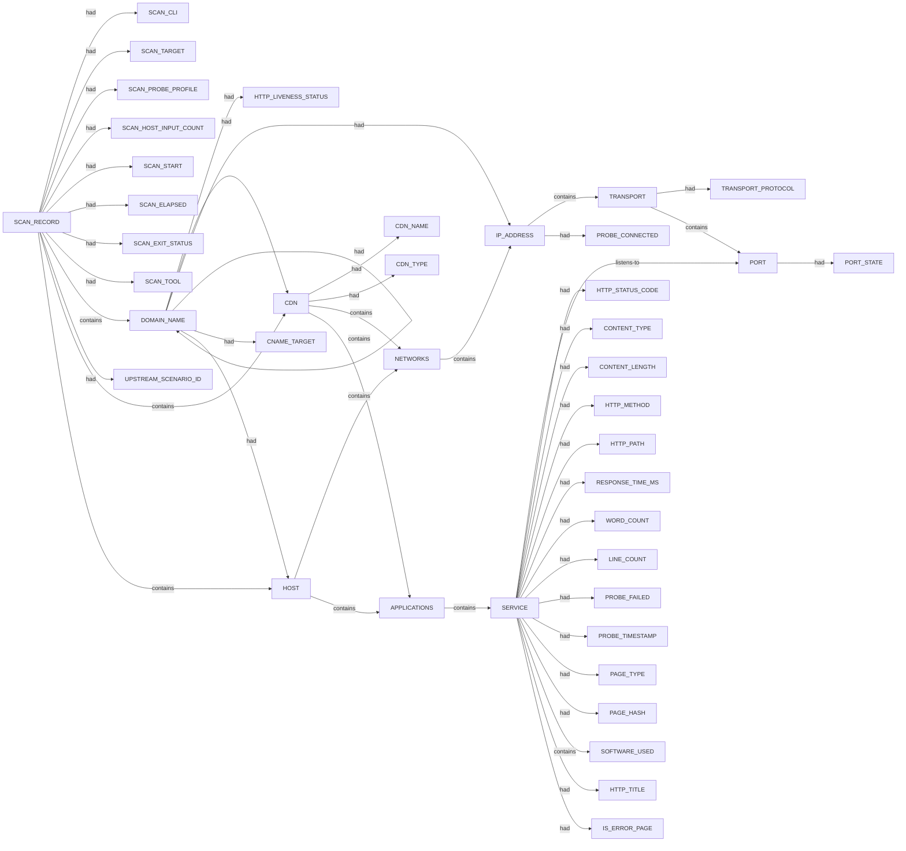

# Httpx scan narrative — `from_subfinder_squarepeg`

## Introduction

Httpx confirms live web endpoints, HTTP metadata, and technology signals for each probed host under the 10 H0-H7 ruleset.

## Systems

- `CDN` `104.18.5.54`
- `CDN` `172.67.212.142`
- `CDN` `3.169.183.79`
- `CDN` `34.111.99.212`
- `HOST` `198.202.211.1`
- `HOST` `54.38.64.116`

## Graph structure (types)

## Trace

_Trace section omitted when no TRACE nodes present._

## Appendix

### Nodes

- `APPLICATIONS`: APPLICATIONS
- `CDN`: 104.18.5.54
- `CDN`: 172.67.212.142
- `CDN`: 3.169.183.79
- `CDN`: 34.111.99.212
- `CDN_NAME`: cloudflare
- `CDN_NAME`: cloudfront
- `CDN_NAME`: google
- `CDN_TYPE`: cdn
- `CDN_TYPE`: waf
- `CNAME_TARGET`: cdn.webflow.com
- `CNAME_TARGET`: d2rqjm78y4sxx.cloudfront.net
- `CNAME_TARGET`: default-proxy-fallback.getproven.com
- `CNAME_TARGET`: eu.mailgun.org
- `CONTENT_LENGTH`: 112872
- `CONTENT_LENGTH`: 19
- `CONTENT_LENGTH`: 263
- `CONTENT_LENGTH`: 50394
- `CONTENT_LENGTH`: 87509
- `CONTENT_LENGTH`: 88075
- `CONTENT_LENGTH`: 8896
- `CONTENT_TYPE`: application/xml
- `CONTENT_TYPE`: text/html
- `CONTENT_TYPE`: text/plain
- `DOMAIN_NAME`: cdn.webflow.com
- `DOMAIN_NAME`: d2rqjm78y4sxx.cloudfront.net
- `DOMAIN_NAME`: data.squarepeg.vc
- `DOMAIN_NAME`: default-proxy-fallback.getproven.com
- `DOMAIN_NAME`: email.foundersummit2026.squarepeg.vc
- `DOMAIN_NAME`: eu.mailgun.org
- `DOMAIN_NAME`: foundersummit2026.squarepeg.vc
- `DOMAIN_NAME`: helix.squarepeg.vc
- `DOMAIN_NAME`: plus.squarepeg.vc
- `DOMAIN_NAME`: squarepeg.vc
- `DOMAIN_NAME`: static.squarepeg.vc
- `DOMAIN_NAME`: www.squarepeg.vc
- `HOST`: 198.202.211.1
- `HOST`: 54.38.64.116
- `HTTP_LIVENESS_STATUS`: confirmed
- `HTTP_LIVENESS_STATUS`: unconfirmed
- `HTTP_METHOD`: GET
- `HTTP_PATH`: /
- `HTTP_STATUS_CODE`: 200
- `HTTP_STATUS_CODE`: 403
- `HTTP_STATUS_CODE`: 404
- `HTTP_TITLE`: Helix Library
- `HTTP_TITLE`: Metabase
- `HTTP_TITLE`: Proven
- `HTTP_TITLE`: Site d'inscription
- `HTTP_TITLE`: Square Peg: Helping founders from our corner of the world shape the future
- `IP_ADDRESS`: 104.18.4.54
- `IP_ADDRESS`: 104.18.5.54
- `IP_ADDRESS`: 104.21.85.245
- `IP_ADDRESS`: 172.67.212.142
- `IP_ADDRESS`: 198.202.211.1
- `IP_ADDRESS`: 3.169.183.3
- `IP_ADDRESS`: 3.169.183.60
- `IP_ADDRESS`: 3.169.183.79
- `IP_ADDRESS`: 3.169.183.88
- `IP_ADDRESS`: 34.111.99.212
- `IP_ADDRESS`: 54.38.64.116
- `IS_ERROR_PAGE`: true
- `LINE_COUNT`: 1
- `LINE_COUNT`: 1270
- `LINE_COUNT`: 18
- `LINE_COUNT`: 2
- `LINE_COUNT`: 42
- `LINE_COUNT`: 52
- `LINE_COUNT`: 831
- `NETWORKS`: NETWORKS
- `PAGE_HASH`: 0
- `PAGE_TYPE`: error
- `PAGE_TYPE`: login
- `PAGE_TYPE`: nonerror
- `PAGE_TYPE`: other
- `PORT`: 443
- `PORT_STATE`: open
- `PROBE_CONNECTED`: false
- `PROBE_CONNECTED`: true
- `PROBE_FAILED`: False
- `PROBE_TIMESTAMP`: 2026-07-06T02:04:59.7316984+10:00
- `PROBE_TIMESTAMP`: 2026-07-06T02:04:59.9380828+10:00
- `PROBE_TIMESTAMP`: 2026-07-06T02:05:00.321662+10:00
- `PROBE_TIMESTAMP`: 2026-07-06T02:05:00.699069+10:00
- `PROBE_TIMESTAMP`: 2026-07-06T02:05:00.7364568+10:00
- `PROBE_TIMESTAMP`: 2026-07-06T02:05:00.7911387+10:00
- `PROBE_TIMESTAMP`: 2026-07-06T02:05:00.9782699+10:00
- `RESPONSE_TIME_MS`: 1.0689057s
- `RESPONSE_TIME_MS`: 1.0766287s
- `RESPONSE_TIME_MS`: 109.0168ms
- `RESPONSE_TIME_MS`: 136.3013ms
- `RESPONSE_TIME_MS`: 303.7744ms
- `RESPONSE_TIME_MS`: 698.9005ms
- `RESPONSE_TIME_MS`: 859.7355ms
- `SCAN_CLI`: httpx -l .docs/docs-for-cli-tools/exploration_scratch/httpx/hosts/from_subfinder_squarepeg_hosts.txt -status-code -title -tech-detect -server -cdn -ip -json -no-stdin -o .docs/docs-for-cli-tools/exploration_scratch/httpx/exams/from_subfinder_squarepeg.jsonl -silent -threads 15 -timeout 15 -rate-limit 30
- `SCAN_ELAPSED`: 3.078
- `SCAN_EXIT_STATUS`: 0
- `SCAN_HOST_INPUT_COUNT`: 7
- `SCAN_PROBE_PROFILE`: status-code,title,tech-detect,server,cdn,ip
- `SCAN_RECORD`: httpx:squarepeg.vc:httpx -l .docs/docs-for-cli-tools/exploration_scratch/httpx/hosts/from_subfinder_squarepeg_hosts.txt -status-code -title -tech-detect -server -cdn -ip -json -no-stdin -o .docs/docs-for-cli-tools/exploration_scratch/httpx/exams/from_subfinder_squarepeg.jsonl -silent -threads 15 -timeout 15 -rate-limit 30
- `SCAN_START`: 2026-07-05T16:04:57.955640+00:00
- `SCAN_TARGET`: squarepeg.vc
- `SCAN_TOOL`: httpx
- `SERVICE`: https
- `SOFTWARE_USED`: Amazon CloudFront
- `SOFTWARE_USED`: Amazon S3
- `SOFTWARE_USED`: Amazon Web Services
- `SOFTWARE_USED`: AmazonS3
- `SOFTWARE_USED`: Campaign Monitor
- `SOFTWARE_USED`: Cloudflare
- `SOFTWARE_USED`: Google Tag Manager
- `SOFTWARE_USED`: HSTS
- `SOFTWARE_USED`: HTTP/3
- `SOFTWARE_USED`: React
- `SOFTWARE_USED`: Unpkg
- `SOFTWARE_USED`: cdnjs
- `SOFTWARE_USED`: cloudflare
- `SOFTWARE_USED`: jQuery
- `SOFTWARE_USED`: jQuery UI
- `SOFTWARE_USED`: jsDelivr
- `TRANSPORT`: tcp
- `TRANSPORT_PROTOCOL`: tcp
- `UPSTREAM_SCENARIO_ID`: corporate_squarepeg_passive_cs
- `WORD_COUNT`: 19532
- `WORD_COUNT`: 258
- `WORD_COUNT`: 3342
- `WORD_COUNT`: 4
- `WORD_COUNT`: 4021
- `WORD_COUNT`: 6305

### Edges

- `SCAN_RECORD` `had` `SCAN_CLI`
- `SCAN_RECORD` `had` `SCAN_TARGET`
- `SCAN_RECORD` `had` `SCAN_PROBE_PROFILE`
- `SCAN_RECORD` `had` `SCAN_HOST_INPUT_COUNT`
- `SCAN_RECORD` `had` `SCAN_START`
- `SCAN_RECORD` `had` `SCAN_ELAPSED`
- `SCAN_RECORD` `had` `SCAN_EXIT_STATUS`
- `SCAN_RECORD` `had` `SCAN_TOOL`
- `SCAN_RECORD` `contains` `DOMAIN_NAME`
- `SCAN_RECORD` `had` `UPSTREAM_SCENARIO_ID`
- `SCAN_RECORD` `contains` `DOMAIN_NAME`
- `DOMAIN_NAME` `had` `HTTP_LIVENESS_STATUS`
- `SCAN_RECORD` `contains` `CDN`
- `DOMAIN_NAME` `had` `CDN`
- `CDN` `had` `CDN_NAME`
- `CDN` `had` `CDN_TYPE`
- `CDN` `contains` `NETWORKS`
- `NETWORKS` `contains` `IP_ADDRESS`
- `IP_ADDRESS` `contains` `TRANSPORT`
- `TRANSPORT` `had` `TRANSPORT_PROTOCOL`
- `TRANSPORT` `contains` `PORT`
- `PORT` `had` `PORT_STATE`
- `CDN` `contains` `APPLICATIONS`
- `APPLICATIONS` `contains` `SERVICE`
- `SERVICE` `listens-to` `PORT`
- `SERVICE` `had` `HTTP_STATUS_CODE`
- `SERVICE` `had` `CONTENT_TYPE`
- `SERVICE` `had` `CONTENT_LENGTH`
- `SERVICE` `had` `HTTP_METHOD`
- `SERVICE` `had` `HTTP_PATH`
- `SERVICE` `had` `RESPONSE_TIME_MS`
- `SERVICE` `had` `WORD_COUNT`
- `SERVICE` `had` `LINE_COUNT`
- `SERVICE` `had` `PROBE_FAILED`
- `SERVICE` `had` `PROBE_TIMESTAMP`
- `SERVICE` `had` `PAGE_TYPE`
- `SERVICE` `had` `PAGE_HASH`
- `SERVICE` `contains` `SOFTWARE_USED`
- `SERVICE` `contains` `SOFTWARE_USED`
- `SERVICE` `contains` `SOFTWARE_USED`
- `SERVICE` `contains` `SOFTWARE_USED`
- `DOMAIN_NAME` `had` `IP_ADDRESS`
- `IP_ADDRESS` `had` `PROBE_CONNECTED`
- `DOMAIN_NAME` `had` `IP_ADDRESS`
- `IP_ADDRESS` `had` `PROBE_CONNECTED`
- `SCAN_RECORD` `contains` `DOMAIN_NAME`
- `DOMAIN_NAME` `had` `HTTP_LIVENESS_STATUS`
- `DOMAIN_NAME` `had` `CDN`
- `SERVICE` `had` `HTTP_STATUS_CODE`
- `SERVICE` `had` `HTTP_TITLE`
- `SERVICE` `had` `CONTENT_TYPE`
- `SERVICE` `had` `CONTENT_LENGTH`
- `SERVICE` `had` `RESPONSE_TIME_MS`
- `SERVICE` `had` `WORD_COUNT`
- `SERVICE` `had` `LINE_COUNT`
- `SERVICE` `had` `PROBE_TIMESTAMP`
- `SERVICE` `had` `PAGE_TYPE`
- `SERVICE` `contains` `SOFTWARE_USED`
- `DOMAIN_NAME` `had` `IP_ADDRESS`
- `DOMAIN_NAME` `had` `IP_ADDRESS`
- `SCAN_RECORD` `contains` `DOMAIN_NAME`
- `DOMAIN_NAME` `had` `HTTP_LIVENESS_STATUS`
- `SCAN_RECORD` `contains` `CDN`
- `DOMAIN_NAME` `had` `CDN`
- `CDN` `had` `CDN_NAME`
- `CDN` `had` `CDN_TYPE`
- `CDN` `contains` `NETWORKS`
- `NETWORKS` `contains` `IP_ADDRESS`
- `IP_ADDRESS` `contains` `TRANSPORT`
- `CDN` `contains` `APPLICATIONS`
- `SERVICE` `had` `HTTP_STATUS_CODE`
- `SERVICE` `had` `CONTENT_TYPE`
- `SERVICE` `had` `CONTENT_LENGTH`
- `SERVICE` `had` `RESPONSE_TIME_MS`
- `SERVICE` `had` `LINE_COUNT`
- `SERVICE` `had` `PROBE_TIMESTAMP`
- `SERVICE` `had` `PAGE_TYPE`
- `SERVICE` `had` `IS_ERROR_PAGE`
- `DOMAIN_NAME` `had` `DOMAIN_NAME`
- `DOMAIN_NAME` `had` `CNAME_TARGET`
- `DOMAIN_NAME` `had` `IP_ADDRESS`
- `IP_ADDRESS` `had` `PROBE_CONNECTED`
- `SCAN_RECORD` `contains` `DOMAIN_NAME`
- `DOMAIN_NAME` `had` `HTTP_LIVENESS_STATUS`
- `SCAN_RECORD` `contains` `CDN`
- `DOMAIN_NAME` `had` `CDN`
- `CDN` `had` `CDN_NAME`
- `CDN` `had` `CDN_TYPE`
- `CDN` `contains` `NETWORKS`
- `NETWORKS` `contains` `IP_ADDRESS`
- `IP_ADDRESS` `contains` `TRANSPORT`
- `CDN` `contains` `APPLICATIONS`
- `SERVICE` `had` `HTTP_TITLE`
- `SERVICE` `had` `CONTENT_LENGTH`
- `SERVICE` `had` `RESPONSE_TIME_MS`
- `SERVICE` `had` `WORD_COUNT`
- `SERVICE` `had` `LINE_COUNT`
- `SERVICE` `had` `PROBE_TIMESTAMP`
- `SERVICE` `contains` `SOFTWARE_USED`
- `SERVICE` `contains` `SOFTWARE_USED`
- `SERVICE` `contains` `SOFTWARE_USED`
- `DOMAIN_NAME` `had` `DOMAIN_NAME`
- `DOMAIN_NAME` `had` `CNAME_TARGET`
- `DOMAIN_NAME` `had` `IP_ADDRESS`
- `IP_ADDRESS` `had` `PROBE_CONNECTED`
- `DOMAIN_NAME` `had` `IP_ADDRESS`
- `IP_ADDRESS` `had` `PROBE_CONNECTED`
- `DOMAIN_NAME` `had` `IP_ADDRESS`
- `IP_ADDRESS` `had` `PROBE_CONNECTED`
- `DOMAIN_NAME` `had` `IP_ADDRESS`
- `IP_ADDRESS` `had` `PROBE_CONNECTED`
- `SCAN_RECORD` `contains` `DOMAIN_NAME`
- `DOMAIN_NAME` `had` `HTTP_LIVENESS_STATUS`
- `SCAN_RECORD` `contains` `HOST`
- `DOMAIN_NAME` `had` `HOST`
- `HOST` `contains` `NETWORKS`
- `NETWORKS` `contains` `IP_ADDRESS`
- `IP_ADDRESS` `contains` `TRANSPORT`
- `HOST` `contains` `APPLICATIONS`
- `SERVICE` `had` `HTTP_TITLE`
- `SERVICE` `had` `CONTENT_LENGTH`
- `SERVICE` `had` `RESPONSE_TIME_MS`
- `SERVICE` `had` `WORD_COUNT`
- `SERVICE` `had` `LINE_COUNT`
- `SERVICE` `had` `PROBE_TIMESTAMP`
- `SERVICE` `had` `PAGE_TYPE`
- `SERVICE` `contains` `SOFTWARE_USED`
- `DOMAIN_NAME` `had` `IP_ADDRESS`
- `IP_ADDRESS` `had` `PROBE_CONNECTED`
- `SCAN_RECORD` `contains` `DOMAIN_NAME`
- `DOMAIN_NAME` `had` `HTTP_LIVENESS_STATUS`
- `SCAN_RECORD` `contains` `HOST`
- `DOMAIN_NAME` `had` `HOST`
- `HOST` `contains` `NETWORKS`
- `NETWORKS` `contains` `IP_ADDRESS`
- `IP_ADDRESS` `contains` `TRANSPORT`
- `HOST` `contains` `APPLICATIONS`
- `SERVICE` `had` `HTTP_TITLE`
- `SERVICE` `had` `CONTENT_LENGTH`
- `SERVICE` `had` `RESPONSE_TIME_MS`
- `SERVICE` `had` `WORD_COUNT`
- `SERVICE` `had` `LINE_COUNT`
- `SERVICE` `had` `PROBE_TIMESTAMP`
- `SERVICE` `contains` `SOFTWARE_USED`
- `SERVICE` `contains` `SOFTWARE_USED`
- `SERVICE` `contains` `SOFTWARE_USED`
- `SERVICE` `contains` `SOFTWARE_USED`
- `SERVICE` `contains` `SOFTWARE_USED`
- `SERVICE` `contains` `SOFTWARE_USED`
- `DOMAIN_NAME` `had` `DOMAIN_NAME`
- `DOMAIN_NAME` `had` `CNAME_TARGET`
- `DOMAIN_NAME` `had` `IP_ADDRESS`
- `IP_ADDRESS` `had` `PROBE_CONNECTED`
- `SCAN_RECORD` `contains` `DOMAIN_NAME`
- `DOMAIN_NAME` `had` `HTTP_LIVENESS_STATUS`
- `SCAN_RECORD` `contains` `CDN`
- `DOMAIN_NAME` `had` `CDN`
- `CDN` `had` `CDN_NAME`
- `CDN` `had` `CDN_TYPE`
- `CDN` `contains` `NETWORKS`
- `NETWORKS` `contains` `IP_ADDRESS`
- `IP_ADDRESS` `contains` `TRANSPORT`
- `CDN` `contains` `APPLICATIONS`
- `SERVICE` `had` `HTTP_TITLE`
- `SERVICE` `had` `CONTENT_LENGTH`
- `SERVICE` `had` `RESPONSE_TIME_MS`
- `SERVICE` `had` `WORD_COUNT`
- `SERVICE` `had` `LINE_COUNT`
- `SERVICE` `had` `PROBE_TIMESTAMP`
- `SERVICE` `contains` `SOFTWARE_USED`
- `DOMAIN_NAME` `had` `DOMAIN_NAME`
- `DOMAIN_NAME` `had` `CNAME_TARGET`
- `DOMAIN_NAME` `had` `IP_ADDRESS`
- `IP_ADDRESS` `had` `PROBE_CONNECTED`
- `DOMAIN_NAME` `had` `IP_ADDRESS`
- `IP_ADDRESS` `had` `PROBE_CONNECTED`
- `DOMAIN_NAME` `had` `HTTP_LIVENESS_STATUS`
---

*OS-Intel Scan*
