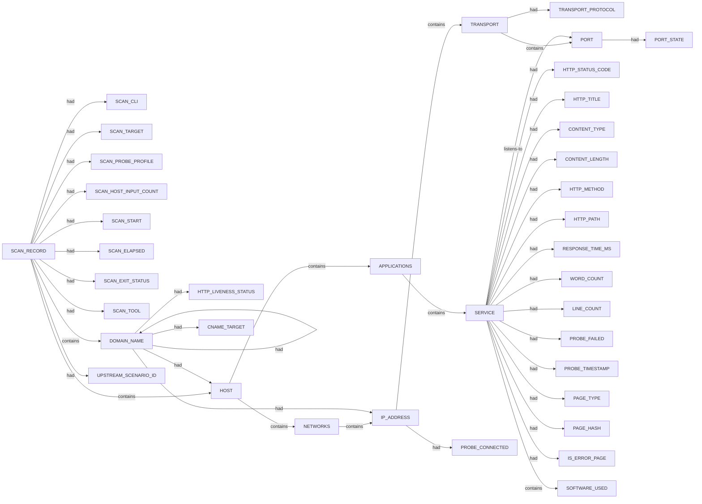

# Httpx scan narrative — `from_subfinder_upside_au`

## Introduction

Httpx confirms live web endpoints, HTTP metadata, and technology signals for each probed host under the 10 H0-H7 ruleset.

## Systems

- `HOST` `2606:4700:20::681a:735`
- `HOST` `40.82.218.196`

## Graph structure (types)

## Trace

_Trace section omitted when no TRACE nodes present._

## Appendix

### Nodes

- `APPLICATIONS`: APPLICATIONS
- `CNAME_TARGET`: t.cfjump.com
- `CONTENT_LENGTH`: 151
- `CONTENT_LENGTH`: 276478
- `CONTENT_TYPE`: text/html
- `DOMAIN_NAME`: cfjump.theupside.com.au
- `DOMAIN_NAME`: t.cfjump.com
- `DOMAIN_NAME`: theupside.com.au
- `DOMAIN_NAME`: www.theupside.com.au
- `HOST`: 2606:4700:20::681a:735
- `HOST`: 40.82.218.196
- `HTTP_LIVENESS_STATUS`: confirmed
- `HTTP_LIVENESS_STATUS`: unconfirmed
- `HTTP_METHOD`: GET
- `HTTP_PATH`: /
- `HTTP_STATUS_CODE`: 200
- `HTTP_STATUS_CODE`: 301
- `HTTP_TITLE`: Object moved
- `HTTP_TITLE`: THE UPSIDE | AUSTRALIA
- `IP_ADDRESS`: 104.26.6.53
- `IP_ADDRESS`: 104.26.7.53
- `IP_ADDRESS`: 172.67.71.87
- `IP_ADDRESS`: 40.82.218.196
- `IS_ERROR_PAGE`: true
- `LINE_COUNT`: 2498
- `LINE_COUNT`: 3
- `NETWORKS`: NETWORKS
- `PAGE_HASH`: 0
- `PAGE_TYPE`: error
- `PAGE_TYPE`: other
- `PORT`: 443
- `PORT`: 80
- `PORT_STATE`: open
- `PROBE_CONNECTED`: false
- `PROBE_CONNECTED`: true
- `PROBE_FAILED`: False
- `PROBE_TIMESTAMP`: 2026-07-06T02:04:26.9670668+10:00
- `PROBE_TIMESTAMP`: 2026-07-06T02:04:39.0785348+10:00
- `RESPONSE_TIME_MS`: 18.8356ms
- `RESPONSE_TIME_MS`: 411.4626ms
- `SCAN_CLI`: httpx -l .docs/docs-for-cli-tools/exploration_scratch/httpx/hosts/from_subfinder_upside_au_hosts.txt -status-code -title -tech-detect -server -cdn -ip -json -no-stdin -o .docs/docs-for-cli-tools/exploration_scratch/httpx/exams/from_subfinder_upside_au.jsonl -silent -threads 20 -timeout 15 -rate-limit 40
- `SCAN_ELAPSED`: 32.578
- `SCAN_EXIT_STATUS`: 0
- `SCAN_HOST_INPUT_COUNT`: 26
- `SCAN_PROBE_PROFILE`: status-code,title,tech-detect,server,cdn,ip
- `SCAN_RECORD`: httpx:theupside.com.au:httpx -l .docs/docs-for-cli-tools/exploration_scratch/httpx/hosts/from_subfinder_upside_au_hosts.txt -status-code -title -tech-detect -server -cdn -ip -json -no-stdin -o .docs/docs-for-cli-tools/exploration_scratch/httpx/exams/from_subfinder_upside_au.jsonl -silent -threads 20 -timeout 15 -rate-limit 40
- `SCAN_START`: 2026-07-05T16:04:25.245971+00:00
- `SCAN_TARGET`: theupside.com.au
- `SCAN_TOOL`: httpx
- `SERVICE`: http
- `SERVICE`: https
- `SOFTWARE_USED`: BigCommerce
- `SOFTWARE_USED`: Cloudflare
- `SOFTWARE_USED`: Google Tag Manager
- `SOFTWARE_USED`: HSTS
- `SOFTWARE_USED`: Klaviyo
- `SOFTWARE_USED`: cloudflare
- `SOFTWARE_USED`: jQuery
- `SOFTWARE_USED`: jQuery CDN
- `TRANSPORT`: tcp
- `TRANSPORT_PROTOCOL`: tcp
- `UPSTREAM_SCENARIO_ID`: corporate_upside_au_passive_cs
- `WORD_COUNT`: 6
- `WORD_COUNT`: 62039

### Edges

- `SCAN_RECORD` `had` `SCAN_CLI`
- `SCAN_RECORD` `had` `SCAN_TARGET`
- `SCAN_RECORD` `had` `SCAN_PROBE_PROFILE`
- `SCAN_RECORD` `had` `SCAN_HOST_INPUT_COUNT`
- `SCAN_RECORD` `had` `SCAN_START`
- `SCAN_RECORD` `had` `SCAN_ELAPSED`
- `SCAN_RECORD` `had` `SCAN_EXIT_STATUS`
- `SCAN_RECORD` `had` `SCAN_TOOL`
- `SCAN_RECORD` `contains` `DOMAIN_NAME`
- `SCAN_RECORD` `had` `UPSTREAM_SCENARIO_ID`
- `SCAN_RECORD` `contains` `DOMAIN_NAME`
- `DOMAIN_NAME` `had` `HTTP_LIVENESS_STATUS`
- `SCAN_RECORD` `contains` `HOST`
- `DOMAIN_NAME` `had` `HOST`
- `HOST` `contains` `NETWORKS`
- `NETWORKS` `contains` `IP_ADDRESS`
- `IP_ADDRESS` `contains` `TRANSPORT`
- `TRANSPORT` `had` `TRANSPORT_PROTOCOL`
- `TRANSPORT` `contains` `PORT`
- `PORT` `had` `PORT_STATE`
- `HOST` `contains` `APPLICATIONS`
- `APPLICATIONS` `contains` `SERVICE`
- `SERVICE` `listens-to` `PORT`
- `SERVICE` `had` `HTTP_STATUS_CODE`
- `SERVICE` `had` `HTTP_TITLE`
- `SERVICE` `had` `CONTENT_TYPE`
- `SERVICE` `had` `CONTENT_LENGTH`
- `SERVICE` `had` `HTTP_METHOD`
- `SERVICE` `had` `HTTP_PATH`
- `SERVICE` `had` `RESPONSE_TIME_MS`
- `SERVICE` `had` `WORD_COUNT`
- `SERVICE` `had` `LINE_COUNT`
- `SERVICE` `had` `PROBE_FAILED`
- `SERVICE` `had` `PROBE_TIMESTAMP`
- `SERVICE` `had` `PAGE_TYPE`
- `SERVICE` `had` `PAGE_HASH`
- `SERVICE` `had` `IS_ERROR_PAGE`
- `DOMAIN_NAME` `had` `DOMAIN_NAME`
- `DOMAIN_NAME` `had` `CNAME_TARGET`
- `DOMAIN_NAME` `had` `IP_ADDRESS`
- `IP_ADDRESS` `had` `PROBE_CONNECTED`
- `SCAN_RECORD` `contains` `DOMAIN_NAME`
- `DOMAIN_NAME` `had` `HTTP_LIVENESS_STATUS`
- `SCAN_RECORD` `contains` `HOST`
- `DOMAIN_NAME` `had` `HOST`
- `HOST` `contains` `NETWORKS`
- `NETWORKS` `contains` `IP_ADDRESS`
- `IP_ADDRESS` `contains` `TRANSPORT`
- `TRANSPORT` `contains` `PORT`
- `PORT` `had` `PORT_STATE`
- `HOST` `contains` `APPLICATIONS`
- `APPLICATIONS` `contains` `SERVICE`
- `SERVICE` `listens-to` `PORT`
- `SERVICE` `had` `HTTP_STATUS_CODE`
- `SERVICE` `had` `HTTP_TITLE`
- `SERVICE` `had` `CONTENT_TYPE`
- `SERVICE` `had` `CONTENT_LENGTH`
- `SERVICE` `had` `HTTP_METHOD`
- `SERVICE` `had` `HTTP_PATH`
- `SERVICE` `had` `RESPONSE_TIME_MS`
- `SERVICE` `had` `WORD_COUNT`
- `SERVICE` `had` `LINE_COUNT`
- `SERVICE` `had` `PROBE_FAILED`
- `SERVICE` `had` `PROBE_TIMESTAMP`
- `SERVICE` `had` `PAGE_TYPE`
- `SERVICE` `had` `PAGE_HASH`
- `SERVICE` `contains` `SOFTWARE_USED`
- `SERVICE` `contains` `SOFTWARE_USED`
- `SERVICE` `contains` `SOFTWARE_USED`
- `SERVICE` `contains` `SOFTWARE_USED`
- `SERVICE` `contains` `SOFTWARE_USED`
- `SERVICE` `contains` `SOFTWARE_USED`
- `SERVICE` `contains` `SOFTWARE_USED`
- `SERVICE` `contains` `SOFTWARE_USED`
- `DOMAIN_NAME` `had` `IP_ADDRESS`
- `IP_ADDRESS` `had` `PROBE_CONNECTED`
- `DOMAIN_NAME` `had` `IP_ADDRESS`
- `IP_ADDRESS` `had` `PROBE_CONNECTED`
- `DOMAIN_NAME` `had` `IP_ADDRESS`
- `IP_ADDRESS` `had` `PROBE_CONNECTED`
- `DOMAIN_NAME` `had` `HTTP_LIVENESS_STATUS`
---

*OS-Intel Scan*
