# Httpx scan narrative — `from_subfinder_upside_au`

## Introduction

Httpx confirms live web endpoints, HTTP metadata, and technology signals for each probed host under the 10 H0-H7 ruleset.

## Scan

Every examination has one SCAN_RECORD with scan descriptors linked via had. This scan includes **1** Scan root node(s) (e.g. `httpx:theupside.com.au:httpx -l .docs/docs-for-cli-tools/exploration_scratch/httpx/hosts/from_subfinder_upside_au_hosts.txt -status-code -title -tech-detect -server -cdn -ip -json -no-stdin -o .docs/docs-for-cli-tools/exploration_scratch/httpx/exams/from_subfinder_upside_au.jsonl -silent -threads 20 -timeout 15 -rate-limit 40`). Linked structures: `SCAN_CLI`, `SCAN_TARGET`, `SCAN_PROBE_PROFILE`, `SCAN_HOST_INPUT_COUNT`, `SCAN_START`, `SCAN_ELAPSED`.

### Structure overview

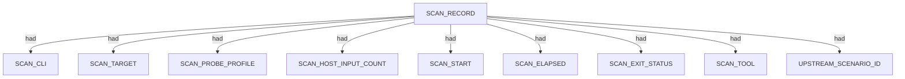

### `SCAN_CLI`

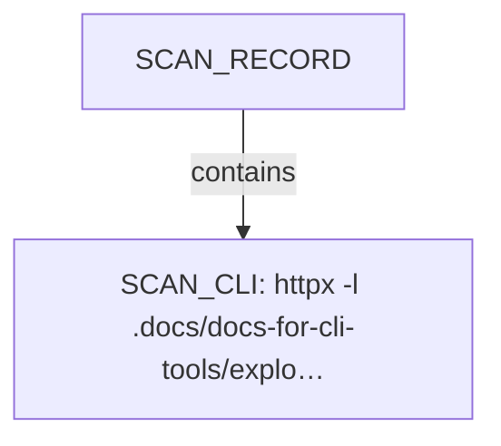

| Nugget | Value |
| --- | --- |
| `SCAN_CLI` | `httpx -l .docs/docs-for-cli-tools/exploration_scratch/httpx/hosts/from_subfinder_upside_au_hosts.txt -status-code -title -tech-detect -server -cdn -ip -json -no-stdin -o .docs/docs-for-cli-tools/exploration_scratch/httpx/exams/from_subfinder_upside_au.jsonl -silent -threads 20 -timeout 15 -rate-limit 40` |

### `SCAN_TARGET`

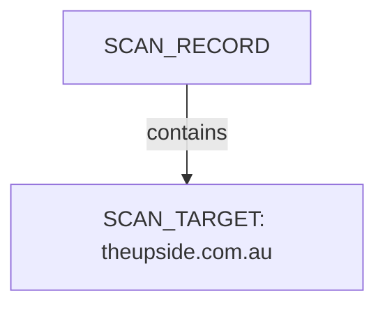

| Nugget | Value |
| --- | --- |
| `SCAN_TARGET` | `theupside.com.au` |

### `SCAN_PROBE_PROFILE`

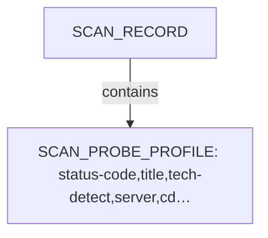

| Nugget | Value |
| --- | --- |
| `SCAN_PROBE_PROFILE` | `status-code,title,tech-detect,server,cdn,ip` |

### `SCAN_HOST_INPUT_COUNT`

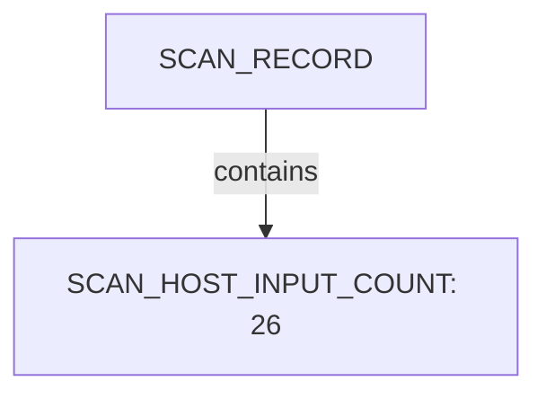

| Nugget | Value |
| --- | --- |
| `SCAN_HOST_INPUT_COUNT` | `26` |

### `SCAN_START`

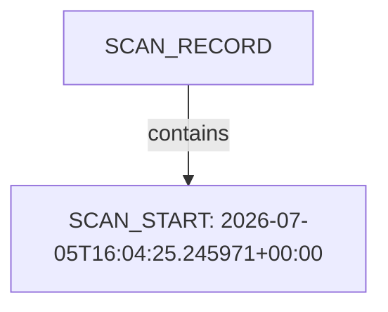

| Nugget | Value |
| --- | --- |
| `SCAN_START` | `2026-07-05T16:04:25.245971+00:00` |

### `SCAN_ELAPSED`

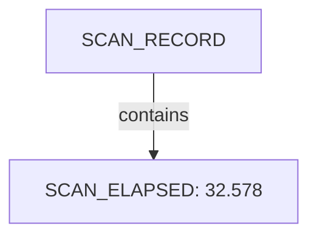

| Nugget | Value |
| --- | --- |
| `SCAN_ELAPSED` | `32.578` |

### `SCAN_EXIT_STATUS`

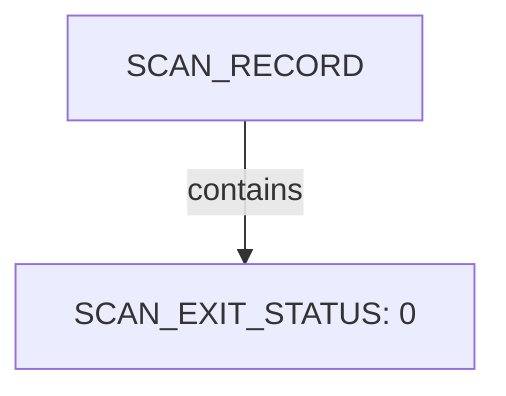

| Nugget | Value |
| --- | --- |
| `SCAN_EXIT_STATUS` | `0` |

### `SCAN_TOOL`

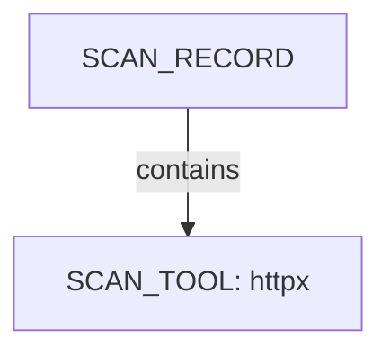

| Nugget | Value |
| --- | --- |
| `SCAN_TOOL` | `httpx` |

### `UPSTREAM_SCENARIO_ID`

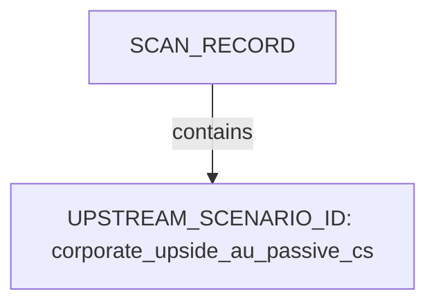

| Nugget | Value |
| --- | --- |
| `UPSTREAM_SCENARIO_ID` | `corporate_upside_au_passive_cs` |

## Host

Qualified HOST endpoints own category trees for networks, applications, environment, and security findings. This scan includes **2** Host root node(s) (e.g. `40.82.218.196`, `2606:4700:20::681a:735`). Linked structures: `NETWORKS`, `APPLICATIONS`.

### Structure overview

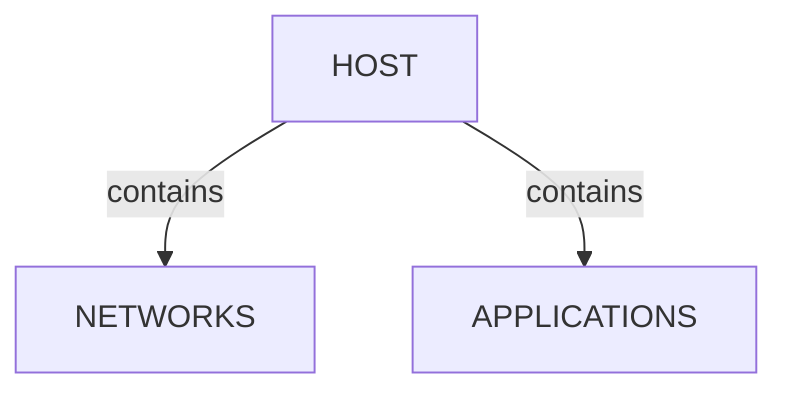

### `NETWORKS`

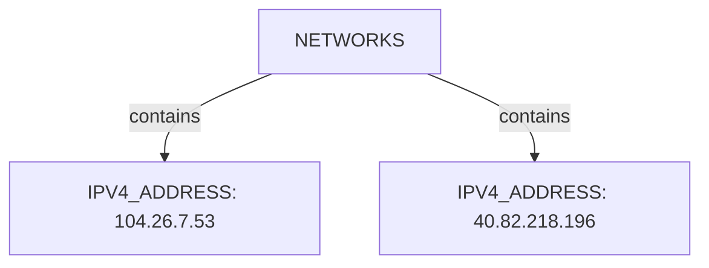

| Nugget | Value |
| --- | --- |
| `IPV4_ADDRESS` | `104.26.7.53` |
| `IPV4_ADDRESS` | `40.82.218.196` |

### `APPLICATIONS`

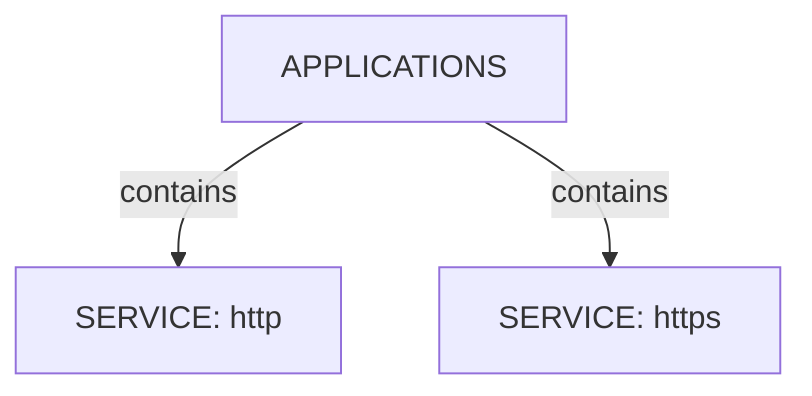

| Nugget | Value |
| --- | --- |
| `SERVICE` | `http` |
| `SERVICE` | `https` |

## Domains

Apex DOMAIN_NAME entities contain subdomain DOMAIN_NAME children; descriptors capture discovery mode, sources, and liveness. This scan includes **4** Domains root node(s) (e.g. `theupside.com.au`, `cfjump.theupside.com.au`, `t.cfjump.com`). Linked structures: `DOMAIN_NAME`.

### Structure overview

### `DOMAIN_NAME`

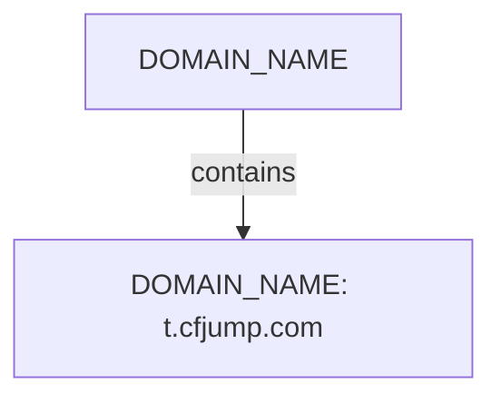

| Nugget | Value |
| --- | --- |
| `DOMAIN_NAME` | `t.cfjump.com` |

## Services and ports

APPLICATION services listen-to PORT entities under NETWORKS/TRANSPORT. This scan includes **2** Services and ports root node(s) (e.g. `http`, `https`). Linked structures: no child categories.

### Structure overview

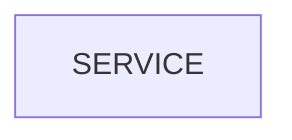

### Values

| Nugget | Value |
| --- | --- |
| `SERVICE` | `http` |
| `SERVICE` | `https` |

## Conclusion

See the appendix for the full node and edge inventory.

## Appendix

### Nodes

| Nugget | Value |
| --- | --- |
| `APPLICATIONS` | `APPLICATIONS` |
| `CNAME_TARGET` | `t.cfjump.com` |
| `CONTENT_LENGTH` | `151` |
| `CONTENT_LENGTH` | `276478` |
| `CONTENT_TYPE` | `text/html` |
| `DOMAIN_NAME` | `cfjump.theupside.com.au` |
| `DOMAIN_NAME` | `t.cfjump.com` |
| `DOMAIN_NAME` | `theupside.com.au` |
| `DOMAIN_NAME` | `www.theupside.com.au` |
| `HOST` | `2606:4700:20::681a:735` |
| `HOST` | `40.82.218.196` |
| `HTTP_LIVENESS_STATUS` | `confirmed` |
| `HTTP_LIVENESS_STATUS` | `unconfirmed` |
| `HTTP_METHOD` | `GET` |
| `HTTP_PATH` | `/` |
| `HTTP_STATUS_CODE` | `200` |
| `HTTP_STATUS_CODE` | `301` |
| `HTTP_TITLE` | `Object moved` |
| `HTTP_TITLE` | `THE UPSIDE \| AUSTRALIA` |
| `IPV4_ADDRESS` | `104.26.6.53` |
| `IPV4_ADDRESS` | `104.26.7.53` |
| `IPV4_ADDRESS` | `172.67.71.87` |
| `IPV4_ADDRESS` | `40.82.218.196` |
| `IS_ERROR_PAGE` | `true` |
| `LINE_COUNT` | `2498` |
| `LINE_COUNT` | `3` |
| `NETWORKS` | `NETWORKS` |
| `PAGE_HASH` | `0` |
| `PAGE_TYPE` | `error` |
| `PAGE_TYPE` | `other` |
| `PORT` | `443` |
| `PORT` | `80` |
| `PORT_STATE` | `open` |
| `PROBE_CONNECTED` | `false` |
| `PROBE_CONNECTED` | `true` |
| `PROBE_FAILED` | `False` |
| `PROBE_TIMESTAMP` | `2026-07-06T02:04:26.9670668+10:00` |
| `PROBE_TIMESTAMP` | `2026-07-06T02:04:39.0785348+10:00` |
| `RESPONSE_TIME_MS` | `18.8356ms` |
| `RESPONSE_TIME_MS` | `411.4626ms` |
| `SCAN_CLI` | `httpx -l .docs/docs-for-cli-tools/exploration_scratch/httpx/hosts/from_subfinder_upside_au_hosts.txt -status-code -title -tech-detect -server -cdn -ip -json -no-stdin -o .docs/docs-for-cli-tools/exploration_scratch/httpx/exams/from_subfinder_upside_au.jsonl -silent -threads 20 -timeout 15 -rate-limit 40` |
| `SCAN_ELAPSED` | `32.578` |
| `SCAN_EXIT_STATUS` | `0` |
| `SCAN_HOST_INPUT_COUNT` | `26` |
| `SCAN_PROBE_PROFILE` | `status-code,title,tech-detect,server,cdn,ip` |
| `SCAN_RECORD` | `httpx:theupside.com.au:httpx -l .docs/docs-for-cli-tools/exploration_scratch/httpx/hosts/from_subfinder_upside_au_hosts.txt -status-code -title -tech-detect -server -cdn -ip -json -no-stdin -o .docs/docs-for-cli-tools/exploration_scratch/httpx/exams/from_subfinder_upside_au.jsonl -silent -threads 20 -timeout 15 -rate-limit 40` |
| `SCAN_START` | `2026-07-05T16:04:25.245971+00:00` |
| `SCAN_TARGET` | `theupside.com.au` |
| `SCAN_TOOL` | `httpx` |
| `SERVICE` | `http` |
| `SERVICE` | `https` |
| `SOFTWARE_USED` | `BigCommerce` |
| `SOFTWARE_USED` | `Cloudflare` |
| `SOFTWARE_USED` | `Google Tag Manager` |
| `SOFTWARE_USED` | `HSTS` |
| `SOFTWARE_USED` | `Klaviyo` |
| `SOFTWARE_USED` | `cloudflare` |
| `SOFTWARE_USED` | `jQuery` |
| `SOFTWARE_USED` | `jQuery CDN` |
| `TRANSPORT` | `tcp` |
| `TRANSPORT_PROTOCOL` | `tcp` |
| `UPSTREAM_SCENARIO_ID` | `corporate_upside_au_passive_cs` |
| `WORD_COUNT` | `6` |
| `WORD_COUNT` | `62039` |

### Edges

| Source | Relation | Target |
| --- | --- | --- |
| `SCAN_RECORD` | `had` | `SCAN_CLI` |
| `SCAN_RECORD` | `had` | `SCAN_TARGET` |
| `SCAN_RECORD` | `had` | `SCAN_PROBE_PROFILE` |
| `SCAN_RECORD` | `had` | `SCAN_HOST_INPUT_COUNT` |
| `SCAN_RECORD` | `had` | `SCAN_START` |
| `SCAN_RECORD` | `had` | `SCAN_ELAPSED` |
| `SCAN_RECORD` | `had` | `SCAN_EXIT_STATUS` |
| `SCAN_RECORD` | `had` | `SCAN_TOOL` |
| `SCAN_RECORD` | `contains` | `DOMAIN_NAME` |
| `SCAN_RECORD` | `had` | `UPSTREAM_SCENARIO_ID` |
| `DOMAIN_NAME` | `had` | `HTTP_LIVENESS_STATUS` |
| `SCAN_RECORD` | `contains` | `HOST` |
| `DOMAIN_NAME` | `had` | `HOST` |
| `HOST` | `contains` | `NETWORKS` |
| `NETWORKS` | `contains` | `IPV4_ADDRESS` |
| `IPV4_ADDRESS` | `contains` | `TRANSPORT` |
| `TRANSPORT` | `had` | `TRANSPORT_PROTOCOL` |
| `TRANSPORT` | `contains` | `PORT` |
| `PORT` | `had` | `PORT_STATE` |
| `HOST` | `contains` | `APPLICATIONS` |
| `APPLICATIONS` | `contains` | `SERVICE` |
| `SERVICE` | `listens-to` | `PORT` |
| `SERVICE` | `had` | `HTTP_STATUS_CODE` |
| `SERVICE` | `had` | `HTTP_TITLE` |
| `SERVICE` | `had` | `CONTENT_TYPE` |
| `SERVICE` | `had` | `CONTENT_LENGTH` |
| `SERVICE` | `had` | `HTTP_METHOD` |
| `SERVICE` | `had` | `HTTP_PATH` |
| `SERVICE` | `had` | `RESPONSE_TIME_MS` |
| `SERVICE` | `had` | `WORD_COUNT` |
| `SERVICE` | `had` | `LINE_COUNT` |
| `SERVICE` | `had` | `PROBE_FAILED` |
| `SERVICE` | `had` | `PROBE_TIMESTAMP` |
| `SERVICE` | `had` | `PAGE_TYPE` |
| `SERVICE` | `had` | `PAGE_HASH` |
| `SERVICE` | `had` | `IS_ERROR_PAGE` |
| `DOMAIN_NAME` | `had` | `DOMAIN_NAME` |
| `DOMAIN_NAME` | `had` | `CNAME_TARGET` |
| `DOMAIN_NAME` | `had` | `IPV4_ADDRESS` |
| `IPV4_ADDRESS` | `had` | `PROBE_CONNECTED` |
| `SERVICE` | `contains` | `SOFTWARE_USED` |
---

*OS-Intel Scan*
