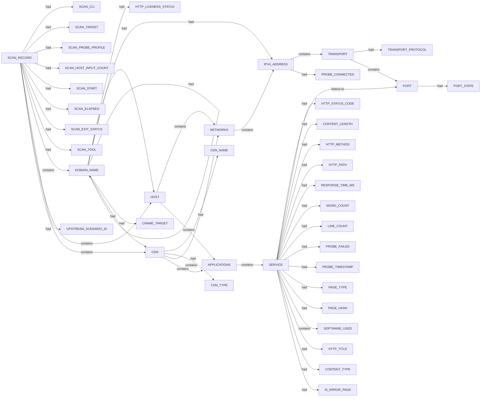

# Httpx scan narrative — `from_subfinder_upside_com`

## Introduction

Httpx confirms live web endpoints, HTTP metadata, and technology signals for each probed host under the 10 H0-H7 ruleset.

## Systems

- `CDN` `104.21.23.140`
- `CDN` `172.64.151.2`
- `HOST` `217.175.192.21`
- `HOST` `2606:4700:3037::6815:178c`
- `HOST` `2606:4700::6813:b503`
- `HOST` `3.106.48.93`

## Graph structure (types)

## Trace

_Trace section omitted when no TRACE nodes present._

## Appendix

### Nodes

- `APPLICATIONS`: APPLICATIONS
- `CDN`: 104.21.23.140
- `CDN`: 172.64.151.2
- `CDN_NAME`: cloudflare
- `CDN_TYPE`: waf
- `CNAME_TARGET`: domains.myreturnscenter.com
- `CNAME_TARGET`: img-theupsidesport-com.emarsys.net
- `CNAME_TARGET`: suite16-cf.emarsys.net
- `CNAME_TARGET`: suite16-cf.emarsys.net.cdn.cloudflare.net
- `CNAME_TARGET`: suite16.emarsys.net
- `CONTENT_LENGTH`: 0
- `CONTENT_LENGTH`: 10482
- `CONTENT_LENGTH`: 17
- `CONTENT_LENGTH`: 252893
- `CONTENT_LENGTH`: 254060
- `CONTENT_LENGTH`: 265288
- `CONTENT_TYPE`: text/html
- `CONTENT_TYPE`: text/plain
- `DOMAIN_NAME`: domains.myreturnscenter.com
- `DOMAIN_NAME`: image.theupside.com
- `DOMAIN_NAME`: img-theupsidesport-com.emarsys.net
- `DOMAIN_NAME`: international.theupside.com
- `DOMAIN_NAME`: link.theupside.com
- `DOMAIN_NAME`: link2.theupside.com
- `DOMAIN_NAME`: returns.theupside.com
- `DOMAIN_NAME`: suite16-cf.emarsys.net
- `DOMAIN_NAME`: suite16-cf.emarsys.net.cdn.cloudflare.net
- `DOMAIN_NAME`: suite16.emarsys.net
- `DOMAIN_NAME`: theupside.com
- `DOMAIN_NAME`: uat.theupside.com
- `DOMAIN_NAME`: uk.theupside.com
- `DOMAIN_NAME`: www.theupside.com
- `HOST`: 217.175.192.21
- `HOST`: 2606:4700:3037::6815:178c
- `HOST`: 2606:4700::6813:b503
- `HOST`: 3.106.48.93
- `HTTP_LIVENESS_STATUS`: confirmed
- `HTTP_LIVENESS_STATUS`: unconfirmed
- `HTTP_METHOD`: GET
- `HTTP_PATH`: /
- `HTTP_STATUS_CODE`: 200
- `HTTP_STATUS_CODE`: 204
- `HTTP_STATUS_CODE`: 302
- `HTTP_STATUS_CODE`: 403
- `HTTP_STATUS_CODE`: 404
- `HTTP_TITLE`: Returns Center
- `HTTP_TITLE`: THE UPSIDE | INTERNATIONAL
- `HTTP_TITLE`: THE UPSIDE | UK
- `HTTP_TITLE`: THE UPSIDE | USA
- `IPV4_ADDRESS`: 104.18.36.254
- `IPV4_ADDRESS`: 104.19.180.3
- `IPV4_ADDRESS`: 104.19.181.3
- `IPV4_ADDRESS`: 104.21.23.140
- `IPV4_ADDRESS`: 13.55.48.164
- `IPV4_ADDRESS`: 172.64.151.2
- `IPV4_ADDRESS`: 172.67.211.84
- `IPV4_ADDRESS`: 217.175.192.21
- `IPV4_ADDRESS`: 3.106.48.93
- `IS_ERROR_PAGE`: true
- `LINE_COUNT`: 0
- `LINE_COUNT`: 1
- `LINE_COUNT`: 2361
- `LINE_COUNT`: 2384
- `LINE_COUNT`: 2494
- `LINE_COUNT`: 59
- `NETWORKS`: NETWORKS
- `PAGE_HASH`: 0
- `PAGE_TYPE`: error
- `PAGE_TYPE`: other
- `PORT`: 443
- `PORT_STATE`: open
- `PROBE_CONNECTED`: false
- `PROBE_CONNECTED`: true
- `PROBE_FAILED`: False
- `PROBE_TIMESTAMP`: 2026-07-06T02:05:48.9620305+10:00
- `PROBE_TIMESTAMP`: 2026-07-06T02:05:49.5351031+10:00
- `PROBE_TIMESTAMP`: 2026-07-06T02:05:49.9272365+10:00
- `PROBE_TIMESTAMP`: 2026-07-06T02:05:50.5835753+10:00
- `PROBE_TIMESTAMP`: 2026-07-06T02:05:50.6385818+10:00
- `PROBE_TIMESTAMP`: 2026-07-06T02:05:50.691009+10:00
- `PROBE_TIMESTAMP`: 2026-07-06T02:05:50.7378215+10:00
- `PROBE_TIMESTAMP`: 2026-07-06T02:05:51.205687+10:00
- `RESPONSE_TIME_MS`: 1.0524295s
- `RESPONSE_TIME_MS`: 1.8179333s
- `RESPONSE_TIME_MS`: 2.326916s
- `RESPONSE_TIME_MS`: 514.1537ms
- `RESPONSE_TIME_MS`: 561.561ms
- `RESPONSE_TIME_MS`: 625.0629ms
- `RESPONSE_TIME_MS`: 664.1195ms
- `RESPONSE_TIME_MS`: 88.4247ms
- `SCAN_CLI`: httpx -l .docs/docs-for-cli-tools/exploration_scratch/httpx/hosts/from_subfinder_upside_com_hosts.txt -status-code -title -tech-detect -server -cdn -ip -json -no-stdin -o .docs/docs-for-cli-tools/exploration_scratch/httpx/exams/from_subfinder_upside_com.jsonl -silent -threads 15 -timeout 15 -rate-limit 30
- `SCAN_ELAPSED`: 21.844
- `SCAN_EXIT_STATUS`: 0
- `SCAN_HOST_INPUT_COUNT`: 12
- `SCAN_PROBE_PROFILE`: status-code,title,tech-detect,server,cdn,ip
- `SCAN_RECORD`: httpx:theupside.com:httpx -l .docs/docs-for-cli-tools/exploration_scratch/httpx/hosts/from_subfinder_upside_com_hosts.txt -status-code -title -tech-detect -server -cdn -ip -json -no-stdin -o .docs/docs-for-cli-tools/exploration_scratch/httpx/exams/from_subfinder_upside_com.jsonl -silent -threads 15 -timeout 15 -rate-limit 30
- `SCAN_START`: 2026-07-05T16:05:47.065894+00:00
- `SCAN_TARGET`: theupside.com
- `SCAN_TOOL`: httpx
- `SERVICE`: https
- `SOFTWARE_USED`: Amazon ELB
- `SOFTWARE_USED`: Amazon Web Services
- `SOFTWARE_USED`: BigCommerce
- `SOFTWARE_USED`: Cloudflare
- `SOFTWARE_USED`: Cloudflare Bot Management
- `SOFTWARE_USED`: Cloudflare Browser Insights
- `SOFTWARE_USED`: Google Cloud
- `SOFTWARE_USED`: Google Cloud CDN
- `SOFTWARE_USED`: Google Tag Manager
- `SOFTWARE_USED`: HSTS
- `SOFTWARE_USED`: HTTP/3
- `SOFTWARE_USED`: Klaviyo
- `SOFTWARE_USED`: awselb/2.0
- `SOFTWARE_USED`: cloudflare
- `SOFTWARE_USED`: jQuery
- `SOFTWARE_USED`: jQuery CDN
- `TRANSPORT`: tcp
- `TRANSPORT_PROTOCOL`: tcp
- `UPSTREAM_SCENARIO_ID`: corporate_upside_com_passive_cs
- `WORD_COUNT`: 0
- `WORD_COUNT`: 3
- `WORD_COUNT`: 392
- `WORD_COUNT`: 59113
- `WORD_COUNT`: 59489
- `WORD_COUNT`: 60300

### Edges

- `SCAN_RECORD` `had` `SCAN_CLI`
- `SCAN_RECORD` `had` `SCAN_TARGET`
- `SCAN_RECORD` `had` `SCAN_PROBE_PROFILE`
- `SCAN_RECORD` `had` `SCAN_HOST_INPUT_COUNT`
- `SCAN_RECORD` `had` `SCAN_START`
- `SCAN_RECORD` `had` `SCAN_ELAPSED`
- `SCAN_RECORD` `had` `SCAN_EXIT_STATUS`
- `SCAN_RECORD` `had` `SCAN_TOOL`
- `SCAN_RECORD` `contains` `DOMAIN_NAME`
- `SCAN_RECORD` `had` `UPSTREAM_SCENARIO_ID`
- `SCAN_RECORD` `contains` `DOMAIN_NAME`
- `DOMAIN_NAME` `had` `HTTP_LIVENESS_STATUS`
- `SCAN_RECORD` `contains` `HOST`
- `DOMAIN_NAME` `had` `HOST`
- `HOST` `contains` `NETWORKS`
- `NETWORKS` `contains` `IPV4_ADDRESS`
- `IPV4_ADDRESS` `contains` `TRANSPORT`
- `TRANSPORT` `had` `TRANSPORT_PROTOCOL`
- `TRANSPORT` `contains` `PORT`
- `PORT` `had` `PORT_STATE`
- `HOST` `contains` `APPLICATIONS`
- `APPLICATIONS` `contains` `SERVICE`
- `SERVICE` `listens-to` `PORT`
- `SERVICE` `had` `HTTP_STATUS_CODE`
- `SERVICE` `had` `CONTENT_LENGTH`
- `SERVICE` `had` `HTTP_METHOD`
- `SERVICE` `had` `HTTP_PATH`
- `SERVICE` `had` `RESPONSE_TIME_MS`
- `SERVICE` `had` `WORD_COUNT`
- `SERVICE` `had` `LINE_COUNT`
- `SERVICE` `had` `PROBE_FAILED`
- `SERVICE` `had` `PROBE_TIMESTAMP`
- `SERVICE` `had` `PAGE_TYPE`
- `SERVICE` `had` `PAGE_HASH`
- `SERVICE` `contains` `SOFTWARE_USED`
- `SERVICE` `contains` `SOFTWARE_USED`
- `SERVICE` `contains` `SOFTWARE_USED`
- `DOMAIN_NAME` `had` `IPV4_ADDRESS`
- `IPV4_ADDRESS` `had` `PROBE_CONNECTED`
- `DOMAIN_NAME` `had` `IPV4_ADDRESS`
- `IPV4_ADDRESS` `had` `PROBE_CONNECTED`
- `SCAN_RECORD` `contains` `DOMAIN_NAME`
- `DOMAIN_NAME` `had` `HTTP_LIVENESS_STATUS`
- `SCAN_RECORD` `contains` `HOST`
- `DOMAIN_NAME` `had` `HOST`
- `HOST` `contains` `NETWORKS`
- `NETWORKS` `contains` `IPV4_ADDRESS`
- `IPV4_ADDRESS` `contains` `TRANSPORT`
- `HOST` `contains` `APPLICATIONS`
- `SERVICE` `had` `HTTP_STATUS_CODE`
- `SERVICE` `had` `HTTP_TITLE`
- `SERVICE` `had` `CONTENT_TYPE`
- `SERVICE` `had` `CONTENT_LENGTH`
- `SERVICE` `had` `RESPONSE_TIME_MS`
- `SERVICE` `had` `WORD_COUNT`
- `SERVICE` `had` `LINE_COUNT`
- `SERVICE` `had` `PROBE_TIMESTAMP`
- `SERVICE` `had` `PAGE_TYPE`
- `SERVICE` `had` `IS_ERROR_PAGE`
- `SERVICE` `contains` `SOFTWARE_USED`
- `SERVICE` `contains` `SOFTWARE_USED`
- `SERVICE` `contains` `SOFTWARE_USED`
- `SERVICE` `contains` `SOFTWARE_USED`
- `SERVICE` `contains` `SOFTWARE_USED`
- `DOMAIN_NAME` `had` `DOMAIN_NAME`
- `DOMAIN_NAME` `had` `CNAME_TARGET`
- `DOMAIN_NAME` `had` `IPV4_ADDRESS`
- `IPV4_ADDRESS` `had` `PROBE_CONNECTED`
- `DOMAIN_NAME` `had` `IPV4_ADDRESS`
- `IPV4_ADDRESS` `had` `PROBE_CONNECTED`
- `SCAN_RECORD` `contains` `DOMAIN_NAME`
- `DOMAIN_NAME` `had` `HTTP_LIVENESS_STATUS`
- `SCAN_RECORD` `contains` `CDN`
- `DOMAIN_NAME` `had` `CDN`
- `CDN` `had` `CDN_NAME`
- `CDN` `had` `CDN_TYPE`
- `CDN` `contains` `NETWORKS`
- `NETWORKS` `contains` `IPV4_ADDRESS`
- `IPV4_ADDRESS` `contains` `TRANSPORT`
- `CDN` `contains` `APPLICATIONS`
- `SERVICE` `had` `HTTP_STATUS_CODE`
- `SERVICE` `had` `CONTENT_TYPE`
- `SERVICE` `had` `CONTENT_LENGTH`
- `SERVICE` `had` `RESPONSE_TIME_MS`
- `SERVICE` `had` `WORD_COUNT`
- `SERVICE` `had` `LINE_COUNT`
- `SERVICE` `had` `PROBE_TIMESTAMP`
- `SERVICE` `contains` `SOFTWARE_USED`
- `DOMAIN_NAME` `had` `DOMAIN_NAME`
- `DOMAIN_NAME` `had` `CNAME_TARGET`
- `DOMAIN_NAME` `had` `DOMAIN_NAME`
- `DOMAIN_NAME` `had` `CNAME_TARGET`
- `DOMAIN_NAME` `had` `DOMAIN_NAME`
- `DOMAIN_NAME` `had` `CNAME_TARGET`
- `DOMAIN_NAME` `had` `IPV4_ADDRESS`
- `IPV4_ADDRESS` `had` `PROBE_CONNECTED`
- `DOMAIN_NAME` `had` `IPV4_ADDRESS`
- `IPV4_ADDRESS` `had` `PROBE_CONNECTED`
- `SCAN_RECORD` `contains` `DOMAIN_NAME`
- `DOMAIN_NAME` `had` `HTTP_LIVENESS_STATUS`
- `SCAN_RECORD` `contains` `HOST`
- `DOMAIN_NAME` `had` `HOST`
- `HOST` `contains` `NETWORKS`
- `NETWORKS` `contains` `IPV4_ADDRESS`
- `IPV4_ADDRESS` `contains` `TRANSPORT`
- `HOST` `contains` `APPLICATIONS`
- `SERVICE` `had` `HTTP_STATUS_CODE`
- `SERVICE` `had` `HTTP_TITLE`
- `SERVICE` `had` `CONTENT_LENGTH`
- `SERVICE` `had` `RESPONSE_TIME_MS`
- `SERVICE` `had` `WORD_COUNT`
- `SERVICE` `had` `LINE_COUNT`
- `SERVICE` `had` `PROBE_TIMESTAMP`
- `SERVICE` `contains` `SOFTWARE_USED`
- `SERVICE` `contains` `SOFTWARE_USED`
- `SERVICE` `contains` `SOFTWARE_USED`
- `SERVICE` `contains` `SOFTWARE_USED`
- `SERVICE` `contains` `SOFTWARE_USED`
- `SERVICE` `contains` `SOFTWARE_USED`
- `DOMAIN_NAME` `had` `IPV4_ADDRESS`
- `IPV4_ADDRESS` `had` `PROBE_CONNECTED`
- `DOMAIN_NAME` `had` `IPV4_ADDRESS`
- `IPV4_ADDRESS` `had` `PROBE_CONNECTED`
- `SCAN_RECORD` `contains` `DOMAIN_NAME`
- `DOMAIN_NAME` `had` `HTTP_LIVENESS_STATUS`
- `DOMAIN_NAME` `had` `HOST`
- `NETWORKS` `contains` `IPV4_ADDRESS`
- `IPV4_ADDRESS` `contains` `TRANSPORT`
- `SERVICE` `had` `HTTP_TITLE`
- `SERVICE` `had` `CONTENT_LENGTH`
- `SERVICE` `had` `RESPONSE_TIME_MS`
- `SERVICE` `had` `WORD_COUNT`
- `SERVICE` `had` `LINE_COUNT`
- `SERVICE` `had` `PROBE_TIMESTAMP`
- `SERVICE` `contains` `SOFTWARE_USED`
- `DOMAIN_NAME` `had` `IPV4_ADDRESS`
- `DOMAIN_NAME` `had` `IPV4_ADDRESS`
- `SCAN_RECORD` `contains` `DOMAIN_NAME`
- `DOMAIN_NAME` `had` `HTTP_LIVENESS_STATUS`
- `SCAN_RECORD` `contains` `HOST`
- `DOMAIN_NAME` `had` `HOST`
- `HOST` `contains` `NETWORKS`
- `NETWORKS` `contains` `IPV4_ADDRESS`
- `IPV4_ADDRESS` `contains` `TRANSPORT`
- `HOST` `contains` `APPLICATIONS`
- `SERVICE` `had` `HTTP_STATUS_CODE`
- `SERVICE` `had` `RESPONSE_TIME_MS`
- `SERVICE` `had` `PROBE_TIMESTAMP`
- `DOMAIN_NAME` `had` `DOMAIN_NAME`
- `DOMAIN_NAME` `had` `CNAME_TARGET`
- `DOMAIN_NAME` `had` `IPV4_ADDRESS`
- `IPV4_ADDRESS` `had` `PROBE_CONNECTED`
- `SCAN_RECORD` `contains` `DOMAIN_NAME`
- `DOMAIN_NAME` `had` `HTTP_LIVENESS_STATUS`
- `SCAN_RECORD` `contains` `CDN`
- `DOMAIN_NAME` `had` `CDN`
- `CDN` `had` `CDN_NAME`
- `CDN` `had` `CDN_TYPE`
- `CDN` `contains` `NETWORKS`
- `CDN` `contains` `APPLICATIONS`
- `SERVICE` `had` `HTTP_TITLE`
- `SERVICE` `had` `CONTENT_LENGTH`
- `SERVICE` `had` `RESPONSE_TIME_MS`
- `SERVICE` `had` `WORD_COUNT`
- `SERVICE` `had` `LINE_COUNT`
- `SERVICE` `had` `PROBE_TIMESTAMP`
- `DOMAIN_NAME` `had` `IPV4_ADDRESS`
- `DOMAIN_NAME` `had` `IPV4_ADDRESS`
- `IPV4_ADDRESS` `had` `PROBE_CONNECTED`
- `SCAN_RECORD` `contains` `DOMAIN_NAME`
- `DOMAIN_NAME` `had` `HTTP_LIVENESS_STATUS`
- `DOMAIN_NAME` `had` `HOST`
- `SERVICE` `had` `RESPONSE_TIME_MS`
- `SERVICE` `had` `PROBE_TIMESTAMP`
- `DOMAIN_NAME` `had` `DOMAIN_NAME`
- `DOMAIN_NAME` `had` `CNAME_TARGET`
- `DOMAIN_NAME` `had` `IPV4_ADDRESS`
- `DOMAIN_NAME` `had` `HTTP_LIVENESS_STATUS`
---

*OS-Intel Scan*
