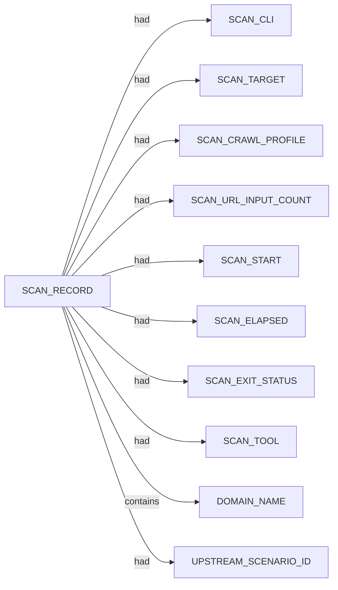

# Katana scan narrative — `from_httpx_vcof_sparse`

## Introduction

Katana emits internal linked URLs, host domains, and HTTP status/method descriptors for each crawled endpoint discovered from the seed target.

## URLs

- (none)

## Graph structure (types)

## Trace

_Trace section omitted when no TRACE nodes present._

## Appendix

### Nodes

- `DOMAIN_NAME`: venturecapitalopportunitiesfund.com.au
- `SCAN_CLI`: katana -list .docs/docs-for-cli-tools/exploration_scratch/katana/urls/from_httpx_vcof_sparse_urls.txt -silent -jsonl -o .docs/docs-for-cli-tools/exploration_scratch/katana/exams/from_httpx_vcof_sparse.jsonl -depth 3 -c 5 -timeout 15 -fs fqdn -ct 3m
- `SCAN_CRAWL_PROFILE`: depth-3,fqdn-scope,concurrency-5,timeout-15,crawl-duration-3m
- `SCAN_ELAPSED`: 705.719
- `SCAN_EXIT_STATUS`: 124
- `SCAN_RECORD`: katana:venturecapitalopportunitiesfund.com.au:katana -list .docs/docs-for-cli-tools/exploration_scratch/katana/urls/from_httpx_vcof_sparse_urls.txt -silent -jsonl -o .docs/docs-for-cli-tools/exploration_scratch/katana/exams/from_httpx_vcof_sparse.jsonl -depth 3 -c 5 -timeout 15 -fs fqdn -ct 3m
- `SCAN_START`: 2026-07-06T11:25:46.218632+00:00
- `SCAN_TARGET`: venturecapitalopportunitiesfund.com.au
- `SCAN_TOOL`: katana
- `SCAN_URL_INPUT_COUNT`: 1
- `UPSTREAM_SCENARIO_ID`: from_subfinder_vcof_sparse

### Edges

- `SCAN_RECORD` `had` `SCAN_CLI`
- `SCAN_RECORD` `had` `SCAN_TARGET`
- `SCAN_RECORD` `had` `SCAN_CRAWL_PROFILE`
- `SCAN_RECORD` `had` `SCAN_URL_INPUT_COUNT`
- `SCAN_RECORD` `had` `SCAN_START`
- `SCAN_RECORD` `had` `SCAN_ELAPSED`
- `SCAN_RECORD` `had` `SCAN_EXIT_STATUS`
- `SCAN_RECORD` `had` `SCAN_TOOL`
- `SCAN_RECORD` `contains` `DOMAIN_NAME`
- `SCAN_RECORD` `had` `UPSTREAM_SCENARIO_ID`
---

*OS-Intel Scan*
