# Katana scan narrative — `from_httpx_vcof_sparse`

## Introduction

Katana emits internal linked URLs, host domains, and HTTP status/method descriptors for each crawled endpoint discovered from the seed target.

## Scan

Every examination has one SCAN_RECORD with scan descriptors linked via had. This scan includes **1** Scan root node(s) (e.g. `katana:venturecapitalopportunitiesfund.com.au:katana -list .docs/docs-for-cli-tools/exploration_scratch/katana/urls/from_httpx_vcof_sparse_urls.txt -silent -jsonl -o .docs/docs-for-cli-tools/exploration_scratch/katana/exams/from_httpx_vcof_sparse.jsonl -depth 3 -c 5 -timeout 15 -fs fqdn -ct 3m`). Linked structures: `SCAN_CLI`, `SCAN_TARGET`, `SCAN_CRAWL_PROFILE`, `SCAN_URL_INPUT_COUNT`, `SCAN_START`, `SCAN_ELAPSED`.

### Structure overview

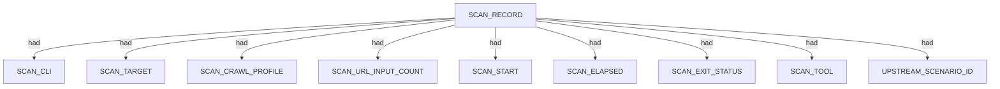

### `SCAN_CLI`

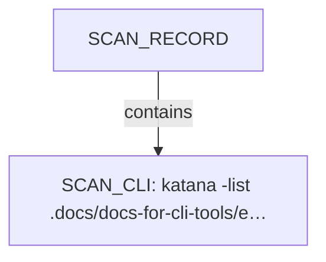

| Nugget | Value |
| --- | --- |
| `SCAN_CLI` | `katana -list .docs/docs-for-cli-tools/exploration_scratch/katana/urls/from_httpx_vcof_sparse_urls.txt -silent -jsonl -o .docs/docs-for-cli-tools/exploration_scratch/katana/exams/from_httpx_vcof_sparse.jsonl -depth 3 -c 5 -timeout 15 -fs fqdn -ct 3m` |

### `SCAN_TARGET`

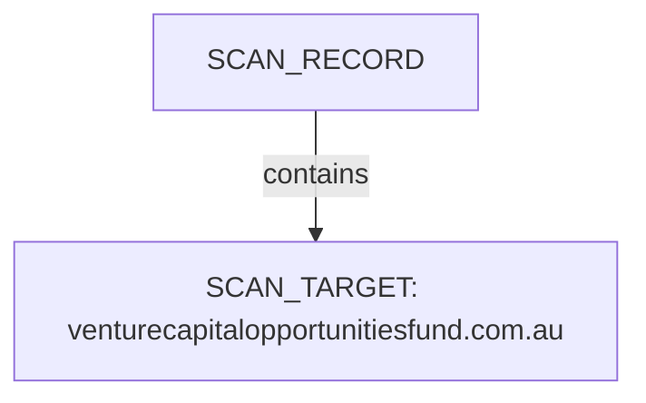

| Nugget | Value |
| --- | --- |
| `SCAN_TARGET` | `venturecapitalopportunitiesfund.com.au` |

### `SCAN_CRAWL_PROFILE`

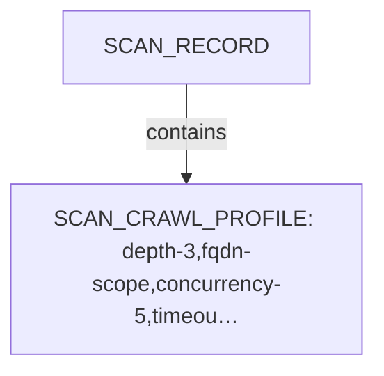

| Nugget | Value |
| --- | --- |
| `SCAN_CRAWL_PROFILE` | `depth-3,fqdn-scope,concurrency-5,timeout-15,crawl-duration-3m` |

### `SCAN_URL_INPUT_COUNT`

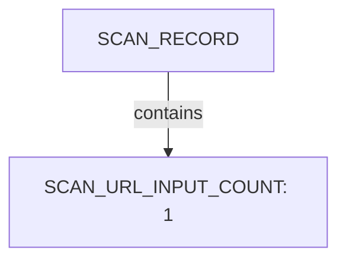

| Nugget | Value |
| --- | --- |
| `SCAN_URL_INPUT_COUNT` | `1` |

### `SCAN_START`

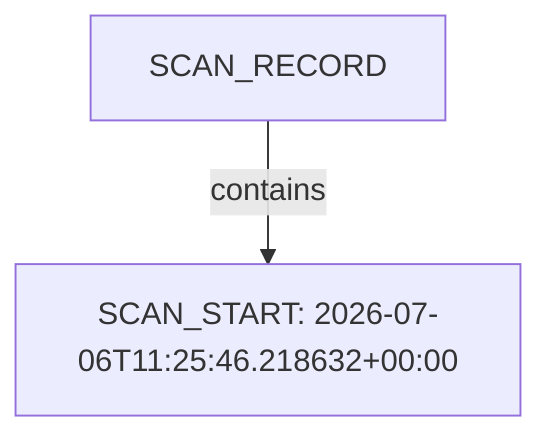

| Nugget | Value |
| --- | --- |
| `SCAN_START` | `2026-07-06T11:25:46.218632+00:00` |

### `SCAN_ELAPSED`

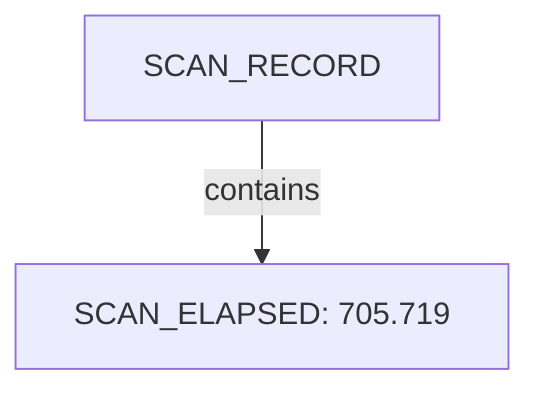

| Nugget | Value |
| --- | --- |
| `SCAN_ELAPSED` | `705.719` |

### `SCAN_EXIT_STATUS`

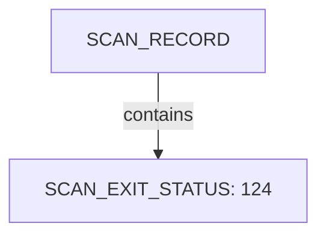

| Nugget | Value |
| --- | --- |
| `SCAN_EXIT_STATUS` | `124` |

### `SCAN_TOOL`

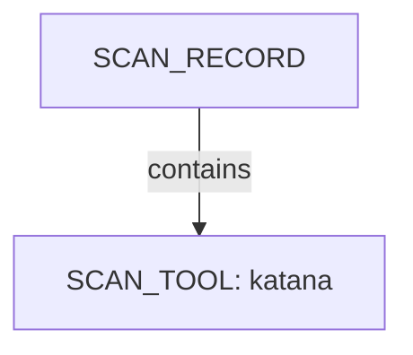

| Nugget | Value |
| --- | --- |
| `SCAN_TOOL` | `katana` |

### `UPSTREAM_SCENARIO_ID`

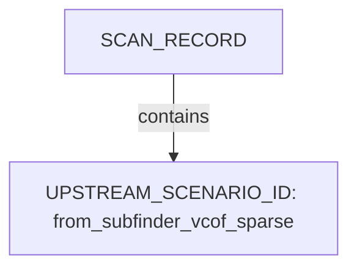

| Nugget | Value |
| --- | --- |
| `UPSTREAM_SCENARIO_ID` | `from_subfinder_vcof_sparse` |

## Domains

Apex DOMAIN_NAME entities contain subdomain DOMAIN_NAME children; descriptors capture discovery mode, sources, and liveness. This scan includes **1** Domains root node(s) (e.g. `venturecapitalopportunitiesfund.com.au`). Linked structures: no child categories.

### Structure overview

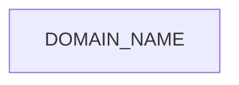

### Values

| Nugget | Value |
| --- | --- |
| `DOMAIN_NAME` | `venturecapitalopportunitiesfund.com.au` |

## Conclusion

See the appendix for the full node and edge inventory.

## Appendix

### Nodes

| Nugget | Value |
| --- | --- |
| `DOMAIN_NAME` | `venturecapitalopportunitiesfund.com.au` |
| `SCAN_CLI` | `katana -list .docs/docs-for-cli-tools/exploration_scratch/katana/urls/from_httpx_vcof_sparse_urls.txt -silent -jsonl -o .docs/docs-for-cli-tools/exploration_scratch/katana/exams/from_httpx_vcof_sparse.jsonl -depth 3 -c 5 -timeout 15 -fs fqdn -ct 3m` |
| `SCAN_CRAWL_PROFILE` | `depth-3,fqdn-scope,concurrency-5,timeout-15,crawl-duration-3m` |
| `SCAN_ELAPSED` | `705.719` |
| `SCAN_EXIT_STATUS` | `124` |
| `SCAN_RECORD` | `katana:venturecapitalopportunitiesfund.com.au:katana -list .docs/docs-for-cli-tools/exploration_scratch/katana/urls/from_httpx_vcof_sparse_urls.txt -silent -jsonl -o .docs/docs-for-cli-tools/exploration_scratch/katana/exams/from_httpx_vcof_sparse.jsonl -depth 3 -c 5 -timeout 15 -fs fqdn -ct 3m` |
| `SCAN_START` | `2026-07-06T11:25:46.218632+00:00` |
| `SCAN_TARGET` | `venturecapitalopportunitiesfund.com.au` |
| `SCAN_TOOL` | `katana` |
| `SCAN_URL_INPUT_COUNT` | `1` |
| `UPSTREAM_SCENARIO_ID` | `from_subfinder_vcof_sparse` |

### Edges

| Source | Relation | Target |
| --- | --- | --- |
| `SCAN_RECORD` | `had` | `SCAN_CLI` |
| `SCAN_RECORD` | `had` | `SCAN_TARGET` |
| `SCAN_RECORD` | `had` | `SCAN_CRAWL_PROFILE` |
| `SCAN_RECORD` | `had` | `SCAN_URL_INPUT_COUNT` |
| `SCAN_RECORD` | `had` | `SCAN_START` |
| `SCAN_RECORD` | `had` | `SCAN_ELAPSED` |
| `SCAN_RECORD` | `had` | `SCAN_EXIT_STATUS` |
| `SCAN_RECORD` | `had` | `SCAN_TOOL` |
| `SCAN_RECORD` | `contains` | `DOMAIN_NAME` |
| `SCAN_RECORD` | `had` | `UPSTREAM_SCENARIO_ID` |
---

*OS-Intel Scan*
