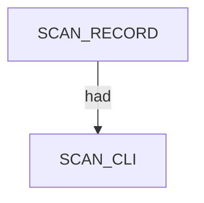
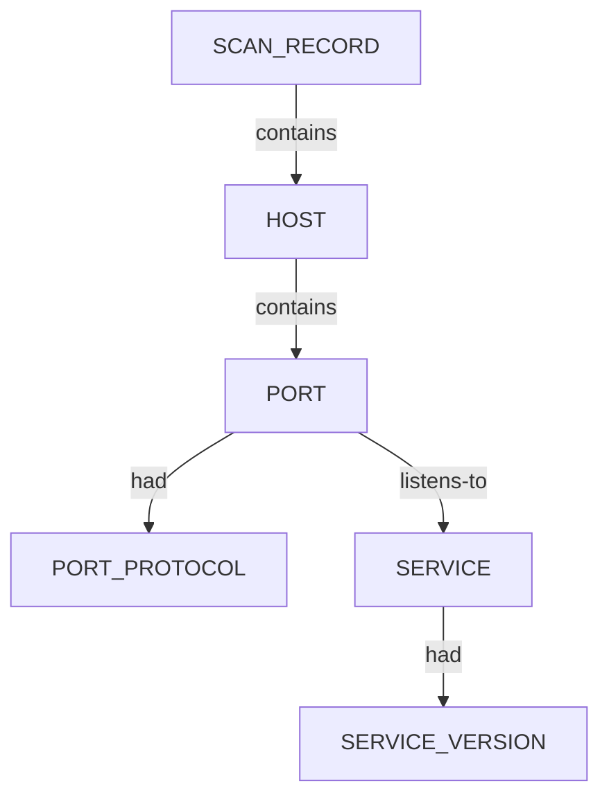

# Nerva — proposed nugget graph structure

Ontology source: `.seed/05_Onotology_for_Nuggets.md`  
Generator: `.seed/scripts/cli_corpus/cli_tool_to_graph.py` (`nerva_to_graph`)  
Harvest: `.seed/scripts/cli_corpus/manifests/nerva.yaml` · runtime `windows` · `.tools/bin/nerva.exe`

Artifacts: `nerva_<scenario_key>_proposed_nuggets_edges.json` in this directory.

## Output classes

| Scenario | Semantic class | Structured artifact |
|----------|----------------|---------------------|
| `tcp_http_rich_json` | HTTP service + CPE/technologies | JSONL |
| `tcp_ssh_misconfigs_json` | SSH banner + misconfig findings | JSONL |
| `tcp_https_praetorian_json` | TLS HTTPS rich metadata | JSONL |
| `tcp_list_file_json` | Multi-target list file (`-l`) | JSONL |
| `tcp_fast_praetorian_json` | Fast mode fingerprint | JSONL |
| `tcp_closed_clean_miss` | Clean miss (no open port) | Empty JSONL |
| `tcp_http_human_text` | Human-readable stdout | Text only |

## Graph head

Every graph has one `SCAN_RECORD` with `SCAN_CLI` descriptor (`had`).

## Per-host service tree

Each JSONL row maps to host → port → protocol/service → optional version:

- `HOST` data: IP (or resolved host).
- `PORT` data: port number.
- `PORT_PROTOCOL`: `tcp` / `udp` transport.
- `SERVICE`: application protocol (`http`, `ssh`, …).
- `SERVICE_VERSION`: banner/CPE string when present.

Instance ids use `uuid5(NAMESPACE_DNS, nugget_id:data)` via `_uid()` in `cli_tool_to_graph.py`.

## Examination evidence

`.docs/docs-for-cli-tools/app_examination_docs/nerva/` — exams 1–7 aligned to manifest scenario order.
