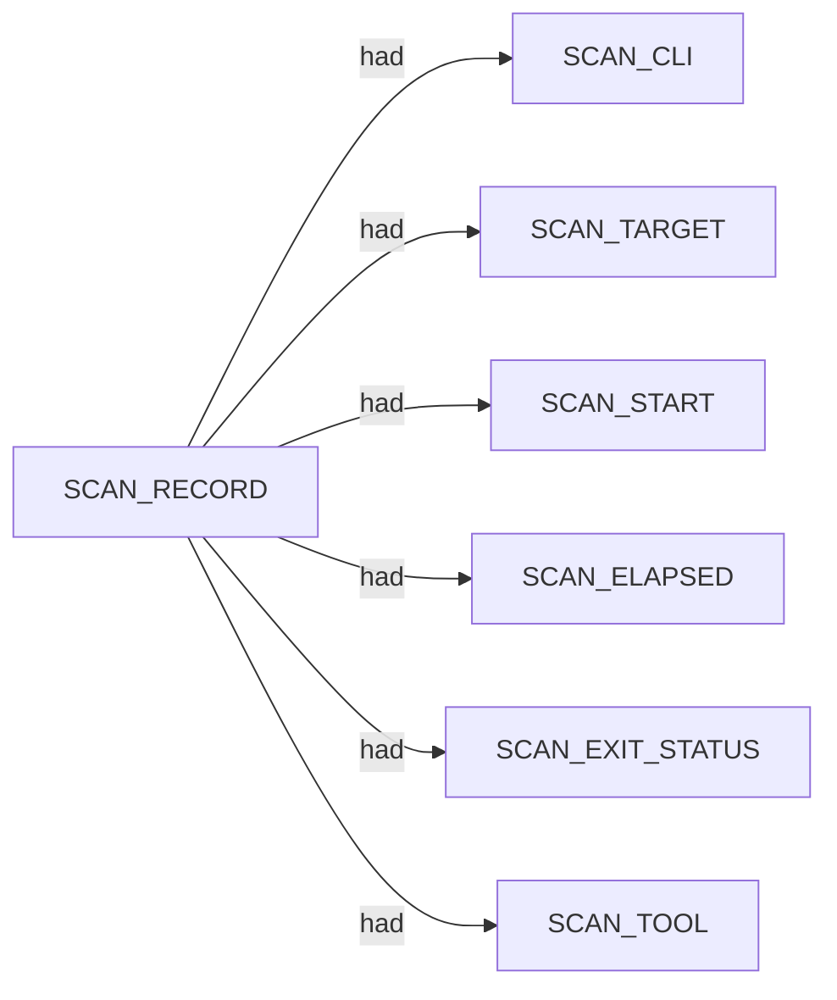

# Nerva scan narrative — `tcp_closed_clean_miss`

## Introduction

The scan used Nerva. Findings are organised under each host or system's category sections (ENVIRONMENT, NETWORKS, APPLICATIONS, VULNERABILITIES). This report follows Scan → Host/System → Trace → Appendix. This report follows Scan → Host/System (categories) → Trace → Appendix. Section diagrams show ontology types and relations only; values appear in prose, tables, and the appendix.

## Systems

- (none)

## CDN / edge fronting

Durable machine identity evidence supports a standard (non-fronted) host classification under Rulesets A/B.

## Services

- (none)

## Graph structure (types)

## Trace

_Trace section omitted when no TRACE nodes present._

## Appendix

### Nodes

- `SCAN_CLI`: nerva -t scanme.nmap.org:1 --json -w 3000
- `SCAN_ELAPSED`: 4.641
- `SCAN_EXIT_STATUS`: 0
- `SCAN_RECORD`: nerva:scanme.nmap.org:1:2026-06-30T07:40:54.267267+00:00
- `SCAN_START`: 2026-06-30T07:40:54.267267+00:00
- `SCAN_TARGET`: scanme.nmap.org:1
- `SCAN_TOOL`: nerva

### Edges

- `SCAN_RECORD` `had` `SCAN_CLI`
- `SCAN_RECORD` `had` `SCAN_TARGET`
- `SCAN_RECORD` `had` `SCAN_START`
- `SCAN_RECORD` `had` `SCAN_ELAPSED`
- `SCAN_RECORD` `had` `SCAN_EXIT_STATUS`
- `SCAN_RECORD` `had` `SCAN_TOOL`
---

*OS-Intel Scan*
