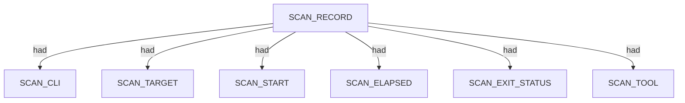
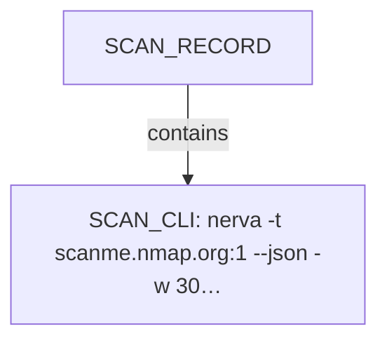
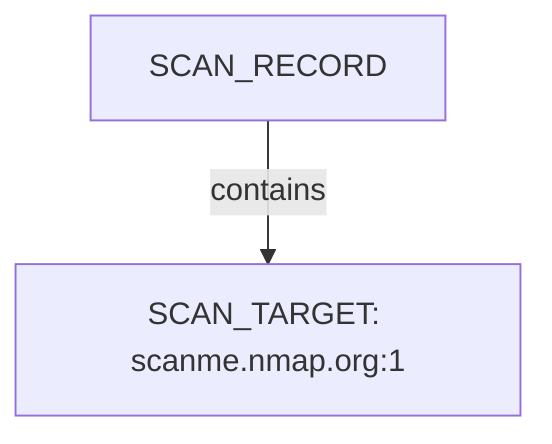
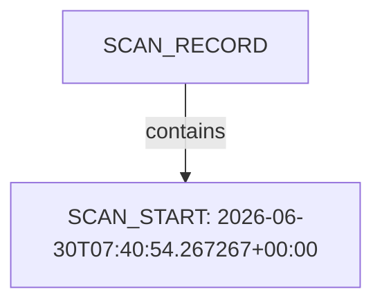
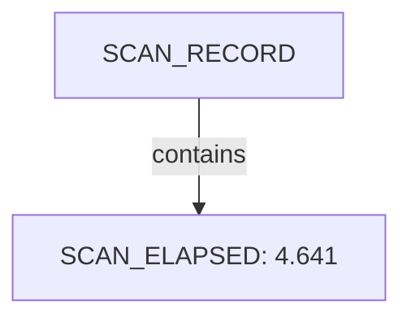
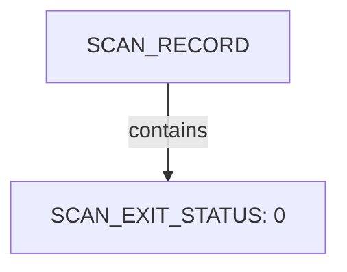
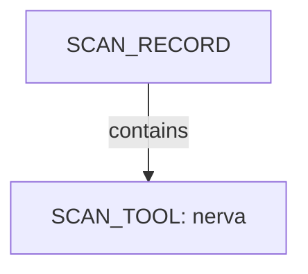

# Nerva scan narrative — `tcp_closed_clean_miss`

## Introduction

The scan used Nerva. Findings are organised under each meta-concept present in the graph (ENVIRONMENT, NETWORKS, APPLICATIONS, VULNERABILITIES, SECURITY). This report follows Scan → Host/System → Trace → Appendix. This report follows Scan → Host/System/Organisation/Domain (categories) → Trace → Appendix. Overview diagrams show ontology types and relations; category diagrams show a few example values with the rest in tables; the appendix inventories every node and edge.

## Scan

Every examination has one SCAN_RECORD with scan descriptors linked via had. This scan includes **1** Scan root node(s) (e.g. `nerva:scanme.nmap.org:1:2026-06-30T07:40:54.267267+00:00`). Linked structures: `SCAN_CLI`, `SCAN_TARGET`, `SCAN_START`, `SCAN_ELAPSED`, `SCAN_EXIT_STATUS`, `SCAN_TOOL`.

### Structure overview

### `SCAN_CLI`

| Nugget | Value |
| --- | --- |
| `SCAN_CLI` | `nerva -t scanme.nmap.org:1 --json -w 3000` |

### `SCAN_TARGET`

| Nugget | Value |
| --- | --- |
| `SCAN_TARGET` | `scanme.nmap.org:1` |

### `SCAN_START`

| Nugget | Value |
| --- | --- |
| `SCAN_START` | `2026-06-30T07:40:54.267267+00:00` |

### `SCAN_ELAPSED`

| Nugget | Value |
| --- | --- |
| `SCAN_ELAPSED` | `4.641` |

### `SCAN_EXIT_STATUS`

| Nugget | Value |
| --- | --- |
| `SCAN_EXIT_STATUS` | `0` |

### `SCAN_TOOL`

| Nugget | Value |
| --- | --- |
| `SCAN_TOOL` | `nerva` |

## Conclusion

See the appendix for the full node and edge inventory.

## Appendix

### Nodes

| Nugget | Value |
| --- | --- |
| `SCAN_CLI` | `nerva -t scanme.nmap.org:1 --json -w 3000` |
| `SCAN_ELAPSED` | `4.641` |
| `SCAN_EXIT_STATUS` | `0` |
| `SCAN_RECORD` | `nerva:scanme.nmap.org:1:2026-06-30T07:40:54.267267+00:00` |
| `SCAN_START` | `2026-06-30T07:40:54.267267+00:00` |
| `SCAN_TARGET` | `scanme.nmap.org:1` |
| `SCAN_TOOL` | `nerva` |

### Edges

| Source | Relation | Target |
| --- | --- | --- |
| `SCAN_RECORD` | `had` | `SCAN_CLI` |
| `SCAN_RECORD` | `had` | `SCAN_TARGET` |
| `SCAN_RECORD` | `had` | `SCAN_START` |
| `SCAN_RECORD` | `had` | `SCAN_ELAPSED` |
| `SCAN_RECORD` | `had` | `SCAN_EXIT_STATUS` |
| `SCAN_RECORD` | `had` | `SCAN_TOOL` |
---

*OS-Intel Scan*
