# Nerva scan narrative — `tcp_http_rich_json`

## Introduction

The scan used Nerva. Findings are organised under each meta-concept present in the graph (ENVIRONMENT, NETWORKS, APPLICATIONS, VULNERABILITIES, SECURITY). This report follows Scan → Host/System → Trace → Appendix. This report follows Scan → Host/System/Organisation/Domain (categories) → Trace → Appendix. Overview diagrams show ontology types and relations; category diagrams show a few example values with the rest in tables; the appendix inventories every node and edge.

## Scan

Every examination has one SCAN_RECORD with scan descriptors linked via had. This scan includes **1** Scan root node(s) (e.g. `nerva:scanme.nmap.org:80:2026-06-30T07:38:43.148728+00:00`). Linked structures: `SCAN_CLI`, `SCAN_TARGET`, `SCAN_START`, `SCAN_ELAPSED`, `SCAN_EXIT_STATUS`, `SCAN_TOOL`.

### Structure overview

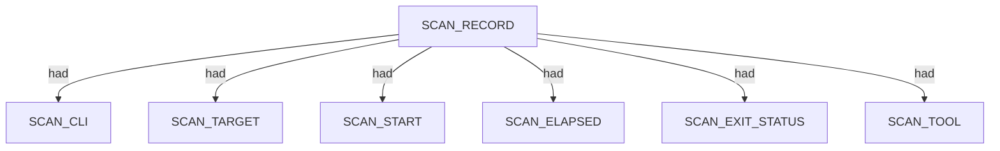

### `SCAN_CLI`

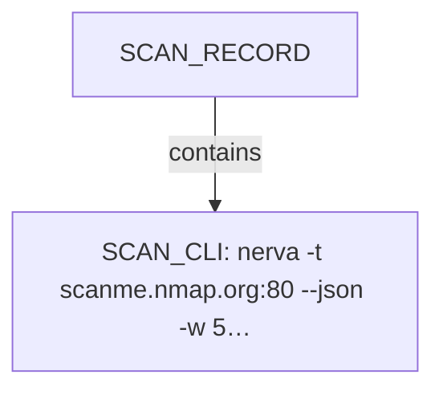

| Nugget | Value |
| --- | --- |
| `SCAN_CLI` | `nerva -t scanme.nmap.org:80 --json -w 5000` |

### `SCAN_TARGET`

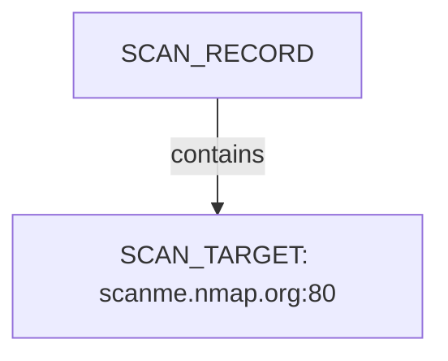

| Nugget | Value |
| --- | --- |
| `SCAN_TARGET` | `scanme.nmap.org:80` |

### `SCAN_START`

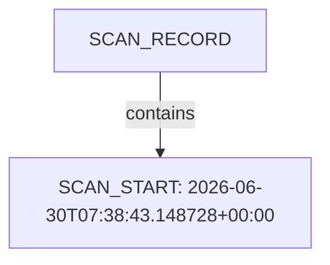

| Nugget | Value |
| --- | --- |
| `SCAN_START` | `2026-06-30T07:38:43.148728+00:00` |

### `SCAN_ELAPSED`

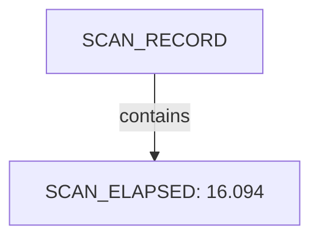

| Nugget | Value |
| --- | --- |
| `SCAN_ELAPSED` | `16.094` |

### `SCAN_EXIT_STATUS`

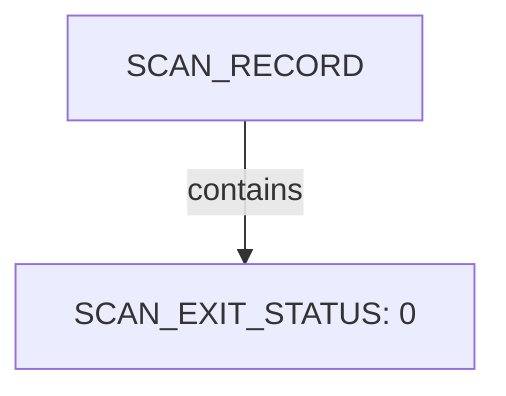

| Nugget | Value |
| --- | --- |
| `SCAN_EXIT_STATUS` | `0` |

### `SCAN_TOOL`

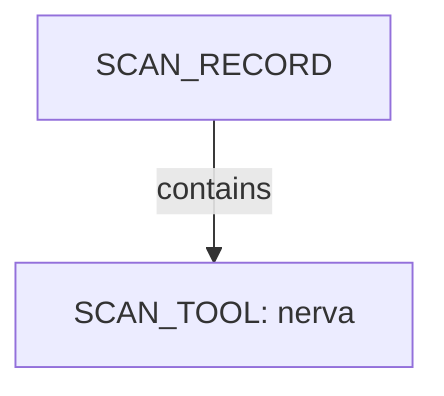

| Nugget | Value |
| --- | --- |
| `SCAN_TOOL` | `nerva` |

## CDN

CDN edge endpoints replace HOST when fronting is detected; origin host count may be indeterminate. This scan includes **1** CDN root node(s) (e.g. `scanme.nmap.org`). Linked structures: `NETWORKS`, `APPLICATIONS`.

### Structure overview

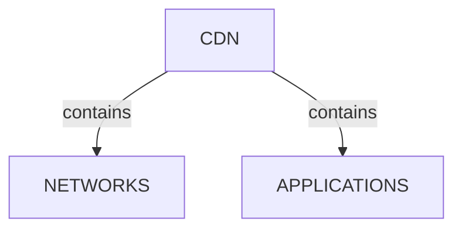

### `NETWORKS`

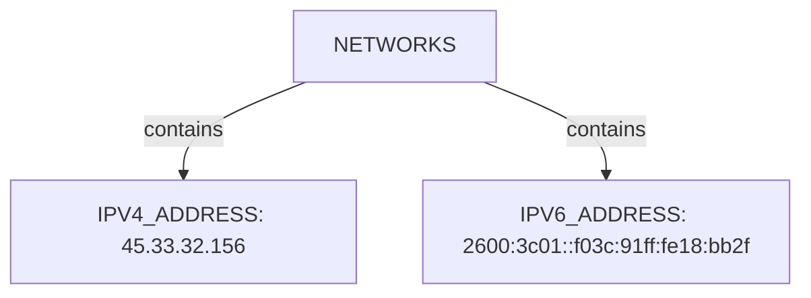

| Nugget | Value |
| --- | --- |
| `IPV4_ADDRESS` | `45.33.32.156` |
| `IPV6_ADDRESS` | `2600:3c01::f03c:91ff:fe18:bb2f` |

### `APPLICATIONS`

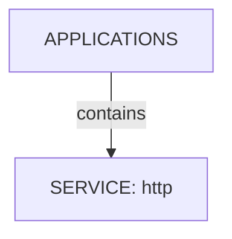

| Nugget | Value |
| --- | --- |
| `SERVICE` | `http` |

## Services and ports

APPLICATION services listen-to PORT entities under NETWORKS/TRANSPORT. This scan includes **1** Services and ports root node(s) (e.g. `http`). Linked structures: no child categories.

### Structure overview

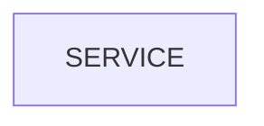

### Values

| Nugget | Value |
| --- | --- |
| `SERVICE` | `http` |

## Conclusion

See the appendix for the full node and edge inventory.

## Appendix

### Nodes

| Nugget | Value |
| --- | --- |
| `APPLICATIONS` | `applications:scanme.nmap.org` |
| `CDN` | `scanme.nmap.org` |
| `CDN_VENDOR` | `Netlify` |
| `CLASSIFICATION_RULE_FIRED` | `C1: Server/header signature (Netlify)` |
| `CPE_URL` | `cpe:2.3:a:apache:http_server:*:*:*:*:*:*:*:*` |
| `CPE_URL` | `cpe:2.3:a:apache:http_server:2.4.7:*:*:*:*:*:*:*` |
| `CPE_URL` | `cpe:2.3:o:canonical:ubuntu_linux:*:*:*:*:*:*:*:*` |
| `HOST_CLASSIFICATION` | `fronted_unknown` |
| `HTTP_STATUS_CODE` | `200` |
| `IPV4_ADDRESS` | `45.33.32.156` |
| `IPV6_ADDRESS` | `2600:3c01::f03c:91ff:fe18:bb2f` |
| `NETWORKS` | `networks:scanme.nmap.org` |
| `ORIGIN_FINGERPRINT_SUPPRESSED` | `True` |
| `ORIGIN_HOST_COUNT` | `indeterminate` |
| `PORT` | `80` |
| `SCAN_CLI` | `nerva -t scanme.nmap.org:80 --json -w 5000` |
| `SCAN_ELAPSED` | `16.094` |
| `SCAN_EXIT_STATUS` | `0` |
| `SCAN_RECORD` | `nerva:scanme.nmap.org:80:2026-06-30T07:38:43.148728+00:00` |
| `SCAN_START` | `2026-06-30T07:38:43.148728+00:00` |
| `SCAN_TARGET` | `scanme.nmap.org:80` |
| `SCAN_TOOL` | `nerva` |
| `SERVICE` | `http` |
| `SERVICE_VERSION` | `Apache/2.4.7 (Ubuntu)` |
| `SOFTWARE_USED` | `Apache HTTP Server:2.4.7` |
| `SOFTWARE_USED` | `Ubuntu` |
| `SOFTWARE_USED` | `apache_httpd:2.4.7` |
| `TLS_ENABLED` | `False` |
| `TRANSPORT` | `tcp` |

### Edges

| Source | Relation | Target |
| --- | --- | --- |
| `SCAN_RECORD` | `had` | `SCAN_CLI` |
| `SCAN_RECORD` | `had` | `SCAN_TARGET` |
| `SCAN_RECORD` | `had` | `SCAN_START` |
| `SCAN_RECORD` | `had` | `SCAN_ELAPSED` |
| `SCAN_RECORD` | `had` | `SCAN_EXIT_STATUS` |
| `SCAN_RECORD` | `had` | `SCAN_TOOL` |
| `SCAN_RECORD` | `contains` | `CDN` |
| `CDN` | `had` | `HOST_CLASSIFICATION` |
| `CDN` | `had` | `CLASSIFICATION_RULE_FIRED` |
| `CDN` | `had` | `CDN_VENDOR` |
| `CDN` | `had` | `ORIGIN_HOST_COUNT` |
| `CDN` | `contains` | `NETWORKS` |
| `CDN` | `contains` | `APPLICATIONS` |
| `NETWORKS` | `contains` | `IPV6_ADDRESS` |
| `APPLICATIONS` | `contains` | `SERVICE` |
| `IPV6_ADDRESS` | `contains` | `TRANSPORT` |
| `TRANSPORT` | `contains` | `PORT` |
| `SERVICE` | `listens-to` | `PORT` |
| `SERVICE` | `had` | `SERVICE_VERSION` |
| `SERVICE` | `had` | `HTTP_STATUS_CODE` |
| `SERVICE` | `had` | `TLS_ENABLED` |
| `SERVICE` | `contains` | `SOFTWARE_USED` |
| `SOFTWARE_USED` | `had` | `ORIGIN_FINGERPRINT_SUPPRESSED` |
| `SERVICE` | `contains` | `CPE_URL` |
| `NETWORKS` | `contains` | `IPV4_ADDRESS` |
| `IPV4_ADDRESS` | `contains` | `TRANSPORT` |
---

*OS-Intel Scan*
