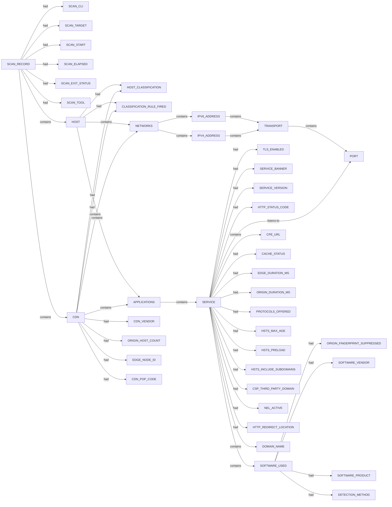

# Nerva scan narrative — `tcp_list_file_json`

## Introduction

The scan used Nerva. Findings are organised under each host or system's category sections (ENVIRONMENT, NETWORKS, APPLICATIONS, VULNERABILITIES). This report follows Scan → Host/System → Trace → Appendix. This report follows Scan → Host/System (categories) → Trace → Appendix. Section diagrams show ontology types and relations only; values appear in prose, tables, and the appendix.

## Systems

- `CDN` `praetorian.com`
- `CDN` `scanme.nmap.org`
- `HOST` `scanme.nmap.org:group:1`

## CDN / edge fronting

This hostname is fronted by a CDN/edge vendor. Origin host count is indeterminate — do not treat edge IP cardinality as origin host count.

Origin host count is **indeterminate**.

## Services

- `ssh`
- `http`
- `https`

## Graph structure (types)

## Trace

_Trace section omitted when no TRACE nodes present._

## Appendix

### Nodes

- `APPLICATIONS`: applications:praetorian.com
- `APPLICATIONS`: applications:scanme.nmap.org
- `APPLICATIONS`: applications:scanme.nmap.org:group:1
- `CACHE_STATUS`: BYPASS
- `CDN`: praetorian.com
- `CDN`: scanme.nmap.org
- `CDN_POP_CODE`: SYD
- `CDN_VENDOR`: Cloudflare
- `CDN_VENDOR`: Netlify
- `CLASSIFICATION_RULE_FIRED`: B1+B2: durable identity with non-web port profile
- `CLASSIFICATION_RULE_FIRED`: C1: Server/header signature (Cloudflare)
- `CLASSIFICATION_RULE_FIRED`: C1: Server/header signature (Netlify)
- `CPE_URL`: cpe:2.3:a:apache:http_server:*:*:*:*:*:*:*:*
- `CPE_URL`: cpe:2.3:a:apache:http_server:2.4.7:*:*:*:*:*:*:*
- `CPE_URL`: cpe:2.3:a:f5:nginx:*:*:*:*:*:*:*:*
- `CPE_URL`: cpe:2.3:o:canonical:ubuntu_linux:*:*:*:*:*:*:*:*
- `CPE_URL`: cpe:2.3:o:checkpoint:gaia:*:*:*:*:*:*:*:*
- `CPE_URL`: cpe:2.3:o:zyxel:zld_firmware:*:*:*:*:*:*:*:*
- `CSP_THIRD_PARTY_DOMAIN`: app.hubspot.com
- `CSP_THIRD_PARTY_DOMAIN`: boards.greenhouse.io
- `CSP_THIRD_PARTY_DOMAIN`: disqus.com
- `CSP_THIRD_PARTY_DOMAIN`: doubleclick.net
- `CSP_THIRD_PARTY_DOMAIN`: google.com
- `CSP_THIRD_PARTY_DOMAIN`: googletagmanager.com
- `CSP_THIRD_PARTY_DOMAIN`: greenhouse.io
- `CSP_THIRD_PARTY_DOMAIN`: hsforms.com
- `CSP_THIRD_PARTY_DOMAIN`: hsforms.net
- `CSP_THIRD_PARTY_DOMAIN`: js.driftt.com
- `CSP_THIRD_PARTY_DOMAIN`: online.fliphtml5.com
- `CSP_THIRD_PARTY_DOMAIN`: player.vimeo.com
- `CSP_THIRD_PARTY_DOMAIN`: twitter.com
- `CSP_THIRD_PARTY_DOMAIN`: vars.hotjar.com
- `CSP_THIRD_PARTY_DOMAIN`: vimeo.com
- `CSP_THIRD_PARTY_DOMAIN`: widget.drift.com
- `CSP_THIRD_PARTY_DOMAIN`: youtube.com
- `DETECTION_METHOD`: error_page
- `DOMAIN_NAME`: www.praetorian.com
- `EDGE_DURATION_MS`: 217
- `EDGE_DURATION_MS`: 228
- `EDGE_DURATION_MS`: 229
- `EDGE_DURATION_MS`: 276
- `EDGE_NODE_ID`: a13b857a18212def-SYD
- `EDGE_NODE_ID`: a13b857a182aaaf0-SYD
- `EDGE_NODE_ID`: a13b857a1be8561f-SYD
- `EDGE_NODE_ID`: a13b857a1bf0ccf3-SYD
- `HOST`: scanme.nmap.org:group:1
- `HOST_CLASSIFICATION`: fronted_unknown
- `HOST_CLASSIFICATION`: standard_host
- `HSTS_INCLUDE_SUBDOMAINS`: True
- `HSTS_MAX_AGE`: 31536000
- `HSTS_PRELOAD`: True
- `HTTP_REDIRECT_LOCATION`: https://www.praetorian.com/
- `HTTP_STATUS_CODE`: 200
- `HTTP_STATUS_CODE`: 301
- `IPV4_ADDRESS`: 172.66.40.60
- `IPV4_ADDRESS`: 172.66.43.196
- `IPV4_ADDRESS`: 45.33.32.156
- `IPV6_ADDRESS`: 2600:3c01::f03c:91ff:fe18:bb2f
- `IPV6_ADDRESS`: 2606:4700:3108::ac42:283c
- `IPV6_ADDRESS`: 2606:4700:3108::ac42:2bc4
- `NEL_ACTIVE`: True
- `NETWORKS`: networks:praetorian.com
- `NETWORKS`: networks:scanme.nmap.org
- `NETWORKS`: networks:scanme.nmap.org:group:1
- `ORIGIN_DURATION_MS`: 0
- `ORIGIN_FINGERPRINT_SUPPRESSED`: True
- `ORIGIN_HOST_COUNT`: indeterminate
- `PORT`: 22
- `PORT`: 443
- `PORT`: 80
- `PROTOCOLS_OFFERED`: h3
- `SCAN_CLI`: nerva -l .seed/scripts/cli_corpus/fixtures/nerva_targets.txt --json -w 8000
- `SCAN_ELAPSED`: 23.171
- `SCAN_EXIT_STATUS`: 0
- `SCAN_RECORD`: nerva:scanme.nmap.org + praetorian.com:2026-06-30T07:40:07.243348+00:00
- `SCAN_START`: 2026-06-30T07:40:07.243348+00:00
- `SCAN_TARGET`: scanme.nmap.org + praetorian.com
- `SCAN_TOOL`: nerva
- `SERVICE`: http
- `SERVICE`: https
- `SERVICE`: ssh
- `SERVICE_BANNER`: SSH-2.0-OpenSSH_6.6.1p1 Ubuntu-2ubuntu2.13
- `SERVICE_VERSION`: Apache/2.4.7 (Ubuntu)
- `SERVICE_VERSION`: cloudflare
- `SOFTWARE_PRODUCT`: Nginx
- `SOFTWARE_PRODUCT`: Security Gateway
- `SOFTWARE_PRODUCT`: Zyxel Firewall
- `SOFTWARE_USED`: Apache HTTP Server:2.4.7
- `SOFTWARE_USED`: Cloudflare
- `SOFTWARE_USED`: Cloudflare Browser Insights
- `SOFTWARE_USED`: HSTS
- `SOFTWARE_USED`: HTTP/3
- `SOFTWARE_USED`: Ubuntu
- `SOFTWARE_USED`: apache_httpd:2.4.7
- `SOFTWARE_USED`: checkpoint-gateway
- `SOFTWARE_USED`: nginx
- `SOFTWARE_USED`: zyxel-firewall
- `SOFTWARE_VENDOR`: Check Point
- `SOFTWARE_VENDOR`: F5
- `SOFTWARE_VENDOR`: Zyxel
- `TLS_ENABLED`: False
- `TLS_ENABLED`: True
- `TRANSPORT`: tcp

### Edges

- `SCAN_RECORD` `had` `SCAN_CLI`
- `SCAN_RECORD` `had` `SCAN_TARGET`
- `SCAN_RECORD` `had` `SCAN_START`
- `SCAN_RECORD` `had` `SCAN_ELAPSED`
- `SCAN_RECORD` `had` `SCAN_EXIT_STATUS`
- `SCAN_RECORD` `had` `SCAN_TOOL`
- `SCAN_RECORD` `contains` `HOST`
- `HOST` `had` `HOST_CLASSIFICATION`
- `HOST` `had` `CLASSIFICATION_RULE_FIRED`
- `HOST` `contains` `NETWORKS`
- `HOST` `contains` `APPLICATIONS`
- `NETWORKS` `contains` `IPV6_ADDRESS`
- `APPLICATIONS` `contains` `SERVICE`
- `IPV6_ADDRESS` `contains` `TRANSPORT`
- `TRANSPORT` `contains` `PORT`
- `SERVICE` `listens-to` `PORT`
- `SERVICE` `had` `TLS_ENABLED`
- `SERVICE` `had` `SERVICE_BANNER`
- `NETWORKS` `contains` `IPV4_ADDRESS`
- `IPV4_ADDRESS` `contains` `TRANSPORT`
- `SCAN_RECORD` `contains` `CDN`
- `CDN` `had` `HOST_CLASSIFICATION`
- `CDN` `had` `CLASSIFICATION_RULE_FIRED`
- `CDN` `had` `CDN_VENDOR`
- `CDN` `had` `ORIGIN_HOST_COUNT`
- `CDN` `contains` `NETWORKS`
- `CDN` `contains` `APPLICATIONS`
- `NETWORKS` `contains` `IPV4_ADDRESS`
- `APPLICATIONS` `contains` `SERVICE`
- `TRANSPORT` `contains` `PORT`
- `SERVICE` `listens-to` `PORT`
- `SERVICE` `had` `SERVICE_VERSION`
- `SERVICE` `had` `HTTP_STATUS_CODE`
- `SERVICE` `had` `TLS_ENABLED`
- `SERVICE` `contains` `SOFTWARE_USED`
- `SOFTWARE_USED` `had` `ORIGIN_FINGERPRINT_SUPPRESSED`
- `SERVICE` `contains` `SOFTWARE_USED`
- `SOFTWARE_USED` `had` `ORIGIN_FINGERPRINT_SUPPRESSED`
- `SERVICE` `contains` `SOFTWARE_USED`
- `SOFTWARE_USED` `had` `ORIGIN_FINGERPRINT_SUPPRESSED`
- `SERVICE` `contains` `CPE_URL`
- `SERVICE` `contains` `CPE_URL`
- `SERVICE` `contains` `CPE_URL`
- `NETWORKS` `contains` `IPV6_ADDRESS`
- `SCAN_RECORD` `contains` `CDN`
- `CDN` `had` `HOST_CLASSIFICATION`
- `CDN` `had` `CLASSIFICATION_RULE_FIRED`
- `CDN` `had` `CDN_VENDOR`
- `CDN` `had` `ORIGIN_HOST_COUNT`
- `CDN` `contains` `NETWORKS`
- `CDN` `contains` `APPLICATIONS`
- `NETWORKS` `contains` `IPV4_ADDRESS`
- `APPLICATIONS` `contains` `SERVICE`
- `IPV4_ADDRESS` `contains` `TRANSPORT`
- `TRANSPORT` `contains` `PORT`
- `SERVICE` `listens-to` `PORT`
- `SERVICE` `had` `SERVICE_VERSION`
- `SERVICE` `had` `HTTP_STATUS_CODE`
- `SERVICE` `had` `TLS_ENABLED`
- `CDN` `had` `EDGE_NODE_ID`
- `CDN` `had` `CDN_POP_CODE`
- `SERVICE` `had` `CACHE_STATUS`
- `SERVICE` `had` `EDGE_DURATION_MS`
- `SERVICE` `had` `ORIGIN_DURATION_MS`
- `SERVICE` `had` `PROTOCOLS_OFFERED`
- `SERVICE` `had` `HSTS_MAX_AGE`
- `SERVICE` `had` `HSTS_PRELOAD`
- `SERVICE` `had` `HSTS_INCLUDE_SUBDOMAINS`
- `SERVICE` `had` `CSP_THIRD_PARTY_DOMAIN`
- `SERVICE` `had` `CSP_THIRD_PARTY_DOMAIN`
- `SERVICE` `had` `CSP_THIRD_PARTY_DOMAIN`
- `SERVICE` `had` `CSP_THIRD_PARTY_DOMAIN`
- `SERVICE` `had` `CSP_THIRD_PARTY_DOMAIN`
- `SERVICE` `had` `CSP_THIRD_PARTY_DOMAIN`
- `SERVICE` `had` `CSP_THIRD_PARTY_DOMAIN`
- `SERVICE` `had` `CSP_THIRD_PARTY_DOMAIN`
- `SERVICE` `had` `CSP_THIRD_PARTY_DOMAIN`
- `SERVICE` `had` `CSP_THIRD_PARTY_DOMAIN`
- `SERVICE` `had` `CSP_THIRD_PARTY_DOMAIN`
- `SERVICE` `had` `CSP_THIRD_PARTY_DOMAIN`
- `SERVICE` `had` `CSP_THIRD_PARTY_DOMAIN`
- `SERVICE` `had` `CSP_THIRD_PARTY_DOMAIN`
- `SERVICE` `had` `CSP_THIRD_PARTY_DOMAIN`
- `SERVICE` `had` `CSP_THIRD_PARTY_DOMAIN`
- `SERVICE` `had` `CSP_THIRD_PARTY_DOMAIN`
- `SERVICE` `had` `NEL_ACTIVE`
- `SERVICE` `contains` `SOFTWARE_USED`
- `SERVICE` `contains` `SOFTWARE_USED`
- `SERVICE` `contains` `SOFTWARE_USED`
- `SERVICE` `contains` `SOFTWARE_USED`
- `SERVICE` `contains` `SOFTWARE_USED`
- `SOFTWARE_USED` `had` `ORIGIN_FINGERPRINT_SUPPRESSED`
- `SOFTWARE_USED` `had` `SOFTWARE_VENDOR`
- `SOFTWARE_USED` `had` `SOFTWARE_PRODUCT`
- `SERVICE` `contains` `SOFTWARE_USED`
- `SOFTWARE_USED` `had` `ORIGIN_FINGERPRINT_SUPPRESSED`
- `SOFTWARE_USED` `had` `SOFTWARE_VENDOR`
- `SOFTWARE_USED` `had` `SOFTWARE_PRODUCT`
- `SOFTWARE_USED` `had` `DETECTION_METHOD`
- `SERVICE` `contains` `SOFTWARE_USED`
- `SOFTWARE_USED` `had` `ORIGIN_FINGERPRINT_SUPPRESSED`
- `SOFTWARE_USED` `had` `SOFTWARE_VENDOR`
- `SOFTWARE_USED` `had` `SOFTWARE_PRODUCT`
- `SERVICE` `contains` `CPE_URL`
- `SERVICE` `contains` `CPE_URL`
- `SERVICE` `contains` `CPE_URL`
- `SERVICE` `had` `HTTP_REDIRECT_LOCATION`
- `SERVICE` `contains` `DOMAIN_NAME`
- `NETWORKS` `contains` `IPV6_ADDRESS`
- `IPV6_ADDRESS` `contains` `TRANSPORT`
- `CDN` `had` `EDGE_NODE_ID`
- `SERVICE` `had` `EDGE_DURATION_MS`
- `NETWORKS` `contains` `IPV4_ADDRESS`
- `IPV4_ADDRESS` `contains` `TRANSPORT`
- `CDN` `had` `EDGE_NODE_ID`
- `SERVICE` `had` `EDGE_DURATION_MS`
- `NETWORKS` `contains` `IPV6_ADDRESS`
- `IPV6_ADDRESS` `contains` `TRANSPORT`
- `CDN` `had` `EDGE_NODE_ID`
- `SERVICE` `had` `EDGE_DURATION_MS`
---

*OS-Intel Scan*
