# Nerva scan narrative — `tcp_list_file_json`

## Introduction

The scan used Nerva. Findings are organised under each meta-concept present in the graph (ENVIRONMENT, NETWORKS, APPLICATIONS, VULNERABILITIES, SECURITY). This report follows Scan → Host/System → Trace → Appendix. This report follows Scan → Host/System/Organisation/Domain (categories) → Trace → Appendix. Overview diagrams show ontology types and relations; category diagrams show a few example values with the rest in tables; the appendix inventories every node and edge.

## Scan

Every examination has one SCAN_RECORD with scan descriptors linked via had. This scan includes **1** Scan root node(s) (e.g. `nerva:scanme.nmap.org + praetorian.com:2026-06-30T07:40:07.243348+00:00`). Linked structures: `SCAN_CLI`, `SCAN_TARGET`, `SCAN_START`, `SCAN_ELAPSED`, `SCAN_EXIT_STATUS`, `SCAN_TOOL`.

### Structure overview

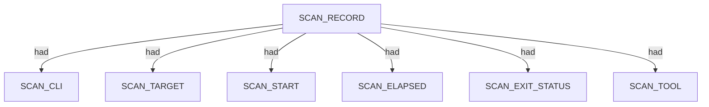

### `SCAN_CLI`

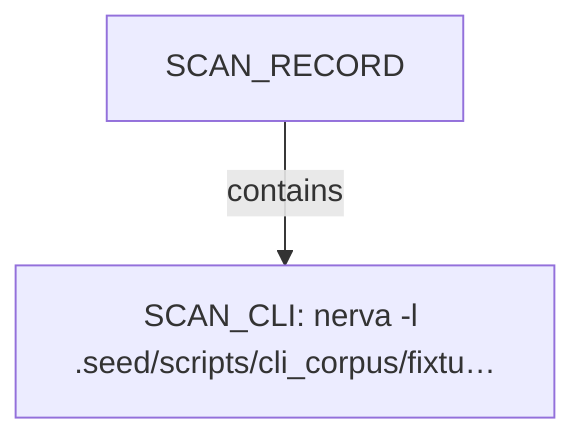

| Nugget | Value |
| --- | --- |
| `SCAN_CLI` | `nerva -l .seed/scripts/cli_corpus/fixtures/nerva_targets.txt --json -w 8000` |

### `SCAN_TARGET`

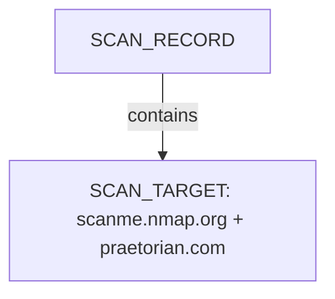

| Nugget | Value |
| --- | --- |
| `SCAN_TARGET` | `scanme.nmap.org + praetorian.com` |

### `SCAN_START`

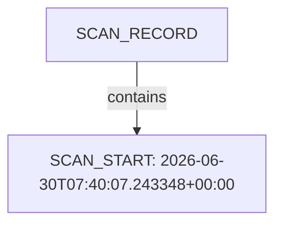

| Nugget | Value |
| --- | --- |
| `SCAN_START` | `2026-06-30T07:40:07.243348+00:00` |

### `SCAN_ELAPSED`

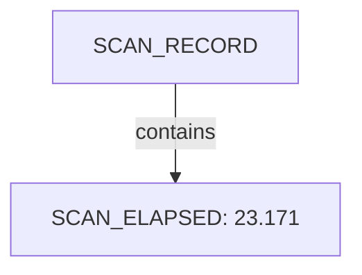

| Nugget | Value |
| --- | --- |
| `SCAN_ELAPSED` | `23.171` |

### `SCAN_EXIT_STATUS`

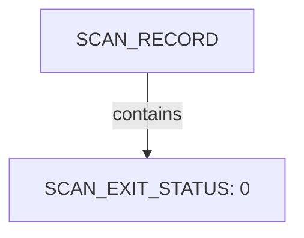

| Nugget | Value |
| --- | --- |
| `SCAN_EXIT_STATUS` | `0` |

### `SCAN_TOOL`

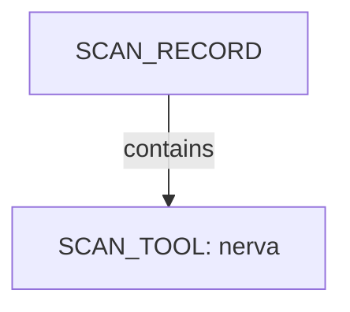

| Nugget | Value |
| --- | --- |
| `SCAN_TOOL` | `nerva` |

## Host

Qualified HOST endpoints own category trees for networks, applications, environment, and security findings. This scan includes **1** Host root node(s) (e.g. `scanme.nmap.org:group:1`). Linked structures: `NETWORKS`, `APPLICATIONS`.

### Structure overview

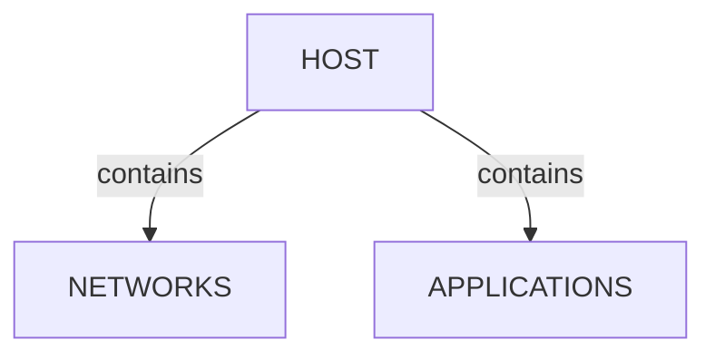

### `NETWORKS`

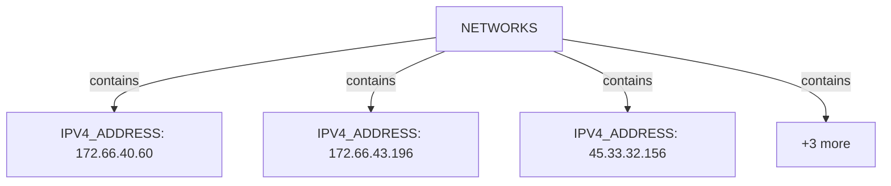

| Nugget | Value |
| --- | --- |
| `IPV4_ADDRESS` | `172.66.40.60` |
| `IPV4_ADDRESS` | `172.66.43.196` |
| `IPV4_ADDRESS` | `45.33.32.156` |
| `IPV6_ADDRESS` | `2600:3c01::f03c:91ff:fe18:bb2f` |
| `IPV6_ADDRESS` | `2606:4700:3108::ac42:283c` |
| `IPV6_ADDRESS` | `2606:4700:3108::ac42:2bc4` |

### `APPLICATIONS`

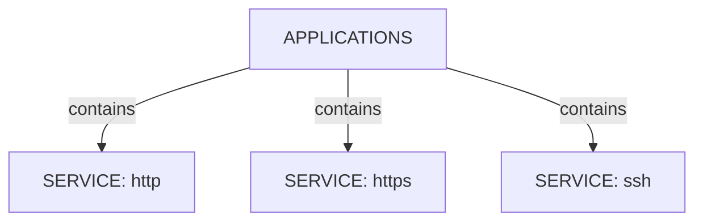

| Nugget | Value |
| --- | --- |
| `SERVICE` | `http` |
| `SERVICE` | `https` |
| `SERVICE` | `ssh` |

## CDN

CDN edge endpoints replace HOST when fronting is detected; origin host count may be indeterminate. This scan includes **2** CDN root node(s) (e.g. `scanme.nmap.org`, `praetorian.com`). Linked structures: `NETWORKS`, `APPLICATIONS`.

### Structure overview

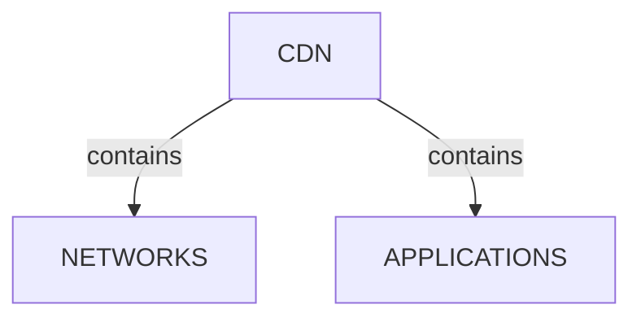

### `NETWORKS`

| Nugget | Value |
| --- | --- |
| `IPV4_ADDRESS` | `172.66.40.60` |
| `IPV4_ADDRESS` | `172.66.43.196` |
| `IPV4_ADDRESS` | `45.33.32.156` |
| `IPV6_ADDRESS` | `2600:3c01::f03c:91ff:fe18:bb2f` |
| `IPV6_ADDRESS` | `2606:4700:3108::ac42:283c` |
| `IPV6_ADDRESS` | `2606:4700:3108::ac42:2bc4` |

### `APPLICATIONS`

| Nugget | Value |
| --- | --- |
| `SERVICE` | `http` |
| `SERVICE` | `https` |
| `SERVICE` | `ssh` |

## Domains

Apex DOMAIN_NAME entities contain subdomain DOMAIN_NAME children; descriptors capture discovery mode, sources, and liveness. This scan includes **1** Domains root node(s) (e.g. `www.praetorian.com`). Linked structures: no child categories.

### Structure overview

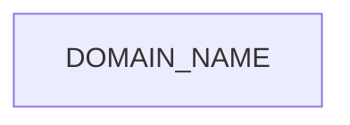

### Values

| Nugget | Value |
| --- | --- |
| `DOMAIN_NAME` | `www.praetorian.com` |

## Services and ports

APPLICATION services listen-to PORT entities under NETWORKS/TRANSPORT. This scan includes **3** Services and ports root node(s) (e.g. `ssh`, `http`, `https`). Linked structures: no child categories.

### Structure overview

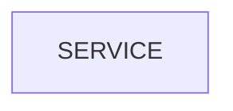

### Values

| Nugget | Value |
| --- | --- |
| `SERVICE` | `http` |
| `SERVICE` | `https` |
| `SERVICE` | `ssh` |

## Conclusion

See the appendix for the full node and edge inventory.

## Appendix

### Nodes

| Nugget | Value |
| --- | --- |
| `APPLICATIONS` | `applications:praetorian.com` |
| `APPLICATIONS` | `applications:scanme.nmap.org` |
| `APPLICATIONS` | `applications:scanme.nmap.org:group:1` |
| `CACHE_STATUS` | `BYPASS` |
| `CDN` | `praetorian.com` |
| `CDN` | `scanme.nmap.org` |
| `CDN_POP_CODE` | `SYD` |
| `CDN_VENDOR` | `Cloudflare` |
| `CDN_VENDOR` | `Netlify` |
| `CLASSIFICATION_RULE_FIRED` | `B1+B2: durable identity with non-web port profile` |
| `CLASSIFICATION_RULE_FIRED` | `C1: Server/header signature (Cloudflare)` |
| `CLASSIFICATION_RULE_FIRED` | `C1: Server/header signature (Netlify)` |
| `CPE_URL` | `cpe:2.3:a:apache:http_server:*:*:*:*:*:*:*:*` |
| `CPE_URL` | `cpe:2.3:a:apache:http_server:2.4.7:*:*:*:*:*:*:*` |
| `CPE_URL` | `cpe:2.3:a:f5:nginx:*:*:*:*:*:*:*:*` |
| `CPE_URL` | `cpe:2.3:o:canonical:ubuntu_linux:*:*:*:*:*:*:*:*` |
| `CPE_URL` | `cpe:2.3:o:checkpoint:gaia:*:*:*:*:*:*:*:*` |
| `CPE_URL` | `cpe:2.3:o:zyxel:zld_firmware:*:*:*:*:*:*:*:*` |
| `CSP_THIRD_PARTY_DOMAIN` | `app.hubspot.com` |
| `CSP_THIRD_PARTY_DOMAIN` | `boards.greenhouse.io` |
| `CSP_THIRD_PARTY_DOMAIN` | `disqus.com` |
| `CSP_THIRD_PARTY_DOMAIN` | `doubleclick.net` |
| `CSP_THIRD_PARTY_DOMAIN` | `google.com` |
| `CSP_THIRD_PARTY_DOMAIN` | `googletagmanager.com` |
| `CSP_THIRD_PARTY_DOMAIN` | `greenhouse.io` |
| `CSP_THIRD_PARTY_DOMAIN` | `hsforms.com` |
| `CSP_THIRD_PARTY_DOMAIN` | `hsforms.net` |
| `CSP_THIRD_PARTY_DOMAIN` | `js.driftt.com` |
| `CSP_THIRD_PARTY_DOMAIN` | `online.fliphtml5.com` |
| `CSP_THIRD_PARTY_DOMAIN` | `player.vimeo.com` |
| `CSP_THIRD_PARTY_DOMAIN` | `twitter.com` |
| `CSP_THIRD_PARTY_DOMAIN` | `vars.hotjar.com` |
| `CSP_THIRD_PARTY_DOMAIN` | `vimeo.com` |
| `CSP_THIRD_PARTY_DOMAIN` | `widget.drift.com` |
| `CSP_THIRD_PARTY_DOMAIN` | `youtube.com` |
| `DETECTION_METHOD` | `error_page` |
| `DOMAIN_NAME` | `www.praetorian.com` |
| `EDGE_DURATION_MS` | `217` |
| `EDGE_DURATION_MS` | `228` |
| `EDGE_DURATION_MS` | `229` |
| `EDGE_DURATION_MS` | `276` |
| `EDGE_NODE_ID` | `a13b857a18212def-SYD` |
| `EDGE_NODE_ID` | `a13b857a182aaaf0-SYD` |
| `EDGE_NODE_ID` | `a13b857a1be8561f-SYD` |
| `EDGE_NODE_ID` | `a13b857a1bf0ccf3-SYD` |
| `HOST` | `scanme.nmap.org:group:1` |
| `HOST_CLASSIFICATION` | `fronted_unknown` |
| `HOST_CLASSIFICATION` | `standard_host` |
| `HSTS_INCLUDE_SUBDOMAINS` | `True` |
| `HSTS_MAX_AGE` | `31536000` |
| `HSTS_PRELOAD` | `True` |
| `HTTP_REDIRECT_LOCATION` | `https://www.praetorian.com/` |
| `HTTP_STATUS_CODE` | `200` |
| `HTTP_STATUS_CODE` | `301` |
| `IPV4_ADDRESS` | `172.66.40.60` |
| `IPV4_ADDRESS` | `172.66.43.196` |
| `IPV4_ADDRESS` | `45.33.32.156` |
| `IPV6_ADDRESS` | `2600:3c01::f03c:91ff:fe18:bb2f` |
| `IPV6_ADDRESS` | `2606:4700:3108::ac42:283c` |
| `IPV6_ADDRESS` | `2606:4700:3108::ac42:2bc4` |
| `NEL_ACTIVE` | `True` |
| `NETWORKS` | `networks:praetorian.com` |
| `NETWORKS` | `networks:scanme.nmap.org` |
| `NETWORKS` | `networks:scanme.nmap.org:group:1` |
| `ORIGIN_DURATION_MS` | `0` |
| `ORIGIN_FINGERPRINT_SUPPRESSED` | `True` |
| `ORIGIN_HOST_COUNT` | `indeterminate` |
| `PORT` | `22` |
| `PORT` | `443` |
| `PORT` | `80` |
| `PROTOCOLS_OFFERED` | `h3` |
| `SCAN_CLI` | `nerva -l .seed/scripts/cli_corpus/fixtures/nerva_targets.txt --json -w 8000` |
| `SCAN_ELAPSED` | `23.171` |
| `SCAN_EXIT_STATUS` | `0` |
| `SCAN_RECORD` | `nerva:scanme.nmap.org + praetorian.com:2026-06-30T07:40:07.243348+00:00` |
| `SCAN_START` | `2026-06-30T07:40:07.243348+00:00` |
| `SCAN_TARGET` | `scanme.nmap.org + praetorian.com` |
| `SCAN_TOOL` | `nerva` |
| `SERVICE` | `http` |
| `SERVICE` | `https` |
| `SERVICE` | `ssh` |
| `SERVICE_BANNER` | `SSH-2.0-OpenSSH_6.6.1p1 Ubuntu-2ubuntu2.13` |
| `SERVICE_VERSION` | `Apache/2.4.7 (Ubuntu)` |
| `SERVICE_VERSION` | `cloudflare` |
| `SOFTWARE_PRODUCT` | `Nginx` |
| `SOFTWARE_PRODUCT` | `Security Gateway` |
| `SOFTWARE_PRODUCT` | `Zyxel Firewall` |
| `SOFTWARE_USED` | `Apache HTTP Server:2.4.7` |
| `SOFTWARE_USED` | `Cloudflare` |
| `SOFTWARE_USED` | `Cloudflare Browser Insights` |
| `SOFTWARE_USED` | `HSTS` |
| `SOFTWARE_USED` | `HTTP/3` |
| `SOFTWARE_USED` | `Ubuntu` |
| `SOFTWARE_USED` | `apache_httpd:2.4.7` |
| `SOFTWARE_USED` | `checkpoint-gateway` |
| `SOFTWARE_USED` | `nginx` |
| `SOFTWARE_USED` | `zyxel-firewall` |
| `SOFTWARE_VENDOR` | `Check Point` |
| `SOFTWARE_VENDOR` | `F5` |
| `SOFTWARE_VENDOR` | `Zyxel` |
| `TLS_ENABLED` | `False` |
| `TLS_ENABLED` | `True` |
| `TRANSPORT` | `tcp` |

### Edges

| Source | Relation | Target |
| --- | --- | --- |
| `SCAN_RECORD` | `had` | `SCAN_CLI` |
| `SCAN_RECORD` | `had` | `SCAN_TARGET` |
| `SCAN_RECORD` | `had` | `SCAN_START` |
| `SCAN_RECORD` | `had` | `SCAN_ELAPSED` |
| `SCAN_RECORD` | `had` | `SCAN_EXIT_STATUS` |
| `SCAN_RECORD` | `had` | `SCAN_TOOL` |
| `SCAN_RECORD` | `contains` | `HOST` |
| `HOST` | `had` | `HOST_CLASSIFICATION` |
| `HOST` | `had` | `CLASSIFICATION_RULE_FIRED` |
| `HOST` | `contains` | `NETWORKS` |
| `HOST` | `contains` | `APPLICATIONS` |
| `NETWORKS` | `contains` | `IPV6_ADDRESS` |
| `APPLICATIONS` | `contains` | `SERVICE` |
| `IPV6_ADDRESS` | `contains` | `TRANSPORT` |
| `TRANSPORT` | `contains` | `PORT` |
| `SERVICE` | `listens-to` | `PORT` |
| `SERVICE` | `had` | `TLS_ENABLED` |
| `SERVICE` | `had` | `SERVICE_BANNER` |
| `NETWORKS` | `contains` | `IPV4_ADDRESS` |
| `IPV4_ADDRESS` | `contains` | `TRANSPORT` |
| `SCAN_RECORD` | `contains` | `CDN` |
| `CDN` | `had` | `HOST_CLASSIFICATION` |
| `CDN` | `had` | `CLASSIFICATION_RULE_FIRED` |
| `CDN` | `had` | `CDN_VENDOR` |
| `CDN` | `had` | `ORIGIN_HOST_COUNT` |
| `CDN` | `contains` | `NETWORKS` |
| `CDN` | `contains` | `APPLICATIONS` |
| `SERVICE` | `had` | `SERVICE_VERSION` |
| `SERVICE` | `had` | `HTTP_STATUS_CODE` |
| `SERVICE` | `contains` | `SOFTWARE_USED` |
| `SOFTWARE_USED` | `had` | `ORIGIN_FINGERPRINT_SUPPRESSED` |
| `SERVICE` | `contains` | `CPE_URL` |
| `CDN` | `had` | `EDGE_NODE_ID` |
| `CDN` | `had` | `CDN_POP_CODE` |
| `SERVICE` | `had` | `CACHE_STATUS` |
| `SERVICE` | `had` | `EDGE_DURATION_MS` |
| `SERVICE` | `had` | `ORIGIN_DURATION_MS` |
| `SERVICE` | `had` | `PROTOCOLS_OFFERED` |
| `SERVICE` | `had` | `HSTS_MAX_AGE` |
| `SERVICE` | `had` | `HSTS_PRELOAD` |
| `SERVICE` | `had` | `HSTS_INCLUDE_SUBDOMAINS` |
| `SERVICE` | `had` | `CSP_THIRD_PARTY_DOMAIN` |
| `SERVICE` | `had` | `NEL_ACTIVE` |
| `SOFTWARE_USED` | `had` | `SOFTWARE_VENDOR` |
| `SOFTWARE_USED` | `had` | `SOFTWARE_PRODUCT` |
| `SOFTWARE_USED` | `had` | `DETECTION_METHOD` |
| `SERVICE` | `had` | `HTTP_REDIRECT_LOCATION` |
| `SERVICE` | `contains` | `DOMAIN_NAME` |
---

*OS-Intel Scan*
