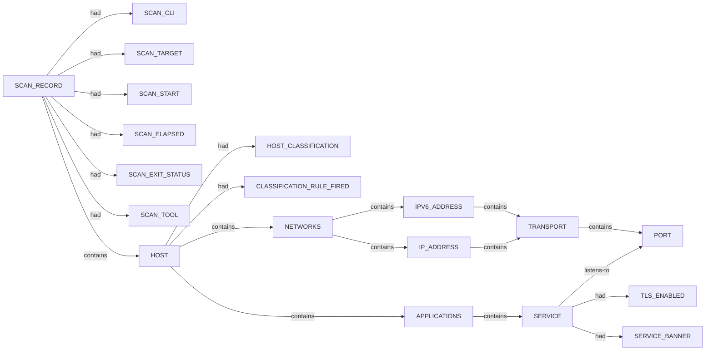

# Nerva scan narrative — `tcp_ssh_misconfigs_json`

## Introduction

The scan used Nerva. Findings are organised under each host or system's category sections (ENVIRONMENT, NETWORKS, APPLICATIONS, VULNERABILITIES). This report follows Scan → Host/System → Trace → Appendix. This report follows Scan → Host/System (categories) → Trace → Appendix. Section diagrams show ontology types and relations only; values appear in prose, tables, and the appendix.

## Systems

- `HOST` `scanme.nmap.org:group:1`

## CDN / edge fronting

Durable machine identity evidence supports a standard (non-fronted) host classification under Rulesets A/B.

## Services

- `ssh`

## Graph structure (types)

## Trace

_Trace section omitted when no TRACE nodes present._

## Appendix

### Nodes

- `APPLICATIONS`: applications:scanme.nmap.org:group:1
- `CLASSIFICATION_RULE_FIRED`: B1+B2: durable identity with non-web port profile
- `HOST`: scanme.nmap.org:group:1
- `HOST_CLASSIFICATION`: standard_host
- `IPV6_ADDRESS`: 2600:3c01::f03c:91ff:fe18:bb2f
- `IP_ADDRESS`: 45.33.32.156
- `NETWORKS`: networks:scanme.nmap.org:group:1
- `PORT`: 22
- `SCAN_CLI`: nerva -t scanme.nmap.org:22 --json --misconfigs -w 8000
- `SCAN_ELAPSED`: 5.125
- `SCAN_EXIT_STATUS`: 0
- `SCAN_RECORD`: nerva:scanme.nmap.org:22:2026-06-30T07:40:01.761083+00:00
- `SCAN_START`: 2026-06-30T07:40:01.761083+00:00
- `SCAN_TARGET`: scanme.nmap.org:22
- `SCAN_TOOL`: nerva
- `SERVICE`: ssh
- `SERVICE_BANNER`: SSH-2.0-OpenSSH_6.6.1p1 Ubuntu-2ubuntu2.13
- `TLS_ENABLED`: False
- `TRANSPORT`: tcp

### Edges

- `SCAN_RECORD` `had` `SCAN_CLI`
- `SCAN_RECORD` `had` `SCAN_TARGET`
- `SCAN_RECORD` `had` `SCAN_START`
- `SCAN_RECORD` `had` `SCAN_ELAPSED`
- `SCAN_RECORD` `had` `SCAN_EXIT_STATUS`
- `SCAN_RECORD` `had` `SCAN_TOOL`
- `SCAN_RECORD` `contains` `HOST`
- `HOST` `had` `HOST_CLASSIFICATION`
- `HOST` `had` `CLASSIFICATION_RULE_FIRED`
- `HOST` `contains` `NETWORKS`
- `HOST` `contains` `APPLICATIONS`
- `NETWORKS` `contains` `IPV6_ADDRESS`
- `APPLICATIONS` `contains` `SERVICE`
- `IPV6_ADDRESS` `contains` `TRANSPORT`
- `TRANSPORT` `contains` `PORT`
- `SERVICE` `listens-to` `PORT`
- `SERVICE` `had` `TLS_ENABLED`
- `SERVICE` `had` `SERVICE_BANNER`
- `NETWORKS` `contains` `IP_ADDRESS`
- `IP_ADDRESS` `contains` `TRANSPORT`
---

*OS-Intel Scan*
