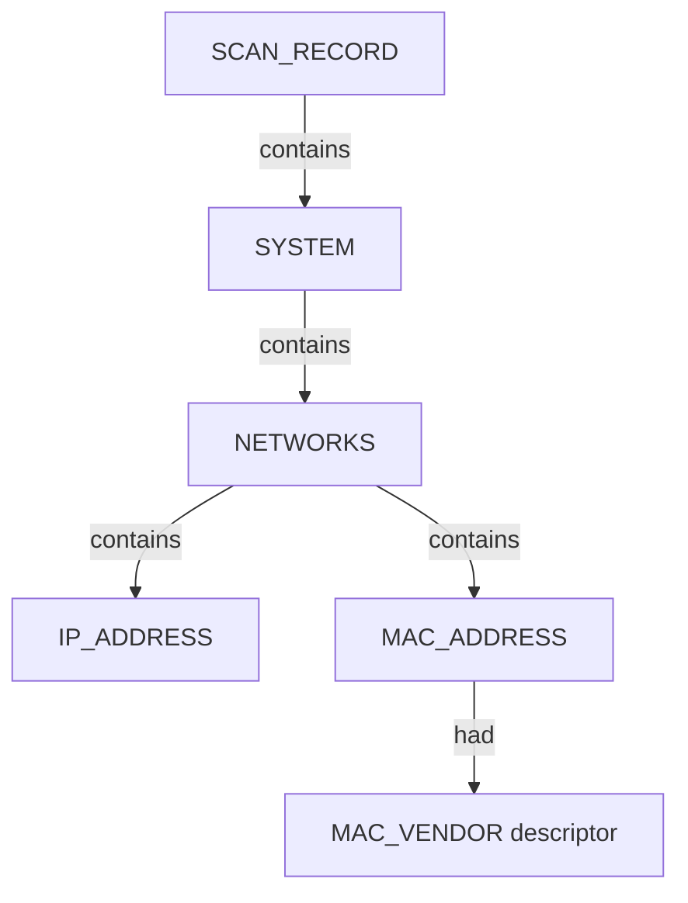

# Netdiscover — proposed nugget graph structure

**Runtime:** `windows-lan` via `run_netdiscover_lan.ps1` (WSL fallback when mirrored networking unavailable)  
**Target:** `192.168.1.0/24`  
**Parser:** TextFSM / `netdiscover_text_to_json.py` → `netdiscover_json_to_graph.py`

## Graph shape (06A)

MAC vendor strings from the host table map to **`MAC_VENDOR`** descriptor nuggets (not `RAW_RIR_DATA`).

## Scenario keys

| Scenario key | Mode | Notes |
|--------------|------|-------|
| `local_subnet_active_parsable` | `-P` flat table | `scan_tries=1`, `empty_scans=0` |
| `local_subnet_active_text` | Interactive TUI | Multiple frames; first populated table kept |
| `local_subnet_fast_parsable` | Fast gateway probe | Subset of /24 |
| `passive_snippet_text` | Passive TUI | Bounded passive window |
| `sparse_subnet_parsable` | Full /24 rescan | Parsable footer |

Graph JSON: `netdiscover_<scenario_id>_proposed_nuggets_edges.json`
