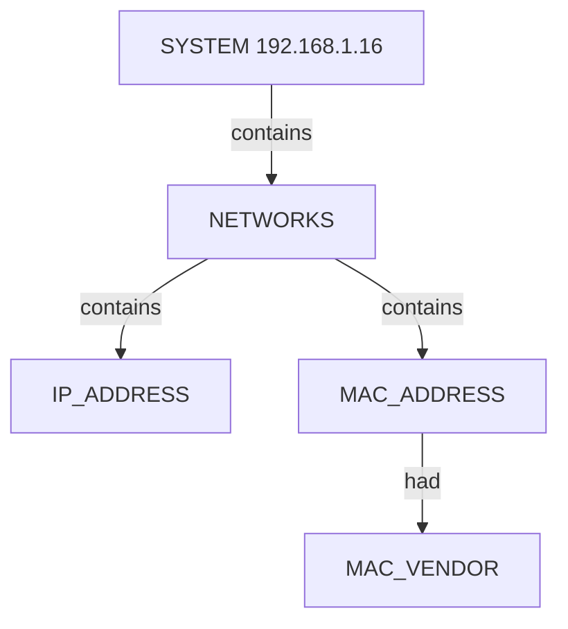
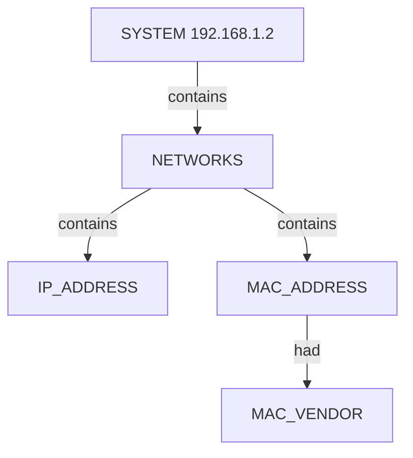
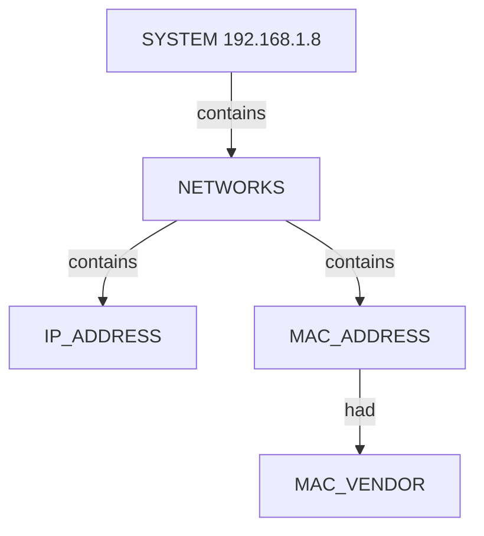

# Netdiscover OSINT Scan Report — local_subnet_active_text

## Introduction

This report narrates the findings of a **Netdiscover** ARP discovery run for **netdiscover — A — active ARP scan 192.168.1.0/24 (interactive text)**. The story follows the scan metadata, each discovered **system** on the segment, and the **networks** inventory (IPv4, MAC, and vendor) attached to every system. Every observed nugget and value from the semantic graph appears in the narrative below or in the appendix.

## Scan

The scan started at **Sun Jul 12 14:07:31 2026** with arguments `netdiscover — A — active ARP scan 192.168.1.0/24 (interactive text)`.
 It finished at **Sun Jul 12 14:07:47 2026**.
 Exit status: **success**.

NetDiscover done at Sun Jul 12 14:07:47 2026; 12 Systems Discovered, 5 Scan Tries, 3 Empty Scans, scanned in 15.81 seconds

Netdiscover recorded **5** scan frame(s), **3** empty scan(s) before settling on the host table used for this graph.
**12** system(s) appear in the structured host inventory.
**12** system node(s) are linked from the scan record in this graph.

Additional scan metadata:
- **Scan CLI** (`netdiscover — A — active ARP scan 192.168.1.0/24 (interactive text)`)

### Scan topology

```mermaid
flowchart TD
  scan["SCAN_RECORD"]
  sys1["SYSTEM 192.168.1.1"]
  scan -->|contains| sys1
  sys2["SYSTEM 192.168.1.10"]
  scan -->|contains| sys2
  sys3["SYSTEM 192.168.1.14"]
  scan -->|contains| sys3
  sys4["SYSTEM 192.168.1.15"]
  scan -->|contains| sys4
  sys5["SYSTEM 192.168.1.16"]
  scan -->|contains| sys5
  sys6["SYSTEM 192.168.1.2"]
  scan -->|contains| sys6
  sys7["SYSTEM 192.168.1.250"]
  scan -->|contains| sys7
  sys8["SYSTEM 192.168.1.3"]
  scan -->|contains| sys8
  sys9["SYSTEM 192.168.1.4"]
  scan -->|contains| sys9
  sys10["SYSTEM 192.168.1.6"]
  scan -->|contains| sys10
  sys11["SYSTEM 192.168.1.7"]
  scan -->|contains| sys11
  sys12["SYSTEM 192.168.1.8"]
  scan -->|contains| sys12
```

## System 192.168.1.1

System **192.168.1.1** was observed on the local segment during ARP discovery.

### Networks

- IPv4 address **192.168.1.1**.
- MAC address **14:5f:94:d8:7a:5f** — vendor **Unknown**.

## System 192.168.1.10

System **192.168.1.10** was observed on the local segment during ARP discovery.

### Networks

- IPv4 address **192.168.1.10**.
- MAC address **02:0f:b5:2f:b0:73** — vendor **Unknown**.

## System 192.168.1.14

System **192.168.1.14** was observed on the local segment during ARP discovery.

### Networks

- IPv4 address **192.168.1.14**.
- MAC address **02:0f:b5:b7:bd:29** — vendor **Unknown**.

## System 192.168.1.15

System **192.168.1.15** was observed on the local segment during ARP discovery.

### Networks

- IPv4 address **192.168.1.15**.
- MAC address **5a:ba:45:91:e3:41** — vendor **Unknown**.

## System 192.168.1.16

System **192.168.1.16** was observed on the local segment during ARP discovery.

### Networks

- IPv4 address **192.168.1.16**.
- MAC address **3e:48:b2:24:45:34** — vendor **Unknown**.

## System 192.168.1.2

System **192.168.1.2** was observed on the local segment during ARP discovery.

### Networks

- IPv4 address **192.168.1.2**.
- MAC address **02:0f:b5:23:c6:49** — vendor **Unknown**.

## System 192.168.1.250

System **192.168.1.250** was observed on the local segment during ARP discovery.

### Networks

- IPv4 address **192.168.1.250**.
- MAC address **02:0f:b5:46:32:8f** — vendor **Unknown**.

## System 192.168.1.3

System **192.168.1.3** was observed on the local segment during ARP discovery.

### Networks

- IPv4 address **192.168.1.3**.
- MAC address **3c:a3:08:a4:d1:8d** — vendor **Unknown**.

## System 192.168.1.4

System **192.168.1.4** was observed on the local segment during ARP discovery.

### Networks

- IPv4 address **192.168.1.4**.
- MAC address **02:0f:b5:0a:e3:6c** — vendor **Unknown**.

## System 192.168.1.6

System **192.168.1.6** was observed on the local segment during ARP discovery.

### Networks

- IPv4 address **192.168.1.6**.
- MAC address **88:d8:2e:c2:2c:0c** — vendor **Unknown**.

## System 192.168.1.7

System **192.168.1.7** was observed on the local segment during ARP discovery.

### Networks

- IPv4 address **192.168.1.7**.
- MAC address **cc:c7:60:67:89:48** — vendor **Unknown**.

## System 192.168.1.8

System **192.168.1.8** was observed on the local segment during ARP discovery.

### Networks

- IPv4 address **192.168.1.8**.
- MAC address **02:0f:b5:b0:a8:79** — vendor **Unknown**.

## Conclusion

The scan captured **58** semantic nuggets across **12** systems.
 NetDiscover done at Sun Jul 12 14:07:47 2026; 12 Systems Discovered, 5 Scan Tries, 3 Empty Scans, scanned in 15.81 seconds
 The appendix lists every nugget instance and value for audit and downstream review.

## Appendix — Complete Nugget Inventory

| Type | Nugget | Description | Value |
|------|--------|-------------|-------|
| CATEGORY | NETWORKS | Networks Category | `networks:192.168.1.1` |
| CATEGORY | NETWORKS | Networks Category | `networks:192.168.1.10` |
| CATEGORY | NETWORKS | Networks Category | `networks:192.168.1.14` |
| CATEGORY | NETWORKS | Networks Category | `networks:192.168.1.15` |
| CATEGORY | NETWORKS | Networks Category | `networks:192.168.1.16` |
| CATEGORY | NETWORKS | Networks Category | `networks:192.168.1.2` |
| CATEGORY | NETWORKS | Networks Category | `networks:192.168.1.250` |
| CATEGORY | NETWORKS | Networks Category | `networks:192.168.1.3` |
| CATEGORY | NETWORKS | Networks Category | `networks:192.168.1.4` |
| CATEGORY | NETWORKS | Networks Category | `networks:192.168.1.6` |
| CATEGORY | NETWORKS | Networks Category | `networks:192.168.1.7` |
| CATEGORY | NETWORKS | Networks Category | `networks:192.168.1.8` |
| DESCRIPTOR | MAC_VENDOR | MAC Vendor | `Unknown` |
| DESCRIPTOR | SCAN_CLI | Scan CLI | `netdiscover — A — active ARP scan 192.168.1.0/24 (interactive text)` |
| DESCRIPTOR | SCAN_DISCOVERED | Systems Discovered | `12` |
| DESCRIPTOR | SCAN_EMPTY_SCANS | Empty Scans | `3` |
| DESCRIPTOR | SCAN_END_TIME | Scan End Time | `Sun Jul 12 14:07:47 2026` |
| DESCRIPTOR | SCAN_EXIT_STATUS | Scan Exit Status | `success` |
| DESCRIPTOR | SCAN_SUMMARY | Scan Summary | `NetDiscover done at Sun Jul 12 14:07:47 2026; 12 Systems Discovered, 5 Scan Tries, 3 Empty Scans, scanned in 15.81 seconds` |
| DESCRIPTOR | SCAN_TIMESTAMP | Scan Start Time | `Sun Jul 12 14:07:31 2026` |
| DESCRIPTOR | SCAN_TRIES | Scan Tries | `5` |
| ENTITY | IP_ADDRESS | IP Address | `192.168.1.1` |
| ENTITY | IP_ADDRESS | IP Address | `192.168.1.10` |
| ENTITY | IP_ADDRESS | IP Address | `192.168.1.14` |
| ENTITY | IP_ADDRESS | IP Address | `192.168.1.15` |
| ENTITY | IP_ADDRESS | IP Address | `192.168.1.16` |
| ENTITY | IP_ADDRESS | IP Address | `192.168.1.2` |
| ENTITY | IP_ADDRESS | IP Address | `192.168.1.250` |
| ENTITY | IP_ADDRESS | IP Address | `192.168.1.3` |
| ENTITY | IP_ADDRESS | IP Address | `192.168.1.4` |
| ENTITY | IP_ADDRESS | IP Address | `192.168.1.6` |
| ENTITY | IP_ADDRESS | IP Address | `192.168.1.7` |
| ENTITY | IP_ADDRESS | IP Address | `192.168.1.8` |
| ENTITY | MAC_ADDRESS | MAC Address | `02:0f:b5:0a:e3:6c` |
| ENTITY | MAC_ADDRESS | MAC Address | `02:0f:b5:23:c6:49` |
| ENTITY | MAC_ADDRESS | MAC Address | `02:0f:b5:2f:b0:73` |
| ENTITY | MAC_ADDRESS | MAC Address | `02:0f:b5:46:32:8f` |
| ENTITY | MAC_ADDRESS | MAC Address | `02:0f:b5:b0:a8:79` |
| ENTITY | MAC_ADDRESS | MAC Address | `02:0f:b5:b7:bd:29` |
| ENTITY | MAC_ADDRESS | MAC Address | `14:5f:94:d8:7a:5f` |
| ENTITY | MAC_ADDRESS | MAC Address | `3c:a3:08:a4:d1:8d` |
| ENTITY | MAC_ADDRESS | MAC Address | `3e:48:b2:24:45:34` |
| ENTITY | MAC_ADDRESS | MAC Address | `5a:ba:45:91:e3:41` |
| ENTITY | MAC_ADDRESS | MAC Address | `88:d8:2e:c2:2c:0c` |
| ENTITY | MAC_ADDRESS | MAC Address | `cc:c7:60:67:89:48` |
| ENTITY | SCAN_RECORD | Scan Record | `netdiscover — A — active ARP scan 192.168.1.0/24 (interactive text)` |
| ENTITY | SYSTEM | System | `192.168.1.1` |
| ENTITY | SYSTEM | System | `192.168.1.10` |
| ENTITY | SYSTEM | System | `192.168.1.14` |
| ENTITY | SYSTEM | System | `192.168.1.15` |
| ENTITY | SYSTEM | System | `192.168.1.16` |
| ENTITY | SYSTEM | System | `192.168.1.2` |
| ENTITY | SYSTEM | System | `192.168.1.250` |
| ENTITY | SYSTEM | System | `192.168.1.3` |
| ENTITY | SYSTEM | System | `192.168.1.4` |
| ENTITY | SYSTEM | System | `192.168.1.6` |
| ENTITY | SYSTEM | System | `192.168.1.7` |
| ENTITY | SYSTEM | System | `192.168.1.8` |

---

*OS-Intel Scan · Sun Jul 12 14:07:31 2026 · Page 1*
