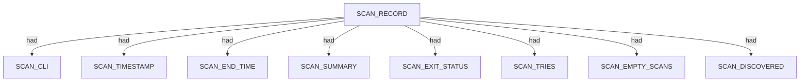
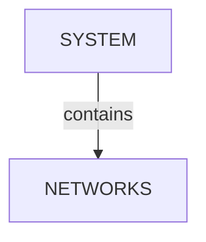
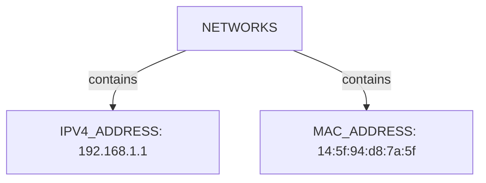

# Netdiscover scan narrative — `local_subnet_fast_parsable`

## Introduction

This report narrates findings from a Netdiscover ARP discovery run. The story follows the scan metadata and each discovered system with its networks inventory (IPv4, MAC, vendor). This report follows Scan → Host/System/Organisation/Domain (categories) → Trace → Appendix. Overview diagrams show ontology types and relations; category diagrams show a few example values with the rest in tables; the appendix inventories every node and edge.

## Scan

Every examination has one SCAN_RECORD with scan descriptors linked via had. This scan includes **1** Scan root node(s) (e.g. `netdiscover — B — fast mode gateway probe 192.168.1.0/24 (parseable)`). Linked structures: `SCAN_CLI`, `SCAN_TIMESTAMP`, `SCAN_END_TIME`, `SCAN_SUMMARY`, `SCAN_EXIT_STATUS`, `SCAN_TRIES`.

### Structure overview

### Scan descriptors

| Nugget | Value |
| --- | --- |
| `SCAN_RECORD` | `netdiscover — B — fast mode gateway probe 192.168.1.0/24 (parseable)` |

## System

When only L2/L3 identity is known, emit SYSTEM (not HOST) with a NETWORKS category. This scan includes **1** System root node(s) (e.g. `192.168.1.1`). Linked structures: `NETWORKS`.

### Structure overview

### `NETWORKS`

| Nugget | Value |
| --- | --- |
| `IPV4_ADDRESS` | `192.168.1.1` |
| `MAC_ADDRESS` | `14:5f:94:d8:7a:5f` |

## Conclusion

See the appendix for the full node and edge inventory.

## Appendix

### Nodes

| Nugget | Value |
| --- | --- |
| `IPV4_ADDRESS` | `192.168.1.1` |
| `MAC_ADDRESS` | `14:5f:94:d8:7a:5f` |
| `MAC_VENDOR` | `Unknown` |
| `NETWORKS` | `networks:192.168.1.1` |
| `SCAN_CLI` | `netdiscover — B — fast mode gateway probe 192.168.1.0/24 (parseable)` |
| `SCAN_DISCOVERED` | `1` |
| `SCAN_EMPTY_SCANS` | `0` |
| `SCAN_END_TIME` | `Sun Aug 09 15:43:47 2026` |
| `SCAN_EXIT_STATUS` | `success` |
| `SCAN_RECORD` | `netdiscover — B — fast mode gateway probe 192.168.1.0/24 (parseable)` |
| `SCAN_SUMMARY` | `NetDiscover done at Sun Aug 09 15:43:47 2026; 1 Systems Discovered, 1 Scan Tries, 0 Empty Scans, scanned in 3.84 seconds` |
| `SCAN_TIMESTAMP` | `Sun Aug 09 15:43:43 2026` |
| `SCAN_TRIES` | `1` |
| `SYSTEM` | `192.168.1.1` |

### Edges

| Source | Relation | Target |
| --- | --- | --- |
| `SCAN_RECORD` | `had` | `SCAN_CLI` |
| `SCAN_RECORD` | `had` | `SCAN_TIMESTAMP` |
| `SCAN_RECORD` | `had` | `SCAN_END_TIME` |
| `SCAN_RECORD` | `had` | `SCAN_SUMMARY` |
| `SCAN_RECORD` | `had` | `SCAN_EXIT_STATUS` |
| `SCAN_RECORD` | `had` | `SCAN_TRIES` |
| `SCAN_RECORD` | `had` | `SCAN_EMPTY_SCANS` |
| `SCAN_RECORD` | `had` | `SCAN_DISCOVERED` |
| `SCAN_RECORD` | `contains` | `SYSTEM` |
| `SYSTEM` | `contains` | `NETWORKS` |
| `NETWORKS` | `contains` | `IPV4_ADDRESS` |
| `NETWORKS` | `contains` | `MAC_ADDRESS` |
| `MAC_ADDRESS` | `had` | `MAC_VENDOR` |
---

*OS-Intel Scan*
