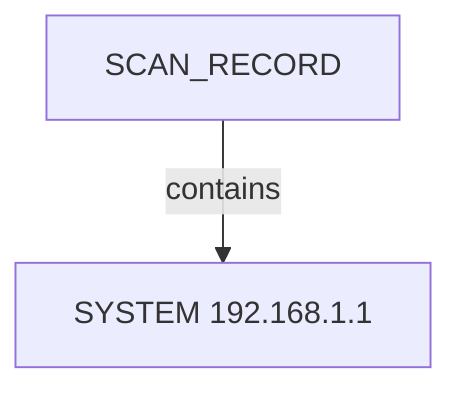
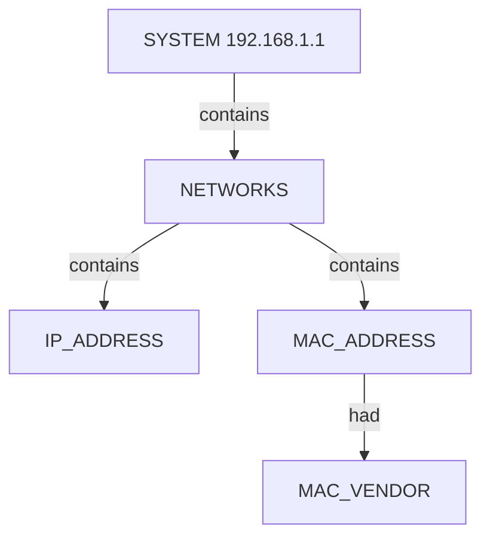

# Netdiscover OSINT Scan Report — local_subnet_fast_parsable

## Introduction

This report narrates the findings of a **Netdiscover** ARP discovery run for **netdiscover — B — fast mode gateway probe 192.168.1.0/24 (parseable)**. The story follows the scan metadata, each discovered **system** on the segment, and the **networks** inventory (IPv4, MAC, and vendor) attached to every system. Every observed nugget and value from the semantic graph appears in the narrative below or in the appendix.

## Scan

The scan started at **Sun Jul 12 14:07:32 2026** with arguments `netdiscover — B — fast mode gateway probe 192.168.1.0/24 (parseable)`.
 It finished at **Sun Jul 12 14:07:35 2026**.
 Exit status: **success**.

NetDiscover done at Sun Jul 12 14:07:35 2026; 1 Systems Discovered, 1 Scan Tries, 0 Empty Scans, scanned in 3.84 seconds

Netdiscover recorded **1** scan frame(s), **0** empty scan(s) before settling on the host table used for this graph.
**1** system(s) appear in the structured host inventory.
**1** system node(s) are linked from the scan record in this graph.

Additional scan metadata:
- **Scan CLI** (`netdiscover — B — fast mode gateway probe 192.168.1.0/24 (parseable)`)

### Scan topology

## System 192.168.1.1

System **192.168.1.1** was observed on the local segment during ARP discovery.

### Networks

- IPv4 address **192.168.1.1**.
- MAC address **14:5f:94:d8:7a:5f** — vendor **Unknown**.

## Conclusion

The scan captured **14** semantic nuggets across **1** system.
 NetDiscover done at Sun Jul 12 14:07:35 2026; 1 Systems Discovered, 1 Scan Tries, 0 Empty Scans, scanned in 3.84 seconds
 The appendix lists every nugget instance and value for audit and downstream review.

## Appendix — Complete Nugget Inventory

| Type | Nugget | Description | Value |
|------|--------|-------------|-------|
| CATEGORY | NETWORKS | Networks Category | `networks:192.168.1.1` |
| DESCRIPTOR | MAC_VENDOR | MAC Vendor | `Unknown` |
| DESCRIPTOR | SCAN_CLI | Scan CLI | `netdiscover — B — fast mode gateway probe 192.168.1.0/24 (parseable)` |
| DESCRIPTOR | SCAN_DISCOVERED | Systems Discovered | `1` |
| DESCRIPTOR | SCAN_EMPTY_SCANS | Empty Scans | `0` |
| DESCRIPTOR | SCAN_END_TIME | Scan End Time | `Sun Jul 12 14:07:35 2026` |
| DESCRIPTOR | SCAN_EXIT_STATUS | Scan Exit Status | `success` |
| DESCRIPTOR | SCAN_SUMMARY | Scan Summary | `NetDiscover done at Sun Jul 12 14:07:35 2026; 1 Systems Discovered, 1 Scan Tries, 0 Empty Scans, scanned in 3.84 seconds` |
| DESCRIPTOR | SCAN_TIMESTAMP | Scan Start Time | `Sun Jul 12 14:07:32 2026` |
| DESCRIPTOR | SCAN_TRIES | Scan Tries | `1` |
| ENTITY | IP_ADDRESS | IP Address | `192.168.1.1` |
| ENTITY | MAC_ADDRESS | MAC Address | `14:5f:94:d8:7a:5f` |
| ENTITY | SCAN_RECORD | Scan Record | `netdiscover — B — fast mode gateway probe 192.168.1.0/24 (parseable)` |
| ENTITY | SYSTEM | System | `192.168.1.1` |

---

*OS-Intel Scan · Sun Jul 12 14:07:32 2026 · Page 1*
