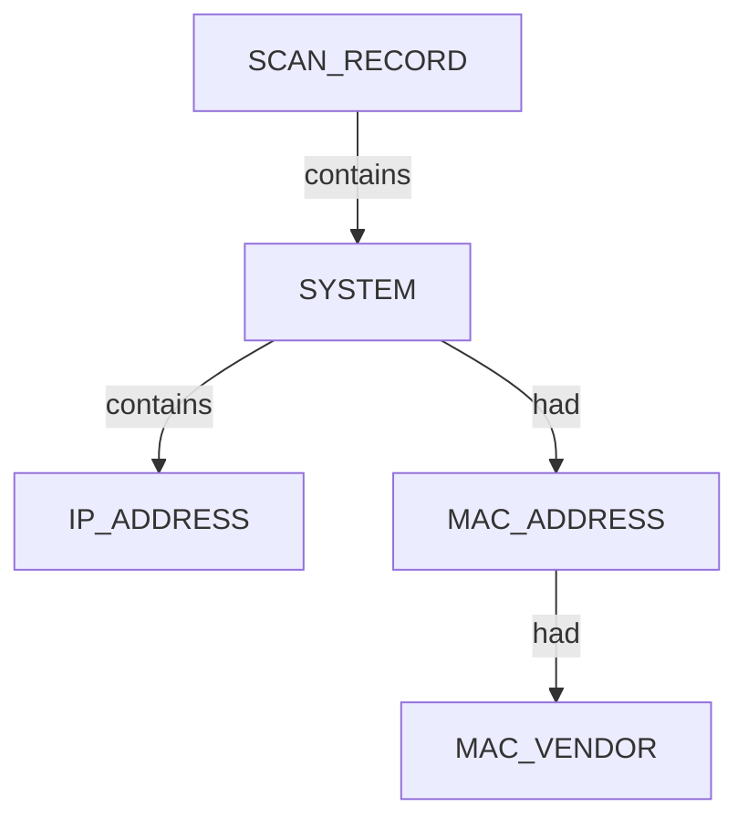

# Netdiscover — proposed nugget graph structure

**Runtime:** WSL mirrored mode, `eth1` (WiFi 2, `192.168.1.11`)  
**Target:** `192.168.1.0/24`  
**Parser:** TextFSM `netdiscover_parsable.textfsm`

## Prerequisites

| Step | Status |
|------|--------|
| `%USERPROFILE%\.wslconfig` → `networkingMode=mirrored` | Configured |
| `wsl --shutdown` then restart WSL | Required after `.wslconfig` changes |
| WSL `eth1` = WiFi 2 (ALFA), `192.168.1.11/24` | Verified 2026-06-18 post-restart |
| Manifest `-i eth1` on all scenarios | Matches live layout (`eth2` = Intel WiFi `.9`) |
| Verify script | `.seed/scripts/verify_wsl_netdiscover_prereqs.ps1` |

Active scans must use `-i eth1` when multiple mirrored NICs are present (default route may prefer `eth2`).

## Graph shape

Provisional classification: when only MAC vendor is known, emit `SYSTEM` (not `HOST`/`DEVICE`/`MOBILE`).

## Runtime (2026-06-29)

| Mode | When |
|------|------|
| `windows-lan` | Default in manifest v6; ping sweep + ARP when WSL mirrored networking fails |
| `wsl-root` | Preferred when `eth1` is on `192.168.1.0/24` (see verify script) |

Structured output: `netdiscover_scan` JSON (`command`, `start_time`, `systems[]`, `runstats.systems.scan_tries`).

## Scenario results (2026-06-29 re-harvest, exams 11–15)

| Scenario key | Hosts found | Notes |
|--------------|-------------|-------|
| `local_subnet_active` | 10 | Rich vendors (Huawei, Apple, Samsung, …) |
| `local_subnet_fast` | 3 | `.1`, `.2`, `.16` |
| `passive_snippet` | 0 | 12s passive window — valid clean capture |
| `sparse_subnet` | 9 | Full /24 rescan |
