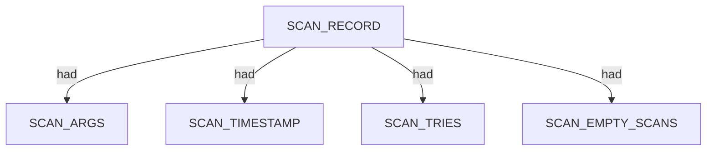
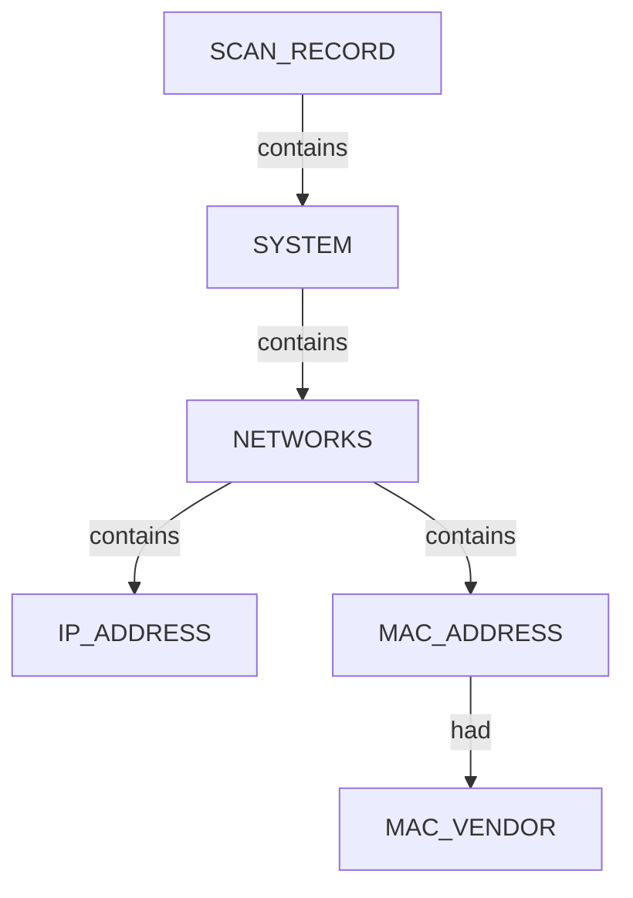
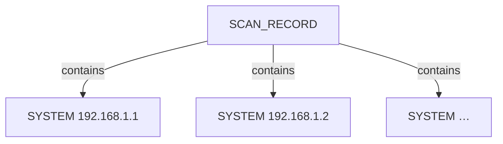

# Netdiscover — proposed nugget graph structure

Ontology source: `.seed/05_Onotology_for_Nuggets.md` (§4.3 narrative; provisional `SYSTEM` classification in `.seed/06A_Updates_to_NetDiscover_Cli_App_Profiling copy.md`).

Generator: `.seed/scripts/cli_corpus/netdiscover_text_to_json.py` → `netdiscover_json_to_graph.py`

Artifacts: `netdiscover_<scenario_key>_proposed_nuggets_edges.json` and narrative `*_description.md` in this directory.

## Narrative reports (§4.3)

Graph JSON is converted to readable OSINT Markdown by `.seed/scripts/cli_corpus/narrative_report.py` via `describe_graph()` in the Netdiscover generator. The report follows **scan → systems → networks (IP, MAC, vendor) → appendix**. Every nugget value must appear in prose or the inventory table; `validate_narrative_coverage()` enforces this in tests.

Per-scenario narratives include:

- A **scan topology** Mermaid diagram (`SCAN_RECORD` → `contains` → each `SYSTEM`)
- A per-system **networks** Mermaid diagram (`SYSTEM` → `NETWORKS` → `IP_ADDRESS` / `MAC_ADDRESS` → `had` → `MAC_VENDOR`)

Netdiscover examinations do not emit traceroute (`TRACE`) or application/vulnerability categories.

## Scan head

Every graph has one `SCAN_RECORD` entity with scan descriptors linked via `had`:

| Descriptor | Source |
|------------|--------|
| `SCAN_ARGS` | Scenario label / CLI args |
| `SCAN_TIMESTAMP` | Scan start time |
| `SCAN_END_TIME` | Finished time (when present) |
| `SCAN_SUMMARY` | Netdiscover completion line |
| `SCAN_EXIT_STATUS` | `success` / `error` |
| `SCAN_TRIES` | Interactive TUI frame count |
| `SCAN_EMPTY_SCANS` | TUI frames with no host table |
| `SCAN_DISCOVERED` | Host count from structured JSON |

Discovered systems link from the scan via `contains`.

## System tree (all scenarios)

When only MAC vendor is known, emit **`SYSTEM`** (not `HOST` / `DEVICE` / `MOBILE`). Each system owns a **`NETWORKS`** category (green `CATEGORY` nugget) containing IPv4 and L2 facts.

- `NETWORKS` is a **category** nugget (`nugget_type: CATEGORY`, colour `#14B8A6`).
- `MAC_VENDOR` is a **descriptor** on `MAC_ADDRESS` via `had`. Identical vendor strings reuse one `MAC_VENDOR` node; each MAC links with its own `had` edge.
- Instance ids: `uuid5(ontology_seed, nugget_data)` — see `graph_builder.nugget_instance_id()`.

## Multi-system scan overview

Rich LAN scenarios attach many `SYSTEM` nodes to one scan:

Each system expands to the system tree above (unique `NETWORKS` per IPv4).

## Scenario coverage

| Scenario key | Exam | Primary structures |
|--------------|------|-------------------|
| `local_subnet_active_parsable` | 1 | SCAN + 12 SYSTEM; flat parseable output; 1 try / 0 empty |
| `local_subnet_active_text` | 2 | SCAN + SYSTEM; interactive TUI; multi-frame `SCAN_TRIES` / `SCAN_EMPTY_SCANS` |
| `local_subnet_fast_parsable` | 3 | SCAN + 1 SYSTEM; fast gateway probe |
| `passive_snippet_text` | 4 | SCAN + 11 SYSTEM; passive TUI; shared `MAC_VENDOR` for `Unknown` |
| `sparse_subnet_parsable` | 5 | SCAN + 12 SYSTEM; full /24 active rescan |

Runtime: Windows LAN simulator (`.seed/scripts/cli_corpus/run_netdiscover_lan.ps1`) when WSL mirrored `eth1` is unavailable.

## Field mapping (structured JSON → nugget)

| JSON path | Nugget | Relation |
|-----------|--------|----------|
| `netdiscover_scan.args` | `SCAN_ARGS`, `SCAN_RECORD` | `SCAN_RECORD` → `had` |
| `netdiscover_scan.start_time` | `SCAN_TIMESTAMP` | `had` |
| `runstats.finished_time.end_time` | `SCAN_END_TIME` | `had` |
| `runstats.finished_time.summary` | `SCAN_SUMMARY` | `had` |
| `exit_status` | `SCAN_EXIT_STATUS` | `had` |
| `runstats.systems.scan_tries` | `SCAN_TRIES` | `had` |
| `runstats.systems.empty_scans` | `SCAN_EMPTY_SCANS` | `had` |
| `runstats.systems.discovered` | `SCAN_DISCOVERED` | `had` |
| `systems[].ipv4` | `SYSTEM`, `IP_ADDRESS` | scan `contains` SYSTEM; NETWORKS `contains` IP |
| `systems[].mac` | `MAC_ADDRESS` | `NETWORKS` → `contains` |
| `systems[].mac_vendor` | `MAC_VENDOR` | `MAC_ADDRESS` → `had` |

## Review notes

- Relations use ontology vocabulary: `contains`, `had` only.
- Do **not** use `RAW_RIR_DATA` for vendor strings — use `MAC_VENDOR`.
- Text and structured `scan_tries` / `empty_scans` must match captured CLI output (see harvest alignment checks).
