# Netdiscover scan narrative — `passive_snippet_text`

## Introduction

This report narrates findings from a Netdiscover ARP discovery run. The story follows the scan metadata and each discovered system with its networks inventory (IPv4, MAC, vendor). This report follows Scan → Host/System/Organisation/Domain (categories) → Trace → Appendix. Overview diagrams show ontology types and relations; category diagrams show a few example values with the rest in tables; the appendix inventories every node and edge.

## Scan

Every examination has one SCAN_RECORD with scan descriptors linked via had. This scan includes **1** Scan root node(s) (e.g. `netdiscover — C — passive ARP snippet (bounded)`). Linked structures: `SCAN_CLI`, `SCAN_TIMESTAMP`, `SCAN_END_TIME`, `SCAN_SUMMARY`, `SCAN_EXIT_STATUS`, `SCAN_TRIES`.

### Structure overview

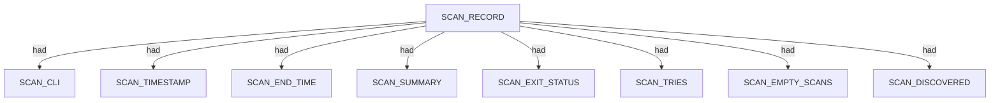

### `SCAN_CLI`

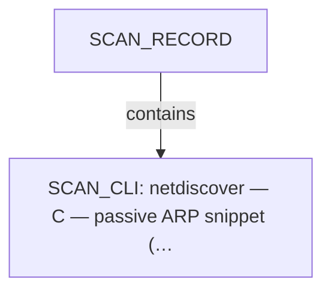

| Nugget | Value |
| --- | --- |
| `SCAN_CLI` | `netdiscover — C — passive ARP snippet (bounded)` |

### `SCAN_TIMESTAMP`

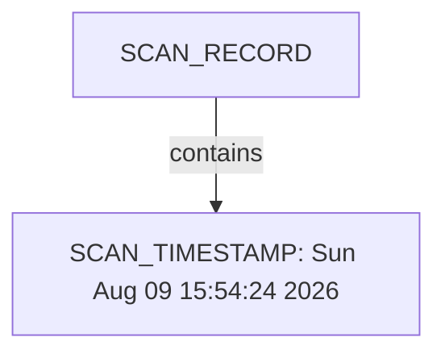

| Nugget | Value |
| --- | --- |
| `SCAN_TIMESTAMP` | `Sun Aug 09 15:54:24 2026` |

### `SCAN_END_TIME`

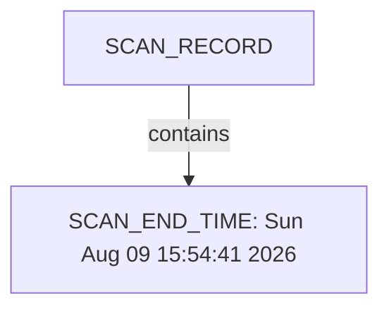

| Nugget | Value |
| --- | --- |
| `SCAN_END_TIME` | `Sun Aug 09 15:54:41 2026` |

### `SCAN_SUMMARY`

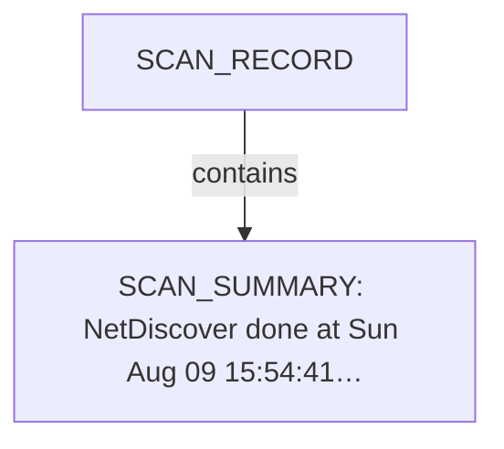

| Nugget | Value |
| --- | --- |
| `SCAN_SUMMARY` | `NetDiscover done at Sun Aug 09 15:54:41 2026; 12 Systems Discovered, 4 Scan Tries, 3 Empty Scans, scanned in 16.88 seconds` |

### `SCAN_EXIT_STATUS`

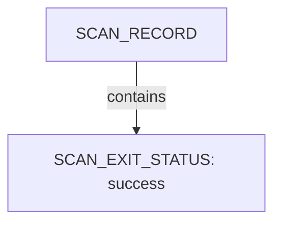

| Nugget | Value |
| --- | --- |
| `SCAN_EXIT_STATUS` | `success` |

### `SCAN_TRIES`

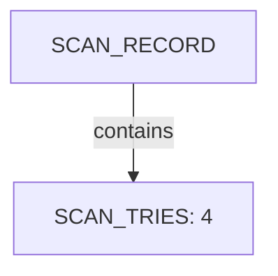

| Nugget | Value |
| --- | --- |
| `SCAN_TRIES` | `4` |

### `SCAN_EMPTY_SCANS`

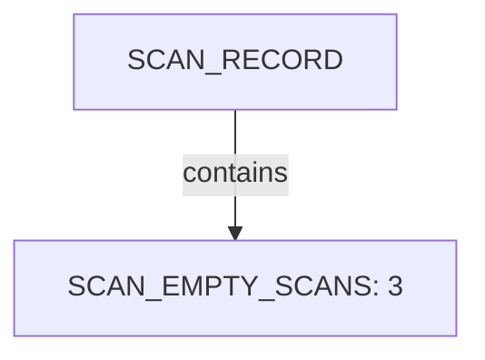

| Nugget | Value |
| --- | --- |
| `SCAN_EMPTY_SCANS` | `3` |

### `SCAN_DISCOVERED`

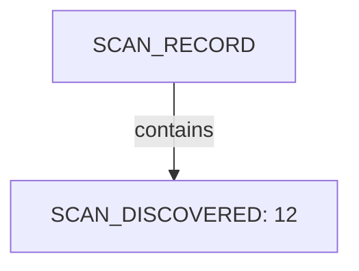

| Nugget | Value |
| --- | --- |
| `SCAN_DISCOVERED` | `12` |

## System

When only L2/L3 identity is known, emit SYSTEM (not HOST) with a NETWORKS category. This scan includes **12** System root node(s) (e.g. `192.168.1.16`, `192.168.1.15`, `192.168.1.10`). Linked structures: `NETWORKS`.

### Structure overview

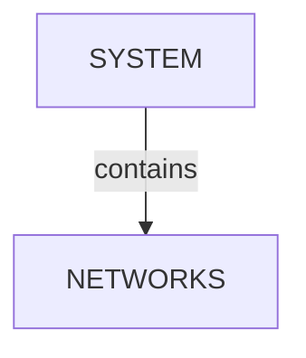

### `NETWORKS`

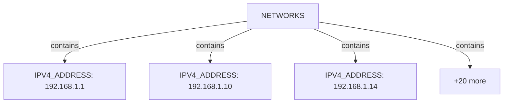

| Nugget | Value |
| --- | --- |
| `IPV4_ADDRESS` | `192.168.1.1` |
| `IPV4_ADDRESS` | `192.168.1.10` |
| `IPV4_ADDRESS` | `192.168.1.14` |
| `IPV4_ADDRESS` | `192.168.1.15` |
| `IPV4_ADDRESS` | `192.168.1.16` |
| `IPV4_ADDRESS` | `192.168.1.2` |
| `IPV4_ADDRESS` | `192.168.1.250` |
| `IPV4_ADDRESS` | `192.168.1.3` |
| `IPV4_ADDRESS` | `192.168.1.4` |
| `IPV4_ADDRESS` | `192.168.1.6` |
| `IPV4_ADDRESS` | `192.168.1.7` |
| `IPV4_ADDRESS` | `192.168.1.8` |
| `MAC_ADDRESS` | `02:0f:b5:0a:e3:6c` |
| `MAC_ADDRESS` | `02:0f:b5:23:c6:49` |
| `MAC_ADDRESS` | `02:0f:b5:46:32:8f` |
| `MAC_ADDRESS` | `02:0f:b5:b7:bd:29` |
| `MAC_ADDRESS` | `14:5f:94:d8:7a:5f` |
| `MAC_ADDRESS` | `16:0c:6b:46:32:90` |
| `MAC_ADDRESS` | `26:87:b6:2f:b0:73` |
| `MAC_ADDRESS` | `3c:a3:08:a4:d1:8d` |
| `MAC_ADDRESS` | `3e:48:b2:24:45:34` |
| `MAC_ADDRESS` | `5a:ba:45:91:e3:41` |
| `MAC_ADDRESS` | `88:d8:2e:c2:2c:0c` |

## Conclusion

See the appendix for the full node and edge inventory.

## Appendix

### Nodes

| Nugget | Value |
| --- | --- |
| `IPV4_ADDRESS` | `192.168.1.1` |
| `IPV4_ADDRESS` | `192.168.1.10` |
| `IPV4_ADDRESS` | `192.168.1.14` |
| `IPV4_ADDRESS` | `192.168.1.15` |
| `IPV4_ADDRESS` | `192.168.1.16` |
| `IPV4_ADDRESS` | `192.168.1.2` |
| `IPV4_ADDRESS` | `192.168.1.250` |
| `IPV4_ADDRESS` | `192.168.1.3` |
| `IPV4_ADDRESS` | `192.168.1.4` |
| `IPV4_ADDRESS` | `192.168.1.6` |
| `IPV4_ADDRESS` | `192.168.1.7` |
| `IPV4_ADDRESS` | `192.168.1.8` |
| `MAC_ADDRESS` | `02:0f:b5:0a:e3:6c` |
| `MAC_ADDRESS` | `02:0f:b5:23:c6:49` |
| `MAC_ADDRESS` | `02:0f:b5:46:32:8f` |
| `MAC_ADDRESS` | `02:0f:b5:b7:bd:29` |
| `MAC_ADDRESS` | `14:5f:94:d8:7a:5f` |
| `MAC_ADDRESS` | `16:0c:6b:46:32:90` |
| `MAC_ADDRESS` | `26:87:b6:2f:b0:73` |
| `MAC_ADDRESS` | `3c:a3:08:a4:d1:8d` |
| `MAC_ADDRESS` | `3e:48:b2:24:45:34` |
| `MAC_ADDRESS` | `5a:ba:45:91:e3:41` |
| `MAC_ADDRESS` | `88:d8:2e:c2:2c:0c` |
| `MAC_VENDOR` | `Unknown` |
| `NETWORKS` | `networks:192.168.1.1` |
| `NETWORKS` | `networks:192.168.1.10` |
| `NETWORKS` | `networks:192.168.1.14` |
| `NETWORKS` | `networks:192.168.1.15` |
| `NETWORKS` | `networks:192.168.1.16` |
| `NETWORKS` | `networks:192.168.1.2` |
| `NETWORKS` | `networks:192.168.1.250` |
| `NETWORKS` | `networks:192.168.1.3` |
| `NETWORKS` | `networks:192.168.1.4` |
| `NETWORKS` | `networks:192.168.1.6` |
| `NETWORKS` | `networks:192.168.1.7` |
| `NETWORKS` | `networks:192.168.1.8` |
| `SCAN_CLI` | `netdiscover — C — passive ARP snippet (bounded)` |
| `SCAN_DISCOVERED` | `12` |
| `SCAN_EMPTY_SCANS` | `3` |
| `SCAN_END_TIME` | `Sun Aug 09 15:54:41 2026` |
| `SCAN_EXIT_STATUS` | `success` |
| `SCAN_RECORD` | `netdiscover — C — passive ARP snippet (bounded)` |
| `SCAN_SUMMARY` | `NetDiscover done at Sun Aug 09 15:54:41 2026; 12 Systems Discovered, 4 Scan Tries, 3 Empty Scans, scanned in 16.88 seconds` |
| `SCAN_TIMESTAMP` | `Sun Aug 09 15:54:24 2026` |
| `SCAN_TRIES` | `4` |
| `SYSTEM` | `192.168.1.1` |
| `SYSTEM` | `192.168.1.10` |
| `SYSTEM` | `192.168.1.14` |
| `SYSTEM` | `192.168.1.15` |
| `SYSTEM` | `192.168.1.16` |
| `SYSTEM` | `192.168.1.2` |
| `SYSTEM` | `192.168.1.250` |
| `SYSTEM` | `192.168.1.3` |
| `SYSTEM` | `192.168.1.4` |
| `SYSTEM` | `192.168.1.6` |
| `SYSTEM` | `192.168.1.7` |
| `SYSTEM` | `192.168.1.8` |

### Edges

| Source | Relation | Target |
| --- | --- | --- |
| `SCAN_RECORD` | `had` | `SCAN_CLI` |
| `SCAN_RECORD` | `had` | `SCAN_TIMESTAMP` |
| `SCAN_RECORD` | `had` | `SCAN_END_TIME` |
| `SCAN_RECORD` | `had` | `SCAN_SUMMARY` |
| `SCAN_RECORD` | `had` | `SCAN_EXIT_STATUS` |
| `SCAN_RECORD` | `had` | `SCAN_TRIES` |
| `SCAN_RECORD` | `had` | `SCAN_EMPTY_SCANS` |
| `SCAN_RECORD` | `had` | `SCAN_DISCOVERED` |
| `SCAN_RECORD` | `contains` | `SYSTEM` |
| `SYSTEM` | `contains` | `NETWORKS` |
| `NETWORKS` | `contains` | `IPV4_ADDRESS` |
| `NETWORKS` | `contains` | `MAC_ADDRESS` |
| `MAC_ADDRESS` | `had` | `MAC_VENDOR` |
---

*OS-Intel Scan*
