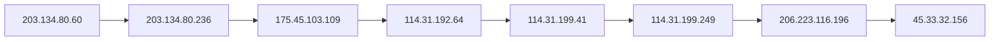

# Nmap OSINT Scan Report — capstone_permissive_xml

## Introduction

This report narrates the findings of a **Nmap** scan against **scanme.nmap.org**. The story follows the scan itself, each discovered host, and any traceroute path recorded during the run. Every observed nugget and value from the semantic graph appears in the narrative below or in the appendix.

## Scan

The scan was executed with **nmap** version **7.80**, targeting **scanme.nmap.org** from **Fri Jun 26 03:56:04 2026**. The operator invoked: `nmap -sT -A -T3 --top-ports 1000 --open -oX - scanme.nmap.org`.
 The run completed in **102.84** seconds.

Nmap done at Fri Jun 26 03:57:46 2026; 1 IP address (1 host up) scanned in 102.84 seconds

During this scan, **8** hosts were placed under investigation.

## Host 114.31.192.64

It answers to the internet name **be158.cor01.syd11.nsw.vocus.network**.

### Networks

Network address **114.31.192.64**:
- No transport endpoints were enumerated.

## Host 114.31.199.249

It answers to the internet name **be101.bdr01.sjc02.ca.us.vocus.network**.

### Networks

Network address **114.31.199.249**:
- No transport endpoints were enumerated.

## Host 114.31.199.41

It answers to the internet name **be202.bdr04.sjc01.ca.us.vocus.network**.

### Networks

Network address **114.31.199.41**:
- No transport endpoints were enumerated.

## Host 175.45.103.109

It answers to the internet name **be106-99.bdr01.syd14.nsw.vocus.network**.

### Networks

Network address **175.45.103.109**:
- No transport endpoints were enumerated.

## Host 203.134.80.236

It answers to the internet name **ae10-100.edg01.alexeqn.nsw.vocus.network**.

### Networks

Network address **203.134.80.236**:
- No transport endpoints were enumerated.

## Host 203.134.80.60

It answers to the internet name **lo0-33.bng71.alexeqn.nsw.vocus.network**.

### Networks

Network address **203.134.80.60**:
- No transport endpoints were enumerated.

## Host 206.223.116.196

It answers to the internet name **eqix-sv1.linode.com**.

### Networks

Network address **206.223.116.196**:
- No transport endpoints were enumerated.

## Host 45.33.32.156

The host was observed as **up** (reason: **reset**).
It answers to the internet name **scanme.nmap.org**.

### Environment

The host environment indicates operating system **Linux 2.6.18**.
- **Accuracy** (`91`)
- **Os Family** (`Linux`)
- **Os Gen** (`2.6.X`)
- **Os Type** (`general purpose`)
- **Os Vendor** (`Linux`)
The host environment indicates operating system **Linux 2.6.18 - 2.6.22**.
- **Accuracy** (`94`)
- **Os Family** (`Linux`)
- **Os Gen** (`2.6.X`)
- **Os Type** (`general purpose`)
- **Os Vendor** (`Linux`)
The host environment indicates operating system **Linux 2.6.32**.
- **Accuracy** (`90`)
- **Os Family** (`Linux`)
- **Os Gen** (`2.6.X`)
- **Os Type** (`general purpose`)
- **Os Vendor** (`Linux`)
The host environment indicates operating system **Linux 2.6.32 or 3.10**.
- **Accuracy** (`90`)
- **Os Family** (`Linux`)
- **Os Gen** (`2.6.X`)
- **Os Gen** (`3.X`)
- **Os Type** (`general purpose`)
- **Os Vendor** (`Linux`)
The host environment indicates operating system **Linux 3.4**.
- **Accuracy** (`90`)
- **Os Family** (`Linux`)
- **Os Gen** (`3.X`)
- **Os Type** (`general purpose`)
- **Os Vendor** (`Linux`)
The host environment indicates operating system **Linux 3.5**.
- **Accuracy** (`90`)
- **Os Family** (`Linux`)
- **Os Gen** (`3.X`)
- **Os Type** (`general purpose`)
- **Os Vendor** (`Linux`)
The host environment indicates operating system **Linux 3.7**.
- **Accuracy** (`90`)
- **Os Family** (`Linux`)
- **Os Gen** (`3.X`)
- **Os Type** (`general purpose`)
- **Os Vendor** (`Linux`)
The host environment indicates operating system **Linux 4.2**.
- **Accuracy** (`90`)
- **Os Family** (`Linux`)
- **Os Gen** (`4.X`)
- **Os Type** (`general purpose`)
- **Os Vendor** (`Linux`)
The host environment indicates operating system **Linux 4.4**.
- **Accuracy** (`90`)
- **Os Family** (`Linux`)
- **Os Gen** (`4.X`)
- **Os Type** (`general purpose`)
- **Os Vendor** (`Linux`)
The host environment indicates operating system **Synology DiskStation Manager 5.1**.
- **Accuracy** (`90`)
- **Os Family** (`DiskStation Manager`)
- **Os Family** (`Linux`)
- **Os Gen** (`5.X`)
- **Os Type** (`storage-misc`)
- **Os Vendor** (`Linux`)
- **Os Vendor** (`Synology`)

### Networks

Network address **45.33.32.156**:
- Port **22** on **tcp** is **open** (syn-ack), associated with **ssh**.
- Port **31337** on **tcp** is **open** (syn-ack), associated with **tcpwrapped**.
- Port **80** on **tcp** is **open** (syn-ack), associated with **http**.
- Port **9929** on **tcp** is **open** (syn-ack), associated with **nping-echo**.
- Port **33058** on **udp** is **closed**, associated with **an unnamed service**.
  - **Port Source** (`os_probe`)

### Applications

Application service **http** listening on port **80**. It runs **Apache httpd 2.4.7**. Additional detail: **(Ubuntu)**. The HTTP title banner reads **"Go ahead and ScanMe!"**.
- Common Platform Enumeration: `cpe:/a:apache:http_server:2.4.7`.
Application service **nping-echo** listening on port **9929**. It runs **Nping echo**.
Application service **ssh** listening on port **22**. It runs **OpenSSH 6.6.1p1 Ubuntu 2ubuntu2.13**. Additional detail: **Ubuntu Linux; protocol 2.0**.
- Common Platform Enumeration: `cpe:/a:openbsd:openssh:6.6.1p1`.
- Common Platform Enumeration: `cpe:/o:linux:linux_kernel`.
The **ssh** service exposes an **DSA** SSH host key (fingerprint `ac00a01a82ffcc5599dc672b34976b75`). Algorithm: **ssh-dss**. Key size: **1024** bits. Public key material: `AAAAB3NzaC1kc3MAAACBAOe8o59vFWZGaBmGPVeJBObEfi1AR8yEUYC/Ufkku3sKhGF7wM2m2ujIeZDK5vqeC0S5EN2xYo6FshCP4FQRYeTxD17nNO4PhwW65qAjDRRU0uHFfSAh5wk+vt4yQztOE++sTd1G9OBLzA8HO99qDmCAxb3zw+GQDEgPjzgyzGZ3AAAAFQCBmE1vROP8IaPkUmhM5xLFta/xHwAAAIEA3EwRfaeOPLL7TKDgGX67Lbkf9UtdlpCdC4doMjGgsznYMwWH6a7Lj3vi4/KmeZZdix6FMdFqq+2vrfT1DRqx0RS0XYdGxnkgS+2g333WYCrUkDCn6RPUWR/1TgGMPHCj7LWCa1ZwJwLWS2KX288Pa2gLOWuhZm2VYKSQx6NEDOIAAACBANxIfprSdBdbo4Ezrh6/X6HSvrhjtZ7MouStWaE714ByO5bS2coM9CyaCwYyrE5qzYiyIfb+1BG3O5nVdDuN95sQ/0bAdBKlkqLFvFqFjVbETF0ri3v97w6MpUawfF75ouDrQ4xdaUOLLEWTso6VFJcM6Jg9bDl0FA0uLZUSDEHL`
The **ssh** service exposes an **ECDSA** SSH host key (fingerprint `9602bb5e57541c4e452f564c4a24b257`). Algorithm: **ecdsa-sha2-nistp256**. Key size: **256** bits. Public key material: `AAAAE2VjZHNhLXNoYTItbmlzdHAyNTYAAAAIbmlzdHAyNTYAAABBBMD46g67x6yWNjjQJnXhiz/TskHrqQ0uPcOspFrIYW382uOGzmWDZCFV8FbFwQyH90u+j0Qr1SGNAxBZMhOQ8pc=`
The **ssh** service exposes an **EDDSA** SSH host key (fingerprint `33fa910fe0e17b1f6d05a2b0f1544156`). Algorithm: **ssh-ed25519**. Key size: **256** bits. Public key material: `AAAAC3NzaC1lZDI1NTE5AAAAILzVjfIyIHfXyRd8jVBaVT8Yvk/UvHh5Afvho8sGciG7`
The **ssh** service exposes an **RSA** SSH host key (fingerprint `203d2d44622ab05a9db5b30514c2a6b2`). Algorithm: **ssh-rsa**. Key size: **2048** bits. Public key material: `AAAAB3NzaC1yc2EAAAADAQABAAABAQC6afooTZ9mVUGFNEhkMoRR1Btzu64XXwElhCsHw/zVlIx/HXylNbb9+11dm2VgJQ21pxkWDs+L6+EbYyDnvRURTrMTgHL0xseB0EkNqexs9hYZSiqtMx4jtGNtHvsMxZnbxvVUk2dasWvtBkn8J5JagSbzWTQo4hjKMOI1SUlXtiKxAs2F8wiq2EdSuKw/KNk8GfIp1TA+8ccGeAtnsVptTJ4D/8MhAWsROkQzOowQvnBBz2/8ecEvoMScaf+kDfNQowK3gENtSSOqYw9JLOza6YJBPL/aYuQQ0nJ74Rr5vL44aNIlrGI9jJc2x0bV7BeNA5kVuXsmhyfWbbkB8yGd`
Application service **tcpwrapped** listening on port **31337**.

## Traceroute Path

- **Trace Protocol** (`icmp`)

Each hop along the path:

1. Hop **1** (TTL **2**, RTT **10.00 ms**) reaches **203.134.80.60**.
2. Hop **2** (TTL **4**, RTT **8.00 ms**) reaches **203.134.80.236**.
3. Hop **3** (TTL **5**, RTT **8.00 ms**) reaches **175.45.103.109**.
4. Hop **4** (TTL **6**, RTT **155.00 ms**) reaches **114.31.192.64**.
5. Hop **5** (TTL **7**, RTT **155.00 ms**) reaches **114.31.199.41**.
6. Hop **6** (TTL **8**, RTT **155.00 ms**) reaches **114.31.199.249**.
7. Hop **7** (TTL **9**, RTT **153.00 ms**) reaches **206.223.116.196**.
8. Hop **8** (TTL **13**, RTT **152.00 ms**) reaches **45.33.32.156**.

### Trace diagram

## Conclusion

The scan captured **149** semantic nuggets across **8** hosts.
 Nmap done at Fri Jun 26 03:57:46 2026; 1 IP address (1 host up) scanned in 102.84 seconds
 The appendix lists every nugget instance and value for audit and downstream review.

## Appendix — Complete Nugget Inventory

| Type | Nugget | Description | Value |
|------|--------|-------------|-------|
| CATEGORY | APPLICATIONS | Applications Category | `applications:45.33.32.156` |
| CATEGORY | ENVIRONMENT | Environment Category | `environment:45.33.32.156` |
| CATEGORY | NETWORKS | Networks Category | `networks:114.31.192.64` |
| CATEGORY | NETWORKS | Networks Category | `networks:114.31.199.249` |
| CATEGORY | NETWORKS | Networks Category | `networks:114.31.199.41` |
| CATEGORY | NETWORKS | Networks Category | `networks:175.45.103.109` |
| CATEGORY | NETWORKS | Networks Category | `networks:203.134.80.236` |
| CATEGORY | NETWORKS | Networks Category | `networks:203.134.80.60` |
| CATEGORY | NETWORKS | Networks Category | `networks:206.223.116.196` |
| CATEGORY | NETWORKS | Networks Category | `networks:45.33.32.156` |
| DESCRIPTOR | ACCURACY | Accuracy | `90` |
| DESCRIPTOR | ACCURACY | Accuracy | `91` |
| DESCRIPTOR | ACCURACY | Accuracy | `94` |
| DESCRIPTOR | HOP_ORDER | Trace Hop Order | `1` |
| DESCRIPTOR | HOP_ORDER | Trace Hop Order | `2` |
| DESCRIPTOR | HOP_ORDER | Trace Hop Order | `3` |
| DESCRIPTOR | HOP_ORDER | Trace Hop Order | `4` |
| DESCRIPTOR | HOP_ORDER | Trace Hop Order | `5` |
| DESCRIPTOR | HOP_ORDER | Trace Hop Order | `6` |
| DESCRIPTOR | HOP_ORDER | Trace Hop Order | `7` |
| DESCRIPTOR | HOP_ORDER | Trace Hop Order | `8` |
| DESCRIPTOR | HOP_RTT | Trace Hop RTT | `10.00` |
| DESCRIPTOR | HOP_RTT | Trace Hop RTT | `152.00` |
| DESCRIPTOR | HOP_RTT | Trace Hop RTT | `153.00` |
| DESCRIPTOR | HOP_RTT | Trace Hop RTT | `155.00` |
| DESCRIPTOR | HOP_RTT | Trace Hop RTT | `8.00` |
| DESCRIPTOR | HOP_TTL | Trace Hop TTL | `13` |
| DESCRIPTOR | HOP_TTL | Trace Hop TTL | `2` |
| DESCRIPTOR | HOP_TTL | Trace Hop TTL | `4` |
| DESCRIPTOR | HOP_TTL | Trace Hop TTL | `5` |
| DESCRIPTOR | HOP_TTL | Trace Hop TTL | `6` |
| DESCRIPTOR | HOP_TTL | Trace Hop TTL | `7` |
| DESCRIPTOR | HOP_TTL | Trace Hop TTL | `8` |
| DESCRIPTOR | HOP_TTL | Trace Hop TTL | `9` |
| DESCRIPTOR | HOST_STATUS | Host Status | `up` |
| DESCRIPTOR | HOST_STATUS_REASON | Host Status Reason | `reset` |
| DESCRIPTOR | HTTP_TITLE | HTTP Title | `Go ahead and ScanMe!` |
| DESCRIPTOR | INTERNET_NAME | Internet Name | `ae10-100.edg01.alexeqn.nsw.vocus.network` |
| DESCRIPTOR | INTERNET_NAME | Internet Name | `be101.bdr01.sjc02.ca.us.vocus.network` |
| DESCRIPTOR | INTERNET_NAME | Internet Name | `be106-99.bdr01.syd14.nsw.vocus.network` |
| DESCRIPTOR | INTERNET_NAME | Internet Name | `be158.cor01.syd11.nsw.vocus.network` |
| DESCRIPTOR | INTERNET_NAME | Internet Name | `be202.bdr04.sjc01.ca.us.vocus.network` |
| DESCRIPTOR | INTERNET_NAME | Internet Name | `eqix-sv1.linode.com` |
| DESCRIPTOR | INTERNET_NAME | Internet Name | `lo0-33.bng71.alexeqn.nsw.vocus.network` |
| DESCRIPTOR | INTERNET_NAME | Internet Name | `scanme.nmap.org` |
| DESCRIPTOR | OPERATING_SYSTEM | Operating System | `Linux 2.6.18` |
| DESCRIPTOR | OPERATING_SYSTEM | Operating System | `Linux 2.6.18 - 2.6.22` |
| DESCRIPTOR | OPERATING_SYSTEM | Operating System | `Linux 2.6.32` |
| DESCRIPTOR | OPERATING_SYSTEM | Operating System | `Linux 2.6.32 or 3.10` |
| DESCRIPTOR | OPERATING_SYSTEM | Operating System | `Linux 3.4` |
| DESCRIPTOR | OPERATING_SYSTEM | Operating System | `Linux 3.5` |
| DESCRIPTOR | OPERATING_SYSTEM | Operating System | `Linux 3.7` |
| DESCRIPTOR | OPERATING_SYSTEM | Operating System | `Linux 4.2` |
| DESCRIPTOR | OPERATING_SYSTEM | Operating System | `Linux 4.4` |
| DESCRIPTOR | OPERATING_SYSTEM | Operating System | `Synology DiskStation Manager 5.1` |
| DESCRIPTOR | OS_FAMILY | Os Family | `DiskStation Manager` |
| DESCRIPTOR | OS_FAMILY | Os Family | `Linux` |
| DESCRIPTOR | OS_GEN | Os Gen | `2.6.X` |
| DESCRIPTOR | OS_GEN | Os Gen | `3.X` |
| DESCRIPTOR | OS_GEN | Os Gen | `4.X` |
| DESCRIPTOR | OS_GEN | Os Gen | `5.X` |
| DESCRIPTOR | OS_TYPE | Os Type | `general purpose` |
| DESCRIPTOR | OS_TYPE | Os Type | `storage-misc` |
| DESCRIPTOR | OS_VENDOR | Os Vendor | `Linux` |
| DESCRIPTOR | OS_VENDOR | Os Vendor | `Synology` |
| DESCRIPTOR | PORT_PROTOCOL | Port Protocol | `tcp` |
| DESCRIPTOR | PORT_PROTOCOL | Port Protocol | `udp` |
| DESCRIPTOR | PORT_SOURCE | Port Source | `os_probe` |
| DESCRIPTOR | PORT_STATE | Port State | `closed` |
| DESCRIPTOR | PORT_STATE | Port State | `open` |
| DESCRIPTOR | PORT_STATE_REASON | Port State Reason | `syn-ack` |
| DESCRIPTOR | SCAN_CLI | Scan CLI | `nmap -sT -A -T3 --top-ports 1000 --open -oX - scanme.nmap.org` |
| DESCRIPTOR | SCAN_ELAPSED | Scan Elapsed Time | `102.84` |
| DESCRIPTOR | SCAN_START | Scan Start | `Fri Jun 26 03:56:04 2026` |
| DESCRIPTOR | SCAN_SUMMARY | Scan Summary | `Nmap done at Fri Jun 26 03:57:46 2026; 1 IP address (1 host up) scanned in 102.84 seconds` |
| DESCRIPTOR | SCAN_TARGET | Scan Target | `scanme.nmap.org` |
| DESCRIPTOR | SCAN_TOOL | Scan Tool | `nmap` |
| DESCRIPTOR | SCAN_VERSION | Scan Version | `7.80` |
| DESCRIPTOR | SERVICE_EXTRAINFO | Service Extra Information | `(Ubuntu)` |
| DESCRIPTOR | SERVICE_EXTRAINFO | Service Extra Information | `Ubuntu Linux; protocol 2.0` |
| DESCRIPTOR | SERVICE_VERSION | Service Version | `Apache httpd 2.4.7` |
| DESCRIPTOR | SERVICE_VERSION | Service Version | `Nping echo` |
| DESCRIPTOR | SERVICE_VERSION | Service Version | `OpenSSH 6.6.1p1 Ubuntu 2ubuntu2.13` |
| DESCRIPTOR | SSH_KEY_BITS | SSH Key Bits | `1024` |
| DESCRIPTOR | SSH_KEY_BITS | SSH Key Bits | `2048` |
| DESCRIPTOR | SSH_KEY_BITS | SSH Key Bits | `256` |
| DESCRIPTOR | SSH_KEY_KEY | SSH Public Key | `AAAAB3NzaC1kc3MAAACBAOe8o59vFWZGaBmGPVeJBObEfi1AR8yEUYC/Ufkku3sKhGF7wM2m2ujIeZDK5vqeC0S5EN2xYo6FshCP4FQRYeTxD17nNO4PhwW65qAjDRRU0uHFfSAh5wk+vt4yQztOE++sTd1G9OBLzA8HO99qDmCAxb3zw+GQDEgPjzgyzGZ3AAAAFQCBmE1vROP8IaPkUmhM5xLFta/xHwAAAIEA3EwRfaeOPLL7TKDgGX67Lbkf9UtdlpCdC4doMjGgsznYMwWH6a7Lj3vi4/KmeZZdix6FMdFqq+2vrfT1DRqx0RS0XYdGxnkgS+2g333WYCrUkDCn6RPUWR/1TgGMPHCj7LWCa1ZwJwLWS2KX288Pa2gLOWuhZm2VYKSQx6NEDOIAAACBANxIfprSdBdbo4Ezrh6/X6HSvrhjtZ7MouStWaE714ByO5bS2coM9CyaCwYyrE5qzYiyIfb+1BG3O5nVdDuN95sQ/0bAdBKlkqLFvFqFjVbETF0ri3v97w6MpUawfF75ouDrQ4xdaUOLLEWTso6VFJcM6Jg9bDl0FA0uLZUSDEHL` |
| DESCRIPTOR | SSH_KEY_KEY | SSH Public Key | `AAAAB3NzaC1yc2EAAAADAQABAAABAQC6afooTZ9mVUGFNEhkMoRR1Btzu64XXwElhCsHw/zVlIx/HXylNbb9+11dm2VgJQ21pxkWDs+L6+EbYyDnvRURTrMTgHL0xseB0EkNqexs9hYZSiqtMx4jtGNtHvsMxZnbxvVUk2dasWvtBkn8J5JagSbzWTQo4hjKMOI1SUlXtiKxAs2F8wiq2EdSuKw/KNk8GfIp1TA+8ccGeAtnsVptTJ4D/8MhAWsROkQzOowQvnBBz2/8ecEvoMScaf+kDfNQowK3gENtSSOqYw9JLOza6YJBPL/aYuQQ0nJ74Rr5vL44aNIlrGI9jJc2x0bV7BeNA5kVuXsmhyfWbbkB8yGd` |
| DESCRIPTOR | SSH_KEY_KEY | SSH Public Key | `AAAAC3NzaC1lZDI1NTE5AAAAILzVjfIyIHfXyRd8jVBaVT8Yvk/UvHh5Afvho8sGciG7` |
| DESCRIPTOR | SSH_KEY_KEY | SSH Public Key | `AAAAE2VjZHNhLXNoYTItbmlzdHAyNTYAAAAIbmlzdHAyNTYAAABBBMD46g67x6yWNjjQJnXhiz/TskHrqQ0uPcOspFrIYW382uOGzmWDZCFV8FbFwQyH90u+j0Qr1SGNAxBZMhOQ8pc=` |
| DESCRIPTOR | SSH_KEY_TYPE | SSH Key Type | `ecdsa-sha2-nistp256` |
| DESCRIPTOR | SSH_KEY_TYPE | SSH Key Type | `ssh-dss` |
| DESCRIPTOR | SSH_KEY_TYPE | SSH Key Type | `ssh-ed25519` |
| DESCRIPTOR | SSH_KEY_TYPE | SSH Key Type | `ssh-rsa` |
| DESCRIPTOR | TRACE_PROTOCOL | Trace Protocol | `icmp` |
| ENTITY | HOST | Host | `114.31.192.64` |
| ENTITY | HOST | Host | `114.31.199.249` |
| ENTITY | HOST | Host | `114.31.199.41` |
| ENTITY | HOST | Host | `175.45.103.109` |
| ENTITY | HOST | Host | `203.134.80.236` |
| ENTITY | HOST | Host | `203.134.80.60` |
| ENTITY | HOST | Host | `206.223.116.196` |
| ENTITY | HOST | Host | `45.33.32.156` |
| ENTITY | IPV4_ADDRESS | IP Address | `114.31.192.64` |
| ENTITY | IPV4_ADDRESS | IP Address | `114.31.199.249` |
| ENTITY | IPV4_ADDRESS | IP Address | `114.31.199.41` |
| ENTITY | IPV4_ADDRESS | IP Address | `175.45.103.109` |
| ENTITY | IPV4_ADDRESS | IP Address | `203.134.80.236` |
| ENTITY | IPV4_ADDRESS | IP Address | `203.134.80.60` |
| ENTITY | IPV4_ADDRESS | IP Address | `206.223.116.196` |
| ENTITY | IPV4_ADDRESS | IP Address | `45.33.32.156` |
| ENTITY | SCAN_RECORD | Scan Record | `nmap:scanme.nmap.org:Fri Jun 26 03:56:04 2026` |
| ENTITY | SERVICE | Network Service | `http` |
| ENTITY | SERVICE | Network Service | `nping-echo` |
| ENTITY | SERVICE | Network Service | `ssh` |
| ENTITY | SERVICE | Network Service | `tcpwrapped` |
| ENTITY | TRACE | Trace | `45.33.32.156:icmp` |
| ENTITY | TRANSPORT | Transport Protocol | `tcp` |
| ENTITY | TRANSPORT | Transport Protocol | `udp` |
| SUBENTITY | CPE_URL | CPE URL | `cpe:/a:apache:http_server:2.4.7` |
| SUBENTITY | CPE_URL | CPE URL | `cpe:/a:openbsd:openssh:6.6.1p1` |
| SUBENTITY | CPE_URL | CPE URL | `cpe:/a:synology:diskstation_manager:5.1` |
| SUBENTITY | CPE_URL | CPE URL | `cpe:/o:linux:linux_kernel` |
| SUBENTITY | CPE_URL | CPE URL | `cpe:/o:linux:linux_kernel:2.6` |
| SUBENTITY | CPE_URL | CPE URL | `cpe:/o:linux:linux_kernel:2.6.18` |
| SUBENTITY | CPE_URL | CPE URL | `cpe:/o:linux:linux_kernel:2.6.32` |
| SUBENTITY | CPE_URL | CPE URL | `cpe:/o:linux:linux_kernel:3.10` |
| SUBENTITY | CPE_URL | CPE URL | `cpe:/o:linux:linux_kernel:3.4` |
| SUBENTITY | CPE_URL | CPE URL | `cpe:/o:linux:linux_kernel:3.5` |
| SUBENTITY | CPE_URL | CPE URL | `cpe:/o:linux:linux_kernel:3.7` |
| SUBENTITY | CPE_URL | CPE URL | `cpe:/o:linux:linux_kernel:4.2` |
| SUBENTITY | CPE_URL | CPE URL | `cpe:/o:linux:linux_kernel:4.4` |
| SUBENTITY | DSA | SSH Key - DSA | `ac00a01a82ffcc5599dc672b34976b75` |
| SUBENTITY | ECDSA | SSH Key - ECDSA | `9602bb5e57541c4e452f564c4a24b257` |
| SUBENTITY | EDDSA | SSH Key - EdDSA | `33fa910fe0e17b1f6d05a2b0f1544156` |
| SUBENTITY | PORT | Network Port | `22` |
| SUBENTITY | PORT | Network Port | `31337` |
| SUBENTITY | PORT | Network Port | `33058` |
| SUBENTITY | PORT | Network Port | `80` |
| SUBENTITY | PORT | Network Port | `9929` |
| SUBENTITY | RSA | SSH Key - RSA | `203d2d44622ab05a9db5b30514c2a6b2` |
| SUBENTITY | TRACE_HOP | Trace Hop | `114.31.192.64` |
| SUBENTITY | TRACE_HOP | Trace Hop | `114.31.199.249` |
| SUBENTITY | TRACE_HOP | Trace Hop | `114.31.199.41` |
| SUBENTITY | TRACE_HOP | Trace Hop | `175.45.103.109` |
| SUBENTITY | TRACE_HOP | Trace Hop | `203.134.80.236` |
| SUBENTITY | TRACE_HOP | Trace Hop | `203.134.80.60` |
| SUBENTITY | TRACE_HOP | Trace Hop | `206.223.116.196` |
| SUBENTITY | TRACE_HOP | Trace Hop | `45.33.32.156` |

---

*OS-Intel Scan · Fri Jun 26 03:56:04 2026 · Page 1*
