# Nmap scan narrative — `nse_default_permissive_xml`

## Introduction

This report narrates findings from a Nmap scan. The story follows the scan record, each discovered host (networks, applications, environment), and any traceroute path. This report follows Scan → Host/System/Organisation/Domain (categories) → Trace → Appendix. Overview diagrams show ontology types and relations; category diagrams show a few example values with the rest in tables; the appendix inventories every node and edge.

## Scan

Every examination has one SCAN_RECORD with scan descriptors linked via had. This scan includes **1** Scan root node(s) (e.g. `nmap:scanme.nmap.org:Tue Jun 23 19:02:05 2026`). Linked structures: `SCAN_CLI`, `SCAN_VERSION`, `SCAN_START`, `SCAN_TARGET`, `SCAN_SUMMARY`, `SCAN_ELAPSED`.

### Structure overview

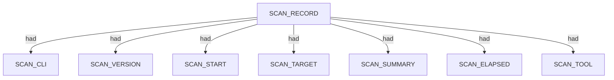

### `SCAN_CLI`

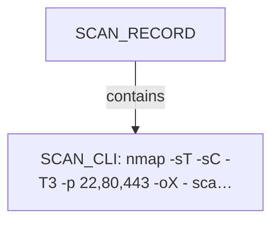

| Nugget | Value |
| --- | --- |
| `SCAN_CLI` | `nmap -sT -sC -T3 -p 22,80,443 -oX - scanme.nmap.org` |

### `SCAN_VERSION`

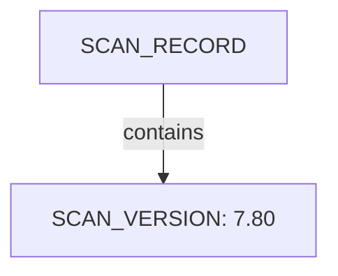

| Nugget | Value |
| --- | --- |
| `SCAN_VERSION` | `7.80` |

### `SCAN_START`

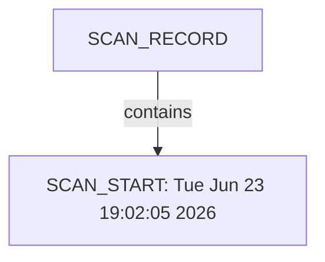

| Nugget | Value |
| --- | --- |
| `SCAN_START` | `Tue Jun 23 19:02:05 2026` |

### `SCAN_TARGET`

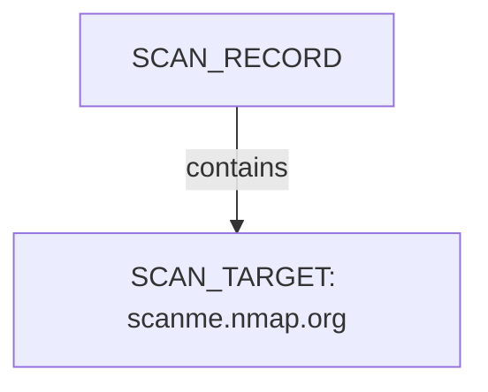

| Nugget | Value |
| --- | --- |
| `SCAN_TARGET` | `scanme.nmap.org` |

### `SCAN_SUMMARY`

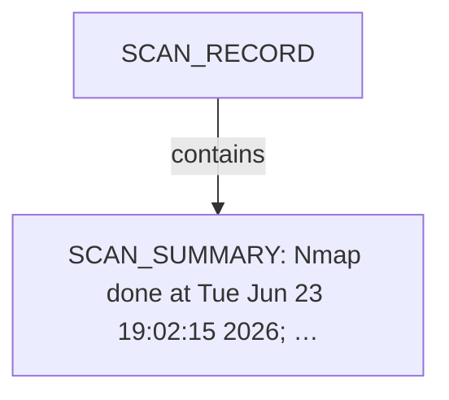

| Nugget | Value |
| --- | --- |
| `SCAN_SUMMARY` | `Nmap done at Tue Jun 23 19:02:15 2026; 1 IP address (1 host up) scanned in 9.83 seconds` |

### `SCAN_ELAPSED`

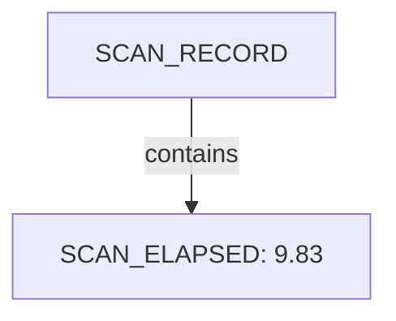

| Nugget | Value |
| --- | --- |
| `SCAN_ELAPSED` | `9.83` |

### `SCAN_TOOL`

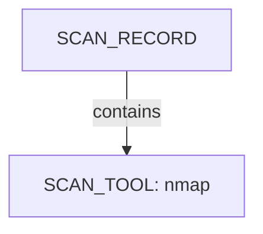

| Nugget | Value |
| --- | --- |
| `SCAN_TOOL` | `nmap` |

## Host

Qualified HOST endpoints own category trees for networks, applications, environment, and security findings. This scan includes **1** Host root node(s) (e.g. `45.33.32.156`). Linked structures: `NETWORKS`, `APPLICATIONS`.

### Structure overview

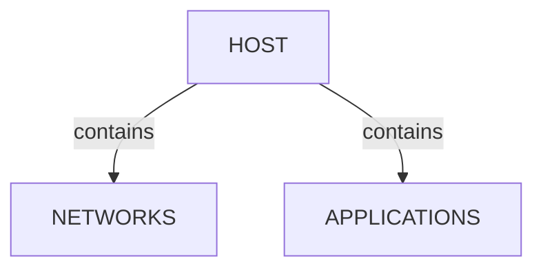

### `NETWORKS`

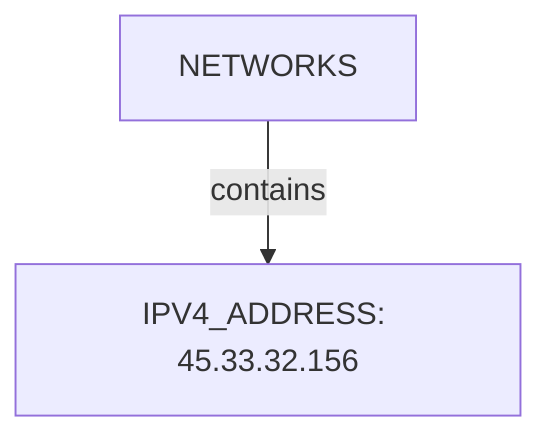

| Nugget | Value |
| --- | --- |
| `IPV4_ADDRESS` | `45.33.32.156` |

### `APPLICATIONS`

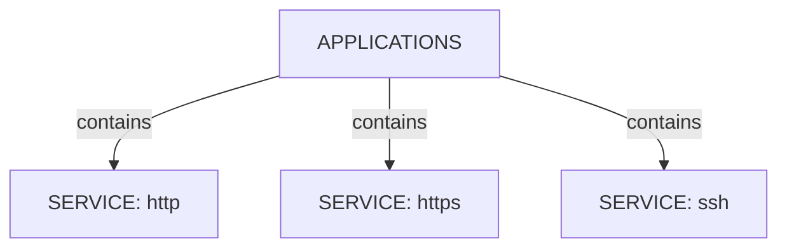

| Nugget | Value |
| --- | --- |
| `SERVICE` | `http` |
| `SERVICE` | `https` |
| `SERVICE` | `ssh` |

## Services and ports

APPLICATION services listen-to PORT entities under NETWORKS/TRANSPORT. This scan includes **3** Services and ports root node(s) (e.g. `ssh`, `http`, `https`). Linked structures: no child categories.

### Structure overview

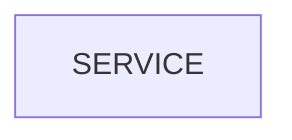

### Values

| Nugget | Value |
| --- | --- |
| `SERVICE` | `http` |
| `SERVICE` | `https` |
| `SERVICE` | `ssh` |

## Conclusion

See the appendix for the full node and edge inventory.

## Appendix

### Nodes

| Nugget | Value |
| --- | --- |
| `APPLICATIONS` | `applications:45.33.32.156` |
| `DSA` | `ac00a01a82ffcc5599dc672b34976b75` |
| `ECDSA` | `9602bb5e57541c4e452f564c4a24b257` |
| `EDDSA` | `33fa910fe0e17b1f6d05a2b0f1544156` |
| `HOST` | `45.33.32.156` |
| `HOST_STATUS` | `up` |
| `HOST_STATUS_REASON` | `echo-reply` |
| `INTERNET_NAME` | `scanme.nmap.org` |
| `IPV4_ADDRESS` | `45.33.32.156` |
| `NETWORKS` | `networks:45.33.32.156` |
| `PORT` | `22` |
| `PORT` | `443` |
| `PORT` | `80` |
| `PORT_PROTOCOL` | `tcp` |
| `PORT_STATE` | `filtered` |
| `PORT_STATE` | `open` |
| `PORT_STATE_REASON` | `no-response` |
| `PORT_STATE_REASON` | `syn-ack` |
| `RSA` | `203d2d44622ab05a9db5b30514c2a6b2` |
| `SCAN_CLI` | `nmap -sT -sC -T3 -p 22,80,443 -oX - scanme.nmap.org` |
| `SCAN_ELAPSED` | `9.83` |
| `SCAN_RECORD` | `nmap:scanme.nmap.org:Tue Jun 23 19:02:05 2026` |
| `SCAN_START` | `Tue Jun 23 19:02:05 2026` |
| `SCAN_SUMMARY` | `Nmap done at Tue Jun 23 19:02:15 2026; 1 IP address (1 host up) scanned in 9.83 seconds` |
| `SCAN_TARGET` | `scanme.nmap.org` |
| `SCAN_TOOL` | `nmap` |
| `SCAN_VERSION` | `7.80` |
| `SERVICE` | `http` |
| `SERVICE` | `https` |
| `SERVICE` | `ssh` |
| `SSH_KEY_BITS` | `1024` |
| `SSH_KEY_BITS` | `2048` |
| `SSH_KEY_BITS` | `256` |
| `SSH_KEY_KEY` | `AAAAB3NzaC1kc3MAAACBAOe8o59vFWZGaBmGPVeJBObEfi1AR8yEUYC/Ufkku3sKhGF7wM2m2ujIeZDK5vqeC0S5EN2xYo6FshCP4FQRYeTxD17nNO4PhwW65qAjDRRU0uHFfSAh5wk+vt4yQztOE++sTd1G9OBLzA8HO99qDmCAxb3zw+GQDEgPjzgyzGZ3AAAAFQCBmE1vROP8IaPkUmhM5xLFta/xHwAAAIEA3EwRfaeOPLL7TKDgGX67Lbkf9UtdlpCdC4doMjGgsznYMwWH6a7Lj3vi4/KmeZZdix6FMdFqq+2vrfT1DRqx0RS0XYdGxnkgS+2g333WYCrUkDCn6RPUWR/1TgGMPHCj7LWCa1ZwJwLWS2KX288Pa2gLOWuhZm2VYKSQx6NEDOIAAACBANxIfprSdBdbo4Ezrh6/X6HSvrhjtZ7MouStWaE714ByO5bS2coM9CyaCwYyrE5qzYiyIfb+1BG3O5nVdDuN95sQ/0bAdBKlkqLFvFqFjVbETF0ri3v97w6MpUawfF75ouDrQ4xdaUOLLEWTso6VFJcM6Jg9bDl0FA0uLZUSDEHL` |
| `SSH_KEY_KEY` | `AAAAB3NzaC1yc2EAAAADAQABAAABAQC6afooTZ9mVUGFNEhkMoRR1Btzu64XXwElhCsHw/zVlIx/HXylNbb9+11dm2VgJQ21pxkWDs+L6+EbYyDnvRURTrMTgHL0xseB0EkNqexs9hYZSiqtMx4jtGNtHvsMxZnbxvVUk2dasWvtBkn8J5JagSbzWTQo4hjKMOI1SUlXtiKxAs2F8wiq2EdSuKw/KNk8GfIp1TA+8ccGeAtnsVptTJ4D/8MhAWsROkQzOowQvnBBz2/8ecEvoMScaf+kDfNQowK3gENtSSOqYw9JLOza6YJBPL/aYuQQ0nJ74Rr5vL44aNIlrGI9jJc2x0bV7BeNA5kVuXsmhyfWbbkB8yGd` |
| `SSH_KEY_KEY` | `AAAAC3NzaC1lZDI1NTE5AAAAILzVjfIyIHfXyRd8jVBaVT8Yvk/UvHh5Afvho8sGciG7` |
| `SSH_KEY_KEY` | `AAAAE2VjZHNhLXNoYTItbmlzdHAyNTYAAAAIbmlzdHAyNTYAAABBBMD46g67x6yWNjjQJnXhiz/TskHrqQ0uPcOspFrIYW382uOGzmWDZCFV8FbFwQyH90u+j0Qr1SGNAxBZMhOQ8pc=` |
| `SSH_KEY_TYPE` | `ecdsa-sha2-nistp256` |
| `SSH_KEY_TYPE` | `ssh-dss` |
| `SSH_KEY_TYPE` | `ssh-ed25519` |
| `SSH_KEY_TYPE` | `ssh-rsa` |
| `TRANSPORT` | `tcp` |

### Edges

| Source | Relation | Target |
| --- | --- | --- |
| `SCAN_RECORD` | `had` | `SCAN_CLI` |
| `SCAN_RECORD` | `had` | `SCAN_VERSION` |
| `SCAN_RECORD` | `had` | `SCAN_START` |
| `SCAN_RECORD` | `had` | `SCAN_TARGET` |
| `SCAN_RECORD` | `had` | `SCAN_SUMMARY` |
| `SCAN_RECORD` | `had` | `SCAN_ELAPSED` |
| `SCAN_RECORD` | `had` | `SCAN_TOOL` |
| `SCAN_RECORD` | `contains` | `HOST` |
| `HOST` | `had` | `HOST_STATUS` |
| `HOST` | `had` | `HOST_STATUS_REASON` |
| `HOST` | `had` | `INTERNET_NAME` |
| `HOST` | `contains` | `NETWORKS` |
| `NETWORKS` | `contains` | `IPV4_ADDRESS` |
| `HOST` | `contains` | `APPLICATIONS` |
| `IPV4_ADDRESS` | `contains` | `TRANSPORT` |
| `TRANSPORT` | `contains` | `PORT` |
| `PORT` | `had` | `PORT_STATE` |
| `PORT` | `had` | `PORT_STATE_REASON` |
| `PORT` | `had` | `PORT_PROTOCOL` |
| `APPLICATIONS` | `contains` | `SERVICE` |
| `SERVICE` | `listens-to` | `PORT` |
| `SERVICE` | `contains` | `DSA` |
| `DSA` | `had` | `SSH_KEY_BITS` |
| `DSA` | `had` | `SSH_KEY_TYPE` |
| `DSA` | `had` | `SSH_KEY_KEY` |
| `SERVICE` | `contains` | `RSA` |
| `RSA` | `had` | `SSH_KEY_BITS` |
| `RSA` | `had` | `SSH_KEY_TYPE` |
| `RSA` | `had` | `SSH_KEY_KEY` |
| `SERVICE` | `contains` | `ECDSA` |
| `ECDSA` | `had` | `SSH_KEY_BITS` |
| `ECDSA` | `had` | `SSH_KEY_TYPE` |
| `ECDSA` | `had` | `SSH_KEY_KEY` |
| `SERVICE` | `contains` | `EDDSA` |
| `EDDSA` | `had` | `SSH_KEY_BITS` |
| `EDDSA` | `had` | `SSH_KEY_TYPE` |
| `EDDSA` | `had` | `SSH_KEY_KEY` |
---

*OS-Intel Scan*
