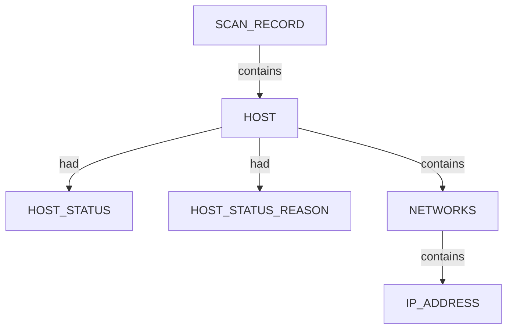
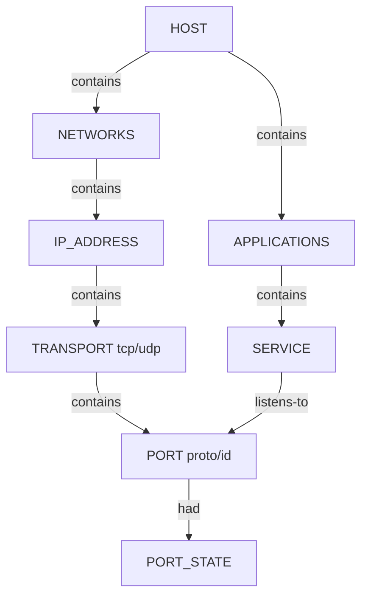
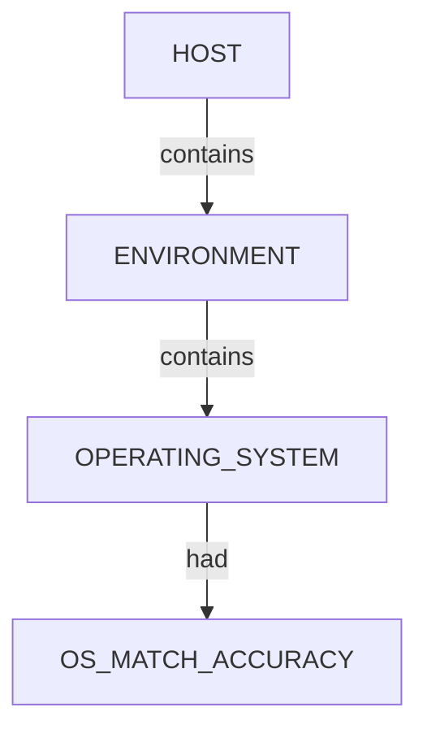
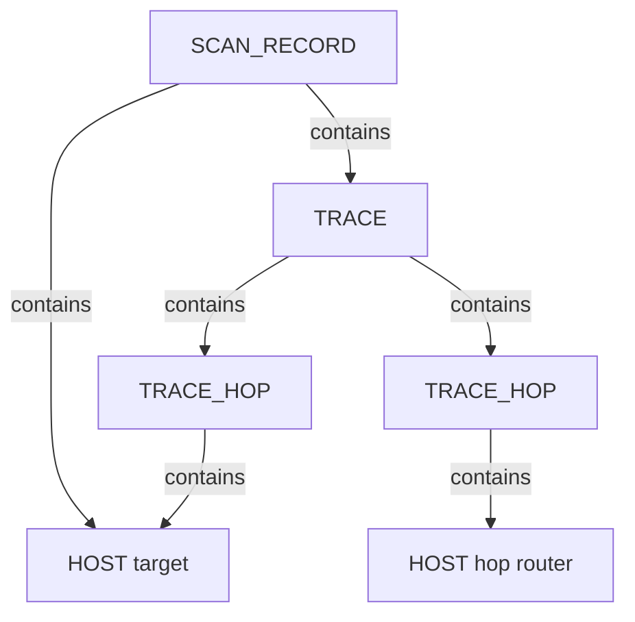

# Nmap — proposed nugget graph structure

Ontology source: `.seed/05_Onotology_for_Nuggets.md` (§2.3, §2.6 host status, §2.7 trace semantics).

Generator: `.seed/scripts/cli_corpus/nmap_xml_to_graph.py`

Artifacts: `nmap_<scenario_key>_proposed_nuggets_edges.json` in this directory.

## Scan head

Every graph has one `SCAN_RECORD` entity with scan descriptors (`SCAN_CLI`, `SCAN_TARGET`, `SCAN_VERSION`, `SCAN_START`, `SCAN_SUMMARY`, …) linked via `had`. Discovered hosts link from scan via `contains`.

## Host tree (all scenarios)

`HOST` canonical key is the primary IPv4 address (or first address). `INTERNET_NAME` descriptors attach to `HOST` when Nmap reports hostnames.

## Port and service tree (port scans)

- `PORT_STATE` values include `open`, `filtered`, `closed`, `open|filtered` (UDP).
- `listens-to` is emitted only when `PORT_STATE` is `open`.
- Legacy flat `TCP_PORT_OPEN` maps to `PORT` + `PORT_STATE=open` + `SERVICE` `listens-to` in this hierarchy.

## OS fingerprint (`-A` / OS detection)

Best `osmatch` by accuracy is selected when multiple matches exist.

## Traceroute trace (host-to-host path)

Nmap records hop IPs in XML; the graph models **hosts** along the path (§2.7).

Each `TRACE_HOP` carries `HOP_ORDER`, `HOP_TTL`, `HOP_RTT`. The final hop reuses the target `HOST` node when IPs match.

## Scenario coverage

| Scenario key | Primary structures |
|--------------|-------------------|
| `host_discovery_permissive` | SCAN + HOST + HOST_STATUS |
| `host_discovery_corporate` | Same (bbc.co.uk) |
| `host_discovery_local_subnet` | SCAN + multiple HOST |
| `tcp_top_ports_permissive` | HOST + PORT/SERVICE (open TCP) |
| `tcp_top_ports_corporate` | HOST + filtered extraports pattern |
| `tcp_top_ports_local` | Multiple hosts, sparse ports |
| `service_version_permissive` | SERVICE + SOFTWARE_USED + CPE |
| `os_aggressive_permissive` | ENVIRONMENT + OS + TRACE |
| `nse_default_permissive` | SERVICE + script-heavy ports |
| `udp_top_permissive` | UDP PORT_STATE variants |
| `traceroute_permissive` | TRACE host chain |
| `skip_ping_permissive` | HOST without prior ping semantics |
| `capstone_permissive` | Combined rich scan |
| `service_version_corporate` | Corporate service fingerprint |
| `windows_enrich_local` | Local Windows enrichment |

## Field mapping (XML → nugget)

| XML path | Nugget |
|----------|--------|
| `nmaprun@args` | `SCAN_CLI` |
| `host/status@state` | `HOST_STATUS` on `HOST` |
| `host/status@reason` | `HOST_STATUS_REASON` |
| `address@addr` | `IP_ADDRESS` under `NETWORKS` |
| `hostname@name` | `INTERNET_NAME` on `HOST` |
| `port/state@state` | `PORT_STATE` |
| `service@product` + `@version` | `SOFTWARE_USED` |
| `service/cpe` | `CPE_URL` |
| `os/osmatch@name` | `OPERATING_SYSTEM` |
| `trace@proto` | `TRACE_PROTOCOL` |
| `trace/hop@ttl` | `HOP_TTL` |
| `trace/hop@rtt` | `HOP_RTT` |
| `trace/hop@ipaddr` | `IP_ADDRESS` under hop `HOST` |

## Review notes

- Relations use ontology vocabulary: `contains`, `had`, `listens-to` (not `has`, `listens on`, `discovered`).
- NSE script output is not fully decomposed in v1 proposals; port/service nodes carry primary facts.
- `extraports` aggregate filtered counts are not expanded to individual port nodes.
