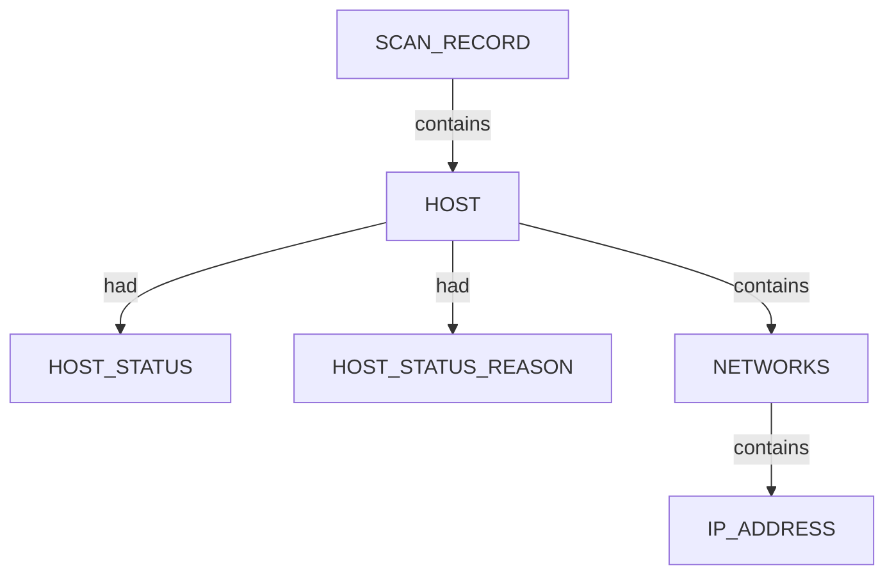
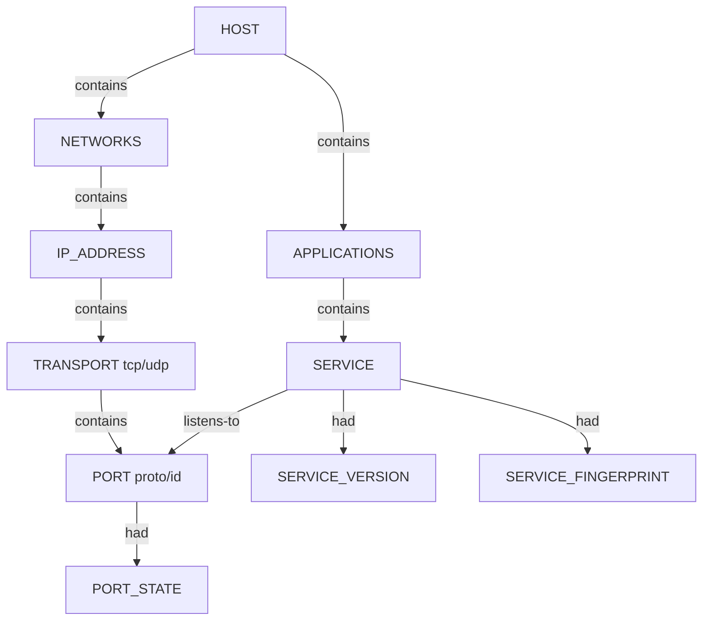
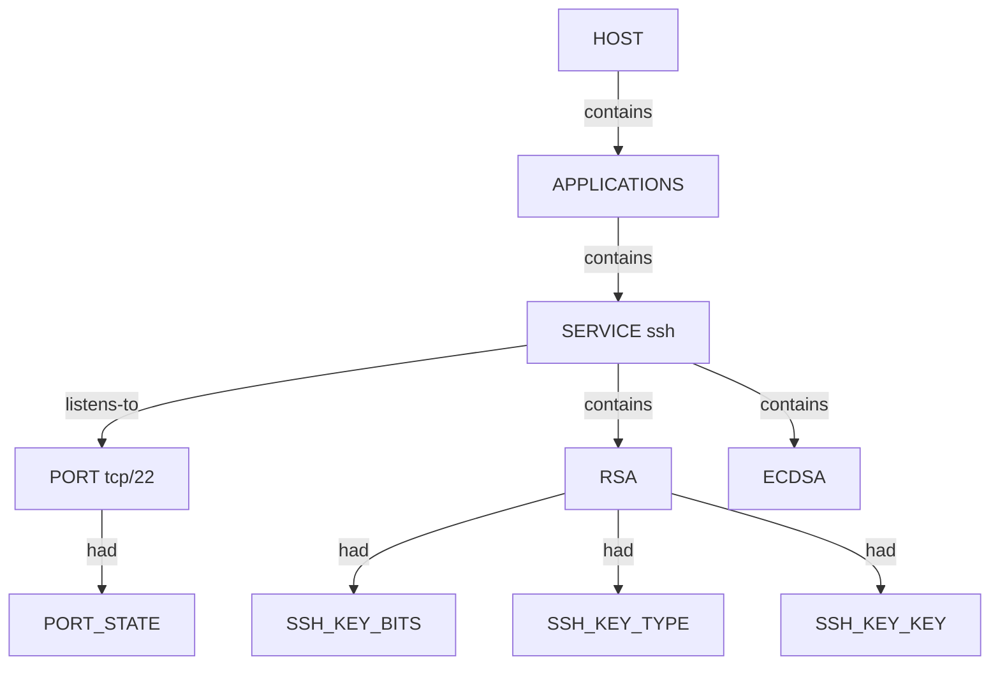
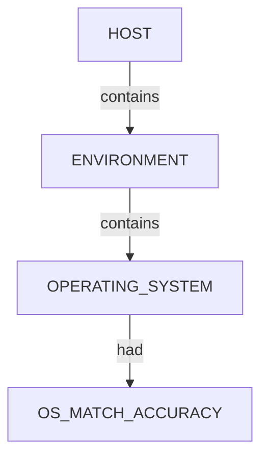
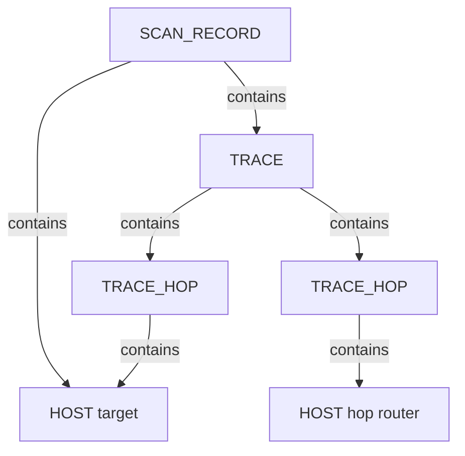

# Nmap — proposed nugget graph structure

Ontology source: `.seed/05_Onotology_for_Nuggets.md` (§2.3, §2.6 host status, §2.7 trace semantics; SSH keys via `nuggets_extension.json`).

Generator: `.seed/scripts/cli_corpus/nmap_xml_to_graph.py`

Artifacts: `nmap_<scenario_key>_proposed_nuggets_edges.json` and narrative `*_description.md` in this directory.

## Narrative reports (§4.3)

Graph JSON is converted to readable OSINT Markdown by `.seed/scripts/cli_corpus/narrative_report.py` via `describe_graph()` in the Nmap generator. The report follows scan → hosts (environment, networks, applications, vulnerabilities) → trace (Mermaid hop diagram) → appendix. Every nugget value must appear in prose or the inventory table; `validate_narrative_coverage()` enforces this in tests.

Operator handoff and gold-standard sample: [nmap_narrative_report_handoff.md](./nmap_narrative_report_handoff.md) · capstone narrative: [nmap_capstone_permissive_proposed_nuggets_edges_description.md](./nmap_capstone_permissive_proposed_nuggets_edges_description.md)

## Scan head

Every graph has one `SCAN_RECORD` entity with scan descriptors (`SCAN_CLI`, `SCAN_TARGET`, `SCAN_VERSION`, `SCAN_START`, `SCAN_SUMMARY`, …) linked via `had`. Discovered hosts link from scan via `contains`.

## Host tree (all scenarios)

`HOST` canonical key is the primary IPv4 address (or first address). `INTERNET_NAME` descriptors attach to `HOST` when Nmap reports hostnames.

## Port and service tree (port scans)

- `PORT_STATE` values include `open`, `filtered`, `closed`, `open|filtered` (UDP).
- `listens-to` links each `SERVICE` to its `PORT` whenever Nmap reports a `<service name="…">` on that port (including filtered/table-derived names).
- `SERVICE_VERSION` carries `product` + `version`; `SERVICE_FINGERPRINT` carries the Nmap `servicefp` attribute when present.
- Legacy flat `TCP_PORT_OPEN` maps to `PORT` + `PORT_STATE=open` + `SERVICE` `listens-to` in this hierarchy.

## SSH service and host keys (APPLICATIONS branch)

When Nmap runs the `ssh-hostkey` NSE script against an open SSH port, the graph extends the **APPLICATIONS** branch: the host still `contains` the `APPLICATIONS` category, which `contains` one `SERVICE` per listening application. For SSH, that service `listens-to` the open `PORT` (typically TCP/22) and `contains` one **SSH key sub-entity** per host key returned (for example `RSA`, `ECDSA`, `EDDSA`, or `DSA`). Each key node carries descriptors for bit length, algorithm type, and the public key material.

- `APPLICATIONS` is a **category** nugget under `HOST`; individual `SERVICE` entities (HTTP, SSH, SMTP, …) sit inside it.
- Only the SSH `SERVICE` on an open port receives keys; other services in the same category follow the same `contains` / `listens-to` pattern without key children.
- Key `nugget_id` is the algorithm family (`RSA`, `ECDSA`, `EDDSA`, `DSA`); `nugget_data` is the key fingerprint from Nmap.
- Multiple keys on one service are normal (for example RSA and ECDSA on the same host); each is a sibling `SUBENTITY` under the same `SERVICE`.
- Descriptors on each key: `SSH_KEY_BITS`, `SSH_KEY_TYPE`, `SSH_KEY_KEY` (public key blob when present).

## OS fingerprint (`-A` / OS detection)

Best `osmatch` by accuracy is selected when multiple matches exist.

## Traceroute trace (host-to-host path)

Nmap records hop IPs in XML; the graph models **hosts** along the path (§2.7).

Each `TRACE_HOP` carries `HOP_ORDER`, `HOP_TTL`, `HOP_RTT`. The final hop reuses the target `HOST` node when IPs match.

## Scenario coverage

| Scenario key | Primary structures |
|--------------|-------------------|
| `host_discovery_permissive` | SCAN + HOST + HOST_STATUS |
| `host_discovery_corporate` | Same (bbc.co.uk) |
| `host_discovery_local_subnet` | SCAN + multiple HOST |
| `tcp_top_ports_permissive` | HOST + PORT/SERVICE (open TCP) |
| `tcp_top_ports_corporate` | HOST + filtered extraports pattern |
| `tcp_top_ports_local` | Multiple hosts, sparse ports |
| `service_version_permissive` | SERVICE + SERVICE_VERSION + CPE |
| `os_aggressive_permissive` | ENVIRONMENT + OS + TRACE |
| `nse_default_permissive` | SERVICE + script-heavy ports; SSH keys when `ssh-hostkey` fires |
| `udp_top_permissive` | UDP PORT_STATE variants |
| `traceroute_permissive` | TRACE host chain |
| `skip_ping_permissive` | HOST without prior ping semantics |
| `capstone_permissive` | Combined rich scan; often includes SSH keys on port 22 |
| `service_version_corporate` | Corporate service fingerprint |
| `windows_enrich_local` | Local Windows enrichment |

## Field mapping (XML → nugget)

| XML path | Nugget |
|----------|--------|
| `nmaprun@args` | `SCAN_CLI` |
| `host/status@state` | `HOST_STATUS` on `HOST` |
| `host/status@reason` | `HOST_STATUS_REASON` |
| `address@addr` | `IP_ADDRESS` under `NETWORKS` |
| `hostname@name` | `INTERNET_NAME` on `HOST` |
| `port/state@state` | `PORT_STATE` |
| `service@product` + `@version` | `SERVICE_VERSION` |
| `service@servicefp` | `SERVICE_FINGERPRINT` |
| `service@extrainfo` | `SERVICE_EXTRAINFO` |
| `service/cpe` | `CPE_URL` |
| `script@id=ssh-hostkey` / table `@key=type` | SSH key `SUBENTITY` type (`RSA`, `ECDSA`, `EDDSA`, `DSA`) |
| `ssh-hostkey` table `fingerprint` | Key node `nugget_data` (canonical instance key) |
| `ssh-hostkey` table `bits` | `SSH_KEY_BITS` on key node |
| `ssh-hostkey` table `type` | `SSH_KEY_TYPE` on key node |
| `ssh-hostkey` table `key` | `SSH_KEY_KEY` on key node |
| `os/osmatch@name` | `OPERATING_SYSTEM` |
| `trace@proto` | `TRACE_PROTOCOL` |
| `trace/hop@ttl` | `HOP_TTL` |
| `trace/hop@rtt` | `HOP_RTT` |
| `trace/hop@ipaddr` | `IP_ADDRESS` under hop `HOST` |

## Review notes

- Relations use ontology vocabulary: `contains`, `had`, `listens-to` (not `has`, `listens on`, `discovered`).
- NSE script output is not fully decomposed in v1 proposals; port/service nodes carry primary facts.
- `extraports` aggregate filtered counts are not expanded to individual port nodes.
