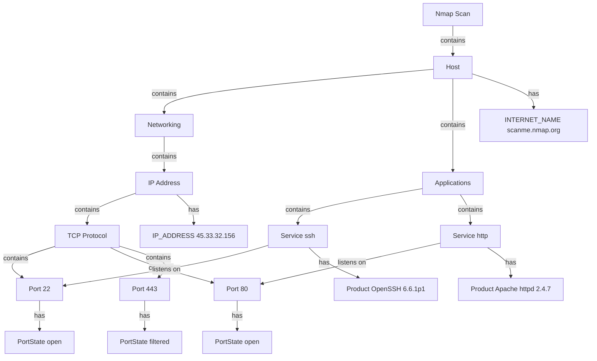

# Nmap — Proposed Nugget Graph Structure

**Source examination:** `app_examination_docs/nmap/6_output_structured.xml` (service version, scanme.nmap.org)  
**Review status:** `pending`  
**Output path type:** 1 (XML + text)

## Graph overview

## XML → nugget mapping rules

| XML path | Nugget / entity | Relation |
|----------|-----------------|----------|
| `nmaprun@args` | Scan attribute `command` | scan `has` |
| `host/address[@addrtype=ipv4]` | `IP_ADDRESS` | networking `contains` |
| `hostnames/hostname` | `INTERNET_NAME` | host `has` |
| `port[@protocol=tcp]` entity | Port under TCP protocol | protocol `contains` |
| `port/state[@state=open]` | `TCP_PORT_OPEN` + PortState | port `has` state |
| `port/state[@state=filtered]` | PortState only (not TCP_PORT_OPEN) | port `has` |
| `service[@name]` | Service entity | application `contains` |
| `service/@product`, `@version` | `SOFTWARE_USED` | service `has` |
| `service/cpe` | CPE string attribute | service `has` |
| `os/osmatch` | `OPERATING_SYSTEM` | host `contains` (when present) |
| `script` (NSE) | `VULNERABILITY_GENERAL`, `WEB_ANALYTICS_ID`, etc. | case-by-case |

## Transitive rules applied

- Host `contains` IPAddress (via Networking container).
- Host `listens on` Port when state is `open` (even though Service is intermediate).
- Scan `contains` each discovered Host.

## Permissive vs corporate variance

| Signal | scanme.nmap.org (exam 6) | bbc.co.uk (exam 11) |
|--------|--------------------------|---------------------|
| Open TCP ports | 22, 80 open | Typically fewer / none in top-10 |
| Version strings | Present on open ports | Often absent when filtered |
| NSE richness | High (exam 8) | Lower on hardened targets |

Use `clean_miss` at scan level when no qualifying entities are extracted (corporate host discovery may still yield IP + hostname only).

## New / abstract nuggets suggested

| ID | Type | Role |
|----|------|------|
| `networking` | ENTITY (abstract) | Groups IP, protocol, trace |
| `application` | ENTITY (abstract) | Groups services |
| `clean_miss` | DESCRIPTOR | Scan finished, no target intel |

Add to `.docs/analysis/nugget_structure/` before aggregating into `nuggets.json`.

## Follow-up (pass 2)

- OS detection graph branch (`-O`)
- UDP port branch (`-sU`)
- NSE script output subgraph (exam 8) — vulnerabilities, HTTP headers, analytics
- Traceroute `Trace` entity linking hosts

## Operator review

- [ ] Approve hierarchy (Host → Networking → IP → Protocol → Port)
- [ ] Approve filtered-port semantics (no TCP_PORT_OPEN)
- [ ] Approve NSE mapping deferral to pass 2
