# Nmap scan narrative — `os_aggressive_permissive`

## Introduction

This report narrates findings from a Nmap scan. The story follows the scan record, each discovered host (networks, applications, environment), and any traceroute path. This report follows Scan → Host/System/Organisation/Domain (categories) → Trace → Appendix. Overview diagrams show ontology types and relations; category diagrams show a few example values with the rest in tables; the appendix inventories every node and edge.

## Scan

Every examination has one SCAN_RECORD with scan descriptors linked via had. This scan includes **1** Scan root node(s) (e.g. `nmap:scanme.nmap.org:Tue Jun 23 19:01:10 2026`). Linked structures: `SCAN_CLI`, `SCAN_VERSION`, `SCAN_START`, `SCAN_TARGET`, `SCAN_SUMMARY`, `SCAN_ELAPSED`.

### Structure overview

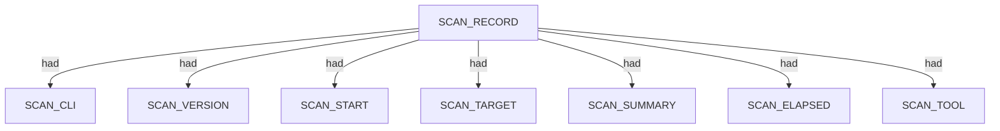

### Scan descriptors

| Nugget | Value |
| --- | --- |
| `SCAN_RECORD` | `nmap:scanme.nmap.org:Tue Jun 23 19:01:10 2026` |

## Host

Qualified HOST endpoints own category trees for networks, applications, environment, and security findings. This scan includes **8** Host root node(s) (e.g. `45.33.32.156`, `203.134.80.60`, `203.134.80.236`). Linked structures: `NETWORKS`, `APPLICATIONS`, `ENVIRONMENT`.

### Structure overview

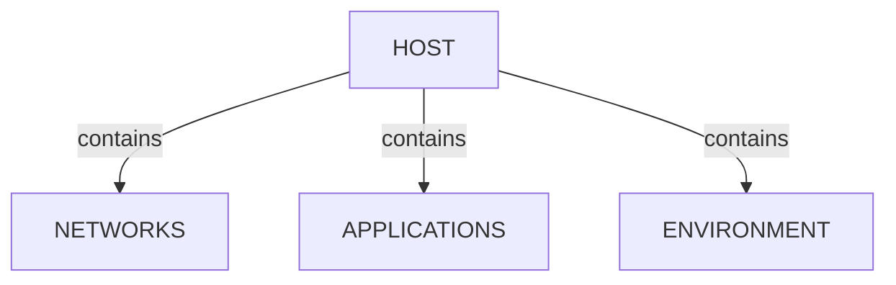

### `NETWORKS`

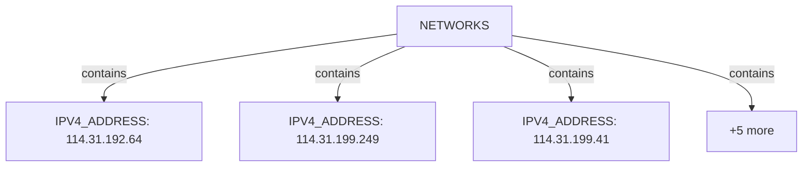

| Nugget | Value |
| --- | --- |
| `IPV4_ADDRESS` | `114.31.192.64` |
| `IPV4_ADDRESS` | `114.31.199.249` |
| `IPV4_ADDRESS` | `114.31.199.41` |
| `IPV4_ADDRESS` | `175.45.103.109` |
| `IPV4_ADDRESS` | `203.134.80.236` |
| `IPV4_ADDRESS` | `203.134.80.60` |
| `IPV4_ADDRESS` | `206.223.116.196` |
| `IPV4_ADDRESS` | `45.33.32.156` |

### `APPLICATIONS`

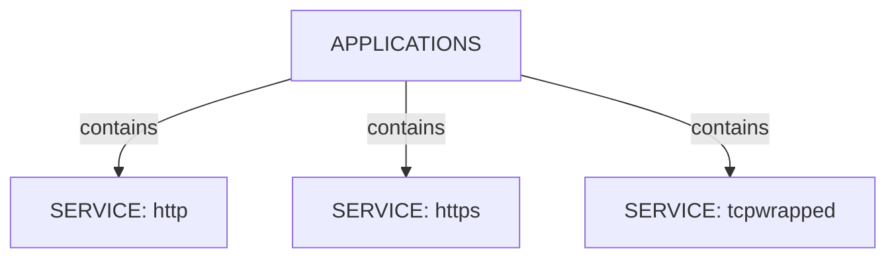

| Nugget | Value |
| --- | --- |
| `SERVICE` | `http` |
| `SERVICE` | `https` |
| `SERVICE` | `tcpwrapped` |

### `ENVIRONMENT`

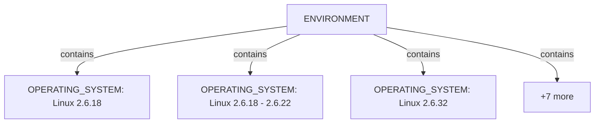

| Nugget | Value |
| --- | --- |
| `OPERATING_SYSTEM` | `Linux 2.6.18` |
| `OPERATING_SYSTEM` | `Linux 2.6.18 - 2.6.22` |
| `OPERATING_SYSTEM` | `Linux 2.6.32` |
| `OPERATING_SYSTEM` | `Linux 2.6.5` |
| `OPERATING_SYSTEM` | `Linux 2.6.9` |
| `OPERATING_SYSTEM` | `Linux 2.6.9 - 2.6.18` |
| `OPERATING_SYSTEM` | `Linux 3.2.0` |
| `OPERATING_SYSTEM` | `MikroTik RouterOS 6.15 (Linux 3.3.5)` |
| `OPERATING_SYSTEM` | `OpenWrt Kamikaze 7.09 (Linux 2.6.22)` |
| `OPERATING_SYSTEM` | `Tomato 1.27 - 1.28 (Linux 2.4.20)` |

### `VULNERABILITIES`

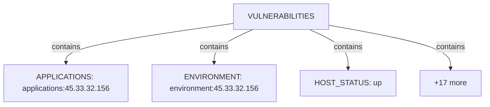

| Nugget | Value |
| --- | --- |
| `APPLICATIONS` | `applications:45.33.32.156` |
| `ENVIRONMENT` | `environment:45.33.32.156` |
| `HOST_STATUS` | `up` |
| `HOST_STATUS_REASON` | `echo-reply` |
| `INTERNET_NAME` | `ae10-100.edg01.alexeqn.nsw.vocus.network` |
| `INTERNET_NAME` | `be101.bdr01.sjc02.ca.us.vocus.network` |
| `INTERNET_NAME` | `be106-99.bdr01.syd14.nsw.vocus.network` |
| `INTERNET_NAME` | `be158.cor01.syd11.nsw.vocus.network` |
| `INTERNET_NAME` | `be202.bdr04.sjc01.ca.us.vocus.network` |
| `INTERNET_NAME` | `eqix-sv1.linode.com` |
| `INTERNET_NAME` | `lo0-33.bng71.alexeqn.nsw.vocus.network` |
| `INTERNET_NAME` | `scanme.nmap.org` |
| `NETWORKS` | `networks:114.31.192.64` |
| `NETWORKS` | `networks:114.31.199.249` |
| `NETWORKS` | `networks:114.31.199.41` |
| `NETWORKS` | `networks:175.45.103.109` |
| `NETWORKS` | `networks:203.134.80.236` |
| `NETWORKS` | `networks:203.134.80.60` |
| `NETWORKS` | `networks:206.223.116.196` |
| `NETWORKS` | `networks:45.33.32.156` |

### `SECURITY`

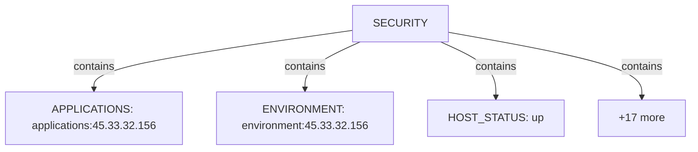

| Nugget | Value |
| --- | --- |
| `APPLICATIONS` | `applications:45.33.32.156` |
| `ENVIRONMENT` | `environment:45.33.32.156` |
| `HOST_STATUS` | `up` |
| `HOST_STATUS_REASON` | `echo-reply` |
| `INTERNET_NAME` | `ae10-100.edg01.alexeqn.nsw.vocus.network` |
| `INTERNET_NAME` | `be101.bdr01.sjc02.ca.us.vocus.network` |
| `INTERNET_NAME` | `be106-99.bdr01.syd14.nsw.vocus.network` |
| `INTERNET_NAME` | `be158.cor01.syd11.nsw.vocus.network` |
| `INTERNET_NAME` | `be202.bdr04.sjc01.ca.us.vocus.network` |
| `INTERNET_NAME` | `eqix-sv1.linode.com` |
| `INTERNET_NAME` | `lo0-33.bng71.alexeqn.nsw.vocus.network` |
| `INTERNET_NAME` | `scanme.nmap.org` |
| `NETWORKS` | `networks:114.31.192.64` |
| `NETWORKS` | `networks:114.31.199.249` |
| `NETWORKS` | `networks:114.31.199.41` |
| `NETWORKS` | `networks:175.45.103.109` |
| `NETWORKS` | `networks:203.134.80.236` |
| `NETWORKS` | `networks:203.134.80.60` |
| `NETWORKS` | `networks:206.223.116.196` |
| `NETWORKS` | `networks:45.33.32.156` |

## Services and ports

APPLICATION services listen-to PORT entities under NETWORKS/TRANSPORT. This scan includes **3** Services and ports root node(s) (e.g. `tcpwrapped`, `http`, `https`). Linked structures: no child categories.

### Structure overview

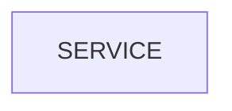

### Values

| Nugget | Value |
| --- | --- |
| `SERVICE` | `http` |
| `SERVICE` | `https` |
| `SERVICE` | `tcpwrapped` |

## Environment

ENVIRONMENT under HOST contains OPERATING_SYSTEM with optional match accuracy. This scan includes **1** Environment root node(s) (e.g. `environment:45.33.32.156`). Linked structures: `OPERATING_SYSTEM`.

### Structure overview

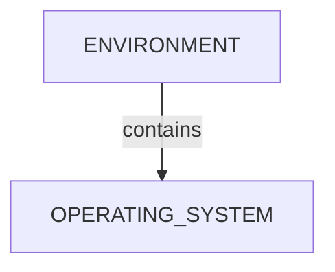

### `OPERATING_SYSTEM`

| Nugget | Value |
| --- | --- |
| `OPERATING_SYSTEM` | `Linux 2.6.18` |
| `OPERATING_SYSTEM` | `Linux 2.6.18 - 2.6.22` |
| `OPERATING_SYSTEM` | `Linux 2.6.32` |
| `OPERATING_SYSTEM` | `Linux 2.6.5` |
| `OPERATING_SYSTEM` | `Linux 2.6.9` |
| `OPERATING_SYSTEM` | `Linux 2.6.9 - 2.6.18` |
| `OPERATING_SYSTEM` | `Linux 3.2.0` |
| `OPERATING_SYSTEM` | `MikroTik RouterOS 6.15 (Linux 3.3.5)` |
| `OPERATING_SYSTEM` | `OpenWrt Kamikaze 7.09 (Linux 2.6.22)` |
| `OPERATING_SYSTEM` | `Tomato 1.27 - 1.28 (Linux 2.4.20)` |

## Trace

TRACE sits under the scan with ordered TRACE_HOP nodes; each hop may contain a HOST router. This scan includes **1** Trace root node(s) (e.g. `45.33.32.156:icmp`). Linked structures: `TRACE_HOP`.

### Structure overview

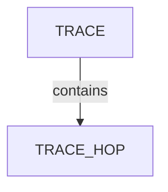

### `TRACE_HOP`

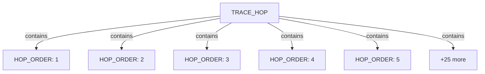

| Nugget | Value |
| --- | --- |
| `HOP_ORDER` | `1` |
| `HOP_ORDER` | `2` |
| `HOP_ORDER` | `3` |
| `HOP_ORDER` | `4` |
| `HOP_ORDER` | `5` |
| `HOP_ORDER` | `6` |
| `HOP_ORDER` | `7` |
| `HOP_ORDER` | `8` |
| `HOP_RTT` | `152.00` |
| `HOP_RTT` | `153.00` |
| `HOP_RTT` | `154.00` |
| `HOP_RTT` | `155.00` |
| `HOP_RTT` | `8.00` |
| `HOP_RTT` | `9.00` |
| `HOP_TTL` | `13` |
| `HOP_TTL` | `2` |
| `HOP_TTL` | `4` |
| `HOP_TTL` | `5` |
| `HOP_TTL` | `6` |
| `HOP_TTL` | `7` |
| `HOP_TTL` | `8` |
| `HOP_TTL` | `9` |
| `HOST` | `114.31.192.64` |
| `HOST` | `114.31.199.249` |
| `HOST` | `114.31.199.41` |
| `HOST` | `175.45.103.109` |
| `HOST` | `203.134.80.236` |
| `HOST` | `203.134.80.60` |
| `HOST` | `206.223.116.196` |
| `HOST` | `45.33.32.156` |

## Conclusion

See the appendix for the full node and edge inventory.

## Appendix

### Nodes

| Nugget | Value |
| --- | --- |
| `ACCURACY` | `89` |
| `ACCURACY` | `90` |
| `ACCURACY` | `91` |
| `ACCURACY` | `94` |
| `APPLICATIONS` | `applications:45.33.32.156` |
| `CPE_URL` | `cpe:/a:apache:http_server:2.4.7` |
| `CPE_URL` | `cpe:/o:linux:linux_kernel:2.4.20` |
| `CPE_URL` | `cpe:/o:linux:linux_kernel:2.6` |
| `CPE_URL` | `cpe:/o:linux:linux_kernel:2.6.18` |
| `CPE_URL` | `cpe:/o:linux:linux_kernel:2.6.22` |
| `CPE_URL` | `cpe:/o:linux:linux_kernel:2.6.32` |
| `CPE_URL` | `cpe:/o:linux:linux_kernel:2.6.5` |
| `CPE_URL` | `cpe:/o:linux:linux_kernel:2.6.9` |
| `CPE_URL` | `cpe:/o:linux:linux_kernel:3.2.0` |
| `CPE_URL` | `cpe:/o:mikrotik:routeros:6.15` |
| `DSA` | `ac00a01a82ffcc5599dc672b34976b75` |
| `ECDSA` | `9602bb5e57541c4e452f564c4a24b257` |
| `EDDSA` | `33fa910fe0e17b1f6d05a2b0f1544156` |
| `ENVIRONMENT` | `environment:45.33.32.156` |
| `HOP_ORDER` | `1` |
| `HOP_ORDER` | `2` |
| `HOP_ORDER` | `3` |
| `HOP_ORDER` | `4` |
| `HOP_ORDER` | `5` |
| `HOP_ORDER` | `6` |
| `HOP_ORDER` | `7` |
| `HOP_ORDER` | `8` |
| `HOP_RTT` | `152.00` |
| `HOP_RTT` | `153.00` |
| `HOP_RTT` | `154.00` |
| `HOP_RTT` | `155.00` |
| `HOP_RTT` | `8.00` |
| `HOP_RTT` | `9.00` |
| `HOP_TTL` | `13` |
| `HOP_TTL` | `2` |
| `HOP_TTL` | `4` |
| `HOP_TTL` | `5` |
| `HOP_TTL` | `6` |
| `HOP_TTL` | `7` |
| `HOP_TTL` | `8` |
| `HOP_TTL` | `9` |
| `HOST` | `114.31.192.64` |
| `HOST` | `114.31.199.249` |
| `HOST` | `114.31.199.41` |
| `HOST` | `175.45.103.109` |
| `HOST` | `203.134.80.236` |
| `HOST` | `203.134.80.60` |
| `HOST` | `206.223.116.196` |
| `HOST` | `45.33.32.156` |
| `HOST_STATUS` | `up` |
| `HOST_STATUS_REASON` | `echo-reply` |
| `HTTP_TITLE` | `Go ahead and ScanMe!` |
| `INTERNET_NAME` | `ae10-100.edg01.alexeqn.nsw.vocus.network` |
| `INTERNET_NAME` | `be101.bdr01.sjc02.ca.us.vocus.network` |
| `INTERNET_NAME` | `be106-99.bdr01.syd14.nsw.vocus.network` |
| `INTERNET_NAME` | `be158.cor01.syd11.nsw.vocus.network` |
| `INTERNET_NAME` | `be202.bdr04.sjc01.ca.us.vocus.network` |
| `INTERNET_NAME` | `eqix-sv1.linode.com` |
| `INTERNET_NAME` | `lo0-33.bng71.alexeqn.nsw.vocus.network` |
| `INTERNET_NAME` | `scanme.nmap.org` |
| `IPV4_ADDRESS` | `114.31.192.64` |
| `IPV4_ADDRESS` | `114.31.199.249` |
| `IPV4_ADDRESS` | `114.31.199.41` |
| `IPV4_ADDRESS` | `175.45.103.109` |
| `IPV4_ADDRESS` | `203.134.80.236` |
| `IPV4_ADDRESS` | `203.134.80.60` |
| `IPV4_ADDRESS` | `206.223.116.196` |
| `IPV4_ADDRESS` | `45.33.32.156` |
| `NETWORKS` | `networks:114.31.192.64` |
| `NETWORKS` | `networks:114.31.199.249` |
| `NETWORKS` | `networks:114.31.199.41` |
| `NETWORKS` | `networks:175.45.103.109` |
| `NETWORKS` | `networks:203.134.80.236` |
| `NETWORKS` | `networks:203.134.80.60` |
| `NETWORKS` | `networks:206.223.116.196` |
| `NETWORKS` | `networks:45.33.32.156` |
| `OPERATING_SYSTEM` | `Linux 2.6.18` |
| `OPERATING_SYSTEM` | `Linux 2.6.18 - 2.6.22` |
| `OPERATING_SYSTEM` | `Linux 2.6.32` |
| `OPERATING_SYSTEM` | `Linux 2.6.5` |
| `OPERATING_SYSTEM` | `Linux 2.6.9` |
| `OPERATING_SYSTEM` | `Linux 2.6.9 - 2.6.18` |
| `OPERATING_SYSTEM` | `Linux 3.2.0` |
| `OPERATING_SYSTEM` | `MikroTik RouterOS 6.15 (Linux 3.3.5)` |
| `OPERATING_SYSTEM` | `OpenWrt Kamikaze 7.09 (Linux 2.6.22)` |
| `OPERATING_SYSTEM` | `Tomato 1.27 - 1.28 (Linux 2.4.20)` |
| `OS_FAMILY` | `Linux` |
| `OS_FAMILY` | `RouterOS` |
| `OS_GEN` | `2.4.X` |
| `OS_GEN` | `2.6.X` |
| `OS_GEN` | `3.X` |
| `OS_GEN` | `6.X` |
| `OS_TYPE` | `WAP` |
| `OS_TYPE` | `general purpose` |
| `OS_TYPE` | `router` |
| `OS_VENDOR` | `Linux` |
| `OS_VENDOR` | `MikroTik` |
| `PORT` | `22` |
| `PORT` | `36975` |
| `PORT` | `443` |
| `PORT` | `80` |
| `PORT_PROTOCOL` | `tcp` |
| `PORT_PROTOCOL` | `udp` |
| `PORT_SOURCE` | `os_probe` |
| `PORT_STATE` | `closed` |
| `PORT_STATE` | `filtered` |
| `PORT_STATE` | `open` |
| `PORT_STATE_REASON` | `no-response` |
| `PORT_STATE_REASON` | `syn-ack` |
| `RSA` | `203d2d44622ab05a9db5b30514c2a6b2` |
| `SCAN_CLI` | `nmap -sT -A -T3 -p 22,80,443 -oX - scanme.nmap.org` |
| `SCAN_ELAPSED` | `25.71` |
| `SCAN_RECORD` | `nmap:scanme.nmap.org:Tue Jun 23 19:01:10 2026` |
| `SCAN_START` | `Tue Jun 23 19:01:10 2026` |
| `SCAN_SUMMARY` | `Nmap done at Tue Jun 23 19:01:35 2026; 1 IP address (1 host up) scanned in 25.71 seconds` |
| `SCAN_TARGET` | `scanme.nmap.org` |
| `SCAN_TOOL` | `nmap` |
| `SCAN_VERSION` | `7.80` |
| `SERVICE` | `http` |
| `SERVICE` | `https` |
| `SERVICE` | `tcpwrapped` |
| `SERVICE_EXTRAINFO` | `(Ubuntu)` |
| `SERVICE_VERSION` | `Apache httpd 2.4.7` |
| `SSH_KEY_BITS` | `1024` |
| `SSH_KEY_BITS` | `2048` |
| `SSH_KEY_BITS` | `256` |
| `SSH_KEY_KEY` | `AAAAB3NzaC1kc3MAAACBAOe8o59vFWZGaBmGPVeJBObEfi1AR8yEUYC/Ufkku3sKhGF7wM2m2ujIeZDK5vqeC0S5EN2xYo6FshCP4FQRYeTxD17nNO4PhwW65qAjDRRU0uHFfSAh5wk+vt4yQztOE++sTd1G9OBLzA8HO99qDmCAxb3zw+GQDEgPjzgyzGZ3AAAAFQCBmE1vROP8IaPkUmhM5xLFta/xHwAAAIEA3EwRfaeOPLL7TKDgGX67Lbkf9UtdlpCdC4doMjGgsznYMwWH6a7Lj3vi4/KmeZZdix6FMdFqq+2vrfT1DRqx0RS0XYdGxnkgS+2g333WYCrUkDCn6RPUWR/1TgGMPHCj7LWCa1ZwJwLWS2KX288Pa2gLOWuhZm2VYKSQx6NEDOIAAACBANxIfprSdBdbo4Ezrh6/X6HSvrhjtZ7MouStWaE714ByO5bS2coM9CyaCwYyrE5qzYiyIfb+1BG3O5nVdDuN95sQ/0bAdBKlkqLFvFqFjVbETF0ri3v97w6MpUawfF75ouDrQ4xdaUOLLEWTso6VFJcM6Jg9bDl0FA0uLZUSDEHL` |
| `SSH_KEY_KEY` | `AAAAB3NzaC1yc2EAAAADAQABAAABAQC6afooTZ9mVUGFNEhkMoRR1Btzu64XXwElhCsHw/zVlIx/HXylNbb9+11dm2VgJQ21pxkWDs+L6+EbYyDnvRURTrMTgHL0xseB0EkNqexs9hYZSiqtMx4jtGNtHvsMxZnbxvVUk2dasWvtBkn8J5JagSbzWTQo4hjKMOI1SUlXtiKxAs2F8wiq2EdSuKw/KNk8GfIp1TA+8ccGeAtnsVptTJ4D/8MhAWsROkQzOowQvnBBz2/8ecEvoMScaf+kDfNQowK3gENtSSOqYw9JLOza6YJBPL/aYuQQ0nJ74Rr5vL44aNIlrGI9jJc2x0bV7BeNA5kVuXsmhyfWbbkB8yGd` |
| `SSH_KEY_KEY` | `AAAAC3NzaC1lZDI1NTE5AAAAILzVjfIyIHfXyRd8jVBaVT8Yvk/UvHh5Afvho8sGciG7` |
| `SSH_KEY_KEY` | `AAAAE2VjZHNhLXNoYTItbmlzdHAyNTYAAAAIbmlzdHAyNTYAAABBBMD46g67x6yWNjjQJnXhiz/TskHrqQ0uPcOspFrIYW382uOGzmWDZCFV8FbFwQyH90u+j0Qr1SGNAxBZMhOQ8pc=` |
| `SSH_KEY_TYPE` | `ecdsa-sha2-nistp256` |
| `SSH_KEY_TYPE` | `ssh-dss` |
| `SSH_KEY_TYPE` | `ssh-ed25519` |
| `SSH_KEY_TYPE` | `ssh-rsa` |
| `TRACE` | `45.33.32.156:icmp` |
| `TRACE_HOP` | `114.31.192.64` |
| `TRACE_HOP` | `114.31.199.249` |
| `TRACE_HOP` | `114.31.199.41` |
| `TRACE_HOP` | `175.45.103.109` |
| `TRACE_HOP` | `203.134.80.236` |
| `TRACE_HOP` | `203.134.80.60` |
| `TRACE_HOP` | `206.223.116.196` |
| `TRACE_HOP` | `45.33.32.156` |
| `TRACE_PROTOCOL` | `icmp` |
| `TRANSPORT` | `tcp` |
| `TRANSPORT` | `udp` |

### Edges

| Source | Relation | Target |
| --- | --- | --- |
| `SCAN_RECORD` | `had` | `SCAN_CLI` |
| `SCAN_RECORD` | `had` | `SCAN_VERSION` |
| `SCAN_RECORD` | `had` | `SCAN_START` |
| `SCAN_RECORD` | `had` | `SCAN_TARGET` |
| `SCAN_RECORD` | `had` | `SCAN_SUMMARY` |
| `SCAN_RECORD` | `had` | `SCAN_ELAPSED` |
| `SCAN_RECORD` | `had` | `SCAN_TOOL` |
| `SCAN_RECORD` | `contains` | `HOST` |
| `HOST` | `had` | `HOST_STATUS` |
| `HOST` | `had` | `HOST_STATUS_REASON` |
| `HOST` | `had` | `INTERNET_NAME` |
| `HOST` | `contains` | `NETWORKS` |
| `NETWORKS` | `contains` | `IPV4_ADDRESS` |
| `HOST` | `contains` | `APPLICATIONS` |
| `IPV4_ADDRESS` | `contains` | `TRANSPORT` |
| `TRANSPORT` | `contains` | `PORT` |
| `PORT` | `had` | `PORT_STATE` |
| `PORT` | `had` | `PORT_STATE_REASON` |
| `PORT` | `had` | `PORT_PROTOCOL` |
| `APPLICATIONS` | `contains` | `SERVICE` |
| `SERVICE` | `listens-to` | `PORT` |
| `SERVICE` | `contains` | `DSA` |
| `DSA` | `had` | `SSH_KEY_BITS` |
| `DSA` | `had` | `SSH_KEY_TYPE` |
| `DSA` | `had` | `SSH_KEY_KEY` |
| `SERVICE` | `contains` | `RSA` |
| `RSA` | `had` | `SSH_KEY_BITS` |
| `RSA` | `had` | `SSH_KEY_TYPE` |
| `RSA` | `had` | `SSH_KEY_KEY` |
| `SERVICE` | `contains` | `ECDSA` |
| `ECDSA` | `had` | `SSH_KEY_BITS` |
| `ECDSA` | `had` | `SSH_KEY_TYPE` |
| `ECDSA` | `had` | `SSH_KEY_KEY` |
| `SERVICE` | `contains` | `EDDSA` |
| `EDDSA` | `had` | `SSH_KEY_BITS` |
| `EDDSA` | `had` | `SSH_KEY_TYPE` |
| `EDDSA` | `had` | `SSH_KEY_KEY` |
| `SERVICE` | `had` | `SERVICE_VERSION` |
| `SERVICE` | `had` | `SERVICE_EXTRAINFO` |
| `SERVICE` | `contains` | `CPE_URL` |
| `SERVICE` | `had` | `HTTP_TITLE` |
| `HOST` | `contains` | `ENVIRONMENT` |
| `ENVIRONMENT` | `contains` | `OPERATING_SYSTEM` |
| `OPERATING_SYSTEM` | `had` | `OS_TYPE` |
| `OPERATING_SYSTEM` | `had` | `OS_VENDOR` |
| `OPERATING_SYSTEM` | `had` | `OS_FAMILY` |
| `OPERATING_SYSTEM` | `had` | `ACCURACY` |
| `OPERATING_SYSTEM` | `had` | `OS_GEN` |
| `OPERATING_SYSTEM` | `contains` | `CPE_URL` |
| `PORT` | `had` | `PORT_SOURCE` |
| `OPERATING_SYSTEM` | `listens-to` | `PORT` |
| `SCAN_RECORD` | `contains` | `TRACE` |
| `TRACE` | `had` | `TRACE_PROTOCOL` |
| `TRACE` | `contains` | `TRACE_HOP` |
| `TRACE_HOP` | `had` | `HOP_TTL` |
| `TRACE_HOP` | `had` | `HOP_RTT` |
| `TRACE_HOP` | `had` | `HOP_ORDER` |
| `TRACE_HOP` | `contains` | `HOST` |
---

*OS-Intel Scan*
