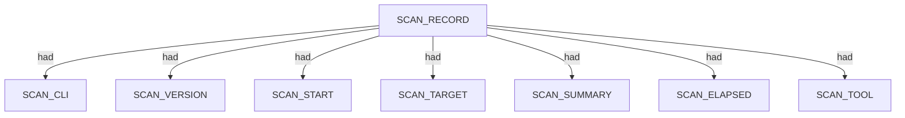
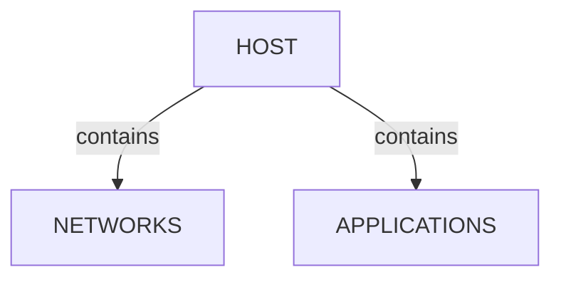
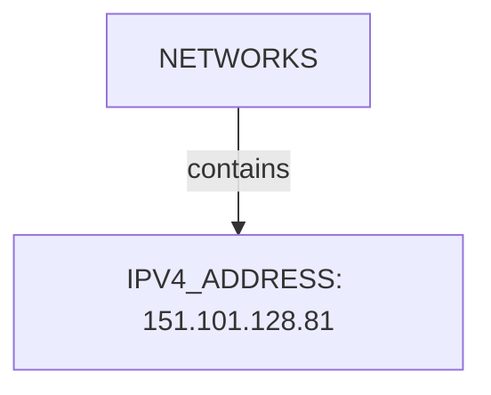
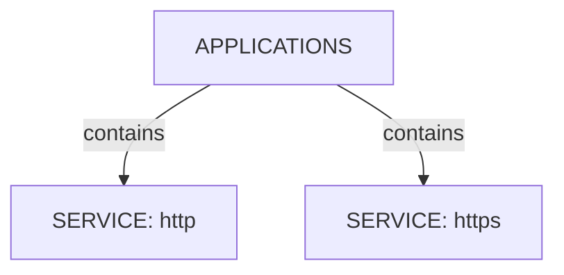
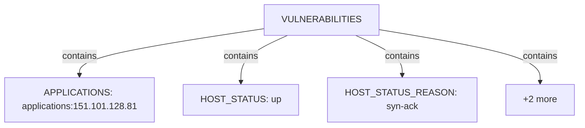
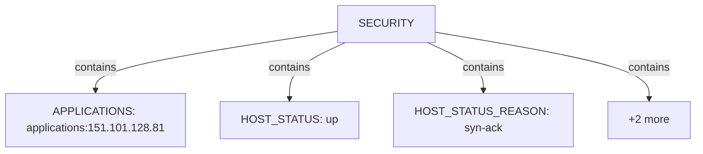

# Nmap scan narrative — `service_version_corporate`

## Introduction

This report narrates findings from a Nmap scan. The story follows the scan record, each discovered host (networks, applications, environment), and any traceroute path. This report follows Scan → Host/System/Organisation/Domain (categories) → Trace → Appendix. Overview diagrams show ontology types and relations; category diagrams show a few example values with the rest in tables; the appendix inventories every node and edge.

## Scan

Every examination has one SCAN_RECORD with scan descriptors linked via had. This scan includes **1** Scan root node(s) (e.g. `nmap:bbc.co.uk:Fri Jun 26 03:59:36 2026`). Linked structures: `SCAN_CLI`, `SCAN_VERSION`, `SCAN_START`, `SCAN_TARGET`, `SCAN_SUMMARY`, `SCAN_ELAPSED`.

### Structure overview

### Scan descriptors

| Nugget | Value |
| --- | --- |
| `SCAN_RECORD` | `nmap:bbc.co.uk:Fri Jun 26 03:59:36 2026` |

## Host

Qualified HOST endpoints own category trees for networks, applications, environment, and security findings. This scan includes **1** Host root node(s) (e.g. `151.101.128.81`). Linked structures: `NETWORKS`, `APPLICATIONS`.

### Structure overview

### `NETWORKS`

| Nugget | Value |
| --- | --- |
| `IPV4_ADDRESS` | `151.101.128.81` |

### `APPLICATIONS`

| Nugget | Value |
| --- | --- |
| `SERVICE` | `http` |
| `SERVICE` | `https` |

### `ENVIRONMENT`

| Nugget | Value |
| --- | --- |
| `APPLICATIONS` | `applications:151.101.128.81` |
| `HOST_STATUS` | `up` |
| `HOST_STATUS_REASON` | `syn-ack` |
| `INTERNET_NAME` | `bbc.co.uk` |
| `NETWORKS` | `networks:151.101.128.81` |

### `VULNERABILITIES`

| Nugget | Value |
| --- | --- |
| `APPLICATIONS` | `applications:151.101.128.81` |
| `HOST_STATUS` | `up` |
| `HOST_STATUS_REASON` | `syn-ack` |
| `INTERNET_NAME` | `bbc.co.uk` |
| `NETWORKS` | `networks:151.101.128.81` |

### `SECURITY`

| Nugget | Value |
| --- | --- |
| `APPLICATIONS` | `applications:151.101.128.81` |
| `HOST_STATUS` | `up` |
| `HOST_STATUS_REASON` | `syn-ack` |
| `INTERNET_NAME` | `bbc.co.uk` |
| `NETWORKS` | `networks:151.101.128.81` |

## Services and ports

APPLICATION services listen-to PORT entities under NETWORKS/TRANSPORT. This scan includes **2** Services and ports root node(s) (e.g. `http`, `https`). Linked structures: no child categories.

### Structure overview

### Values

| Nugget | Value |
| --- | --- |
| `SERVICE` | `http` |
| `SERVICE` | `https` |

## Conclusion

See the appendix for the full node and edge inventory.

## Appendix

### Nodes

| Nugget | Value |
| --- | --- |
| `APPLICATIONS` | `applications:151.101.128.81` |
| `HOST` | `151.101.128.81` |
| `HOST_STATUS` | `up` |
| `HOST_STATUS_REASON` | `syn-ack` |
| `INTERNET_NAME` | `bbc.co.uk` |
| `IPV4_ADDRESS` | `151.101.128.81` |
| `NETWORKS` | `networks:151.101.128.81` |
| `PORT` | `443` |
| `PORT` | `80` |
| `PORT_PROTOCOL` | `tcp` |
| `PORT_STATE` | `open` |
| `PORT_STATE_REASON` | `syn-ack` |
| `SCAN_CLI` | `nmap -sT -sV -T3 -p 80,443 -oX - bbc.co.uk` |
| `SCAN_ELAPSED` | `15.40` |
| `SCAN_RECORD` | `nmap:bbc.co.uk:Fri Jun 26 03:59:36 2026` |
| `SCAN_START` | `Fri Jun 26 03:59:36 2026` |
| `SCAN_SUMMARY` | `Nmap done at Fri Jun 26 03:59:51 2026; 1 IP address (1 host up) scanned in 15.40 seconds` |
| `SCAN_TARGET` | `bbc.co.uk` |
| `SCAN_TOOL` | `nmap` |
| `SCAN_VERSION` | `7.80` |
| `SERVICE` | `http` |
| `SERVICE` | `https` |
| `SERVICE_FINGERPRINT` | `SF-Port443-TCP:V=7.80%T=SSL%I=7%D=6/26%Time=6A3D6C95%P=i686-pc-windows-windows%r(GetRequest,1B5,"HTTP/1\.1\x20421\x20Misdirected\x20Request\r\nConnection:\x20close\r\nContent-Length:\x20291\r\ncontent-type:\x20text/plain;\x20charset=utf-8\r\nx-served-by:\x20cache-syd10176\r\n\r\nRequested\x20host\x20does\x20not\x20match\x20any\x20Subject\x20Alternative\x20Names\x20\(SANs\)\x20on\x20TLS\x20certificate\x20\[4f59c34e59485b4439fd5998fadffe221ed9ecf678ca1416253643054a21ac31\]\x20in\x20use\x20with\x20this\x20connection\.\r\n\r\nVisit\x20https://www\.fastly\.com/documentation/guides/concepts/errors/#routing-errors\x20for\x20more\x20information\.\r\n\r")%r(HTTPOptions,1B5,"HTTP/1\.1\x20421\x20Misdirected\x20Request\r\nConnection:\x20close\r\nContent-Length:\x20291\r\ncontent-type:\x20text/plain;\x20charset=utf-8\r\nx-served-by:\x20cache-syd10175\r\n\r\nRequested\x20host\x20does\x20not\x20match\x20any\x20Subject\x20Alternative\x20Names\x20\(SANs\)\x20on\x20TLS\x20certificate\x20\[4f59c34e59485b4439fd5998fadffe221ed9ecf678ca1416253643054a21ac31\]\x20in\x20use\x20with\x20this\x20connection\.\r\n\r\nVisit\x20https://www\.fastly\.com/documentation/guides/concepts/errors/#routing-errors\x20for\x20more\x20information\.\r\n\r")%r(FourOhFourRequest,1B5,"HTTP/1\.1\x20421\x20Misdirected\x20Request\r\nConnection:\x20close\r\nContent-Length:\x20291\r\ncontent-type:\x20text/plain;\x20charset=utf-8\r\nx-served-by:\x20cache-syd10161\r\n\r\nRequested\x20host\x20does\x20not\x20match\x20any\x20Subject\x20Alternative\x20Names\x20\(SANs\)\x20on\x20TLS\x20certificate\x20\[4f59c34e59485b4439fd5998fadffe221ed9ecf678ca1416253643054a21ac31\]\x20in\x20use\x20with\x20this\x20connection\.\r\n\r\nVisit\x20https://www\.fastly\.com/documentation/guides/concepts/errors/#routing-errors\x20for\x20more\x20information\.\r\n\r")%r(tor-versions,94,"HTTP/1\.1\x20400\x20Bad\x20Request\r\nConnection:\x20close\r\nContent-Length:\x2011\r\ncontent-type:\x20text/plain;\x20charset=utf-8\r\nx-served-by:\x20cache-syd10148\r\n\r\nBad\x20Request")%r(RTSPRequest,94,"HTTP/1\.1\x20400\x20Bad\x20Request\r\nConnection:\x20close\r\nContent-Length:\x2011\r\ncontent-type:\x20text/plain;\x20charset=utf-8\r\nx-served-by:\x20cache-syd10132\r\n\r\nBad\x20Request");` |
| `SERVICE_FINGERPRINT` | `SF-Port80-TCP:V=7.80%I=7%D=6/26%Time=6A3D6C8F%P=i686-pc-windows-windows%r(GetRequest,201,"HTTP/1\.1\x20500\x20Domain\x20Not\x20Found\r\nConnection:\x20close\r\nContent-Length:\x20238\r\nServer:\x20Varnish\r\nRetry-After:\x200\r\ncontent-type:\x20text/html\r\nCache-Control:\x20private,\x20no-cache\r\nX-Served-By:\x20cache-syd10132-SYD\r\nAccept-Ranges:\x20bytes\r\nDate:\x20Thu,\x2025\x20Jun\x202026\x2017:59:43\x20GMT\r\nVia:\x201\.1\x20varnish\r\n\r\n\n<html>\n<head>\n<title>Fastly\x20error:\x20unknown\x20domain\x20</title>\n</head>\n<body>\n
Fastly\x20error:\x20unknown\x20domain:\x20\.\x20Please\x20check\x20that\x20this\x20domain\x20has\x20been\x20added\x20to\x20a\x20service\.
\n
Details:\x20cache-syd10132-SYD\x20\(151\.101\.128\.81\)
</body></html>")%r(HTTPOptions,201,"HTTP/1\.1\x20500\x20Domain\x20Not\x20Found\r\nConnection:\x20close\r\nContent-Length:\x20238\r\nServer:\x20Varnish\r\nRetry-After:\x200\r\ncontent-type:\x20text/html\r\nCache-Control:\x20private,\x20no-cache\r\nX-Served-By:\x20cache-syd10136-SYD\r\nAccept-Ranges:\x20bytes\r\nDate:\x20Thu,\x2025\x20Jun\x202026\x2017:59:43\x20GMT\r\nVia:\x201\.1\x20varnish\r\n\r\n\n<html>\n<head>\n<title>Fastly\x20error:\x20unknown\x20domain\x20</title>\n</head>\n<body>\n
Fastly\x20error:\x20unknown\x20domain:\x20\.\x20Please\x20check\x20that\x20this\x20domain\x20has\x20been\x20added\x20to\x20a\x20service\.
\n
Details:\x20cache-syd10136-SYD\x20\(151\.101\.128\.81\)
</body></html>")%r(RTSPRequest,94,"HTTP/1\.1\x20400\x20Bad\x20Request\r\nConnection:\x20close\r\nContent-Length:\x2011\r\ncontent-type:\x20text/plain;\x20charset=utf-8\r\nx-served-by:\x20cache-syd10134\r\n\r\nBad\x20Request")%r(X11Probe,94,"HTTP/1\.1\x20400\x20Bad\x20Request\r\nConnection:\x20close\r\nContent-Length:\x2011\r\ncontent-type:\x20text/plain;\x20charset=utf-8\r\nx-served-by:\x20cache-syd10128\r\n\r\nBad\x20Request")%r(FourOhFourRequest,201,"HTTP/1\.1\x20500\x20Domain\x20Not\x20Found\r\nConnection:\x20close\r\nContent-Length:\x20238\r\nServer:\x20Varnish\r\nRetry-After:\x200\r\ncontent-type:\x20text/html\r\nCache-Control:\x20private,\x20no-cache\r\nX-Served-By:\x20cache-syd10172-SYD\r\nAccept-Ranges:\x20bytes\r\nDate:\x20Thu,\x2025\x20Jun\x202026\x2017:59:43\x20GMT\r\nVia:\x201\.1\x20varnish\r\n\r\n\n<html>\n<head>\n<title>Fastly\x20error:\x20unknown\x20domain\x20</title>\n</head>\n<body>\n
Fastly\x20error:\x20unknown\x20domain:\x20\.\x20Please\x20check\x20that\x20this\x20domain\x20has\x20been\x20added\x20to\x20a\x20service\.
\n
Details:\x20cache-syd10172-SYD\x20\(151\.101\.128\.81\)
</body></html>");` |
| `SERVICE_VERSION` | `Varnish` |
| `TRANSPORT` | `tcp` |

### Edges

| Source | Relation | Target |
| --- | --- | --- |
| `SCAN_RECORD` | `had` | `SCAN_CLI` |
| `SCAN_RECORD` | `had` | `SCAN_VERSION` |
| `SCAN_RECORD` | `had` | `SCAN_START` |
| `SCAN_RECORD` | `had` | `SCAN_TARGET` |
| `SCAN_RECORD` | `had` | `SCAN_SUMMARY` |
| `SCAN_RECORD` | `had` | `SCAN_ELAPSED` |
| `SCAN_RECORD` | `had` | `SCAN_TOOL` |
| `SCAN_RECORD` | `contains` | `HOST` |
| `HOST` | `had` | `HOST_STATUS` |
| `HOST` | `had` | `HOST_STATUS_REASON` |
| `HOST` | `had` | `INTERNET_NAME` |
| `HOST` | `contains` | `NETWORKS` |
| `NETWORKS` | `contains` | `IPV4_ADDRESS` |
| `HOST` | `contains` | `APPLICATIONS` |
| `IPV4_ADDRESS` | `contains` | `TRANSPORT` |
| `TRANSPORT` | `contains` | `PORT` |
| `PORT` | `had` | `PORT_STATE` |
| `PORT` | `had` | `PORT_STATE_REASON` |
| `PORT` | `had` | `PORT_PROTOCOL` |
| `APPLICATIONS` | `contains` | `SERVICE` |
| `SERVICE` | `listens-to` | `PORT` |
| `SERVICE` | `had` | `SERVICE_VERSION` |
| `SERVICE` | `had` | `SERVICE_FINGERPRINT` |
---

*OS-Intel Scan*
