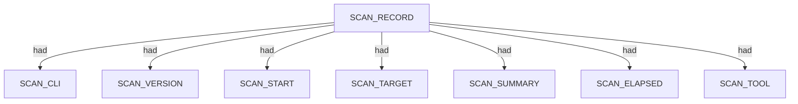
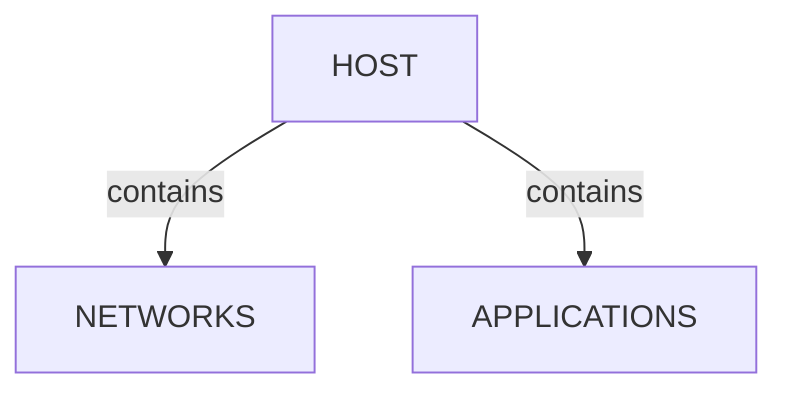
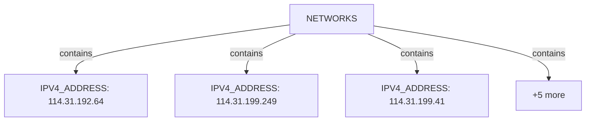
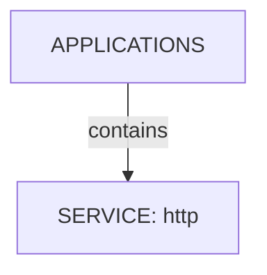
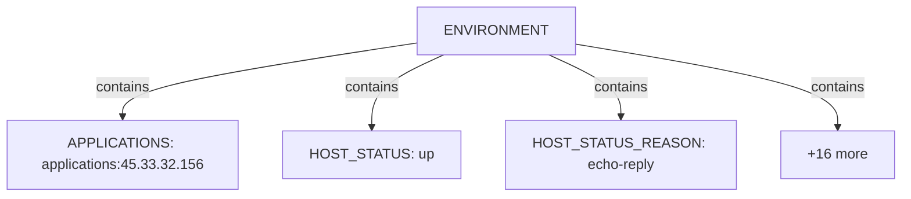
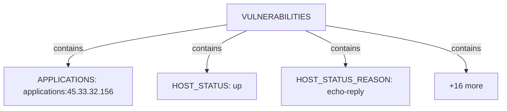
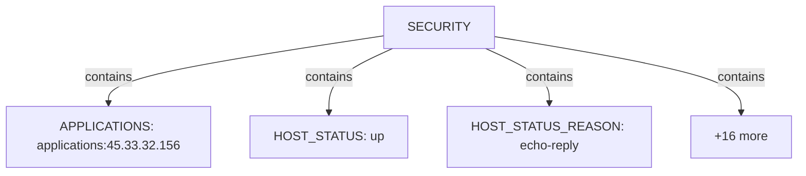
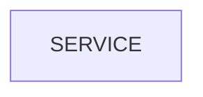
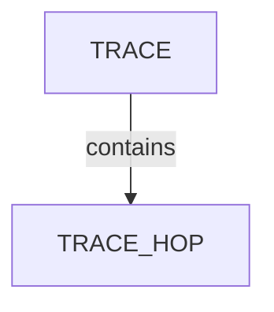
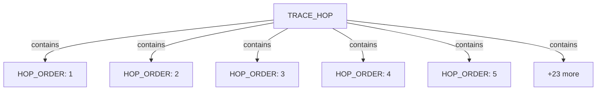

# Nmap scan narrative — `traceroute_permissive_xml`

## Introduction

This report narrates findings from a Nmap scan. The story follows the scan record, each discovered host (networks, applications, environment), and any traceroute path. This report follows Scan → Host/System/Organisation/Domain (categories) → Trace → Appendix. Overview diagrams show ontology types and relations; category diagrams show a few example values with the rest in tables; the appendix inventories every node and edge.

## Scan

Every examination has one SCAN_RECORD with scan descriptors linked via had. This scan includes **1** Scan root node(s) (e.g. `nmap:scanme.nmap.org:Fri Jun 26 03:55:54 2026`). Linked structures: `SCAN_CLI`, `SCAN_VERSION`, `SCAN_START`, `SCAN_TARGET`, `SCAN_SUMMARY`, `SCAN_ELAPSED`.

### Structure overview

### Scan descriptors

| Nugget | Value |
| --- | --- |
| `SCAN_RECORD` | `nmap:scanme.nmap.org:Fri Jun 26 03:55:54 2026` |

## Host

Qualified HOST endpoints own category trees for networks, applications, environment, and security findings. This scan includes **8** Host root node(s) (e.g. `45.33.32.156`, `203.134.80.60`, `203.134.80.236`). Linked structures: `NETWORKS`, `APPLICATIONS`.

### Structure overview

### `NETWORKS`

| Nugget | Value |
| --- | --- |
| `IPV4_ADDRESS` | `114.31.192.64` |
| `IPV4_ADDRESS` | `114.31.199.249` |
| `IPV4_ADDRESS` | `114.31.199.41` |
| `IPV4_ADDRESS` | `175.45.103.109` |
| `IPV4_ADDRESS` | `203.134.80.236` |
| `IPV4_ADDRESS` | `203.134.80.60` |
| `IPV4_ADDRESS` | `206.223.116.196` |
| `IPV4_ADDRESS` | `45.33.32.156` |

### `APPLICATIONS`

| Nugget | Value |
| --- | --- |
| `SERVICE` | `http` |

### `ENVIRONMENT`

| Nugget | Value |
| --- | --- |
| `APPLICATIONS` | `applications:45.33.32.156` |
| `HOST_STATUS` | `up` |
| `HOST_STATUS_REASON` | `echo-reply` |
| `INTERNET_NAME` | `ae10-100.edg01.alexeqn.nsw.vocus.network` |
| `INTERNET_NAME` | `be101.bdr01.sjc02.ca.us.vocus.network` |
| `INTERNET_NAME` | `be106-99.bdr01.syd14.nsw.vocus.network` |
| `INTERNET_NAME` | `be158.cor01.syd11.nsw.vocus.network` |
| `INTERNET_NAME` | `be202.bdr04.sjc01.ca.us.vocus.network` |
| `INTERNET_NAME` | `eqix-sv1.linode.com` |
| `INTERNET_NAME` | `lo0-33.bng71.alexeqn.nsw.vocus.network` |
| `INTERNET_NAME` | `scanme.nmap.org` |
| `NETWORKS` | `networks:114.31.192.64` |
| `NETWORKS` | `networks:114.31.199.249` |
| `NETWORKS` | `networks:114.31.199.41` |
| `NETWORKS` | `networks:175.45.103.109` |
| `NETWORKS` | `networks:203.134.80.236` |
| `NETWORKS` | `networks:203.134.80.60` |
| `NETWORKS` | `networks:206.223.116.196` |
| `NETWORKS` | `networks:45.33.32.156` |

### `VULNERABILITIES`

| Nugget | Value |
| --- | --- |
| `APPLICATIONS` | `applications:45.33.32.156` |
| `HOST_STATUS` | `up` |
| `HOST_STATUS_REASON` | `echo-reply` |
| `INTERNET_NAME` | `ae10-100.edg01.alexeqn.nsw.vocus.network` |
| `INTERNET_NAME` | `be101.bdr01.sjc02.ca.us.vocus.network` |
| `INTERNET_NAME` | `be106-99.bdr01.syd14.nsw.vocus.network` |
| `INTERNET_NAME` | `be158.cor01.syd11.nsw.vocus.network` |
| `INTERNET_NAME` | `be202.bdr04.sjc01.ca.us.vocus.network` |
| `INTERNET_NAME` | `eqix-sv1.linode.com` |
| `INTERNET_NAME` | `lo0-33.bng71.alexeqn.nsw.vocus.network` |
| `INTERNET_NAME` | `scanme.nmap.org` |
| `NETWORKS` | `networks:114.31.192.64` |
| `NETWORKS` | `networks:114.31.199.249` |
| `NETWORKS` | `networks:114.31.199.41` |
| `NETWORKS` | `networks:175.45.103.109` |
| `NETWORKS` | `networks:203.134.80.236` |
| `NETWORKS` | `networks:203.134.80.60` |
| `NETWORKS` | `networks:206.223.116.196` |
| `NETWORKS` | `networks:45.33.32.156` |

### `SECURITY`

| Nugget | Value |
| --- | --- |
| `APPLICATIONS` | `applications:45.33.32.156` |
| `HOST_STATUS` | `up` |
| `HOST_STATUS_REASON` | `echo-reply` |
| `INTERNET_NAME` | `ae10-100.edg01.alexeqn.nsw.vocus.network` |
| `INTERNET_NAME` | `be101.bdr01.sjc02.ca.us.vocus.network` |
| `INTERNET_NAME` | `be106-99.bdr01.syd14.nsw.vocus.network` |
| `INTERNET_NAME` | `be158.cor01.syd11.nsw.vocus.network` |
| `INTERNET_NAME` | `be202.bdr04.sjc01.ca.us.vocus.network` |
| `INTERNET_NAME` | `eqix-sv1.linode.com` |
| `INTERNET_NAME` | `lo0-33.bng71.alexeqn.nsw.vocus.network` |
| `INTERNET_NAME` | `scanme.nmap.org` |
| `NETWORKS` | `networks:114.31.192.64` |
| `NETWORKS` | `networks:114.31.199.249` |
| `NETWORKS` | `networks:114.31.199.41` |
| `NETWORKS` | `networks:175.45.103.109` |
| `NETWORKS` | `networks:203.134.80.236` |
| `NETWORKS` | `networks:203.134.80.60` |
| `NETWORKS` | `networks:206.223.116.196` |
| `NETWORKS` | `networks:45.33.32.156` |

## Services and ports

APPLICATION services listen-to PORT entities under NETWORKS/TRANSPORT. This scan includes **1** Services and ports root node(s) (e.g. `http`). Linked structures: no child categories.

### Structure overview

### Values

| Nugget | Value |
| --- | --- |
| `SERVICE` | `http` |

## Trace

TRACE sits under the scan with ordered TRACE_HOP nodes; each hop may contain a HOST router. This scan includes **1** Trace root node(s) (e.g. `45.33.32.156:icmp`). Linked structures: `TRACE_HOP`.

### Structure overview

### `TRACE_HOP`

| Nugget | Value |
| --- | --- |
| `HOP_ORDER` | `1` |
| `HOP_ORDER` | `2` |
| `HOP_ORDER` | `3` |
| `HOP_ORDER` | `4` |
| `HOP_ORDER` | `5` |
| `HOP_ORDER` | `6` |
| `HOP_ORDER` | `7` |
| `HOP_ORDER` | `8` |
| `HOP_RTT` | `153.00` |
| `HOP_RTT` | `154.00` |
| `HOP_RTT` | `8.00` |
| `HOP_RTT` | `9.00` |
| `HOP_TTL` | `13` |
| `HOP_TTL` | `2` |
| `HOP_TTL` | `4` |
| `HOP_TTL` | `5` |
| `HOP_TTL` | `6` |
| `HOP_TTL` | `7` |
| `HOP_TTL` | `8` |
| `HOP_TTL` | `9` |
| `HOST` | `114.31.192.64` |
| `HOST` | `114.31.199.249` |
| `HOST` | `114.31.199.41` |
| `HOST` | `175.45.103.109` |
| `HOST` | `203.134.80.236` |
| `HOST` | `203.134.80.60` |
| `HOST` | `206.223.116.196` |
| `HOST` | `45.33.32.156` |

## Conclusion

See the appendix for the full node and edge inventory.

## Appendix

### Nodes

| Nugget | Value |
| --- | --- |
| `APPLICATIONS` | `applications:45.33.32.156` |
| `HOP_ORDER` | `1` |
| `HOP_ORDER` | `2` |
| `HOP_ORDER` | `3` |
| `HOP_ORDER` | `4` |
| `HOP_ORDER` | `5` |
| `HOP_ORDER` | `6` |
| `HOP_ORDER` | `7` |
| `HOP_ORDER` | `8` |
| `HOP_RTT` | `153.00` |
| `HOP_RTT` | `154.00` |
| `HOP_RTT` | `8.00` |
| `HOP_RTT` | `9.00` |
| `HOP_TTL` | `13` |
| `HOP_TTL` | `2` |
| `HOP_TTL` | `4` |
| `HOP_TTL` | `5` |
| `HOP_TTL` | `6` |
| `HOP_TTL` | `7` |
| `HOP_TTL` | `8` |
| `HOP_TTL` | `9` |
| `HOST` | `114.31.192.64` |
| `HOST` | `114.31.199.249` |
| `HOST` | `114.31.199.41` |
| `HOST` | `175.45.103.109` |
| `HOST` | `203.134.80.236` |
| `HOST` | `203.134.80.60` |
| `HOST` | `206.223.116.196` |
| `HOST` | `45.33.32.156` |
| `HOST_STATUS` | `up` |
| `HOST_STATUS_REASON` | `echo-reply` |
| `INTERNET_NAME` | `ae10-100.edg01.alexeqn.nsw.vocus.network` |
| `INTERNET_NAME` | `be101.bdr01.sjc02.ca.us.vocus.network` |
| `INTERNET_NAME` | `be106-99.bdr01.syd14.nsw.vocus.network` |
| `INTERNET_NAME` | `be158.cor01.syd11.nsw.vocus.network` |
| `INTERNET_NAME` | `be202.bdr04.sjc01.ca.us.vocus.network` |
| `INTERNET_NAME` | `eqix-sv1.linode.com` |
| `INTERNET_NAME` | `lo0-33.bng71.alexeqn.nsw.vocus.network` |
| `INTERNET_NAME` | `scanme.nmap.org` |
| `IPV4_ADDRESS` | `114.31.192.64` |
| `IPV4_ADDRESS` | `114.31.199.249` |
| `IPV4_ADDRESS` | `114.31.199.41` |
| `IPV4_ADDRESS` | `175.45.103.109` |
| `IPV4_ADDRESS` | `203.134.80.236` |
| `IPV4_ADDRESS` | `203.134.80.60` |
| `IPV4_ADDRESS` | `206.223.116.196` |
| `IPV4_ADDRESS` | `45.33.32.156` |
| `NETWORKS` | `networks:114.31.192.64` |
| `NETWORKS` | `networks:114.31.199.249` |
| `NETWORKS` | `networks:114.31.199.41` |
| `NETWORKS` | `networks:175.45.103.109` |
| `NETWORKS` | `networks:203.134.80.236` |
| `NETWORKS` | `networks:203.134.80.60` |
| `NETWORKS` | `networks:206.223.116.196` |
| `NETWORKS` | `networks:45.33.32.156` |
| `PORT` | `80` |
| `PORT_PROTOCOL` | `tcp` |
| `PORT_STATE` | `open` |
| `PORT_STATE_REASON` | `syn-ack` |
| `SCAN_CLI` | `nmap -sT --traceroute -T3 -p 80 -oX - scanme.nmap.org` |
| `SCAN_ELAPSED` | `4.43` |
| `SCAN_RECORD` | `nmap:scanme.nmap.org:Fri Jun 26 03:55:54 2026` |
| `SCAN_START` | `Fri Jun 26 03:55:54 2026` |
| `SCAN_SUMMARY` | `Nmap done at Fri Jun 26 03:55:59 2026; 1 IP address (1 host up) scanned in 4.43 seconds` |
| `SCAN_TARGET` | `scanme.nmap.org` |
| `SCAN_TOOL` | `nmap` |
| `SCAN_VERSION` | `7.80` |
| `SERVICE` | `http` |
| `TRACE` | `45.33.32.156:icmp` |
| `TRACE_HOP` | `114.31.192.64` |
| `TRACE_HOP` | `114.31.199.249` |
| `TRACE_HOP` | `114.31.199.41` |
| `TRACE_HOP` | `175.45.103.109` |
| `TRACE_HOP` | `203.134.80.236` |
| `TRACE_HOP` | `203.134.80.60` |
| `TRACE_HOP` | `206.223.116.196` |
| `TRACE_HOP` | `45.33.32.156` |
| `TRACE_PROTOCOL` | `icmp` |
| `TRANSPORT` | `tcp` |

### Edges

| Source | Relation | Target |
| --- | --- | --- |
| `SCAN_RECORD` | `had` | `SCAN_CLI` |
| `SCAN_RECORD` | `had` | `SCAN_VERSION` |
| `SCAN_RECORD` | `had` | `SCAN_START` |
| `SCAN_RECORD` | `had` | `SCAN_TARGET` |
| `SCAN_RECORD` | `had` | `SCAN_SUMMARY` |
| `SCAN_RECORD` | `had` | `SCAN_ELAPSED` |
| `SCAN_RECORD` | `had` | `SCAN_TOOL` |
| `SCAN_RECORD` | `contains` | `HOST` |
| `HOST` | `had` | `HOST_STATUS` |
| `HOST` | `had` | `HOST_STATUS_REASON` |
| `HOST` | `had` | `INTERNET_NAME` |
| `HOST` | `contains` | `NETWORKS` |
| `NETWORKS` | `contains` | `IPV4_ADDRESS` |
| `HOST` | `contains` | `APPLICATIONS` |
| `IPV4_ADDRESS` | `contains` | `TRANSPORT` |
| `TRANSPORT` | `contains` | `PORT` |
| `PORT` | `had` | `PORT_STATE` |
| `PORT` | `had` | `PORT_STATE_REASON` |
| `PORT` | `had` | `PORT_PROTOCOL` |
| `APPLICATIONS` | `contains` | `SERVICE` |
| `SERVICE` | `listens-to` | `PORT` |
| `SCAN_RECORD` | `contains` | `TRACE` |
| `TRACE` | `had` | `TRACE_PROTOCOL` |
| `TRACE` | `contains` | `TRACE_HOP` |
| `TRACE_HOP` | `had` | `HOP_TTL` |
| `TRACE_HOP` | `had` | `HOP_RTT` |
| `TRACE_HOP` | `had` | `HOP_ORDER` |
| `TRACE_HOP` | `contains` | `HOST` |
---

*OS-Intel Scan*
