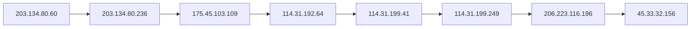

# Nmap OSINT Scan Report — traceroute_permissive_xml

## Introduction

This report narrates the findings of a **Nmap** scan against **scanme.nmap.org**. The story follows the scan itself, each discovered host, and any traceroute path recorded during the run. Every observed nugget and value from the semantic graph appears in the narrative below or in the appendix.

## Scan

The scan was executed with **nmap** version **7.80**, targeting **scanme.nmap.org** from **Fri Jun 26 03:55:54 2026**. The operator invoked: `nmap -sT --traceroute -T3 -p 80 -oX - scanme.nmap.org`.
 The run completed in **4.43** seconds.

Nmap done at Fri Jun 26 03:55:59 2026; 1 IP address (1 host up) scanned in 4.43 seconds

During this scan, **8** hosts were placed under investigation.

## Host 114.31.192.64

It answers to the internet name **be158.cor01.syd11.nsw.vocus.network**.

### Networks

Network address **114.31.192.64**:
- No transport endpoints were enumerated.

## Host 114.31.199.249

It answers to the internet name **be101.bdr01.sjc02.ca.us.vocus.network**.

### Networks

Network address **114.31.199.249**:
- No transport endpoints were enumerated.

## Host 114.31.199.41

It answers to the internet name **be202.bdr04.sjc01.ca.us.vocus.network**.

### Networks

Network address **114.31.199.41**:
- No transport endpoints were enumerated.

## Host 175.45.103.109

It answers to the internet name **be106-99.bdr01.syd14.nsw.vocus.network**.

### Networks

Network address **175.45.103.109**:
- No transport endpoints were enumerated.

## Host 203.134.80.236

It answers to the internet name **ae10-100.edg01.alexeqn.nsw.vocus.network**.

### Networks

Network address **203.134.80.236**:
- No transport endpoints were enumerated.

## Host 203.134.80.60

It answers to the internet name **lo0-33.bng71.alexeqn.nsw.vocus.network**.

### Networks

Network address **203.134.80.60**:
- No transport endpoints were enumerated.

## Host 206.223.116.196

It answers to the internet name **eqix-sv1.linode.com**.

### Networks

Network address **206.223.116.196**:
- No transport endpoints were enumerated.

## Host 45.33.32.156

The host was observed as **up** (reason: **echo-reply**).
It answers to the internet name **scanme.nmap.org**.

### Networks

Network address **45.33.32.156**:
- Port **80** on **tcp** is **open** (syn-ack), associated with **http**.

### Applications

Application service **http** listening on port **80**.

## Traceroute Path

- **Trace Protocol** (`icmp`)

Each hop along the path:

1. Hop **1** (TTL **2**, RTT **8.00 ms**) reaches **203.134.80.60**.
2. Hop **2** (TTL **4**, RTT **9.00 ms**) reaches **203.134.80.236**.
3. Hop **3** (TTL **5**, RTT **9.00 ms**) reaches **175.45.103.109**.
4. Hop **4** (TTL **6**, RTT **154.00 ms**) reaches **114.31.192.64**.
5. Hop **5** (TTL **7**, RTT **153.00 ms**) reaches **114.31.199.41**.
6. Hop **6** (TTL **8**, RTT **153.00 ms**) reaches **114.31.199.249**.
7. Hop **7** (TTL **9**, RTT **154.00 ms**) reaches **206.223.116.196**.
8. Hop **8** (TTL **13**, RTT **153.00 ms**) reaches **45.33.32.156**.

### Trace diagram

## Conclusion

The scan captured **79** semantic nuggets across **8** hosts.
 Nmap done at Fri Jun 26 03:55:59 2026; 1 IP address (1 host up) scanned in 4.43 seconds
 The appendix lists every nugget instance and value for audit and downstream review.

## Appendix — Complete Nugget Inventory

| Type | Nugget | Description | Value |
|------|--------|-------------|-------|
| CATEGORY | APPLICATIONS | Applications Category | `applications:45.33.32.156` |
| CATEGORY | NETWORKS | Networks Category | `networks:114.31.192.64` |
| CATEGORY | NETWORKS | Networks Category | `networks:114.31.199.249` |
| CATEGORY | NETWORKS | Networks Category | `networks:114.31.199.41` |
| CATEGORY | NETWORKS | Networks Category | `networks:175.45.103.109` |
| CATEGORY | NETWORKS | Networks Category | `networks:203.134.80.236` |
| CATEGORY | NETWORKS | Networks Category | `networks:203.134.80.60` |
| CATEGORY | NETWORKS | Networks Category | `networks:206.223.116.196` |
| CATEGORY | NETWORKS | Networks Category | `networks:45.33.32.156` |
| DESCRIPTOR | HOP_ORDER | Trace Hop Order | `1` |
| DESCRIPTOR | HOP_ORDER | Trace Hop Order | `2` |
| DESCRIPTOR | HOP_ORDER | Trace Hop Order | `3` |
| DESCRIPTOR | HOP_ORDER | Trace Hop Order | `4` |
| DESCRIPTOR | HOP_ORDER | Trace Hop Order | `5` |
| DESCRIPTOR | HOP_ORDER | Trace Hop Order | `6` |
| DESCRIPTOR | HOP_ORDER | Trace Hop Order | `7` |
| DESCRIPTOR | HOP_ORDER | Trace Hop Order | `8` |
| DESCRIPTOR | HOP_RTT | Trace Hop RTT | `153.00` |
| DESCRIPTOR | HOP_RTT | Trace Hop RTT | `154.00` |
| DESCRIPTOR | HOP_RTT | Trace Hop RTT | `8.00` |
| DESCRIPTOR | HOP_RTT | Trace Hop RTT | `9.00` |
| DESCRIPTOR | HOP_TTL | Trace Hop TTL | `13` |
| DESCRIPTOR | HOP_TTL | Trace Hop TTL | `2` |
| DESCRIPTOR | HOP_TTL | Trace Hop TTL | `4` |
| DESCRIPTOR | HOP_TTL | Trace Hop TTL | `5` |
| DESCRIPTOR | HOP_TTL | Trace Hop TTL | `6` |
| DESCRIPTOR | HOP_TTL | Trace Hop TTL | `7` |
| DESCRIPTOR | HOP_TTL | Trace Hop TTL | `8` |
| DESCRIPTOR | HOP_TTL | Trace Hop TTL | `9` |
| DESCRIPTOR | HOST_STATUS | Host Status | `up` |
| DESCRIPTOR | HOST_STATUS_REASON | Host Status Reason | `echo-reply` |
| DESCRIPTOR | INTERNET_NAME | Internet Name | `ae10-100.edg01.alexeqn.nsw.vocus.network` |
| DESCRIPTOR | INTERNET_NAME | Internet Name | `be101.bdr01.sjc02.ca.us.vocus.network` |
| DESCRIPTOR | INTERNET_NAME | Internet Name | `be106-99.bdr01.syd14.nsw.vocus.network` |
| DESCRIPTOR | INTERNET_NAME | Internet Name | `be158.cor01.syd11.nsw.vocus.network` |
| DESCRIPTOR | INTERNET_NAME | Internet Name | `be202.bdr04.sjc01.ca.us.vocus.network` |
| DESCRIPTOR | INTERNET_NAME | Internet Name | `eqix-sv1.linode.com` |
| DESCRIPTOR | INTERNET_NAME | Internet Name | `lo0-33.bng71.alexeqn.nsw.vocus.network` |
| DESCRIPTOR | INTERNET_NAME | Internet Name | `scanme.nmap.org` |
| DESCRIPTOR | PORT_PROTOCOL | Port Protocol | `tcp` |
| DESCRIPTOR | PORT_STATE | Port State | `open` |
| DESCRIPTOR | PORT_STATE_REASON | Port State Reason | `syn-ack` |
| DESCRIPTOR | SCAN_CLI | Scan CLI | `nmap -sT --traceroute -T3 -p 80 -oX - scanme.nmap.org` |
| DESCRIPTOR | SCAN_ELAPSED | Scan Elapsed Time | `4.43` |
| DESCRIPTOR | SCAN_START | Scan Start | `Fri Jun 26 03:55:54 2026` |
| DESCRIPTOR | SCAN_SUMMARY | Scan Summary | `Nmap done at Fri Jun 26 03:55:59 2026; 1 IP address (1 host up) scanned in 4.43 seconds` |
| DESCRIPTOR | SCAN_TARGET | Scan Target | `scanme.nmap.org` |
| DESCRIPTOR | SCAN_TOOL | Scan Tool | `nmap` |
| DESCRIPTOR | SCAN_VERSION | Scan Version | `7.80` |
| DESCRIPTOR | TRACE_PROTOCOL | Trace Protocol | `icmp` |
| ENTITY | HOST | Host | `114.31.192.64` |
| ENTITY | HOST | Host | `114.31.199.249` |
| ENTITY | HOST | Host | `114.31.199.41` |
| ENTITY | HOST | Host | `175.45.103.109` |
| ENTITY | HOST | Host | `203.134.80.236` |
| ENTITY | HOST | Host | `203.134.80.60` |
| ENTITY | HOST | Host | `206.223.116.196` |
| ENTITY | HOST | Host | `45.33.32.156` |
| ENTITY | IPV4_ADDRESS | IP Address | `114.31.192.64` |
| ENTITY | IPV4_ADDRESS | IP Address | `114.31.199.249` |
| ENTITY | IPV4_ADDRESS | IP Address | `114.31.199.41` |
| ENTITY | IPV4_ADDRESS | IP Address | `175.45.103.109` |
| ENTITY | IPV4_ADDRESS | IP Address | `203.134.80.236` |
| ENTITY | IPV4_ADDRESS | IP Address | `203.134.80.60` |
| ENTITY | IPV4_ADDRESS | IP Address | `206.223.116.196` |
| ENTITY | IPV4_ADDRESS | IP Address | `45.33.32.156` |
| ENTITY | SCAN_RECORD | Scan Record | `nmap:scanme.nmap.org:Fri Jun 26 03:55:54 2026` |
| ENTITY | SERVICE | Network Service | `http` |
| ENTITY | TRACE | Trace | `45.33.32.156:icmp` |
| ENTITY | TRANSPORT | Transport Protocol | `tcp` |
| SUBENTITY | PORT | Network Port | `80` |
| SUBENTITY | TRACE_HOP | Trace Hop | `114.31.192.64` |
| SUBENTITY | TRACE_HOP | Trace Hop | `114.31.199.249` |
| SUBENTITY | TRACE_HOP | Trace Hop | `114.31.199.41` |
| SUBENTITY | TRACE_HOP | Trace Hop | `175.45.103.109` |
| SUBENTITY | TRACE_HOP | Trace Hop | `203.134.80.236` |
| SUBENTITY | TRACE_HOP | Trace Hop | `203.134.80.60` |
| SUBENTITY | TRACE_HOP | Trace Hop | `206.223.116.196` |
| SUBENTITY | TRACE_HOP | Trace Hop | `45.33.32.156` |

---

*OS-Intel Scan · Fri Jun 26 03:55:54 2026 · Page 1*
