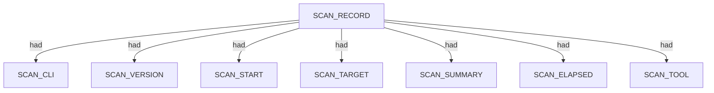
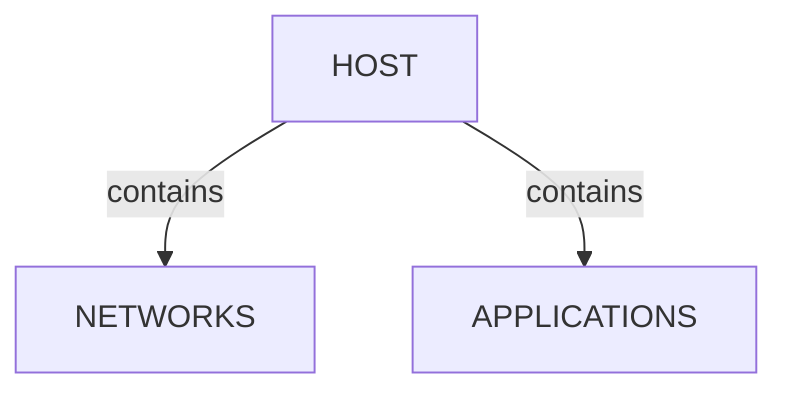
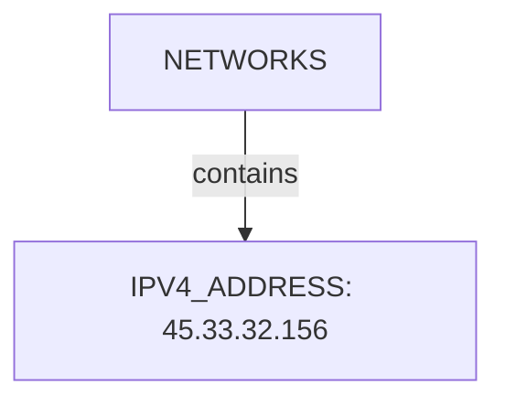
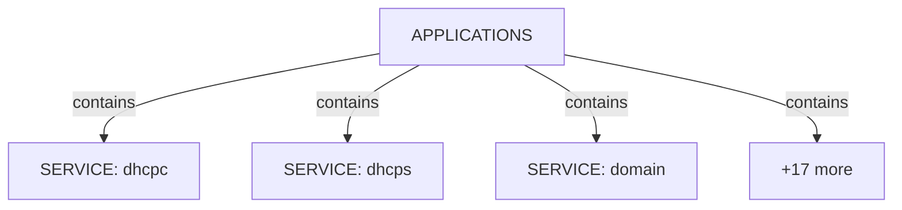
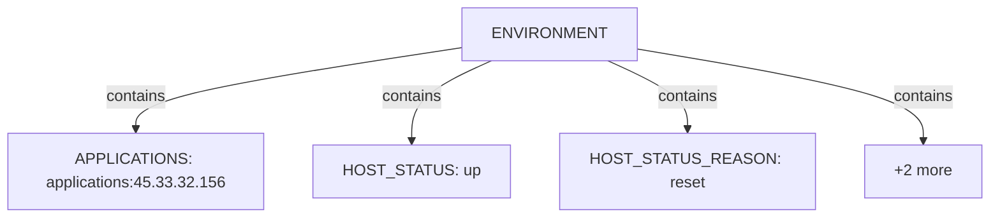
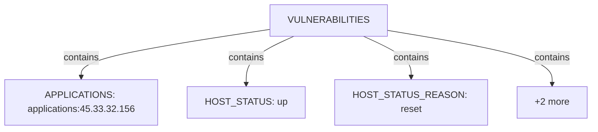
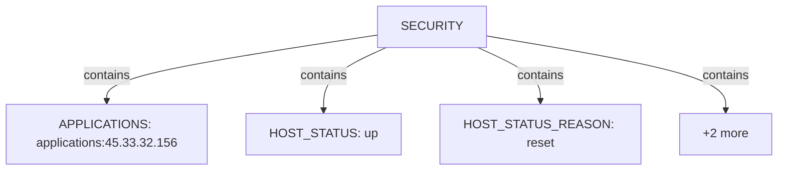

# Nmap scan narrative — `udp_top_permissive`

## Introduction

This report narrates findings from a Nmap scan. The story follows the scan record, each discovered host (networks, applications, environment), and any traceroute path. This report follows Scan → Host/System/Organisation/Domain (categories) → Trace → Appendix. Overview diagrams show ontology types and relations; category diagrams show a few example values with the rest in tables; the appendix inventories every node and edge.

## Scan

Every examination has one SCAN_RECORD with scan descriptors linked via had. This scan includes **1** Scan root node(s) (e.g. `nmap:scanme.nmap.org:Fri Jun 26 03:55:32 2026`). Linked structures: `SCAN_CLI`, `SCAN_VERSION`, `SCAN_START`, `SCAN_TARGET`, `SCAN_SUMMARY`, `SCAN_ELAPSED`.

### Structure overview

### Scan descriptors

| Nugget | Value |
| --- | --- |
| `SCAN_RECORD` | `nmap:scanme.nmap.org:Fri Jun 26 03:55:32 2026` |

## Host

Qualified HOST endpoints own category trees for networks, applications, environment, and security findings. This scan includes **1** Host root node(s) (e.g. `45.33.32.156`). Linked structures: `NETWORKS`, `APPLICATIONS`.

### Structure overview

### `NETWORKS`

| Nugget | Value |
| --- | --- |
| `IPV4_ADDRESS` | `45.33.32.156` |

### `APPLICATIONS`

| Nugget | Value |
| --- | --- |
| `SERVICE` | `dhcpc` |
| `SERVICE` | `dhcps` |
| `SERVICE` | `domain` |
| `SERVICE` | `ipp` |
| `SERVICE` | `isakmp` |
| `SERVICE` | `microsoft-ds` |
| `SERVICE` | `ms-sql-m` |
| `SERVICE` | `msrpc` |
| `SERVICE` | `nat-t-ike` |
| `SERVICE` | `netbios-dgm` |
| `SERVICE` | `netbios-ns` |
| `SERVICE` | `netbios-ssn` |
| `SERVICE` | `ntp` |
| `SERVICE` | `route` |
| `SERVICE` | `snmp` |
| `SERVICE` | `snmptrap` |
| `SERVICE` | `syslog` |
| `SERVICE` | `tftp` |
| `SERVICE` | `unknown` |
| `SERVICE` | `upnp` |

### `ENVIRONMENT`

| Nugget | Value |
| --- | --- |
| `APPLICATIONS` | `applications:45.33.32.156` |
| `HOST_STATUS` | `up` |
| `HOST_STATUS_REASON` | `reset` |
| `INTERNET_NAME` | `scanme.nmap.org` |
| `NETWORKS` | `networks:45.33.32.156` |

### `VULNERABILITIES`

| Nugget | Value |
| --- | --- |
| `APPLICATIONS` | `applications:45.33.32.156` |
| `HOST_STATUS` | `up` |
| `HOST_STATUS_REASON` | `reset` |
| `INTERNET_NAME` | `scanme.nmap.org` |
| `NETWORKS` | `networks:45.33.32.156` |

### `SECURITY`

| Nugget | Value |
| --- | --- |
| `APPLICATIONS` | `applications:45.33.32.156` |
| `HOST_STATUS` | `up` |
| `HOST_STATUS_REASON` | `reset` |
| `INTERNET_NAME` | `scanme.nmap.org` |
| `NETWORKS` | `networks:45.33.32.156` |

## Services and ports

APPLICATION services listen-to PORT entities under NETWORKS/TRANSPORT. This scan includes **20** Services and ports root node(s) (e.g. `domain`, `dhcps`, `dhcpc`). Linked structures: no child categories.

### Structure overview

### Values

| Nugget | Value |
| --- | --- |
| `SERVICE` | `dhcpc` |
| `SERVICE` | `dhcps` |
| `SERVICE` | `domain` |
| `SERVICE` | `ipp` |
| `SERVICE` | `isakmp` |
| `SERVICE` | `microsoft-ds` |
| `SERVICE` | `ms-sql-m` |
| `SERVICE` | `msrpc` |
| `SERVICE` | `nat-t-ike` |
| `SERVICE` | `netbios-dgm` |
| `SERVICE` | `netbios-ns` |
| `SERVICE` | `netbios-ssn` |
| `SERVICE` | `ntp` |
| `SERVICE` | `route` |
| `SERVICE` | `snmp` |
| `SERVICE` | `snmptrap` |
| `SERVICE` | `syslog` |
| `SERVICE` | `tftp` |
| `SERVICE` | `unknown` |
| `SERVICE` | `upnp` |

## Conclusion

See the appendix for the full node and edge inventory.

## Appendix

### Nodes

| Nugget | Value |
| --- | --- |
| `APPLICATIONS` | `applications:45.33.32.156` |
| `HOST` | `45.33.32.156` |
| `HOST_STATUS` | `up` |
| `HOST_STATUS_REASON` | `reset` |
| `INTERNET_NAME` | `scanme.nmap.org` |
| `IPV4_ADDRESS` | `45.33.32.156` |
| `NETWORKS` | `networks:45.33.32.156` |
| `PORT` | `123` |
| `PORT` | `135` |
| `PORT` | `137` |
| `PORT` | `138` |
| `PORT` | `139` |
| `PORT` | `1434` |
| `PORT` | `161` |
| `PORT` | `162` |
| `PORT` | `1900` |
| `PORT` | `445` |
| `PORT` | `4500` |
| `PORT` | `49152` |
| `PORT` | `500` |
| `PORT` | `514` |
| `PORT` | `520` |
| `PORT` | `53` |
| `PORT` | `631` |
| `PORT` | `67` |
| `PORT` | `68` |
| `PORT` | `69` |
| `PORT_PROTOCOL` | `udp` |
| `PORT_STATE` | `closed` |
| `PORT_STATE` | `open` |
| `PORT_STATE` | `open\|filtered` |
| `PORT_STATE_REASON` | `no-response` |
| `PORT_STATE_REASON` | `port-unreach` |
| `PORT_STATE_REASON` | `udp-response` |
| `SCAN_CLI` | `nmap -sU -T3 --top-ports 20 -oX - scanme.nmap.org` |
| `SCAN_ELAPSED` | `15.60` |
| `SCAN_RECORD` | `nmap:scanme.nmap.org:Fri Jun 26 03:55:32 2026` |
| `SCAN_START` | `Fri Jun 26 03:55:32 2026` |
| `SCAN_SUMMARY` | `Nmap done at Fri Jun 26 03:55:47 2026; 1 IP address (1 host up) scanned in 15.60 seconds` |
| `SCAN_TARGET` | `scanme.nmap.org` |
| `SCAN_TOOL` | `nmap` |
| `SCAN_VERSION` | `7.80` |
| `SERVICE` | `dhcpc` |
| `SERVICE` | `dhcps` |
| `SERVICE` | `domain` |
| `SERVICE` | `ipp` |
| `SERVICE` | `isakmp` |
| `SERVICE` | `microsoft-ds` |
| `SERVICE` | `ms-sql-m` |
| `SERVICE` | `msrpc` |
| `SERVICE` | `nat-t-ike` |
| `SERVICE` | `netbios-dgm` |
| `SERVICE` | `netbios-ns` |
| `SERVICE` | `netbios-ssn` |
| `SERVICE` | `ntp` |
| `SERVICE` | `route` |
| `SERVICE` | `snmp` |
| `SERVICE` | `snmptrap` |
| `SERVICE` | `syslog` |
| `SERVICE` | `tftp` |
| `SERVICE` | `unknown` |
| `SERVICE` | `upnp` |
| `TRANSPORT` | `udp` |

### Edges

| Source | Relation | Target |
| --- | --- | --- |
| `SCAN_RECORD` | `had` | `SCAN_CLI` |
| `SCAN_RECORD` | `had` | `SCAN_VERSION` |
| `SCAN_RECORD` | `had` | `SCAN_START` |
| `SCAN_RECORD` | `had` | `SCAN_TARGET` |
| `SCAN_RECORD` | `had` | `SCAN_SUMMARY` |
| `SCAN_RECORD` | `had` | `SCAN_ELAPSED` |
| `SCAN_RECORD` | `had` | `SCAN_TOOL` |
| `SCAN_RECORD` | `contains` | `HOST` |
| `HOST` | `had` | `HOST_STATUS` |
| `HOST` | `had` | `HOST_STATUS_REASON` |
| `HOST` | `had` | `INTERNET_NAME` |
| `HOST` | `contains` | `NETWORKS` |
| `NETWORKS` | `contains` | `IPV4_ADDRESS` |
| `HOST` | `contains` | `APPLICATIONS` |
| `IPV4_ADDRESS` | `contains` | `TRANSPORT` |
| `TRANSPORT` | `contains` | `PORT` |
| `PORT` | `had` | `PORT_STATE` |
| `PORT` | `had` | `PORT_STATE_REASON` |
| `PORT` | `had` | `PORT_PROTOCOL` |
| `APPLICATIONS` | `contains` | `SERVICE` |
| `SERVICE` | `listens-to` | `PORT` |
---

*OS-Intel Scan*
