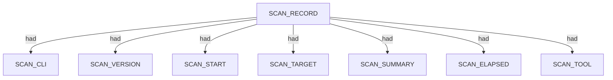
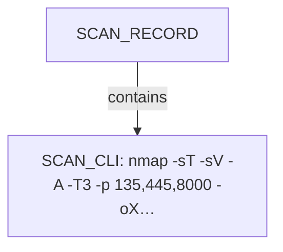
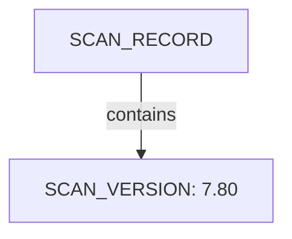
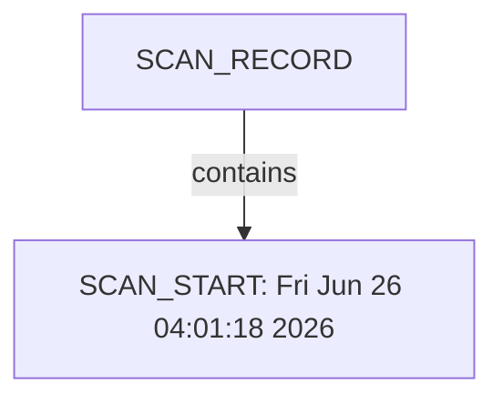
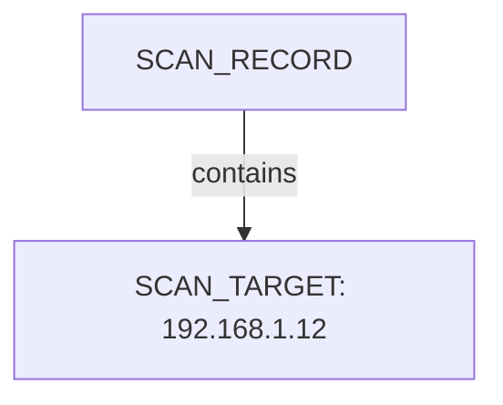
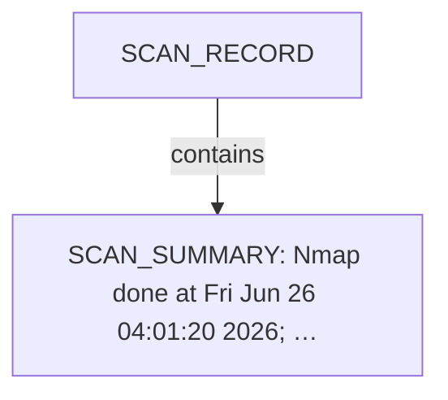
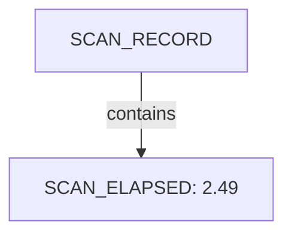
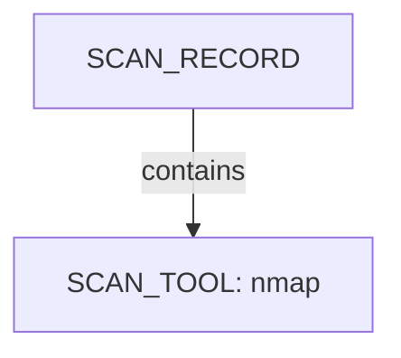

# Nmap scan narrative — `windows_enrich_local_xml`

## Introduction

This report narrates findings from a Nmap scan. The story follows the scan record, each discovered host (networks, applications, environment), and any traceroute path. This report follows Scan → Host/System/Organisation/Domain (categories) → Trace → Appendix. Overview diagrams show ontology types and relations; category diagrams show a few example values with the rest in tables; the appendix inventories every node and edge.

## Scan

Every examination has one SCAN_RECORD with scan descriptors linked via had. This scan includes **1** Scan root node(s) (e.g. `nmap:192.168.1.12:Fri Jun 26 04:01:18 2026`). Linked structures: `SCAN_CLI`, `SCAN_VERSION`, `SCAN_START`, `SCAN_TARGET`, `SCAN_SUMMARY`, `SCAN_ELAPSED`.

### Structure overview

### `SCAN_CLI`

| Nugget | Value |
| --- | --- |
| `SCAN_CLI` | `nmap -sT -sV -A -T3 -p 135,445,8000 -oX - 192.168.1.12` |

### `SCAN_VERSION`

| Nugget | Value |
| --- | --- |
| `SCAN_VERSION` | `7.80` |

### `SCAN_START`

| Nugget | Value |
| --- | --- |
| `SCAN_START` | `Fri Jun 26 04:01:18 2026` |

### `SCAN_TARGET`

| Nugget | Value |
| --- | --- |
| `SCAN_TARGET` | `192.168.1.12` |

### `SCAN_SUMMARY`

| Nugget | Value |
| --- | --- |
| `SCAN_SUMMARY` | `Nmap done at Fri Jun 26 04:01:20 2026; 1 IP address (0 hosts up) scanned in 2.49 seconds` |

### `SCAN_ELAPSED`

| Nugget | Value |
| --- | --- |
| `SCAN_ELAPSED` | `2.49` |

### `SCAN_TOOL`

| Nugget | Value |
| --- | --- |
| `SCAN_TOOL` | `nmap` |

## Conclusion

See the appendix for the full node and edge inventory.

## Appendix

### Nodes

| Nugget | Value |
| --- | --- |
| `SCAN_CLI` | `nmap -sT -sV -A -T3 -p 135,445,8000 -oX - 192.168.1.12` |
| `SCAN_ELAPSED` | `2.49` |
| `SCAN_RECORD` | `nmap:192.168.1.12:Fri Jun 26 04:01:18 2026` |
| `SCAN_START` | `Fri Jun 26 04:01:18 2026` |
| `SCAN_SUMMARY` | `Nmap done at Fri Jun 26 04:01:20 2026; 1 IP address (0 hosts up) scanned in 2.49 seconds` |
| `SCAN_TARGET` | `192.168.1.12` |
| `SCAN_TOOL` | `nmap` |
| `SCAN_VERSION` | `7.80` |

### Edges

| Source | Relation | Target |
| --- | --- | --- |
| `SCAN_RECORD` | `had` | `SCAN_CLI` |
| `SCAN_RECORD` | `had` | `SCAN_VERSION` |
| `SCAN_RECORD` | `had` | `SCAN_START` |
| `SCAN_RECORD` | `had` | `SCAN_TARGET` |
| `SCAN_RECORD` | `had` | `SCAN_SUMMARY` |
| `SCAN_RECORD` | `had` | `SCAN_ELAPSED` |
| `SCAN_RECORD` | `had` | `SCAN_TOOL` |
---

*OS-Intel Scan*
