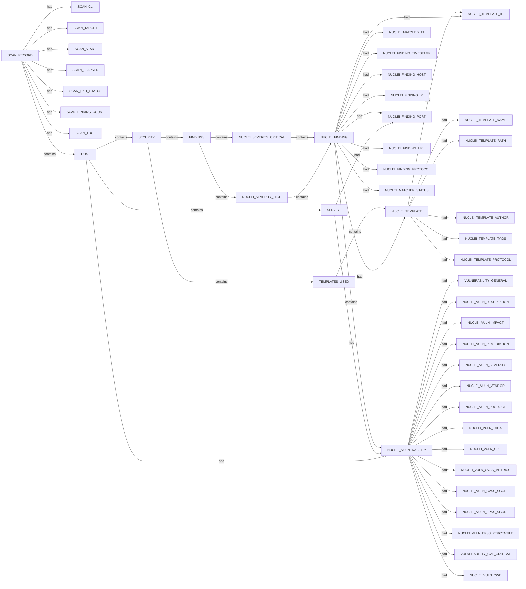

# Nuclei scan narrative — `cipherheart_redis_lab`

## Introduction

Nuclei findings are grouped under each host's SECURITY container with severity buckets, deduplicated templates, and per-record findings.

## Hosts

- `pentest-ground.com`
- `pentest-ground.com:6379`

## Findings

- `CVE-2022-0543:pentest-ground.com:6379:2026-07-05T21:43:18.136703+10:00`
- `Redis Sandbox Escape - Remote Code Execution`
- `Redis Server - Unauthenticated Access`
- `exposed-redis:pentest-ground.com:6379:2026-07-05T21:43:20.5499978+10:00`

## Graph structure (types)

## Trace

_Trace section omitted when no TRACE nodes present._

## Appendix

### Nodes

- `FINDINGS`: pentest-ground.com::FINDINGS
- `HOST`: pentest-ground.com
- `HOST`: pentest-ground.com:6379
- `NUCLEI_FINDING`: CVE-2022-0543:pentest-ground.com:6379:2026-07-05T21:43:18.136703+10:00
- `NUCLEI_FINDING`: exposed-redis:pentest-ground.com:6379:2026-07-05T21:43:20.5499978+10:00
- `NUCLEI_FINDING_HOST`: pentest-ground.com
- `NUCLEI_FINDING_IP`: 178.79.134.182
- `NUCLEI_FINDING_PORT`: 6379
- `NUCLEI_FINDING_PROTOCOL`: tcp
- `NUCLEI_FINDING_TIMESTAMP`: 2026-07-05T21:43:18.136703+10:00
- `NUCLEI_FINDING_TIMESTAMP`: 2026-07-05T21:43:20.5499978+10:00
- `NUCLEI_FINDING_URL`: pentest-ground.com:6379
- `NUCLEI_MATCHED_AT`: pentest-ground.com:6379
- `NUCLEI_MATCHER_STATUS`: True
- `NUCLEI_SEVERITY_CRITICAL`: pentest-ground.com::NUCLEI_SEVERITY_CRITICAL
- `NUCLEI_SEVERITY_HIGH`: pentest-ground.com::NUCLEI_SEVERITY_HIGH
- `NUCLEI_TEMPLATE`: CVE-2022-0543
- `NUCLEI_TEMPLATE`: exposed-redis
- `NUCLEI_TEMPLATE_AUTHOR`: dwisiswant0
- `NUCLEI_TEMPLATE_AUTHOR`: pdteam
- `NUCLEI_TEMPLATE_ID`: CVE-2022-0543
- `NUCLEI_TEMPLATE_ID`: exposed-redis
- `NUCLEI_TEMPLATE_NAME`: Redis Sandbox Escape - Remote Code Execution
- `NUCLEI_TEMPLATE_NAME`: Redis Server - Unauthenticated Access
- `NUCLEI_TEMPLATE_PATH`: C:\projects\spiderfeet\.tools\nuclei-templates\network\cves\2022\CVE-2022-0543.yaml
- `NUCLEI_TEMPLATE_PATH`: C:\projects\spiderfeet\.tools\nuclei-templates\network\exposures\exposed-redis.yaml
- `NUCLEI_TEMPLATE_PROTOCOL`: tcp
- `NUCLEI_TEMPLATE_TAGS`: cve, cve2022, network, redis, unauth, rce, kev, tcp, vkev, vuln
- `NUCLEI_TEMPLATE_TAGS`: network, redis, unauth, exposure, tcp, discovery
- `NUCLEI_VULNERABILITY`: CVE-2022-0543:pentest-ground.com:6379:2026-07-05T21:43:18.136703+10:00
- `NUCLEI_VULNERABILITY`: exposed-redis:pentest-ground.com:6379:2026-07-05T21:43:20.5499978+10:00
- `NUCLEI_VULN_CPE`: cpe:2.3:a:redis:redis:-:*:*:*:*:*:*:*
- `NUCLEI_VULN_CVSS_METRICS`: CVSS:3.0/AV:N/AC:L/PR:N/UI:N/S:C/C:L/I:L/A:N
- `NUCLEI_VULN_CVSS_METRICS`: CVSS:3.1/AV:N/AC:L/PR:N/UI:N/S:C/C:H/I:H/A:H
- `NUCLEI_VULN_CVSS_SCORE`: 10
- `NUCLEI_VULN_CVSS_SCORE`: 7.2
- `NUCLEI_VULN_CWE`: cwe-306
- `NUCLEI_VULN_DESCRIPTION`: Redis server without any required authentication was discovered.
- `NUCLEI_VULN_DESCRIPTION`: This template exploits CVE-2022-0543, a Lua-based Redis sandbox escape. The
vulnerability was introduced by Debian and Ubuntu Redis packages that
insufficiently sanitized the Lua environment. The maintainers failed to
disable the package interface, allowing attackers to load arbitrary libraries.

- `NUCLEI_VULN_EPSS_PERCENTILE`: 0.99948
- `NUCLEI_VULN_EPSS_SCORE`: 0.9967
- `NUCLEI_VULN_IMPACT`: Successful exploitation of this vulnerability can lead to unauthorized access, data theft, and compromise of the affected system.

- `NUCLEI_VULN_PRODUCT`: redis
- `NUCLEI_VULN_REMEDIATION`: Update to the most recent versions currently available.
- `NUCLEI_VULN_SEVERITY`: critical
- `NUCLEI_VULN_SEVERITY`: high
- `NUCLEI_VULN_TAGS`: cve, cve2022, network, redis, unauth, rce, kev, tcp, vkev, vuln
- `NUCLEI_VULN_TAGS`: network, redis, unauth, exposure, tcp, discovery
- `NUCLEI_VULN_VENDOR`: redis
- `SCAN_CLI`: nuclei -u pentest-ground.com:6379 -silent -jsonl -omit-raw -omit-template -t .tools/nuclei-templates/network/cves/2022/CVE-2022-0543.yaml -t .tools/nuclei-templates/network/exposures/exposed-redis.yaml -no-interactsh -etags dos,fuzz,misc -duc -retries 1 -c 10 -timeout 15 -jle .docs/docs-for-cli-tools/exploration_scratch/nuclei/cipherheart_redis_lab.jsonl
- `SCAN_ELAPSED`: 0.0
- `SCAN_EXIT_STATUS`: 0
- `SCAN_FINDING_COUNT`: 2
- `SCAN_RECORD`: nuclei:pentest-ground.com:6379:nuclei -u pentest-ground.com:6379 -silent -jsonl -omit-raw -omit-template -t .tools/nuclei-templates/network/cves/2022/CVE-2022-0543.yaml -t .tools/nuclei-templates/network/exposures/exposed-redis.yaml -no-interactsh -etags dos,fuzz,misc -duc -retries 1 -c 10 -timeout 15 -jle .docs/docs-for-cli-tools/exploration_scratch/nuclei/cipherheart_redis_lab.jsonl
- `SCAN_START`: 2026-07-05T11:58:42.228637+00:00
- `SCAN_TARGET`: pentest-ground.com:6379
- `SCAN_TOOL`: nuclei
- `SECURITY`: pentest-ground.com::SECURITY
- `SERVICE`: pentest-ground.com:6379
- `TEMPLATES_USED`: pentest-ground.com::TEMPLATES_USED
- `VULNERABILITY_CVE_CRITICAL`: CVE-2022-0543
- `VULNERABILITY_CVE_CRITICAL`: ['cve-2022-0543']
- `VULNERABILITY_GENERAL`: Redis Sandbox Escape - Remote Code Execution
- `VULNERABILITY_GENERAL`: Redis Server - Unauthenticated Access

### Edges

- `SCAN_RECORD` `had` `SCAN_CLI`
- `SCAN_RECORD` `had` `SCAN_TARGET`
- `SCAN_RECORD` `had` `SCAN_START`
- `SCAN_RECORD` `had` `SCAN_ELAPSED`
- `SCAN_RECORD` `had` `SCAN_EXIT_STATUS`
- `SCAN_RECORD` `had` `SCAN_FINDING_COUNT`
- `SCAN_RECORD` `had` `SCAN_TOOL`
- `SCAN_RECORD` `contains` `HOST`
- `SCAN_RECORD` `contains` `HOST`
- `HOST` `contains` `SECURITY`
- `SECURITY` `contains` `TEMPLATES_USED`
- `SECURITY` `contains` `FINDINGS`
- `FINDINGS` `contains` `NUCLEI_SEVERITY_CRITICAL`
- `TEMPLATES_USED` `contains` `NUCLEI_TEMPLATE`
- `NUCLEI_TEMPLATE` `had` `NUCLEI_TEMPLATE_ID`
- `NUCLEI_TEMPLATE` `had` `NUCLEI_TEMPLATE_NAME`
- `NUCLEI_TEMPLATE` `had` `NUCLEI_TEMPLATE_PATH`
- `NUCLEI_TEMPLATE` `had` `NUCLEI_TEMPLATE_AUTHOR`
- `NUCLEI_TEMPLATE` `had` `NUCLEI_TEMPLATE_TAGS`
- `NUCLEI_TEMPLATE` `had` `NUCLEI_TEMPLATE_PROTOCOL`
- `NUCLEI_SEVERITY_CRITICAL` `contains` `NUCLEI_FINDING`
- `NUCLEI_FINDING` `had` `NUCLEI_TEMPLATE_ID`
- `NUCLEI_FINDING` `had` `NUCLEI_MATCHED_AT`
- `NUCLEI_FINDING` `had` `NUCLEI_FINDING_TIMESTAMP`
- `NUCLEI_FINDING` `had` `NUCLEI_FINDING_HOST`
- `NUCLEI_FINDING` `had` `NUCLEI_FINDING_IP`
- `NUCLEI_FINDING` `had` `NUCLEI_FINDING_PORT`
- `NUCLEI_FINDING` `had` `NUCLEI_FINDING_URL`
- `NUCLEI_FINDING` `had` `NUCLEI_FINDING_PROTOCOL`
- `NUCLEI_FINDING` `had` `NUCLEI_MATCHER_STATUS`
- `NUCLEI_FINDING` `contains` `NUCLEI_VULNERABILITY`
- `NUCLEI_VULNERABILITY` `had` `VULNERABILITY_GENERAL`
- `NUCLEI_VULNERABILITY` `had` `NUCLEI_VULN_DESCRIPTION`
- `NUCLEI_VULNERABILITY` `had` `NUCLEI_VULN_IMPACT`
- `NUCLEI_VULNERABILITY` `had` `NUCLEI_VULN_REMEDIATION`
- `NUCLEI_VULNERABILITY` `had` `NUCLEI_VULN_SEVERITY`
- `NUCLEI_VULNERABILITY` `had` `NUCLEI_VULN_VENDOR`
- `NUCLEI_VULNERABILITY` `had` `NUCLEI_VULN_PRODUCT`
- `NUCLEI_VULNERABILITY` `had` `NUCLEI_VULN_TAGS`
- `NUCLEI_VULNERABILITY` `had` `NUCLEI_VULN_CPE`
- `NUCLEI_VULNERABILITY` `had` `NUCLEI_VULN_CVSS_METRICS`
- `NUCLEI_VULNERABILITY` `had` `NUCLEI_VULN_CVSS_SCORE`
- `NUCLEI_VULNERABILITY` `had` `NUCLEI_VULN_EPSS_SCORE`
- `NUCLEI_VULNERABILITY` `had` `NUCLEI_VULN_EPSS_PERCENTILE`
- `NUCLEI_VULNERABILITY` `had` `VULNERABILITY_CVE_CRITICAL`
- `NUCLEI_VULNERABILITY` `had` `VULNERABILITY_CVE_CRITICAL`
- `NUCLEI_FINDING` `had` `NUCLEI_TEMPLATE`
- `HOST` `contains` `SERVICE`
- `SERVICE` `had` `NUCLEI_FINDING_PORT`
- `SERVICE` `had` `NUCLEI_VULNERABILITY`
- `HOST` `had` `NUCLEI_VULNERABILITY`
- `FINDINGS` `contains` `NUCLEI_SEVERITY_HIGH`
- `TEMPLATES_USED` `contains` `NUCLEI_TEMPLATE`
- `NUCLEI_TEMPLATE` `had` `NUCLEI_TEMPLATE_ID`
- `NUCLEI_TEMPLATE` `had` `NUCLEI_TEMPLATE_NAME`
- `NUCLEI_TEMPLATE` `had` `NUCLEI_TEMPLATE_PATH`
- `NUCLEI_TEMPLATE` `had` `NUCLEI_TEMPLATE_AUTHOR`
- `NUCLEI_TEMPLATE` `had` `NUCLEI_TEMPLATE_TAGS`
- `NUCLEI_TEMPLATE` `had` `NUCLEI_TEMPLATE_PROTOCOL`
- `NUCLEI_SEVERITY_HIGH` `contains` `NUCLEI_FINDING`
- `NUCLEI_FINDING` `had` `NUCLEI_TEMPLATE_ID`
- `NUCLEI_FINDING` `had` `NUCLEI_MATCHED_AT`
- `NUCLEI_FINDING` `had` `NUCLEI_FINDING_TIMESTAMP`
- `NUCLEI_FINDING` `had` `NUCLEI_FINDING_HOST`
- `NUCLEI_FINDING` `had` `NUCLEI_FINDING_IP`
- `NUCLEI_FINDING` `had` `NUCLEI_FINDING_PORT`
- `NUCLEI_FINDING` `had` `NUCLEI_FINDING_URL`
- `NUCLEI_FINDING` `had` `NUCLEI_FINDING_PROTOCOL`
- `NUCLEI_FINDING` `had` `NUCLEI_MATCHER_STATUS`
- `NUCLEI_FINDING` `contains` `NUCLEI_VULNERABILITY`
- `NUCLEI_VULNERABILITY` `had` `VULNERABILITY_GENERAL`
- `NUCLEI_VULNERABILITY` `had` `NUCLEI_VULN_DESCRIPTION`
- `NUCLEI_VULNERABILITY` `had` `NUCLEI_VULN_SEVERITY`
- `NUCLEI_VULNERABILITY` `had` `NUCLEI_VULN_TAGS`
- `NUCLEI_VULNERABILITY` `had` `NUCLEI_VULN_CWE`
- `NUCLEI_VULNERABILITY` `had` `NUCLEI_VULN_CVSS_METRICS`
- `NUCLEI_VULNERABILITY` `had` `NUCLEI_VULN_CVSS_SCORE`
- `NUCLEI_FINDING` `had` `NUCLEI_TEMPLATE`
- `SERVICE` `had` `NUCLEI_VULNERABILITY`
- `HOST` `had` `NUCLEI_VULNERABILITY`
---

*OS-Intel Scan*
