# Nuclei scan narrative — `pg_dvwa_tech_fingerprint`

## Introduction

Nuclei findings are grouped under each host's SECURITY container with severity buckets, deduplicated templates, and per-record findings.

## Scan

Every examination has one SCAN_RECORD with scan descriptors linked via had. This scan includes **1** Scan root node(s) (e.g. `nuclei:https://pentest-ground.com:4280:nuclei -u https://pentest-ground.com:4280 -silent -jsonl -omit-raw -omit-template -t .tools/nuclei-templates -tags tech -severity info -no-interactsh -etags dos,fuzz,misc -duc -retries 1 -c 25 -timeout 15 -jle .docs/docs-for-cli-tools/exploration_scratch/nuclei/pg_dvwa_tech_fingerprint.jsonl`). Linked structures: `SCAN_CLI`, `SCAN_TARGET`, `SCAN_START`, `SCAN_ELAPSED`, `SCAN_EXIT_STATUS`, `SCAN_FINDING_COUNT`.

### Structure overview

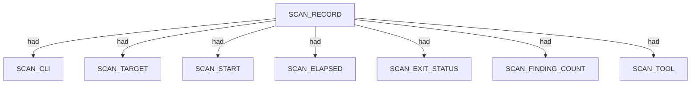

### `SCAN_CLI`

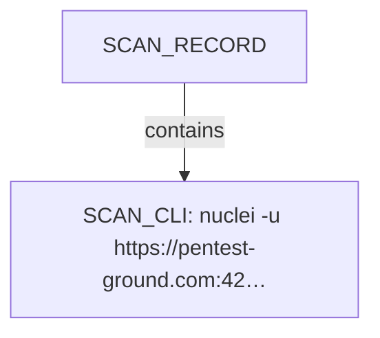

| Nugget | Value |
| --- | --- |
| `SCAN_CLI` | `nuclei -u https://pentest-ground.com:4280 -silent -jsonl -omit-raw -omit-template -t .tools/nuclei-templates -tags tech -severity info -no-interactsh -etags dos,fuzz,misc -duc -retries 1 -c 25 -timeout 15 -jle .docs/docs-for-cli-tools/exploration_scratch/nuclei/pg_dvwa_tech_fingerprint.jsonl` |

### `SCAN_TARGET`

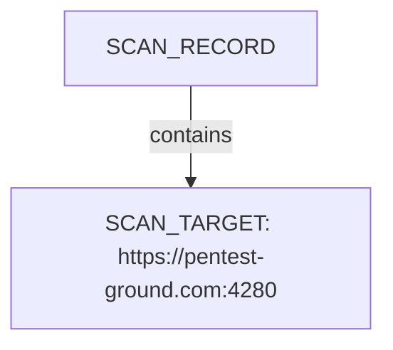

| Nugget | Value |
| --- | --- |
| `SCAN_TARGET` | `https://pentest-ground.com:4280` |

### `SCAN_START`

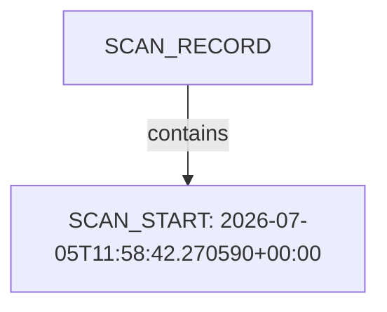

| Nugget | Value |
| --- | --- |
| `SCAN_START` | `2026-07-05T11:58:42.270590+00:00` |

### `SCAN_ELAPSED`

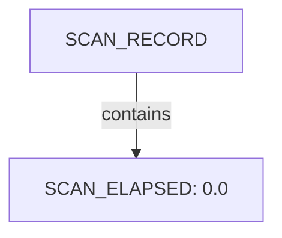

| Nugget | Value |
| --- | --- |
| `SCAN_ELAPSED` | `0.0` |

### `SCAN_EXIT_STATUS`

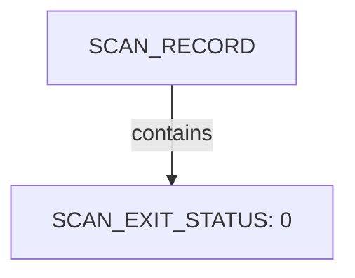

| Nugget | Value |
| --- | --- |
| `SCAN_EXIT_STATUS` | `0` |

### `SCAN_FINDING_COUNT`

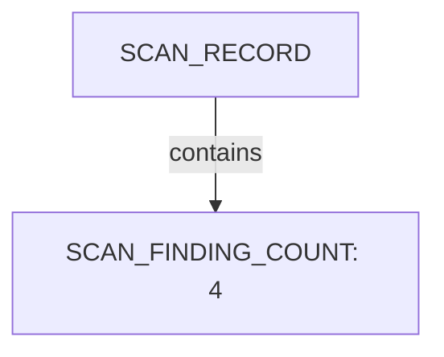

| Nugget | Value |
| --- | --- |
| `SCAN_FINDING_COUNT` | `4` |

### `SCAN_TOOL`

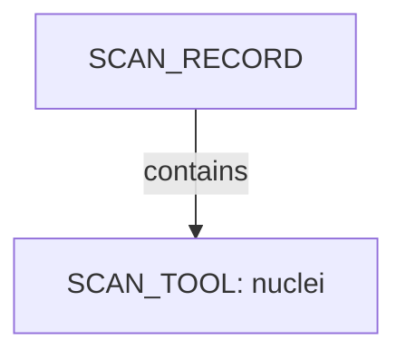

| Nugget | Value |
| --- | --- |
| `SCAN_TOOL` | `nuclei` |

## Host

Qualified HOST endpoints own category trees for networks, applications, environment, and security findings. This scan includes **2** Host root node(s) (e.g. `https://pentest-ground.com:4280`, `pentest-ground.com`). Linked structures: `SECURITY`.

### Structure overview

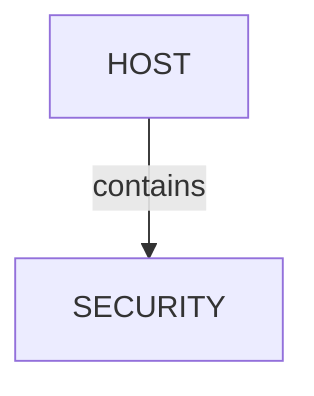

### `SECURITY`

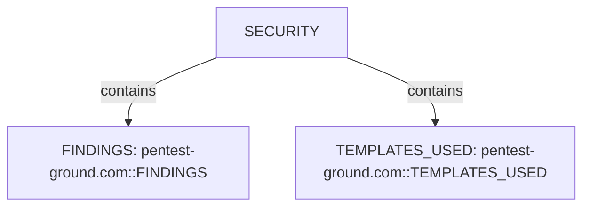

| Nugget | Value |
| --- | --- |
| `FINDINGS` | `pentest-ground.com::FINDINGS` |
| `TEMPLATES_USED` | `pentest-ground.com::TEMPLATES_USED` |

## Services and ports

APPLICATION services listen-to PORT entities under NETWORKS/TRANSPORT. This scan includes **1** Services and ports root node(s) (e.g. `pentest-ground.com:4280`). Linked structures: no child categories.

### Structure overview

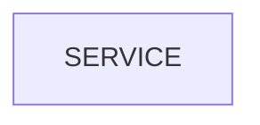

### Values

| Nugget | Value |
| --- | --- |
| `SERVICE` | `pentest-ground.com:4280` |

## Security findings

SECURITY under HOST holds FINDINGS severity buckets, template inventory, and vulnerability observations. This scan includes **1** Security findings root node(s) (e.g. `pentest-ground.com::SECURITY`). Linked structures: `TEMPLATES_USED`, `FINDINGS`.

### Structure overview

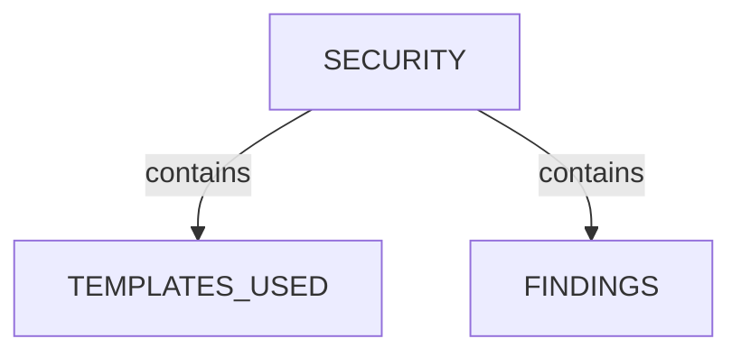

### `TEMPLATES_USED`

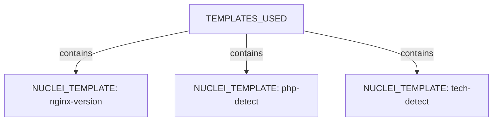

| Nugget | Value |
| --- | --- |
| `NUCLEI_TEMPLATE` | `nginx-version` |
| `NUCLEI_TEMPLATE` | `php-detect` |
| `NUCLEI_TEMPLATE` | `tech-detect` |

### `FINDINGS`

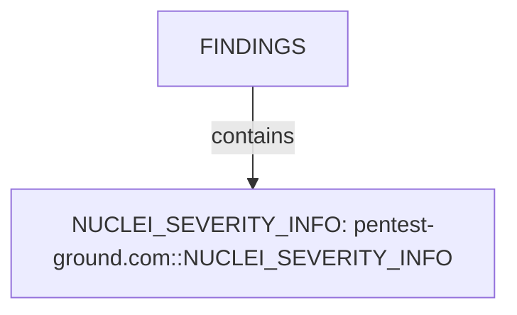

| Nugget | Value |
| --- | --- |
| `NUCLEI_SEVERITY_INFO` | `pentest-ground.com::NUCLEI_SEVERITY_INFO` |

## Conclusion

See the appendix for the full node and edge inventory.

## Appendix

### Nodes

| Nugget | Value |
| --- | --- |
| `FINDINGS` | `pentest-ground.com::FINDINGS` |
| `HOST` | `https://pentest-ground.com:4280` |
| `HOST` | `pentest-ground.com` |
| `NUCLEI_EXTRACTED_RESULTS` | `8.5.7` |
| `NUCLEI_EXTRACTED_RESULTS` | `nginx/1.31.2` |
| `NUCLEI_FINDING` | `nginx-version:https://pentest-ground.com:4280:2026-07-05T21:13:28.5772446+10:00` |
| `NUCLEI_FINDING` | `php-detect:https://pentest-ground.com:4280:2026-07-05T21:13:28.5816208+10:00` |
| `NUCLEI_FINDING` | `tech-detect:https://pentest-ground.com:4280:2026-07-05T21:13:46.4923374+10:00` |
| `NUCLEI_FINDING` | `tech-detect:https://pentest-ground.com:4280:2026-07-05T21:13:46.4928817+10:00` |
| `NUCLEI_FINDING_HOST` | `pentest-ground.com` |
| `NUCLEI_FINDING_IP` | `178.79.134.182` |
| `NUCLEI_FINDING_PORT` | `4280` |
| `NUCLEI_FINDING_PROTOCOL` | `http` |
| `NUCLEI_FINDING_TIMESTAMP` | `2026-07-05T21:13:28.5772446+10:00` |
| `NUCLEI_FINDING_TIMESTAMP` | `2026-07-05T21:13:28.5816208+10:00` |
| `NUCLEI_FINDING_TIMESTAMP` | `2026-07-05T21:13:46.4923374+10:00` |
| `NUCLEI_FINDING_TIMESTAMP` | `2026-07-05T21:13:46.4928817+10:00` |
| `NUCLEI_FINDING_URL` | `https://pentest-ground.com:4280` |
| `NUCLEI_MATCHED_AT` | `https://pentest-ground.com:4280` |
| `NUCLEI_MATCHER_NAME` | `nginx` |
| `NUCLEI_MATCHER_NAME` | `php` |
| `NUCLEI_MATCHER_STATUS` | `True` |
| `NUCLEI_SEVERITY_INFO` | `pentest-ground.com::NUCLEI_SEVERITY_INFO` |
| `NUCLEI_TEMPLATE` | `nginx-version` |
| `NUCLEI_TEMPLATE` | `php-detect` |
| `NUCLEI_TEMPLATE` | `tech-detect` |
| `NUCLEI_TEMPLATE_AUTHOR` | `hakluke, righettod, matejsmycka` |
| `NUCLEI_TEMPLATE_AUTHOR` | `philippedelteil, daffainfo` |
| `NUCLEI_TEMPLATE_AUTHOR` | `y0no` |
| `NUCLEI_TEMPLATE_ID` | `nginx-version` |
| `NUCLEI_TEMPLATE_ID` | `php-detect` |
| `NUCLEI_TEMPLATE_ID` | `tech-detect` |
| `NUCLEI_TEMPLATE_NAME` | `Nginx version detect` |
| `NUCLEI_TEMPLATE_NAME` | `PHP Detect` |
| `NUCLEI_TEMPLATE_NAME` | `Wappalyzer Technology Detection` |
| `NUCLEI_TEMPLATE_PATH` | `C:\projects\spiderfeet\.tools\nuclei-templates\http\technologies\nginx\nginx-version.yaml` |
| `NUCLEI_TEMPLATE_PATH` | `C:\projects\spiderfeet\.tools\nuclei-templates\http\technologies\php-detect.yaml` |
| `NUCLEI_TEMPLATE_PATH` | `C:\projects\spiderfeet\.tools\nuclei-templates\http\technologies\tech-detect.yaml` |
| `NUCLEI_TEMPLATE_PROTOCOL` | `http` |
| `NUCLEI_TEMPLATE_TAGS` | `tech, discovery` |
| `NUCLEI_TEMPLATE_TAGS` | `tech, nginx, discovery` |
| `NUCLEI_TEMPLATE_TAGS` | `tech, php, discovery` |
| `NUCLEI_VULNERABILITY` | `nginx-version:https://pentest-ground.com:4280:2026-07-05T21:13:28.5772446+10:00` |
| `NUCLEI_VULNERABILITY` | `php-detect:https://pentest-ground.com:4280:2026-07-05T21:13:28.5816208+10:00` |
| `NUCLEI_VULNERABILITY` | `tech-detect:https://pentest-ground.com:4280:2026-07-05T21:13:46.4923374+10:00` |
| `NUCLEI_VULNERABILITY` | `tech-detect:https://pentest-ground.com:4280:2026-07-05T21:13:46.4928817+10:00` |
| `NUCLEI_VULN_CPE` | `cpe:2.3:a:php:php:*:*:*:*:*:*:*:*` |
| `NUCLEI_VULN_DESCRIPTION` | `Some nginx servers have the version on the response header. Useful when you need to find specific CVEs on your targets.` |
| `NUCLEI_VULN_PRODUCT` | `php` |
| `NUCLEI_VULN_SEVERITY` | `info` |
| `NUCLEI_VULN_TAGS` | `tech, discovery` |
| `NUCLEI_VULN_TAGS` | `tech, nginx, discovery` |
| `NUCLEI_VULN_TAGS` | `tech, php, discovery` |
| `NUCLEI_VULN_VENDOR` | `php` |
| `SCAN_CLI` | `nuclei -u https://pentest-ground.com:4280 -silent -jsonl -omit-raw -omit-template -t .tools/nuclei-templates -tags tech -severity info -no-interactsh -etags dos,fuzz,misc -duc -retries 1 -c 25 -timeout 15 -jle .docs/docs-for-cli-tools/exploration_scratch/nuclei/pg_dvwa_tech_fingerprint.jsonl` |
| `SCAN_ELAPSED` | `0.0` |
| `SCAN_EXIT_STATUS` | `0` |
| `SCAN_FINDING_COUNT` | `4` |
| `SCAN_RECORD` | `nuclei:https://pentest-ground.com:4280:nuclei -u https://pentest-ground.com:4280 -silent -jsonl -omit-raw -omit-template -t .tools/nuclei-templates -tags tech -severity info -no-interactsh -etags dos,fuzz,misc -duc -retries 1 -c 25 -timeout 15 -jle .docs/docs-for-cli-tools/exploration_scratch/nuclei/pg_dvwa_tech_fingerprint.jsonl` |
| `SCAN_START` | `2026-07-05T11:58:42.270590+00:00` |
| `SCAN_TARGET` | `https://pentest-ground.com:4280` |
| `SCAN_TOOL` | `nuclei` |
| `SECURITY` | `pentest-ground.com::SECURITY` |
| `SERVICE` | `pentest-ground.com:4280` |
| `TEMPLATES_USED` | `pentest-ground.com::TEMPLATES_USED` |
| `VULNERABILITY_GENERAL` | `Nginx version detect` |
| `VULNERABILITY_GENERAL` | `PHP Detect` |
| `VULNERABILITY_GENERAL` | `Wappalyzer Technology Detection` |

### Edges

| Source | Relation | Target |
| --- | --- | --- |
| `SCAN_RECORD` | `had` | `SCAN_CLI` |
| `SCAN_RECORD` | `had` | `SCAN_TARGET` |
| `SCAN_RECORD` | `had` | `SCAN_START` |
| `SCAN_RECORD` | `had` | `SCAN_ELAPSED` |
| `SCAN_RECORD` | `had` | `SCAN_EXIT_STATUS` |
| `SCAN_RECORD` | `had` | `SCAN_FINDING_COUNT` |
| `SCAN_RECORD` | `had` | `SCAN_TOOL` |
| `SCAN_RECORD` | `contains` | `HOST` |
| `HOST` | `contains` | `SECURITY` |
| `SECURITY` | `contains` | `TEMPLATES_USED` |
| `SECURITY` | `contains` | `FINDINGS` |
| `FINDINGS` | `contains` | `NUCLEI_SEVERITY_INFO` |
| `TEMPLATES_USED` | `contains` | `NUCLEI_TEMPLATE` |
| `NUCLEI_TEMPLATE` | `had` | `NUCLEI_TEMPLATE_ID` |
| `NUCLEI_TEMPLATE` | `had` | `NUCLEI_TEMPLATE_NAME` |
| `NUCLEI_TEMPLATE` | `had` | `NUCLEI_TEMPLATE_PATH` |
| `NUCLEI_TEMPLATE` | `had` | `NUCLEI_TEMPLATE_AUTHOR` |
| `NUCLEI_TEMPLATE` | `had` | `NUCLEI_TEMPLATE_TAGS` |
| `NUCLEI_TEMPLATE` | `had` | `NUCLEI_TEMPLATE_PROTOCOL` |
| `NUCLEI_SEVERITY_INFO` | `contains` | `NUCLEI_FINDING` |
| `NUCLEI_FINDING` | `had` | `NUCLEI_TEMPLATE_ID` |
| `NUCLEI_FINDING` | `had` | `NUCLEI_MATCHED_AT` |
| `NUCLEI_FINDING` | `had` | `NUCLEI_FINDING_TIMESTAMP` |
| `NUCLEI_FINDING` | `had` | `NUCLEI_FINDING_HOST` |
| `NUCLEI_FINDING` | `had` | `NUCLEI_FINDING_IP` |
| `NUCLEI_FINDING` | `had` | `NUCLEI_FINDING_PORT` |
| `NUCLEI_FINDING` | `had` | `NUCLEI_FINDING_URL` |
| `NUCLEI_FINDING` | `had` | `NUCLEI_FINDING_PROTOCOL` |
| `NUCLEI_FINDING` | `had` | `NUCLEI_MATCHER_STATUS` |
| `NUCLEI_FINDING` | `had` | `NUCLEI_EXTRACTED_RESULTS` |
| `NUCLEI_FINDING` | `contains` | `NUCLEI_VULNERABILITY` |
| `NUCLEI_VULNERABILITY` | `had` | `VULNERABILITY_GENERAL` |
| `NUCLEI_VULNERABILITY` | `had` | `NUCLEI_VULN_DESCRIPTION` |
| `NUCLEI_VULNERABILITY` | `had` | `NUCLEI_VULN_SEVERITY` |
| `NUCLEI_VULNERABILITY` | `had` | `NUCLEI_VULN_TAGS` |
| `NUCLEI_FINDING` | `had` | `NUCLEI_TEMPLATE` |
| `HOST` | `contains` | `SERVICE` |
| `SERVICE` | `had` | `NUCLEI_FINDING_PORT` |
| `SERVICE` | `had` | `NUCLEI_VULNERABILITY` |
| `HOST` | `had` | `NUCLEI_VULNERABILITY` |
| `NUCLEI_VULNERABILITY` | `had` | `NUCLEI_VULN_VENDOR` |
| `NUCLEI_VULNERABILITY` | `had` | `NUCLEI_VULN_PRODUCT` |
| `NUCLEI_VULNERABILITY` | `had` | `NUCLEI_VULN_CPE` |
| `NUCLEI_FINDING` | `had` | `NUCLEI_MATCHER_NAME` |
---

*OS-Intel Scan*
