# Nuclei scan narrative — `pg_graphql_graphql_misconfig`

## Introduction

Nuclei findings are grouped under each host's SECURITY container with severity buckets, deduplicated templates, and per-record findings.

## Scan

Every examination has one SCAN_RECORD with scan descriptors linked via had. This scan includes **1** Scan root node(s) (e.g. `nuclei:https://pentest-ground.com:5013:nuclei -u https://pentest-ground.com:5013 -silent -jsonl -omit-raw -omit-template -t .tools/nuclei-templates -tags graphql -no-interactsh -etags dos,fuzz,misc -duc -retries 1 -c 25 -timeout 15 -jle .docs/docs-for-cli-tools/exploration_scratch/nuclei/pg_graphql_graphql_misconfig.jsonl`). Linked structures: `SCAN_CLI`, `SCAN_TARGET`, `SCAN_START`, `SCAN_ELAPSED`, `SCAN_EXIT_STATUS`, `SCAN_FINDING_COUNT`.

### Structure overview

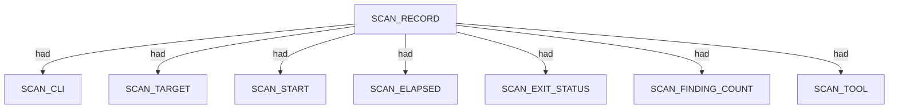

### `SCAN_CLI`

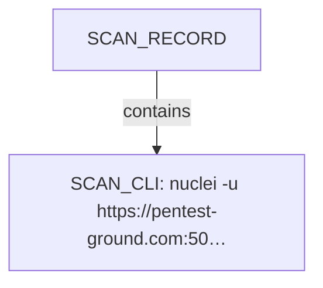

| Nugget | Value |
| --- | --- |
| `SCAN_CLI` | `nuclei -u https://pentest-ground.com:5013 -silent -jsonl -omit-raw -omit-template -t .tools/nuclei-templates -tags graphql -no-interactsh -etags dos,fuzz,misc -duc -retries 1 -c 25 -timeout 15 -jle .docs/docs-for-cli-tools/exploration_scratch/nuclei/pg_graphql_graphql_misconfig.jsonl` |

### `SCAN_TARGET`

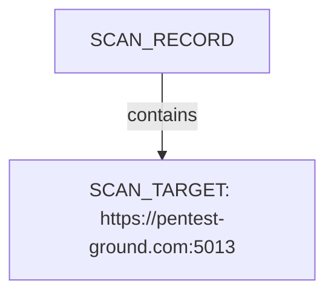

| Nugget | Value |
| --- | --- |
| `SCAN_TARGET` | `https://pentest-ground.com:5013` |

### `SCAN_START`

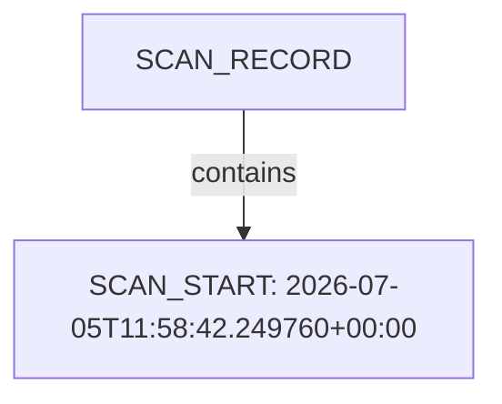

| Nugget | Value |
| --- | --- |
| `SCAN_START` | `2026-07-05T11:58:42.249760+00:00` |

### `SCAN_ELAPSED`

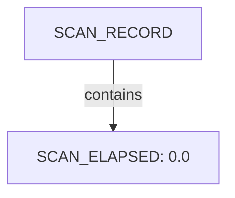

| Nugget | Value |
| --- | --- |
| `SCAN_ELAPSED` | `0.0` |

### `SCAN_EXIT_STATUS`

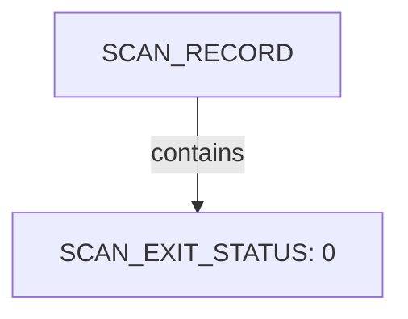

| Nugget | Value |
| --- | --- |
| `SCAN_EXIT_STATUS` | `0` |

### `SCAN_FINDING_COUNT`

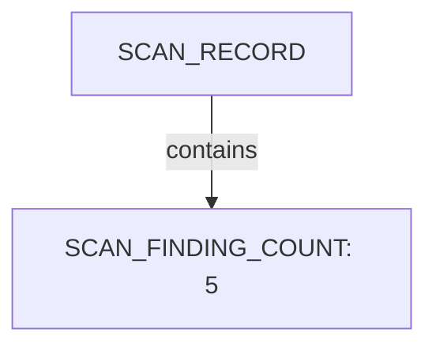

| Nugget | Value |
| --- | --- |
| `SCAN_FINDING_COUNT` | `5` |

### `SCAN_TOOL`

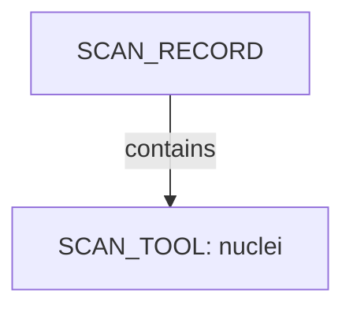

| Nugget | Value |
| --- | --- |
| `SCAN_TOOL` | `nuclei` |

## Host

Qualified HOST endpoints own category trees for networks, applications, environment, and security findings. This scan includes **2** Host root node(s) (e.g. `https://pentest-ground.com:5013`, `pentest-ground.com`). Linked structures: `SECURITY`.

### Structure overview

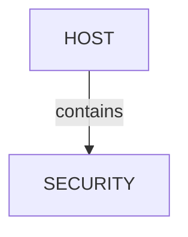

### `SECURITY`

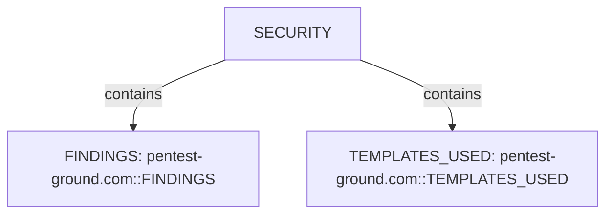

| Nugget | Value |
| --- | --- |
| `FINDINGS` | `pentest-ground.com::FINDINGS` |
| `TEMPLATES_USED` | `pentest-ground.com::TEMPLATES_USED` |

## Services and ports

APPLICATION services listen-to PORT entities under NETWORKS/TRANSPORT. This scan includes **1** Services and ports root node(s) (e.g. `pentest-ground.com:5013`). Linked structures: no child categories.

### Structure overview

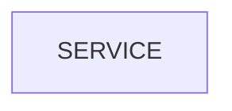

### Values

| Nugget | Value |
| --- | --- |
| `SERVICE` | `pentest-ground.com:5013` |

## Security findings

SECURITY under HOST holds FINDINGS severity buckets, template inventory, and vulnerability observations. This scan includes **1** Security findings root node(s) (e.g. `pentest-ground.com::SECURITY`). Linked structures: `TEMPLATES_USED`, `FINDINGS`.

### Structure overview

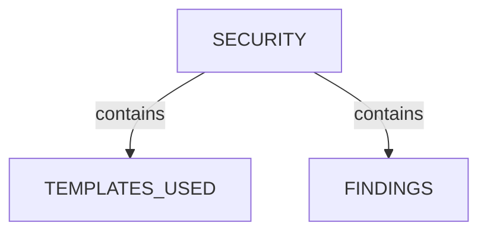

### `TEMPLATES_USED`

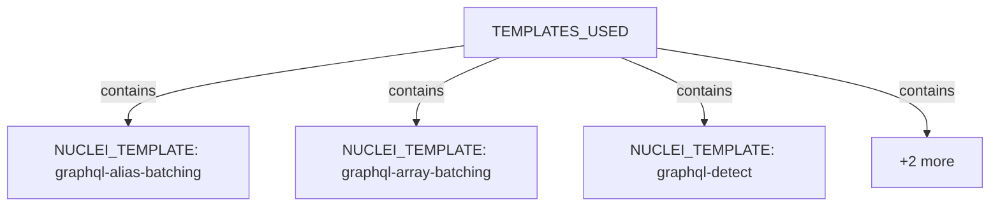

| Nugget | Value |
| --- | --- |
| `NUCLEI_TEMPLATE` | `graphql-alias-batching` |
| `NUCLEI_TEMPLATE` | `graphql-array-batching` |
| `NUCLEI_TEMPLATE` | `graphql-detect` |
| `NUCLEI_TEMPLATE` | `graphql-field-suggestion` |
| `NUCLEI_TEMPLATE` | `graphql-get-method` |

### `FINDINGS`

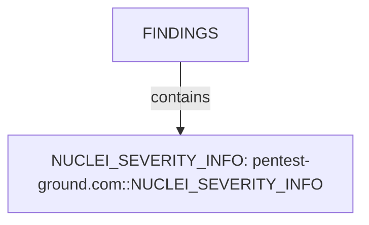

| Nugget | Value |
| --- | --- |
| `NUCLEI_SEVERITY_INFO` | `pentest-ground.com::NUCLEI_SEVERITY_INFO` |

## Conclusion

See the appendix for the full node and edge inventory.

## Appendix

### Nodes

| Nugget | Value |
| --- | --- |
| `FINDINGS` | `pentest-ground.com::FINDINGS` |
| `HOST` | `https://pentest-ground.com:5013` |
| `HOST` | `pentest-ground.com` |
| `NUCLEI_FINDING` | `graphql-alias-batching:https://pentest-ground.com:5013/graphql:2026-07-05T21:20:55.0820086+10:00` |
| `NUCLEI_FINDING` | `graphql-array-batching:https://pentest-ground.com:5013/graphql:2026-07-05T21:20:54.8728928+10:00` |
| `NUCLEI_FINDING` | `graphql-detect:https://pentest-ground.com:5013/graphiql:2026-07-05T21:20:54.9333934+10:00` |
| `NUCLEI_FINDING` | `graphql-field-suggestion:https://pentest-ground.com:5013/graphql:2026-07-05T21:20:54.9665974+10:00` |
| `NUCLEI_FINDING` | `graphql-get-method:https://pentest-ground.com:5013/graphql?query={__typename}:2026-07-05T21:20:58.3170497+10:00` |
| `NUCLEI_FINDING_HOST` | `pentest-ground.com` |
| `NUCLEI_FINDING_IP` | `178.79.134.182` |
| `NUCLEI_FINDING_PORT` | `5013` |
| `NUCLEI_FINDING_PROTOCOL` | `http` |
| `NUCLEI_FINDING_TIMESTAMP` | `2026-07-05T21:20:54.8728928+10:00` |
| `NUCLEI_FINDING_TIMESTAMP` | `2026-07-05T21:20:54.9333934+10:00` |
| `NUCLEI_FINDING_TIMESTAMP` | `2026-07-05T21:20:54.9665974+10:00` |
| `NUCLEI_FINDING_TIMESTAMP` | `2026-07-05T21:20:55.0820086+10:00` |
| `NUCLEI_FINDING_TIMESTAMP` | `2026-07-05T21:20:58.3170497+10:00` |
| `NUCLEI_FINDING_URL` | `https://pentest-ground.com:5013` |
| `NUCLEI_MATCHED_AT` | `https://pentest-ground.com:5013/graphiql` |
| `NUCLEI_MATCHED_AT` | `https://pentest-ground.com:5013/graphql` |
| `NUCLEI_MATCHED_AT` | `https://pentest-ground.com:5013/graphql?query={__typename}` |
| `NUCLEI_MATCHER_STATUS` | `True` |
| `NUCLEI_SEVERITY_INFO` | `pentest-ground.com::NUCLEI_SEVERITY_INFO` |
| `NUCLEI_TEMPLATE` | `graphql-alias-batching` |
| `NUCLEI_TEMPLATE` | `graphql-array-batching` |
| `NUCLEI_TEMPLATE` | `graphql-detect` |
| `NUCLEI_TEMPLATE` | `graphql-field-suggestion` |
| `NUCLEI_TEMPLATE` | `graphql-get-method` |
| `NUCLEI_TEMPLATE_AUTHOR` | `dolev farhi` |
| `NUCLEI_TEMPLATE_AUTHOR` | `nkxxkn, elsfa7110, ofjaaah, exceed` |
| `NUCLEI_TEMPLATE_ID` | `graphql-alias-batching` |
| `NUCLEI_TEMPLATE_ID` | `graphql-array-batching` |
| `NUCLEI_TEMPLATE_ID` | `graphql-detect` |
| `NUCLEI_TEMPLATE_ID` | `graphql-field-suggestion` |
| `NUCLEI_TEMPLATE_ID` | `graphql-get-method` |
| `NUCLEI_TEMPLATE_NAME` | `GraphQL API Detection` |
| `NUCLEI_TEMPLATE_NAME` | `GraphQL Alias-based Batching` |
| `NUCLEI_TEMPLATE_NAME` | `GraphQL Array-based Batching` |
| `NUCLEI_TEMPLATE_NAME` | `GraphQL CSRF / GET method` |
| `NUCLEI_TEMPLATE_NAME` | `GraphQL Field Suggestion Information Disclosure` |
| `NUCLEI_TEMPLATE_PATH` | `C:\projects\spiderfeet\.tools\nuclei-templates\http\misconfiguration\graphql\graphql-alias-batching.yaml` |
| `NUCLEI_TEMPLATE_PATH` | `C:\projects\spiderfeet\.tools\nuclei-templates\http\misconfiguration\graphql\graphql-array-batching.yaml` |
| `NUCLEI_TEMPLATE_PATH` | `C:\projects\spiderfeet\.tools\nuclei-templates\http\misconfiguration\graphql\graphql-field-suggestion.yaml` |
| `NUCLEI_TEMPLATE_PATH` | `C:\projects\spiderfeet\.tools\nuclei-templates\http\misconfiguration\graphql\graphql-get-method.yaml` |
| `NUCLEI_TEMPLATE_PATH` | `C:\projects\spiderfeet\.tools\nuclei-templates\http\technologies\graphql-detect.yaml` |
| `NUCLEI_TEMPLATE_PROTOCOL` | `http` |
| `NUCLEI_TEMPLATE_TAGS` | `graphql, misconfig, vuln` |
| `NUCLEI_TEMPLATE_TAGS` | `tech, graphql, discovery` |
| `NUCLEI_VULNERABILITY` | `graphql-alias-batching:https://pentest-ground.com:5013/graphql:2026-07-05T21:20:55.0820086+10:00` |
| `NUCLEI_VULNERABILITY` | `graphql-array-batching:https://pentest-ground.com:5013/graphql:2026-07-05T21:20:54.8728928+10:00` |
| `NUCLEI_VULNERABILITY` | `graphql-detect:https://pentest-ground.com:5013/graphiql:2026-07-05T21:20:54.9333934+10:00` |
| `NUCLEI_VULNERABILITY` | `graphql-field-suggestion:https://pentest-ground.com:5013/graphql:2026-07-05T21:20:54.9665974+10:00` |
| `NUCLEI_VULNERABILITY` | `graphql-get-method:https://pentest-ground.com:5013/graphql?query={__typename}:2026-07-05T21:20:58.3170497+10:00` |
| `NUCLEI_VULN_CPE` | `cpe:2.3:a:graphql:playground:*:*:*:*:node.js:*:*:*` |
| `NUCLEI_VULN_DESCRIPTION` | `Cross Site Request Forgery happens when an external website gains ability to make API calls impersonating an user if he visits the website while being authenticated to your API. Allowing API calls through GET requests can lead to CSRF attacks, because cookies are added automatically to GET requests by the browser. ` |
| `NUCLEI_VULN_DESCRIPTION` | `GraphQL supports aliasing of multiple sub-queries into a single queries. This allows users to request multiple objects or multiple instances of objects efficiently. However, an attacker can leverage this feature to evade many security measures, including rate limit. ` |
| `NUCLEI_VULN_DESCRIPTION` | `If introspection is disabled on your target, Field Suggestion can allow users to still earn information on the GraphQL schema. By default, GraphQL backends have a feature for fields and operations suggestions. If you try to query a field but you have made a typo, GraphQL will attempt to suggest fields that are similar to the initial attempt. ` |
| `NUCLEI_VULN_DESCRIPTION` | `Some GraphQL engines support batching of multiple queries into a single request. This allows users to request multiple objects or multiple instances of objects efficiently. However, an attacker can leverage this feature to evade many security measures, including Rate Limit. ` |
| `NUCLEI_VULN_PRODUCT` | `playground` |
| `NUCLEI_VULN_REMEDIATION` | `Deactivate or limit Batching in your GraphQL engine. ` |
| `NUCLEI_VULN_REMEDIATION` | `Limit queries aliasing in your GraphQL Engine to ensure mitigation of aliasing-based attacks. ` |
| `NUCLEI_VULN_SEVERITY` | `info` |
| `NUCLEI_VULN_TAGS` | `graphql, misconfig, vuln` |
| `NUCLEI_VULN_TAGS` | `tech, graphql, discovery` |
| `NUCLEI_VULN_VENDOR` | `graphql` |
| `SCAN_CLI` | `nuclei -u https://pentest-ground.com:5013 -silent -jsonl -omit-raw -omit-template -t .tools/nuclei-templates -tags graphql -no-interactsh -etags dos,fuzz,misc -duc -retries 1 -c 25 -timeout 15 -jle .docs/docs-for-cli-tools/exploration_scratch/nuclei/pg_graphql_graphql_misconfig.jsonl` |
| `SCAN_ELAPSED` | `0.0` |
| `SCAN_EXIT_STATUS` | `0` |
| `SCAN_FINDING_COUNT` | `5` |
| `SCAN_RECORD` | `nuclei:https://pentest-ground.com:5013:nuclei -u https://pentest-ground.com:5013 -silent -jsonl -omit-raw -omit-template -t .tools/nuclei-templates -tags graphql -no-interactsh -etags dos,fuzz,misc -duc -retries 1 -c 25 -timeout 15 -jle .docs/docs-for-cli-tools/exploration_scratch/nuclei/pg_graphql_graphql_misconfig.jsonl` |
| `SCAN_START` | `2026-07-05T11:58:42.249760+00:00` |
| `SCAN_TARGET` | `https://pentest-ground.com:5013` |
| `SCAN_TOOL` | `nuclei` |
| `SECURITY` | `pentest-ground.com::SECURITY` |
| `SERVICE` | `pentest-ground.com:5013` |
| `TEMPLATES_USED` | `pentest-ground.com::TEMPLATES_USED` |
| `VULNERABILITY_GENERAL` | `GraphQL API Detection` |
| `VULNERABILITY_GENERAL` | `GraphQL Alias-based Batching` |
| `VULNERABILITY_GENERAL` | `GraphQL Array-based Batching` |
| `VULNERABILITY_GENERAL` | `GraphQL CSRF / GET method` |
| `VULNERABILITY_GENERAL` | `GraphQL Field Suggestion Information Disclosure` |

### Edges

| Source | Relation | Target |
| --- | --- | --- |
| `SCAN_RECORD` | `had` | `SCAN_CLI` |
| `SCAN_RECORD` | `had` | `SCAN_TARGET` |
| `SCAN_RECORD` | `had` | `SCAN_START` |
| `SCAN_RECORD` | `had` | `SCAN_ELAPSED` |
| `SCAN_RECORD` | `had` | `SCAN_EXIT_STATUS` |
| `SCAN_RECORD` | `had` | `SCAN_FINDING_COUNT` |
| `SCAN_RECORD` | `had` | `SCAN_TOOL` |
| `SCAN_RECORD` | `contains` | `HOST` |
| `HOST` | `contains` | `SECURITY` |
| `SECURITY` | `contains` | `TEMPLATES_USED` |
| `SECURITY` | `contains` | `FINDINGS` |
| `FINDINGS` | `contains` | `NUCLEI_SEVERITY_INFO` |
| `TEMPLATES_USED` | `contains` | `NUCLEI_TEMPLATE` |
| `NUCLEI_TEMPLATE` | `had` | `NUCLEI_TEMPLATE_ID` |
| `NUCLEI_TEMPLATE` | `had` | `NUCLEI_TEMPLATE_NAME` |
| `NUCLEI_TEMPLATE` | `had` | `NUCLEI_TEMPLATE_PATH` |
| `NUCLEI_TEMPLATE` | `had` | `NUCLEI_TEMPLATE_AUTHOR` |
| `NUCLEI_TEMPLATE` | `had` | `NUCLEI_TEMPLATE_TAGS` |
| `NUCLEI_TEMPLATE` | `had` | `NUCLEI_TEMPLATE_PROTOCOL` |
| `NUCLEI_SEVERITY_INFO` | `contains` | `NUCLEI_FINDING` |
| `NUCLEI_FINDING` | `had` | `NUCLEI_TEMPLATE_ID` |
| `NUCLEI_FINDING` | `had` | `NUCLEI_MATCHED_AT` |
| `NUCLEI_FINDING` | `had` | `NUCLEI_FINDING_TIMESTAMP` |
| `NUCLEI_FINDING` | `had` | `NUCLEI_FINDING_HOST` |
| `NUCLEI_FINDING` | `had` | `NUCLEI_FINDING_IP` |
| `NUCLEI_FINDING` | `had` | `NUCLEI_FINDING_PORT` |
| `NUCLEI_FINDING` | `had` | `NUCLEI_FINDING_URL` |
| `NUCLEI_FINDING` | `had` | `NUCLEI_FINDING_PROTOCOL` |
| `NUCLEI_FINDING` | `had` | `NUCLEI_MATCHER_STATUS` |
| `NUCLEI_FINDING` | `contains` | `NUCLEI_VULNERABILITY` |
| `NUCLEI_VULNERABILITY` | `had` | `VULNERABILITY_GENERAL` |
| `NUCLEI_VULNERABILITY` | `had` | `NUCLEI_VULN_DESCRIPTION` |
| `NUCLEI_VULNERABILITY` | `had` | `NUCLEI_VULN_REMEDIATION` |
| `NUCLEI_VULNERABILITY` | `had` | `NUCLEI_VULN_SEVERITY` |
| `NUCLEI_VULNERABILITY` | `had` | `NUCLEI_VULN_TAGS` |
| `NUCLEI_FINDING` | `had` | `NUCLEI_TEMPLATE` |
| `HOST` | `contains` | `SERVICE` |
| `SERVICE` | `had` | `NUCLEI_FINDING_PORT` |
| `SERVICE` | `had` | `NUCLEI_VULNERABILITY` |
| `HOST` | `had` | `NUCLEI_VULNERABILITY` |
| `NUCLEI_VULNERABILITY` | `had` | `NUCLEI_VULN_VENDOR` |
| `NUCLEI_VULNERABILITY` | `had` | `NUCLEI_VULN_PRODUCT` |
| `NUCLEI_VULNERABILITY` | `had` | `NUCLEI_VULN_CPE` |
---

*OS-Intel Scan*
