# Nuclei scan narrative — `pg_shadowlogic_weblogic_cves`

## Introduction

Nuclei findings are grouped under each host's SECURITY container with severity buckets, deduplicated templates, and per-record findings.

## Scan

Every examination has one SCAN_RECORD with scan descriptors linked via had. This scan includes **1** Scan root node(s) (e.g. `nuclei:https://pentest-ground.com:7001:nuclei -u https://pentest-ground.com:7001 -silent -jsonl -omit-raw -omit-template -t .tools/nuclei-templates -tags weblogic,cve -no-interactsh -etags dos,fuzz,misc -duc -retries 1 -c 25 -timeout 15 -jle .docs/docs-for-cli-tools/exploration_scratch/nuclei/pg_shadowlogic_weblogic_cves.jsonl`). Linked structures: `SCAN_CLI`, `SCAN_TARGET`, `SCAN_START`, `SCAN_ELAPSED`, `SCAN_EXIT_STATUS`, `SCAN_FINDING_COUNT`.

### Structure overview

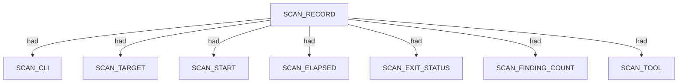

### `SCAN_CLI`

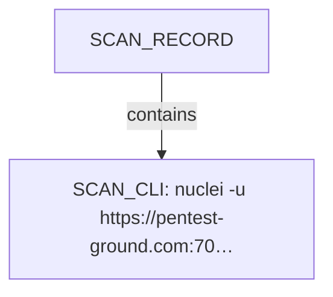

| Nugget | Value |
| --- | --- |
| `SCAN_CLI` | `nuclei -u https://pentest-ground.com:7001 -silent -jsonl -omit-raw -omit-template -t .tools/nuclei-templates -tags weblogic,cve -no-interactsh -etags dos,fuzz,misc -duc -retries 1 -c 25 -timeout 15 -jle .docs/docs-for-cli-tools/exploration_scratch/nuclei/pg_shadowlogic_weblogic_cves.jsonl` |

### `SCAN_TARGET`

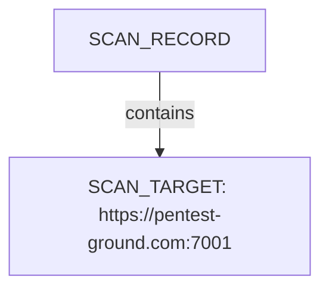

| Nugget | Value |
| --- | --- |
| `SCAN_TARGET` | `https://pentest-ground.com:7001` |

### `SCAN_START`

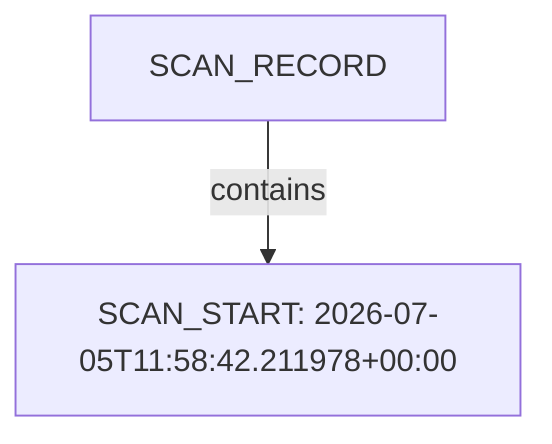

| Nugget | Value |
| --- | --- |
| `SCAN_START` | `2026-07-05T11:58:42.211978+00:00` |

### `SCAN_ELAPSED`

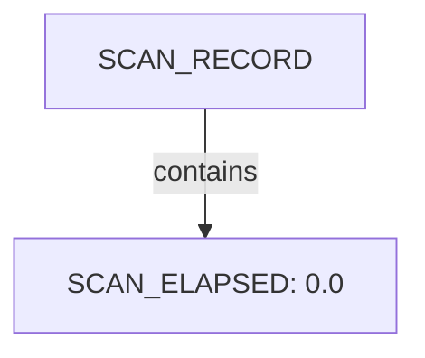

| Nugget | Value |
| --- | --- |
| `SCAN_ELAPSED` | `0.0` |

### `SCAN_EXIT_STATUS`

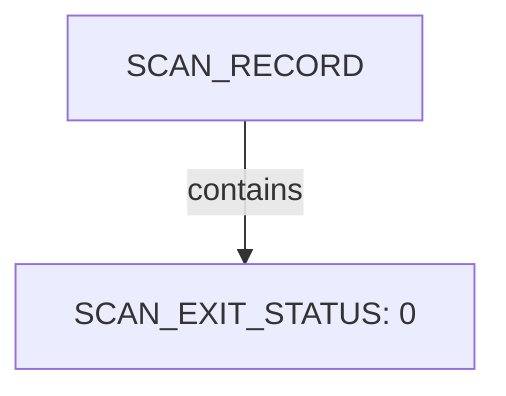

| Nugget | Value |
| --- | --- |
| `SCAN_EXIT_STATUS` | `0` |

### `SCAN_FINDING_COUNT`

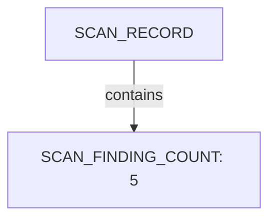

| Nugget | Value |
| --- | --- |
| `SCAN_FINDING_COUNT` | `5` |

### `SCAN_TOOL`

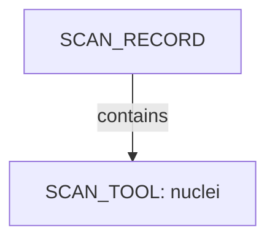

| Nugget | Value |
| --- | --- |
| `SCAN_TOOL` | `nuclei` |

## Host

Qualified HOST endpoints own category trees for networks, applications, environment, and security findings. This scan includes **2** Host root node(s) (e.g. `https://pentest-ground.com:7001`, `pentest-ground.com`). Linked structures: `SECURITY`.

### Structure overview

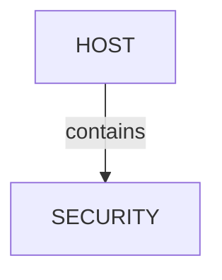

### `SECURITY`

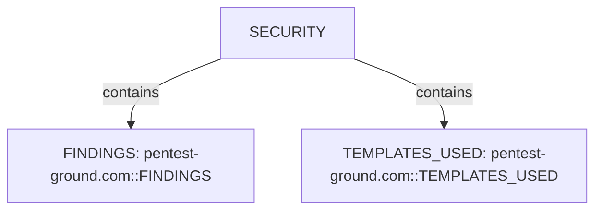

| Nugget | Value |
| --- | --- |
| `FINDINGS` | `pentest-ground.com::FINDINGS` |
| `TEMPLATES_USED` | `pentest-ground.com::TEMPLATES_USED` |

## Services and ports

APPLICATION services listen-to PORT entities under NETWORKS/TRANSPORT. This scan includes **1** Services and ports root node(s) (e.g. `pentest-ground.com:7001`). Linked structures: no child categories.

### Structure overview

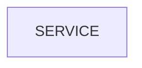

### Values

| Nugget | Value |
| --- | --- |
| `SERVICE` | `pentest-ground.com:7001` |

## Security findings

SECURITY under HOST holds FINDINGS severity buckets, template inventory, and vulnerability observations. This scan includes **1** Security findings root node(s) (e.g. `pentest-ground.com::SECURITY`). Linked structures: `TEMPLATES_USED`, `FINDINGS`.

### Structure overview

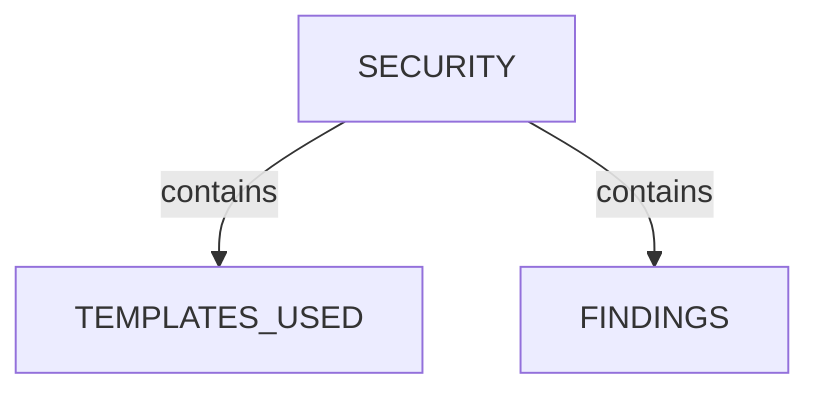

### `TEMPLATES_USED`

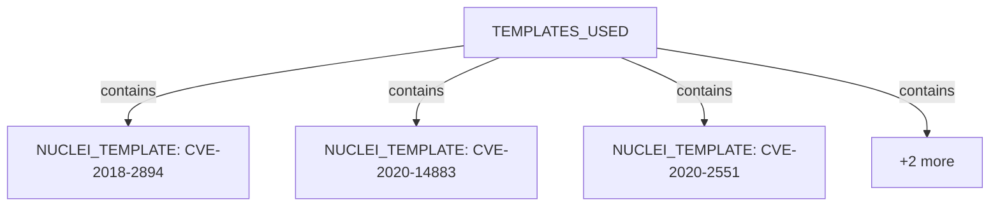

| Nugget | Value |
| --- | --- |
| `NUCLEI_TEMPLATE` | `CVE-2018-2894` |
| `NUCLEI_TEMPLATE` | `CVE-2020-14883` |
| `NUCLEI_TEMPLATE` | `CVE-2020-2551` |
| `NUCLEI_TEMPLATE` | `weblogic-detect` |
| `NUCLEI_TEMPLATE` | `weblogic-login` |

### `FINDINGS`

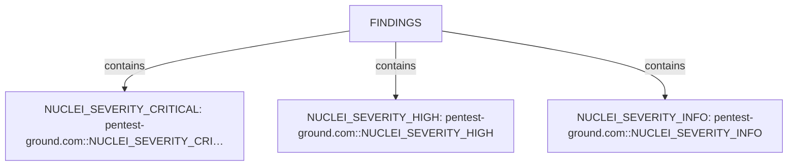

| Nugget | Value |
| --- | --- |
| `NUCLEI_SEVERITY_CRITICAL` | `pentest-ground.com::NUCLEI_SEVERITY_CRITICAL` |
| `NUCLEI_SEVERITY_HIGH` | `pentest-ground.com::NUCLEI_SEVERITY_HIGH` |
| `NUCLEI_SEVERITY_INFO` | `pentest-ground.com::NUCLEI_SEVERITY_INFO` |

## Conclusion

See the appendix for the full node and edge inventory.

## Appendix

### Nodes

| Nugget | Value |
| --- | --- |
| `FINDINGS` | `pentest-ground.com::FINDINGS` |
| `HOST` | `https://pentest-ground.com:7001` |
| `HOST` | `pentest-ground.com` |
| `NUCLEI_EXTRACTED_RESULTS` | `12.2.1.3.0` |
| `NUCLEI_FINDING` | `CVE-2018-2894:https://pentest-ground.com:7001/ws_utc/css/config/keystore/1783251120029_3G5AZCcZT5qYVA1PEoiJkkonI4L.jsp:2026-07-05T21:32:01.5655399+10:00` |
| `NUCLEI_FINDING` | `CVE-2020-14883:https://pentest-ground.com:7001/console/images/%252e%252e%252fconsole.portal:2026-07-05T21:32:10.22518+10:00` |
| `NUCLEI_FINDING` | `CVE-2020-2551:https://pentest-ground.com:7001/console/login/LoginForm.jsp:2026-07-05T21:34:15.3934195+10:00` |
| `NUCLEI_FINDING` | `weblogic-detect:https://pentest-ground.com:7001/3G5AZEk1KMyWTecav2FwtoVBKD4:2026-07-05T21:34:34.1626247+10:00` |
| `NUCLEI_FINDING` | `weblogic-login:https://pentest-ground.com:7001/console/login/LoginForm.jsp:2026-07-05T21:34:15.3944344+10:00` |
| `NUCLEI_FINDING_HOST` | `pentest-ground.com` |
| `NUCLEI_FINDING_IP` | `178.79.134.182` |
| `NUCLEI_FINDING_PORT` | `7001` |
| `NUCLEI_FINDING_PROTOCOL` | `http` |
| `NUCLEI_FINDING_TIMESTAMP` | `2026-07-05T21:32:01.5655399+10:00` |
| `NUCLEI_FINDING_TIMESTAMP` | `2026-07-05T21:32:10.22518+10:00` |
| `NUCLEI_FINDING_TIMESTAMP` | `2026-07-05T21:34:15.3934195+10:00` |
| `NUCLEI_FINDING_TIMESTAMP` | `2026-07-05T21:34:15.3944344+10:00` |
| `NUCLEI_FINDING_TIMESTAMP` | `2026-07-05T21:34:34.1626247+10:00` |
| `NUCLEI_FINDING_URL` | `https://pentest-ground.com:7001` |
| `NUCLEI_MATCHED_AT` | `https://pentest-ground.com:7001/3G5AZEk1KMyWTecav2FwtoVBKD4` |
| `NUCLEI_MATCHED_AT` | `https://pentest-ground.com:7001/console/images/%252e%252e%252fconsole.portal` |
| `NUCLEI_MATCHED_AT` | `https://pentest-ground.com:7001/console/login/LoginForm.jsp` |
| `NUCLEI_MATCHED_AT` | `https://pentest-ground.com:7001/ws_utc/css/config/keystore/1783251120029_3G5AZCcZT5qYVA1PEoiJkkonI4L.jsp` |
| `NUCLEI_MATCHER_STATUS` | `True` |
| `NUCLEI_SEVERITY_CRITICAL` | `pentest-ground.com::NUCLEI_SEVERITY_CRITICAL` |
| `NUCLEI_SEVERITY_HIGH` | `pentest-ground.com::NUCLEI_SEVERITY_HIGH` |
| `NUCLEI_SEVERITY_INFO` | `pentest-ground.com::NUCLEI_SEVERITY_INFO` |
| `NUCLEI_TEMPLATE` | `CVE-2018-2894` |
| `NUCLEI_TEMPLATE` | `CVE-2020-14883` |
| `NUCLEI_TEMPLATE` | `CVE-2020-2551` |
| `NUCLEI_TEMPLATE` | `weblogic-detect` |
| `NUCLEI_TEMPLATE` | `weblogic-login` |
| `NUCLEI_TEMPLATE_AUTHOR` | `bing0o, meme-lord` |
| `NUCLEI_TEMPLATE_AUTHOR` | `dwisiswant0` |
| `NUCLEI_TEMPLATE_AUTHOR` | `geeknik, pdteam` |
| `NUCLEI_TEMPLATE_AUTHOR` | `pdteam` |
| `NUCLEI_TEMPLATE_AUTHOR` | `pdteam, vicrack` |
| `NUCLEI_TEMPLATE_ID` | `CVE-2018-2894` |
| `NUCLEI_TEMPLATE_ID` | `CVE-2020-14883` |
| `NUCLEI_TEMPLATE_ID` | `CVE-2020-2551` |
| `NUCLEI_TEMPLATE_ID` | `weblogic-detect` |
| `NUCLEI_TEMPLATE_ID` | `weblogic-login` |
| `NUCLEI_TEMPLATE_NAME` | `Detect Weblogic` |
| `NUCLEI_TEMPLATE_NAME` | `Oracle Fusion Middleware WebLogic Server Administration Console - Remote Code Execution` |
| `NUCLEI_TEMPLATE_NAME` | `Oracle WebLogic Login Panel - Detect` |
| `NUCLEI_TEMPLATE_NAME` | `Oracle WebLogic Server - Remote Code Execution` |
| `NUCLEI_TEMPLATE_PATH` | `C:\projects\spiderfeet\.tools\nuclei-templates\http\cves\2018\CVE-2018-2894.yaml` |
| `NUCLEI_TEMPLATE_PATH` | `C:\projects\spiderfeet\.tools\nuclei-templates\http\cves\2020\CVE-2020-14883.yaml` |
| `NUCLEI_TEMPLATE_PATH` | `C:\projects\spiderfeet\.tools\nuclei-templates\http\cves\2020\CVE-2020-2551.yaml` |
| `NUCLEI_TEMPLATE_PATH` | `C:\projects\spiderfeet\.tools\nuclei-templates\http\exposed-panels\weblogic-login.yaml` |
| `NUCLEI_TEMPLATE_PATH` | `C:\projects\spiderfeet\.tools\nuclei-templates\http\technologies\weblogic-detect.yaml` |
| `NUCLEI_TEMPLATE_PROTOCOL` | `http` |
| `NUCLEI_TEMPLATE_TAGS` | `cve, cve2020, oracle, rce, weblogic, kev, packetstorm, vkev, vuln` |
| `NUCLEI_TEMPLATE_TAGS` | `cve2018, cve, oracle, weblogic, rce, vulhub, intrusive, vkev, vuln` |
| `NUCLEI_TEMPLATE_TAGS` | `cve2020, cve, oracle, weblogic, rce, unauth, kev, vkev, vuln` |
| `NUCLEI_TEMPLATE_TAGS` | `panel, oracle, weblogic, login, discovery` |
| `NUCLEI_TEMPLATE_TAGS` | `tech, weblogic, intrusive, discovery` |
| `NUCLEI_VULNERABILITY` | `CVE-2018-2894:https://pentest-ground.com:7001/ws_utc/css/config/keystore/1783251120029_3G5AZCcZT5qYVA1PEoiJkkonI4L.jsp:2026-07-05T21:32:01.5655399+10:00` |
| `NUCLEI_VULNERABILITY` | `CVE-2020-14883:https://pentest-ground.com:7001/console/images/%252e%252e%252fconsole.portal:2026-07-05T21:32:10.22518+10:00` |
| `NUCLEI_VULNERABILITY` | `CVE-2020-2551:https://pentest-ground.com:7001/console/login/LoginForm.jsp:2026-07-05T21:34:15.3934195+10:00` |
| `NUCLEI_VULNERABILITY` | `weblogic-detect:https://pentest-ground.com:7001/3G5AZEk1KMyWTecav2FwtoVBKD4:2026-07-05T21:34:34.1626247+10:00` |
| `NUCLEI_VULNERABILITY` | `weblogic-login:https://pentest-ground.com:7001/console/login/LoginForm.jsp:2026-07-05T21:34:15.3944344+10:00` |
| `NUCLEI_VULN_CPE` | `cpe:2.3:a:oracle:weblogic_server:*:*:*:*:-:*:*:*` |
| `NUCLEI_VULN_CPE` | `cpe:2.3:a:oracle:weblogic_server:10.3.6.0.0:*:*:*:*:*:*:*` |
| `NUCLEI_VULN_CVSS_METRICS` | `CVSS:3.0/AV:N/AC:L/PR:N/UI:N/S:U/C:H/I:H/A:H` |
| `NUCLEI_VULN_CVSS_METRICS` | `CVSS:3.0/AV:N/AC:L/PR:N/UI:N/S:U/C:N/I:N/A:N` |
| `NUCLEI_VULN_CVSS_METRICS` | `CVSS:3.1/AV:N/AC:L/PR:H/UI:N/S:U/C:H/I:H/A:H` |
| `NUCLEI_VULN_CVSS_METRICS` | `CVSS:3.1/AV:N/AC:L/PR:N/UI:N/S:U/C:H/I:H/A:H` |
| `NUCLEI_VULN_CVSS_SCORE` | `7.2` |
| `NUCLEI_VULN_CVSS_SCORE` | `9.8` |
| `NUCLEI_VULN_CWE` | `cwe-200` |
| `NUCLEI_VULN_DESCRIPTION` | `Oracle WebLogic Server (Oracle Fusion Middleware (component: WLS Core Components) is susceptible to a remote code execution vulnerability. Supported versions that are affected are 10.3.6.0.0, 12.1.3.0.0, 2.2.1.3.0 and 12.2.1.4.0. This easily exploitable vulnerability could allow unauthenticated attackers with network access via IIOP to compromise Oracle WebLogic Server. ` |
| `NUCLEI_VULN_DESCRIPTION` | `Oracle WebLogic login panel was detected.` |
| `NUCLEI_VULN_DESCRIPTION` | `The Oracle Fusion Middleware WebLogic Server admin console in versions 10.3.6.0.0, 12.1.3.0.0, 12.2.1.3.0, 12.2.1.4.0 and 14.1.1.0.0 is vulnerable to an easily exploitable vulnerability that allows high privileged attackers with network access via HTTP to compromise Oracle WebLogic Server. ` |
| `NUCLEI_VULN_DESCRIPTION` | `The Oracle WebLogic Server component of Oracle Fusion Middleware (subcomponent: WLS - Web Services) is susceptible to a remote code execution vulnerability that is easily exploitable and could allow unauthenticated attackers with network access via HTTP to compromise the server. Supported versions that are affected are 12.1.3.0, 12.2.1.2 and 12.2.1.3. ` |
| `NUCLEI_VULN_EPSS_PERCENTILE` | `0.98763` |
| `NUCLEI_VULN_EPSS_PERCENTILE` | `0.99821` |
| `NUCLEI_VULN_EPSS_PERCENTILE` | `0.999` |
| `NUCLEI_VULN_EPSS_SCORE` | `0.50224` |
| `NUCLEI_VULN_EPSS_SCORE` | `0.93168` |
| `NUCLEI_VULN_EPSS_SCORE` | `0.97929` |
| `NUCLEI_VULN_IMPACT` | `Successful exploitation of this vulnerability could allow an attacker to execute arbitrary code on the affected system. ` |
| `NUCLEI_VULN_PRODUCT` | `weblogic_server` |
| `NUCLEI_VULN_REMEDIATION` | `Apply the latest security patches provided by Oracle to mitigate this vulnerability. ` |
| `NUCLEI_VULN_REMEDIATION` | `Apply the necessary patches or updates provided by Oracle to mitigate this vulnerability. ` |
| `NUCLEI_VULN_SEVERITY` | `critical` |
| `NUCLEI_VULN_SEVERITY` | `high` |
| `NUCLEI_VULN_SEVERITY` | `info` |
| `NUCLEI_VULN_TAGS` | `cve, cve2020, oracle, rce, weblogic, kev, packetstorm, vkev, vuln` |
| `NUCLEI_VULN_TAGS` | `cve2018, cve, oracle, weblogic, rce, vulhub, intrusive, vkev, vuln` |
| `NUCLEI_VULN_TAGS` | `cve2020, cve, oracle, weblogic, rce, unauth, kev, vkev, vuln` |
| `NUCLEI_VULN_TAGS` | `panel, oracle, weblogic, login, discovery` |
| `NUCLEI_VULN_TAGS` | `tech, weblogic, intrusive, discovery` |
| `NUCLEI_VULN_VENDOR` | `oracle` |
| `SCAN_CLI` | `nuclei -u https://pentest-ground.com:7001 -silent -jsonl -omit-raw -omit-template -t .tools/nuclei-templates -tags weblogic,cve -no-interactsh -etags dos,fuzz,misc -duc -retries 1 -c 25 -timeout 15 -jle .docs/docs-for-cli-tools/exploration_scratch/nuclei/pg_shadowlogic_weblogic_cves.jsonl` |
| `SCAN_ELAPSED` | `0.0` |
| `SCAN_EXIT_STATUS` | `0` |
| `SCAN_FINDING_COUNT` | `5` |
| `SCAN_RECORD` | `nuclei:https://pentest-ground.com:7001:nuclei -u https://pentest-ground.com:7001 -silent -jsonl -omit-raw -omit-template -t .tools/nuclei-templates -tags weblogic,cve -no-interactsh -etags dos,fuzz,misc -duc -retries 1 -c 25 -timeout 15 -jle .docs/docs-for-cli-tools/exploration_scratch/nuclei/pg_shadowlogic_weblogic_cves.jsonl` |
| `SCAN_START` | `2026-07-05T11:58:42.211978+00:00` |
| `SCAN_TARGET` | `https://pentest-ground.com:7001` |
| `SCAN_TOOL` | `nuclei` |
| `SECURITY` | `pentest-ground.com::SECURITY` |
| `SERVICE` | `pentest-ground.com:7001` |
| `TEMPLATES_USED` | `pentest-ground.com::TEMPLATES_USED` |
| `VULNERABILITY_CVE_CRITICAL` | `CVE-2018-2894` |
| `VULNERABILITY_CVE_CRITICAL` | `CVE-2020-2551` |
| `VULNERABILITY_CVE_CRITICAL` | `['cve-2018-2894']` |
| `VULNERABILITY_CVE_CRITICAL` | `['cve-2020-2551']` |
| `VULNERABILITY_CVE_HIGH` | `CVE-2020-14883` |
| `VULNERABILITY_CVE_HIGH` | `['cve-2020-14883']` |
| `VULNERABILITY_GENERAL` | `Detect Weblogic` |
| `VULNERABILITY_GENERAL` | `Oracle Fusion Middleware WebLogic Server Administration Console - Remote Code Execution` |
| `VULNERABILITY_GENERAL` | `Oracle WebLogic Login Panel - Detect` |
| `VULNERABILITY_GENERAL` | `Oracle WebLogic Server - Remote Code Execution` |

### Edges

| Source | Relation | Target |
| --- | --- | --- |
| `SCAN_RECORD` | `had` | `SCAN_CLI` |
| `SCAN_RECORD` | `had` | `SCAN_TARGET` |
| `SCAN_RECORD` | `had` | `SCAN_START` |
| `SCAN_RECORD` | `had` | `SCAN_ELAPSED` |
| `SCAN_RECORD` | `had` | `SCAN_EXIT_STATUS` |
| `SCAN_RECORD` | `had` | `SCAN_FINDING_COUNT` |
| `SCAN_RECORD` | `had` | `SCAN_TOOL` |
| `SCAN_RECORD` | `contains` | `HOST` |
| `HOST` | `contains` | `SECURITY` |
| `SECURITY` | `contains` | `TEMPLATES_USED` |
| `SECURITY` | `contains` | `FINDINGS` |
| `FINDINGS` | `contains` | `NUCLEI_SEVERITY_CRITICAL` |
| `TEMPLATES_USED` | `contains` | `NUCLEI_TEMPLATE` |
| `NUCLEI_TEMPLATE` | `had` | `NUCLEI_TEMPLATE_ID` |
| `NUCLEI_TEMPLATE` | `had` | `NUCLEI_TEMPLATE_NAME` |
| `NUCLEI_TEMPLATE` | `had` | `NUCLEI_TEMPLATE_PATH` |
| `NUCLEI_TEMPLATE` | `had` | `NUCLEI_TEMPLATE_AUTHOR` |
| `NUCLEI_TEMPLATE` | `had` | `NUCLEI_TEMPLATE_TAGS` |
| `NUCLEI_TEMPLATE` | `had` | `NUCLEI_TEMPLATE_PROTOCOL` |
| `NUCLEI_SEVERITY_CRITICAL` | `contains` | `NUCLEI_FINDING` |
| `NUCLEI_FINDING` | `had` | `NUCLEI_TEMPLATE_ID` |
| `NUCLEI_FINDING` | `had` | `NUCLEI_MATCHED_AT` |
| `NUCLEI_FINDING` | `had` | `NUCLEI_FINDING_TIMESTAMP` |
| `NUCLEI_FINDING` | `had` | `NUCLEI_FINDING_HOST` |
| `NUCLEI_FINDING` | `had` | `NUCLEI_FINDING_IP` |
| `NUCLEI_FINDING` | `had` | `NUCLEI_FINDING_PORT` |
| `NUCLEI_FINDING` | `had` | `NUCLEI_FINDING_URL` |
| `NUCLEI_FINDING` | `had` | `NUCLEI_FINDING_PROTOCOL` |
| `NUCLEI_FINDING` | `had` | `NUCLEI_MATCHER_STATUS` |
| `NUCLEI_FINDING` | `contains` | `NUCLEI_VULNERABILITY` |
| `NUCLEI_VULNERABILITY` | `had` | `VULNERABILITY_GENERAL` |
| `NUCLEI_VULNERABILITY` | `had` | `NUCLEI_VULN_DESCRIPTION` |
| `NUCLEI_VULNERABILITY` | `had` | `NUCLEI_VULN_IMPACT` |
| `NUCLEI_VULNERABILITY` | `had` | `NUCLEI_VULN_REMEDIATION` |
| `NUCLEI_VULNERABILITY` | `had` | `NUCLEI_VULN_SEVERITY` |
| `NUCLEI_VULNERABILITY` | `had` | `NUCLEI_VULN_VENDOR` |
| `NUCLEI_VULNERABILITY` | `had` | `NUCLEI_VULN_PRODUCT` |
| `NUCLEI_VULNERABILITY` | `had` | `NUCLEI_VULN_TAGS` |
| `NUCLEI_VULNERABILITY` | `had` | `NUCLEI_VULN_CPE` |
| `NUCLEI_VULNERABILITY` | `had` | `NUCLEI_VULN_CVSS_METRICS` |
| `NUCLEI_VULNERABILITY` | `had` | `NUCLEI_VULN_CVSS_SCORE` |
| `NUCLEI_VULNERABILITY` | `had` | `NUCLEI_VULN_EPSS_SCORE` |
| `NUCLEI_VULNERABILITY` | `had` | `NUCLEI_VULN_EPSS_PERCENTILE` |
| `NUCLEI_VULNERABILITY` | `had` | `VULNERABILITY_CVE_CRITICAL` |
| `NUCLEI_FINDING` | `had` | `NUCLEI_TEMPLATE` |
| `HOST` | `contains` | `SERVICE` |
| `SERVICE` | `had` | `NUCLEI_FINDING_PORT` |
| `SERVICE` | `had` | `NUCLEI_VULNERABILITY` |
| `HOST` | `had` | `NUCLEI_VULNERABILITY` |
| `FINDINGS` | `contains` | `NUCLEI_SEVERITY_HIGH` |
| `NUCLEI_SEVERITY_HIGH` | `contains` | `NUCLEI_FINDING` |
| `NUCLEI_VULNERABILITY` | `had` | `VULNERABILITY_CVE_HIGH` |
| `FINDINGS` | `contains` | `NUCLEI_SEVERITY_INFO` |
| `NUCLEI_SEVERITY_INFO` | `contains` | `NUCLEI_FINDING` |
| `NUCLEI_FINDING` | `had` | `NUCLEI_EXTRACTED_RESULTS` |
| `NUCLEI_VULNERABILITY` | `had` | `NUCLEI_VULN_CWE` |
---

*OS-Intel Scan*
