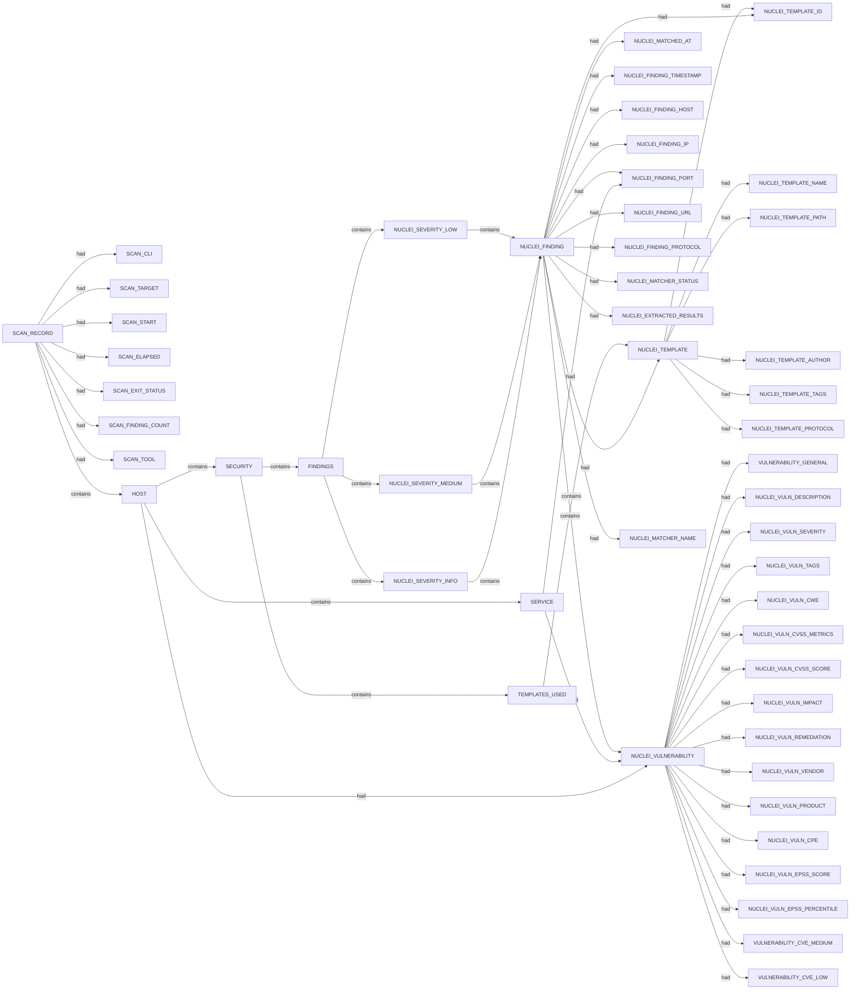

# Nuclei scan narrative — `scanme_all_templates`

## Introduction

Nuclei findings are grouped under each host's SECURITY container with severity buckets, deduplicated templates, and per-record findings.

## Hosts

- `http://scanme.nmap.org`
- `scanme.nmap.org`

## Findings

- `AAAA Record - IPv6 Detection`
- `Apache Detection`
- `Apache mod_negotiation - Pseudo Directory Listing`
- `CAA Record`
- `CVE-2023-48795:scanme.nmap.org:22:2026-07-03T16:38:13.0711464+10:00`
- `HTTP Missing Security Headers`
- `OpenSSH Service - Detect`
- `OpenSSH Terrapin Attack - Detection`
- `SSH Auth Methods - Detection`
- `SSH Diffie-Hellman Modulus <= 1024 Bits`
- `SSH Password-based Authentication`
- `SSH SHA-1 HMAC Algorithms Enabled`
- `SSH Server CBC Mode Ciphers Enabled`
- `SSH Server Software Enumeration`
- `SSH Weak Algorithms Supported`
- `SSH Weak Key Exchange Algorithms Enabled`
- `SSH Weak MAC Algorithms Enabled`
- `aaaa-fingerprint:scanme.nmap.org:2026-07-03T16:40:55.4186512+10:00`
- `apache-detect:http://scanme.nmap.org:2026-07-03T16:39:10.2215385+10:00`
- `apache-mod-negotiation-listing:http://scanme.nmap.org/index:2026-07-03T16:37:45.1751204+10:00`
- `caa-fingerprint:scanme.nmap.org:2026-07-03T16:40:55.4791517+10:00`
- `http-missing-security-headers:http://scanme.nmap.org:2026-07-03T16:40:27.7903286+10:00`
- `http-missing-security-headers:http://scanme.nmap.org:2026-07-03T16:40:27.7908775+10:00`
- `http-missing-security-headers:http://scanme.nmap.org:2026-07-03T16:40:27.7970072+10:00`
- `openssh-detect:scanme.nmap.org:22:2026-07-03T16:38:40.8329629+10:00`
- `ssh-auth-methods:scanme.nmap.org:22:2026-07-03T16:38:15.0600269+10:00`
- `ssh-cbc-mode-ciphers:scanme.nmap.org:22:2026-07-03T16:38:24.2829079+10:00`
- `ssh-diffie-hellman-logjam:scanme.nmap.org:22:2026-07-03T16:38:22.1466209+10:00`
- `ssh-password-auth:scanme.nmap.org:22:2026-07-03T16:38:22.3101161+10:00`
- `ssh-server-enumeration:scanme.nmap.org:22:2026-07-03T16:38:22.4798183+10:00`
- `ssh-sha1-hmac-algo:scanme.nmap.org:22:2026-07-03T16:38:22.6389481+10:00`
- `ssh-weak-algo-supported:scanme.nmap.org:22:2026-07-03T16:38:24.4381272+10:00`
- `ssh-weak-mac-algo:scanme.nmap.org:22:2026-07-03T16:38:24.4391555+10:00`
- `ssh-weakkey-exchange-algo:scanme.nmap.org:22:2026-07-03T16:38:24.5962106+10:00`

## Graph structure (types)

## Trace

_Trace section omitted when no TRACE nodes present._

## Appendix

### Nodes

- `FINDINGS`: scanme.nmap.org::FINDINGS
- `HOST`: http://scanme.nmap.org
- `HOST`: scanme.nmap.org
- `NUCLEI_EXTRACTED_RESULTS`: 2600:3c01::f03c:91ff:fe18:bb2f
- `NUCLEI_EXTRACTED_RESULTS`: Apache/2.4.7 (Ubuntu)
- `NUCLEI_EXTRACTED_RESULTS`: SSH-2.0-OpenSSH_6.6.1p1 Ubuntu-2ubuntu2.13
- `NUCLEI_EXTRACTED_RESULTS`: Vulnerable to Terrapin
- `NUCLEI_EXTRACTED_RESULTS`: ["publickey","password"]
- `NUCLEI_EXTRACTED_RESULTS`: index.html
- `NUCLEI_FINDING`: CVE-2023-48795:scanme.nmap.org:22:2026-07-03T16:38:13.0711464+10:00
- `NUCLEI_FINDING`: aaaa-fingerprint:scanme.nmap.org:2026-07-03T16:40:55.4186512+10:00
- `NUCLEI_FINDING`: apache-detect:http://scanme.nmap.org:2026-07-03T16:39:10.2215385+10:00
- `NUCLEI_FINDING`: apache-mod-negotiation-listing:http://scanme.nmap.org/index:2026-07-03T16:37:45.1751204+10:00
- `NUCLEI_FINDING`: caa-fingerprint:scanme.nmap.org:2026-07-03T16:40:55.4791517+10:00
- `NUCLEI_FINDING`: http-missing-security-headers:http://scanme.nmap.org:2026-07-03T16:40:27.7903286+10:00
- `NUCLEI_FINDING`: http-missing-security-headers:http://scanme.nmap.org:2026-07-03T16:40:27.7908775+10:00
- `NUCLEI_FINDING`: http-missing-security-headers:http://scanme.nmap.org:2026-07-03T16:40:27.7970072+10:00
- `NUCLEI_FINDING`: openssh-detect:scanme.nmap.org:22:2026-07-03T16:38:40.8329629+10:00
- `NUCLEI_FINDING`: ssh-auth-methods:scanme.nmap.org:22:2026-07-03T16:38:15.0600269+10:00
- `NUCLEI_FINDING`: ssh-cbc-mode-ciphers:scanme.nmap.org:22:2026-07-03T16:38:24.2829079+10:00
- `NUCLEI_FINDING`: ssh-diffie-hellman-logjam:scanme.nmap.org:22:2026-07-03T16:38:22.1466209+10:00
- `NUCLEI_FINDING`: ssh-password-auth:scanme.nmap.org:22:2026-07-03T16:38:22.3101161+10:00
- `NUCLEI_FINDING`: ssh-server-enumeration:scanme.nmap.org:22:2026-07-03T16:38:22.4798183+10:00
- `NUCLEI_FINDING`: ssh-sha1-hmac-algo:scanme.nmap.org:22:2026-07-03T16:38:22.6389481+10:00
- `NUCLEI_FINDING`: ssh-weak-algo-supported:scanme.nmap.org:22:2026-07-03T16:38:24.4381272+10:00
- `NUCLEI_FINDING`: ssh-weak-mac-algo:scanme.nmap.org:22:2026-07-03T16:38:24.4391555+10:00
- `NUCLEI_FINDING`: ssh-weakkey-exchange-algo:scanme.nmap.org:22:2026-07-03T16:38:24.5962106+10:00
- `NUCLEI_FINDING_HOST`: scanme.nmap.org
- `NUCLEI_FINDING_IP`: 2600:3c01::f03c:91ff:fe18:bb2f
- `NUCLEI_FINDING_IP`: 45.33.32.156
- `NUCLEI_FINDING_PORT`: 22
- `NUCLEI_FINDING_PORT`: 80
- `NUCLEI_FINDING_PROTOCOL`: dns
- `NUCLEI_FINDING_PROTOCOL`: http
- `NUCLEI_FINDING_PROTOCOL`: javascript
- `NUCLEI_FINDING_PROTOCOL`: tcp
- `NUCLEI_FINDING_TIMESTAMP`: 2026-07-03T16:37:45.1751204+10:00
- `NUCLEI_FINDING_TIMESTAMP`: 2026-07-03T16:38:13.0711464+10:00
- `NUCLEI_FINDING_TIMESTAMP`: 2026-07-03T16:38:15.0600269+10:00
- `NUCLEI_FINDING_TIMESTAMP`: 2026-07-03T16:38:22.1466209+10:00
- `NUCLEI_FINDING_TIMESTAMP`: 2026-07-03T16:38:22.3101161+10:00
- `NUCLEI_FINDING_TIMESTAMP`: 2026-07-03T16:38:22.4798183+10:00
- `NUCLEI_FINDING_TIMESTAMP`: 2026-07-03T16:38:22.6389481+10:00
- `NUCLEI_FINDING_TIMESTAMP`: 2026-07-03T16:38:24.2829079+10:00
- `NUCLEI_FINDING_TIMESTAMP`: 2026-07-03T16:38:24.4381272+10:00
- `NUCLEI_FINDING_TIMESTAMP`: 2026-07-03T16:38:24.4391555+10:00
- `NUCLEI_FINDING_TIMESTAMP`: 2026-07-03T16:38:24.5962106+10:00
- `NUCLEI_FINDING_TIMESTAMP`: 2026-07-03T16:38:40.8329629+10:00
- `NUCLEI_FINDING_TIMESTAMP`: 2026-07-03T16:39:10.2215385+10:00
- `NUCLEI_FINDING_TIMESTAMP`: 2026-07-03T16:40:27.7903286+10:00
- `NUCLEI_FINDING_TIMESTAMP`: 2026-07-03T16:40:27.7908775+10:00
- `NUCLEI_FINDING_TIMESTAMP`: 2026-07-03T16:40:27.7970072+10:00
- `NUCLEI_FINDING_TIMESTAMP`: 2026-07-03T16:40:55.4186512+10:00
- `NUCLEI_FINDING_TIMESTAMP`: 2026-07-03T16:40:55.4791517+10:00
- `NUCLEI_FINDING_URL`: http://scanme.nmap.org
- `NUCLEI_FINDING_URL`: scanme.nmap.org:22
- `NUCLEI_MATCHED_AT`: http://scanme.nmap.org
- `NUCLEI_MATCHED_AT`: http://scanme.nmap.org/index
- `NUCLEI_MATCHED_AT`: scanme.nmap.org
- `NUCLEI_MATCHED_AT`: scanme.nmap.org:22
- `NUCLEI_MATCHER_NAME`: content-security-policy
- `NUCLEI_MATCHER_NAME`: cross-origin-embedder-policy
- `NUCLEI_MATCHER_NAME`: cross-origin-opener-policy
- `NUCLEI_MATCHER_NAME`: cross-origin-resource-policy
- `NUCLEI_MATCHER_NAME`: permissions-policy
- `NUCLEI_MATCHER_NAME`: referrer-policy
- `NUCLEI_MATCHER_NAME`: strict-transport-security
- `NUCLEI_MATCHER_NAME`: x-content-type-options
- `NUCLEI_MATCHER_NAME`: x-frame-options
- `NUCLEI_MATCHER_NAME`: x-permitted-cross-domain-policies
- `NUCLEI_MATCHER_STATUS`: True
- `NUCLEI_SEVERITY_INFO`: scanme.nmap.org::NUCLEI_SEVERITY_INFO
- `NUCLEI_SEVERITY_LOW`: scanme.nmap.org::NUCLEI_SEVERITY_LOW
- `NUCLEI_SEVERITY_MEDIUM`: scanme.nmap.org::NUCLEI_SEVERITY_MEDIUM
- `NUCLEI_TEMPLATE`: CVE-2023-48795
- `NUCLEI_TEMPLATE`: aaaa-fingerprint
- `NUCLEI_TEMPLATE`: apache-detect
- `NUCLEI_TEMPLATE`: apache-mod-negotiation-listing
- `NUCLEI_TEMPLATE`: caa-fingerprint
- `NUCLEI_TEMPLATE`: http-missing-security-headers
- `NUCLEI_TEMPLATE`: openssh-detect
- `NUCLEI_TEMPLATE`: ssh-auth-methods
- `NUCLEI_TEMPLATE`: ssh-cbc-mode-ciphers
- `NUCLEI_TEMPLATE`: ssh-diffie-hellman-logjam
- `NUCLEI_TEMPLATE`: ssh-password-auth
- `NUCLEI_TEMPLATE`: ssh-server-enumeration
- `NUCLEI_TEMPLATE`: ssh-sha1-hmac-algo
- `NUCLEI_TEMPLATE`: ssh-weak-algo-supported
- `NUCLEI_TEMPLATE`: ssh-weak-mac-algo
- `NUCLEI_TEMPLATE`: ssh-weakkey-exchange-algo
- `NUCLEI_TEMPLATE_AUTHOR`: 0x_akoko
- `NUCLEI_TEMPLATE_AUTHOR`: ice3man543
- `NUCLEI_TEMPLATE_AUTHOR`: ice3man543, tarunkoyalwar
- `NUCLEI_TEMPLATE_AUTHOR`: pdteam
- `NUCLEI_TEMPLATE_AUTHOR`: philippedelteil
- `NUCLEI_TEMPLATE_AUTHOR`: princechaddha
- `NUCLEI_TEMPLATE_AUTHOR`: pussycat0x
- `NUCLEI_TEMPLATE_AUTHOR`: r3dg33k, daffainfo, iamthefrogy
- `NUCLEI_TEMPLATE_AUTHOR`: rxerium
- `NUCLEI_TEMPLATE_AUTHOR`: socketz, geeknik, g4l1t0, convisoappsec, kurohost, dawid-czarnecki, forgedhallpass, jub0bs, userdehghani, celbahraoui, safejulian
- `NUCLEI_TEMPLATE_ID`: CVE-2023-48795
- `NUCLEI_TEMPLATE_ID`: aaaa-fingerprint
- `NUCLEI_TEMPLATE_ID`: apache-detect
- `NUCLEI_TEMPLATE_ID`: apache-mod-negotiation-listing
- `NUCLEI_TEMPLATE_ID`: caa-fingerprint
- `NUCLEI_TEMPLATE_ID`: http-missing-security-headers
- `NUCLEI_TEMPLATE_ID`: openssh-detect
- `NUCLEI_TEMPLATE_ID`: ssh-auth-methods
- `NUCLEI_TEMPLATE_ID`: ssh-cbc-mode-ciphers
- `NUCLEI_TEMPLATE_ID`: ssh-diffie-hellman-logjam
- `NUCLEI_TEMPLATE_ID`: ssh-password-auth
- `NUCLEI_TEMPLATE_ID`: ssh-server-enumeration
- `NUCLEI_TEMPLATE_ID`: ssh-sha1-hmac-algo
- `NUCLEI_TEMPLATE_ID`: ssh-weak-algo-supported
- `NUCLEI_TEMPLATE_ID`: ssh-weak-mac-algo
- `NUCLEI_TEMPLATE_ID`: ssh-weakkey-exchange-algo
- `NUCLEI_TEMPLATE_NAME`: AAAA Record - IPv6 Detection
- `NUCLEI_TEMPLATE_NAME`: Apache Detection
- `NUCLEI_TEMPLATE_NAME`: Apache mod_negotiation - Pseudo Directory Listing
- `NUCLEI_TEMPLATE_NAME`: CAA Record
- `NUCLEI_TEMPLATE_NAME`: HTTP Missing Security Headers
- `NUCLEI_TEMPLATE_NAME`: OpenSSH Service - Detect
- `NUCLEI_TEMPLATE_NAME`: OpenSSH Terrapin Attack - Detection
- `NUCLEI_TEMPLATE_NAME`: SSH Auth Methods - Detection
- `NUCLEI_TEMPLATE_NAME`: SSH Diffie-Hellman Modulus <= 1024 Bits
- `NUCLEI_TEMPLATE_NAME`: SSH Password-based Authentication
- `NUCLEI_TEMPLATE_NAME`: SSH SHA-1 HMAC Algorithms Enabled
- `NUCLEI_TEMPLATE_NAME`: SSH Server CBC Mode Ciphers Enabled
- `NUCLEI_TEMPLATE_NAME`: SSH Server Software Enumeration
- `NUCLEI_TEMPLATE_NAME`: SSH Weak Algorithms Supported
- `NUCLEI_TEMPLATE_NAME`: SSH Weak Key Exchange Algorithms Enabled
- `NUCLEI_TEMPLATE_NAME`: SSH Weak MAC Algorithms Enabled
- `NUCLEI_TEMPLATE_PATH`: c:\projects\spiderfeet\.tools\nuclei-templates\dns\aaaa-fingerprint.yaml
- `NUCLEI_TEMPLATE_PATH`: c:\projects\spiderfeet\.tools\nuclei-templates\dns\caa-fingerprint.yaml
- `NUCLEI_TEMPLATE_PATH`: c:\projects\spiderfeet\.tools\nuclei-templates\http\misconfiguration\apache\apache-mod-negotiation-listing.yaml
- `NUCLEI_TEMPLATE_PATH`: c:\projects\spiderfeet\.tools\nuclei-templates\http\misconfiguration\http-missing-security-headers.yaml
- `NUCLEI_TEMPLATE_PATH`: c:\projects\spiderfeet\.tools\nuclei-templates\http\technologies\apache\apache-detect.yaml
- `NUCLEI_TEMPLATE_PATH`: c:\projects\spiderfeet\.tools\nuclei-templates\javascript\cves\2023\CVE-2023-48795.yaml
- `NUCLEI_TEMPLATE_PATH`: c:\projects\spiderfeet\.tools\nuclei-templates\javascript\detection\ssh-auth-methods.yaml
- `NUCLEI_TEMPLATE_PATH`: c:\projects\spiderfeet\.tools\nuclei-templates\javascript\enumeration\ssh\ssh-diffie-hellman-logjam.yaml
- `NUCLEI_TEMPLATE_PATH`: c:\projects\spiderfeet\.tools\nuclei-templates\javascript\enumeration\ssh\ssh-password-auth.yaml
- `NUCLEI_TEMPLATE_PATH`: c:\projects\spiderfeet\.tools\nuclei-templates\javascript\enumeration\ssh\ssh-server-enumeration.yaml
- `NUCLEI_TEMPLATE_PATH`: c:\projects\spiderfeet\.tools\nuclei-templates\javascript\enumeration\ssh\ssh-sha1-hmac-algo.yaml
- `NUCLEI_TEMPLATE_PATH`: c:\projects\spiderfeet\.tools\nuclei-templates\javascript\misconfiguration\ssh\ssh-cbc-mode-ciphers.yaml
- `NUCLEI_TEMPLATE_PATH`: c:\projects\spiderfeet\.tools\nuclei-templates\javascript\misconfiguration\ssh\ssh-weak-algo-supported.yaml
- `NUCLEI_TEMPLATE_PATH`: c:\projects\spiderfeet\.tools\nuclei-templates\javascript\misconfiguration\ssh\ssh-weak-mac-algo.yaml
- `NUCLEI_TEMPLATE_PATH`: c:\projects\spiderfeet\.tools\nuclei-templates\javascript\misconfiguration\ssh\ssh-weakkey-exchange-algo.yaml
- `NUCLEI_TEMPLATE_PATH`: c:\projects\spiderfeet\.tools\nuclei-templates\network\detection\openssh-detect.yaml
- `NUCLEI_TEMPLATE_PROTOCOL`: dns
- `NUCLEI_TEMPLATE_PROTOCOL`: http
- `NUCLEI_TEMPLATE_PROTOCOL`: javascript
- `NUCLEI_TEMPLATE_PROTOCOL`: tcp
- `NUCLEI_TEMPLATE_TAGS`: apache, misconfig, exposure, mod-negotiation
- `NUCLEI_TEMPLATE_TAGS`: cve, cve2023, packetstorm, seclists, js, ssh, network, passive, openbsd, vkev, vuln
- `NUCLEI_TEMPLATE_TAGS`: dns, aaaa, ipv6, discovery
- `NUCLEI_TEMPLATE_TAGS`: dns, caa, discovery
- `NUCLEI_TEMPLATE_TAGS`: enum, js, ssh, misconfig, network, discovery
- `NUCLEI_TEMPLATE_TAGS`: js, detect, ssh, enum, network, discovery
- `NUCLEI_TEMPLATE_TAGS`: js, enum, ssh, misconfig, network, discovery
- `NUCLEI_TEMPLATE_TAGS`: js, enum, ssh, misconfig, network, vuln
- `NUCLEI_TEMPLATE_TAGS`: js, ssh, enum, network, discovery
- `NUCLEI_TEMPLATE_TAGS`: misconfig, headers, generic, vuln
- `NUCLEI_TEMPLATE_TAGS`: seclists, network, ssh, openssh, detect, detection, tcp, discovery
- `NUCLEI_TEMPLATE_TAGS`: ssh, js, enum, network, discovery
- `NUCLEI_TEMPLATE_TAGS`: tech, apache, discovery
- `NUCLEI_VULNERABILITY`: CVE-2023-48795:scanme.nmap.org:22:2026-07-03T16:38:13.0711464+10:00
- `NUCLEI_VULNERABILITY`: aaaa-fingerprint:scanme.nmap.org:2026-07-03T16:40:55.4186512+10:00
- `NUCLEI_VULNERABILITY`: apache-detect:http://scanme.nmap.org:2026-07-03T16:39:10.2215385+10:00
- `NUCLEI_VULNERABILITY`: apache-mod-negotiation-listing:http://scanme.nmap.org/index:2026-07-03T16:37:45.1751204+10:00
- `NUCLEI_VULNERABILITY`: caa-fingerprint:scanme.nmap.org:2026-07-03T16:40:55.4791517+10:00
- `NUCLEI_VULNERABILITY`: http-missing-security-headers:http://scanme.nmap.org:2026-07-03T16:40:27.7903286+10:00
- `NUCLEI_VULNERABILITY`: http-missing-security-headers:http://scanme.nmap.org:2026-07-03T16:40:27.7908775+10:00
- `NUCLEI_VULNERABILITY`: http-missing-security-headers:http://scanme.nmap.org:2026-07-03T16:40:27.7970072+10:00
- `NUCLEI_VULNERABILITY`: openssh-detect:scanme.nmap.org:22:2026-07-03T16:38:40.8329629+10:00
- `NUCLEI_VULNERABILITY`: ssh-auth-methods:scanme.nmap.org:22:2026-07-03T16:38:15.0600269+10:00
- `NUCLEI_VULNERABILITY`: ssh-cbc-mode-ciphers:scanme.nmap.org:22:2026-07-03T16:38:24.2829079+10:00
- `NUCLEI_VULNERABILITY`: ssh-diffie-hellman-logjam:scanme.nmap.org:22:2026-07-03T16:38:22.1466209+10:00
- `NUCLEI_VULNERABILITY`: ssh-password-auth:scanme.nmap.org:22:2026-07-03T16:38:22.3101161+10:00
- `NUCLEI_VULNERABILITY`: ssh-server-enumeration:scanme.nmap.org:22:2026-07-03T16:38:22.4798183+10:00
- `NUCLEI_VULNERABILITY`: ssh-sha1-hmac-algo:scanme.nmap.org:22:2026-07-03T16:38:22.6389481+10:00
- `NUCLEI_VULNERABILITY`: ssh-weak-algo-supported:scanme.nmap.org:22:2026-07-03T16:38:24.4381272+10:00
- `NUCLEI_VULNERABILITY`: ssh-weak-mac-algo:scanme.nmap.org:22:2026-07-03T16:38:24.4391555+10:00
- `NUCLEI_VULNERABILITY`: ssh-weakkey-exchange-algo:scanme.nmap.org:22:2026-07-03T16:38:24.5962106+10:00
- `NUCLEI_VULN_CPE`: cpe:2.3:a:openbsd:openssh:*:*:*:*:*:*:*:*
- `NUCLEI_VULN_CVSS_METRICS`: CVSS:3.1/AV:N/AC:H/PR:N/UI:N/S:U/C:N/I:H/A:N
- `NUCLEI_VULN_CVSS_METRICS`: CVSS:3.1/AV:N/AC:L/PR:N/UI:N/S:U/C:L/I:N/A:N
- `NUCLEI_VULN_CVSS_METRICS`: CVSS:3.1/AV:N/AC:L/PR:N/UI:N/S:U/C:N/I:N/A:N
- `NUCLEI_VULN_CVSS_SCORE`: 5.3
- `NUCLEI_VULN_CVSS_SCORE`: 5.9
- `NUCLEI_VULN_CWE`: cwe-200
- `NUCLEI_VULN_CWE`: cwe-354
- `NUCLEI_VULN_CWE`: cwe-538
- `NUCLEI_VULN_CWE`: cwe-693
- `NUCLEI_VULN_DESCRIPTION`: "SSH Server CBC Mode Ciphers Enabled" signifies that the SSH server supports Cipher Block Chaining (CBC) mode ciphers, which are known for potential vulnerabilities. This configuration poses a security risk, and it's recommended to disable CBC ciphers in favor of more secure alternatives for enhanced protection during data transmission.

- `NUCLEI_VULN_DESCRIPTION`: A CAA record was discovered. A CAA record is used to specify which certificate authorities (CAs) are allowed to issue certificates for a domain.
- `NUCLEI_VULN_DESCRIPTION`: An AAAA record was detected. AAAA records are used to map domain names to IPv6 addresses.

- `NUCLEI_VULN_DESCRIPTION`: Detected Apache server with mod_negotiation and MultiViews enabled, exposing a pseudo directory listing when invalid Accept headers are sent to extensionless filenames.

- `NUCLEI_VULN_DESCRIPTION`: OpenSSH service was detected.

- `NUCLEI_VULN_DESCRIPTION`: SSH (Secure Shell) authentication modes are methods used to verify the identity of users and ensure secure access to remote systems. Common SSH authentication modes include password-based authentication, which relies on a secret passphrase, and public key authentication, which uses cryptographic keys for a more secure and convenient login process. Additionally, multi-factor authentication (MFA) can be employed to enhance security by requiring users to provide multiple forms of authentication, such as a password and a one-time code.

- `NUCLEI_VULN_DESCRIPTION`: SSH Weak Key Exchange Algorithms Enabled indicates that the SSH server or client is configured to allow the use of less secure key exchange methods, posing a potential security risk during the establishment of secure connections. It's crucial to update configurations to prioritize stronger key exchange algorithms.

- `NUCLEI_VULN_DESCRIPTION`: SSH weak algorithms are outdated cryptographic methods that pose security risks. Identifying and disabling these vulnerable algorithms is crucial for enhancing the overall security of SSH connections.

- `NUCLEI_VULN_DESCRIPTION`: Some Apache servers have the version on the response header. The OpenSSL version can be also obtained
- `NUCLEI_VULN_DESCRIPTION`: The SSH server at the remote end is set up to allow the use of SHA-1 HMAC algorithms.

- `NUCLEI_VULN_DESCRIPTION`: The SSH transport protocol with certain OpenSSH extensions, found in OpenSSH before 9.6 and other products, allows remote attackers to bypass integrity checks such that some packets are omitted (from the extension negotiation message), and a client and server may consequently end up with a connection for which some security features have been downgraded or disabled, aka a Terrapin attack. This occurs because the SSH Binary Packet Protocol (BPP), implemented by these extensions, mishandles the handshake phase and mishandles use of sequence numbers. For example, there is an effective attack against SSH's use of ChaCha20-Poly1305 (and CBC with Encrypt-then-MAC). The bypass occurs in chacha20-poly1305@openssh.com and (if CBC is used) the -etm@openssh.com MAC algorithms. This also affects Maverick Synergy Java SSH API before 3.1.0-SNAPSHOT, Dropbear through 2022.83, Ssh before 5.1.1 in Erlang/OTP, PuTTY before 0.80, AsyncSSH before 2.14.2, golang.org/x/crypto before 0.17.0, libssh before 0.10.6, libssh2 through 1.11.0, Thorn Tech SFTP Gateway before 3.4.6, Tera Term before 5.1, Paramiko before 3.4.0, jsch before 0.2.15, SFTPGo before 2.5.6, Netgate pfSense Plus through 23.09.1, Netgate pfSense CE through 2.7.2, HPN-SSH through 18.2.0, ProFTPD before 1.3.8b (and before 1.3.9rc2), ORYX CycloneSSH before 2.3.4, NetSarang XShell 7 before Build 0144, CrushFTP before 10.6.0, ConnectBot SSH library before 2.2.22, Apache MINA sshd through 2.11.0, sshj through 0.37.0, TinySSH through 20230101, trilead-ssh2 6401, LANCOM LCOS and LANconfig, FileZilla before 3.66.4, Nova before 11.8, PKIX-SSH before 14.4, SecureCRT before 9.4.3, Transmit5 before 5.10.4, Win32-OpenSSH before 9.5.0.0p1-Beta, WinSCP before 6.2.2, Bitvise SSH Server before 9.32, Bitvise SSH Client before 9.33, KiTTY through 0.76.1.13, the net-ssh gem 7.2.0 for Ruby, the mscdex ssh2 module before 1.15.0 for Node.js, the thrussh library before 0.35.1 for Rust, and the Russh crate before 0.40.2 for Rust.

- `NUCLEI_VULN_DESCRIPTION`: The system's SSH configuration poses a security risk by allowing weak Message Authentication Code (MAC) algorithms, potentially exposing it to vulnerabilities and unauthorized access. It is crucial to update and strengthen the MAC algorithms for enhanced security.

- `NUCLEI_VULN_DESCRIPTION`: This template searches for missing HTTP security headers. The impact of these missing headers can vary.

- `NUCLEI_VULN_EPSS_PERCENTILE`: 0.99836
- `NUCLEI_VULN_EPSS_SCORE`: 0.94072
- `NUCLEI_VULN_IMPACT`: Attackers can bypass SSH integrity checks to downgrade or disable security features in SSH connections using ChaCha20-Poly1305 or CBC with Encrypt-then-MAC algorithms.

- `NUCLEI_VULN_PRODUCT`: openssh
- `NUCLEI_VULN_REMEDIATION`: One can address this vulnerability by temporarily disabling the affected chacha20-poly1305@openssh.com encryption and -etm@openssh.com MAC algorithms in the configuration of the SSH server (or client), and instead utilize unaffected algorithms like AES-GCM.

- `NUCLEI_VULN_SEVERITY`: info
- `NUCLEI_VULN_SEVERITY`: low
- `NUCLEI_VULN_SEVERITY`: medium
- `NUCLEI_VULN_TAGS`: apache, misconfig, exposure, mod-negotiation
- `NUCLEI_VULN_TAGS`: cve, cve2023, packetstorm, seclists, js, ssh, network, passive, openbsd, vkev, vuln
- `NUCLEI_VULN_TAGS`: dns, aaaa, ipv6, discovery
- `NUCLEI_VULN_TAGS`: dns, caa, discovery
- `NUCLEI_VULN_TAGS`: enum, js, ssh, misconfig, network, discovery
- `NUCLEI_VULN_TAGS`: js, detect, ssh, enum, network, discovery
- `NUCLEI_VULN_TAGS`: js, enum, ssh, misconfig, network, discovery
- `NUCLEI_VULN_TAGS`: js, enum, ssh, misconfig, network, vuln
- `NUCLEI_VULN_TAGS`: js, ssh, enum, network, discovery
- `NUCLEI_VULN_TAGS`: misconfig, headers, generic, vuln
- `NUCLEI_VULN_TAGS`: seclists, network, ssh, openssh, detect, detection, tcp, discovery
- `NUCLEI_VULN_TAGS`: ssh, js, enum, network, discovery
- `NUCLEI_VULN_TAGS`: tech, apache, discovery
- `NUCLEI_VULN_VENDOR`: openbsd
- `SCAN_CLI`: nuclei -u http://scanme.nmap.org -silent -jsonl -omit-raw -omit-template -t .tools/nuclei-templates -no-interactsh -etags dos,fuzz,misc -duc -retries 1 -c 25 -timeout 10 -jle .docs/docs-for-cli-tools/exploration_scratch/nuclei/scanme_all_templates.jsonl
- `SCAN_ELAPSED`: 0.0
- `SCAN_EXIT_STATUS`: 0
- `SCAN_FINDING_COUNT`: 25
- `SCAN_RECORD`: nuclei:http://scanme.nmap.org:nuclei -u http://scanme.nmap.org -silent -jsonl -omit-raw -omit-template -t .tools/nuclei-templates -no-interactsh -etags dos,fuzz,misc -duc -retries 1 -c 25 -timeout 10 -jle .docs/docs-for-cli-tools/exploration_scratch/nuclei/scanme_all_templates.jsonl
- `SCAN_START`: 2026-07-05T11:58:42.182007+00:00
- `SCAN_TARGET`: http://scanme.nmap.org
- `SCAN_TOOL`: nuclei
- `SECURITY`: scanme.nmap.org::SECURITY
- `SERVICE`: scanme.nmap.org:22
- `SERVICE`: scanme.nmap.org:80
- `TEMPLATES_USED`: scanme.nmap.org::TEMPLATES_USED
- `VULNERABILITY_CVE_LOW`: CVE-2016-6210
- `VULNERABILITY_CVE_LOW`: CVE-2018-15473
- `VULNERABILITY_CVE_MEDIUM`: CVE-2023-48795
- `VULNERABILITY_CVE_MEDIUM`: ['cve-2023-48795']
- `VULNERABILITY_GENERAL`: AAAA Record - IPv6 Detection
- `VULNERABILITY_GENERAL`: Apache Detection
- `VULNERABILITY_GENERAL`: Apache mod_negotiation - Pseudo Directory Listing
- `VULNERABILITY_GENERAL`: CAA Record
- `VULNERABILITY_GENERAL`: HTTP Missing Security Headers
- `VULNERABILITY_GENERAL`: OpenSSH Service - Detect
- `VULNERABILITY_GENERAL`: OpenSSH Terrapin Attack - Detection
- `VULNERABILITY_GENERAL`: SSH Auth Methods - Detection
- `VULNERABILITY_GENERAL`: SSH Diffie-Hellman Modulus <= 1024 Bits
- `VULNERABILITY_GENERAL`: SSH Password-based Authentication
- `VULNERABILITY_GENERAL`: SSH SHA-1 HMAC Algorithms Enabled
- `VULNERABILITY_GENERAL`: SSH Server CBC Mode Ciphers Enabled
- `VULNERABILITY_GENERAL`: SSH Server Software Enumeration
- `VULNERABILITY_GENERAL`: SSH Weak Algorithms Supported
- `VULNERABILITY_GENERAL`: SSH Weak Key Exchange Algorithms Enabled
- `VULNERABILITY_GENERAL`: SSH Weak MAC Algorithms Enabled

### Edges

- `SCAN_RECORD` `had` `SCAN_CLI`
- `SCAN_RECORD` `had` `SCAN_TARGET`
- `SCAN_RECORD` `had` `SCAN_START`
- `SCAN_RECORD` `had` `SCAN_ELAPSED`
- `SCAN_RECORD` `had` `SCAN_EXIT_STATUS`
- `SCAN_RECORD` `had` `SCAN_FINDING_COUNT`
- `SCAN_RECORD` `had` `SCAN_TOOL`
- `SCAN_RECORD` `contains` `HOST`
- `SCAN_RECORD` `contains` `HOST`
- `HOST` `contains` `SECURITY`
- `SECURITY` `contains` `TEMPLATES_USED`
- `SECURITY` `contains` `FINDINGS`
- `FINDINGS` `contains` `NUCLEI_SEVERITY_LOW`
- `TEMPLATES_USED` `contains` `NUCLEI_TEMPLATE`
- `NUCLEI_TEMPLATE` `had` `NUCLEI_TEMPLATE_ID`
- `NUCLEI_TEMPLATE` `had` `NUCLEI_TEMPLATE_NAME`
- `NUCLEI_TEMPLATE` `had` `NUCLEI_TEMPLATE_PATH`
- `NUCLEI_TEMPLATE` `had` `NUCLEI_TEMPLATE_AUTHOR`
- `NUCLEI_TEMPLATE` `had` `NUCLEI_TEMPLATE_TAGS`
- `NUCLEI_TEMPLATE` `had` `NUCLEI_TEMPLATE_PROTOCOL`
- `NUCLEI_SEVERITY_LOW` `contains` `NUCLEI_FINDING`
- `NUCLEI_FINDING` `had` `NUCLEI_TEMPLATE_ID`
- `NUCLEI_FINDING` `had` `NUCLEI_MATCHED_AT`
- `NUCLEI_FINDING` `had` `NUCLEI_FINDING_TIMESTAMP`
- `NUCLEI_FINDING` `had` `NUCLEI_FINDING_HOST`
- `NUCLEI_FINDING` `had` `NUCLEI_FINDING_IP`
- `NUCLEI_FINDING` `had` `NUCLEI_FINDING_PORT`
- `NUCLEI_FINDING` `had` `NUCLEI_FINDING_URL`
- `NUCLEI_FINDING` `had` `NUCLEI_FINDING_PROTOCOL`
- `NUCLEI_FINDING` `had` `NUCLEI_MATCHER_STATUS`
- `NUCLEI_FINDING` `had` `NUCLEI_EXTRACTED_RESULTS`
- `NUCLEI_FINDING` `contains` `NUCLEI_VULNERABILITY`
- `NUCLEI_VULNERABILITY` `had` `VULNERABILITY_GENERAL`
- `NUCLEI_VULNERABILITY` `had` `NUCLEI_VULN_DESCRIPTION`
- `NUCLEI_VULNERABILITY` `had` `NUCLEI_VULN_SEVERITY`
- `NUCLEI_VULNERABILITY` `had` `NUCLEI_VULN_TAGS`
- `NUCLEI_VULNERABILITY` `had` `NUCLEI_VULN_CWE`
- `NUCLEI_VULNERABILITY` `had` `NUCLEI_VULN_CVSS_METRICS`
- `NUCLEI_VULNERABILITY` `had` `NUCLEI_VULN_CVSS_SCORE`
- `NUCLEI_FINDING` `had` `NUCLEI_TEMPLATE`
- `HOST` `contains` `SERVICE`
- `SERVICE` `had` `NUCLEI_FINDING_PORT`
- `SERVICE` `had` `NUCLEI_VULNERABILITY`
- `HOST` `had` `NUCLEI_VULNERABILITY`
- `FINDINGS` `contains` `NUCLEI_SEVERITY_MEDIUM`
- `TEMPLATES_USED` `contains` `NUCLEI_TEMPLATE`
- `NUCLEI_TEMPLATE` `had` `NUCLEI_TEMPLATE_ID`
- `NUCLEI_TEMPLATE` `had` `NUCLEI_TEMPLATE_NAME`
- `NUCLEI_TEMPLATE` `had` `NUCLEI_TEMPLATE_PATH`
- `NUCLEI_TEMPLATE` `had` `NUCLEI_TEMPLATE_AUTHOR`
- `NUCLEI_TEMPLATE` `had` `NUCLEI_TEMPLATE_TAGS`
- `NUCLEI_TEMPLATE` `had` `NUCLEI_TEMPLATE_PROTOCOL`
- `NUCLEI_SEVERITY_MEDIUM` `contains` `NUCLEI_FINDING`
- `NUCLEI_FINDING` `had` `NUCLEI_TEMPLATE_ID`
- `NUCLEI_FINDING` `had` `NUCLEI_MATCHED_AT`
- `NUCLEI_FINDING` `had` `NUCLEI_FINDING_TIMESTAMP`
- `NUCLEI_FINDING` `had` `NUCLEI_FINDING_HOST`
- `NUCLEI_FINDING` `had` `NUCLEI_FINDING_IP`
- `NUCLEI_FINDING` `had` `NUCLEI_FINDING_PORT`
- `NUCLEI_FINDING` `had` `NUCLEI_FINDING_URL`
- `NUCLEI_FINDING` `had` `NUCLEI_FINDING_PROTOCOL`
- `NUCLEI_FINDING` `had` `NUCLEI_MATCHER_STATUS`
- `NUCLEI_FINDING` `had` `NUCLEI_EXTRACTED_RESULTS`
- `NUCLEI_FINDING` `contains` `NUCLEI_VULNERABILITY`
- `NUCLEI_VULNERABILITY` `had` `VULNERABILITY_GENERAL`
- `NUCLEI_VULNERABILITY` `had` `NUCLEI_VULN_DESCRIPTION`
- `NUCLEI_VULNERABILITY` `had` `NUCLEI_VULN_IMPACT`
- `NUCLEI_VULNERABILITY` `had` `NUCLEI_VULN_REMEDIATION`
- `NUCLEI_VULNERABILITY` `had` `NUCLEI_VULN_SEVERITY`
- `NUCLEI_VULNERABILITY` `had` `NUCLEI_VULN_VENDOR`
- `NUCLEI_VULNERABILITY` `had` `NUCLEI_VULN_PRODUCT`
- `NUCLEI_VULNERABILITY` `had` `NUCLEI_VULN_TAGS`
- `NUCLEI_VULNERABILITY` `had` `NUCLEI_VULN_CWE`
- `NUCLEI_VULNERABILITY` `had` `NUCLEI_VULN_CPE`
- `NUCLEI_VULNERABILITY` `had` `NUCLEI_VULN_CVSS_METRICS`
- `NUCLEI_VULNERABILITY` `had` `NUCLEI_VULN_CVSS_SCORE`
- `NUCLEI_VULNERABILITY` `had` `NUCLEI_VULN_EPSS_SCORE`
- `NUCLEI_VULNERABILITY` `had` `NUCLEI_VULN_EPSS_PERCENTILE`
- `NUCLEI_VULNERABILITY` `had` `VULNERABILITY_CVE_MEDIUM`
- `NUCLEI_VULNERABILITY` `had` `VULNERABILITY_CVE_MEDIUM`
- `NUCLEI_FINDING` `had` `NUCLEI_TEMPLATE`
- `HOST` `contains` `SERVICE`
- `SERVICE` `had` `NUCLEI_FINDING_PORT`
- `SERVICE` `had` `NUCLEI_VULNERABILITY`
- `HOST` `had` `NUCLEI_VULNERABILITY`
- `FINDINGS` `contains` `NUCLEI_SEVERITY_INFO`
- `TEMPLATES_USED` `contains` `NUCLEI_TEMPLATE`
- `NUCLEI_TEMPLATE` `had` `NUCLEI_TEMPLATE_ID`
- `NUCLEI_TEMPLATE` `had` `NUCLEI_TEMPLATE_NAME`
- `NUCLEI_TEMPLATE` `had` `NUCLEI_TEMPLATE_PATH`
- `NUCLEI_TEMPLATE` `had` `NUCLEI_TEMPLATE_AUTHOR`
- `NUCLEI_TEMPLATE` `had` `NUCLEI_TEMPLATE_TAGS`
- `NUCLEI_TEMPLATE` `had` `NUCLEI_TEMPLATE_PROTOCOL`
- `NUCLEI_SEVERITY_INFO` `contains` `NUCLEI_FINDING`
- `NUCLEI_FINDING` `had` `NUCLEI_TEMPLATE_ID`
- `NUCLEI_FINDING` `had` `NUCLEI_MATCHED_AT`
- `NUCLEI_FINDING` `had` `NUCLEI_FINDING_TIMESTAMP`
- `NUCLEI_FINDING` `had` `NUCLEI_FINDING_HOST`
- `NUCLEI_FINDING` `had` `NUCLEI_FINDING_IP`
- `NUCLEI_FINDING` `had` `NUCLEI_FINDING_PORT`
- `NUCLEI_FINDING` `had` `NUCLEI_FINDING_URL`
- `NUCLEI_FINDING` `had` `NUCLEI_FINDING_PROTOCOL`
- `NUCLEI_FINDING` `had` `NUCLEI_MATCHER_STATUS`
- `NUCLEI_FINDING` `had` `NUCLEI_EXTRACTED_RESULTS`
- `NUCLEI_FINDING` `contains` `NUCLEI_VULNERABILITY`
- `NUCLEI_VULNERABILITY` `had` `VULNERABILITY_GENERAL`
- `NUCLEI_VULNERABILITY` `had` `NUCLEI_VULN_DESCRIPTION`
- `NUCLEI_VULNERABILITY` `had` `NUCLEI_VULN_SEVERITY`
- `NUCLEI_VULNERABILITY` `had` `NUCLEI_VULN_TAGS`
- `NUCLEI_FINDING` `had` `NUCLEI_TEMPLATE`
- `SERVICE` `had` `NUCLEI_VULNERABILITY`
- `HOST` `had` `NUCLEI_VULNERABILITY`
- `TEMPLATES_USED` `contains` `NUCLEI_TEMPLATE`
- `NUCLEI_TEMPLATE` `had` `NUCLEI_TEMPLATE_ID`
- `NUCLEI_TEMPLATE` `had` `NUCLEI_TEMPLATE_NAME`
- `NUCLEI_TEMPLATE` `had` `NUCLEI_TEMPLATE_PATH`
- `NUCLEI_TEMPLATE` `had` `NUCLEI_TEMPLATE_AUTHOR`
- `NUCLEI_TEMPLATE` `had` `NUCLEI_TEMPLATE_TAGS`
- `NUCLEI_TEMPLATE` `had` `NUCLEI_TEMPLATE_PROTOCOL`
- `NUCLEI_SEVERITY_LOW` `contains` `NUCLEI_FINDING`
- `NUCLEI_FINDING` `had` `NUCLEI_TEMPLATE_ID`
- `NUCLEI_FINDING` `had` `NUCLEI_MATCHED_AT`
- `NUCLEI_FINDING` `had` `NUCLEI_FINDING_TIMESTAMP`
- `NUCLEI_FINDING` `had` `NUCLEI_FINDING_HOST`
- `NUCLEI_FINDING` `had` `NUCLEI_FINDING_IP`
- `NUCLEI_FINDING` `had` `NUCLEI_FINDING_PORT`
- `NUCLEI_FINDING` `had` `NUCLEI_FINDING_URL`
- `NUCLEI_FINDING` `had` `NUCLEI_FINDING_PROTOCOL`
- `NUCLEI_FINDING` `had` `NUCLEI_MATCHER_STATUS`
- `NUCLEI_FINDING` `contains` `NUCLEI_VULNERABILITY`
- `NUCLEI_VULNERABILITY` `had` `VULNERABILITY_GENERAL`
- `NUCLEI_VULNERABILITY` `had` `NUCLEI_VULN_DESCRIPTION`
- `NUCLEI_VULNERABILITY` `had` `NUCLEI_VULN_SEVERITY`
- `NUCLEI_VULNERABILITY` `had` `NUCLEI_VULN_TAGS`
- `NUCLEI_FINDING` `had` `NUCLEI_TEMPLATE`
- `SERVICE` `had` `NUCLEI_VULNERABILITY`
- `HOST` `had` `NUCLEI_VULNERABILITY`
- `TEMPLATES_USED` `contains` `NUCLEI_TEMPLATE`
- `NUCLEI_TEMPLATE` `had` `NUCLEI_TEMPLATE_ID`
- `NUCLEI_TEMPLATE` `had` `NUCLEI_TEMPLATE_NAME`
- `NUCLEI_TEMPLATE` `had` `NUCLEI_TEMPLATE_PATH`
- `NUCLEI_TEMPLATE` `had` `NUCLEI_TEMPLATE_AUTHOR`
- `NUCLEI_TEMPLATE` `had` `NUCLEI_TEMPLATE_TAGS`
- `NUCLEI_TEMPLATE` `had` `NUCLEI_TEMPLATE_PROTOCOL`
- `NUCLEI_SEVERITY_INFO` `contains` `NUCLEI_FINDING`
- `NUCLEI_FINDING` `had` `NUCLEI_TEMPLATE_ID`
- `NUCLEI_FINDING` `had` `NUCLEI_MATCHED_AT`
- `NUCLEI_FINDING` `had` `NUCLEI_FINDING_TIMESTAMP`
- `NUCLEI_FINDING` `had` `NUCLEI_FINDING_HOST`
- `NUCLEI_FINDING` `had` `NUCLEI_FINDING_IP`
- `NUCLEI_FINDING` `had` `NUCLEI_FINDING_PORT`
- `NUCLEI_FINDING` `had` `NUCLEI_FINDING_URL`
- `NUCLEI_FINDING` `had` `NUCLEI_FINDING_PROTOCOL`
- `NUCLEI_FINDING` `had` `NUCLEI_MATCHER_STATUS`
- `NUCLEI_FINDING` `contains` `NUCLEI_VULNERABILITY`
- `NUCLEI_VULNERABILITY` `had` `VULNERABILITY_GENERAL`
- `NUCLEI_VULNERABILITY` `had` `NUCLEI_VULN_SEVERITY`
- `NUCLEI_VULNERABILITY` `had` `NUCLEI_VULN_TAGS`
- `NUCLEI_FINDING` `had` `NUCLEI_TEMPLATE`
- `SERVICE` `had` `NUCLEI_VULNERABILITY`
- `HOST` `had` `NUCLEI_VULNERABILITY`
- `TEMPLATES_USED` `contains` `NUCLEI_TEMPLATE`
- `NUCLEI_TEMPLATE` `had` `NUCLEI_TEMPLATE_ID`
- `NUCLEI_TEMPLATE` `had` `NUCLEI_TEMPLATE_NAME`
- `NUCLEI_TEMPLATE` `had` `NUCLEI_TEMPLATE_PATH`
- `NUCLEI_TEMPLATE` `had` `NUCLEI_TEMPLATE_AUTHOR`
- `NUCLEI_TEMPLATE` `had` `NUCLEI_TEMPLATE_TAGS`
- `NUCLEI_TEMPLATE` `had` `NUCLEI_TEMPLATE_PROTOCOL`
- `NUCLEI_SEVERITY_INFO` `contains` `NUCLEI_FINDING`
- `NUCLEI_FINDING` `had` `NUCLEI_TEMPLATE_ID`
- `NUCLEI_FINDING` `had` `NUCLEI_MATCHED_AT`
- `NUCLEI_FINDING` `had` `NUCLEI_FINDING_TIMESTAMP`
- `NUCLEI_FINDING` `had` `NUCLEI_FINDING_HOST`
- `NUCLEI_FINDING` `had` `NUCLEI_FINDING_IP`
- `NUCLEI_FINDING` `had` `NUCLEI_FINDING_PORT`
- `NUCLEI_FINDING` `had` `NUCLEI_FINDING_URL`
- `NUCLEI_FINDING` `had` `NUCLEI_FINDING_PROTOCOL`
- `NUCLEI_FINDING` `had` `NUCLEI_MATCHER_STATUS`
- `NUCLEI_FINDING` `had` `NUCLEI_EXTRACTED_RESULTS`
- `NUCLEI_FINDING` `contains` `NUCLEI_VULNERABILITY`
- `NUCLEI_VULNERABILITY` `had` `VULNERABILITY_GENERAL`
- `NUCLEI_VULNERABILITY` `had` `NUCLEI_VULN_SEVERITY`
- `NUCLEI_VULNERABILITY` `had` `NUCLEI_VULN_TAGS`
- `NUCLEI_FINDING` `had` `NUCLEI_TEMPLATE`
- `SERVICE` `had` `NUCLEI_VULNERABILITY`
- `HOST` `had` `NUCLEI_VULNERABILITY`
- `TEMPLATES_USED` `contains` `NUCLEI_TEMPLATE`
- `NUCLEI_TEMPLATE` `had` `NUCLEI_TEMPLATE_ID`
- `NUCLEI_TEMPLATE` `had` `NUCLEI_TEMPLATE_NAME`
- `NUCLEI_TEMPLATE` `had` `NUCLEI_TEMPLATE_PATH`
- `NUCLEI_TEMPLATE` `had` `NUCLEI_TEMPLATE_AUTHOR`
- `NUCLEI_TEMPLATE` `had` `NUCLEI_TEMPLATE_TAGS`
- `NUCLEI_TEMPLATE` `had` `NUCLEI_TEMPLATE_PROTOCOL`
- `NUCLEI_SEVERITY_INFO` `contains` `NUCLEI_FINDING`
- `NUCLEI_FINDING` `had` `NUCLEI_TEMPLATE_ID`
- `NUCLEI_FINDING` `had` `NUCLEI_MATCHED_AT`
- `NUCLEI_FINDING` `had` `NUCLEI_FINDING_TIMESTAMP`
- `NUCLEI_FINDING` `had` `NUCLEI_FINDING_HOST`
- `NUCLEI_FINDING` `had` `NUCLEI_FINDING_IP`
- `NUCLEI_FINDING` `had` `NUCLEI_FINDING_PORT`
- `NUCLEI_FINDING` `had` `NUCLEI_FINDING_URL`
- `NUCLEI_FINDING` `had` `NUCLEI_FINDING_PROTOCOL`
- `NUCLEI_FINDING` `had` `NUCLEI_MATCHER_STATUS`
- `NUCLEI_FINDING` `contains` `NUCLEI_VULNERABILITY`
- `NUCLEI_VULNERABILITY` `had` `VULNERABILITY_GENERAL`
- `NUCLEI_VULNERABILITY` `had` `NUCLEI_VULN_DESCRIPTION`
- `NUCLEI_VULNERABILITY` `had` `NUCLEI_VULN_SEVERITY`
- `NUCLEI_VULNERABILITY` `had` `NUCLEI_VULN_TAGS`
- `NUCLEI_FINDING` `had` `NUCLEI_TEMPLATE`
- `SERVICE` `had` `NUCLEI_VULNERABILITY`
- `HOST` `had` `NUCLEI_VULNERABILITY`
- `TEMPLATES_USED` `contains` `NUCLEI_TEMPLATE`
- `NUCLEI_TEMPLATE` `had` `NUCLEI_TEMPLATE_ID`
- `NUCLEI_TEMPLATE` `had` `NUCLEI_TEMPLATE_NAME`
- `NUCLEI_TEMPLATE` `had` `NUCLEI_TEMPLATE_PATH`
- `NUCLEI_TEMPLATE` `had` `NUCLEI_TEMPLATE_AUTHOR`
- `NUCLEI_TEMPLATE` `had` `NUCLEI_TEMPLATE_TAGS`
- `NUCLEI_TEMPLATE` `had` `NUCLEI_TEMPLATE_PROTOCOL`
- `NUCLEI_SEVERITY_LOW` `contains` `NUCLEI_FINDING`
- `NUCLEI_FINDING` `had` `NUCLEI_TEMPLATE_ID`
- `NUCLEI_FINDING` `had` `NUCLEI_MATCHED_AT`
- `NUCLEI_FINDING` `had` `NUCLEI_FINDING_TIMESTAMP`
- `NUCLEI_FINDING` `had` `NUCLEI_FINDING_HOST`
- `NUCLEI_FINDING` `had` `NUCLEI_FINDING_IP`
- `NUCLEI_FINDING` `had` `NUCLEI_FINDING_PORT`
- `NUCLEI_FINDING` `had` `NUCLEI_FINDING_URL`
- `NUCLEI_FINDING` `had` `NUCLEI_FINDING_PROTOCOL`
- `NUCLEI_FINDING` `had` `NUCLEI_MATCHER_STATUS`
- `NUCLEI_FINDING` `contains` `NUCLEI_VULNERABILITY`
- `NUCLEI_VULNERABILITY` `had` `VULNERABILITY_GENERAL`
- `NUCLEI_VULNERABILITY` `had` `NUCLEI_VULN_DESCRIPTION`
- `NUCLEI_VULNERABILITY` `had` `NUCLEI_VULN_SEVERITY`
- `NUCLEI_VULNERABILITY` `had` `NUCLEI_VULN_TAGS`
- `NUCLEI_FINDING` `had` `NUCLEI_TEMPLATE`
- `SERVICE` `had` `NUCLEI_VULNERABILITY`
- `HOST` `had` `NUCLEI_VULNERABILITY`
- `TEMPLATES_USED` `contains` `NUCLEI_TEMPLATE`
- `NUCLEI_TEMPLATE` `had` `NUCLEI_TEMPLATE_ID`
- `NUCLEI_TEMPLATE` `had` `NUCLEI_TEMPLATE_NAME`
- `NUCLEI_TEMPLATE` `had` `NUCLEI_TEMPLATE_PATH`
- `NUCLEI_TEMPLATE` `had` `NUCLEI_TEMPLATE_AUTHOR`
- `NUCLEI_TEMPLATE` `had` `NUCLEI_TEMPLATE_TAGS`
- `NUCLEI_TEMPLATE` `had` `NUCLEI_TEMPLATE_PROTOCOL`
- `NUCLEI_SEVERITY_MEDIUM` `contains` `NUCLEI_FINDING`
- `NUCLEI_FINDING` `had` `NUCLEI_TEMPLATE_ID`
- `NUCLEI_FINDING` `had` `NUCLEI_MATCHED_AT`
- `NUCLEI_FINDING` `had` `NUCLEI_FINDING_TIMESTAMP`
- `NUCLEI_FINDING` `had` `NUCLEI_FINDING_HOST`
- `NUCLEI_FINDING` `had` `NUCLEI_FINDING_IP`
- `NUCLEI_FINDING` `had` `NUCLEI_FINDING_PORT`
- `NUCLEI_FINDING` `had` `NUCLEI_FINDING_URL`
- `NUCLEI_FINDING` `had` `NUCLEI_FINDING_PROTOCOL`
- `NUCLEI_FINDING` `had` `NUCLEI_MATCHER_STATUS`
- `NUCLEI_FINDING` `contains` `NUCLEI_VULNERABILITY`
- `NUCLEI_VULNERABILITY` `had` `VULNERABILITY_GENERAL`
- `NUCLEI_VULNERABILITY` `had` `NUCLEI_VULN_DESCRIPTION`
- `NUCLEI_VULNERABILITY` `had` `NUCLEI_VULN_SEVERITY`
- `NUCLEI_VULNERABILITY` `had` `NUCLEI_VULN_TAGS`
- `NUCLEI_FINDING` `had` `NUCLEI_TEMPLATE`
- `SERVICE` `had` `NUCLEI_VULNERABILITY`
- `HOST` `had` `NUCLEI_VULNERABILITY`
- `TEMPLATES_USED` `contains` `NUCLEI_TEMPLATE`
- `NUCLEI_TEMPLATE` `had` `NUCLEI_TEMPLATE_ID`
- `NUCLEI_TEMPLATE` `had` `NUCLEI_TEMPLATE_NAME`
- `NUCLEI_TEMPLATE` `had` `NUCLEI_TEMPLATE_PATH`
- `NUCLEI_TEMPLATE` `had` `NUCLEI_TEMPLATE_AUTHOR`
- `NUCLEI_TEMPLATE` `had` `NUCLEI_TEMPLATE_TAGS`
- `NUCLEI_TEMPLATE` `had` `NUCLEI_TEMPLATE_PROTOCOL`
- `NUCLEI_SEVERITY_LOW` `contains` `NUCLEI_FINDING`
- `NUCLEI_FINDING` `had` `NUCLEI_TEMPLATE_ID`
- `NUCLEI_FINDING` `had` `NUCLEI_MATCHED_AT`
- `NUCLEI_FINDING` `had` `NUCLEI_FINDING_TIMESTAMP`
- `NUCLEI_FINDING` `had` `NUCLEI_FINDING_HOST`
- `NUCLEI_FINDING` `had` `NUCLEI_FINDING_IP`
- `NUCLEI_FINDING` `had` `NUCLEI_FINDING_PORT`
- `NUCLEI_FINDING` `had` `NUCLEI_FINDING_URL`
- `NUCLEI_FINDING` `had` `NUCLEI_FINDING_PROTOCOL`
- `NUCLEI_FINDING` `had` `NUCLEI_MATCHER_STATUS`
- `NUCLEI_FINDING` `contains` `NUCLEI_VULNERABILITY`
- `NUCLEI_VULNERABILITY` `had` `VULNERABILITY_GENERAL`
- `NUCLEI_VULNERABILITY` `had` `NUCLEI_VULN_DESCRIPTION`
- `NUCLEI_VULNERABILITY` `had` `NUCLEI_VULN_SEVERITY`
- `NUCLEI_VULNERABILITY` `had` `NUCLEI_VULN_TAGS`
- `NUCLEI_FINDING` `had` `NUCLEI_TEMPLATE`
- `SERVICE` `had` `NUCLEI_VULNERABILITY`
- `HOST` `had` `NUCLEI_VULNERABILITY`
- `TEMPLATES_USED` `contains` `NUCLEI_TEMPLATE`
- `NUCLEI_TEMPLATE` `had` `NUCLEI_TEMPLATE_ID`
- `NUCLEI_TEMPLATE` `had` `NUCLEI_TEMPLATE_NAME`
- `NUCLEI_TEMPLATE` `had` `NUCLEI_TEMPLATE_PATH`
- `NUCLEI_TEMPLATE` `had` `NUCLEI_TEMPLATE_AUTHOR`
- `NUCLEI_TEMPLATE` `had` `NUCLEI_TEMPLATE_TAGS`
- `NUCLEI_TEMPLATE` `had` `NUCLEI_TEMPLATE_PROTOCOL`
- `NUCLEI_SEVERITY_LOW` `contains` `NUCLEI_FINDING`
- `NUCLEI_FINDING` `had` `NUCLEI_TEMPLATE_ID`
- `NUCLEI_FINDING` `had` `NUCLEI_MATCHED_AT`
- `NUCLEI_FINDING` `had` `NUCLEI_FINDING_TIMESTAMP`
- `NUCLEI_FINDING` `had` `NUCLEI_FINDING_HOST`
- `NUCLEI_FINDING` `had` `NUCLEI_FINDING_IP`
- `NUCLEI_FINDING` `had` `NUCLEI_FINDING_PORT`
- `NUCLEI_FINDING` `had` `NUCLEI_FINDING_URL`
- `NUCLEI_FINDING` `had` `NUCLEI_FINDING_PROTOCOL`
- `NUCLEI_FINDING` `had` `NUCLEI_MATCHER_STATUS`
- `NUCLEI_FINDING` `contains` `NUCLEI_VULNERABILITY`
- `NUCLEI_VULNERABILITY` `had` `VULNERABILITY_GENERAL`
- `NUCLEI_VULNERABILITY` `had` `NUCLEI_VULN_DESCRIPTION`
- `NUCLEI_VULNERABILITY` `had` `NUCLEI_VULN_SEVERITY`
- `NUCLEI_VULNERABILITY` `had` `NUCLEI_VULN_TAGS`
- `NUCLEI_FINDING` `had` `NUCLEI_TEMPLATE`
- `SERVICE` `had` `NUCLEI_VULNERABILITY`
- `HOST` `had` `NUCLEI_VULNERABILITY`
- `TEMPLATES_USED` `contains` `NUCLEI_TEMPLATE`
- `NUCLEI_TEMPLATE` `had` `NUCLEI_TEMPLATE_ID`
- `NUCLEI_TEMPLATE` `had` `NUCLEI_TEMPLATE_NAME`
- `NUCLEI_TEMPLATE` `had` `NUCLEI_TEMPLATE_PATH`
- `NUCLEI_TEMPLATE` `had` `NUCLEI_TEMPLATE_AUTHOR`
- `NUCLEI_TEMPLATE` `had` `NUCLEI_TEMPLATE_TAGS`
- `NUCLEI_TEMPLATE` `had` `NUCLEI_TEMPLATE_PROTOCOL`
- `NUCLEI_SEVERITY_INFO` `contains` `NUCLEI_FINDING`
- `NUCLEI_FINDING` `had` `NUCLEI_TEMPLATE_ID`
- `NUCLEI_FINDING` `had` `NUCLEI_MATCHED_AT`
- `NUCLEI_FINDING` `had` `NUCLEI_FINDING_TIMESTAMP`
- `NUCLEI_FINDING` `had` `NUCLEI_FINDING_HOST`
- `NUCLEI_FINDING` `had` `NUCLEI_FINDING_IP`
- `NUCLEI_FINDING` `had` `NUCLEI_FINDING_PORT`
- `NUCLEI_FINDING` `had` `NUCLEI_FINDING_URL`
- `NUCLEI_FINDING` `had` `NUCLEI_FINDING_PROTOCOL`
- `NUCLEI_FINDING` `had` `NUCLEI_MATCHER_STATUS`
- `NUCLEI_FINDING` `had` `NUCLEI_EXTRACTED_RESULTS`
- `NUCLEI_FINDING` `contains` `NUCLEI_VULNERABILITY`
- `NUCLEI_VULNERABILITY` `had` `VULNERABILITY_GENERAL`
- `NUCLEI_VULNERABILITY` `had` `NUCLEI_VULN_DESCRIPTION`
- `NUCLEI_VULNERABILITY` `had` `NUCLEI_VULN_SEVERITY`
- `NUCLEI_VULNERABILITY` `had` `NUCLEI_VULN_TAGS`
- `NUCLEI_VULNERABILITY` `had` `NUCLEI_VULN_CWE`
- `NUCLEI_VULNERABILITY` `had` `NUCLEI_VULN_CVSS_METRICS`
- `NUCLEI_VULNERABILITY` `had` `VULNERABILITY_CVE_LOW`
- `NUCLEI_VULNERABILITY` `had` `VULNERABILITY_CVE_LOW`
- `NUCLEI_FINDING` `had` `NUCLEI_TEMPLATE`
- `SERVICE` `had` `NUCLEI_VULNERABILITY`
- `HOST` `had` `NUCLEI_VULNERABILITY`
- `TEMPLATES_USED` `contains` `NUCLEI_TEMPLATE`
- `NUCLEI_TEMPLATE` `had` `NUCLEI_TEMPLATE_ID`
- `NUCLEI_TEMPLATE` `had` `NUCLEI_TEMPLATE_NAME`
- `NUCLEI_TEMPLATE` `had` `NUCLEI_TEMPLATE_PATH`
- `NUCLEI_TEMPLATE` `had` `NUCLEI_TEMPLATE_AUTHOR`
- `NUCLEI_TEMPLATE` `had` `NUCLEI_TEMPLATE_TAGS`
- `NUCLEI_TEMPLATE` `had` `NUCLEI_TEMPLATE_PROTOCOL`
- `NUCLEI_SEVERITY_INFO` `contains` `NUCLEI_FINDING`
- `NUCLEI_FINDING` `had` `NUCLEI_TEMPLATE_ID`
- `NUCLEI_FINDING` `had` `NUCLEI_MATCHED_AT`
- `NUCLEI_FINDING` `had` `NUCLEI_FINDING_TIMESTAMP`
- `NUCLEI_FINDING` `had` `NUCLEI_FINDING_HOST`
- `NUCLEI_FINDING` `had` `NUCLEI_FINDING_IP`
- `NUCLEI_FINDING` `had` `NUCLEI_FINDING_PORT`
- `NUCLEI_FINDING` `had` `NUCLEI_FINDING_URL`
- `NUCLEI_FINDING` `had` `NUCLEI_FINDING_PROTOCOL`
- `NUCLEI_FINDING` `had` `NUCLEI_MATCHER_STATUS`
- `NUCLEI_FINDING` `had` `NUCLEI_EXTRACTED_RESULTS`
- `NUCLEI_FINDING` `contains` `NUCLEI_VULNERABILITY`
- `NUCLEI_VULNERABILITY` `had` `VULNERABILITY_GENERAL`
- `NUCLEI_VULNERABILITY` `had` `NUCLEI_VULN_DESCRIPTION`
- `NUCLEI_VULNERABILITY` `had` `NUCLEI_VULN_SEVERITY`
- `NUCLEI_VULNERABILITY` `had` `NUCLEI_VULN_TAGS`
- `NUCLEI_FINDING` `had` `NUCLEI_TEMPLATE`
- `SERVICE` `had` `NUCLEI_VULNERABILITY`
- `HOST` `had` `NUCLEI_VULNERABILITY`
- `TEMPLATES_USED` `contains` `NUCLEI_TEMPLATE`
- `NUCLEI_TEMPLATE` `had` `NUCLEI_TEMPLATE_ID`
- `NUCLEI_TEMPLATE` `had` `NUCLEI_TEMPLATE_NAME`
- `NUCLEI_TEMPLATE` `had` `NUCLEI_TEMPLATE_PATH`
- `NUCLEI_TEMPLATE` `had` `NUCLEI_TEMPLATE_AUTHOR`
- `NUCLEI_TEMPLATE` `had` `NUCLEI_TEMPLATE_TAGS`
- `NUCLEI_TEMPLATE` `had` `NUCLEI_TEMPLATE_PROTOCOL`
- `NUCLEI_SEVERITY_INFO` `contains` `NUCLEI_FINDING`
- `NUCLEI_FINDING` `had` `NUCLEI_TEMPLATE_ID`
- `NUCLEI_FINDING` `had` `NUCLEI_MATCHED_AT`
- `NUCLEI_FINDING` `had` `NUCLEI_FINDING_TIMESTAMP`
- `NUCLEI_FINDING` `had` `NUCLEI_FINDING_HOST`
- `NUCLEI_FINDING` `had` `NUCLEI_FINDING_IP`
- `NUCLEI_FINDING` `had` `NUCLEI_FINDING_PORT`
- `NUCLEI_FINDING` `had` `NUCLEI_FINDING_URL`
- `NUCLEI_FINDING` `had` `NUCLEI_FINDING_PROTOCOL`
- `NUCLEI_FINDING` `had` `NUCLEI_MATCHER_NAME`
- `NUCLEI_FINDING` `had` `NUCLEI_MATCHER_STATUS`
- `NUCLEI_FINDING` `contains` `NUCLEI_VULNERABILITY`
- `NUCLEI_VULNERABILITY` `had` `VULNERABILITY_GENERAL`
- `NUCLEI_VULNERABILITY` `had` `NUCLEI_VULN_DESCRIPTION`
- `NUCLEI_VULNERABILITY` `had` `NUCLEI_VULN_SEVERITY`
- `NUCLEI_VULNERABILITY` `had` `NUCLEI_VULN_TAGS`
- `NUCLEI_VULNERABILITY` `had` `NUCLEI_VULN_CWE`
- `NUCLEI_FINDING` `had` `NUCLEI_TEMPLATE`
- `SERVICE` `had` `NUCLEI_VULNERABILITY`
- `HOST` `had` `NUCLEI_VULNERABILITY`
- `NUCLEI_FINDING` `had` `NUCLEI_MATCHER_NAME`
- `NUCLEI_FINDING` `had` `NUCLEI_MATCHER_NAME`
- `NUCLEI_SEVERITY_INFO` `contains` `NUCLEI_FINDING`
- `NUCLEI_FINDING` `had` `NUCLEI_TEMPLATE_ID`
- `NUCLEI_FINDING` `had` `NUCLEI_MATCHED_AT`
- `NUCLEI_FINDING` `had` `NUCLEI_FINDING_TIMESTAMP`
- `NUCLEI_FINDING` `had` `NUCLEI_FINDING_HOST`
- `NUCLEI_FINDING` `had` `NUCLEI_FINDING_IP`
- `NUCLEI_FINDING` `had` `NUCLEI_FINDING_PORT`
- `NUCLEI_FINDING` `had` `NUCLEI_FINDING_URL`
- `NUCLEI_FINDING` `had` `NUCLEI_FINDING_PROTOCOL`
- `NUCLEI_FINDING` `had` `NUCLEI_MATCHER_NAME`
- `NUCLEI_FINDING` `had` `NUCLEI_MATCHER_STATUS`
- `NUCLEI_FINDING` `contains` `NUCLEI_VULNERABILITY`
- `NUCLEI_VULNERABILITY` `had` `VULNERABILITY_GENERAL`
- `NUCLEI_VULNERABILITY` `had` `NUCLEI_VULN_DESCRIPTION`
- `NUCLEI_VULNERABILITY` `had` `NUCLEI_VULN_SEVERITY`
- `NUCLEI_VULNERABILITY` `had` `NUCLEI_VULN_TAGS`
- `NUCLEI_VULNERABILITY` `had` `NUCLEI_VULN_CWE`
- `NUCLEI_FINDING` `had` `NUCLEI_TEMPLATE`
- `SERVICE` `had` `NUCLEI_VULNERABILITY`
- `HOST` `had` `NUCLEI_VULNERABILITY`
- `NUCLEI_FINDING` `had` `NUCLEI_MATCHER_NAME`
- `NUCLEI_SEVERITY_INFO` `contains` `NUCLEI_FINDING`
- `NUCLEI_FINDING` `had` `NUCLEI_TEMPLATE_ID`
- `NUCLEI_FINDING` `had` `NUCLEI_MATCHED_AT`
- `NUCLEI_FINDING` `had` `NUCLEI_FINDING_TIMESTAMP`
- `NUCLEI_FINDING` `had` `NUCLEI_FINDING_HOST`
- `NUCLEI_FINDING` `had` `NUCLEI_FINDING_IP`
- `NUCLEI_FINDING` `had` `NUCLEI_FINDING_PORT`
- `NUCLEI_FINDING` `had` `NUCLEI_FINDING_URL`
- `NUCLEI_FINDING` `had` `NUCLEI_FINDING_PROTOCOL`
- `NUCLEI_FINDING` `had` `NUCLEI_MATCHER_NAME`
- `NUCLEI_FINDING` `had` `NUCLEI_MATCHER_STATUS`
- `NUCLEI_FINDING` `contains` `NUCLEI_VULNERABILITY`
- `NUCLEI_VULNERABILITY` `had` `VULNERABILITY_GENERAL`
- `NUCLEI_VULNERABILITY` `had` `NUCLEI_VULN_DESCRIPTION`
- `NUCLEI_VULNERABILITY` `had` `NUCLEI_VULN_SEVERITY`
- `NUCLEI_VULNERABILITY` `had` `NUCLEI_VULN_TAGS`
- `NUCLEI_VULNERABILITY` `had` `NUCLEI_VULN_CWE`
- `NUCLEI_FINDING` `had` `NUCLEI_TEMPLATE`
- `SERVICE` `had` `NUCLEI_VULNERABILITY`
- `HOST` `had` `NUCLEI_VULNERABILITY`
- `NUCLEI_FINDING` `had` `NUCLEI_MATCHER_NAME`
- `NUCLEI_FINDING` `had` `NUCLEI_MATCHER_NAME`
- `NUCLEI_FINDING` `had` `NUCLEI_MATCHER_NAME`
- `NUCLEI_FINDING` `had` `NUCLEI_MATCHER_NAME`
- `TEMPLATES_USED` `contains` `NUCLEI_TEMPLATE`
- `NUCLEI_TEMPLATE` `had` `NUCLEI_TEMPLATE_ID`
- `NUCLEI_TEMPLATE` `had` `NUCLEI_TEMPLATE_NAME`
- `NUCLEI_TEMPLATE` `had` `NUCLEI_TEMPLATE_PATH`
- `NUCLEI_TEMPLATE` `had` `NUCLEI_TEMPLATE_AUTHOR`
- `NUCLEI_TEMPLATE` `had` `NUCLEI_TEMPLATE_TAGS`
- `NUCLEI_TEMPLATE` `had` `NUCLEI_TEMPLATE_PROTOCOL`
- `NUCLEI_SEVERITY_INFO` `contains` `NUCLEI_FINDING`
- `NUCLEI_FINDING` `had` `NUCLEI_TEMPLATE_ID`
- `NUCLEI_FINDING` `had` `NUCLEI_MATCHED_AT`
- `NUCLEI_FINDING` `had` `NUCLEI_FINDING_TIMESTAMP`
- `NUCLEI_FINDING` `had` `NUCLEI_FINDING_HOST`
- `NUCLEI_FINDING` `had` `NUCLEI_FINDING_PROTOCOL`
- `NUCLEI_FINDING` `had` `NUCLEI_MATCHER_STATUS`
- `NUCLEI_FINDING` `had` `NUCLEI_EXTRACTED_RESULTS`
- `NUCLEI_FINDING` `contains` `NUCLEI_VULNERABILITY`
- `NUCLEI_VULNERABILITY` `had` `VULNERABILITY_GENERAL`
- `NUCLEI_VULNERABILITY` `had` `NUCLEI_VULN_DESCRIPTION`
- `NUCLEI_VULNERABILITY` `had` `NUCLEI_VULN_SEVERITY`
- `NUCLEI_VULNERABILITY` `had` `NUCLEI_VULN_TAGS`
- `NUCLEI_VULNERABILITY` `had` `NUCLEI_VULN_CWE`
- `NUCLEI_FINDING` `had` `NUCLEI_TEMPLATE`
- `HOST` `had` `NUCLEI_VULNERABILITY`
- `TEMPLATES_USED` `contains` `NUCLEI_TEMPLATE`
- `NUCLEI_TEMPLATE` `had` `NUCLEI_TEMPLATE_ID`
- `NUCLEI_TEMPLATE` `had` `NUCLEI_TEMPLATE_NAME`
- `NUCLEI_TEMPLATE` `had` `NUCLEI_TEMPLATE_PATH`
- `NUCLEI_TEMPLATE` `had` `NUCLEI_TEMPLATE_AUTHOR`
- `NUCLEI_TEMPLATE` `had` `NUCLEI_TEMPLATE_TAGS`
- `NUCLEI_TEMPLATE` `had` `NUCLEI_TEMPLATE_PROTOCOL`
- `NUCLEI_SEVERITY_INFO` `contains` `NUCLEI_FINDING`
- `NUCLEI_FINDING` `had` `NUCLEI_TEMPLATE_ID`
- `NUCLEI_FINDING` `had` `NUCLEI_MATCHED_AT`
- `NUCLEI_FINDING` `had` `NUCLEI_FINDING_TIMESTAMP`
- `NUCLEI_FINDING` `had` `NUCLEI_FINDING_HOST`
- `NUCLEI_FINDING` `had` `NUCLEI_FINDING_PROTOCOL`
- `NUCLEI_FINDING` `had` `NUCLEI_MATCHER_STATUS`
- `NUCLEI_FINDING` `contains` `NUCLEI_VULNERABILITY`
- `NUCLEI_VULNERABILITY` `had` `VULNERABILITY_GENERAL`
- `NUCLEI_VULNERABILITY` `had` `NUCLEI_VULN_DESCRIPTION`
- `NUCLEI_VULNERABILITY` `had` `NUCLEI_VULN_SEVERITY`
- `NUCLEI_VULNERABILITY` `had` `NUCLEI_VULN_TAGS`
- `NUCLEI_VULNERABILITY` `had` `NUCLEI_VULN_CWE`
- `NUCLEI_FINDING` `had` `NUCLEI_TEMPLATE`
- `HOST` `had` `NUCLEI_VULNERABILITY`
---

*OS-Intel Scan*
