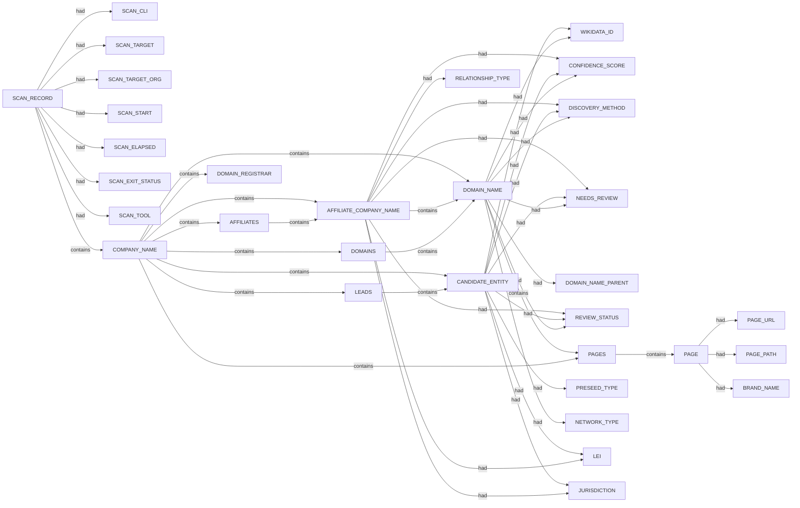

# Pius scan narrative — `corporate_bbc_gleif_ndjson`

## Introduction

Organizational attack-surface findings are grouped under the head company, with domains, affiliates, and unresolved research leads emitted per 08 rules.

## Organization

- `British Broadcasting Corporation`

## Domains

- `24hrhack.test.tools.bbc.co.uk`
- `24hrhack.tools.bbc.co.uk`
- `2entertain.co.uk`
- `500words.external.bbc.co.uk`
- `5live.mediapool.tools.bbc.co.uk`
- `99dnstemplate99.int.cfp.ch.bbc.co.uk`
- `99dnstemplate99.samn.cfp.ch.bbc.co.uk`
- `a1.api.bbc.co.uk`
- `a11yadmin.tools.bbc.co.uk`
- `a2.api.bbc.co.uk`
- `a3.api.bbc.co.uk`
- `a4.api.bbc.co.uk`
- `a5.api.bbc.co.uk`
- `a6.api.bbc.co.uk`
- `a7.api.bbc.co.uk`
- `access.id.stage.tools.bbc.co.uk`
- `access.id.test.tools.bbc.co.uk`
- `access001.bbc.co.uk`
- `account.id.api.bbc.co.uk`
- `account.id.int.api.bbc.co.uk`
- `account.id.stage.api.bbc.co.uk`
- `account.id.test.api.bbc.co.uk`
- `accountunlock.tools.bbc.co.uk`
- `activity.api.bbc.co.uk`
- `activity.int.api.bbc.co.uk`
- `activity.stage.api.bbc.co.uk`
- `activity.test.api.bbc.co.uk`
- `ada.national.core.bbc.co.uk`
- `admin.food.tools.bbc.co.uk`
- `admin.live.bbc.co.uk`
- `admin.partner.platform.int.tools.bbc.co.uk`
- `admin.partner.platform.stage.tools.bbc.co.uk`
- `admin.partner.platform.test.tools.bbc.co.uk`
- `admin.partner.platform.tools.bbc.co.uk`
- `admin.stage.bbc.co.uk`
- `admin.test.bbc.co.uk`
- `admin.weatherwatchers.tools.bbc.co.uk`
- `ajrt99dnsname99.int.cfp.ch.bbc.co.uk`
- `albdemo.int.cfp.ch.bbc.co.uk`
- `amigo.tools.bbc.co.uk`
- `analytics.zenoss.stage.tools.bbc.co.uk`
- `analytics.zenoss.tools.bbc.co.uk`
- `api.bbc.co.uk`
- `api.ccs.bbc.co.uk`
- `api.digitalarchive.test.tools.bbc.co.uk`
- `api.freebird.prototyping.bbc.co.uk`
- `api.live.bbc.co.uk`
- `api.newshub.bbc.co.uk`
- `api.stage.bbc.co.uk`
- `api.test.bbc.co.uk`
- `apippr.ccs.bbc.co.uk`
- `apiqas.ccs.bbc.co.uk`
- `appletv.iplayer.api.bbc.co.uk`
- `appletv.iplayer.test.api.bbc.co.uk`
- `archivesearch.beta.tools.bbc.co.uk`
- `archivesearch.tools.bbc.co.uk`
- `archiveservices.tools.bbc.co.uk`
- `archivestatus.tools.bbc.co.uk`
- `as.im.myconnect.bbc.co.uk`
- `atoz.iplayer.api.bbc.co.uk`
- `atoz.iplayer.test.api.bbc.co.uk`
- `audiences-portal-picker.external.bbc.co.uk`
- `audiences-portal-picker.external.stage.bbc.co.uk`
- `audiences-portal-picker.external.test.bbc.co.uk`
- `audiences-portal.api.bbc.co.uk`
- `audiences-portal.int.api.bbc.co.uk`
- `audiences-portal.int.tools.bbc.co.uk`
- `audiences-portal.test.api.bbc.co.uk`
- `audiences-portal.test.tools.bbc.co.uk`
- `audiences-portal.tools.bbc.co.uk`
- `audiences-stg.external.bbc.co.uk`
- `audiences.external.bbc.co.uk`
- `audiomusic.mediapool.tools.bbc.co.uk`
- `audiomusicproduction.mediapool.tools.bbc.co.uk`
- `audiomusicsalford.mediapool.tools.bbc.co.uk`
- `autodiscover.bbc.co.uk`
- `autodiscovertest.bbc.co.uk`
- `autorot.gateway.bbc.co.uk`
- `av-activity.int.tools.bbc.co.uk`
- `av-activity.test.tools.bbc.co.uk`
- `av-activity.tools.bbc.co.uk`
- `av-activity.training.tools.bbc.co.uk`
- `av.bbc.co.uk`
- `bag.api.bbc.co.uk`
- `bag.int.api.bbc.co.uk`
- `bag.stage.api.bbc.co.uk`
- `bag.test.api.bbc.co.uk`
- `ballotbox.cloud.bbc.co.uk`
- `ballotbox.test.cloud.bbc.co.uk`
- `barb.co.uk`
- `basicssotokensigning.bbc.co.uk`
- `bass.stage.bbc.co.uk`
- `bbc-together.api.bbc.co.uk`
- `bbc.co.uk`
- `bbc.com`
- `bbcbenelux.com`
- `bbccymru.com`
- `bbcguestwifi.national.core.bbc.co.uk`
- `bbchd.com`
- `bbchelloworld.co.uk`
- `bbcid-contact-stg.external.bbc.co.uk`
- `bbcid-contact.external.bbc.co.uk`
- `bbcidentity.id.dev1.tools.bbc.co.uk`
- `bbcidentity.id.dev2.tools.bbc.co.uk`
- `bbcidentity.id.dev3.tools.bbc.co.uk`
- `bbcidentity.id.dev4.tools.bbc.co.uk`
- `bbcidentity.id.iddev.tools.bbc.co.uk`
- `bbcidentity.id.qa1.tools.bbc.co.uk`
- `bbcidentity.id.qa2.tools.bbc.co.uk`
- `bbcidentity.id.qa3.tools.bbc.co.uk`
- `bbcidentity.id.qa4.tools.bbc.co.uk`
- `bbcidentity.id.sanity.tools.bbc.co.uk`
- `bbcidentity.id.stage.tools.bbc.co.uk`
- `bbcidentity.id.support.tools.bbc.co.uk`
- `bbcidentity.id.test.tools.bbc.co.uk`
- `bbcidentity.id.tools.bbc.co.uk`
- `bbcidentity.id.training.tools.bbc.co.uk`
- `bbcidgovernance.id.tools.bbc.co.uk`
- `bbciga.id.tools.bbc.co.uk`
- `bbclogin.id.dev1.tools.bbc.co.uk`
- `bbclogin.id.dev2.tools.bbc.co.uk`
- `bbclogin.id.dev3.tools.bbc.co.uk`
- `bbclogin.id.dev4.tools.bbc.co.uk`
- `bbclogin.id.iddev.tools.bbc.co.uk`
- `bbclogin.id.int.tools.bbc.co.uk`
- `bbclogin.id.qa.tools.bbc.co.uk`
- `bbclogin.id.qa1.tools.bbc.co.uk`
- `bbclogin.id.qa2.tools.bbc.co.uk`
- `bbclogin.id.qa3.tools.bbc.co.uk`
- `bbclogin.id.qa4.tools.bbc.co.uk`
- `bbclogin.id.sanity.tools.bbc.co.uk`
- `bbclogin.id.stage.tools.bbc.co.uk`
- `bbclogin.id.support.tools.bbc.co.uk`
- `bbclogin.id.test.tools.bbc.co.uk`
- `bbclogin.id.tools.bbc.co.uk`
- `bbclogin.id.training.tools.bbc.co.uk`
- `bbcm-user-portal-admin.int.tools.bbc.co.uk`
- `bbcm-user-portal-admin.test.tools.bbc.co.uk`
- `bbcm-user-portal-admin.tools.bbc.co.uk`
- `bbcm-volt-media-proxy.api.bbc.co.uk`
- `bbcm-volt-media-proxy.int.api.bbc.co.uk`
- `bbcm-volt-media-proxy.test.api.bbc.co.uk`
- `bbcmon.bbc.co.uk`
- `bbcnews.com`
- `bbcnle056.national.core.bbc.co.uk`
- `bbcnle057.national.core.bbc.co.uk`
- `bbcnordic.com`
- `bbcsignups.external.bbc.co.uk`
- `bbcstudios.com`
- `bbcstudioworks.com`
- `bbcweb3hytmzhn5d532owbu6oqadra5z3ar726vq5kgwwn6aucdccrad.onion`
- `bbcworldservice.com`
- `bbcworldwide.com`
- `beebtalk.dev.bbc.co.uk`
- `belfrage.api.bbc.co.uk`
- `belfrage.test.api.bbc.co.uk`
- `beta.bbc.co.uk`
- `bgb01ap1526.national.core.bbc.co.uk`
- `bgb01ap1527.national.core.bbc.co.uk`
- `bgb01ap1528.national.core.bbc.co.uk`
- `bgb01ap1529.national.core.bbc.co.uk`
- `bgb01apldr1001.national.core.bbc.co.uk`
- `bgb01apldr1002.national.core.bbc.co.uk`
- `bgb01aplfe1001.national.core.bbc.co.uk`
- `bgb01aplfe1002.national.core.bbc.co.uk`
- `bgb01aplfe1003.national.core.bbc.co.uk`
- `bgb01aplfe1004.national.core.bbc.co.uk`
- `bgb01aplfe1005.national.core.bbc.co.uk`
- `bgb01aplfe1006.national.core.bbc.co.uk`
- `bgb01wa1017.selfservice.bbc.co.uk`
- `bgb01wa9002.selfservice.bbc.co.uk`
- `bgb48wa1003.national.core.bbc.co.uk`
- `bgbgwwa1005.national.core.bbc.co.uk`
- `bgbsawa1001.national.core.bbc.co.uk`
- `bgbsawa1003.national.core.bbc.co.uk`
- `bidi.live.bbc.co.uk`
- `bidi.stage.bbc.co.uk`
- `blccdffe01.ucgb.core.bbc.co.uk`
- `blccdffe02.ucgb.core.bbc.co.uk`
- `blccdffe03.ucgb.core.bbc.co.uk`
- `blccdffe04.ucgb.core.bbc.co.uk`
- `blccdffe05.ucgb.core.bbc.co.uk`
- `blccdffe06.ucgb.core.bbc.co.uk`
- `blccdffe07.ucgb.core.bbc.co.uk`
- `blccdfsql01.ucgb.core.bbc.co.uk`
- `blccdfsql02.ucgb.core.bbc.co.uk`
- `blccdfwac01.ucgb.core.bbc.co.uk`
- `blccdfwac02.ucgb.core.bbc.co.uk`
- `blclonfe01.ucgb.core.bbc.co.uk`
- `blclonfe02.ucgb.core.bbc.co.uk`
- `blclonfe03.ucgb.core.bbc.co.uk`
- `blclonfe04.ucgb.core.bbc.co.uk`
- `blclonfe05.ucgb.core.bbc.co.uk`
- `blclonfe06.ucgb.core.bbc.co.uk`
- `blclonfe07.ucgb.core.bbc.co.uk`
- `blclonsql01.ucgb.core.bbc.co.uk`
- `blclonsql02.ucgb.core.bbc.co.uk`
- `blclonwac01.ucgb.core.bbc.co.uk`
- `blclonwac02.ucgb.core.bbc.co.uk`
- `bobcat.cfp.ch.bbc.co.uk`
- `bobcat.pdn.cfp.ch.bbc.co.uk`
- `bobcat.sammg.cfp.ch.bbc.co.uk`
- `bobcat.simonra.cfp.ch.bbc.co.uk`
- `bobcat.sk.cfp.ch.bbc.co.uk`
- `bobcat.watches.cfp.ch.bbc.co.uk`
- `boomr.iplayer.api.bbc.co.uk`
- `boomr.iplayer.test.api.bbc.co.uk`
- `borodin.api.bbc.co.uk`
- `borodin.test.api.bbc.co.uk`
- `branding.tools.bbc.co.uk`
- `brasil.bbchd.com`
- `bt.cdnsecurestg.bbc.co.uk`
- `burp.appsec.tools.bbc.co.uk`
- `buzz-cms.int.tools.bbc.co.uk`
- `buzz-cms.stage.tools.bbc.co.uk`
- `buzz-cms.tools.bbc.co.uk`
- `buzz-moderation.int.tools.bbc.co.uk`
- `buzz-moderation.stage.tools.bbc.co.uk`
- `buzz-moderation.tools.bbc.co.uk`
- `byod-enrol.selfservice.bbc.co.uk`
- `c1b1bteaips.sp.bidi.live.bbc.co.uk`
- `ca.dev.bbc.co.uk`
- `campaign-attribution-gateway.api.bbc.co.uk`
- `campaign-attribution-gateway.int.api.bbc.co.uk`
- `campaign-attribution-gateway.stage.api.bbc.co.uk`
- `campaign-attribution-gateway.test.api.bbc.co.uk`
- `careers.bbc.co.uk`
- `careershub.bbc.co.uk`
- `careerssearch.bbc.co.uk`
- `castaway.cloud.bbc.co.uk`
- `castaway.int.cloud.bbc.co.uk`
- `castaway.int.tools.bbc.co.uk`
- `castaway.test.cloud.bbc.co.uk`
- `castaway.test.tools.bbc.co.uk`
- `castaway.tools.bbc.co.uk`
- `cdffepool01.ucgb.core.bbc.co.uk`
- `cdfsip01.bbc.co.uk`
- `cdfwacext01.bbc.co.uk`
- `cdfwacint01.ucgb.core.bbc.co.uk`
- `cdfwebconf01.bbc.co.uk`
- `cdfwebext01.bbc.co.uk`
- `cdfwebint01.ucgb.core.bbc.co.uk`
- `cdn-www-staging.bbc.co.uk`
- `cdn-www-staging.stage.bbc.co.uk`
- `cdn-www-staging.test.bbc.co.uk`
- `cdn-www.bbc.co.uk`
- `cdn-www.stage.bbc.co.uk`
- `cdn-www.test.bbc.co.uk`
- `cdndl.ak.freesat.iplayer.bbc.co.uk`
- `cdndlhttp.ak.stb.iplayer.bbc.co.uk`
- `cdndlhttp.llnw.sec.iplayer.bbc.co.uk`
- `cdndownloads-akamai-hls.bbc.co.uk`
- `cdndownloads.bbc.co.uk`
- `cdnedge.bbc.co.uk`
- `cdnelectradlhttp.iplayer.bbc.co.uk`
- `cdnsecure.bbc.co.uk`
- `cdnsecurestg.bbc.co.uk`
- `cdnstaging.bbc.co.uk`
- `cdnwii-dl.ak.nintendo.iplayer.bbc.co.uk`
- `ci.childrens-apps-jenkins.int.tools.bbc.co.uk`
- `ci.childrens-apps-jenkins.test.tools.bbc.co.uk`
- `ci.childrens-apps-jenkins.tools.bbc.co.uk`
- `ci.core.morph.test.tools.bbc.co.uk`
- `ci.core.morph.tools.bbc.co.uk`
- `ci.morph-template-jenkins.tools.bbc.co.uk`
- `ci.shortform.int.tools.bbc.co.uk`
- `ci.silver.int.tools.bbc.co.uk`
- `ci.sls.tools.bbc.co.uk`
- `ci.sport-web.tools.bbc.co.uk`
- `ci.sport.int.tools.bbc.co.uk`
- `ci.sport.tools.bbc.co.uk`
- `ci.user.morph.int.tools.bbc.co.uk`
- `ci.user.morph.tools.bbc.co.uk`
- `cinserv2.national.core.bbc.co.uk`
- `click.ma.mailenvelope.bbc.co.uk`
- `comments.api.bbc.co.uk`
- `comments.int.api.bbc.co.uk`
- `comments.stage.api.bbc.co.uk`
- `comments.test.api.bbc.co.uk`
- `complaints-stg.external.bbc.co.uk`
- `complaints.external.bbc.co.uk`
- `confluence-stage.dev.bbc.co.uk`
- `confluence-test.dev.bbc.co.uk`
- `confluence.dev.bbc.co.uk`
- `connected-data.tools.bbc.co.uk`
- `connectedstudio.tools.bbc.co.uk`
- `consultations.external.bbc.co.uk`
- `cookie-oven.api.bbc.co.uk`
- `cookie-oven.int.api.bbc.co.uk`
- `cookie-oven.test.api.bbc.co.uk`
- `cornmarket-profiler.test.tools.bbc.co.uk`
- `cornmarket-quiz-app.test.tools.bbc.co.uk`
- `cornmarket-spotify.test.tools.bbc.co.uk`
- `cosmos.tools.bbc.co.uk`
- `cps-telemetry.tools.bbc.co.uk`
- `credible.pdn.cfp.ch.bbc.co.uk`
- `crl-ejbca.int.bbc.co.uk`
- `crl-ejbca.stage.bbc.co.uk`
- `crl-ejbca.test.bbc.co.uk`
- `csapi-dev.bbc.co.uk`
- `customers.monitor.bbc.co.uk`
- `d.bbc.co.uk`
- `da-local.bbc.co.uk`
- `darwin.test.tools.bbc.co.uk`
- `darwin.tools.bbc.co.uk`
- `dashboard.iplayer.tools.bbc.co.uk`
- `dashboards.redbutton.test.tools.bbc.co.uk`
- `dashboards.redbutton.tools.bbc.co.uk`
- `dashboards.tools.bbc.co.uk`
- `data.int.bbc.co.uk`
- `dax-stats.iplayer.cloud.bbc.co.uk`
- `dba-oem.dev.bbc.co.uk`
- `demo-intranet.gateway.bbc.co.uk`
- `demo-phapps.gateway.bbc.co.uk`
- `demo.sammg.cfp.ch.bbc.co.uk`
- `deployment-validation.ap.partner.platform.int.tools.bbc.co.uk`
- `deployment-validation.ap.partner.platform.test.tools.bbc.co.uk`
- `deployment-validation.ap.partner.platform.tools.bbc.co.uk`
- `dev-iplatforms.kw.bbc.co.uk`
- `dev.bbc.co.uk`
- `developer.bbc.co.uk`
- `dh-c0a.tp.ch.bbc.co.uk`
- `dh-c0b.tp.ch.bbc.co.uk`
- `dh-c0c.tp.ch.bbc.co.uk`
- `dh-c0d.tp.ch.bbc.co.uk`
- `dh-c0e.tp.ch.bbc.co.uk`
- `dh-c0f.tp.ch.bbc.co.uk`
- `dh-c0g.tp.ch.bbc.co.uk`
- `dh-c0h.tp.ch.bbc.co.uk`
- `dh-c1a.tp.ch.bbc.co.uk`
- `dh-c1b.tp.ch.bbc.co.uk`
- `dh-c1c.tp.ch.bbc.co.uk`
- `dh-c1d.tp.ch.bbc.co.uk`
- `dh-c2a.tp.ch.bbc.co.uk`
- `dh-c2b.tp.ch.bbc.co.uk`
- `dh-c2c.tp.ch.bbc.co.uk`
- `dh-c2d.tp.ch.bbc.co.uk`
- `dh-dash0.tp.ch.bbc.co.uk`
- `dh-mv0.tp.ch.bbc.co.uk`
- `dh0.bbc.co.uk`
- `dialin.bbc.co.uk`
- `digital247status.int.tools.bbc.co.uk`
- `digital247status.test.tools.bbc.co.uk`
- `digital247status.tools.bbc.co.uk`
- `digitalarchive.stage.tools.bbc.co.uk`
- `digitalarchive.test.tools.bbc.co.uk`
- `digitalarchive.tools.bbc.co.uk`
- `director.api.bbc.co.uk`
- `dirpool001.national.core.bbc.co.uk`
- `dirweb001.bbc.co.uk`
- `dirweb001.national.core.bbc.co.uk`
- `discussions.api.bbc.co.uk`
- `discussions.int.api.bbc.co.uk`
- `discussions.stage.api.bbc.co.uk`
- `discussions.test.api.bbc.co.uk`
- `dl.sec.iplayer.bbc.co.uk`
- `dmkarcade.api.bbc.co.uk`
- `dmkarcade.stage.api.bbc.co.uk`
- `dmkarcade.stage.tools.bbc.co.uk`
- `dmkarcade.tools.bbc.co.uk`
- `docker.iplayer.tools.bbc.co.uk`
- `docs.newshub.bbc.co.uk`
- `download.im.myconnect.bbc.co.uk`
- `downloads-app.iplayer.api.bbc.co.uk`
- `downloads-app.iplayer.test.api.bbc.co.uk`
- `downloads.bbc.co.uk`
- `downloads.stage.bbc.co.uk`
- `dp.svc.bbc.co.uk`
- `dpnle.svc.bbc.co.uk`
- `dropzone.bbc.co.uk`
- `e.bbclogin.id.test.tools.bbc.co.uk`
- `e.bbclogin.id.tools.bbc.co.uk`
- `e.gateway.id.stage.tools.bbc.co.uk`
- `e.gateway.id.test.tools.bbc.co.uk`
- `e.gateway.id.tools.bbc.co.uk`
- `eavis-admin.int.tools.bbc.co.uk`
- `eavis-admin.test.tools.bbc.co.uk`
- `eavis-admin.tools.bbc.co.uk`
- `eba.test.tools.bbc.co.uk`
- `eba.tools.bbc.co.uk`
- `email-b.myconnect.bbc.co.uk`
- `email.myconnect.bbc.co.uk`
- `email2003.myconnect.bbc.co.uk`
- `emailtest.myconnect.bbc.co.uk`
- `emp.bbc.co.uk`
- `emp.live.bbc.co.uk`
- `emp.stage.bbc.co.uk`
- `emp.test.bbc.co.uk`
- `eng.bbc.co.uk`
- `england.mediapool.tools.bbc.co.uk`
- `enterpriseregistration.pitch.bbc.co.uk`
- `euca-engine1.svc.bbc.co.uk`
- `euca-engine2.svc.bbc.co.uk`
- `euca-engine3.svc.bbc.co.uk`
- `euca-engine4.svc.bbc.co.uk`
- `euca-engine5.svc.bbc.co.uk`
- `euca-engine6.svc.bbc.co.uk`
- `euca-engine7.svc.bbc.co.uk`
- `euca-nleengine1.svc.bbc.co.uk`
- `euca-nleengine2.svc.bbc.co.uk`
- `exp.videoconferencing.bbc.co.uk`
- `expccluster1.rd.bbc.co.uk`
- `expe01.videoconferencing.bbc.co.uk`
- `expe02.videoconferencing.bbc.co.uk`
- `expressc2.rd.bbc.co.uk`
- `expressc3.rd.bbc.co.uk`
- `expresse0.rd.bbc.co.uk`
- `expresse1.rd.bbc.co.uk`
- `ext-proteus.external.bbc.co.uk`
- `ext-proteusdev.external.bbc.co.uk`
- `ext-proteusstage.external.bbc.co.uk`
- `ext-proteusuat.external.bbc.co.uk`
- `external-their.myconnect.bbc.co.uk`
- `external.mobileapps.bbc.co.uk`
- `extra-proteus.external.bbc.co.uk`
- `fabric.bbc.co.uk`
- `faq.external.bbc.co.uk`
- `fasp.aspera.reith.bbc.co.uk`
- `fbd-dashboard.tools.bbc.co.uk`
- `fbd-playout-view-gnl.tools.bbc.co.uk`
- `fbd-playout-view.tools.bbc.co.uk`
- `fbd-status.test.tools.bbc.co.uk`
- `fbd-status.tools.bbc.co.uk`
- `fbd-uid-monitoring.tools.bbc.co.uk`
- `features.iplayer.api.bbc.co.uk`
- `features.iplayer.test.api.bbc.co.uk`
- `feeds.bbc.co.uk`
- `feweb001.bbc.co.uk`
- `feweb001.national.core.bbc.co.uk`
- `fgbsajvapib000.national.core.bbc.co.uk`
- `fgbsajvmpxb000.national.core.bbc.co.uk`
- `fgbsajvwebb000.national.core.bbc.co.uk`
- `fgbw1apviz4301.da-local.bbc.co.uk`
- `fgbw1apviz4302.da-local.bbc.co.uk`
- `fgbw1apviz4303.da-local.bbc.co.uk`
- `fig.bbc.co.uk`
- `fig.int.bbc.co.uk`
- `fig.stage.bbc.co.uk`
- `fig.test.bbc.co.uk`
- `finance.national.core.bbc.co.uk`
- `focalpoint.bbc.co.uk`
- `freebird.prototyping.bbc.co.uk`
- `freesat.co.uk`
- `freeview.co.uk`
- `gateway.id.dev1.tools.bbc.co.uk`
- `gateway.id.dev2.tools.bbc.co.uk`
- `gateway.id.dev3.tools.bbc.co.uk`
- `gateway.id.dev4.tools.bbc.co.uk`
- `gateway.id.iddev.tools.bbc.co.uk`
- `gateway.id.int.tools.bbc.co.uk`
- `gateway.id.qa.tools.bbc.co.uk`
- `gateway.id.qa1.tools.bbc.co.uk`
- `gateway.id.qa2.tools.bbc.co.uk`
- `gateway.id.qa3.tools.bbc.co.uk`
- `gateway.id.qa4.tools.bbc.co.uk`
- `gateway.id.sanity.tools.bbc.co.uk`
- `gateway.id.stage.tools.bbc.co.uk`
- `gateway.id.support.tools.bbc.co.uk`
- `gateway.id.test.tools.bbc.co.uk`
- `gateway.id.tools.bbc.co.uk`
- `gateway.id.training.tools.bbc.co.uk`
- `genome.ch.bbc.co.uk`
- `gn-features.stage.tools.bbc.co.uk`
- `gn-features.test.tools.bbc.co.uk`
- `gn-web-assets.api.bbc.co.uk`
- `graph.ibl.api.bbc.co.uk`
- `graph.ibl.test.api.bbc.co.uk`
- `guest-cp.bbc.co.uk`
- `guestwifi.national.core.bbc.co.uk`
- `guide.iplayer.api.bbc.co.uk`
- `guide.iplayer.test.api.bbc.co.uk`
- `gwapps-stage.gateway.bbc.co.uk`
- `gwapps.gateway.bbc.co.uk`
- `h.cd.tools.bbc.co.uk`
- `h1.svc.bbc.co.uk`
- `h2.cd.test.tools.bbc.co.uk`
- `h2.cd.tools.bbc.co.uk`
- `h2.svc.bbc.co.uk`
- `h2g2.com`
- `h3.svc.bbc.co.uk`
- `h4.svc.bbc.co.uk`
- `hack-it.tools.bbc.co.uk`
- `hcmdev.ccs.bbc.co.uk`
- `hcmlaunchpad.ccs.bbc.co.uk`
- `hcmppr.ccs.bbc.co.uk`
- `hcmqas.ccs.bbc.co.uk`
- `heartbeat.activity.api.bbc.co.uk`
- `heartbeat.activity.int.api.bbc.co.uk`
- `heartbeat.activity.stage.api.bbc.co.uk`
- `heartbeat.activity.test.api.bbc.co.uk`
- `help.bbclogin.id.stage.tools.bbc.co.uk`
- `help.bbclogin.id.test.tools.bbc.co.uk`
- `help.bbclogin.id.tools.bbc.co.uk`
- `highlights.iplayer.api.bbc.co.uk`
- `highlights.iplayer.test.api.bbc.co.uk`
- `homepage-mobile-app.api.bbc.co.uk`
- `homepage-mobile-app.test.api.bbc.co.uk`
- `homepage-recs-service.api.bbc.co.uk`
- `homepage-recs-service.test.api.bbc.co.uk`
- `homepage.api.bbc.co.uk`
- `homepage.iplayer.api.bbc.co.uk`
- `homepage.iplayer.test.api.bbc.co.uk`
- `homepage.test.api.bbc.co.uk`
- `i.bbclogin.id.stage.tools.bbc.co.uk`
- `i.bbclogin.id.test.tools.bbc.co.uk`
- `i.bbclogin.id.tools.bbc.co.uk`
- `i.gateway.id.stage.tools.bbc.co.uk`
- `i.gateway.id.test.tools.bbc.co.uk`
- `i.gateway.id.tools.bbc.co.uk`
- `ibl.api.bbc.co.uk`
- `ibl.test.api.bbc.co.uk`
- `ibroadcast3.tools.bbc.co.uk`
- `ichef-1.bbc.co.uk`
- `ichef-1.int.bbc.co.uk`
- `ichef-1.stage.bbc.co.uk`
- `ichef-1.test.bbc.co.uk`
- `ichef.bbc.co.uk`
- `ichef.int.bbc.co.uk`
- `ichef.stage.bbc.co.uk`
- `ichef.test.bbc.co.uk`
- `id.bbc.co.uk`
- `id.stage.bbc.co.uk`
- `id.test.bbc.co.uk`
- `id.tools.bbc.co.uk`
- `idc01ap0197.national.core.bbc.co.uk`
- `idc01ap0198.national.core.bbc.co.uk`
- `idc01ap0199.national.core.bbc.co.uk`
- `idc01ap0572.national.core.bbc.co.uk`
- `idc01ap0573.national.core.bbc.co.uk`
- `idc01ap0580.national.core.bbc.co.uk`
- `idc01ap0581.national.core.bbc.co.uk`
- `idcta-origin.api.bbc.co.uk`
- `idcta-origin.int.api.bbc.co.uk`
- `idcta-origin.stage.api.bbc.co.uk`
- `idcta-origin.test.api.bbc.co.uk`
- `idex-ml.cloud.bbc.co.uk`
- `idex-ml.test.cloud.bbc.co.uk`
- `idgateway.id.tools.bbc.co.uk`
- `idp.api.bbc.co.uk`
- `idp.int.api.bbc.co.uk`
- `idp.stage.api.bbc.co.uk`
- `idp.test.api.bbc.co.uk`
- `idp1.api.bbc.co.uk`
- `idp1.int.api.bbc.co.uk`
- `idp1.stage.api.bbc.co.uk`
- `idp1.test.api.bbc.co.uk`
- `idt.vj.tools.bbc.co.uk`
- `idt2.int.tools.bbc.co.uk`
- `idt2.live.tools.bbc.co.uk`
- `idt2.test.tools.bbc.co.uk`
- `idt2.tools.bbc.co.uk`
- `im.myconnect.bbc.co.uk`
- `image-generator.vj.api.bbc.co.uk`
- `image-upload-activity.int.tools.bbc.co.uk`
- `image-upload-activity.test.tools.bbc.co.uk`
- `image-upload-activity.tools.bbc.co.uk`
- `image-upload-activity.training.tools.bbc.co.uk`
- `imap.rd.bbc.co.uk`
- `img.bbc-sib-smtp1.shows.bbc.co.uk`
- `img.bbc-sib-smtp2.shows.bbc.co.uk`
- `img.bbc-sib-smtp3.shows.bbc.co.uk`
- `img.bbc-sib-smtp4.shows.bbc.co.uk`
- `img.bbc-sib-smtp5.shows.bbc.co.uk`
- `img.bbc-sib-smtp6.shows.bbc.co.uk`
- `inspector.iplayer.tools.bbc.co.uk`
- `install-rth.sis.bbc.co.uk`
- `int.api.bbc.co.uk`
- `int.bbc.co.uk`
- `int.tips.jupiter.bbc.co.uk`
- `int.tools.bbc.co.uk`
- `integration-pprd.national.core.bbc.co.uk`
- `integration.national.core.bbc.co.uk`
- `internal.dev.bbc.co.uk`
- `internal.int.bbc.co.uk`
- `internal.live.bbc.co.uk`
- `internal.stage.bbc.co.uk`
- `internal.test.bbc.co.uk`
- `intranet-stage.gateway.bbc.co.uk`
- `intranet.gateway.bbc.co.uk`
- `introducing-service-ad.api.bbc.co.uk`
- `introducing-service-internal.test.api.bbc.co.uk`
- `introducing-service.api.bbc.co.uk`
- `introducing-service.int.api.bbc.co.uk`
- `introducing-service.test.api.bbc.co.uk`
- `introducing.int.tools.bbc.co.uk`
- `introducing.test.tools.bbc.co.uk`
- `introducing.tools.bbc.co.uk`
- `iplayer.api.bbc.co.uk`
- `iplayer.test.api.bbc.co.uk`
- `iplayer.tools.bbc.co.uk`
- `iplayerhelp-stg.external.bbc.co.uk`
- `iplayerhelp.external.bbc.co.uk`
- `iplayldsvip.iplayer.bbc.co.uk`
- `iplayldsvip.test.iplayer.bbc.co.uk`
- `ivote.api.bbc.co.uk`
- `ivote.int.api.bbc.co.uk`
- `ivote.stage.api.bbc.co.uk`
- `ivote.test.api.bbc.co.uk`
- `jenkins.partner-platform.int.tools.bbc.co.uk`
- `jenkins.partner-platform.test.tools.bbc.co.uk`
- `jenkins.partner-platform.tools.bbc.co.uk`
- `jenkins.redbutton.tools.bbc.co.uk`
- `jira-int.dev.bbc.co.uk`
- `jira-stage.dev.bbc.co.uk`
- `jira-test.dev.bbc.co.uk`
- `jira.dev.bbc.co.uk`
- `jira7-int.dev.bbc.co.uk`
- `jira7-stage.dev.bbc.co.uk`
- `jira7-test.dev.bbc.co.uk`
- `jira7.dev.bbc.co.uk`
- `jobs.bbc.co.uk`
- `jupiter.national.core.bbc.co.uk`
- `k.bbclogin.id.tools.bbc.co.uk`
- `k.gateway.id.tools.bbc.co.uk`
- `kdms-app.int3.iplayer.bbc.co.uk`
- `kdms-app.iplayer.bbc.co.uk`
- `kdms-app.test.iplayer.bbc.co.uk`
- `kdms-client.iplayer.bbc.co.uk`
- `kdms-client.test.iplayer.bbc.co.uk`
- `knowledge.appsec.tools.bbc.co.uk`
- `kudugw.national.core.bbc.co.uk`
- `kudugwdr.national.core.bbc.co.uk`
- `kudutest.national.core.bbc.co.uk`
- `limelight.cdnsecure.bbc.co.uk`
- `lists.bbc.co.uk`
- `lists.forge.bbc.co.uk`
- `lists.iplayer.api.bbc.co.uk`
- `lists.iplayer.test.api.bbc.co.uk`
- `live.bbc.co.uk`
- `live.mf.bbc.co.uk`
- `location-search-and-setting.tools.bbc.co.uk`
- `login.int.tools.bbc.co.uk`
- `login.live.tools.bbc.co.uk`
- `login.test.tools.bbc.co.uk`
- `logs.forge.bbc.co.uk`
- `london.mediapool.tools.bbc.co.uk`
- `lonfepool01.ucgb.core.bbc.co.uk`
- `lonsip01.bbc.co.uk`
- `lonwacext01.bbc.co.uk`
- `lonwacint01.ucgb.core.bbc.co.uk`
- `lonwebconf01.bbc.co.uk`
- `lonwebext01.bbc.co.uk`
- `lonwebint01.ucgb.core.bbc.co.uk`
- `lyncadmin.national.core.bbc.co.uk`
- `lyncdiscover.bbc.co.uk`
- `lyncdiscoverinternal.bbc.co.uk`
- `lyncpool001.national.core.bbc.co.uk`
- `m.bbc.co.uk`
- `m.int.bbc.co.uk`
- `m.live.bbc.co.uk`
- `m.stage.bbc.co.uk`
- `m.test.bbc.co.uk`
- `magpie.cfp.ch.bbc.co.uk`
- `magpie.fearn.cfp.ch.bbc.co.uk`
- `magpie.int.cfp.ch.bbc.co.uk`
- `magpie.jpw.cfp.ch.bbc.co.uk`
- `magpie.jpwa.cfp.ch.bbc.co.uk`
- `magpie.pdn.cfp.ch.bbc.co.uk`
- `magpie.sammg.cfp.ch.bbc.co.uk`
- `magpie.sammg2.cfp.ch.bbc.co.uk`
- `magpie.samn.cfp.ch.bbc.co.uk`
- `magpie.simonra.cfp.ch.bbc.co.uk`
- `magpie.sk.cfp.ch.bbc.co.uk`
- `magpie.toddb.cfp.ch.bbc.co.uk`
- `mail.reith.bbc.co.uk`
- `mailbox.rd.bbc.co.uk`
- `mailin0.cwwtf.bbc.co.uk`
- `mailin0.telhc.bbc.co.uk`
- `mailin1.cwwtf.bbc.co.uk`
- `mailin1.telhc.bbc.co.uk`
- `mailin2.cwwtf.bbc.co.uk`
- `mailin2.telhc.bbc.co.uk`
- `mailout0.cwwtf.bbc.co.uk`
- `mailout0.telhc.bbc.co.uk`
- `mailout1.cwwtf.bbc.co.uk`
- `mailout1.telhc.bbc.co.uk`
- `mailout2.cwwtf.bbc.co.uk`
- `mailout2.telhc.bbc.co.uk`
- `makerbox-discourse.tools.bbc.co.uk`
- `manager.archiveservices.tools.bbc.co.uk`
- `manchester.mediapool.tools.bbc.co.uk`
- `mango-res.freebird.prototyping.bbc.co.uk`
- `marooned.test.tools.bbc.co.uk`
- `marooned.tools.bbc.co.uk`
- `marvin2-console.int.tools.bbc.co.uk`
- `marvin2-console.test.tools.bbc.co.uk`
- `marvin2-console.tools.bbc.co.uk`
- `matchmaker.int.md.bbc.co.uk`
- `matchmaker.live.md.bbc.co.uk`
- `matchmaker.test.md.bbc.co.uk`
- `mattermost.tvmp.dev.bbc.co.uk`
- `mcmdm.svc.bbc.co.uk`
- `mcmdmnle.svc.bbc.co.uk`
- `mcupdate.svc.bbc.co.uk`
- `mcupdatenle.svc.bbc.co.uk`
- `media.digitalarchive.stage.tools.bbc.co.uk`
- `media.digitalarchive.test.tools.bbc.co.uk`
- `media.digitalarchive.tools.bbc.co.uk`
- `mediapool.tools.bbc.co.uk`
- `meet.bbc.co.uk`
- `mf.live.bbc.co.uk`
- `mf.stage.bbc.co.uk`
- `mgb01wssdm1001.global.mon.bbc.co.uk`
- `middlebox.cfp.ch.bbc.co.uk`
- `millbank.mediapool.tools.bbc.co.uk`
- `mira.test.tools.bbc.co.uk`
- `mira.tools.bbc.co.uk`
- `miraftp.test.tools.bbc.co.uk`
- `miraftp.tools.bbc.co.uk`
- `miramedia.test.tools.bbc.co.uk`
- `miramedia.tools.bbc.co.uk`
- `mm.bidi.bbc.co.uk`
- `mm.bidi.int.bbc.co.uk`
- `mm.bidi.live.bbc.co.uk`
- `mm.bidi.test.bbc.co.uk`
- `mmc-backend-dual.bbc.co.uk`
- `mmc-backend.int.bbc.co.uk`
- `mmc-backend.stage.bbc.co.uk`
- `mmc-backend.test.bbc.co.uk`
- `mobile-ci.tvmp.dev.bbc.co.uk`
- `mobileci.test.tools.bbc.co.uk`
- `mobileci.tools.bbc.co.uk`
- `moderateduser.api.bbc.co.uk`
- `moderateduser.int.api.bbc.co.uk`
- `moderateduser.stage.api.bbc.co.uk`
- `moderateduser.test.api.bbc.co.uk`
- `moderation.api.bbc.co.uk`
- `moderation.dev.tools.bbc.co.uk`
- `moderation.int.api.bbc.co.uk`
- `moderation.int.tools.bbc.co.uk`
- `moderation.stage.api.bbc.co.uk`
- `moderation.stage.tools.bbc.co.uk`
- `moderation.test.api.bbc.co.uk`
- `moderation.test.tools.bbc.co.uk`
- `moderation.tools.bbc.co.uk`
- `moderation.weatherwatchers.tools.bbc.co.uk`
- `monitor-int.forge.bbc.co.uk`
- `monitor-stage.forge.bbc.co.uk`
- `monitor-train.forge.bbc.co.uk`
- `monsources.global.mon.bbc.co.uk`
- `monzabbix.forge.bbc.co.uk`
- `mt-imagechef.test.tools.bbc.co.uk`
- `mt-imagechef.tools.bbc.co.uk`
- `music-clip-dashboard.int.tools.bbc.co.uk`
- `music-clip-dashboard.test.tools.bbc.co.uk`
- `music-clip-dashboard.tools.bbc.co.uk`
- `music-tupac-production.int.tools.bbc.co.uk`
- `music-tupac-production.test.tools.bbc.co.uk`
- `music-tupac-production.tools.bbc.co.uk`
- `musicvideomaker.external.bbc.co.uk`
- `mvt.api.bbc.co.uk`
- `mvt.int.api.bbc.co.uk`
- `mvt.test.api.bbc.co.uk`
- `mx.bbc.co.uk`
- `my.pitch.bbc.co.uk`
- `myconnect.bbc.co.uk`
- `mylaunchpad.ccs.bbc.co.uk`
- `myprogrammes.iplayer.api.bbc.co.uk`
- `myprogrammes.iplayer.test.api.bbc.co.uk`
- `news-switcher-proxy-uk.newslabs.tools.bbc.co.uk`
- `news.bbc.co.uk`
- `news.stage.bbc.co.uk`
- `newsconnect.bbc.co.uk`
- `newshub-live-mosdatastore.newsonline.tc.nca.bbc.co.uk`
- `newshub.bbc.co.uk`
- `newsimg.bbc.co.uk`
- `newsrig.tools.bbc.co.uk`
- `newsrss.bbc.co.uk`
- `newton.api.bbc.co.uk`
- `newton.test.api.bbc.co.uk`
- `ngmdm.bbc.co.uk`
- `notes.test.tools.bbc.co.uk`
- `notes.tools.bbc.co.uk`
- `nsi.activity.api.bbc.co.uk`
- `nsi.activity.int.api.bbc.co.uk`
- `nsi.activity.stage.api.bbc.co.uk`
- `nsi.activity.test.api.bbc.co.uk`
- `oa.myconnect.bbc.co.uk`
- `oatest.myconnect.bbc.co.uk`
- `ob-cap0.tp.ch.bbc.co.uk`
- `ob-cap1.tp.ch.bbc.co.uk`
- `ob-cap2.tp.ch.bbc.co.uk`
- `ob-cap3.tp.ch.bbc.co.uk`
- `ob-mv0.tp.ch.bbc.co.uk`
- `olympicfacebook.external.bbc.co.uk`
- `open.bbc.co.uk`
- `open.int.bbc.co.uk`
- `open.live.bbc.co.uk`
- `open.stage.bbc.co.uk`
- `open.test.bbc.co.uk`
- `operations.fabric.bbc.co.uk`
- `optimisation.iplayer.test.api.bbc.co.uk`
- `optimo.int.tools.bbc.co.uk`
- `optimo.test.tools.bbc.co.uk`
- `optimo.tools.bbc.co.uk`
- `optimo.training.tools.bbc.co.uk`
- `orb-weaver-relationships.js.cfp.ch.bbc.co.uk`
- `orb-weaver-relationships.sr.cfp.ch.bbc.co.uk`
- `otter.pdn.cfp.ch.bbc.co.uk`
- `otter.sammg.cfp.ch.bbc.co.uk`
- `otter.simonra.cfp.ch.bbc.co.uk`
- `outpost.api.tools.bbc.co.uk`
- `outpost.tools.bbc.co.uk`
- `ownit-cms.int.tools.bbc.co.uk`
- `ownit-cms.stage.tools.bbc.co.uk`
- `ownit-cms.tools.bbc.co.uk`
- `ownit-smp.int.tools.bbc.co.uk`
- `ownit-smp.stage.tools.bbc.co.uk`
- `ownit-smp.tools.bbc.co.uk`
- `pagemon-r.bbc.co.uk`
- `pagemon.bbc.co.uk`
- `pagemon.stage.tools.bbc.co.uk`
- `pagemon.tools.bbc.co.uk`
- `pagemon1.bbc.co.uk`
- `pagemon2.bbc.co.uk`
- `pagemon3.bbc.co.uk`
- `pagemon4.bbc.co.uk`
- `pages.ma.mailenvelope.bbc.co.uk`
- `partner-management.tools.bbc.co.uk`
- `partner.sawmill.tools.bbc.co.uk`
- `passport-control.int.tools.bbc.co.uk`
- `passport-control.test.tools.bbc.co.uk`
- `passport-control.tools.bbc.co.uk`
- `passport-control.training.tools.bbc.co.uk`
- `passwordreset.selfservice.bbc.co.uk`
- `passwordreset.stage.tools.bbc.co.uk`
- `passwordreset.test.tools.bbc.co.uk`
- `passwordreset.tools.bbc.co.uk`
- `passwordresetpp.selfservice.bbc.co.uk`
- `pcs-fbd-jenkins-master.int.tools.bbc.co.uk`
- `pcs-fbd-jenkins-master.tools.bbc.co.uk`
- `pdntest.pdn.cfp.ch.bbc.co.uk`
- `ph0.bbc.co.uk`
- `pipeline.appsec.tools.bbc.co.uk`
- `pipeline.test.appsec.tools.bbc.co.uk`
- `pitch.bbc.co.uk`
- `playback-v2.iplayer.api.bbc.co.uk`
- `playback-v2.iplayer.test.api.bbc.co.uk`
- `poc.tools.bbc.co.uk`
- `poc1.tools.bbc.co.uk`
- `poc2.tools.bbc.co.uk`
- `poc3.tools.bbc.co.uk`
- `poc4.tools.bbc.co.uk`
- `poc5.tools.bbc.co.uk`
- `podcrm.bbc.co.uk`
- `polling.bbc.co.uk`
- `polling.int.bbc.co.uk`
- `polling.stage.bbc.co.uk`
- `polling.test.bbc.co.uk`
- `pop3.kw.bbc.co.uk`
- `portal-sap.national.core.bbc.co.uk`
- `portal-udns.sis.bbc.co.uk`
- `portal.partner.platform.int.tools.bbc.co.uk`
- `portal.partner.platform.stage.tools.bbc.co.uk`
- `portal.partner.platform.test.tools.bbc.co.uk`
- `portal.partner.platform.tools.bbc.co.uk`
- `portalconnect.bbc.co.uk`
- `preferences.notifications.api.bbc.co.uk`
- `preferences.notifications.int.api.bbc.co.uk`
- `preferences.notifications.test.api.bbc.co.uk`
- `preview.api.bbc.co.uk`
- `preview.int.api.bbc.co.uk`
- `preview.stage.api.bbc.co.uk`
- `preview.test.api.bbc.co.uk`
- `prism-admin.int.tools.bbc.co.uk`
- `prism-admin.test.tools.bbc.co.uk`
- `prism-admin.tools.bbc.co.uk`
- `prism.int.tools.bbc.co.uk`
- `prism.test.tools.bbc.co.uk`
- `prism.tools.bbc.co.uk`
- `procurement.national.core.bbc.co.uk`
- `production.bbc.co.uk`
- `production.int.bbc.co.uk`
- `production.mediapool.tools.bbc.co.uk`
- `production.monitor.bbc.co.uk`
- `production.stage.bbc.co.uk`
- `production.test.bbc.co.uk`
- `profile.id.api.bbc.co.uk`
- `profile.id.int.api.bbc.co.uk`
- `profile.id.stage.api.bbc.co.uk`
- `profile.id.test.api.bbc.co.uk`
- `pron.gateway.bbc.co.uk`
- `prospect.dev.api.bbc.co.uk`
- `prospect.int.api.bbc.co.uk`
- `prospect.stage.api.bbc.co.uk`
- `prospect.test.api.bbc.co.uk`
- `proteus-external.api.bbc.co.uk`
- `proteus-external.int.api.bbc.co.uk`
- `proteus-external.stage.api.bbc.co.uk`
- `proteus-external.stage.tools.bbc.co.uk`
- `proteus-external.standby.tools.bbc.co.uk`
- `proteus-external.test.api.bbc.co.uk`
- `proteus-external.test.tools.bbc.co.uk`
- `proteus-external.tools.bbc.co.uk`
- `proteus-pitching.stage.tools.bbc.co.uk`
- `proteus-pitching.standby.tools.bbc.co.uk`
- `proteus-pitching.test.tools.bbc.co.uk`
- `proteus-pitching.tools.bbc.co.uk`
- `proteus-rest.amp.bfg.bbc.co.uk`
- `proteus-restricted.int.tools.bbc.co.uk`
- `proteus-restricted.stage.tools.bbc.co.uk`
- `proteus-restricted.test.tools.bbc.co.uk`
- `proteus-restricted.tools.bbc.co.uk`
- `proteus.test.api.bbc.co.uk`
- `proteus.test.tools.bbc.co.uk`
- `proteusuat-rest.amp.bfg.bbc.co.uk`
- `prototyping.bbc.co.uk`
- `ptk-acquisition.test.tools.bbc.co.uk`
- `ptk-acquisition.tools.bbc.co.uk`
- `ptk-autoclear.test.tools.bbc.co.uk`
- `ptk-autoclear.tools.bbc.co.uk`
- `ptk-cases.test.tools.bbc.co.uk`
- `ptk-cases.tools.bbc.co.uk`
- `ptk-compliance.test.tools.bbc.co.uk`
- `ptk-compliance.tools.bbc.co.uk`
- `ptk-content.test.tools.bbc.co.uk`
- `ptk-content.tools.bbc.co.uk`
- `ptk-continuity.int.tools.bbc.co.uk`
- `ptk-continuity.test.tools.bbc.co.uk`
- `ptk-continuity.tools.bbc.co.uk`
- `ptk-datacapture.int.tools.bbc.co.uk`
- `ptk-datacapture.test.tools.bbc.co.uk`
- `ptk-datacapture.tools.bbc.co.uk`
- `ptk-destinations.test.tools.bbc.co.uk`
- `ptk-destinations.tools.bbc.co.uk`
- `ptk-ideas.int.tools.bbc.co.uk`
- `ptk-ideas.test.tools.bbc.co.uk`
- `ptk-ideas.tools.bbc.co.uk`
- `ptk-omni.test.tools.bbc.co.uk`
- `ptk-omni.tools.bbc.co.uk`
- `ptk-planning-api.int.api.bbc.co.uk`
- `ptk-planning.int.tools.bbc.co.uk`
- `ptk-planning.test.tools.bbc.co.uk`
- `ptk-planning.tools.bbc.co.uk`
- `ptk-public.test.tools.bbc.co.uk`
- `ptk-public.tools.bbc.co.uk`
- `ptk-regions.test.tools.bbc.co.uk`
- `ptk-regions.tools.bbc.co.uk`
- `ptk-talent.int.tools.bbc.co.uk`
- `ptk-talent.test.tools.bbc.co.uk`
- `ptk-talent.tools.bbc.co.uk`
- `ptk-webform.test.tools.bbc.co.uk`
- `ptk-webform.tools.bbc.co.uk`
- `pup.api.bbc.co.uk`
- `pup.int.api.bbc.co.uk`
- `pup.test.api.bbc.co.uk`
- `qh0.bbc.co.uk`
- `qumu.bbc.co.uk`
- `qumuedge.bbc.co.uk`
- `r.bbc-sib-smtp1.shows.bbc.co.uk`
- `r.bbc-sib-smtp2.shows.bbc.co.uk`
- `r.bbc-sib-smtp3.shows.bbc.co.uk`
- `r.bbc-sib-smtp4.shows.bbc.co.uk`
- `r.bbc-sib-smtp5.shows.bbc.co.uk`
- `r.bbc-sib-smtp6.shows.bbc.co.uk`
- `radar.tools.bbc.co.uk`
- `radio-x-ray.tools.bbc.co.uk`
- `radio1.mediapool.tools.bbc.co.uk`
- `radio2.mediapool.tools.bbc.co.uk`
- `radio2.prototyping.bbc.co.uk`
- `radio3.mediapool.tools.bbc.co.uk`
- `radio4.mediapool.tools.bbc.co.uk`
- `radix.live.md.bbc.co.uk`
- `radix.stage.md.bbc.co.uk`
- `ratings.api.bbc.co.uk`
- `ratings.int.api.bbc.co.uk`
- `ratings.stage.api.bbc.co.uk`
- `ratings.test.api.bbc.co.uk`
- `rd.bbc.co.uk`
- `recs.api.bbc.co.uk`
- `recs.test.api.bbc.co.uk`
- `redbutton.int.tools.bbc.co.uk`
- `redbutton.test.tools.bbc.co.uk`
- `redbutton.tools.bbc.co.uk`
- `registrar.notifications.api.bbc.co.uk`
- `registrar.notifications.int.api.bbc.co.uk`
- `registrar.notifications.test.api.bbc.co.uk`
- `render-rxs.rd.api.bbc.co.uk`
- `render-stream.rd.api.bbc.co.uk`
- `render-sync-one.rd.api.bbc.co.uk`
- `render-sync-three.rd.api.bbc.co.uk`
- `render-sync-two.rd.api.bbc.co.uk`
- `render-sync.rd.api.bbc.co.uk`
- `render-wallclock-one.rd.api.bbc.co.uk`
- `render-wallclock-three.rd.api.bbc.co.uk`
- `render-wallclock-two.rd.api.bbc.co.uk`
- `render-wallclock.rd.api.bbc.co.uk`
- `repo.dev.bbc.co.uk`
- `repoav.dev.bbc.co.uk`
- `reportugc.api.bbc.co.uk`
- `resetpassword.stage.tools.bbc.co.uk`
- `resetpassword.test.tools.bbc.co.uk`
- `resetpassword.tools.bbc.co.uk`
- `restapi-udns.sis.bbc.co.uk`
- `reviewerconnect.bbc.co.uk`
- `rex.tools.bbc.co.uk`
- `rex2.tools.bbc.co.uk`
- `rhsat-node-a.bbc.co.uk`
- `rhsat-node-b.bbc.co.uk`
- `rhsat.bbc.co.uk`
- `rms.api.bbc.co.uk`
- `rms.test.api.bbc.co.uk`
- `rrd-tam.sis.bbc.co.uk`
- `rrd.sis.bbc.co.uk`
- `salford.mediapool.tools.bbc.co.uk`
- `samltoken.bbc.co.uk`
- `sandbox.iplayer.tools.bbc.co.uk`
- `sappprts0db01.national.core.bbc.co.uk`
- `sapprdpb0ap01.national.core.bbc.co.uk`
- `sapprdpb0db01.national.core.bbc.co.uk`
- `sapprdpb1db01.national.core.bbc.co.uk`
- `sara.bbc.co.uk`
- `sawmill.tools.bbc.co.uk`
- `scheduler.bbc.co.uk`
- `scheduler.int.tools.bbc.co.uk`
- `scheduler.test.tools.bbc.co.uk`
- `scheduler.tools.bbc.co.uk`
- `scopcoip1.pqgw.bbc.co.uk`
- `scopcoip2.pqgw.bbc.co.uk`
- `scopcoip3.pqgw.bbc.co.uk`
- `scopcoip4.pqgw.bbc.co.uk`
- `scopcoip5.pqgw.bbc.co.uk`
- `scopcoip6.pqgw.bbc.co.uk`
- `scopcoip7.pqgw.bbc.co.uk`
- `scopcoip8.pqgw.bbc.co.uk`
- `scopcoip9.pqgw.bbc.co.uk`
- `scotland.mediapool.tools.bbc.co.uk`
- `scv-tableau.int.tools.bbc.co.uk`
- `scv-tableau.live.tools.bbc.co.uk`
- `sdcbbcbobt001.national.core.bbc.co.uk`
- `sdcbbcwebt001.national.core.bbc.co.uk`
- `secure-contact.tools.bbc.co.uk`
- `secure.iplayer.bbc.co.uk`
- `secure.pitch.bbc.co.uk`
- `securegate.iplayer.bbc.co.uk`
- `securelogin.bbc.co.uk`
- `segmentation.api.bbc.co.uk`
- `segmentation.int.api.bbc.co.uk`
- `segmentation.stage.api.bbc.co.uk`
- `segmentation.test.api.bbc.co.uk`
- `session.id.api.bbc.co.uk`
- `session.id.int.api.bbc.co.uk`
- `session.id.stage.api.bbc.co.uk`
- `session.id.test.api.bbc.co.uk`
- `shared.mobileci.test.tools.bbc.co.uk`
- `shared.mobileci.tools.bbc.co.uk`
- `shows.external.bbc.co.uk`
- `sibyl.prototyping.bbc.co.uk`
- `silver.int.tools.bbc.co.uk`
- `silver.test.tools.bbc.co.uk`
- `silver.tools.bbc.co.uk`
- `simonratestservice.int.cfp.ch.bbc.co.uk`
- `sip.bbc.co.uk`
- `sipinternal.bbc.co.uk`
- `sipt.bbc.co.uk`
- `sis.bbc.co.uk`
- `skypeadmin.ucgb.core.bbc.co.uk`
- `skypeanalytics.ucgb.core.bbc.co.uk`
- `skypemonitoring.ucgb.core.bbc.co.uk`
- `smp.bbc.co.uk`
- `smp.live.bbc.co.uk`
- `smp.stage.bbc.co.uk`
- `smp.test.bbc.co.uk`
- `smtp-in.bbc.co.uk`
- `smtp-out-mgt.bbc.co.uk`
- `smtp-out.bbc.co.uk`
- `spg.fmt.bbc.co.uk`
- `sport-predictor.api.bbc.co.uk`
- `sport-predictor.int.api.bbc.co.uk`
- `sport-predictor.test.api.bbc.co.uk`
- `squirrel.agtest.cfp.ch.bbc.co.uk`
- `squirrel.ajr.cfp.ch.bbc.co.uk`
- `squirrel.alexr.cfp.ch.bbc.co.uk`
- `squirrel.cfp.ch.bbc.co.uk`
- `squirrel.ci.cfp.ch.bbc.co.uk`
- `squirrel.fearn.cfp.ch.bbc.co.uk`
- `squirrel.iain.cfp.ch.bbc.co.uk`
- `squirrel.int.cfp.ch.bbc.co.uk`
- `squirrel.jamessa.cfp.ch.bbc.co.uk`
- `squirrel.jg.cfp.ch.bbc.co.uk`
- `squirrel.jpw.cfp.ch.bbc.co.uk`
- `squirrel.jpwa.cfp.ch.bbc.co.uk`
- `squirrel.pdn.cfp.ch.bbc.co.uk`
- `squirrel.pdn2.cfp.ch.bbc.co.uk`
- `squirrel.sammg.cfp.ch.bbc.co.uk`
- `squirrel.sammg2.cfp.ch.bbc.co.uk`
- `squirrel.samn.cfp.ch.bbc.co.uk`
- `squirrel.simmonra.cfp.ch.bbc.co.uk`
- `squirrel.simonra.cfp.ch.bbc.co.uk`
- `squirrel.sk.cfp.ch.bbc.co.uk`
- `squirrel.st2110.cfp.ch.bbc.co.uk`
- `squirrel.test.cfp.ch.bbc.co.uk`
- `squirrel.toddb.cfp.ch.bbc.co.uk`
- `squirrel.watches.cfp.ch.bbc.co.uk`
- `squirrelmediastore.samn.cfp.ch.bbc.co.uk`
- `ssc.api.bbc.co.uk`
- `ssc.int.api.bbc.co.uk`
- `ssc.test.api.bbc.co.uk`
- `ssl.bbc.co.uk`
- `ssl.int.bbc.co.uk`
- `ssl.live.bbc.co.uk`
- `ssl.stage.bbc.co.uk`
- `ssl.test.bbc.co.uk`
- `sso.ch.bbc.co.uk`
- `sso0001ext.bbc.co.uk`
- `staff.byod.selfservice.bbc.co.uk`
- `staff.lab.byod.selfservice.bbc.co.uk`
- `stage.api.bbc.co.uk`
- `stage.bbc.co.uk`
- `stage.mf.bbc.co.uk`
- `stage.pq.fabric.bbc.co.uk`
- `stage.tools.bbc.co.uk`
- `static.bbc.co.uk`
- `static.int.bbc.co.uk`
- `static.stage.bbc.co.uk`
- `static.test.bbc.co.uk`
- `statuschk-tam.sis.bbc.co.uk`
- `statuschk.sis.bbc.co.uk`
- `stitch.stage.tools.bbc.co.uk`
- `stitch.tools.bbc.co.uk`
- `storage.gateway.bbc.co.uk`
- `storyanalyser.rd.live.tools.bbc.co.uk`
- `storyanalyser.rd.test.tools.bbc.co.uk`
- `storyformer.rd.int.tools.bbc.co.uk`
- `storyformer.rd.live.tools.bbc.co.uk`
- `storyformer.rd.test.tools.bbc.co.uk`
- `storygraph.rd.live.tools.bbc.co.uk`
- `storygraph.rd.test.tools.bbc.co.uk`
- `storyplayer.rd.int.tools.bbc.co.uk`
- `storyshooter.rd.live.tools.bbc.co.uk`
- `storyshooter.rd.test.tools.bbc.co.uk`
- `sts.pitch.bbc.co.uk`
- `suppliers.bbc.co.uk`
- `support.bbc.co.uk`
- `svn.bbc.co.uk`
- `sync.myconnect.bbc.co.uk`
- `sync2010.myconnect.bbc.co.uk`
- `sync2010test.myconnect.bbc.co.uk`
- `t99-dnsname-99.int.cfp.ch.bbc.co.uk`
- `t99dnsname99.int.cfp.ch.bbc.co.uk`
- `t99dnsname99.jag.cfp.ch.bbc.co.uk`
- `t99dnsname99.jpw.cfp.ch.bbc.co.uk`
- `t99dnsname99.sammg.cfp.ch.bbc.co.uk`
- `t99dnsname99.samn.cfp.ch.bbc.co.uk`
- `t99dnsname99.toddb.cfp.ch.bbc.co.uk`
- `talkback.live.bbc.co.uk`
- `talkback.stage.bbc.co.uk`
- `taster-analytics-dashboard.int.tools.bbc.co.uk`
- `taster-analytics-dashboard.test.tools.bbc.co.uk`
- `taster-analytics-dashboard.tools.bbc.co.uk`
- `taster-rate.api.bbc.co.uk`
- `team-apps3.gateway.bbc.co.uk`
- `telescope-beta.tools.bbc.co.uk`
- `telescope-ca.api.bbc.co.uk`
- `telescope-ca.test.api.bbc.co.uk`
- `telescope-gql.test.api.bbc.co.uk`
- `telescope-pp.api.bbc.co.uk`
- `telescope-pp.test.api.bbc.co.uk`
- `telescope-static.test.tools.bbc.co.uk`
- `telescope-static.tools.bbc.co.uk`
- `telescope.test.tools.bbc.co.uk`
- `telescope.tools.bbc.co.uk`
- `tellybox-clock-bbc-one.api.bbc.co.uk`
- `tellybox-clock-bbc-three.api.bbc.co.uk`
- `tellybox-clock-bbc-two.api.bbc.co.uk`
- `tellybox-clock.api.bbc.co.uk`
- `tellybox-five-two-one.api.bbc.co.uk`
- `tellybox-random-bbc-four.api.bbc.co.uk`
- `tellybox-random-bbc-one.api.bbc.co.uk`
- `tellybox-random-bbc-three.api.bbc.co.uk`
- `tellybox-random-bbc-two.api.bbc.co.uk`
- `tellybox-random.api.bbc.co.uk`
- `tellybox-something-something.api.bbc.co.uk`
- `templatetest.int.cfp.ch.bbc.co.uk`
- `termsmatcher.dev.tools.bbc.co.uk`
- `termsmatcher.int.tools.bbc.co.uk`
- `termsmatcher.test.tools.bbc.co.uk`
- `termsmatcher.tools.bbc.co.uk`
- `test-intranet.gateway.bbc.co.uk`
- `test-phapps.gateway.bbc.co.uk`
- `test-restapi-udns.sis.bbc.co.uk`
- `test.api.bbc.co.uk`
- `test.bbc.co.uk`
- `test.mediapool.tools.bbc.co.uk`
- `test.pdn.cfp.ch.bbc.co.uk`
- `test.tips.jupiter.bbc.co.uk`
- `test.tools.bbc.co.uk`
- `test1-ds.mobileapps.bbc.co.uk`
- `test2-ds.mobileapps.bbc.co.uk`
- `test2.pdn.cfp.ch.bbc.co.uk`
- `testportal-udns.sis.bbc.co.uk`
- `testservice.int.cfp.ch.bbc.co.uk`
- `th0.bbc.co.uk`
- `thumbnailer.int.tools.bbc.co.uk`
- `thumbnailer.test.tools.bbc.co.uk`
- `thumbnailer.tools.bbc.co.uk`
- `tickets-stg.external.bbc.co.uk`
- `tickets.external.bbc.co.uk`
- `timelines.tools.bbc.co.uk`
- `tipo.int.tools.bbc.co.uk`
- `tipo.test.tools.bbc.co.uk`
- `tipo.tools.bbc.co.uk`
- `tips-auth.national.core.bbc.co.uk`
- `tips.national.core.bbc.co.uk`
- `tips.tools.bbc.co.uk`
- `tlsmtp-out-mgt.bbc.co.uk`
- `tlsmtp-out.bbc.co.uk`
- `tlsmtp.bbc.co.uk`
- `tlsmtp.reith.bbc.co.uk`
- `tools-origin.int.bbc.co.uk`
- `tools-origin.live.bbc.co.uk`
- `tools-origin.stage.bbc.co.uk`
- `tools-origin.test.bbc.co.uk`
- `tools.bbc.co.uk`
- `tools.otg.bbc.co.uk`
- `top-4-spike.test.tools.bbc.co.uk`
- `top-4-spike.tools.bbc.co.uk`
- `top-4.api.bbc.co.uk`
- `top-4.int.api.bbc.co.uk`
- `top-4.test.api.bbc.co.uk`
- `toybox.test.tools.bbc.co.uk`
- `toybox.tools.bbc.co.uk`
- `trailers.prototyping.bbc.co.uk`
- `training.appsec.tools.bbc.co.uk`
- `training.test.appsec.tools.bbc.co.uk`
- `travel-components.tools.bbc.co.uk`
- `tst.cdnsecurestg.bbc.co.uk`
- `tvip-sandbox.cloud.bbc.co.uk`
- `tviplayer-dashboard.cloud.bbc.co.uk`
- `tvr.test.tools.bbc.co.uk`
- `uap.tools.bbc.co.uk`
- `ucproxy.bbc.co.uk`
- `ucupdates-r2.bbc.co.uk`
- `udns.sis.bbc.co.uk`
- `ugc-curation.tools.bbc.co.uk`
- `unlockaccount.tools.bbc.co.uk`
- `upload.rd.live.tools.bbc.co.uk`
- `upload.rd.test.tools.bbc.co.uk`
- `uploadz.vj.api.bbc.co.uk`
- `upp.national.core.bbc.co.uk`
- `upsource.connected-data.tools.bbc.co.uk`
- `userprovisioning.fabric.bbc.co.uk`
- `users.rd.live.tools.bbc.co.uk`
- `users.rd.test.tools.bbc.co.uk`
- `validation.ap.partner.platform.int.tools.bbc.co.uk`
- `vault.cfp.ch.bbc.co.uk`
- `vcenter.tvmp.dev.bbc.co.uk`
- `venueexplorer.prototyping.bbc.co.uk`
- `vics.monitor.bbc.co.uk`
- `videoconferencing.bbc.co.uk`
- `view.ma.mailenvelope.bbc.co.uk`
- `virgin.cdnsecurestg.bbc.co.uk`
- `virt.ch.bbc.co.uk`
- `vivo.cloud.bbc.co.uk`
- `vivo.int.tools.bbc.co.uk`
- `vivo.test.tools.bbc.co.uk`
- `vivo.tools.bbc.co.uk`
- `voice-assistant.auth-proxy.api.bbc.co.uk`
- `voice-assistant.auth-proxy.test.api.bbc.co.uk`
- `voicestudy.api.bbc.co.uk`
- `volt.int.tools.bbc.co.uk`
- `volt.test.tools.bbc.co.uk`
- `volt.tools.bbc.co.uk`
- `vpro.svc.bbc.co.uk`
- `wakeword.voice.int.tools.bbc.co.uk`
- `wakeword.voice.test.tools.bbc.co.uk`
- `wakeword.voice.tools.bbc.co.uk`
- `wales.gateway.bbc.co.uk`
- `wales.mediapool.tools.bbc.co.uk`
- `waveform.prototyping.bbc.co.uk`
- `weasel.jpw.cfp.ch.bbc.co.uk`
- `weasel.pdn.cfp.ch.bbc.co.uk`
- `weasel.simonra.cfp.ch.bbc.co.uk`
- `weasel.simonrasn.cfp.ch.bbc.co.uk`
- `weaselapi.pdn.cfp.ch.bbc.co.uk`
- `weaselapi.sammg.cfp.ch.bbc.co.uk`
- `weaselstorage.pdn.cfp.ch.bbc.co.uk`
- `weaselstorage.sammg.cfp.ch.bbc.co.uk`
- `weathermaps-a.zenoss.stage.tools.bbc.co.uk`
- `weathermaps-a.zenoss.tools.bbc.co.uk`
- `weathermaps-b.zenoss.stage.tools.bbc.co.uk`
- `weathermaps-b.zenoss.tools.bbc.co.uk`
- `weathermaps.zenoss.stage.tools.bbc.co.uk`
- `weathermaps.zenoss.tools.bbc.co.uk`
- `webaudio.prototyping.bbc.co.uk`
- `webconf.bbc.co.uk`
- `webconf001.bbc.co.uk`
- `webmail-pilot.bbc.co.uk`
- `webmail.bbc.co.uk`
- `webmail1.bbc.co.uk`
- `webrtc.tp.ch.bbc.co.uk`
- `west1.mediapool.tools.bbc.co.uk`
- `whatson-ext.national.core.bbc.co.uk`
- `whatson-rdcb.national.core.bbc.co.uk`
- `whatson.national.core.bbc.co.uk`
- `wiki-rth.sis.bbc.co.uk`
- `wiki.sis.bbc.co.uk`
- `wnmgt1.svc.bbc.co.uk`
- `wnmgt2.svc.bbc.co.uk`
- `wnmgtnle1.svc.bbc.co.uk`
- `wnmgtnle2.svc.bbc.co.uk`
- `wolftech.stage.tools.bbc.co.uk`
- `wolftech.test.tools.bbc.co.uk`
- `wolftech.tools.bbc.co.uk`
- `worldservice.mediapool.tools.bbc.co.uk`
- `worldservicepartners.bbc.co.uk`
- `writersroom.external.bbc.co.uk`
- `writersroom.tools.bbc.co.uk`
- `wsdownload.bbc.co.uk`
- `wsdownload.stage.bbc.co.uk`
- `www.2entertain.co.uk`
- `www.archivesearch.beta.tools.bbc.co.uk`
- `www.archivesearch.tools.bbc.co.uk`
- `www.archiveservices.tools.bbc.co.uk`
- `www.archivestatus.tools.bbc.co.uk`
- `www.barb.co.uk`
- `www.bbc.co.uk`
- `www.bbc.com`
- `www.bbcbenelux.com`
- `www.bbccymru.com`
- `www.bbchd.com`
- `www.bbchelloworld.co.uk`
- `www.bbcmotiongalleryuat.mh.bbc.co.uk`
- `www.bbcnews.com`
- `www.bbcnordic.com`
- `www.bbcstudios.com`
- `www.bbcstudioworks.com`
- `www.bbcweb3hytmzhn5d532owbu6oqadra5z3ar726vq5kgwwn6aucdccrad.onion`
- `www.bbcworldservice.com`
- `www.bbcworldwide.com`
- `www.consultations.external.bbc.co.uk`
- `www.dashboards.redbutton.test.tools.bbc.co.uk`
- `www.dashboards.redbutton.tools.bbc.co.uk`
- `www.fabric.bbc.co.uk`
- `www.freesat.co.uk`
- `www.freeview.co.uk`
- `www.int.bbc.co.uk`
- `www.live.bbc.co.uk`
- `www.live.sq.fabric.bbc.co.uk`
- `www.manager.archiveservices.tools.bbc.co.uk`
- `www.rd.bbc.co.uk`
- `www.stage.bbc.co.uk`
- `www.stage.pq.fabric.bbc.co.uk`
- `www.test.bbc.co.uk`
- `www.userprovisioning.fabric.bbc.co.uk`
- `www.vpro.svc.bbc.co.uk`
- `www.worldservicepartners.bbc.co.uk`
- `xmpp.bbc.co.uk`
- `zenoss-a.stage.tools.bbc.co.uk`
- `zenoss-a.tools.bbc.co.uk`
- `zenoss-b.stage.tools.bbc.co.uk`
- `zenoss-b.tools.bbc.co.uk`
- `zenoss-dev.forge.bbc.co.uk`
- `zenoss.dev.tools.bbc.co.uk`
- `zenoss.forge.bbc.co.uk`
- `zenoss.monitoring.tools.bbc.co.uk`
- `zenoss.stage.tools.bbc.co.uk`
- `zenoss.tools.bbc.co.uk`
- `zero.vj.tools.bbc.co.uk`

## Graph structure (types)

## Trace

_Trace section omitted when no TRACE nodes present._

## Appendix

### Nodes

- `AFFILIATES`: AFFILIATES
- `AFFILIATE_COMPANY_NAME`: 2 Entertain
- `AFFILIATE_COMPANY_NAME`: BBC 2W
- `AFFILIATE_COMPANY_NAME`: BBC COMMERCIAL LIMITED
- `AFFILIATE_COMPANY_NAME`: BBC Computer Literacy Project 2012
- `AFFILIATE_COMPANY_NAME`: BBC Genome
- `AFFILIATE_COMPANY_NAME`: BBC HD
- `AFFILIATE_COMPANY_NAME`: BBC HD Brasil
- `AFFILIATE_COMPANY_NAME`: BBC HD Nordics
- `AFFILIATE_COMPANY_NAME`: BBC MEDIA ACTION
- `AFFILIATE_COMPANY_NAME`: BBC NL
- `AFFILIATE_COMPANY_NAME`: BBC News
- `AFFILIATE_COMPANY_NAME`: BBC Online
- `AFFILIATE_COMPANY_NAME`: BBC PROPERTY DEVELOPMENT LIMITED
- `AFFILIATE_COMPANY_NAME`: BBC Studios
- `AFFILIATE_COMPANY_NAME`: BBC Studioworks
- `AFFILIATE_COMPANY_NAME`: BBC WORLD SERVICE INDIA PRIVATE LIMITED
- `AFFILIATE_COMPANY_NAME`: BBC World Service
- `AFFILIATE_COMPANY_NAME`: BBC Worldwide
- `AFFILIATE_COMPANY_NAME`: Broadcasters' Audience Research Board
- `AFFILIATE_COMPANY_NAME`: Everyone TV
- `AFFILIATE_COMPANY_NAME`: Freesat
- `AFFILIATE_COMPANY_NAME`: On This Day
- `AFFILIATE_COMPANY_NAME`: h2g2
- `AFFILIATE_COMPANY_NAME`: sa.bbc.co.uk
- `BRAND_NAME`: 2 Entertain
- `BRAND_NAME`: BBC 2W
- `BRAND_NAME`: BBC Computer Literacy Project 2012
- `BRAND_NAME`: BBC Genome
- `BRAND_NAME`: BBC HD
- `BRAND_NAME`: BBC HD Brasil
- `BRAND_NAME`: BBC HD Nordics
- `BRAND_NAME`: BBC NL
- `BRAND_NAME`: BBC News
- `BRAND_NAME`: BBC Online
- `BRAND_NAME`: BBC Studios
- `BRAND_NAME`: BBC Studioworks
- `BRAND_NAME`: BBC World Service
- `BRAND_NAME`: BBC Worldwide
- `BRAND_NAME`: Broadcasters' Audience Research Board
- `BRAND_NAME`: Everyone TV
- `BRAND_NAME`: Freesat
- `BRAND_NAME`: On This Day
- `BRAND_NAME`: h2g2
- `CANDIDATE_ENTITY`: 2 Entertain
- `CANDIDATE_ENTITY`: 2BD
- `CANDIDATE_ENTITY`: Adaptive prediction of coefficients of a video block
- `CANDIDATE_ENTITY`: BBC 2W
- `CANDIDATE_ENTITY`: BBC Alba
- `CANDIDATE_ENTITY`: BBC Arabic Television
- `CANDIDATE_ENTITY`: BBC Archives
- `CANDIDATE_ENTITY`: BBC Asian Network
- `CANDIDATE_ENTITY`: BBC Bitesize
- `CANDIDATE_ENTITY`: BBC Breakfast
- `CANDIDATE_ENTITY`: BBC COMMERCIAL LIMITED
- `CANDIDATE_ENTITY`: BBC Canada
- `CANDIDATE_ENTITY`: BBC Choice
- `CANDIDATE_ENTITY`: BBC Computer Literacy Project 2012
- `CANDIDATE_ENTITY`: BBC Domesday Reloaded
- `CANDIDATE_ENTITY`: BBC Dorset FM
- `CANDIDATE_ENTITY`: BBC Far Eastern Relay Station
- `CANDIDATE_ENTITY`: BBC Film
- `CANDIDATE_ENTITY`: BBC Food
- `CANDIDATE_ENTITY`: BBC Four
- `CANDIDATE_ENTITY`: BBC Genome
- `CANDIDATE_ENTITY`: BBC German Service
- `CANDIDATE_ENTITY`: BBC Global Disinformation Unit
- `CANDIDATE_ENTITY`: BBC HD
- `CANDIDATE_ENTITY`: BBC HD Brasil
- `CANDIDATE_ENTITY`: BBC HD Nordics
- `CANDIDATE_ENTITY`: BBC Japan
- `CANDIDATE_ENTITY`: BBC Knowledge
- `CANDIDATE_ENTITY`: BBC Lab UK
- `CANDIDATE_ENTITY`: BBC Light Programme
- `CANDIDATE_ENTITY`: BBC MEDIA ACTION
- `CANDIDATE_ENTITY`: BBC Monitoring
- `CANDIDATE_ENTITY`: BBC Music
- `CANDIDATE_ENTITY`: BBC Music Introducing
- `CANDIDATE_ENTITY`: BBC Music Jazz
- `CANDIDATE_ENTITY`: BBC NL
- `CANDIDATE_ENTITY`: BBC News
- `CANDIDATE_ENTITY`: BBC News Online
- `CANDIDATE_ENTITY`: BBC North
- `CANDIDATE_ENTITY`: BBC One
- `CANDIDATE_ENTITY`: BBC Online
- `CANDIDATE_ENTITY`: BBC PROPERTY DEVELOPMENT LIMITED
- `CANDIDATE_ENTITY`: BBC Parliament
- `CANDIDATE_ENTITY`: BBC Persian
- `CANDIDATE_ENTITY`: BBC Persian Television
- `CANDIDATE_ENTITY`: BBC Radio
- `CANDIDATE_ENTITY`: BBC Radio 1
- `CANDIDATE_ENTITY`: BBC Radio 1 Anthems
- `CANDIDATE_ENTITY`: BBC Radio 1 Dance
- `CANDIDATE_ENTITY`: BBC Radio 1 Relax
- `CANDIDATE_ENTITY`: BBC Radio 1Xtra
- `CANDIDATE_ENTITY`: BBC Radio 2
- `CANDIDATE_ENTITY`: BBC Radio 2 50s
- `CANDIDATE_ENTITY`: BBC Radio 2 Beatles
- `CANDIDATE_ENTITY`: BBC Radio 2 Country
- `CANDIDATE_ENTITY`: BBC Radio 2 Eurovision
- `CANDIDATE_ENTITY`: BBC Radio 3
- `CANDIDATE_ENTITY`: BBC Radio 3 Unwind
- `CANDIDATE_ENTITY`: BBC Radio 4
- `CANDIDATE_ENTITY`: BBC Radio 4 Extra
- `CANDIDATE_ENTITY`: BBC Radio 5
- `CANDIDATE_ENTITY`: BBC Radio 5 Live
- `CANDIDATE_ENTITY`: BBC Radio 5 Sports Extra
- `CANDIDATE_ENTITY`: BBC Radio 5 Sports Extra 2
- `CANDIDATE_ENTITY`: BBC Radio 5 Sports Extra 3
- `CANDIDATE_ENTITY`: BBC Radio 6 Indie Forever
- `CANDIDATE_ENTITY`: BBC Radio 6 Music
- `CANDIDATE_ENTITY`: BBC Radio 7
- `CANDIDATE_ENTITY`: BBC Radio Cymru
- `CANDIDATE_ENTITY`: BBC Radio Cymru 2
- `CANDIDATE_ENTITY`: BBC Radio Cymru Mwy
- `CANDIDATE_ENTITY`: BBC Radio Foyle
- `CANDIDATE_ENTITY`: BBC Radio London
- `CANDIDATE_ENTITY`: BBC Radio Newcastle
- `CANDIDATE_ENTITY`: BBC Radio Orkney
- `CANDIDATE_ENTITY`: BBC Radio Scotland
- `CANDIDATE_ENTITY`: BBC Radio Scotland Music Extra
- `CANDIDATE_ENTITY`: BBC Radio Shetland
- `CANDIDATE_ENTITY`: BBC Radio Solent Dorset
- `CANDIDATE_ENTITY`: BBC Radio Ulster
- `CANDIDATE_ENTITY`: BBC Radio Wales
- `CANDIDATE_ENTITY`: BBC Records
- `CANDIDATE_ENTITY`: BBC Red Button
- `CANDIDATE_ENTITY`: BBC School Radio
- `CANDIDATE_ENTITY`: BBC Scotland
- `CANDIDATE_ENTITY`: BBC Select
- `CANDIDATE_ENTITY`: BBC South Asia
- `CANDIDATE_ENTITY`: BBC Sport
- `CANDIDATE_ENTITY`: BBC Studios
- `CANDIDATE_ENTITY`: BBC Studioworks
- `CANDIDATE_ENTITY`: BBC Switch
- `CANDIDATE_ENTITY`: BBC Things
- `CANDIDATE_ENTITY`: BBC Three
- `CANDIDATE_ENTITY`: BBC Turkish
- `CANDIDATE_ENTITY`: BBC Two
- `CANDIDATE_ENTITY`: BBC Video
- `CANDIDATE_ENTITY`: BBC WORLD SERVICE INDIA PRIVATE LIMITED
- `CANDIDATE_ENTITY`: BBC Wales headquarters building
- `CANDIDATE_ENTITY`: BBC Weather
- `CANDIDATE_ENTITY`: BBC WebWise
- `CANDIDATE_ENTITY`: BBC Wildlife Finder
- `CANDIDATE_ENTITY`: BBC World Service
- `CANDIDATE_ENTITY`: BBC World Service Television
- `CANDIDATE_ENTITY`: BBC Worldwide
- `CANDIDATE_ENTITY`: BBC Yoruba
- `CANDIDATE_ENTITY`: BBC iPlayer
- `CANDIDATE_ENTITY`: Broadcasters' Audience Research Board
- `CANDIDATE_ENTITY`: Broadcasting House
- `CANDIDATE_ENTITY`: CBBC
- `CANDIDATE_ENTITY`: CBeebies
- `CANDIDATE_ENTITY`: CBeebies Radio
- `CANDIDATE_ENTITY`: DTV Services Ltd
- `CANDIDATE_ENTITY`: Democracy Live
- `CANDIDATE_ENTITY`: Dickenson Road Studios
- `CANDIDATE_ENTITY`: Everyone TV
- `CANDIDATE_ENTITY`: Freesat
- `CANDIDATE_ENTITY`: On This Day
- `CANDIDATE_ENTITY`: Paris Theatre
- `CANDIDATE_ENTITY`: Pebble Mill Studios
- `CANDIDATE_ENTITY`: Q67889517
- `CANDIDATE_ENTITY`: Question Time
- `CANDIDATE_ENTITY`: Radio 4 News FM
- `CANDIDATE_ENTITY`: Radioplayer Worldwide Limited
- `CANDIDATE_ENTITY`: Television Centre
- `CANDIDATE_ENTITY`: UK Radioplayer Limited
- `CANDIDATE_ENTITY`: Video encoding and decoding
- `CANDIDATE_ENTITY`: h2g2
- `COMPANY_NAME`: British Broadcasting Corporation
- `CONFIDENCE_SCORE`: 0.55
- `CONFIDENCE_SCORE`: 0.65
- `DISCOVERY_METHOD`: certificate-transparency
- `DISCOVERY_METHOD`: wikidata-sparql
- `DOMAINS`: DOMAINS
- `DOMAIN_NAME`: 24hrhack.test.tools.bbc.co.uk
- `DOMAIN_NAME`: 24hrhack.tools.bbc.co.uk
- `DOMAIN_NAME`: 2entertain.co.uk
- `DOMAIN_NAME`: 500words.external.bbc.co.uk
- `DOMAIN_NAME`: 5live.mediapool.tools.bbc.co.uk
- `DOMAIN_NAME`: 99dnstemplate99.int.cfp.ch.bbc.co.uk
- `DOMAIN_NAME`: 99dnstemplate99.samn.cfp.ch.bbc.co.uk
- `DOMAIN_NAME`: a1.api.bbc.co.uk
- `DOMAIN_NAME`: a11yadmin.tools.bbc.co.uk
- `DOMAIN_NAME`: a2.api.bbc.co.uk
- `DOMAIN_NAME`: a3.api.bbc.co.uk
- `DOMAIN_NAME`: a4.api.bbc.co.uk
- `DOMAIN_NAME`: a5.api.bbc.co.uk
- `DOMAIN_NAME`: a6.api.bbc.co.uk
- `DOMAIN_NAME`: a7.api.bbc.co.uk
- `DOMAIN_NAME`: access.id.stage.tools.bbc.co.uk
- `DOMAIN_NAME`: access.id.test.tools.bbc.co.uk
- `DOMAIN_NAME`: access001.bbc.co.uk
- `DOMAIN_NAME`: account.id.api.bbc.co.uk
- `DOMAIN_NAME`: account.id.int.api.bbc.co.uk
- `DOMAIN_NAME`: account.id.stage.api.bbc.co.uk
- `DOMAIN_NAME`: account.id.test.api.bbc.co.uk
- `DOMAIN_NAME`: accountunlock.tools.bbc.co.uk
- `DOMAIN_NAME`: activity.api.bbc.co.uk
- `DOMAIN_NAME`: activity.int.api.bbc.co.uk
- `DOMAIN_NAME`: activity.stage.api.bbc.co.uk
- `DOMAIN_NAME`: activity.test.api.bbc.co.uk
- `DOMAIN_NAME`: ada.national.core.bbc.co.uk
- `DOMAIN_NAME`: admin.food.tools.bbc.co.uk
- `DOMAIN_NAME`: admin.live.bbc.co.uk
- `DOMAIN_NAME`: admin.partner.platform.int.tools.bbc.co.uk
- `DOMAIN_NAME`: admin.partner.platform.stage.tools.bbc.co.uk
- `DOMAIN_NAME`: admin.partner.platform.test.tools.bbc.co.uk
- `DOMAIN_NAME`: admin.partner.platform.tools.bbc.co.uk
- `DOMAIN_NAME`: admin.stage.bbc.co.uk
- `DOMAIN_NAME`: admin.test.bbc.co.uk
- `DOMAIN_NAME`: admin.weatherwatchers.tools.bbc.co.uk
- `DOMAIN_NAME`: ajrt99dnsname99.int.cfp.ch.bbc.co.uk
- `DOMAIN_NAME`: albdemo.int.cfp.ch.bbc.co.uk
- `DOMAIN_NAME`: amigo.tools.bbc.co.uk
- `DOMAIN_NAME`: analytics.zenoss.stage.tools.bbc.co.uk
- `DOMAIN_NAME`: analytics.zenoss.tools.bbc.co.uk
- `DOMAIN_NAME`: api.bbc.co.uk
- `DOMAIN_NAME`: api.ccs.bbc.co.uk
- `DOMAIN_NAME`: api.digitalarchive.test.tools.bbc.co.uk
- `DOMAIN_NAME`: api.freebird.prototyping.bbc.co.uk
- `DOMAIN_NAME`: api.live.bbc.co.uk
- `DOMAIN_NAME`: api.newshub.bbc.co.uk
- `DOMAIN_NAME`: api.stage.bbc.co.uk
- `DOMAIN_NAME`: api.test.bbc.co.uk
- `DOMAIN_NAME`: apippr.ccs.bbc.co.uk
- `DOMAIN_NAME`: apiqas.ccs.bbc.co.uk
- `DOMAIN_NAME`: appletv.iplayer.api.bbc.co.uk
- `DOMAIN_NAME`: appletv.iplayer.test.api.bbc.co.uk
- `DOMAIN_NAME`: archivesearch.beta.tools.bbc.co.uk
- `DOMAIN_NAME`: archivesearch.tools.bbc.co.uk
- `DOMAIN_NAME`: archiveservices.tools.bbc.co.uk
- `DOMAIN_NAME`: archivestatus.tools.bbc.co.uk
- `DOMAIN_NAME`: as.im.myconnect.bbc.co.uk
- `DOMAIN_NAME`: atoz.iplayer.api.bbc.co.uk
- `DOMAIN_NAME`: atoz.iplayer.test.api.bbc.co.uk
- `DOMAIN_NAME`: audiences-portal-picker.external.bbc.co.uk
- `DOMAIN_NAME`: audiences-portal-picker.external.stage.bbc.co.uk
- `DOMAIN_NAME`: audiences-portal-picker.external.test.bbc.co.uk
- `DOMAIN_NAME`: audiences-portal.api.bbc.co.uk
- `DOMAIN_NAME`: audiences-portal.int.api.bbc.co.uk
- `DOMAIN_NAME`: audiences-portal.int.tools.bbc.co.uk
- `DOMAIN_NAME`: audiences-portal.test.api.bbc.co.uk
- `DOMAIN_NAME`: audiences-portal.test.tools.bbc.co.uk
- `DOMAIN_NAME`: audiences-portal.tools.bbc.co.uk
- `DOMAIN_NAME`: audiences-stg.external.bbc.co.uk
- `DOMAIN_NAME`: audiences.external.bbc.co.uk
- `DOMAIN_NAME`: audiomusic.mediapool.tools.bbc.co.uk
- `DOMAIN_NAME`: audiomusicproduction.mediapool.tools.bbc.co.uk
- `DOMAIN_NAME`: audiomusicsalford.mediapool.tools.bbc.co.uk
- `DOMAIN_NAME`: autodiscover.bbc.co.uk
- `DOMAIN_NAME`: autodiscovertest.bbc.co.uk
- `DOMAIN_NAME`: autorot.gateway.bbc.co.uk
- `DOMAIN_NAME`: av-activity.int.tools.bbc.co.uk
- `DOMAIN_NAME`: av-activity.test.tools.bbc.co.uk
- `DOMAIN_NAME`: av-activity.tools.bbc.co.uk
- `DOMAIN_NAME`: av-activity.training.tools.bbc.co.uk
- `DOMAIN_NAME`: av.bbc.co.uk
- `DOMAIN_NAME`: bag.api.bbc.co.uk
- `DOMAIN_NAME`: bag.int.api.bbc.co.uk
- `DOMAIN_NAME`: bag.stage.api.bbc.co.uk
- `DOMAIN_NAME`: bag.test.api.bbc.co.uk
- `DOMAIN_NAME`: ballotbox.cloud.bbc.co.uk
- `DOMAIN_NAME`: ballotbox.test.cloud.bbc.co.uk
- `DOMAIN_NAME`: barb.co.uk
- `DOMAIN_NAME`: basicssotokensigning.bbc.co.uk
- `DOMAIN_NAME`: bass.stage.bbc.co.uk
- `DOMAIN_NAME`: bbc-together.api.bbc.co.uk
- `DOMAIN_NAME`: bbc.co.uk
- `DOMAIN_NAME`: bbc.com
- `DOMAIN_NAME`: bbcbenelux.com
- `DOMAIN_NAME`: bbccymru.com
- `DOMAIN_NAME`: bbcguestwifi.national.core.bbc.co.uk
- `DOMAIN_NAME`: bbchd.com
- `DOMAIN_NAME`: bbchelloworld.co.uk
- `DOMAIN_NAME`: bbcid-contact-stg.external.bbc.co.uk
- `DOMAIN_NAME`: bbcid-contact.external.bbc.co.uk
- `DOMAIN_NAME`: bbcidentity.id.dev1.tools.bbc.co.uk
- `DOMAIN_NAME`: bbcidentity.id.dev2.tools.bbc.co.uk
- `DOMAIN_NAME`: bbcidentity.id.dev3.tools.bbc.co.uk
- `DOMAIN_NAME`: bbcidentity.id.dev4.tools.bbc.co.uk
- `DOMAIN_NAME`: bbcidentity.id.iddev.tools.bbc.co.uk
- `DOMAIN_NAME`: bbcidentity.id.qa1.tools.bbc.co.uk
- `DOMAIN_NAME`: bbcidentity.id.qa2.tools.bbc.co.uk
- `DOMAIN_NAME`: bbcidentity.id.qa3.tools.bbc.co.uk
- `DOMAIN_NAME`: bbcidentity.id.qa4.tools.bbc.co.uk
- `DOMAIN_NAME`: bbcidentity.id.sanity.tools.bbc.co.uk
- `DOMAIN_NAME`: bbcidentity.id.stage.tools.bbc.co.uk
- `DOMAIN_NAME`: bbcidentity.id.support.tools.bbc.co.uk
- `DOMAIN_NAME`: bbcidentity.id.test.tools.bbc.co.uk
- `DOMAIN_NAME`: bbcidentity.id.tools.bbc.co.uk
- `DOMAIN_NAME`: bbcidentity.id.training.tools.bbc.co.uk
- `DOMAIN_NAME`: bbcidgovernance.id.tools.bbc.co.uk
- `DOMAIN_NAME`: bbciga.id.tools.bbc.co.uk
- `DOMAIN_NAME`: bbclogin.id.dev1.tools.bbc.co.uk
- `DOMAIN_NAME`: bbclogin.id.dev2.tools.bbc.co.uk
- `DOMAIN_NAME`: bbclogin.id.dev3.tools.bbc.co.uk
- `DOMAIN_NAME`: bbclogin.id.dev4.tools.bbc.co.uk
- `DOMAIN_NAME`: bbclogin.id.iddev.tools.bbc.co.uk
- `DOMAIN_NAME`: bbclogin.id.int.tools.bbc.co.uk
- `DOMAIN_NAME`: bbclogin.id.qa.tools.bbc.co.uk
- `DOMAIN_NAME`: bbclogin.id.qa1.tools.bbc.co.uk
- `DOMAIN_NAME`: bbclogin.id.qa2.tools.bbc.co.uk
- `DOMAIN_NAME`: bbclogin.id.qa3.tools.bbc.co.uk
- `DOMAIN_NAME`: bbclogin.id.qa4.tools.bbc.co.uk
- `DOMAIN_NAME`: bbclogin.id.sanity.tools.bbc.co.uk
- `DOMAIN_NAME`: bbclogin.id.stage.tools.bbc.co.uk
- `DOMAIN_NAME`: bbclogin.id.support.tools.bbc.co.uk
- `DOMAIN_NAME`: bbclogin.id.test.tools.bbc.co.uk
- `DOMAIN_NAME`: bbclogin.id.tools.bbc.co.uk
- `DOMAIN_NAME`: bbclogin.id.training.tools.bbc.co.uk
- `DOMAIN_NAME`: bbcm-user-portal-admin.int.tools.bbc.co.uk
- `DOMAIN_NAME`: bbcm-user-portal-admin.test.tools.bbc.co.uk
- `DOMAIN_NAME`: bbcm-user-portal-admin.tools.bbc.co.uk
- `DOMAIN_NAME`: bbcm-volt-media-proxy.api.bbc.co.uk
- `DOMAIN_NAME`: bbcm-volt-media-proxy.int.api.bbc.co.uk
- `DOMAIN_NAME`: bbcm-volt-media-proxy.test.api.bbc.co.uk
- `DOMAIN_NAME`: bbcmon.bbc.co.uk
- `DOMAIN_NAME`: bbcnews.com
- `DOMAIN_NAME`: bbcnle056.national.core.bbc.co.uk
- `DOMAIN_NAME`: bbcnle057.national.core.bbc.co.uk
- `DOMAIN_NAME`: bbcnordic.com
- `DOMAIN_NAME`: bbcsignups.external.bbc.co.uk
- `DOMAIN_NAME`: bbcstudios.com
- `DOMAIN_NAME`: bbcstudioworks.com
- `DOMAIN_NAME`: bbcweb3hytmzhn5d532owbu6oqadra5z3ar726vq5kgwwn6aucdccrad.onion
- `DOMAIN_NAME`: bbcworldservice.com
- `DOMAIN_NAME`: bbcworldwide.com
- `DOMAIN_NAME`: beebtalk.dev.bbc.co.uk
- `DOMAIN_NAME`: belfrage.api.bbc.co.uk
- `DOMAIN_NAME`: belfrage.test.api.bbc.co.uk
- `DOMAIN_NAME`: beta.bbc.co.uk
- `DOMAIN_NAME`: bgb01ap1526.national.core.bbc.co.uk
- `DOMAIN_NAME`: bgb01ap1527.national.core.bbc.co.uk
- `DOMAIN_NAME`: bgb01ap1528.national.core.bbc.co.uk
- `DOMAIN_NAME`: bgb01ap1529.national.core.bbc.co.uk
- `DOMAIN_NAME`: bgb01apldr1001.national.core.bbc.co.uk
- `DOMAIN_NAME`: bgb01apldr1002.national.core.bbc.co.uk
- `DOMAIN_NAME`: bgb01aplfe1001.national.core.bbc.co.uk
- `DOMAIN_NAME`: bgb01aplfe1002.national.core.bbc.co.uk
- `DOMAIN_NAME`: bgb01aplfe1003.national.core.bbc.co.uk
- `DOMAIN_NAME`: bgb01aplfe1004.national.core.bbc.co.uk
- `DOMAIN_NAME`: bgb01aplfe1005.national.core.bbc.co.uk
- `DOMAIN_NAME`: bgb01aplfe1006.national.core.bbc.co.uk
- `DOMAIN_NAME`: bgb01wa1017.selfservice.bbc.co.uk
- `DOMAIN_NAME`: bgb01wa9002.selfservice.bbc.co.uk
- `DOMAIN_NAME`: bgb48wa1003.national.core.bbc.co.uk
- `DOMAIN_NAME`: bgbgwwa1005.national.core.bbc.co.uk
- `DOMAIN_NAME`: bgbsawa1001.national.core.bbc.co.uk
- `DOMAIN_NAME`: bgbsawa1003.national.core.bbc.co.uk
- `DOMAIN_NAME`: bidi.live.bbc.co.uk
- `DOMAIN_NAME`: bidi.stage.bbc.co.uk
- `DOMAIN_NAME`: blccdffe01.ucgb.core.bbc.co.uk
- `DOMAIN_NAME`: blccdffe02.ucgb.core.bbc.co.uk
- `DOMAIN_NAME`: blccdffe03.ucgb.core.bbc.co.uk
- `DOMAIN_NAME`: blccdffe04.ucgb.core.bbc.co.uk
- `DOMAIN_NAME`: blccdffe05.ucgb.core.bbc.co.uk
- `DOMAIN_NAME`: blccdffe06.ucgb.core.bbc.co.uk
- `DOMAIN_NAME`: blccdffe07.ucgb.core.bbc.co.uk
- `DOMAIN_NAME`: blccdfsql01.ucgb.core.bbc.co.uk
- `DOMAIN_NAME`: blccdfsql02.ucgb.core.bbc.co.uk
- `DOMAIN_NAME`: blccdfwac01.ucgb.core.bbc.co.uk
- `DOMAIN_NAME`: blccdfwac02.ucgb.core.bbc.co.uk
- `DOMAIN_NAME`: blclonfe01.ucgb.core.bbc.co.uk
- `DOMAIN_NAME`: blclonfe02.ucgb.core.bbc.co.uk
- `DOMAIN_NAME`: blclonfe03.ucgb.core.bbc.co.uk
- `DOMAIN_NAME`: blclonfe04.ucgb.core.bbc.co.uk
- `DOMAIN_NAME`: blclonfe05.ucgb.core.bbc.co.uk
- `DOMAIN_NAME`: blclonfe06.ucgb.core.bbc.co.uk
- `DOMAIN_NAME`: blclonfe07.ucgb.core.bbc.co.uk
- `DOMAIN_NAME`: blclonsql01.ucgb.core.bbc.co.uk
- `DOMAIN_NAME`: blclonsql02.ucgb.core.bbc.co.uk
- `DOMAIN_NAME`: blclonwac01.ucgb.core.bbc.co.uk
- `DOMAIN_NAME`: blclonwac02.ucgb.core.bbc.co.uk
- `DOMAIN_NAME`: bobcat.cfp.ch.bbc.co.uk
- `DOMAIN_NAME`: bobcat.pdn.cfp.ch.bbc.co.uk
- `DOMAIN_NAME`: bobcat.sammg.cfp.ch.bbc.co.uk
- `DOMAIN_NAME`: bobcat.simonra.cfp.ch.bbc.co.uk
- `DOMAIN_NAME`: bobcat.sk.cfp.ch.bbc.co.uk
- `DOMAIN_NAME`: bobcat.watches.cfp.ch.bbc.co.uk
- `DOMAIN_NAME`: boomr.iplayer.api.bbc.co.uk
- `DOMAIN_NAME`: boomr.iplayer.test.api.bbc.co.uk
- `DOMAIN_NAME`: borodin.api.bbc.co.uk
- `DOMAIN_NAME`: borodin.test.api.bbc.co.uk
- `DOMAIN_NAME`: branding.tools.bbc.co.uk
- `DOMAIN_NAME`: brasil.bbchd.com
- `DOMAIN_NAME`: bt.cdnsecurestg.bbc.co.uk
- `DOMAIN_NAME`: burp.appsec.tools.bbc.co.uk
- `DOMAIN_NAME`: buzz-cms.int.tools.bbc.co.uk
- `DOMAIN_NAME`: buzz-cms.stage.tools.bbc.co.uk
- `DOMAIN_NAME`: buzz-cms.tools.bbc.co.uk
- `DOMAIN_NAME`: buzz-moderation.int.tools.bbc.co.uk
- `DOMAIN_NAME`: buzz-moderation.stage.tools.bbc.co.uk
- `DOMAIN_NAME`: buzz-moderation.tools.bbc.co.uk
- `DOMAIN_NAME`: byod-enrol.selfservice.bbc.co.uk
- `DOMAIN_NAME`: c1b1bteaips.sp.bidi.live.bbc.co.uk
- `DOMAIN_NAME`: ca.dev.bbc.co.uk
- `DOMAIN_NAME`: campaign-attribution-gateway.api.bbc.co.uk
- `DOMAIN_NAME`: campaign-attribution-gateway.int.api.bbc.co.uk
- `DOMAIN_NAME`: campaign-attribution-gateway.stage.api.bbc.co.uk
- `DOMAIN_NAME`: campaign-attribution-gateway.test.api.bbc.co.uk
- `DOMAIN_NAME`: careers.bbc.co.uk
- `DOMAIN_NAME`: careershub.bbc.co.uk
- `DOMAIN_NAME`: careerssearch.bbc.co.uk
- `DOMAIN_NAME`: castaway.cloud.bbc.co.uk
- `DOMAIN_NAME`: castaway.int.cloud.bbc.co.uk
- `DOMAIN_NAME`: castaway.int.tools.bbc.co.uk
- `DOMAIN_NAME`: castaway.test.cloud.bbc.co.uk
- `DOMAIN_NAME`: castaway.test.tools.bbc.co.uk
- `DOMAIN_NAME`: castaway.tools.bbc.co.uk
- `DOMAIN_NAME`: cdffepool01.ucgb.core.bbc.co.uk
- `DOMAIN_NAME`: cdfsip01.bbc.co.uk
- `DOMAIN_NAME`: cdfwacext01.bbc.co.uk
- `DOMAIN_NAME`: cdfwacint01.ucgb.core.bbc.co.uk
- `DOMAIN_NAME`: cdfwebconf01.bbc.co.uk
- `DOMAIN_NAME`: cdfwebext01.bbc.co.uk
- `DOMAIN_NAME`: cdfwebint01.ucgb.core.bbc.co.uk
- `DOMAIN_NAME`: cdn-www-staging.bbc.co.uk
- `DOMAIN_NAME`: cdn-www-staging.stage.bbc.co.uk
- `DOMAIN_NAME`: cdn-www-staging.test.bbc.co.uk
- `DOMAIN_NAME`: cdn-www.bbc.co.uk
- `DOMAIN_NAME`: cdn-www.stage.bbc.co.uk
- `DOMAIN_NAME`: cdn-www.test.bbc.co.uk
- `DOMAIN_NAME`: cdndl.ak.freesat.iplayer.bbc.co.uk
- `DOMAIN_NAME`: cdndlhttp.ak.stb.iplayer.bbc.co.uk
- `DOMAIN_NAME`: cdndlhttp.llnw.sec.iplayer.bbc.co.uk
- `DOMAIN_NAME`: cdndownloads-akamai-hls.bbc.co.uk
- `DOMAIN_NAME`: cdndownloads.bbc.co.uk
- `DOMAIN_NAME`: cdnedge.bbc.co.uk
- `DOMAIN_NAME`: cdnelectradlhttp.iplayer.bbc.co.uk
- `DOMAIN_NAME`: cdnsecure.bbc.co.uk
- `DOMAIN_NAME`: cdnsecurestg.bbc.co.uk
- `DOMAIN_NAME`: cdnstaging.bbc.co.uk
- `DOMAIN_NAME`: cdnwii-dl.ak.nintendo.iplayer.bbc.co.uk
- `DOMAIN_NAME`: ci.childrens-apps-jenkins.int.tools.bbc.co.uk
- `DOMAIN_NAME`: ci.childrens-apps-jenkins.test.tools.bbc.co.uk
- `DOMAIN_NAME`: ci.childrens-apps-jenkins.tools.bbc.co.uk
- `DOMAIN_NAME`: ci.core.morph.test.tools.bbc.co.uk
- `DOMAIN_NAME`: ci.core.morph.tools.bbc.co.uk
- `DOMAIN_NAME`: ci.morph-template-jenkins.tools.bbc.co.uk
- `DOMAIN_NAME`: ci.shortform.int.tools.bbc.co.uk
- `DOMAIN_NAME`: ci.silver.int.tools.bbc.co.uk
- `DOMAIN_NAME`: ci.sls.tools.bbc.co.uk
- `DOMAIN_NAME`: ci.sport-web.tools.bbc.co.uk
- `DOMAIN_NAME`: ci.sport.int.tools.bbc.co.uk
- `DOMAIN_NAME`: ci.sport.tools.bbc.co.uk
- `DOMAIN_NAME`: ci.user.morph.int.tools.bbc.co.uk
- `DOMAIN_NAME`: ci.user.morph.tools.bbc.co.uk
- `DOMAIN_NAME`: cinserv2.national.core.bbc.co.uk
- `DOMAIN_NAME`: click.ma.mailenvelope.bbc.co.uk
- `DOMAIN_NAME`: comments.api.bbc.co.uk
- `DOMAIN_NAME`: comments.int.api.bbc.co.uk
- `DOMAIN_NAME`: comments.stage.api.bbc.co.uk
- `DOMAIN_NAME`: comments.test.api.bbc.co.uk
- `DOMAIN_NAME`: complaints-stg.external.bbc.co.uk
- `DOMAIN_NAME`: complaints.external.bbc.co.uk
- `DOMAIN_NAME`: confluence-stage.dev.bbc.co.uk
- `DOMAIN_NAME`: confluence-test.dev.bbc.co.uk
- `DOMAIN_NAME`: confluence.dev.bbc.co.uk
- `DOMAIN_NAME`: connected-data.tools.bbc.co.uk
- `DOMAIN_NAME`: connectedstudio.tools.bbc.co.uk
- `DOMAIN_NAME`: consultations.external.bbc.co.uk
- `DOMAIN_NAME`: cookie-oven.api.bbc.co.uk
- `DOMAIN_NAME`: cookie-oven.int.api.bbc.co.uk
- `DOMAIN_NAME`: cookie-oven.test.api.bbc.co.uk
- `DOMAIN_NAME`: cornmarket-profiler.test.tools.bbc.co.uk
- `DOMAIN_NAME`: cornmarket-quiz-app.test.tools.bbc.co.uk
- `DOMAIN_NAME`: cornmarket-spotify.test.tools.bbc.co.uk
- `DOMAIN_NAME`: cosmos.tools.bbc.co.uk
- `DOMAIN_NAME`: cps-telemetry.tools.bbc.co.uk
- `DOMAIN_NAME`: credible.pdn.cfp.ch.bbc.co.uk
- `DOMAIN_NAME`: crl-ejbca.int.bbc.co.uk
- `DOMAIN_NAME`: crl-ejbca.stage.bbc.co.uk
- `DOMAIN_NAME`: crl-ejbca.test.bbc.co.uk
- `DOMAIN_NAME`: csapi-dev.bbc.co.uk
- `DOMAIN_NAME`: customers.monitor.bbc.co.uk
- `DOMAIN_NAME`: d.bbc.co.uk
- `DOMAIN_NAME`: da-local.bbc.co.uk
- `DOMAIN_NAME`: darwin.test.tools.bbc.co.uk
- `DOMAIN_NAME`: darwin.tools.bbc.co.uk
- `DOMAIN_NAME`: dashboard.iplayer.tools.bbc.co.uk
- `DOMAIN_NAME`: dashboards.redbutton.test.tools.bbc.co.uk
- `DOMAIN_NAME`: dashboards.redbutton.tools.bbc.co.uk
- `DOMAIN_NAME`: dashboards.tools.bbc.co.uk
- `DOMAIN_NAME`: data.int.bbc.co.uk
- `DOMAIN_NAME`: dax-stats.iplayer.cloud.bbc.co.uk
- `DOMAIN_NAME`: dba-oem.dev.bbc.co.uk
- `DOMAIN_NAME`: demo-intranet.gateway.bbc.co.uk
- `DOMAIN_NAME`: demo-phapps.gateway.bbc.co.uk
- `DOMAIN_NAME`: demo.sammg.cfp.ch.bbc.co.uk
- `DOMAIN_NAME`: deployment-validation.ap.partner.platform.int.tools.bbc.co.uk
- `DOMAIN_NAME`: deployment-validation.ap.partner.platform.test.tools.bbc.co.uk
- `DOMAIN_NAME`: deployment-validation.ap.partner.platform.tools.bbc.co.uk
- `DOMAIN_NAME`: dev-iplatforms.kw.bbc.co.uk
- `DOMAIN_NAME`: dev.bbc.co.uk
- `DOMAIN_NAME`: developer.bbc.co.uk
- `DOMAIN_NAME`: dh-c0a.tp.ch.bbc.co.uk
- `DOMAIN_NAME`: dh-c0b.tp.ch.bbc.co.uk
- `DOMAIN_NAME`: dh-c0c.tp.ch.bbc.co.uk
- `DOMAIN_NAME`: dh-c0d.tp.ch.bbc.co.uk
- `DOMAIN_NAME`: dh-c0e.tp.ch.bbc.co.uk
- `DOMAIN_NAME`: dh-c0f.tp.ch.bbc.co.uk
- `DOMAIN_NAME`: dh-c0g.tp.ch.bbc.co.uk
- `DOMAIN_NAME`: dh-c0h.tp.ch.bbc.co.uk
- `DOMAIN_NAME`: dh-c1a.tp.ch.bbc.co.uk
- `DOMAIN_NAME`: dh-c1b.tp.ch.bbc.co.uk
- `DOMAIN_NAME`: dh-c1c.tp.ch.bbc.co.uk
- `DOMAIN_NAME`: dh-c1d.tp.ch.bbc.co.uk
- `DOMAIN_NAME`: dh-c2a.tp.ch.bbc.co.uk
- `DOMAIN_NAME`: dh-c2b.tp.ch.bbc.co.uk
- `DOMAIN_NAME`: dh-c2c.tp.ch.bbc.co.uk
- `DOMAIN_NAME`: dh-c2d.tp.ch.bbc.co.uk
- `DOMAIN_NAME`: dh-dash0.tp.ch.bbc.co.uk
- `DOMAIN_NAME`: dh-mv0.tp.ch.bbc.co.uk
- `DOMAIN_NAME`: dh0.bbc.co.uk
- `DOMAIN_NAME`: dialin.bbc.co.uk
- `DOMAIN_NAME`: digital247status.int.tools.bbc.co.uk
- `DOMAIN_NAME`: digital247status.test.tools.bbc.co.uk
- `DOMAIN_NAME`: digital247status.tools.bbc.co.uk
- `DOMAIN_NAME`: digitalarchive.stage.tools.bbc.co.uk
- `DOMAIN_NAME`: digitalarchive.test.tools.bbc.co.uk
- `DOMAIN_NAME`: digitalarchive.tools.bbc.co.uk
- `DOMAIN_NAME`: director.api.bbc.co.uk
- `DOMAIN_NAME`: dirpool001.national.core.bbc.co.uk
- `DOMAIN_NAME`: dirweb001.bbc.co.uk
- `DOMAIN_NAME`: dirweb001.national.core.bbc.co.uk
- `DOMAIN_NAME`: discussions.api.bbc.co.uk
- `DOMAIN_NAME`: discussions.int.api.bbc.co.uk
- `DOMAIN_NAME`: discussions.stage.api.bbc.co.uk
- `DOMAIN_NAME`: discussions.test.api.bbc.co.uk
- `DOMAIN_NAME`: dl.sec.iplayer.bbc.co.uk
- `DOMAIN_NAME`: dmkarcade.api.bbc.co.uk
- `DOMAIN_NAME`: dmkarcade.stage.api.bbc.co.uk
- `DOMAIN_NAME`: dmkarcade.stage.tools.bbc.co.uk
- `DOMAIN_NAME`: dmkarcade.tools.bbc.co.uk
- `DOMAIN_NAME`: docker.iplayer.tools.bbc.co.uk
- `DOMAIN_NAME`: docs.newshub.bbc.co.uk
- `DOMAIN_NAME`: download.im.myconnect.bbc.co.uk
- `DOMAIN_NAME`: downloads-app.iplayer.api.bbc.co.uk
- `DOMAIN_NAME`: downloads-app.iplayer.test.api.bbc.co.uk
- `DOMAIN_NAME`: downloads.bbc.co.uk
- `DOMAIN_NAME`: downloads.stage.bbc.co.uk
- `DOMAIN_NAME`: dp.svc.bbc.co.uk
- `DOMAIN_NAME`: dpnle.svc.bbc.co.uk
- `DOMAIN_NAME`: dropzone.bbc.co.uk
- `DOMAIN_NAME`: e.bbclogin.id.test.tools.bbc.co.uk
- `DOMAIN_NAME`: e.bbclogin.id.tools.bbc.co.uk
- `DOMAIN_NAME`: e.gateway.id.stage.tools.bbc.co.uk
- `DOMAIN_NAME`: e.gateway.id.test.tools.bbc.co.uk
- `DOMAIN_NAME`: e.gateway.id.tools.bbc.co.uk
- `DOMAIN_NAME`: eavis-admin.int.tools.bbc.co.uk
- `DOMAIN_NAME`: eavis-admin.test.tools.bbc.co.uk
- `DOMAIN_NAME`: eavis-admin.tools.bbc.co.uk
- `DOMAIN_NAME`: eba.test.tools.bbc.co.uk
- `DOMAIN_NAME`: eba.tools.bbc.co.uk
- `DOMAIN_NAME`: email-b.myconnect.bbc.co.uk
- `DOMAIN_NAME`: email.myconnect.bbc.co.uk
- `DOMAIN_NAME`: email2003.myconnect.bbc.co.uk
- `DOMAIN_NAME`: emailtest.myconnect.bbc.co.uk
- `DOMAIN_NAME`: emp.bbc.co.uk
- `DOMAIN_NAME`: emp.live.bbc.co.uk
- `DOMAIN_NAME`: emp.stage.bbc.co.uk
- `DOMAIN_NAME`: emp.test.bbc.co.uk
- `DOMAIN_NAME`: eng.bbc.co.uk
- `DOMAIN_NAME`: england.mediapool.tools.bbc.co.uk
- `DOMAIN_NAME`: enterpriseregistration.pitch.bbc.co.uk
- `DOMAIN_NAME`: euca-engine1.svc.bbc.co.uk
- `DOMAIN_NAME`: euca-engine2.svc.bbc.co.uk
- `DOMAIN_NAME`: euca-engine3.svc.bbc.co.uk
- `DOMAIN_NAME`: euca-engine4.svc.bbc.co.uk
- `DOMAIN_NAME`: euca-engine5.svc.bbc.co.uk
- `DOMAIN_NAME`: euca-engine6.svc.bbc.co.uk
- `DOMAIN_NAME`: euca-engine7.svc.bbc.co.uk
- `DOMAIN_NAME`: euca-nleengine1.svc.bbc.co.uk
- `DOMAIN_NAME`: euca-nleengine2.svc.bbc.co.uk
- `DOMAIN_NAME`: exp.videoconferencing.bbc.co.uk
- `DOMAIN_NAME`: expccluster1.rd.bbc.co.uk
- `DOMAIN_NAME`: expe01.videoconferencing.bbc.co.uk
- `DOMAIN_NAME`: expe02.videoconferencing.bbc.co.uk
- `DOMAIN_NAME`: expressc2.rd.bbc.co.uk
- `DOMAIN_NAME`: expressc3.rd.bbc.co.uk
- `DOMAIN_NAME`: expresse0.rd.bbc.co.uk
- `DOMAIN_NAME`: expresse1.rd.bbc.co.uk
- `DOMAIN_NAME`: ext-proteus.external.bbc.co.uk
- `DOMAIN_NAME`: ext-proteusdev.external.bbc.co.uk
- `DOMAIN_NAME`: ext-proteusstage.external.bbc.co.uk
- `DOMAIN_NAME`: ext-proteusuat.external.bbc.co.uk
- `DOMAIN_NAME`: external-their.myconnect.bbc.co.uk
- `DOMAIN_NAME`: external.mobileapps.bbc.co.uk
- `DOMAIN_NAME`: extra-proteus.external.bbc.co.uk
- `DOMAIN_NAME`: fabric.bbc.co.uk
- `DOMAIN_NAME`: faq.external.bbc.co.uk
- `DOMAIN_NAME`: fasp.aspera.reith.bbc.co.uk
- `DOMAIN_NAME`: fbd-dashboard.tools.bbc.co.uk
- `DOMAIN_NAME`: fbd-playout-view-gnl.tools.bbc.co.uk
- `DOMAIN_NAME`: fbd-playout-view.tools.bbc.co.uk
- `DOMAIN_NAME`: fbd-status.test.tools.bbc.co.uk
- `DOMAIN_NAME`: fbd-status.tools.bbc.co.uk
- `DOMAIN_NAME`: fbd-uid-monitoring.tools.bbc.co.uk
- `DOMAIN_NAME`: features.iplayer.api.bbc.co.uk
- `DOMAIN_NAME`: features.iplayer.test.api.bbc.co.uk
- `DOMAIN_NAME`: feeds.bbc.co.uk
- `DOMAIN_NAME`: feweb001.bbc.co.uk
- `DOMAIN_NAME`: feweb001.national.core.bbc.co.uk
- `DOMAIN_NAME`: fgbsajvapib000.national.core.bbc.co.uk
- `DOMAIN_NAME`: fgbsajvmpxb000.national.core.bbc.co.uk
- `DOMAIN_NAME`: fgbsajvwebb000.national.core.bbc.co.uk
- `DOMAIN_NAME`: fgbw1apviz4301.da-local.bbc.co.uk
- `DOMAIN_NAME`: fgbw1apviz4302.da-local.bbc.co.uk
- `DOMAIN_NAME`: fgbw1apviz4303.da-local.bbc.co.uk
- `DOMAIN_NAME`: fig.bbc.co.uk
- `DOMAIN_NAME`: fig.int.bbc.co.uk
- `DOMAIN_NAME`: fig.stage.bbc.co.uk
- `DOMAIN_NAME`: fig.test.bbc.co.uk
- `DOMAIN_NAME`: finance.national.core.bbc.co.uk
- `DOMAIN_NAME`: focalpoint.bbc.co.uk
- `DOMAIN_NAME`: freebird.prototyping.bbc.co.uk
- `DOMAIN_NAME`: freesat.co.uk
- `DOMAIN_NAME`: freeview.co.uk
- `DOMAIN_NAME`: gateway.id.dev1.tools.bbc.co.uk
- `DOMAIN_NAME`: gateway.id.dev2.tools.bbc.co.uk
- `DOMAIN_NAME`: gateway.id.dev3.tools.bbc.co.uk
- `DOMAIN_NAME`: gateway.id.dev4.tools.bbc.co.uk
- `DOMAIN_NAME`: gateway.id.iddev.tools.bbc.co.uk
- `DOMAIN_NAME`: gateway.id.int.tools.bbc.co.uk
- `DOMAIN_NAME`: gateway.id.qa.tools.bbc.co.uk
- `DOMAIN_NAME`: gateway.id.qa1.tools.bbc.co.uk
- `DOMAIN_NAME`: gateway.id.qa2.tools.bbc.co.uk
- `DOMAIN_NAME`: gateway.id.qa3.tools.bbc.co.uk
- `DOMAIN_NAME`: gateway.id.qa4.tools.bbc.co.uk
- `DOMAIN_NAME`: gateway.id.sanity.tools.bbc.co.uk
- `DOMAIN_NAME`: gateway.id.stage.tools.bbc.co.uk
- `DOMAIN_NAME`: gateway.id.support.tools.bbc.co.uk
- `DOMAIN_NAME`: gateway.id.test.tools.bbc.co.uk
- `DOMAIN_NAME`: gateway.id.tools.bbc.co.uk
- `DOMAIN_NAME`: gateway.id.training.tools.bbc.co.uk
- `DOMAIN_NAME`: genome.ch.bbc.co.uk
- `DOMAIN_NAME`: gn-features.stage.tools.bbc.co.uk
- `DOMAIN_NAME`: gn-features.test.tools.bbc.co.uk
- `DOMAIN_NAME`: gn-web-assets.api.bbc.co.uk
- `DOMAIN_NAME`: graph.ibl.api.bbc.co.uk
- `DOMAIN_NAME`: graph.ibl.test.api.bbc.co.uk
- `DOMAIN_NAME`: guest-cp.bbc.co.uk
- `DOMAIN_NAME`: guestwifi.national.core.bbc.co.uk
- `DOMAIN_NAME`: guide.iplayer.api.bbc.co.uk
- `DOMAIN_NAME`: guide.iplayer.test.api.bbc.co.uk
- `DOMAIN_NAME`: gwapps-stage.gateway.bbc.co.uk
- `DOMAIN_NAME`: gwapps.gateway.bbc.co.uk
- `DOMAIN_NAME`: h.cd.tools.bbc.co.uk
- `DOMAIN_NAME`: h1.svc.bbc.co.uk
- `DOMAIN_NAME`: h2.cd.test.tools.bbc.co.uk
- `DOMAIN_NAME`: h2.cd.tools.bbc.co.uk
- `DOMAIN_NAME`: h2.svc.bbc.co.uk
- `DOMAIN_NAME`: h2g2.com
- `DOMAIN_NAME`: h3.svc.bbc.co.uk
- `DOMAIN_NAME`: h4.svc.bbc.co.uk
- `DOMAIN_NAME`: hack-it.tools.bbc.co.uk
- `DOMAIN_NAME`: hcmdev.ccs.bbc.co.uk
- `DOMAIN_NAME`: hcmlaunchpad.ccs.bbc.co.uk
- `DOMAIN_NAME`: hcmppr.ccs.bbc.co.uk
- `DOMAIN_NAME`: hcmqas.ccs.bbc.co.uk
- `DOMAIN_NAME`: heartbeat.activity.api.bbc.co.uk
- `DOMAIN_NAME`: heartbeat.activity.int.api.bbc.co.uk
- `DOMAIN_NAME`: heartbeat.activity.stage.api.bbc.co.uk
- `DOMAIN_NAME`: heartbeat.activity.test.api.bbc.co.uk
- `DOMAIN_NAME`: help.bbclogin.id.stage.tools.bbc.co.uk
- `DOMAIN_NAME`: help.bbclogin.id.test.tools.bbc.co.uk
- `DOMAIN_NAME`: help.bbclogin.id.tools.bbc.co.uk
- `DOMAIN_NAME`: highlights.iplayer.api.bbc.co.uk
- `DOMAIN_NAME`: highlights.iplayer.test.api.bbc.co.uk
- `DOMAIN_NAME`: homepage-mobile-app.api.bbc.co.uk
- `DOMAIN_NAME`: homepage-mobile-app.test.api.bbc.co.uk
- `DOMAIN_NAME`: homepage-recs-service.api.bbc.co.uk
- `DOMAIN_NAME`: homepage-recs-service.test.api.bbc.co.uk
- `DOMAIN_NAME`: homepage.api.bbc.co.uk
- `DOMAIN_NAME`: homepage.iplayer.api.bbc.co.uk
- `DOMAIN_NAME`: homepage.iplayer.test.api.bbc.co.uk
- `DOMAIN_NAME`: homepage.test.api.bbc.co.uk
- `DOMAIN_NAME`: i.bbclogin.id.stage.tools.bbc.co.uk
- `DOMAIN_NAME`: i.bbclogin.id.test.tools.bbc.co.uk
- `DOMAIN_NAME`: i.bbclogin.id.tools.bbc.co.uk
- `DOMAIN_NAME`: i.gateway.id.stage.tools.bbc.co.uk
- `DOMAIN_NAME`: i.gateway.id.test.tools.bbc.co.uk
- `DOMAIN_NAME`: i.gateway.id.tools.bbc.co.uk
- `DOMAIN_NAME`: ibl.api.bbc.co.uk
- `DOMAIN_NAME`: ibl.test.api.bbc.co.uk
- `DOMAIN_NAME`: ibroadcast3.tools.bbc.co.uk
- `DOMAIN_NAME`: ichef-1.bbc.co.uk
- `DOMAIN_NAME`: ichef-1.int.bbc.co.uk
- `DOMAIN_NAME`: ichef-1.stage.bbc.co.uk
- `DOMAIN_NAME`: ichef-1.test.bbc.co.uk
- `DOMAIN_NAME`: ichef.bbc.co.uk
- `DOMAIN_NAME`: ichef.int.bbc.co.uk
- `DOMAIN_NAME`: ichef.stage.bbc.co.uk
- `DOMAIN_NAME`: ichef.test.bbc.co.uk
- `DOMAIN_NAME`: id.bbc.co.uk
- `DOMAIN_NAME`: id.stage.bbc.co.uk
- `DOMAIN_NAME`: id.test.bbc.co.uk
- `DOMAIN_NAME`: id.tools.bbc.co.uk
- `DOMAIN_NAME`: idc01ap0197.national.core.bbc.co.uk
- `DOMAIN_NAME`: idc01ap0198.national.core.bbc.co.uk
- `DOMAIN_NAME`: idc01ap0199.national.core.bbc.co.uk
- `DOMAIN_NAME`: idc01ap0572.national.core.bbc.co.uk
- `DOMAIN_NAME`: idc01ap0573.national.core.bbc.co.uk
- `DOMAIN_NAME`: idc01ap0580.national.core.bbc.co.uk
- `DOMAIN_NAME`: idc01ap0581.national.core.bbc.co.uk
- `DOMAIN_NAME`: idcta-origin.api.bbc.co.uk
- `DOMAIN_NAME`: idcta-origin.int.api.bbc.co.uk
- `DOMAIN_NAME`: idcta-origin.stage.api.bbc.co.uk
- `DOMAIN_NAME`: idcta-origin.test.api.bbc.co.uk
- `DOMAIN_NAME`: idex-ml.cloud.bbc.co.uk
- `DOMAIN_NAME`: idex-ml.test.cloud.bbc.co.uk
- `DOMAIN_NAME`: idgateway.id.tools.bbc.co.uk
- `DOMAIN_NAME`: idp.api.bbc.co.uk
- `DOMAIN_NAME`: idp.int.api.bbc.co.uk
- `DOMAIN_NAME`: idp.stage.api.bbc.co.uk
- `DOMAIN_NAME`: idp.test.api.bbc.co.uk
- `DOMAIN_NAME`: idp1.api.bbc.co.uk
- `DOMAIN_NAME`: idp1.int.api.bbc.co.uk
- `DOMAIN_NAME`: idp1.stage.api.bbc.co.uk
- `DOMAIN_NAME`: idp1.test.api.bbc.co.uk
- `DOMAIN_NAME`: idt.vj.tools.bbc.co.uk
- `DOMAIN_NAME`: idt2.int.tools.bbc.co.uk
- `DOMAIN_NAME`: idt2.live.tools.bbc.co.uk
- `DOMAIN_NAME`: idt2.test.tools.bbc.co.uk
- `DOMAIN_NAME`: idt2.tools.bbc.co.uk
- `DOMAIN_NAME`: im.myconnect.bbc.co.uk
- `DOMAIN_NAME`: image-generator.vj.api.bbc.co.uk
- `DOMAIN_NAME`: image-upload-activity.int.tools.bbc.co.uk
- `DOMAIN_NAME`: image-upload-activity.test.tools.bbc.co.uk
- `DOMAIN_NAME`: image-upload-activity.tools.bbc.co.uk
- `DOMAIN_NAME`: image-upload-activity.training.tools.bbc.co.uk
- `DOMAIN_NAME`: imap.rd.bbc.co.uk
- `DOMAIN_NAME`: img.bbc-sib-smtp1.shows.bbc.co.uk
- `DOMAIN_NAME`: img.bbc-sib-smtp2.shows.bbc.co.uk
- `DOMAIN_NAME`: img.bbc-sib-smtp3.shows.bbc.co.uk
- `DOMAIN_NAME`: img.bbc-sib-smtp4.shows.bbc.co.uk
- `DOMAIN_NAME`: img.bbc-sib-smtp5.shows.bbc.co.uk
- `DOMAIN_NAME`: img.bbc-sib-smtp6.shows.bbc.co.uk
- `DOMAIN_NAME`: inspector.iplayer.tools.bbc.co.uk
- `DOMAIN_NAME`: install-rth.sis.bbc.co.uk
- `DOMAIN_NAME`: int.api.bbc.co.uk
- `DOMAIN_NAME`: int.bbc.co.uk
- `DOMAIN_NAME`: int.tips.jupiter.bbc.co.uk
- `DOMAIN_NAME`: int.tools.bbc.co.uk
- `DOMAIN_NAME`: integration-pprd.national.core.bbc.co.uk
- `DOMAIN_NAME`: integration.national.core.bbc.co.uk
- `DOMAIN_NAME`: internal.dev.bbc.co.uk
- `DOMAIN_NAME`: internal.int.bbc.co.uk
- `DOMAIN_NAME`: internal.live.bbc.co.uk
- `DOMAIN_NAME`: internal.stage.bbc.co.uk
- `DOMAIN_NAME`: internal.test.bbc.co.uk
- `DOMAIN_NAME`: intranet-stage.gateway.bbc.co.uk
- `DOMAIN_NAME`: intranet.gateway.bbc.co.uk
- `DOMAIN_NAME`: introducing-service-ad.api.bbc.co.uk
- `DOMAIN_NAME`: introducing-service-internal.test.api.bbc.co.uk
- `DOMAIN_NAME`: introducing-service.api.bbc.co.uk
- `DOMAIN_NAME`: introducing-service.int.api.bbc.co.uk
- `DOMAIN_NAME`: introducing-service.test.api.bbc.co.uk
- `DOMAIN_NAME`: introducing.int.tools.bbc.co.uk
- `DOMAIN_NAME`: introducing.test.tools.bbc.co.uk
- `DOMAIN_NAME`: introducing.tools.bbc.co.uk
- `DOMAIN_NAME`: iplayer.api.bbc.co.uk
- `DOMAIN_NAME`: iplayer.test.api.bbc.co.uk
- `DOMAIN_NAME`: iplayer.tools.bbc.co.uk
- `DOMAIN_NAME`: iplayerhelp-stg.external.bbc.co.uk
- `DOMAIN_NAME`: iplayerhelp.external.bbc.co.uk
- `DOMAIN_NAME`: iplayldsvip.iplayer.bbc.co.uk
- `DOMAIN_NAME`: iplayldsvip.test.iplayer.bbc.co.uk
- `DOMAIN_NAME`: ivote.api.bbc.co.uk
- `DOMAIN_NAME`: ivote.int.api.bbc.co.uk
- `DOMAIN_NAME`: ivote.stage.api.bbc.co.uk
- `DOMAIN_NAME`: ivote.test.api.bbc.co.uk
- `DOMAIN_NAME`: jenkins.partner-platform.int.tools.bbc.co.uk
- `DOMAIN_NAME`: jenkins.partner-platform.test.tools.bbc.co.uk
- `DOMAIN_NAME`: jenkins.partner-platform.tools.bbc.co.uk
- `DOMAIN_NAME`: jenkins.redbutton.tools.bbc.co.uk
- `DOMAIN_NAME`: jira-int.dev.bbc.co.uk
- `DOMAIN_NAME`: jira-stage.dev.bbc.co.uk
- `DOMAIN_NAME`: jira-test.dev.bbc.co.uk
- `DOMAIN_NAME`: jira.dev.bbc.co.uk
- `DOMAIN_NAME`: jira7-int.dev.bbc.co.uk
- `DOMAIN_NAME`: jira7-stage.dev.bbc.co.uk
- `DOMAIN_NAME`: jira7-test.dev.bbc.co.uk
- `DOMAIN_NAME`: jira7.dev.bbc.co.uk
- `DOMAIN_NAME`: jobs.bbc.co.uk
- `DOMAIN_NAME`: jupiter.national.core.bbc.co.uk
- `DOMAIN_NAME`: k.bbclogin.id.tools.bbc.co.uk
- `DOMAIN_NAME`: k.gateway.id.tools.bbc.co.uk
- `DOMAIN_NAME`: kdms-app.int3.iplayer.bbc.co.uk
- `DOMAIN_NAME`: kdms-app.iplayer.bbc.co.uk
- `DOMAIN_NAME`: kdms-app.test.iplayer.bbc.co.uk
- `DOMAIN_NAME`: kdms-client.iplayer.bbc.co.uk
- `DOMAIN_NAME`: kdms-client.test.iplayer.bbc.co.uk
- `DOMAIN_NAME`: knowledge.appsec.tools.bbc.co.uk
- `DOMAIN_NAME`: kudugw.national.core.bbc.co.uk
- `DOMAIN_NAME`: kudugwdr.national.core.bbc.co.uk
- `DOMAIN_NAME`: kudutest.national.core.bbc.co.uk
- `DOMAIN_NAME`: limelight.cdnsecure.bbc.co.uk
- `DOMAIN_NAME`: lists.bbc.co.uk
- `DOMAIN_NAME`: lists.forge.bbc.co.uk
- `DOMAIN_NAME`: lists.iplayer.api.bbc.co.uk
- `DOMAIN_NAME`: lists.iplayer.test.api.bbc.co.uk
- `DOMAIN_NAME`: live.bbc.co.uk
- `DOMAIN_NAME`: live.mf.bbc.co.uk
- `DOMAIN_NAME`: location-search-and-setting.tools.bbc.co.uk
- `DOMAIN_NAME`: login.int.tools.bbc.co.uk
- `DOMAIN_NAME`: login.live.tools.bbc.co.uk
- `DOMAIN_NAME`: login.test.tools.bbc.co.uk
- `DOMAIN_NAME`: logs.forge.bbc.co.uk
- `DOMAIN_NAME`: london.mediapool.tools.bbc.co.uk
- `DOMAIN_NAME`: lonfepool01.ucgb.core.bbc.co.uk
- `DOMAIN_NAME`: lonsip01.bbc.co.uk
- `DOMAIN_NAME`: lonwacext01.bbc.co.uk
- `DOMAIN_NAME`: lonwacint01.ucgb.core.bbc.co.uk
- `DOMAIN_NAME`: lonwebconf01.bbc.co.uk
- `DOMAIN_NAME`: lonwebext01.bbc.co.uk
- `DOMAIN_NAME`: lonwebint01.ucgb.core.bbc.co.uk
- `DOMAIN_NAME`: lyncadmin.national.core.bbc.co.uk
- `DOMAIN_NAME`: lyncdiscover.bbc.co.uk
- `DOMAIN_NAME`: lyncdiscoverinternal.bbc.co.uk
- `DOMAIN_NAME`: lyncpool001.national.core.bbc.co.uk
- `DOMAIN_NAME`: m.bbc.co.uk
- `DOMAIN_NAME`: m.int.bbc.co.uk
- `DOMAIN_NAME`: m.live.bbc.co.uk
- `DOMAIN_NAME`: m.stage.bbc.co.uk
- `DOMAIN_NAME`: m.test.bbc.co.uk
- `DOMAIN_NAME`: magpie.cfp.ch.bbc.co.uk
- `DOMAIN_NAME`: magpie.fearn.cfp.ch.bbc.co.uk
- `DOMAIN_NAME`: magpie.int.cfp.ch.bbc.co.uk
- `DOMAIN_NAME`: magpie.jpw.cfp.ch.bbc.co.uk
- `DOMAIN_NAME`: magpie.jpwa.cfp.ch.bbc.co.uk
- `DOMAIN_NAME`: magpie.pdn.cfp.ch.bbc.co.uk
- `DOMAIN_NAME`: magpie.sammg.cfp.ch.bbc.co.uk
- `DOMAIN_NAME`: magpie.sammg2.cfp.ch.bbc.co.uk
- `DOMAIN_NAME`: magpie.samn.cfp.ch.bbc.co.uk
- `DOMAIN_NAME`: magpie.simonra.cfp.ch.bbc.co.uk
- `DOMAIN_NAME`: magpie.sk.cfp.ch.bbc.co.uk
- `DOMAIN_NAME`: magpie.toddb.cfp.ch.bbc.co.uk
- `DOMAIN_NAME`: mail.reith.bbc.co.uk
- `DOMAIN_NAME`: mailbox.rd.bbc.co.uk
- `DOMAIN_NAME`: mailin0.cwwtf.bbc.co.uk
- `DOMAIN_NAME`: mailin0.telhc.bbc.co.uk
- `DOMAIN_NAME`: mailin1.cwwtf.bbc.co.uk
- `DOMAIN_NAME`: mailin1.telhc.bbc.co.uk
- `DOMAIN_NAME`: mailin2.cwwtf.bbc.co.uk
- `DOMAIN_NAME`: mailin2.telhc.bbc.co.uk
- `DOMAIN_NAME`: mailout0.cwwtf.bbc.co.uk
- `DOMAIN_NAME`: mailout0.telhc.bbc.co.uk
- `DOMAIN_NAME`: mailout1.cwwtf.bbc.co.uk
- `DOMAIN_NAME`: mailout1.telhc.bbc.co.uk
- `DOMAIN_NAME`: mailout2.cwwtf.bbc.co.uk
- `DOMAIN_NAME`: mailout2.telhc.bbc.co.uk
- `DOMAIN_NAME`: makerbox-discourse.tools.bbc.co.uk
- `DOMAIN_NAME`: manager.archiveservices.tools.bbc.co.uk
- `DOMAIN_NAME`: manchester.mediapool.tools.bbc.co.uk
- `DOMAIN_NAME`: mango-res.freebird.prototyping.bbc.co.uk
- `DOMAIN_NAME`: marooned.test.tools.bbc.co.uk
- `DOMAIN_NAME`: marooned.tools.bbc.co.uk
- `DOMAIN_NAME`: marvin2-console.int.tools.bbc.co.uk
- `DOMAIN_NAME`: marvin2-console.test.tools.bbc.co.uk
- `DOMAIN_NAME`: marvin2-console.tools.bbc.co.uk
- `DOMAIN_NAME`: matchmaker.int.md.bbc.co.uk
- `DOMAIN_NAME`: matchmaker.live.md.bbc.co.uk
- `DOMAIN_NAME`: matchmaker.test.md.bbc.co.uk
- `DOMAIN_NAME`: mattermost.tvmp.dev.bbc.co.uk
- `DOMAIN_NAME`: mcmdm.svc.bbc.co.uk
- `DOMAIN_NAME`: mcmdmnle.svc.bbc.co.uk
- `DOMAIN_NAME`: mcupdate.svc.bbc.co.uk
- `DOMAIN_NAME`: mcupdatenle.svc.bbc.co.uk
- `DOMAIN_NAME`: media.digitalarchive.stage.tools.bbc.co.uk
- `DOMAIN_NAME`: media.digitalarchive.test.tools.bbc.co.uk
- `DOMAIN_NAME`: media.digitalarchive.tools.bbc.co.uk
- `DOMAIN_NAME`: mediapool.tools.bbc.co.uk
- `DOMAIN_NAME`: meet.bbc.co.uk
- `DOMAIN_NAME`: mf.live.bbc.co.uk
- `DOMAIN_NAME`: mf.stage.bbc.co.uk
- `DOMAIN_NAME`: mgb01wssdm1001.global.mon.bbc.co.uk
- `DOMAIN_NAME`: middlebox.cfp.ch.bbc.co.uk
- `DOMAIN_NAME`: millbank.mediapool.tools.bbc.co.uk
- `DOMAIN_NAME`: mira.test.tools.bbc.co.uk
- `DOMAIN_NAME`: mira.tools.bbc.co.uk
- `DOMAIN_NAME`: miraftp.test.tools.bbc.co.uk
- `DOMAIN_NAME`: miraftp.tools.bbc.co.uk
- `DOMAIN_NAME`: miramedia.test.tools.bbc.co.uk
- `DOMAIN_NAME`: miramedia.tools.bbc.co.uk
- `DOMAIN_NAME`: mm.bidi.bbc.co.uk
- `DOMAIN_NAME`: mm.bidi.int.bbc.co.uk
- `DOMAIN_NAME`: mm.bidi.live.bbc.co.uk
- `DOMAIN_NAME`: mm.bidi.test.bbc.co.uk
- `DOMAIN_NAME`: mmc-backend-dual.bbc.co.uk
- `DOMAIN_NAME`: mmc-backend.int.bbc.co.uk
- `DOMAIN_NAME`: mmc-backend.stage.bbc.co.uk
- `DOMAIN_NAME`: mmc-backend.test.bbc.co.uk
- `DOMAIN_NAME`: mobile-ci.tvmp.dev.bbc.co.uk
- `DOMAIN_NAME`: mobileci.test.tools.bbc.co.uk
- `DOMAIN_NAME`: mobileci.tools.bbc.co.uk
- `DOMAIN_NAME`: moderateduser.api.bbc.co.uk
- `DOMAIN_NAME`: moderateduser.int.api.bbc.co.uk
- `DOMAIN_NAME`: moderateduser.stage.api.bbc.co.uk
- `DOMAIN_NAME`: moderateduser.test.api.bbc.co.uk
- `DOMAIN_NAME`: moderation.api.bbc.co.uk
- `DOMAIN_NAME`: moderation.dev.tools.bbc.co.uk
- `DOMAIN_NAME`: moderation.int.api.bbc.co.uk
- `DOMAIN_NAME`: moderation.int.tools.bbc.co.uk
- `DOMAIN_NAME`: moderation.stage.api.bbc.co.uk
- `DOMAIN_NAME`: moderation.stage.tools.bbc.co.uk
- `DOMAIN_NAME`: moderation.test.api.bbc.co.uk
- `DOMAIN_NAME`: moderation.test.tools.bbc.co.uk
- `DOMAIN_NAME`: moderation.tools.bbc.co.uk
- `DOMAIN_NAME`: moderation.weatherwatchers.tools.bbc.co.uk
- `DOMAIN_NAME`: monitor-int.forge.bbc.co.uk
- `DOMAIN_NAME`: monitor-stage.forge.bbc.co.uk
- `DOMAIN_NAME`: monitor-train.forge.bbc.co.uk
- `DOMAIN_NAME`: monsources.global.mon.bbc.co.uk
- `DOMAIN_NAME`: monzabbix.forge.bbc.co.uk
- `DOMAIN_NAME`: mt-imagechef.test.tools.bbc.co.uk
- `DOMAIN_NAME`: mt-imagechef.tools.bbc.co.uk
- `DOMAIN_NAME`: music-clip-dashboard.int.tools.bbc.co.uk
- `DOMAIN_NAME`: music-clip-dashboard.test.tools.bbc.co.uk
- `DOMAIN_NAME`: music-clip-dashboard.tools.bbc.co.uk
- `DOMAIN_NAME`: music-tupac-production.int.tools.bbc.co.uk
- `DOMAIN_NAME`: music-tupac-production.test.tools.bbc.co.uk
- `DOMAIN_NAME`: music-tupac-production.tools.bbc.co.uk
- `DOMAIN_NAME`: musicvideomaker.external.bbc.co.uk
- `DOMAIN_NAME`: mvt.api.bbc.co.uk
- `DOMAIN_NAME`: mvt.int.api.bbc.co.uk
- `DOMAIN_NAME`: mvt.test.api.bbc.co.uk
- `DOMAIN_NAME`: mx.bbc.co.uk
- `DOMAIN_NAME`: my.pitch.bbc.co.uk
- `DOMAIN_NAME`: myconnect.bbc.co.uk
- `DOMAIN_NAME`: mylaunchpad.ccs.bbc.co.uk
- `DOMAIN_NAME`: myprogrammes.iplayer.api.bbc.co.uk
- `DOMAIN_NAME`: myprogrammes.iplayer.test.api.bbc.co.uk
- `DOMAIN_NAME`: news-switcher-proxy-uk.newslabs.tools.bbc.co.uk
- `DOMAIN_NAME`: news.bbc.co.uk
- `DOMAIN_NAME`: news.stage.bbc.co.uk
- `DOMAIN_NAME`: newsconnect.bbc.co.uk
- `DOMAIN_NAME`: newshub-live-mosdatastore.newsonline.tc.nca.bbc.co.uk
- `DOMAIN_NAME`: newshub.bbc.co.uk
- `DOMAIN_NAME`: newsimg.bbc.co.uk
- `DOMAIN_NAME`: newsrig.tools.bbc.co.uk
- `DOMAIN_NAME`: newsrss.bbc.co.uk
- `DOMAIN_NAME`: newton.api.bbc.co.uk
- `DOMAIN_NAME`: newton.test.api.bbc.co.uk
- `DOMAIN_NAME`: ngmdm.bbc.co.uk
- `DOMAIN_NAME`: notes.test.tools.bbc.co.uk
- `DOMAIN_NAME`: notes.tools.bbc.co.uk
- `DOMAIN_NAME`: nsi.activity.api.bbc.co.uk
- `DOMAIN_NAME`: nsi.activity.int.api.bbc.co.uk
- `DOMAIN_NAME`: nsi.activity.stage.api.bbc.co.uk
- `DOMAIN_NAME`: nsi.activity.test.api.bbc.co.uk
- `DOMAIN_NAME`: oa.myconnect.bbc.co.uk
- `DOMAIN_NAME`: oatest.myconnect.bbc.co.uk
- `DOMAIN_NAME`: ob-cap0.tp.ch.bbc.co.uk
- `DOMAIN_NAME`: ob-cap1.tp.ch.bbc.co.uk
- `DOMAIN_NAME`: ob-cap2.tp.ch.bbc.co.uk
- `DOMAIN_NAME`: ob-cap3.tp.ch.bbc.co.uk
- `DOMAIN_NAME`: ob-mv0.tp.ch.bbc.co.uk
- `DOMAIN_NAME`: olympicfacebook.external.bbc.co.uk
- `DOMAIN_NAME`: open.bbc.co.uk
- `DOMAIN_NAME`: open.int.bbc.co.uk
- `DOMAIN_NAME`: open.live.bbc.co.uk
- `DOMAIN_NAME`: open.stage.bbc.co.uk
- `DOMAIN_NAME`: open.test.bbc.co.uk
- `DOMAIN_NAME`: operations.fabric.bbc.co.uk
- `DOMAIN_NAME`: optimisation.iplayer.test.api.bbc.co.uk
- `DOMAIN_NAME`: optimo.int.tools.bbc.co.uk
- `DOMAIN_NAME`: optimo.test.tools.bbc.co.uk
- `DOMAIN_NAME`: optimo.tools.bbc.co.uk
- `DOMAIN_NAME`: optimo.training.tools.bbc.co.uk
- `DOMAIN_NAME`: orb-weaver-relationships.js.cfp.ch.bbc.co.uk
- `DOMAIN_NAME`: orb-weaver-relationships.sr.cfp.ch.bbc.co.uk
- `DOMAIN_NAME`: otter.pdn.cfp.ch.bbc.co.uk
- `DOMAIN_NAME`: otter.sammg.cfp.ch.bbc.co.uk
- `DOMAIN_NAME`: otter.simonra.cfp.ch.bbc.co.uk
- `DOMAIN_NAME`: outpost.api.tools.bbc.co.uk
- `DOMAIN_NAME`: outpost.tools.bbc.co.uk
- `DOMAIN_NAME`: ownit-cms.int.tools.bbc.co.uk
- `DOMAIN_NAME`: ownit-cms.stage.tools.bbc.co.uk
- `DOMAIN_NAME`: ownit-cms.tools.bbc.co.uk
- `DOMAIN_NAME`: ownit-smp.int.tools.bbc.co.uk
- `DOMAIN_NAME`: ownit-smp.stage.tools.bbc.co.uk
- `DOMAIN_NAME`: ownit-smp.tools.bbc.co.uk
- `DOMAIN_NAME`: pagemon-r.bbc.co.uk
- `DOMAIN_NAME`: pagemon.bbc.co.uk
- `DOMAIN_NAME`: pagemon.stage.tools.bbc.co.uk
- `DOMAIN_NAME`: pagemon.tools.bbc.co.uk
- `DOMAIN_NAME`: pagemon1.bbc.co.uk
- `DOMAIN_NAME`: pagemon2.bbc.co.uk
- `DOMAIN_NAME`: pagemon3.bbc.co.uk
- `DOMAIN_NAME`: pagemon4.bbc.co.uk
- `DOMAIN_NAME`: pages.ma.mailenvelope.bbc.co.uk
- `DOMAIN_NAME`: partner-management.tools.bbc.co.uk
- `DOMAIN_NAME`: partner.sawmill.tools.bbc.co.uk
- `DOMAIN_NAME`: passport-control.int.tools.bbc.co.uk
- `DOMAIN_NAME`: passport-control.test.tools.bbc.co.uk
- `DOMAIN_NAME`: passport-control.tools.bbc.co.uk
- `DOMAIN_NAME`: passport-control.training.tools.bbc.co.uk
- `DOMAIN_NAME`: passwordreset.selfservice.bbc.co.uk
- `DOMAIN_NAME`: passwordreset.stage.tools.bbc.co.uk
- `DOMAIN_NAME`: passwordreset.test.tools.bbc.co.uk
- `DOMAIN_NAME`: passwordreset.tools.bbc.co.uk
- `DOMAIN_NAME`: passwordresetpp.selfservice.bbc.co.uk
- `DOMAIN_NAME`: pcs-fbd-jenkins-master.int.tools.bbc.co.uk
- `DOMAIN_NAME`: pcs-fbd-jenkins-master.tools.bbc.co.uk
- `DOMAIN_NAME`: pdntest.pdn.cfp.ch.bbc.co.uk
- `DOMAIN_NAME`: ph0.bbc.co.uk
- `DOMAIN_NAME`: pipeline.appsec.tools.bbc.co.uk
- `DOMAIN_NAME`: pipeline.test.appsec.tools.bbc.co.uk
- `DOMAIN_NAME`: pitch.bbc.co.uk
- `DOMAIN_NAME`: playback-v2.iplayer.api.bbc.co.uk
- `DOMAIN_NAME`: playback-v2.iplayer.test.api.bbc.co.uk
- `DOMAIN_NAME`: poc.tools.bbc.co.uk
- `DOMAIN_NAME`: poc1.tools.bbc.co.uk
- `DOMAIN_NAME`: poc2.tools.bbc.co.uk
- `DOMAIN_NAME`: poc3.tools.bbc.co.uk
- `DOMAIN_NAME`: poc4.tools.bbc.co.uk
- `DOMAIN_NAME`: poc5.tools.bbc.co.uk
- `DOMAIN_NAME`: podcrm.bbc.co.uk
- `DOMAIN_NAME`: polling.bbc.co.uk
- `DOMAIN_NAME`: polling.int.bbc.co.uk
- `DOMAIN_NAME`: polling.stage.bbc.co.uk
- `DOMAIN_NAME`: polling.test.bbc.co.uk
- `DOMAIN_NAME`: pop3.kw.bbc.co.uk
- `DOMAIN_NAME`: portal-sap.national.core.bbc.co.uk
- `DOMAIN_NAME`: portal-udns.sis.bbc.co.uk
- `DOMAIN_NAME`: portal.partner.platform.int.tools.bbc.co.uk
- `DOMAIN_NAME`: portal.partner.platform.stage.tools.bbc.co.uk
- `DOMAIN_NAME`: portal.partner.platform.test.tools.bbc.co.uk
- `DOMAIN_NAME`: portal.partner.platform.tools.bbc.co.uk
- `DOMAIN_NAME`: portalconnect.bbc.co.uk
- `DOMAIN_NAME`: preferences.notifications.api.bbc.co.uk
- `DOMAIN_NAME`: preferences.notifications.int.api.bbc.co.uk
- `DOMAIN_NAME`: preferences.notifications.test.api.bbc.co.uk
- `DOMAIN_NAME`: preview.api.bbc.co.uk
- `DOMAIN_NAME`: preview.int.api.bbc.co.uk
- `DOMAIN_NAME`: preview.stage.api.bbc.co.uk
- `DOMAIN_NAME`: preview.test.api.bbc.co.uk
- `DOMAIN_NAME`: prism-admin.int.tools.bbc.co.uk
- `DOMAIN_NAME`: prism-admin.test.tools.bbc.co.uk
- `DOMAIN_NAME`: prism-admin.tools.bbc.co.uk
- `DOMAIN_NAME`: prism.int.tools.bbc.co.uk
- `DOMAIN_NAME`: prism.test.tools.bbc.co.uk
- `DOMAIN_NAME`: prism.tools.bbc.co.uk
- `DOMAIN_NAME`: procurement.national.core.bbc.co.uk
- `DOMAIN_NAME`: production.bbc.co.uk
- `DOMAIN_NAME`: production.int.bbc.co.uk
- `DOMAIN_NAME`: production.mediapool.tools.bbc.co.uk
- `DOMAIN_NAME`: production.monitor.bbc.co.uk
- `DOMAIN_NAME`: production.stage.bbc.co.uk
- `DOMAIN_NAME`: production.test.bbc.co.uk
- `DOMAIN_NAME`: profile.id.api.bbc.co.uk
- `DOMAIN_NAME`: profile.id.int.api.bbc.co.uk
- `DOMAIN_NAME`: profile.id.stage.api.bbc.co.uk
- `DOMAIN_NAME`: profile.id.test.api.bbc.co.uk
- `DOMAIN_NAME`: pron.gateway.bbc.co.uk
- `DOMAIN_NAME`: prospect.dev.api.bbc.co.uk
- `DOMAIN_NAME`: prospect.int.api.bbc.co.uk
- `DOMAIN_NAME`: prospect.stage.api.bbc.co.uk
- `DOMAIN_NAME`: prospect.test.api.bbc.co.uk
- `DOMAIN_NAME`: proteus-external.api.bbc.co.uk
- `DOMAIN_NAME`: proteus-external.int.api.bbc.co.uk
- `DOMAIN_NAME`: proteus-external.stage.api.bbc.co.uk
- `DOMAIN_NAME`: proteus-external.stage.tools.bbc.co.uk
- `DOMAIN_NAME`: proteus-external.standby.tools.bbc.co.uk
- `DOMAIN_NAME`: proteus-external.test.api.bbc.co.uk
- `DOMAIN_NAME`: proteus-external.test.tools.bbc.co.uk
- `DOMAIN_NAME`: proteus-external.tools.bbc.co.uk
- `DOMAIN_NAME`: proteus-pitching.stage.tools.bbc.co.uk
- `DOMAIN_NAME`: proteus-pitching.standby.tools.bbc.co.uk
- `DOMAIN_NAME`: proteus-pitching.test.tools.bbc.co.uk
- `DOMAIN_NAME`: proteus-pitching.tools.bbc.co.uk
- `DOMAIN_NAME`: proteus-rest.amp.bfg.bbc.co.uk
- `DOMAIN_NAME`: proteus-restricted.int.tools.bbc.co.uk
- `DOMAIN_NAME`: proteus-restricted.stage.tools.bbc.co.uk
- `DOMAIN_NAME`: proteus-restricted.test.tools.bbc.co.uk
- `DOMAIN_NAME`: proteus-restricted.tools.bbc.co.uk
- `DOMAIN_NAME`: proteus.test.api.bbc.co.uk
- `DOMAIN_NAME`: proteus.test.tools.bbc.co.uk
- `DOMAIN_NAME`: proteusuat-rest.amp.bfg.bbc.co.uk
- `DOMAIN_NAME`: prototyping.bbc.co.uk
- `DOMAIN_NAME`: ptk-acquisition.test.tools.bbc.co.uk
- `DOMAIN_NAME`: ptk-acquisition.tools.bbc.co.uk
- `DOMAIN_NAME`: ptk-autoclear.test.tools.bbc.co.uk
- `DOMAIN_NAME`: ptk-autoclear.tools.bbc.co.uk
- `DOMAIN_NAME`: ptk-cases.test.tools.bbc.co.uk
- `DOMAIN_NAME`: ptk-cases.tools.bbc.co.uk
- `DOMAIN_NAME`: ptk-compliance.test.tools.bbc.co.uk
- `DOMAIN_NAME`: ptk-compliance.tools.bbc.co.uk
- `DOMAIN_NAME`: ptk-content.test.tools.bbc.co.uk
- `DOMAIN_NAME`: ptk-content.tools.bbc.co.uk
- `DOMAIN_NAME`: ptk-continuity.int.tools.bbc.co.uk
- `DOMAIN_NAME`: ptk-continuity.test.tools.bbc.co.uk
- `DOMAIN_NAME`: ptk-continuity.tools.bbc.co.uk
- `DOMAIN_NAME`: ptk-datacapture.int.tools.bbc.co.uk
- `DOMAIN_NAME`: ptk-datacapture.test.tools.bbc.co.uk
- `DOMAIN_NAME`: ptk-datacapture.tools.bbc.co.uk
- `DOMAIN_NAME`: ptk-destinations.test.tools.bbc.co.uk
- `DOMAIN_NAME`: ptk-destinations.tools.bbc.co.uk
- `DOMAIN_NAME`: ptk-ideas.int.tools.bbc.co.uk
- `DOMAIN_NAME`: ptk-ideas.test.tools.bbc.co.uk
- `DOMAIN_NAME`: ptk-ideas.tools.bbc.co.uk
- `DOMAIN_NAME`: ptk-omni.test.tools.bbc.co.uk
- `DOMAIN_NAME`: ptk-omni.tools.bbc.co.uk
- `DOMAIN_NAME`: ptk-planning-api.int.api.bbc.co.uk
- `DOMAIN_NAME`: ptk-planning.int.tools.bbc.co.uk
- `DOMAIN_NAME`: ptk-planning.test.tools.bbc.co.uk
- `DOMAIN_NAME`: ptk-planning.tools.bbc.co.uk
- `DOMAIN_NAME`: ptk-public.test.tools.bbc.co.uk
- `DOMAIN_NAME`: ptk-public.tools.bbc.co.uk
- `DOMAIN_NAME`: ptk-regions.test.tools.bbc.co.uk
- `DOMAIN_NAME`: ptk-regions.tools.bbc.co.uk
- `DOMAIN_NAME`: ptk-talent.int.tools.bbc.co.uk
- `DOMAIN_NAME`: ptk-talent.test.tools.bbc.co.uk
- `DOMAIN_NAME`: ptk-talent.tools.bbc.co.uk
- `DOMAIN_NAME`: ptk-webform.test.tools.bbc.co.uk
- `DOMAIN_NAME`: ptk-webform.tools.bbc.co.uk
- `DOMAIN_NAME`: pup.api.bbc.co.uk
- `DOMAIN_NAME`: pup.int.api.bbc.co.uk
- `DOMAIN_NAME`: pup.test.api.bbc.co.uk
- `DOMAIN_NAME`: qh0.bbc.co.uk
- `DOMAIN_NAME`: qumu.bbc.co.uk
- `DOMAIN_NAME`: qumuedge.bbc.co.uk
- `DOMAIN_NAME`: r.bbc-sib-smtp1.shows.bbc.co.uk
- `DOMAIN_NAME`: r.bbc-sib-smtp2.shows.bbc.co.uk
- `DOMAIN_NAME`: r.bbc-sib-smtp3.shows.bbc.co.uk
- `DOMAIN_NAME`: r.bbc-sib-smtp4.shows.bbc.co.uk
- `DOMAIN_NAME`: r.bbc-sib-smtp5.shows.bbc.co.uk
- `DOMAIN_NAME`: r.bbc-sib-smtp6.shows.bbc.co.uk
- `DOMAIN_NAME`: radar.tools.bbc.co.uk
- `DOMAIN_NAME`: radio-x-ray.tools.bbc.co.uk
- `DOMAIN_NAME`: radio1.mediapool.tools.bbc.co.uk
- `DOMAIN_NAME`: radio2.mediapool.tools.bbc.co.uk
- `DOMAIN_NAME`: radio2.prototyping.bbc.co.uk
- `DOMAIN_NAME`: radio3.mediapool.tools.bbc.co.uk
- `DOMAIN_NAME`: radio4.mediapool.tools.bbc.co.uk
- `DOMAIN_NAME`: radix.live.md.bbc.co.uk
- `DOMAIN_NAME`: radix.stage.md.bbc.co.uk
- `DOMAIN_NAME`: ratings.api.bbc.co.uk
- `DOMAIN_NAME`: ratings.int.api.bbc.co.uk
- `DOMAIN_NAME`: ratings.stage.api.bbc.co.uk
- `DOMAIN_NAME`: ratings.test.api.bbc.co.uk
- `DOMAIN_NAME`: rd.bbc.co.uk
- `DOMAIN_NAME`: recs.api.bbc.co.uk
- `DOMAIN_NAME`: recs.test.api.bbc.co.uk
- `DOMAIN_NAME`: redbutton.int.tools.bbc.co.uk
- `DOMAIN_NAME`: redbutton.test.tools.bbc.co.uk
- `DOMAIN_NAME`: redbutton.tools.bbc.co.uk
- `DOMAIN_NAME`: registrar.notifications.api.bbc.co.uk
- `DOMAIN_NAME`: registrar.notifications.int.api.bbc.co.uk
- `DOMAIN_NAME`: registrar.notifications.test.api.bbc.co.uk
- `DOMAIN_NAME`: render-rxs.rd.api.bbc.co.uk
- `DOMAIN_NAME`: render-stream.rd.api.bbc.co.uk
- `DOMAIN_NAME`: render-sync-one.rd.api.bbc.co.uk
- `DOMAIN_NAME`: render-sync-three.rd.api.bbc.co.uk
- `DOMAIN_NAME`: render-sync-two.rd.api.bbc.co.uk
- `DOMAIN_NAME`: render-sync.rd.api.bbc.co.uk
- `DOMAIN_NAME`: render-wallclock-one.rd.api.bbc.co.uk
- `DOMAIN_NAME`: render-wallclock-three.rd.api.bbc.co.uk
- `DOMAIN_NAME`: render-wallclock-two.rd.api.bbc.co.uk
- `DOMAIN_NAME`: render-wallclock.rd.api.bbc.co.uk
- `DOMAIN_NAME`: repo.dev.bbc.co.uk
- `DOMAIN_NAME`: repoav.dev.bbc.co.uk
- `DOMAIN_NAME`: reportugc.api.bbc.co.uk
- `DOMAIN_NAME`: resetpassword.stage.tools.bbc.co.uk
- `DOMAIN_NAME`: resetpassword.test.tools.bbc.co.uk
- `DOMAIN_NAME`: resetpassword.tools.bbc.co.uk
- `DOMAIN_NAME`: restapi-udns.sis.bbc.co.uk
- `DOMAIN_NAME`: reviewerconnect.bbc.co.uk
- `DOMAIN_NAME`: rex.tools.bbc.co.uk
- `DOMAIN_NAME`: rex2.tools.bbc.co.uk
- `DOMAIN_NAME`: rhsat-node-a.bbc.co.uk
- `DOMAIN_NAME`: rhsat-node-b.bbc.co.uk
- `DOMAIN_NAME`: rhsat.bbc.co.uk
- `DOMAIN_NAME`: rms.api.bbc.co.uk
- `DOMAIN_NAME`: rms.test.api.bbc.co.uk
- `DOMAIN_NAME`: rrd-tam.sis.bbc.co.uk
- `DOMAIN_NAME`: rrd.sis.bbc.co.uk
- `DOMAIN_NAME`: salford.mediapool.tools.bbc.co.uk
- `DOMAIN_NAME`: samltoken.bbc.co.uk
- `DOMAIN_NAME`: sandbox.iplayer.tools.bbc.co.uk
- `DOMAIN_NAME`: sappprts0db01.national.core.bbc.co.uk
- `DOMAIN_NAME`: sapprdpb0ap01.national.core.bbc.co.uk
- `DOMAIN_NAME`: sapprdpb0db01.national.core.bbc.co.uk
- `DOMAIN_NAME`: sapprdpb1db01.national.core.bbc.co.uk
- `DOMAIN_NAME`: sara.bbc.co.uk
- `DOMAIN_NAME`: sawmill.tools.bbc.co.uk
- `DOMAIN_NAME`: scheduler.bbc.co.uk
- `DOMAIN_NAME`: scheduler.int.tools.bbc.co.uk
- `DOMAIN_NAME`: scheduler.test.tools.bbc.co.uk
- `DOMAIN_NAME`: scheduler.tools.bbc.co.uk
- `DOMAIN_NAME`: scopcoip1.pqgw.bbc.co.uk
- `DOMAIN_NAME`: scopcoip2.pqgw.bbc.co.uk
- `DOMAIN_NAME`: scopcoip3.pqgw.bbc.co.uk
- `DOMAIN_NAME`: scopcoip4.pqgw.bbc.co.uk
- `DOMAIN_NAME`: scopcoip5.pqgw.bbc.co.uk
- `DOMAIN_NAME`: scopcoip6.pqgw.bbc.co.uk
- `DOMAIN_NAME`: scopcoip7.pqgw.bbc.co.uk
- `DOMAIN_NAME`: scopcoip8.pqgw.bbc.co.uk
- `DOMAIN_NAME`: scopcoip9.pqgw.bbc.co.uk
- `DOMAIN_NAME`: scotland.mediapool.tools.bbc.co.uk
- `DOMAIN_NAME`: scv-tableau.int.tools.bbc.co.uk
- `DOMAIN_NAME`: scv-tableau.live.tools.bbc.co.uk
- `DOMAIN_NAME`: sdcbbcbobt001.national.core.bbc.co.uk
- `DOMAIN_NAME`: sdcbbcwebt001.national.core.bbc.co.uk
- `DOMAIN_NAME`: secure-contact.tools.bbc.co.uk
- `DOMAIN_NAME`: secure.iplayer.bbc.co.uk
- `DOMAIN_NAME`: secure.pitch.bbc.co.uk
- `DOMAIN_NAME`: securegate.iplayer.bbc.co.uk
- `DOMAIN_NAME`: securelogin.bbc.co.uk
- `DOMAIN_NAME`: segmentation.api.bbc.co.uk
- `DOMAIN_NAME`: segmentation.int.api.bbc.co.uk
- `DOMAIN_NAME`: segmentation.stage.api.bbc.co.uk
- `DOMAIN_NAME`: segmentation.test.api.bbc.co.uk
- `DOMAIN_NAME`: session.id.api.bbc.co.uk
- `DOMAIN_NAME`: session.id.int.api.bbc.co.uk
- `DOMAIN_NAME`: session.id.stage.api.bbc.co.uk
- `DOMAIN_NAME`: session.id.test.api.bbc.co.uk
- `DOMAIN_NAME`: shared.mobileci.test.tools.bbc.co.uk
- `DOMAIN_NAME`: shared.mobileci.tools.bbc.co.uk
- `DOMAIN_NAME`: shows.external.bbc.co.uk
- `DOMAIN_NAME`: sibyl.prototyping.bbc.co.uk
- `DOMAIN_NAME`: silver.int.tools.bbc.co.uk
- `DOMAIN_NAME`: silver.test.tools.bbc.co.uk
- `DOMAIN_NAME`: silver.tools.bbc.co.uk
- `DOMAIN_NAME`: simonratestservice.int.cfp.ch.bbc.co.uk
- `DOMAIN_NAME`: sip.bbc.co.uk
- `DOMAIN_NAME`: sipinternal.bbc.co.uk
- `DOMAIN_NAME`: sipt.bbc.co.uk
- `DOMAIN_NAME`: sis.bbc.co.uk
- `DOMAIN_NAME`: skypeadmin.ucgb.core.bbc.co.uk
- `DOMAIN_NAME`: skypeanalytics.ucgb.core.bbc.co.uk
- `DOMAIN_NAME`: skypemonitoring.ucgb.core.bbc.co.uk
- `DOMAIN_NAME`: smp.bbc.co.uk
- `DOMAIN_NAME`: smp.live.bbc.co.uk
- `DOMAIN_NAME`: smp.stage.bbc.co.uk
- `DOMAIN_NAME`: smp.test.bbc.co.uk
- `DOMAIN_NAME`: smtp-in.bbc.co.uk
- `DOMAIN_NAME`: smtp-out-mgt.bbc.co.uk
- `DOMAIN_NAME`: smtp-out.bbc.co.uk
- `DOMAIN_NAME`: spg.fmt.bbc.co.uk
- `DOMAIN_NAME`: sport-predictor.api.bbc.co.uk
- `DOMAIN_NAME`: sport-predictor.int.api.bbc.co.uk
- `DOMAIN_NAME`: sport-predictor.test.api.bbc.co.uk
- `DOMAIN_NAME`: squirrel.agtest.cfp.ch.bbc.co.uk
- `DOMAIN_NAME`: squirrel.ajr.cfp.ch.bbc.co.uk
- `DOMAIN_NAME`: squirrel.alexr.cfp.ch.bbc.co.uk
- `DOMAIN_NAME`: squirrel.cfp.ch.bbc.co.uk
- `DOMAIN_NAME`: squirrel.ci.cfp.ch.bbc.co.uk
- `DOMAIN_NAME`: squirrel.fearn.cfp.ch.bbc.co.uk
- `DOMAIN_NAME`: squirrel.iain.cfp.ch.bbc.co.uk
- `DOMAIN_NAME`: squirrel.int.cfp.ch.bbc.co.uk
- `DOMAIN_NAME`: squirrel.jamessa.cfp.ch.bbc.co.uk
- `DOMAIN_NAME`: squirrel.jg.cfp.ch.bbc.co.uk
- `DOMAIN_NAME`: squirrel.jpw.cfp.ch.bbc.co.uk
- `DOMAIN_NAME`: squirrel.jpwa.cfp.ch.bbc.co.uk
- `DOMAIN_NAME`: squirrel.pdn.cfp.ch.bbc.co.uk
- `DOMAIN_NAME`: squirrel.pdn2.cfp.ch.bbc.co.uk
- `DOMAIN_NAME`: squirrel.sammg.cfp.ch.bbc.co.uk
- `DOMAIN_NAME`: squirrel.sammg2.cfp.ch.bbc.co.uk
- `DOMAIN_NAME`: squirrel.samn.cfp.ch.bbc.co.uk
- `DOMAIN_NAME`: squirrel.simmonra.cfp.ch.bbc.co.uk
- `DOMAIN_NAME`: squirrel.simonra.cfp.ch.bbc.co.uk
- `DOMAIN_NAME`: squirrel.sk.cfp.ch.bbc.co.uk
- `DOMAIN_NAME`: squirrel.st2110.cfp.ch.bbc.co.uk
- `DOMAIN_NAME`: squirrel.test.cfp.ch.bbc.co.uk
- `DOMAIN_NAME`: squirrel.toddb.cfp.ch.bbc.co.uk
- `DOMAIN_NAME`: squirrel.watches.cfp.ch.bbc.co.uk
- `DOMAIN_NAME`: squirrelmediastore.samn.cfp.ch.bbc.co.uk
- `DOMAIN_NAME`: ssc.api.bbc.co.uk
- `DOMAIN_NAME`: ssc.int.api.bbc.co.uk
- `DOMAIN_NAME`: ssc.test.api.bbc.co.uk
- `DOMAIN_NAME`: ssl.bbc.co.uk
- `DOMAIN_NAME`: ssl.int.bbc.co.uk
- `DOMAIN_NAME`: ssl.live.bbc.co.uk
- `DOMAIN_NAME`: ssl.stage.bbc.co.uk
- `DOMAIN_NAME`: ssl.test.bbc.co.uk
- `DOMAIN_NAME`: sso.ch.bbc.co.uk
- `DOMAIN_NAME`: sso0001ext.bbc.co.uk
- `DOMAIN_NAME`: staff.byod.selfservice.bbc.co.uk
- `DOMAIN_NAME`: staff.lab.byod.selfservice.bbc.co.uk
- `DOMAIN_NAME`: stage.api.bbc.co.uk
- `DOMAIN_NAME`: stage.bbc.co.uk
- `DOMAIN_NAME`: stage.mf.bbc.co.uk
- `DOMAIN_NAME`: stage.pq.fabric.bbc.co.uk
- `DOMAIN_NAME`: stage.tools.bbc.co.uk
- `DOMAIN_NAME`: static.bbc.co.uk
- `DOMAIN_NAME`: static.int.bbc.co.uk
- `DOMAIN_NAME`: static.stage.bbc.co.uk
- `DOMAIN_NAME`: static.test.bbc.co.uk
- `DOMAIN_NAME`: statuschk-tam.sis.bbc.co.uk
- `DOMAIN_NAME`: statuschk.sis.bbc.co.uk
- `DOMAIN_NAME`: stitch.stage.tools.bbc.co.uk
- `DOMAIN_NAME`: stitch.tools.bbc.co.uk
- `DOMAIN_NAME`: storage.gateway.bbc.co.uk
- `DOMAIN_NAME`: storyanalyser.rd.live.tools.bbc.co.uk
- `DOMAIN_NAME`: storyanalyser.rd.test.tools.bbc.co.uk
- `DOMAIN_NAME`: storyformer.rd.int.tools.bbc.co.uk
- `DOMAIN_NAME`: storyformer.rd.live.tools.bbc.co.uk
- `DOMAIN_NAME`: storyformer.rd.test.tools.bbc.co.uk
- `DOMAIN_NAME`: storygraph.rd.live.tools.bbc.co.uk
- `DOMAIN_NAME`: storygraph.rd.test.tools.bbc.co.uk
- `DOMAIN_NAME`: storyplayer.rd.int.tools.bbc.co.uk
- `DOMAIN_NAME`: storyshooter.rd.live.tools.bbc.co.uk
- `DOMAIN_NAME`: storyshooter.rd.test.tools.bbc.co.uk
- `DOMAIN_NAME`: sts.pitch.bbc.co.uk
- `DOMAIN_NAME`: suppliers.bbc.co.uk
- `DOMAIN_NAME`: support.bbc.co.uk
- `DOMAIN_NAME`: svn.bbc.co.uk
- `DOMAIN_NAME`: sync.myconnect.bbc.co.uk
- `DOMAIN_NAME`: sync2010.myconnect.bbc.co.uk
- `DOMAIN_NAME`: sync2010test.myconnect.bbc.co.uk
- `DOMAIN_NAME`: t99-dnsname-99.int.cfp.ch.bbc.co.uk
- `DOMAIN_NAME`: t99dnsname99.int.cfp.ch.bbc.co.uk
- `DOMAIN_NAME`: t99dnsname99.jag.cfp.ch.bbc.co.uk
- `DOMAIN_NAME`: t99dnsname99.jpw.cfp.ch.bbc.co.uk
- `DOMAIN_NAME`: t99dnsname99.sammg.cfp.ch.bbc.co.uk
- `DOMAIN_NAME`: t99dnsname99.samn.cfp.ch.bbc.co.uk
- `DOMAIN_NAME`: t99dnsname99.toddb.cfp.ch.bbc.co.uk
- `DOMAIN_NAME`: talkback.live.bbc.co.uk
- `DOMAIN_NAME`: talkback.stage.bbc.co.uk
- `DOMAIN_NAME`: taster-analytics-dashboard.int.tools.bbc.co.uk
- `DOMAIN_NAME`: taster-analytics-dashboard.test.tools.bbc.co.uk
- `DOMAIN_NAME`: taster-analytics-dashboard.tools.bbc.co.uk
- `DOMAIN_NAME`: taster-rate.api.bbc.co.uk
- `DOMAIN_NAME`: team-apps3.gateway.bbc.co.uk
- `DOMAIN_NAME`: telescope-beta.tools.bbc.co.uk
- `DOMAIN_NAME`: telescope-ca.api.bbc.co.uk
- `DOMAIN_NAME`: telescope-ca.test.api.bbc.co.uk
- `DOMAIN_NAME`: telescope-gql.test.api.bbc.co.uk
- `DOMAIN_NAME`: telescope-pp.api.bbc.co.uk
- `DOMAIN_NAME`: telescope-pp.test.api.bbc.co.uk
- `DOMAIN_NAME`: telescope-static.test.tools.bbc.co.uk
- `DOMAIN_NAME`: telescope-static.tools.bbc.co.uk
- `DOMAIN_NAME`: telescope.test.tools.bbc.co.uk
- `DOMAIN_NAME`: telescope.tools.bbc.co.uk
- `DOMAIN_NAME`: tellybox-clock-bbc-one.api.bbc.co.uk
- `DOMAIN_NAME`: tellybox-clock-bbc-three.api.bbc.co.uk
- `DOMAIN_NAME`: tellybox-clock-bbc-two.api.bbc.co.uk
- `DOMAIN_NAME`: tellybox-clock.api.bbc.co.uk
- `DOMAIN_NAME`: tellybox-five-two-one.api.bbc.co.uk
- `DOMAIN_NAME`: tellybox-random-bbc-four.api.bbc.co.uk
- `DOMAIN_NAME`: tellybox-random-bbc-one.api.bbc.co.uk
- `DOMAIN_NAME`: tellybox-random-bbc-three.api.bbc.co.uk
- `DOMAIN_NAME`: tellybox-random-bbc-two.api.bbc.co.uk
- `DOMAIN_NAME`: tellybox-random.api.bbc.co.uk
- `DOMAIN_NAME`: tellybox-something-something.api.bbc.co.uk
- `DOMAIN_NAME`: templatetest.int.cfp.ch.bbc.co.uk
- `DOMAIN_NAME`: termsmatcher.dev.tools.bbc.co.uk
- `DOMAIN_NAME`: termsmatcher.int.tools.bbc.co.uk
- `DOMAIN_NAME`: termsmatcher.test.tools.bbc.co.uk
- `DOMAIN_NAME`: termsmatcher.tools.bbc.co.uk
- `DOMAIN_NAME`: test-intranet.gateway.bbc.co.uk
- `DOMAIN_NAME`: test-phapps.gateway.bbc.co.uk
- `DOMAIN_NAME`: test-restapi-udns.sis.bbc.co.uk
- `DOMAIN_NAME`: test.api.bbc.co.uk
- `DOMAIN_NAME`: test.bbc.co.uk
- `DOMAIN_NAME`: test.mediapool.tools.bbc.co.uk
- `DOMAIN_NAME`: test.pdn.cfp.ch.bbc.co.uk
- `DOMAIN_NAME`: test.tips.jupiter.bbc.co.uk
- `DOMAIN_NAME`: test.tools.bbc.co.uk
- `DOMAIN_NAME`: test1-ds.mobileapps.bbc.co.uk
- `DOMAIN_NAME`: test2-ds.mobileapps.bbc.co.uk
- `DOMAIN_NAME`: test2.pdn.cfp.ch.bbc.co.uk
- `DOMAIN_NAME`: testportal-udns.sis.bbc.co.uk
- `DOMAIN_NAME`: testservice.int.cfp.ch.bbc.co.uk
- `DOMAIN_NAME`: th0.bbc.co.uk
- `DOMAIN_NAME`: thumbnailer.int.tools.bbc.co.uk
- `DOMAIN_NAME`: thumbnailer.test.tools.bbc.co.uk
- `DOMAIN_NAME`: thumbnailer.tools.bbc.co.uk
- `DOMAIN_NAME`: tickets-stg.external.bbc.co.uk
- `DOMAIN_NAME`: tickets.external.bbc.co.uk
- `DOMAIN_NAME`: timelines.tools.bbc.co.uk
- `DOMAIN_NAME`: tipo.int.tools.bbc.co.uk
- `DOMAIN_NAME`: tipo.test.tools.bbc.co.uk
- `DOMAIN_NAME`: tipo.tools.bbc.co.uk
- `DOMAIN_NAME`: tips-auth.national.core.bbc.co.uk
- `DOMAIN_NAME`: tips.national.core.bbc.co.uk
- `DOMAIN_NAME`: tips.tools.bbc.co.uk
- `DOMAIN_NAME`: tlsmtp-out-mgt.bbc.co.uk
- `DOMAIN_NAME`: tlsmtp-out.bbc.co.uk
- `DOMAIN_NAME`: tlsmtp.bbc.co.uk
- `DOMAIN_NAME`: tlsmtp.reith.bbc.co.uk
- `DOMAIN_NAME`: tools-origin.int.bbc.co.uk
- `DOMAIN_NAME`: tools-origin.live.bbc.co.uk
- `DOMAIN_NAME`: tools-origin.stage.bbc.co.uk
- `DOMAIN_NAME`: tools-origin.test.bbc.co.uk
- `DOMAIN_NAME`: tools.bbc.co.uk
- `DOMAIN_NAME`: tools.otg.bbc.co.uk
- `DOMAIN_NAME`: top-4-spike.test.tools.bbc.co.uk
- `DOMAIN_NAME`: top-4-spike.tools.bbc.co.uk
- `DOMAIN_NAME`: top-4.api.bbc.co.uk
- `DOMAIN_NAME`: top-4.int.api.bbc.co.uk
- `DOMAIN_NAME`: top-4.test.api.bbc.co.uk
- `DOMAIN_NAME`: toybox.test.tools.bbc.co.uk
- `DOMAIN_NAME`: toybox.tools.bbc.co.uk
- `DOMAIN_NAME`: trailers.prototyping.bbc.co.uk
- `DOMAIN_NAME`: training.appsec.tools.bbc.co.uk
- `DOMAIN_NAME`: training.test.appsec.tools.bbc.co.uk
- `DOMAIN_NAME`: travel-components.tools.bbc.co.uk
- `DOMAIN_NAME`: tst.cdnsecurestg.bbc.co.uk
- `DOMAIN_NAME`: tvip-sandbox.cloud.bbc.co.uk
- `DOMAIN_NAME`: tviplayer-dashboard.cloud.bbc.co.uk
- `DOMAIN_NAME`: tvr.test.tools.bbc.co.uk
- `DOMAIN_NAME`: uap.tools.bbc.co.uk
- `DOMAIN_NAME`: ucproxy.bbc.co.uk
- `DOMAIN_NAME`: ucupdates-r2.bbc.co.uk
- `DOMAIN_NAME`: udns.sis.bbc.co.uk
- `DOMAIN_NAME`: ugc-curation.tools.bbc.co.uk
- `DOMAIN_NAME`: unlockaccount.tools.bbc.co.uk
- `DOMAIN_NAME`: upload.rd.live.tools.bbc.co.uk
- `DOMAIN_NAME`: upload.rd.test.tools.bbc.co.uk
- `DOMAIN_NAME`: uploadz.vj.api.bbc.co.uk
- `DOMAIN_NAME`: upp.national.core.bbc.co.uk
- `DOMAIN_NAME`: upsource.connected-data.tools.bbc.co.uk
- `DOMAIN_NAME`: userprovisioning.fabric.bbc.co.uk
- `DOMAIN_NAME`: users.rd.live.tools.bbc.co.uk
- `DOMAIN_NAME`: users.rd.test.tools.bbc.co.uk
- `DOMAIN_NAME`: validation.ap.partner.platform.int.tools.bbc.co.uk
- `DOMAIN_NAME`: vault.cfp.ch.bbc.co.uk
- `DOMAIN_NAME`: vcenter.tvmp.dev.bbc.co.uk
- `DOMAIN_NAME`: venueexplorer.prototyping.bbc.co.uk
- `DOMAIN_NAME`: vics.monitor.bbc.co.uk
- `DOMAIN_NAME`: videoconferencing.bbc.co.uk
- `DOMAIN_NAME`: view.ma.mailenvelope.bbc.co.uk
- `DOMAIN_NAME`: virgin.cdnsecurestg.bbc.co.uk
- `DOMAIN_NAME`: virt.ch.bbc.co.uk
- `DOMAIN_NAME`: vivo.cloud.bbc.co.uk
- `DOMAIN_NAME`: vivo.int.tools.bbc.co.uk
- `DOMAIN_NAME`: vivo.test.tools.bbc.co.uk
- `DOMAIN_NAME`: vivo.tools.bbc.co.uk
- `DOMAIN_NAME`: voice-assistant.auth-proxy.api.bbc.co.uk
- `DOMAIN_NAME`: voice-assistant.auth-proxy.test.api.bbc.co.uk
- `DOMAIN_NAME`: voicestudy.api.bbc.co.uk
- `DOMAIN_NAME`: volt.int.tools.bbc.co.uk
- `DOMAIN_NAME`: volt.test.tools.bbc.co.uk
- `DOMAIN_NAME`: volt.tools.bbc.co.uk
- `DOMAIN_NAME`: vpro.svc.bbc.co.uk
- `DOMAIN_NAME`: wakeword.voice.int.tools.bbc.co.uk
- `DOMAIN_NAME`: wakeword.voice.test.tools.bbc.co.uk
- `DOMAIN_NAME`: wakeword.voice.tools.bbc.co.uk
- `DOMAIN_NAME`: wales.gateway.bbc.co.uk
- `DOMAIN_NAME`: wales.mediapool.tools.bbc.co.uk
- `DOMAIN_NAME`: waveform.prototyping.bbc.co.uk
- `DOMAIN_NAME`: weasel.jpw.cfp.ch.bbc.co.uk
- `DOMAIN_NAME`: weasel.pdn.cfp.ch.bbc.co.uk
- `DOMAIN_NAME`: weasel.simonra.cfp.ch.bbc.co.uk
- `DOMAIN_NAME`: weasel.simonrasn.cfp.ch.bbc.co.uk
- `DOMAIN_NAME`: weaselapi.pdn.cfp.ch.bbc.co.uk
- `DOMAIN_NAME`: weaselapi.sammg.cfp.ch.bbc.co.uk
- `DOMAIN_NAME`: weaselstorage.pdn.cfp.ch.bbc.co.uk
- `DOMAIN_NAME`: weaselstorage.sammg.cfp.ch.bbc.co.uk
- `DOMAIN_NAME`: weathermaps-a.zenoss.stage.tools.bbc.co.uk
- `DOMAIN_NAME`: weathermaps-a.zenoss.tools.bbc.co.uk
- `DOMAIN_NAME`: weathermaps-b.zenoss.stage.tools.bbc.co.uk
- `DOMAIN_NAME`: weathermaps-b.zenoss.tools.bbc.co.uk
- `DOMAIN_NAME`: weathermaps.zenoss.stage.tools.bbc.co.uk
- `DOMAIN_NAME`: weathermaps.zenoss.tools.bbc.co.uk
- `DOMAIN_NAME`: webaudio.prototyping.bbc.co.uk
- `DOMAIN_NAME`: webconf.bbc.co.uk
- `DOMAIN_NAME`: webconf001.bbc.co.uk
- `DOMAIN_NAME`: webmail-pilot.bbc.co.uk
- `DOMAIN_NAME`: webmail.bbc.co.uk
- `DOMAIN_NAME`: webmail1.bbc.co.uk
- `DOMAIN_NAME`: webrtc.tp.ch.bbc.co.uk
- `DOMAIN_NAME`: west1.mediapool.tools.bbc.co.uk
- `DOMAIN_NAME`: whatson-ext.national.core.bbc.co.uk
- `DOMAIN_NAME`: whatson-rdcb.national.core.bbc.co.uk
- `DOMAIN_NAME`: whatson.national.core.bbc.co.uk
- `DOMAIN_NAME`: wiki-rth.sis.bbc.co.uk
- `DOMAIN_NAME`: wiki.sis.bbc.co.uk
- `DOMAIN_NAME`: wnmgt1.svc.bbc.co.uk
- `DOMAIN_NAME`: wnmgt2.svc.bbc.co.uk
- `DOMAIN_NAME`: wnmgtnle1.svc.bbc.co.uk
- `DOMAIN_NAME`: wnmgtnle2.svc.bbc.co.uk
- `DOMAIN_NAME`: wolftech.stage.tools.bbc.co.uk
- `DOMAIN_NAME`: wolftech.test.tools.bbc.co.uk
- `DOMAIN_NAME`: wolftech.tools.bbc.co.uk
- `DOMAIN_NAME`: worldservice.mediapool.tools.bbc.co.uk
- `DOMAIN_NAME`: worldservicepartners.bbc.co.uk
- `DOMAIN_NAME`: writersroom.external.bbc.co.uk
- `DOMAIN_NAME`: writersroom.tools.bbc.co.uk
- `DOMAIN_NAME`: wsdownload.bbc.co.uk
- `DOMAIN_NAME`: wsdownload.stage.bbc.co.uk
- `DOMAIN_NAME`: www.2entertain.co.uk
- `DOMAIN_NAME`: www.archivesearch.beta.tools.bbc.co.uk
- `DOMAIN_NAME`: www.archivesearch.tools.bbc.co.uk
- `DOMAIN_NAME`: www.archiveservices.tools.bbc.co.uk
- `DOMAIN_NAME`: www.archivestatus.tools.bbc.co.uk
- `DOMAIN_NAME`: www.barb.co.uk
- `DOMAIN_NAME`: www.bbc.co.uk
- `DOMAIN_NAME`: www.bbc.com
- `DOMAIN_NAME`: www.bbcbenelux.com
- `DOMAIN_NAME`: www.bbccymru.com
- `DOMAIN_NAME`: www.bbchd.com
- `DOMAIN_NAME`: www.bbchelloworld.co.uk
- `DOMAIN_NAME`: www.bbcmotiongalleryuat.mh.bbc.co.uk
- `DOMAIN_NAME`: www.bbcnews.com
- `DOMAIN_NAME`: www.bbcnordic.com
- `DOMAIN_NAME`: www.bbcstudios.com
- `DOMAIN_NAME`: www.bbcstudioworks.com
- `DOMAIN_NAME`: www.bbcweb3hytmzhn5d532owbu6oqadra5z3ar726vq5kgwwn6aucdccrad.onion
- `DOMAIN_NAME`: www.bbcworldservice.com
- `DOMAIN_NAME`: www.bbcworldwide.com
- `DOMAIN_NAME`: www.consultations.external.bbc.co.uk
- `DOMAIN_NAME`: www.dashboards.redbutton.test.tools.bbc.co.uk
- `DOMAIN_NAME`: www.dashboards.redbutton.tools.bbc.co.uk
- `DOMAIN_NAME`: www.fabric.bbc.co.uk
- `DOMAIN_NAME`: www.freesat.co.uk
- `DOMAIN_NAME`: www.freeview.co.uk
- `DOMAIN_NAME`: www.int.bbc.co.uk
- `DOMAIN_NAME`: www.live.bbc.co.uk
- `DOMAIN_NAME`: www.live.sq.fabric.bbc.co.uk
- `DOMAIN_NAME`: www.manager.archiveservices.tools.bbc.co.uk
- `DOMAIN_NAME`: www.rd.bbc.co.uk
- `DOMAIN_NAME`: www.stage.bbc.co.uk
- `DOMAIN_NAME`: www.stage.pq.fabric.bbc.co.uk
- `DOMAIN_NAME`: www.test.bbc.co.uk
- `DOMAIN_NAME`: www.userprovisioning.fabric.bbc.co.uk
- `DOMAIN_NAME`: www.vpro.svc.bbc.co.uk
- `DOMAIN_NAME`: www.worldservicepartners.bbc.co.uk
- `DOMAIN_NAME`: xmpp.bbc.co.uk
- `DOMAIN_NAME`: zenoss-a.stage.tools.bbc.co.uk
- `DOMAIN_NAME`: zenoss-a.tools.bbc.co.uk
- `DOMAIN_NAME`: zenoss-b.stage.tools.bbc.co.uk
- `DOMAIN_NAME`: zenoss-b.tools.bbc.co.uk
- `DOMAIN_NAME`: zenoss-dev.forge.bbc.co.uk
- `DOMAIN_NAME`: zenoss.dev.tools.bbc.co.uk
- `DOMAIN_NAME`: zenoss.forge.bbc.co.uk
- `DOMAIN_NAME`: zenoss.monitoring.tools.bbc.co.uk
- `DOMAIN_NAME`: zenoss.stage.tools.bbc.co.uk
- `DOMAIN_NAME`: zenoss.tools.bbc.co.uk
- `DOMAIN_NAME`: zero.vj.tools.bbc.co.uk
- `DOMAIN_NAME_PARENT`: 2entertain.co.uk
- `DOMAIN_NAME_PARENT`: activity.api.bbc.co.uk
- `DOMAIN_NAME_PARENT`: activity.int.api.bbc.co.uk
- `DOMAIN_NAME_PARENT`: activity.stage.api.bbc.co.uk
- `DOMAIN_NAME_PARENT`: activity.test.api.bbc.co.uk
- `DOMAIN_NAME_PARENT`: agtest.cfp.ch.bbc.co.uk
- `DOMAIN_NAME_PARENT`: ajr.cfp.ch.bbc.co.uk
- `DOMAIN_NAME_PARENT`: ak.freesat.iplayer.bbc.co.uk
- `DOMAIN_NAME_PARENT`: ak.nintendo.iplayer.bbc.co.uk
- `DOMAIN_NAME_PARENT`: ak.stb.iplayer.bbc.co.uk
- `DOMAIN_NAME_PARENT`: alexr.cfp.ch.bbc.co.uk
- `DOMAIN_NAME_PARENT`: amp.bfg.bbc.co.uk
- `DOMAIN_NAME_PARENT`: ap.partner.platform.int.tools.bbc.co.uk
- `DOMAIN_NAME_PARENT`: ap.partner.platform.test.tools.bbc.co.uk
- `DOMAIN_NAME_PARENT`: ap.partner.platform.tools.bbc.co.uk
- `DOMAIN_NAME_PARENT`: api.bbc.co.uk
- `DOMAIN_NAME_PARENT`: api.tools.bbc.co.uk
- `DOMAIN_NAME_PARENT`: appsec.tools.bbc.co.uk
- `DOMAIN_NAME_PARENT`: archivesearch.beta.tools.bbc.co.uk
- `DOMAIN_NAME_PARENT`: archivesearch.tools.bbc.co.uk
- `DOMAIN_NAME_PARENT`: archiveservices.tools.bbc.co.uk
- `DOMAIN_NAME_PARENT`: archivestatus.tools.bbc.co.uk
- `DOMAIN_NAME_PARENT`: aspera.reith.bbc.co.uk
- `DOMAIN_NAME_PARENT`: auth-proxy.api.bbc.co.uk
- `DOMAIN_NAME_PARENT`: auth-proxy.test.api.bbc.co.uk
- `DOMAIN_NAME_PARENT`: barb.co.uk
- `DOMAIN_NAME_PARENT`: bbc-sib-smtp1.shows.bbc.co.uk
- `DOMAIN_NAME_PARENT`: bbc-sib-smtp2.shows.bbc.co.uk
- `DOMAIN_NAME_PARENT`: bbc-sib-smtp3.shows.bbc.co.uk
- `DOMAIN_NAME_PARENT`: bbc-sib-smtp4.shows.bbc.co.uk
- `DOMAIN_NAME_PARENT`: bbc-sib-smtp5.shows.bbc.co.uk
- `DOMAIN_NAME_PARENT`: bbc-sib-smtp6.shows.bbc.co.uk
- `DOMAIN_NAME_PARENT`: bbc.co.uk
- `DOMAIN_NAME_PARENT`: bbc.com
- `DOMAIN_NAME_PARENT`: bbcbenelux.com
- `DOMAIN_NAME_PARENT`: bbccymru.com
- `DOMAIN_NAME_PARENT`: bbchd.com
- `DOMAIN_NAME_PARENT`: bbchelloworld.co.uk
- `DOMAIN_NAME_PARENT`: bbclogin.id.stage.tools.bbc.co.uk
- `DOMAIN_NAME_PARENT`: bbclogin.id.test.tools.bbc.co.uk
- `DOMAIN_NAME_PARENT`: bbclogin.id.tools.bbc.co.uk
- `DOMAIN_NAME_PARENT`: bbcmotiongalleryuat.mh.bbc.co.uk
- `DOMAIN_NAME_PARENT`: bbcnews.com
- `DOMAIN_NAME_PARENT`: bbcnordic.com
- `DOMAIN_NAME_PARENT`: bbcstudios.com
- `DOMAIN_NAME_PARENT`: bbcstudioworks.com
- `DOMAIN_NAME_PARENT`: bbcweb3hytmzhn5d532owbu6oqadra5z3ar726vq5kgwwn6aucdccrad.onion
- `DOMAIN_NAME_PARENT`: bbcworldservice.com
- `DOMAIN_NAME_PARENT`: bbcworldwide.com
- `DOMAIN_NAME_PARENT`: beta.tools.bbc.co.uk
- `DOMAIN_NAME_PARENT`: bidi.bbc.co.uk
- `DOMAIN_NAME_PARENT`: bidi.int.bbc.co.uk
- `DOMAIN_NAME_PARENT`: bidi.live.bbc.co.uk
- `DOMAIN_NAME_PARENT`: bidi.test.bbc.co.uk
- `DOMAIN_NAME_PARENT`: byod.selfservice.bbc.co.uk
- `DOMAIN_NAME_PARENT`: ccs.bbc.co.uk
- `DOMAIN_NAME_PARENT`: cd.test.tools.bbc.co.uk
- `DOMAIN_NAME_PARENT`: cd.tools.bbc.co.uk
- `DOMAIN_NAME_PARENT`: cdnsecure.bbc.co.uk
- `DOMAIN_NAME_PARENT`: cdnsecurestg.bbc.co.uk
- `DOMAIN_NAME_PARENT`: cfp.ch.bbc.co.uk
- `DOMAIN_NAME_PARENT`: ch.bbc.co.uk
- `DOMAIN_NAME_PARENT`: childrens-apps-jenkins.int.tools.bbc.co.uk
- `DOMAIN_NAME_PARENT`: childrens-apps-jenkins.test.tools.bbc.co.uk
- `DOMAIN_NAME_PARENT`: childrens-apps-jenkins.tools.bbc.co.uk
- `DOMAIN_NAME_PARENT`: ci.cfp.ch.bbc.co.uk
- `DOMAIN_NAME_PARENT`: cloud.bbc.co.uk
- `DOMAIN_NAME_PARENT`: co.uk
- `DOMAIN_NAME_PARENT`: connected-data.tools.bbc.co.uk
- `DOMAIN_NAME_PARENT`: consultations.external.bbc.co.uk
- `DOMAIN_NAME_PARENT`: core.morph.test.tools.bbc.co.uk
- `DOMAIN_NAME_PARENT`: core.morph.tools.bbc.co.uk
- `DOMAIN_NAME_PARENT`: cwwtf.bbc.co.uk
- `DOMAIN_NAME_PARENT`: da-local.bbc.co.uk
- `DOMAIN_NAME_PARENT`: dashboards.redbutton.test.tools.bbc.co.uk
- `DOMAIN_NAME_PARENT`: dashboards.redbutton.tools.bbc.co.uk
- `DOMAIN_NAME_PARENT`: dev.api.bbc.co.uk
- `DOMAIN_NAME_PARENT`: dev.bbc.co.uk
- `DOMAIN_NAME_PARENT`: dev.tools.bbc.co.uk
- `DOMAIN_NAME_PARENT`: digitalarchive.stage.tools.bbc.co.uk
- `DOMAIN_NAME_PARENT`: digitalarchive.test.tools.bbc.co.uk
- `DOMAIN_NAME_PARENT`: digitalarchive.tools.bbc.co.uk
- `DOMAIN_NAME_PARENT`: external.bbc.co.uk
- `DOMAIN_NAME_PARENT`: external.stage.bbc.co.uk
- `DOMAIN_NAME_PARENT`: external.test.bbc.co.uk
- `DOMAIN_NAME_PARENT`: fabric.bbc.co.uk
- `DOMAIN_NAME_PARENT`: fearn.cfp.ch.bbc.co.uk
- `DOMAIN_NAME_PARENT`: fmt.bbc.co.uk
- `DOMAIN_NAME_PARENT`: food.tools.bbc.co.uk
- `DOMAIN_NAME_PARENT`: forge.bbc.co.uk
- `DOMAIN_NAME_PARENT`: freebird.prototyping.bbc.co.uk
- `DOMAIN_NAME_PARENT`: freesat.co.uk
- `DOMAIN_NAME_PARENT`: freeview.co.uk
- `DOMAIN_NAME_PARENT`: gateway.bbc.co.uk
- `DOMAIN_NAME_PARENT`: gateway.id.stage.tools.bbc.co.uk
- `DOMAIN_NAME_PARENT`: gateway.id.test.tools.bbc.co.uk
- `DOMAIN_NAME_PARENT`: gateway.id.tools.bbc.co.uk
- `DOMAIN_NAME_PARENT`: global.mon.bbc.co.uk
- `DOMAIN_NAME_PARENT`: iain.cfp.ch.bbc.co.uk
- `DOMAIN_NAME_PARENT`: ibl.api.bbc.co.uk
- `DOMAIN_NAME_PARENT`: ibl.test.api.bbc.co.uk
- `DOMAIN_NAME_PARENT`: id.api.bbc.co.uk
- `DOMAIN_NAME_PARENT`: id.dev1.tools.bbc.co.uk
- `DOMAIN_NAME_PARENT`: id.dev2.tools.bbc.co.uk
- `DOMAIN_NAME_PARENT`: id.dev3.tools.bbc.co.uk
- `DOMAIN_NAME_PARENT`: id.dev4.tools.bbc.co.uk
- `DOMAIN_NAME_PARENT`: id.iddev.tools.bbc.co.uk
- `DOMAIN_NAME_PARENT`: id.int.api.bbc.co.uk
- `DOMAIN_NAME_PARENT`: id.int.tools.bbc.co.uk
- `DOMAIN_NAME_PARENT`: id.qa.tools.bbc.co.uk
- `DOMAIN_NAME_PARENT`: id.qa1.tools.bbc.co.uk
- `DOMAIN_NAME_PARENT`: id.qa2.tools.bbc.co.uk
- `DOMAIN_NAME_PARENT`: id.qa3.tools.bbc.co.uk
- `DOMAIN_NAME_PARENT`: id.qa4.tools.bbc.co.uk
- `DOMAIN_NAME_PARENT`: id.sanity.tools.bbc.co.uk
- `DOMAIN_NAME_PARENT`: id.stage.api.bbc.co.uk
- `DOMAIN_NAME_PARENT`: id.stage.tools.bbc.co.uk
- `DOMAIN_NAME_PARENT`: id.support.tools.bbc.co.uk
- `DOMAIN_NAME_PARENT`: id.test.api.bbc.co.uk
- `DOMAIN_NAME_PARENT`: id.test.tools.bbc.co.uk
- `DOMAIN_NAME_PARENT`: id.tools.bbc.co.uk
- `DOMAIN_NAME_PARENT`: id.training.tools.bbc.co.uk
- `DOMAIN_NAME_PARENT`: im.myconnect.bbc.co.uk
- `DOMAIN_NAME_PARENT`: int.api.bbc.co.uk
- `DOMAIN_NAME_PARENT`: int.bbc.co.uk
- `DOMAIN_NAME_PARENT`: int.cfp.ch.bbc.co.uk
- `DOMAIN_NAME_PARENT`: int.cloud.bbc.co.uk
- `DOMAIN_NAME_PARENT`: int.md.bbc.co.uk
- `DOMAIN_NAME_PARENT`: int.tools.bbc.co.uk
- `DOMAIN_NAME_PARENT`: int3.iplayer.bbc.co.uk
- `DOMAIN_NAME_PARENT`: iplayer.api.bbc.co.uk
- `DOMAIN_NAME_PARENT`: iplayer.bbc.co.uk
- `DOMAIN_NAME_PARENT`: iplayer.cloud.bbc.co.uk
- `DOMAIN_NAME_PARENT`: iplayer.test.api.bbc.co.uk
- `DOMAIN_NAME_PARENT`: iplayer.tools.bbc.co.uk
- `DOMAIN_NAME_PARENT`: jag.cfp.ch.bbc.co.uk
- `DOMAIN_NAME_PARENT`: jamessa.cfp.ch.bbc.co.uk
- `DOMAIN_NAME_PARENT`: jg.cfp.ch.bbc.co.uk
- `DOMAIN_NAME_PARENT`: jpw.cfp.ch.bbc.co.uk
- `DOMAIN_NAME_PARENT`: jpwa.cfp.ch.bbc.co.uk
- `DOMAIN_NAME_PARENT`: js.cfp.ch.bbc.co.uk
- `DOMAIN_NAME_PARENT`: kw.bbc.co.uk
- `DOMAIN_NAME_PARENT`: lab.byod.selfservice.bbc.co.uk
- `DOMAIN_NAME_PARENT`: live.bbc.co.uk
- `DOMAIN_NAME_PARENT`: live.md.bbc.co.uk
- `DOMAIN_NAME_PARENT`: live.sq.fabric.bbc.co.uk
- `DOMAIN_NAME_PARENT`: live.tools.bbc.co.uk
- `DOMAIN_NAME_PARENT`: llnw.sec.iplayer.bbc.co.uk
- `DOMAIN_NAME_PARENT`: ma.mailenvelope.bbc.co.uk
- `DOMAIN_NAME_PARENT`: manager.archiveservices.tools.bbc.co.uk
- `DOMAIN_NAME_PARENT`: mediapool.tools.bbc.co.uk
- `DOMAIN_NAME_PARENT`: mf.bbc.co.uk
- `DOMAIN_NAME_PARENT`: mobileapps.bbc.co.uk
- `DOMAIN_NAME_PARENT`: mobileci.test.tools.bbc.co.uk
- `DOMAIN_NAME_PARENT`: mobileci.tools.bbc.co.uk
- `DOMAIN_NAME_PARENT`: monitor.bbc.co.uk
- `DOMAIN_NAME_PARENT`: monitoring.tools.bbc.co.uk
- `DOMAIN_NAME_PARENT`: morph-template-jenkins.tools.bbc.co.uk
- `DOMAIN_NAME_PARENT`: myconnect.bbc.co.uk
- `DOMAIN_NAME_PARENT`: national.core.bbc.co.uk
- `DOMAIN_NAME_PARENT`: newshub.bbc.co.uk
- `DOMAIN_NAME_PARENT`: newslabs.tools.bbc.co.uk
- `DOMAIN_NAME_PARENT`: newsonline.tc.nca.bbc.co.uk
- `DOMAIN_NAME_PARENT`: notifications.api.bbc.co.uk
- `DOMAIN_NAME_PARENT`: notifications.int.api.bbc.co.uk
- `DOMAIN_NAME_PARENT`: notifications.test.api.bbc.co.uk
- `DOMAIN_NAME_PARENT`: otg.bbc.co.uk
- `DOMAIN_NAME_PARENT`: partner-platform.int.tools.bbc.co.uk
- `DOMAIN_NAME_PARENT`: partner-platform.test.tools.bbc.co.uk
- `DOMAIN_NAME_PARENT`: partner-platform.tools.bbc.co.uk
- `DOMAIN_NAME_PARENT`: partner.platform.int.tools.bbc.co.uk
- `DOMAIN_NAME_PARENT`: partner.platform.stage.tools.bbc.co.uk
- `DOMAIN_NAME_PARENT`: partner.platform.test.tools.bbc.co.uk
- `DOMAIN_NAME_PARENT`: partner.platform.tools.bbc.co.uk
- `DOMAIN_NAME_PARENT`: pdn.cfp.ch.bbc.co.uk
- `DOMAIN_NAME_PARENT`: pdn2.cfp.ch.bbc.co.uk
- `DOMAIN_NAME_PARENT`: pitch.bbc.co.uk
- `DOMAIN_NAME_PARENT`: pq.fabric.bbc.co.uk
- `DOMAIN_NAME_PARENT`: pqgw.bbc.co.uk
- `DOMAIN_NAME_PARENT`: prototyping.bbc.co.uk
- `DOMAIN_NAME_PARENT`: rd.api.bbc.co.uk
- `DOMAIN_NAME_PARENT`: rd.bbc.co.uk
- `DOMAIN_NAME_PARENT`: rd.int.tools.bbc.co.uk
- `DOMAIN_NAME_PARENT`: rd.live.tools.bbc.co.uk
- `DOMAIN_NAME_PARENT`: rd.test.tools.bbc.co.uk
- `DOMAIN_NAME_PARENT`: redbutton.test.tools.bbc.co.uk
- `DOMAIN_NAME_PARENT`: redbutton.tools.bbc.co.uk
- `DOMAIN_NAME_PARENT`: reith.bbc.co.uk
- `DOMAIN_NAME_PARENT`: sammg.cfp.ch.bbc.co.uk
- `DOMAIN_NAME_PARENT`: sammg2.cfp.ch.bbc.co.uk
- `DOMAIN_NAME_PARENT`: samn.cfp.ch.bbc.co.uk
- `DOMAIN_NAME_PARENT`: sawmill.tools.bbc.co.uk
- `DOMAIN_NAME_PARENT`: sec.iplayer.bbc.co.uk
- `DOMAIN_NAME_PARENT`: selfservice.bbc.co.uk
- `DOMAIN_NAME_PARENT`: shortform.int.tools.bbc.co.uk
- `DOMAIN_NAME_PARENT`: silver.int.tools.bbc.co.uk
- `DOMAIN_NAME_PARENT`: simmonra.cfp.ch.bbc.co.uk
- `DOMAIN_NAME_PARENT`: simonra.cfp.ch.bbc.co.uk
- `DOMAIN_NAME_PARENT`: simonrasn.cfp.ch.bbc.co.uk
- `DOMAIN_NAME_PARENT`: sis.bbc.co.uk
- `DOMAIN_NAME_PARENT`: sk.cfp.ch.bbc.co.uk
- `DOMAIN_NAME_PARENT`: sls.tools.bbc.co.uk
- `DOMAIN_NAME_PARENT`: sp.bidi.live.bbc.co.uk
- `DOMAIN_NAME_PARENT`: sport-web.tools.bbc.co.uk
- `DOMAIN_NAME_PARENT`: sport.int.tools.bbc.co.uk
- `DOMAIN_NAME_PARENT`: sport.tools.bbc.co.uk
- `DOMAIN_NAME_PARENT`: sr.cfp.ch.bbc.co.uk
- `DOMAIN_NAME_PARENT`: st2110.cfp.ch.bbc.co.uk
- `DOMAIN_NAME_PARENT`: stage.api.bbc.co.uk
- `DOMAIN_NAME_PARENT`: stage.bbc.co.uk
- `DOMAIN_NAME_PARENT`: stage.md.bbc.co.uk
- `DOMAIN_NAME_PARENT`: stage.pq.fabric.bbc.co.uk
- `DOMAIN_NAME_PARENT`: stage.tools.bbc.co.uk
- `DOMAIN_NAME_PARENT`: standby.tools.bbc.co.uk
- `DOMAIN_NAME_PARENT`: svc.bbc.co.uk
- `DOMAIN_NAME_PARENT`: telhc.bbc.co.uk
- `DOMAIN_NAME_PARENT`: test.api.bbc.co.uk
- `DOMAIN_NAME_PARENT`: test.appsec.tools.bbc.co.uk
- `DOMAIN_NAME_PARENT`: test.bbc.co.uk
- `DOMAIN_NAME_PARENT`: test.cfp.ch.bbc.co.uk
- `DOMAIN_NAME_PARENT`: test.cloud.bbc.co.uk
- `DOMAIN_NAME_PARENT`: test.iplayer.bbc.co.uk
- `DOMAIN_NAME_PARENT`: test.md.bbc.co.uk
- `DOMAIN_NAME_PARENT`: test.tools.bbc.co.uk
- `DOMAIN_NAME_PARENT`: tips.jupiter.bbc.co.uk
- `DOMAIN_NAME_PARENT`: toddb.cfp.ch.bbc.co.uk
- `DOMAIN_NAME_PARENT`: tools.bbc.co.uk
- `DOMAIN_NAME_PARENT`: tp.ch.bbc.co.uk
- `DOMAIN_NAME_PARENT`: training.tools.bbc.co.uk
- `DOMAIN_NAME_PARENT`: tvmp.dev.bbc.co.uk
- `DOMAIN_NAME_PARENT`: ucgb.core.bbc.co.uk
- `DOMAIN_NAME_PARENT`: user.morph.int.tools.bbc.co.uk
- `DOMAIN_NAME_PARENT`: user.morph.tools.bbc.co.uk
- `DOMAIN_NAME_PARENT`: userprovisioning.fabric.bbc.co.uk
- `DOMAIN_NAME_PARENT`: videoconferencing.bbc.co.uk
- `DOMAIN_NAME_PARENT`: vj.api.bbc.co.uk
- `DOMAIN_NAME_PARENT`: vj.tools.bbc.co.uk
- `DOMAIN_NAME_PARENT`: voice.int.tools.bbc.co.uk
- `DOMAIN_NAME_PARENT`: voice.test.tools.bbc.co.uk
- `DOMAIN_NAME_PARENT`: voice.tools.bbc.co.uk
- `DOMAIN_NAME_PARENT`: vpro.svc.bbc.co.uk
- `DOMAIN_NAME_PARENT`: watches.cfp.ch.bbc.co.uk
- `DOMAIN_NAME_PARENT`: weatherwatchers.tools.bbc.co.uk
- `DOMAIN_NAME_PARENT`: worldservicepartners.bbc.co.uk
- `DOMAIN_NAME_PARENT`: zenoss.stage.tools.bbc.co.uk
- `DOMAIN_NAME_PARENT`: zenoss.tools.bbc.co.uk
- `DOMAIN_REGISTRAR`: Nominet UK
- `JURISDICTION`: GB
- `JURISDICTION`: IN
- `LEADS`: LEADS
- `LEI`: 549300C3654KDDXCRU72
- `LEI`: 549300JYDDP83KOQK293
- `LEI`: 549300SNBZUYGP9YDB85
- `LEI`: 549300ZFW3VKR1VR2487
- `NEEDS_REVIEW`: False
- `NEEDS_REVIEW`: True
- `NETWORK_TYPE`: tor
- `PAGE`: http://brasil.bbchd.com/
- `PAGE`: http://news.bbc.co.uk/onthisday/
- `PAGE`: http://www.2entertain.co.uk/
- `PAGE`: http://www.barb.co.uk/
- `PAGE`: http://www.bbccymru.com/
- `PAGE`: http://www.bbchd.com
- `PAGE`: http://www.bbchelloworld.co.uk/index.html
- `PAGE`: http://www.bbcnews.com/
- `PAGE`: http://www.bbcnordic.com/channels/hd/
- `PAGE`: http://www.bbcstudioworks.com/
- `PAGE`: http://www.bbcworldservice.com
- `PAGE`: http://www.bbcworldwide.com/
- `PAGE`: http://www.freeview.co.uk/corporate
- `PAGE`: https://genome.ch.bbc.co.uk/
- `PAGE`: https://h2g2.com/
- `PAGE`: https://www.bbc.co.uk/news
- `PAGE`: https://www.bbc.com/
- `PAGE`: https://www.bbcbenelux.com/zenders/first/
- `PAGE`: https://www.bbcstudios.com/
- `PAGE`: https://www.bbcweb3hytmzhn5d532owbu6oqadra5z3ar726vq5kgwwn6aucdccrad.onion/
- `PAGE`: https://www.freesat.co.uk/
- `PAGES`: PAGES
- `PAGE_PATH`: /
- `PAGE_PATH`: /channels/hd/
- `PAGE_PATH`: /corporate
- `PAGE_PATH`: /index.html
- `PAGE_PATH`: /news
- `PAGE_PATH`: /onthisday/
- `PAGE_PATH`: /zenders/first/
- `PAGE_URL`: http://brasil.bbchd.com/
- `PAGE_URL`: http://news.bbc.co.uk/onthisday/
- `PAGE_URL`: http://www.2entertain.co.uk/
- `PAGE_URL`: http://www.barb.co.uk/
- `PAGE_URL`: http://www.bbccymru.com/
- `PAGE_URL`: http://www.bbchd.com
- `PAGE_URL`: http://www.bbchelloworld.co.uk/index.html
- `PAGE_URL`: http://www.bbcnews.com/
- `PAGE_URL`: http://www.bbcnordic.com/channels/hd/
- `PAGE_URL`: http://www.bbcstudioworks.com/
- `PAGE_URL`: http://www.bbcworldservice.com
- `PAGE_URL`: http://www.bbcworldwide.com/
- `PAGE_URL`: http://www.freeview.co.uk/corporate
- `PAGE_URL`: https://genome.ch.bbc.co.uk/
- `PAGE_URL`: https://h2g2.com/
- `PAGE_URL`: https://www.bbc.co.uk/news
- `PAGE_URL`: https://www.bbc.com/
- `PAGE_URL`: https://www.bbcbenelux.com/zenders/first/
- `PAGE_URL`: https://www.bbcstudios.com/
- `PAGE_URL`: https://www.bbcweb3hytmzhn5d532owbu6oqadra5z3ar726vq5kgwwn6aucdccrad.onion/
- `PAGE_URL`: https://www.freesat.co.uk/
- `PRESEED_TYPE`: whois+company
- `RELATIONSHIP_TYPE`: owned-by (P127)
- `RELATIONSHIP_TYPE`: subsidiary
- `RELATIONSHIP_TYPE`: subsidiary (P355)
- `RELATIONSHIP_TYPE`: subsidiary (P749)
- `REVIEW_STATUS`: confirmed
- `REVIEW_STATUS`: unconfirmed
- `SCAN_CLI`: /mnt/c/projects/spiderfeet/.tools/pius run --org "British Broadcasting Corporation" --domain bbc.co.uk --plugins gleif,wikidata,whois,crt-sh --output ndjson
- `SCAN_ELAPSED`: 56.829
- `SCAN_EXIT_STATUS`: 0
- `SCAN_RECORD`: pius:British Broadcasting Corporation:/mnt/c/projects/spiderfeet/.tools/pius run --org "British Broadcasting Corporation" --domain bbc.co.uk --plugins gleif,wikidata,whois,crt-sh --output ndjson
- `SCAN_START`: 2026-06-30T04:11:35.192041+00:00
- `SCAN_TARGET`: bbc.co.uk
- `SCAN_TARGET_ORG`: British Broadcasting Corporation
- `SCAN_TOOL`: pius
- `WIKIDATA_ID`: Q100276047
- `WIKIDATA_ID`: Q100621754
- `WIKIDATA_ID`: Q1038587
- `WIKIDATA_ID`: Q106594055
- `WIKIDATA_ID`: Q106961775
- `WIKIDATA_ID`: Q108757950
- `WIKIDATA_ID`: Q112116214
- `WIKIDATA_ID`: Q114979692
- `WIKIDATA_ID`: Q1160945
- `WIKIDATA_ID`: Q116233362
- `WIKIDATA_ID`: Q117352171
- `WIKIDATA_ID`: Q1191294
- `WIKIDATA_ID`: Q122452103
- `WIKIDATA_ID`: Q124463092
- `WIKIDATA_ID`: Q124485541
- `WIKIDATA_ID`: Q130363742
- `WIKIDATA_ID`: Q130363754
- `WIKIDATA_ID`: Q133888949
- `WIKIDATA_ID`: Q133888952
- `WIKIDATA_ID`: Q13628421
- `WIKIDATA_ID`: Q139160954
- `WIKIDATA_ID`: Q139161675
- `WIKIDATA_ID`: Q140314479
- `WIKIDATA_ID`: Q16826868
- `WIKIDATA_ID`: Q16983869
- `WIKIDATA_ID`: Q1810437
- `WIKIDATA_ID`: Q18289539
- `WIKIDATA_ID`: Q18336371
- `WIKIDATA_ID`: Q191472
- `WIKIDATA_ID`: Q19570983
- `WIKIDATA_ID`: Q19871105
- `WIKIDATA_ID`: Q20052068
- `WIKIDATA_ID`: Q2055297
- `WIKIDATA_ID`: Q2071905
- `WIKIDATA_ID`: Q216108
- `WIKIDATA_ID`: Q22079660
- `WIKIDATA_ID`: Q22906668
- `WIKIDATA_ID`: Q23045225
- `WIKIDATA_ID`: Q24039192
- `WIKIDATA_ID`: Q24083536
- `WIKIDATA_ID`: Q2557489
- `WIKIDATA_ID`: Q2581397
- `WIKIDATA_ID`: Q285194
- `WIKIDATA_ID`: Q2876713
- `WIKIDATA_ID`: Q2876720
- `WIKIDATA_ID`: Q2876731
- `WIKIDATA_ID`: Q2876749
- `WIKIDATA_ID`: Q2876751
- `WIKIDATA_ID`: Q2876754
- `WIKIDATA_ID`: Q2876757
- `WIKIDATA_ID`: Q2876759
- `WIKIDATA_ID`: Q2914560
- `WIKIDATA_ID`: Q3050542
- `WIKIDATA_ID`: Q3545486
- `WIKIDATA_ID`: Q42291482
- `WIKIDATA_ID`: Q423289
- `WIKIDATA_ID`: Q4347264
- `WIKIDATA_ID`: Q4633024
- `WIKIDATA_ID`: Q4633317
- `WIKIDATA_ID`: Q4704926
- `WIKIDATA_ID`: Q4834787
- `WIKIDATA_ID`: Q4834802
- `WIKIDATA_ID`: Q4834805
- `WIKIDATA_ID`: Q4834806
- `WIKIDATA_ID`: Q4834826
- `WIKIDATA_ID`: Q4834838
- `WIKIDATA_ID`: Q4834855
- `WIKIDATA_ID`: Q4834858
- `WIKIDATA_ID`: Q4834874
- `WIKIDATA_ID`: Q4834893
- `WIKIDATA_ID`: Q4834907
- `WIKIDATA_ID`: Q4834915
- `WIKIDATA_ID`: Q4834924
- `WIKIDATA_ID`: Q4834938
- `WIKIDATA_ID`: Q4834942
- `WIKIDATA_ID`: Q4834971
- `WIKIDATA_ID`: Q4834978
- `WIKIDATA_ID`: Q4834981
- `WIKIDATA_ID`: Q4835011
- `WIKIDATA_ID`: Q4835012
- `WIKIDATA_ID`: Q4918848
- `WIKIDATA_ID`: Q4972121
- `WIKIDATA_ID`: Q5276021
- `WIKIDATA_ID`: Q552359
- `WIKIDATA_ID`: Q60746942
- `WIKIDATA_ID`: Q60754947
- `WIKIDATA_ID`: Q6094327
- `WIKIDATA_ID`: Q639275
- `WIKIDATA_ID`: Q66826891
- `WIKIDATA_ID`: Q66828869
- `WIKIDATA_ID`: Q66828898
- `WIKIDATA_ID`: Q66847506
- `WIKIDATA_ID`: Q67889517
- `WIKIDATA_ID`: Q7091163
- `WIKIDATA_ID`: Q7137354
- `WIKIDATA_ID`: Q7158518
- `WIKIDATA_ID`: Q7280632
- `WIKIDATA_ID`: Q747860
- `WIKIDATA_ID`: Q749608
- `WIKIDATA_ID`: Q766382
- `WIKIDATA_ID`: Q76735128
- `WIKIDATA_ID`: Q787206
- `WIKIDATA_ID`: Q787211
- `WIKIDATA_ID`: Q787216
- `WIKIDATA_ID`: Q795533
- `WIKIDATA_ID`: Q795538
- `WIKIDATA_ID`: Q795563
- `WIKIDATA_ID`: Q795578
- `WIKIDATA_ID`: Q795579
- `WIKIDATA_ID`: Q795585
- `WIKIDATA_ID`: Q795588
- `WIKIDATA_ID`: Q795594
- `WIKIDATA_ID`: Q795596
- `WIKIDATA_ID`: Q795598
- `WIKIDATA_ID`: Q795600
- `WIKIDATA_ID`: Q795613
- `WIKIDATA_ID`: Q84094
- `WIKIDATA_ID`: Q935802
- `WIKIDATA_ID`: Q936111
- `WIKIDATA_ID`: Q95205900
- `WIKIDATA_ID`: Q971446
- `WIKIDATA_ID`: Q973341
- `WIKIDATA_ID`: Q975380
- `WIKIDATA_ID`: Q99542866

### Edges

- `SCAN_RECORD` `had` `SCAN_CLI`
- `SCAN_RECORD` `had` `SCAN_TARGET`
- `SCAN_RECORD` `had` `SCAN_TARGET_ORG`
- `SCAN_RECORD` `had` `SCAN_START`
- `SCAN_RECORD` `had` `SCAN_ELAPSED`
- `SCAN_RECORD` `had` `SCAN_EXIT_STATUS`
- `SCAN_RECORD` `had` `SCAN_TOOL`
- `SCAN_RECORD` `contains` `COMPANY_NAME`
- `DOMAIN_NAME` `had` `WIKIDATA_ID`
- `DOMAIN_NAME` `had` `CONFIDENCE_SCORE`
- `DOMAIN_NAME` `had` `DISCOVERY_METHOD`
- `DOMAIN_NAME` `had` `NEEDS_REVIEW`
- `DOMAIN_NAME` `had` `DOMAIN_NAME_PARENT`
- `COMPANY_NAME` `contains` `AFFILIATES`
- `AFFILIATES` `contains` `AFFILIATE_COMPANY_NAME`
- `COMPANY_NAME` `contains` `AFFILIATE_COMPANY_NAME`
- `AFFILIATE_COMPANY_NAME` `had` `RELATIONSHIP_TYPE`
- `COMPANY_NAME` `contains` `DOMAINS`
- `DOMAINS` `contains` `DOMAIN_NAME`
- `AFFILIATE_COMPANY_NAME` `contains` `DOMAIN_NAME`
- `DOMAIN_NAME` `had` `REVIEW_STATUS`
- `DOMAINS` `contains` `DOMAIN_NAME`
- `DOMAIN_NAME` `had` `DOMAIN_NAME_PARENT`
- `COMPANY_NAME` `contains` `PAGES`
- `DOMAIN_NAME` `contains` `PAGES`
- `PAGES` `contains` `PAGE`
- `PAGE` `had` `PAGE_URL`
- `PAGE` `had` `PAGE_PATH`
- `PAGE` `had` `BRAND_NAME`
- `CANDIDATE_ENTITY` `had` `WIKIDATA_ID`
- `CANDIDATE_ENTITY` `had` `CONFIDENCE_SCORE`
- `CANDIDATE_ENTITY` `had` `DISCOVERY_METHOD`
- `CANDIDATE_ENTITY` `had` `NEEDS_REVIEW`
- `CANDIDATE_ENTITY` `had` `PRESEED_TYPE`
- `COMPANY_NAME` `contains` `LEADS`
- `LEADS` `contains` `CANDIDATE_ENTITY`
- `COMPANY_NAME` `contains` `CANDIDATE_ENTITY`
- `CANDIDATE_ENTITY` `had` `REVIEW_STATUS`
- `CANDIDATE_ENTITY` `had` `WIKIDATA_ID`
- `CANDIDATE_ENTITY` `had` `CONFIDENCE_SCORE`
- `CANDIDATE_ENTITY` `had` `DISCOVERY_METHOD`
- `CANDIDATE_ENTITY` `had` `NEEDS_REVIEW`
- `CANDIDATE_ENTITY` `had` `PRESEED_TYPE`
- `LEADS` `contains` `CANDIDATE_ENTITY`
- `COMPANY_NAME` `contains` `CANDIDATE_ENTITY`
- `CANDIDATE_ENTITY` `had` `REVIEW_STATUS`
- `CANDIDATE_ENTITY` `had` `WIKIDATA_ID`
- `CANDIDATE_ENTITY` `had` `CONFIDENCE_SCORE`
- `CANDIDATE_ENTITY` `had` `DISCOVERY_METHOD`
- `CANDIDATE_ENTITY` `had` `NEEDS_REVIEW`
- `CANDIDATE_ENTITY` `had` `PRESEED_TYPE`
- `LEADS` `contains` `CANDIDATE_ENTITY`
- `COMPANY_NAME` `contains` `CANDIDATE_ENTITY`
- `CANDIDATE_ENTITY` `had` `REVIEW_STATUS`
- `DOMAIN_NAME` `had` `WIKIDATA_ID`
- `DOMAIN_NAME` `had` `CONFIDENCE_SCORE`
- `DOMAIN_NAME` `had` `DISCOVERY_METHOD`
- `DOMAIN_NAME` `had` `NEEDS_REVIEW`
- `DOMAIN_NAME` `had` `NETWORK_TYPE`
- `AFFILIATES` `contains` `AFFILIATE_COMPANY_NAME`
- `COMPANY_NAME` `contains` `AFFILIATE_COMPANY_NAME`
- `AFFILIATE_COMPANY_NAME` `had` `RELATIONSHIP_TYPE`
- `DOMAINS` `contains` `DOMAIN_NAME`
- `AFFILIATE_COMPANY_NAME` `contains` `DOMAIN_NAME`
- `DOMAIN_NAME` `had` `REVIEW_STATUS`
- `DOMAINS` `contains` `DOMAIN_NAME`
- `DOMAIN_NAME` `had` `DOMAIN_NAME_PARENT`
- `DOMAIN_NAME` `contains` `PAGES`
- `PAGES` `contains` `PAGE`
- `PAGE` `had` `PAGE_URL`
- `PAGE` `had` `PAGE_PATH`
- `PAGE` `had` `BRAND_NAME`
- `CANDIDATE_ENTITY` `had` `WIKIDATA_ID`
- `CANDIDATE_ENTITY` `had` `CONFIDENCE_SCORE`
- `CANDIDATE_ENTITY` `had` `DISCOVERY_METHOD`
- `CANDIDATE_ENTITY` `had` `NEEDS_REVIEW`
- `CANDIDATE_ENTITY` `had` `PRESEED_TYPE`
- `LEADS` `contains` `CANDIDATE_ENTITY`
- `COMPANY_NAME` `contains` `CANDIDATE_ENTITY`
- `CANDIDATE_ENTITY` `had` `REVIEW_STATUS`
- `CANDIDATE_ENTITY` `had` `WIKIDATA_ID`
- `CANDIDATE_ENTITY` `had` `CONFIDENCE_SCORE`
- `CANDIDATE_ENTITY` `had` `DISCOVERY_METHOD`
- `CANDIDATE_ENTITY` `had` `NEEDS_REVIEW`
- `CANDIDATE_ENTITY` `had` `PRESEED_TYPE`
- `LEADS` `contains` `CANDIDATE_ENTITY`
- `COMPANY_NAME` `contains` `CANDIDATE_ENTITY`
- `CANDIDATE_ENTITY` `had` `REVIEW_STATUS`
- `CANDIDATE_ENTITY` `had` `WIKIDATA_ID`
- `CANDIDATE_ENTITY` `had` `CONFIDENCE_SCORE`
- `CANDIDATE_ENTITY` `had` `DISCOVERY_METHOD`
- `CANDIDATE_ENTITY` `had` `NEEDS_REVIEW`
- `CANDIDATE_ENTITY` `had` `PRESEED_TYPE`
- `LEADS` `contains` `CANDIDATE_ENTITY`
- `COMPANY_NAME` `contains` `CANDIDATE_ENTITY`
- `CANDIDATE_ENTITY` `had` `REVIEW_STATUS`
- `CANDIDATE_ENTITY` `had` `WIKIDATA_ID`
- `CANDIDATE_ENTITY` `had` `CONFIDENCE_SCORE`
- `CANDIDATE_ENTITY` `had` `DISCOVERY_METHOD`
- `CANDIDATE_ENTITY` `had` `NEEDS_REVIEW`
- `CANDIDATE_ENTITY` `had` `PRESEED_TYPE`
- `LEADS` `contains` `CANDIDATE_ENTITY`
- `COMPANY_NAME` `contains` `CANDIDATE_ENTITY`
- `CANDIDATE_ENTITY` `had` `REVIEW_STATUS`
- `CANDIDATE_ENTITY` `had` `WIKIDATA_ID`
- `CANDIDATE_ENTITY` `had` `CONFIDENCE_SCORE`
- `CANDIDATE_ENTITY` `had` `DISCOVERY_METHOD`
- `CANDIDATE_ENTITY` `had` `NEEDS_REVIEW`
- `CANDIDATE_ENTITY` `had` `PRESEED_TYPE`
- `LEADS` `contains` `CANDIDATE_ENTITY`
- `COMPANY_NAME` `contains` `CANDIDATE_ENTITY`
- `CANDIDATE_ENTITY` `had` `REVIEW_STATUS`
- `CANDIDATE_ENTITY` `had` `WIKIDATA_ID`
- `CANDIDATE_ENTITY` `had` `CONFIDENCE_SCORE`
- `CANDIDATE_ENTITY` `had` `DISCOVERY_METHOD`
- `CANDIDATE_ENTITY` `had` `NEEDS_REVIEW`
- `CANDIDATE_ENTITY` `had` `PRESEED_TYPE`
- `LEADS` `contains` `CANDIDATE_ENTITY`
- `COMPANY_NAME` `contains` `CANDIDATE_ENTITY`
- `CANDIDATE_ENTITY` `had` `REVIEW_STATUS`
- `CANDIDATE_ENTITY` `had` `WIKIDATA_ID`
- `CANDIDATE_ENTITY` `had` `CONFIDENCE_SCORE`
- `CANDIDATE_ENTITY` `had` `DISCOVERY_METHOD`
- `CANDIDATE_ENTITY` `had` `NEEDS_REVIEW`
- `CANDIDATE_ENTITY` `had` `PRESEED_TYPE`
- `LEADS` `contains` `CANDIDATE_ENTITY`
- `COMPANY_NAME` `contains` `CANDIDATE_ENTITY`
- `CANDIDATE_ENTITY` `had` `REVIEW_STATUS`
- `CANDIDATE_ENTITY` `had` `WIKIDATA_ID`
- `CANDIDATE_ENTITY` `had` `CONFIDENCE_SCORE`
- `CANDIDATE_ENTITY` `had` `DISCOVERY_METHOD`
- `CANDIDATE_ENTITY` `had` `NEEDS_REVIEW`
- `CANDIDATE_ENTITY` `had` `PRESEED_TYPE`
- `LEADS` `contains` `CANDIDATE_ENTITY`
- `COMPANY_NAME` `contains` `CANDIDATE_ENTITY`
- `CANDIDATE_ENTITY` `had` `REVIEW_STATUS`
- `CANDIDATE_ENTITY` `had` `WIKIDATA_ID`
- `CANDIDATE_ENTITY` `had` `CONFIDENCE_SCORE`
- `CANDIDATE_ENTITY` `had` `DISCOVERY_METHOD`
- `CANDIDATE_ENTITY` `had` `NEEDS_REVIEW`
- `CANDIDATE_ENTITY` `had` `PRESEED_TYPE`
- `LEADS` `contains` `CANDIDATE_ENTITY`
- `COMPANY_NAME` `contains` `CANDIDATE_ENTITY`
- `CANDIDATE_ENTITY` `had` `REVIEW_STATUS`
- `CANDIDATE_ENTITY` `had` `WIKIDATA_ID`
- `CANDIDATE_ENTITY` `had` `CONFIDENCE_SCORE`
- `CANDIDATE_ENTITY` `had` `DISCOVERY_METHOD`
- `CANDIDATE_ENTITY` `had` `NEEDS_REVIEW`
- `CANDIDATE_ENTITY` `had` `PRESEED_TYPE`
- `LEADS` `contains` `CANDIDATE_ENTITY`
- `COMPANY_NAME` `contains` `CANDIDATE_ENTITY`
- `CANDIDATE_ENTITY` `had` `REVIEW_STATUS`
- `CANDIDATE_ENTITY` `had` `WIKIDATA_ID`
- `CANDIDATE_ENTITY` `had` `CONFIDENCE_SCORE`
- `CANDIDATE_ENTITY` `had` `DISCOVERY_METHOD`
- `CANDIDATE_ENTITY` `had` `NEEDS_REVIEW`
- `CANDIDATE_ENTITY` `had` `PRESEED_TYPE`
- `LEADS` `contains` `CANDIDATE_ENTITY`
- `COMPANY_NAME` `contains` `CANDIDATE_ENTITY`
- `CANDIDATE_ENTITY` `had` `REVIEW_STATUS`
- `CANDIDATE_ENTITY` `had` `WIKIDATA_ID`
- `CANDIDATE_ENTITY` `had` `CONFIDENCE_SCORE`
- `CANDIDATE_ENTITY` `had` `DISCOVERY_METHOD`
- `CANDIDATE_ENTITY` `had` `NEEDS_REVIEW`
- `CANDIDATE_ENTITY` `had` `PRESEED_TYPE`
- `LEADS` `contains` `CANDIDATE_ENTITY`
- `COMPANY_NAME` `contains` `CANDIDATE_ENTITY`
- `CANDIDATE_ENTITY` `had` `REVIEW_STATUS`
- `DOMAIN_NAME` `had` `WIKIDATA_ID`
- `DOMAIN_NAME` `had` `CONFIDENCE_SCORE`
- `DOMAIN_NAME` `had` `DISCOVERY_METHOD`
- `DOMAIN_NAME` `had` `NEEDS_REVIEW`
- `DOMAIN_NAME` `had` `DOMAIN_NAME_PARENT`
- `AFFILIATES` `contains` `AFFILIATE_COMPANY_NAME`
- `COMPANY_NAME` `contains` `AFFILIATE_COMPANY_NAME`
- `AFFILIATE_COMPANY_NAME` `had` `RELATIONSHIP_TYPE`
- `DOMAINS` `contains` `DOMAIN_NAME`
- `AFFILIATE_COMPANY_NAME` `contains` `DOMAIN_NAME`
- `DOMAIN_NAME` `had` `REVIEW_STATUS`
- `DOMAIN_NAME` `contains` `PAGES`
- `PAGES` `contains` `PAGE`
- `PAGE` `had` `PAGE_URL`
- `PAGE` `had` `PAGE_PATH`
- `PAGE` `had` `BRAND_NAME`
- `CANDIDATE_ENTITY` `had` `WIKIDATA_ID`
- `CANDIDATE_ENTITY` `had` `CONFIDENCE_SCORE`
- `CANDIDATE_ENTITY` `had` `DISCOVERY_METHOD`
- `CANDIDATE_ENTITY` `had` `NEEDS_REVIEW`
- `CANDIDATE_ENTITY` `had` `PRESEED_TYPE`
- `LEADS` `contains` `CANDIDATE_ENTITY`
- `COMPANY_NAME` `contains` `CANDIDATE_ENTITY`
- `CANDIDATE_ENTITY` `had` `REVIEW_STATUS`
- `DOMAIN_NAME` `had` `WIKIDATA_ID`
- `DOMAIN_NAME` `had` `CONFIDENCE_SCORE`
- `DOMAIN_NAME` `had` `DISCOVERY_METHOD`
- `DOMAIN_NAME` `had` `NEEDS_REVIEW`
- `AFFILIATES` `contains` `AFFILIATE_COMPANY_NAME`
- `COMPANY_NAME` `contains` `AFFILIATE_COMPANY_NAME`
- `AFFILIATE_COMPANY_NAME` `had` `RELATIONSHIP_TYPE`
- `DOMAINS` `contains` `DOMAIN_NAME`
- `AFFILIATE_COMPANY_NAME` `contains` `DOMAIN_NAME`
- `DOMAIN_NAME` `had` `REVIEW_STATUS`
- `DOMAINS` `contains` `DOMAIN_NAME`
- `DOMAIN_NAME` `had` `DOMAIN_NAME_PARENT`
- `DOMAIN_NAME` `contains` `PAGES`
- `PAGES` `contains` `PAGE`
- `PAGE` `had` `PAGE_URL`
- `PAGE` `had` `PAGE_PATH`
- `PAGE` `had` `BRAND_NAME`
- `CANDIDATE_ENTITY` `had` `WIKIDATA_ID`
- `CANDIDATE_ENTITY` `had` `CONFIDENCE_SCORE`
- `CANDIDATE_ENTITY` `had` `DISCOVERY_METHOD`
- `CANDIDATE_ENTITY` `had` `NEEDS_REVIEW`
- `CANDIDATE_ENTITY` `had` `PRESEED_TYPE`
- `LEADS` `contains` `CANDIDATE_ENTITY`
- `COMPANY_NAME` `contains` `CANDIDATE_ENTITY`
- `CANDIDATE_ENTITY` `had` `REVIEW_STATUS`
- `CANDIDATE_ENTITY` `had` `WIKIDATA_ID`
- `CANDIDATE_ENTITY` `had` `CONFIDENCE_SCORE`
- `CANDIDATE_ENTITY` `had` `DISCOVERY_METHOD`
- `CANDIDATE_ENTITY` `had` `NEEDS_REVIEW`
- `CANDIDATE_ENTITY` `had` `PRESEED_TYPE`
- `LEADS` `contains` `CANDIDATE_ENTITY`
- `COMPANY_NAME` `contains` `CANDIDATE_ENTITY`
- `CANDIDATE_ENTITY` `had` `REVIEW_STATUS`
- `DOMAIN_NAME` `had` `WIKIDATA_ID`
- `DOMAIN_NAME` `had` `CONFIDENCE_SCORE`
- `DOMAIN_NAME` `had` `DISCOVERY_METHOD`
- `DOMAIN_NAME` `had` `NEEDS_REVIEW`
- `DOMAINS` `contains` `DOMAIN_NAME`
- `AFFILIATE_COMPANY_NAME` `contains` `DOMAIN_NAME`
- `DOMAIN_NAME` `had` `REVIEW_STATUS`
- `DOMAINS` `contains` `DOMAIN_NAME`
- `DOMAIN_NAME` `had` `DOMAIN_NAME_PARENT`
- `DOMAIN_NAME` `contains` `PAGES`
- `PAGES` `contains` `PAGE`
- `PAGE` `had` `PAGE_URL`
- `PAGE` `had` `PAGE_PATH`
- `PAGE` `had` `BRAND_NAME`
- `CANDIDATE_ENTITY` `had` `WIKIDATA_ID`
- `CANDIDATE_ENTITY` `had` `CONFIDENCE_SCORE`
- `CANDIDATE_ENTITY` `had` `DISCOVERY_METHOD`
- `CANDIDATE_ENTITY` `had` `NEEDS_REVIEW`
- `CANDIDATE_ENTITY` `had` `PRESEED_TYPE`
- `LEADS` `contains` `CANDIDATE_ENTITY`
- `COMPANY_NAME` `contains` `CANDIDATE_ENTITY`
- `CANDIDATE_ENTITY` `had` `REVIEW_STATUS`
- `CANDIDATE_ENTITY` `had` `WIKIDATA_ID`
- `CANDIDATE_ENTITY` `had` `CONFIDENCE_SCORE`
- `CANDIDATE_ENTITY` `had` `DISCOVERY_METHOD`
- `CANDIDATE_ENTITY` `had` `NEEDS_REVIEW`
- `CANDIDATE_ENTITY` `had` `PRESEED_TYPE`
- `LEADS` `contains` `CANDIDATE_ENTITY`
- `COMPANY_NAME` `contains` `CANDIDATE_ENTITY`
- `CANDIDATE_ENTITY` `had` `REVIEW_STATUS`
- `CANDIDATE_ENTITY` `had` `WIKIDATA_ID`
- `CANDIDATE_ENTITY` `had` `CONFIDENCE_SCORE`
- `CANDIDATE_ENTITY` `had` `DISCOVERY_METHOD`
- `CANDIDATE_ENTITY` `had` `NEEDS_REVIEW`
- `CANDIDATE_ENTITY` `had` `PRESEED_TYPE`
- `LEADS` `contains` `CANDIDATE_ENTITY`
- `COMPANY_NAME` `contains` `CANDIDATE_ENTITY`
- `CANDIDATE_ENTITY` `had` `REVIEW_STATUS`
- `CANDIDATE_ENTITY` `had` `WIKIDATA_ID`
- `CANDIDATE_ENTITY` `had` `CONFIDENCE_SCORE`
- `CANDIDATE_ENTITY` `had` `DISCOVERY_METHOD`
- `CANDIDATE_ENTITY` `had` `NEEDS_REVIEW`
- `CANDIDATE_ENTITY` `had` `PRESEED_TYPE`
- `LEADS` `contains` `CANDIDATE_ENTITY`
- `COMPANY_NAME` `contains` `CANDIDATE_ENTITY`
- `CANDIDATE_ENTITY` `had` `REVIEW_STATUS`
- `CANDIDATE_ENTITY` `had` `WIKIDATA_ID`
- `CANDIDATE_ENTITY` `had` `CONFIDENCE_SCORE`
- `CANDIDATE_ENTITY` `had` `DISCOVERY_METHOD`
- `CANDIDATE_ENTITY` `had` `NEEDS_REVIEW`
- `CANDIDATE_ENTITY` `had` `PRESEED_TYPE`
- `LEADS` `contains` `CANDIDATE_ENTITY`
- `COMPANY_NAME` `contains` `CANDIDATE_ENTITY`
- `CANDIDATE_ENTITY` `had` `REVIEW_STATUS`
- `DOMAIN_NAME` `had` `WIKIDATA_ID`
- `DOMAIN_NAME` `had` `CONFIDENCE_SCORE`
- `DOMAIN_NAME` `had` `DISCOVERY_METHOD`
- `DOMAIN_NAME` `had` `NEEDS_REVIEW`
- `DOMAINS` `contains` `DOMAIN_NAME`
- `AFFILIATE_COMPANY_NAME` `contains` `DOMAIN_NAME`
- `DOMAIN_NAME` `had` `REVIEW_STATUS`
- `DOMAINS` `contains` `DOMAIN_NAME`
- `DOMAIN_NAME` `had` `DOMAIN_NAME_PARENT`
- `DOMAIN_NAME` `contains` `PAGES`
- `PAGES` `contains` `PAGE`
- `PAGE` `had` `PAGE_URL`
- `PAGE` `had` `PAGE_PATH`
- `PAGE` `had` `BRAND_NAME`
- `DOMAIN_NAME` `had` `WIKIDATA_ID`
- `DOMAIN_NAME` `had` `CONFIDENCE_SCORE`
- `DOMAIN_NAME` `had` `DISCOVERY_METHOD`
- `DOMAIN_NAME` `had` `NEEDS_REVIEW`
- `AFFILIATES` `contains` `AFFILIATE_COMPANY_NAME`
- `COMPANY_NAME` `contains` `AFFILIATE_COMPANY_NAME`
- `AFFILIATE_COMPANY_NAME` `had` `RELATIONSHIP_TYPE`
- `DOMAINS` `contains` `DOMAIN_NAME`
- `AFFILIATE_COMPANY_NAME` `contains` `DOMAIN_NAME`
- `DOMAIN_NAME` `had` `REVIEW_STATUS`
- `DOMAINS` `contains` `DOMAIN_NAME`
- `DOMAIN_NAME` `had` `DOMAIN_NAME_PARENT`
- `DOMAIN_NAME` `contains` `PAGES`
- `PAGES` `contains` `PAGE`
- `PAGE` `had` `PAGE_URL`
- `PAGE` `had` `PAGE_PATH`
- `PAGE` `had` `BRAND_NAME`
- `CANDIDATE_ENTITY` `had` `WIKIDATA_ID`
- `CANDIDATE_ENTITY` `had` `CONFIDENCE_SCORE`
- `CANDIDATE_ENTITY` `had` `DISCOVERY_METHOD`
- `CANDIDATE_ENTITY` `had` `NEEDS_REVIEW`
- `CANDIDATE_ENTITY` `had` `PRESEED_TYPE`
- `LEADS` `contains` `CANDIDATE_ENTITY`
- `COMPANY_NAME` `contains` `CANDIDATE_ENTITY`
- `CANDIDATE_ENTITY` `had` `REVIEW_STATUS`
- `DOMAIN_NAME` `had` `WIKIDATA_ID`
- `DOMAIN_NAME` `had` `CONFIDENCE_SCORE`
- `DOMAIN_NAME` `had` `DISCOVERY_METHOD`
- `DOMAIN_NAME` `had` `NEEDS_REVIEW`
- `DOMAIN_NAME` `had` `DOMAIN_NAME_PARENT`
- `AFFILIATES` `contains` `AFFILIATE_COMPANY_NAME`
- `COMPANY_NAME` `contains` `AFFILIATE_COMPANY_NAME`
- `AFFILIATE_COMPANY_NAME` `had` `RELATIONSHIP_TYPE`
- `DOMAINS` `contains` `DOMAIN_NAME`
- `AFFILIATE_COMPANY_NAME` `contains` `DOMAIN_NAME`
- `DOMAIN_NAME` `had` `REVIEW_STATUS`
- `DOMAINS` `contains` `DOMAIN_NAME`
- `DOMAIN_NAME` `had` `DOMAIN_NAME_PARENT`
- `DOMAIN_NAME` `contains` `PAGES`
- `PAGES` `contains` `PAGE`
- `PAGE` `had` `PAGE_URL`
- `PAGE` `had` `PAGE_PATH`
- `PAGE` `had` `BRAND_NAME`
- `CANDIDATE_ENTITY` `had` `WIKIDATA_ID`
- `CANDIDATE_ENTITY` `had` `CONFIDENCE_SCORE`
- `CANDIDATE_ENTITY` `had` `DISCOVERY_METHOD`
- `CANDIDATE_ENTITY` `had` `NEEDS_REVIEW`
- `CANDIDATE_ENTITY` `had` `PRESEED_TYPE`
- `LEADS` `contains` `CANDIDATE_ENTITY`
- `COMPANY_NAME` `contains` `CANDIDATE_ENTITY`
- `CANDIDATE_ENTITY` `had` `REVIEW_STATUS`
- `CANDIDATE_ENTITY` `had` `WIKIDATA_ID`
- `CANDIDATE_ENTITY` `had` `CONFIDENCE_SCORE`
- `CANDIDATE_ENTITY` `had` `DISCOVERY_METHOD`
- `CANDIDATE_ENTITY` `had` `NEEDS_REVIEW`
- `CANDIDATE_ENTITY` `had` `PRESEED_TYPE`
- `LEADS` `contains` `CANDIDATE_ENTITY`
- `COMPANY_NAME` `contains` `CANDIDATE_ENTITY`
- `CANDIDATE_ENTITY` `had` `REVIEW_STATUS`
- `DOMAIN_NAME` `had` `WIKIDATA_ID`
- `DOMAIN_NAME` `had` `CONFIDENCE_SCORE`
- `DOMAIN_NAME` `had` `DISCOVERY_METHOD`
- `DOMAIN_NAME` `had` `NEEDS_REVIEW`
- `AFFILIATES` `contains` `AFFILIATE_COMPANY_NAME`
- `COMPANY_NAME` `contains` `AFFILIATE_COMPANY_NAME`
- `AFFILIATE_COMPANY_NAME` `had` `RELATIONSHIP_TYPE`
- `DOMAINS` `contains` `DOMAIN_NAME`
- `AFFILIATE_COMPANY_NAME` `contains` `DOMAIN_NAME`
- `DOMAIN_NAME` `had` `REVIEW_STATUS`
- `DOMAINS` `contains` `DOMAIN_NAME`
- `DOMAIN_NAME` `had` `DOMAIN_NAME_PARENT`
- `DOMAIN_NAME` `contains` `PAGES`
- `PAGES` `contains` `PAGE`
- `PAGE` `had` `PAGE_URL`
- `PAGE` `had` `PAGE_PATH`
- `PAGE` `had` `BRAND_NAME`
- `CANDIDATE_ENTITY` `had` `WIKIDATA_ID`
- `CANDIDATE_ENTITY` `had` `CONFIDENCE_SCORE`
- `CANDIDATE_ENTITY` `had` `DISCOVERY_METHOD`
- `CANDIDATE_ENTITY` `had` `NEEDS_REVIEW`
- `CANDIDATE_ENTITY` `had` `PRESEED_TYPE`
- `LEADS` `contains` `CANDIDATE_ENTITY`
- `COMPANY_NAME` `contains` `CANDIDATE_ENTITY`
- `CANDIDATE_ENTITY` `had` `REVIEW_STATUS`
- `CANDIDATE_ENTITY` `had` `WIKIDATA_ID`
- `CANDIDATE_ENTITY` `had` `CONFIDENCE_SCORE`
- `CANDIDATE_ENTITY` `had` `DISCOVERY_METHOD`
- `CANDIDATE_ENTITY` `had` `NEEDS_REVIEW`
- `CANDIDATE_ENTITY` `had` `PRESEED_TYPE`
- `LEADS` `contains` `CANDIDATE_ENTITY`
- `COMPANY_NAME` `contains` `CANDIDATE_ENTITY`
- `CANDIDATE_ENTITY` `had` `REVIEW_STATUS`
- `CANDIDATE_ENTITY` `had` `WIKIDATA_ID`
- `CANDIDATE_ENTITY` `had` `CONFIDENCE_SCORE`
- `CANDIDATE_ENTITY` `had` `DISCOVERY_METHOD`
- `CANDIDATE_ENTITY` `had` `NEEDS_REVIEW`
- `CANDIDATE_ENTITY` `had` `PRESEED_TYPE`
- `LEADS` `contains` `CANDIDATE_ENTITY`
- `COMPANY_NAME` `contains` `CANDIDATE_ENTITY`
- `CANDIDATE_ENTITY` `had` `REVIEW_STATUS`
- `CANDIDATE_ENTITY` `had` `WIKIDATA_ID`
- `CANDIDATE_ENTITY` `had` `CONFIDENCE_SCORE`
- `CANDIDATE_ENTITY` `had` `DISCOVERY_METHOD`
- `CANDIDATE_ENTITY` `had` `NEEDS_REVIEW`
- `CANDIDATE_ENTITY` `had` `PRESEED_TYPE`
- `LEADS` `contains` `CANDIDATE_ENTITY`
- `COMPANY_NAME` `contains` `CANDIDATE_ENTITY`
- `CANDIDATE_ENTITY` `had` `REVIEW_STATUS`
- `CANDIDATE_ENTITY` `had` `WIKIDATA_ID`
- `CANDIDATE_ENTITY` `had` `CONFIDENCE_SCORE`
- `CANDIDATE_ENTITY` `had` `DISCOVERY_METHOD`
- `CANDIDATE_ENTITY` `had` `NEEDS_REVIEW`
- `CANDIDATE_ENTITY` `had` `PRESEED_TYPE`
- `LEADS` `contains` `CANDIDATE_ENTITY`
- `COMPANY_NAME` `contains` `CANDIDATE_ENTITY`
- `CANDIDATE_ENTITY` `had` `REVIEW_STATUS`
- `CANDIDATE_ENTITY` `had` `WIKIDATA_ID`
- `CANDIDATE_ENTITY` `had` `CONFIDENCE_SCORE`
- `CANDIDATE_ENTITY` `had` `DISCOVERY_METHOD`
- `CANDIDATE_ENTITY` `had` `NEEDS_REVIEW`
- `CANDIDATE_ENTITY` `had` `PRESEED_TYPE`
- `LEADS` `contains` `CANDIDATE_ENTITY`
- `COMPANY_NAME` `contains` `CANDIDATE_ENTITY`
- `CANDIDATE_ENTITY` `had` `REVIEW_STATUS`
- `CANDIDATE_ENTITY` `had` `WIKIDATA_ID`
- `CANDIDATE_ENTITY` `had` `CONFIDENCE_SCORE`
- `CANDIDATE_ENTITY` `had` `DISCOVERY_METHOD`
- `CANDIDATE_ENTITY` `had` `NEEDS_REVIEW`
- `CANDIDATE_ENTITY` `had` `PRESEED_TYPE`
- `LEADS` `contains` `CANDIDATE_ENTITY`
- `COMPANY_NAME` `contains` `CANDIDATE_ENTITY`
- `CANDIDATE_ENTITY` `had` `REVIEW_STATUS`
- `CANDIDATE_ENTITY` `had` `WIKIDATA_ID`
- `CANDIDATE_ENTITY` `had` `CONFIDENCE_SCORE`
- `CANDIDATE_ENTITY` `had` `DISCOVERY_METHOD`
- `CANDIDATE_ENTITY` `had` `NEEDS_REVIEW`
- `CANDIDATE_ENTITY` `had` `PRESEED_TYPE`
- `LEADS` `contains` `CANDIDATE_ENTITY`
- `COMPANY_NAME` `contains` `CANDIDATE_ENTITY`
- `CANDIDATE_ENTITY` `had` `REVIEW_STATUS`
- `CANDIDATE_ENTITY` `had` `WIKIDATA_ID`
- `CANDIDATE_ENTITY` `had` `CONFIDENCE_SCORE`
- `CANDIDATE_ENTITY` `had` `DISCOVERY_METHOD`
- `CANDIDATE_ENTITY` `had` `NEEDS_REVIEW`
- `CANDIDATE_ENTITY` `had` `PRESEED_TYPE`
- `LEADS` `contains` `CANDIDATE_ENTITY`
- `COMPANY_NAME` `contains` `CANDIDATE_ENTITY`
- `CANDIDATE_ENTITY` `had` `REVIEW_STATUS`
- `CANDIDATE_ENTITY` `had` `WIKIDATA_ID`
- `CANDIDATE_ENTITY` `had` `CONFIDENCE_SCORE`
- `CANDIDATE_ENTITY` `had` `DISCOVERY_METHOD`
- `CANDIDATE_ENTITY` `had` `NEEDS_REVIEW`
- `CANDIDATE_ENTITY` `had` `PRESEED_TYPE`
- `LEADS` `contains` `CANDIDATE_ENTITY`
- `COMPANY_NAME` `contains` `CANDIDATE_ENTITY`
- `CANDIDATE_ENTITY` `had` `REVIEW_STATUS`
- `CANDIDATE_ENTITY` `had` `WIKIDATA_ID`
- `CANDIDATE_ENTITY` `had` `CONFIDENCE_SCORE`
- `CANDIDATE_ENTITY` `had` `DISCOVERY_METHOD`
- `CANDIDATE_ENTITY` `had` `NEEDS_REVIEW`
- `CANDIDATE_ENTITY` `had` `PRESEED_TYPE`
- `LEADS` `contains` `CANDIDATE_ENTITY`
- `COMPANY_NAME` `contains` `CANDIDATE_ENTITY`
- `CANDIDATE_ENTITY` `had` `REVIEW_STATUS`
- `CANDIDATE_ENTITY` `had` `WIKIDATA_ID`
- `CANDIDATE_ENTITY` `had` `CONFIDENCE_SCORE`
- `CANDIDATE_ENTITY` `had` `DISCOVERY_METHOD`
- `CANDIDATE_ENTITY` `had` `NEEDS_REVIEW`
- `CANDIDATE_ENTITY` `had` `PRESEED_TYPE`
- `LEADS` `contains` `CANDIDATE_ENTITY`
- `COMPANY_NAME` `contains` `CANDIDATE_ENTITY`
- `CANDIDATE_ENTITY` `had` `REVIEW_STATUS`
- `CANDIDATE_ENTITY` `had` `WIKIDATA_ID`
- `CANDIDATE_ENTITY` `had` `CONFIDENCE_SCORE`
- `CANDIDATE_ENTITY` `had` `DISCOVERY_METHOD`
- `CANDIDATE_ENTITY` `had` `NEEDS_REVIEW`
- `CANDIDATE_ENTITY` `had` `PRESEED_TYPE`
- `LEADS` `contains` `CANDIDATE_ENTITY`
- `COMPANY_NAME` `contains` `CANDIDATE_ENTITY`
- `CANDIDATE_ENTITY` `had` `REVIEW_STATUS`
- `CANDIDATE_ENTITY` `had` `WIKIDATA_ID`
- `CANDIDATE_ENTITY` `had` `CONFIDENCE_SCORE`
- `CANDIDATE_ENTITY` `had` `DISCOVERY_METHOD`
- `CANDIDATE_ENTITY` `had` `NEEDS_REVIEW`
- `CANDIDATE_ENTITY` `had` `PRESEED_TYPE`
- `LEADS` `contains` `CANDIDATE_ENTITY`
- `COMPANY_NAME` `contains` `CANDIDATE_ENTITY`
- `CANDIDATE_ENTITY` `had` `REVIEW_STATUS`
- `CANDIDATE_ENTITY` `had` `WIKIDATA_ID`
- `CANDIDATE_ENTITY` `had` `CONFIDENCE_SCORE`
- `CANDIDATE_ENTITY` `had` `DISCOVERY_METHOD`
- `CANDIDATE_ENTITY` `had` `NEEDS_REVIEW`
- `CANDIDATE_ENTITY` `had` `PRESEED_TYPE`
- `LEADS` `contains` `CANDIDATE_ENTITY`
- `COMPANY_NAME` `contains` `CANDIDATE_ENTITY`
- `CANDIDATE_ENTITY` `had` `REVIEW_STATUS`
- `CANDIDATE_ENTITY` `had` `WIKIDATA_ID`
- `CANDIDATE_ENTITY` `had` `CONFIDENCE_SCORE`
- `CANDIDATE_ENTITY` `had` `DISCOVERY_METHOD`
- `CANDIDATE_ENTITY` `had` `NEEDS_REVIEW`
- `CANDIDATE_ENTITY` `had` `PRESEED_TYPE`
- `LEADS` `contains` `CANDIDATE_ENTITY`
- `COMPANY_NAME` `contains` `CANDIDATE_ENTITY`
- `CANDIDATE_ENTITY` `had` `REVIEW_STATUS`
- `DOMAIN_NAME` `had` `WIKIDATA_ID`
- `DOMAIN_NAME` `had` `CONFIDENCE_SCORE`
- `DOMAIN_NAME` `had` `DISCOVERY_METHOD`
- `DOMAIN_NAME` `had` `NEEDS_REVIEW`
- `AFFILIATES` `contains` `AFFILIATE_COMPANY_NAME`
- `COMPANY_NAME` `contains` `AFFILIATE_COMPANY_NAME`
- `AFFILIATE_COMPANY_NAME` `had` `RELATIONSHIP_TYPE`
- `DOMAINS` `contains` `DOMAIN_NAME`
- `AFFILIATE_COMPANY_NAME` `contains` `DOMAIN_NAME`
- `DOMAIN_NAME` `had` `REVIEW_STATUS`
- `DOMAINS` `contains` `DOMAIN_NAME`
- `DOMAIN_NAME` `had` `DOMAIN_NAME_PARENT`
- `DOMAIN_NAME` `contains` `PAGES`
- `PAGES` `contains` `PAGE`
- `PAGE` `had` `PAGE_URL`
- `PAGE` `had` `PAGE_PATH`
- `PAGE` `had` `BRAND_NAME`
- `CANDIDATE_ENTITY` `had` `WIKIDATA_ID`
- `CANDIDATE_ENTITY` `had` `CONFIDENCE_SCORE`
- `CANDIDATE_ENTITY` `had` `DISCOVERY_METHOD`
- `CANDIDATE_ENTITY` `had` `NEEDS_REVIEW`
- `CANDIDATE_ENTITY` `had` `PRESEED_TYPE`
- `LEADS` `contains` `CANDIDATE_ENTITY`
- `COMPANY_NAME` `contains` `CANDIDATE_ENTITY`
- `CANDIDATE_ENTITY` `had` `REVIEW_STATUS`
- `CANDIDATE_ENTITY` `had` `WIKIDATA_ID`
- `CANDIDATE_ENTITY` `had` `CONFIDENCE_SCORE`
- `CANDIDATE_ENTITY` `had` `DISCOVERY_METHOD`
- `CANDIDATE_ENTITY` `had` `NEEDS_REVIEW`
- `CANDIDATE_ENTITY` `had` `PRESEED_TYPE`
- `LEADS` `contains` `CANDIDATE_ENTITY`
- `COMPANY_NAME` `contains` `CANDIDATE_ENTITY`
- `CANDIDATE_ENTITY` `had` `REVIEW_STATUS`
- `CANDIDATE_ENTITY` `had` `WIKIDATA_ID`
- `CANDIDATE_ENTITY` `had` `CONFIDENCE_SCORE`
- `CANDIDATE_ENTITY` `had` `DISCOVERY_METHOD`
- `CANDIDATE_ENTITY` `had` `NEEDS_REVIEW`
- `CANDIDATE_ENTITY` `had` `PRESEED_TYPE`
- `LEADS` `contains` `CANDIDATE_ENTITY`
- `COMPANY_NAME` `contains` `CANDIDATE_ENTITY`
- `CANDIDATE_ENTITY` `had` `REVIEW_STATUS`
- `CANDIDATE_ENTITY` `had` `WIKIDATA_ID`
- `CANDIDATE_ENTITY` `had` `CONFIDENCE_SCORE`
- `CANDIDATE_ENTITY` `had` `DISCOVERY_METHOD`
- `CANDIDATE_ENTITY` `had` `NEEDS_REVIEW`
- `CANDIDATE_ENTITY` `had` `PRESEED_TYPE`
- `LEADS` `contains` `CANDIDATE_ENTITY`
- `COMPANY_NAME` `contains` `CANDIDATE_ENTITY`
- `CANDIDATE_ENTITY` `had` `REVIEW_STATUS`
- `CANDIDATE_ENTITY` `had` `WIKIDATA_ID`
- `CANDIDATE_ENTITY` `had` `CONFIDENCE_SCORE`
- `CANDIDATE_ENTITY` `had` `DISCOVERY_METHOD`
- `CANDIDATE_ENTITY` `had` `NEEDS_REVIEW`
- `CANDIDATE_ENTITY` `had` `PRESEED_TYPE`
- `LEADS` `contains` `CANDIDATE_ENTITY`
- `COMPANY_NAME` `contains` `CANDIDATE_ENTITY`
- `CANDIDATE_ENTITY` `had` `REVIEW_STATUS`
- `DOMAIN_NAME` `had` `WIKIDATA_ID`
- `DOMAIN_NAME` `had` `CONFIDENCE_SCORE`
- `DOMAIN_NAME` `had` `DISCOVERY_METHOD`
- `DOMAIN_NAME` `had` `NEEDS_REVIEW`
- `DOMAIN_NAME` `had` `DOMAIN_NAME_PARENT`
- `AFFILIATES` `contains` `AFFILIATE_COMPANY_NAME`
- `COMPANY_NAME` `contains` `AFFILIATE_COMPANY_NAME`
- `AFFILIATE_COMPANY_NAME` `had` `RELATIONSHIP_TYPE`
- `DOMAINS` `contains` `DOMAIN_NAME`
- `AFFILIATE_COMPANY_NAME` `contains` `DOMAIN_NAME`
- `DOMAIN_NAME` `had` `REVIEW_STATUS`
- `DOMAIN_NAME` `contains` `PAGES`
- `PAGES` `contains` `PAGE`
- `PAGE` `had` `PAGE_URL`
- `PAGE` `had` `PAGE_PATH`
- `PAGE` `had` `BRAND_NAME`
- `CANDIDATE_ENTITY` `had` `WIKIDATA_ID`
- `CANDIDATE_ENTITY` `had` `CONFIDENCE_SCORE`
- `CANDIDATE_ENTITY` `had` `DISCOVERY_METHOD`
- `CANDIDATE_ENTITY` `had` `NEEDS_REVIEW`
- `CANDIDATE_ENTITY` `had` `PRESEED_TYPE`
- `LEADS` `contains` `CANDIDATE_ENTITY`
- `COMPANY_NAME` `contains` `CANDIDATE_ENTITY`
- `CANDIDATE_ENTITY` `had` `REVIEW_STATUS`
- `CANDIDATE_ENTITY` `had` `WIKIDATA_ID`
- `CANDIDATE_ENTITY` `had` `CONFIDENCE_SCORE`
- `CANDIDATE_ENTITY` `had` `DISCOVERY_METHOD`
- `CANDIDATE_ENTITY` `had` `NEEDS_REVIEW`
- `CANDIDATE_ENTITY` `had` `PRESEED_TYPE`
- `LEADS` `contains` `CANDIDATE_ENTITY`
- `COMPANY_NAME` `contains` `CANDIDATE_ENTITY`
- `CANDIDATE_ENTITY` `had` `REVIEW_STATUS`
- `CANDIDATE_ENTITY` `had` `WIKIDATA_ID`
- `CANDIDATE_ENTITY` `had` `CONFIDENCE_SCORE`
- `CANDIDATE_ENTITY` `had` `DISCOVERY_METHOD`
- `CANDIDATE_ENTITY` `had` `NEEDS_REVIEW`
- `CANDIDATE_ENTITY` `had` `PRESEED_TYPE`
- `LEADS` `contains` `CANDIDATE_ENTITY`
- `COMPANY_NAME` `contains` `CANDIDATE_ENTITY`
- `CANDIDATE_ENTITY` `had` `REVIEW_STATUS`
- `CANDIDATE_ENTITY` `had` `WIKIDATA_ID`
- `CANDIDATE_ENTITY` `had` `CONFIDENCE_SCORE`
- `CANDIDATE_ENTITY` `had` `DISCOVERY_METHOD`
- `CANDIDATE_ENTITY` `had` `NEEDS_REVIEW`
- `CANDIDATE_ENTITY` `had` `PRESEED_TYPE`
- `LEADS` `contains` `CANDIDATE_ENTITY`
- `COMPANY_NAME` `contains` `CANDIDATE_ENTITY`
- `CANDIDATE_ENTITY` `had` `REVIEW_STATUS`
- `CANDIDATE_ENTITY` `had` `WIKIDATA_ID`
- `CANDIDATE_ENTITY` `had` `CONFIDENCE_SCORE`
- `CANDIDATE_ENTITY` `had` `DISCOVERY_METHOD`
- `CANDIDATE_ENTITY` `had` `NEEDS_REVIEW`
- `CANDIDATE_ENTITY` `had` `PRESEED_TYPE`
- `LEADS` `contains` `CANDIDATE_ENTITY`
- `COMPANY_NAME` `contains` `CANDIDATE_ENTITY`
- `CANDIDATE_ENTITY` `had` `REVIEW_STATUS`
- `CANDIDATE_ENTITY` `had` `WIKIDATA_ID`
- `CANDIDATE_ENTITY` `had` `CONFIDENCE_SCORE`
- `CANDIDATE_ENTITY` `had` `DISCOVERY_METHOD`
- `CANDIDATE_ENTITY` `had` `NEEDS_REVIEW`
- `CANDIDATE_ENTITY` `had` `PRESEED_TYPE`
- `LEADS` `contains` `CANDIDATE_ENTITY`
- `COMPANY_NAME` `contains` `CANDIDATE_ENTITY`
- `CANDIDATE_ENTITY` `had` `REVIEW_STATUS`
- `DOMAIN_NAME` `had` `WIKIDATA_ID`
- `DOMAIN_NAME` `had` `CONFIDENCE_SCORE`
- `DOMAIN_NAME` `had` `DISCOVERY_METHOD`
- `DOMAIN_NAME` `had` `NEEDS_REVIEW`
- `DOMAIN_NAME` `had` `DOMAIN_NAME_PARENT`
- `AFFILIATES` `contains` `AFFILIATE_COMPANY_NAME`
- `COMPANY_NAME` `contains` `AFFILIATE_COMPANY_NAME`
- `AFFILIATE_COMPANY_NAME` `had` `RELATIONSHIP_TYPE`
- `DOMAINS` `contains` `DOMAIN_NAME`
- `AFFILIATE_COMPANY_NAME` `contains` `DOMAIN_NAME`
- `DOMAIN_NAME` `had` `REVIEW_STATUS`
- `DOMAINS` `contains` `DOMAIN_NAME`
- `DOMAIN_NAME` `had` `DOMAIN_NAME_PARENT`
- `DOMAIN_NAME` `contains` `PAGES`
- `PAGES` `contains` `PAGE`
- `PAGE` `had` `PAGE_URL`
- `PAGE` `had` `PAGE_PATH`
- `PAGE` `had` `BRAND_NAME`
- `CANDIDATE_ENTITY` `had` `WIKIDATA_ID`
- `CANDIDATE_ENTITY` `had` `CONFIDENCE_SCORE`
- `CANDIDATE_ENTITY` `had` `DISCOVERY_METHOD`
- `CANDIDATE_ENTITY` `had` `NEEDS_REVIEW`
- `CANDIDATE_ENTITY` `had` `PRESEED_TYPE`
- `LEADS` `contains` `CANDIDATE_ENTITY`
- `COMPANY_NAME` `contains` `CANDIDATE_ENTITY`
- `CANDIDATE_ENTITY` `had` `REVIEW_STATUS`
- `CANDIDATE_ENTITY` `had` `WIKIDATA_ID`
- `CANDIDATE_ENTITY` `had` `CONFIDENCE_SCORE`
- `CANDIDATE_ENTITY` `had` `DISCOVERY_METHOD`
- `CANDIDATE_ENTITY` `had` `NEEDS_REVIEW`
- `CANDIDATE_ENTITY` `had` `PRESEED_TYPE`
- `LEADS` `contains` `CANDIDATE_ENTITY`
- `COMPANY_NAME` `contains` `CANDIDATE_ENTITY`
- `CANDIDATE_ENTITY` `had` `REVIEW_STATUS`
- `CANDIDATE_ENTITY` `had` `WIKIDATA_ID`
- `CANDIDATE_ENTITY` `had` `CONFIDENCE_SCORE`
- `CANDIDATE_ENTITY` `had` `DISCOVERY_METHOD`
- `CANDIDATE_ENTITY` `had` `NEEDS_REVIEW`
- `CANDIDATE_ENTITY` `had` `PRESEED_TYPE`
- `LEADS` `contains` `CANDIDATE_ENTITY`
- `COMPANY_NAME` `contains` `CANDIDATE_ENTITY`
- `CANDIDATE_ENTITY` `had` `REVIEW_STATUS`
- `DOMAIN_NAME` `had` `WIKIDATA_ID`
- `DOMAIN_NAME` `had` `CONFIDENCE_SCORE`
- `DOMAIN_NAME` `had` `DISCOVERY_METHOD`
- `DOMAIN_NAME` `had` `NEEDS_REVIEW`
- `AFFILIATES` `contains` `AFFILIATE_COMPANY_NAME`
- `COMPANY_NAME` `contains` `AFFILIATE_COMPANY_NAME`
- `AFFILIATE_COMPANY_NAME` `had` `RELATIONSHIP_TYPE`
- `DOMAINS` `contains` `DOMAIN_NAME`
- `AFFILIATE_COMPANY_NAME` `contains` `DOMAIN_NAME`
- `DOMAIN_NAME` `had` `REVIEW_STATUS`
- `DOMAIN_NAME` `contains` `PAGES`
- `PAGES` `contains` `PAGE`
- `PAGE` `had` `PAGE_URL`
- `PAGE` `had` `PAGE_PATH`
- `PAGE` `had` `BRAND_NAME`
- `CANDIDATE_ENTITY` `had` `WIKIDATA_ID`
- `CANDIDATE_ENTITY` `had` `CONFIDENCE_SCORE`
- `CANDIDATE_ENTITY` `had` `DISCOVERY_METHOD`
- `CANDIDATE_ENTITY` `had` `NEEDS_REVIEW`
- `CANDIDATE_ENTITY` `had` `PRESEED_TYPE`
- `LEADS` `contains` `CANDIDATE_ENTITY`
- `COMPANY_NAME` `contains` `CANDIDATE_ENTITY`
- `CANDIDATE_ENTITY` `had` `REVIEW_STATUS`
- `DOMAIN_NAME` `had` `WIKIDATA_ID`
- `DOMAIN_NAME` `had` `CONFIDENCE_SCORE`
- `DOMAIN_NAME` `had` `DISCOVERY_METHOD`
- `DOMAIN_NAME` `had` `NEEDS_REVIEW`
- `DOMAIN_NAME` `had` `DOMAIN_NAME_PARENT`
- `AFFILIATES` `contains` `AFFILIATE_COMPANY_NAME`
- `COMPANY_NAME` `contains` `AFFILIATE_COMPANY_NAME`
- `AFFILIATE_COMPANY_NAME` `had` `RELATIONSHIP_TYPE`
- `DOMAINS` `contains` `DOMAIN_NAME`
- `AFFILIATE_COMPANY_NAME` `contains` `DOMAIN_NAME`
- `DOMAIN_NAME` `had` `REVIEW_STATUS`
- `DOMAINS` `contains` `DOMAIN_NAME`
- `DOMAIN_NAME` `had` `DOMAIN_NAME_PARENT`
- `DOMAIN_NAME` `contains` `PAGES`
- `PAGES` `contains` `PAGE`
- `PAGE` `had` `PAGE_URL`
- `PAGE` `had` `PAGE_PATH`
- `PAGE` `had` `BRAND_NAME`
- `CANDIDATE_ENTITY` `had` `WIKIDATA_ID`
- `CANDIDATE_ENTITY` `had` `CONFIDENCE_SCORE`
- `CANDIDATE_ENTITY` `had` `DISCOVERY_METHOD`
- `CANDIDATE_ENTITY` `had` `NEEDS_REVIEW`
- `CANDIDATE_ENTITY` `had` `PRESEED_TYPE`
- `LEADS` `contains` `CANDIDATE_ENTITY`
- `COMPANY_NAME` `contains` `CANDIDATE_ENTITY`
- `CANDIDATE_ENTITY` `had` `REVIEW_STATUS`
- `CANDIDATE_ENTITY` `had` `WIKIDATA_ID`
- `CANDIDATE_ENTITY` `had` `CONFIDENCE_SCORE`
- `CANDIDATE_ENTITY` `had` `DISCOVERY_METHOD`
- `CANDIDATE_ENTITY` `had` `NEEDS_REVIEW`
- `CANDIDATE_ENTITY` `had` `PRESEED_TYPE`
- `LEADS` `contains` `CANDIDATE_ENTITY`
- `COMPANY_NAME` `contains` `CANDIDATE_ENTITY`
- `CANDIDATE_ENTITY` `had` `REVIEW_STATUS`
- `CANDIDATE_ENTITY` `had` `WIKIDATA_ID`
- `CANDIDATE_ENTITY` `had` `CONFIDENCE_SCORE`
- `CANDIDATE_ENTITY` `had` `DISCOVERY_METHOD`
- `CANDIDATE_ENTITY` `had` `NEEDS_REVIEW`
- `CANDIDATE_ENTITY` `had` `PRESEED_TYPE`
- `LEADS` `contains` `CANDIDATE_ENTITY`
- `COMPANY_NAME` `contains` `CANDIDATE_ENTITY`
- `CANDIDATE_ENTITY` `had` `REVIEW_STATUS`
- `CANDIDATE_ENTITY` `had` `WIKIDATA_ID`
- `CANDIDATE_ENTITY` `had` `CONFIDENCE_SCORE`
- `CANDIDATE_ENTITY` `had` `DISCOVERY_METHOD`
- `CANDIDATE_ENTITY` `had` `NEEDS_REVIEW`
- `CANDIDATE_ENTITY` `had` `PRESEED_TYPE`
- `LEADS` `contains` `CANDIDATE_ENTITY`
- `COMPANY_NAME` `contains` `CANDIDATE_ENTITY`
- `CANDIDATE_ENTITY` `had` `REVIEW_STATUS`
- `CANDIDATE_ENTITY` `had` `WIKIDATA_ID`
- `CANDIDATE_ENTITY` `had` `CONFIDENCE_SCORE`
- `CANDIDATE_ENTITY` `had` `DISCOVERY_METHOD`
- `CANDIDATE_ENTITY` `had` `NEEDS_REVIEW`
- `CANDIDATE_ENTITY` `had` `PRESEED_TYPE`
- `LEADS` `contains` `CANDIDATE_ENTITY`
- `COMPANY_NAME` `contains` `CANDIDATE_ENTITY`
- `CANDIDATE_ENTITY` `had` `REVIEW_STATUS`
- `CANDIDATE_ENTITY` `had` `WIKIDATA_ID`
- `CANDIDATE_ENTITY` `had` `CONFIDENCE_SCORE`
- `CANDIDATE_ENTITY` `had` `DISCOVERY_METHOD`
- `CANDIDATE_ENTITY` `had` `NEEDS_REVIEW`
- `CANDIDATE_ENTITY` `had` `PRESEED_TYPE`
- `LEADS` `contains` `CANDIDATE_ENTITY`
- `COMPANY_NAME` `contains` `CANDIDATE_ENTITY`
- `CANDIDATE_ENTITY` `had` `REVIEW_STATUS`
- `CANDIDATE_ENTITY` `had` `WIKIDATA_ID`
- `CANDIDATE_ENTITY` `had` `CONFIDENCE_SCORE`
- `CANDIDATE_ENTITY` `had` `DISCOVERY_METHOD`
- `CANDIDATE_ENTITY` `had` `NEEDS_REVIEW`
- `CANDIDATE_ENTITY` `had` `PRESEED_TYPE`
- `LEADS` `contains` `CANDIDATE_ENTITY`
- `COMPANY_NAME` `contains` `CANDIDATE_ENTITY`
- `CANDIDATE_ENTITY` `had` `REVIEW_STATUS`
- `CANDIDATE_ENTITY` `had` `WIKIDATA_ID`
- `CANDIDATE_ENTITY` `had` `CONFIDENCE_SCORE`
- `CANDIDATE_ENTITY` `had` `DISCOVERY_METHOD`
- `CANDIDATE_ENTITY` `had` `NEEDS_REVIEW`
- `CANDIDATE_ENTITY` `had` `PRESEED_TYPE`
- `LEADS` `contains` `CANDIDATE_ENTITY`
- `COMPANY_NAME` `contains` `CANDIDATE_ENTITY`
- `CANDIDATE_ENTITY` `had` `REVIEW_STATUS`
- `DOMAIN_NAME` `had` `WIKIDATA_ID`
- `DOMAIN_NAME` `had` `CONFIDENCE_SCORE`
- `DOMAIN_NAME` `had` `DISCOVERY_METHOD`
- `DOMAIN_NAME` `had` `NEEDS_REVIEW`
- `DOMAIN_NAME` `had` `DOMAIN_NAME_PARENT`
- `AFFILIATES` `contains` `AFFILIATE_COMPANY_NAME`
- `COMPANY_NAME` `contains` `AFFILIATE_COMPANY_NAME`
- `AFFILIATE_COMPANY_NAME` `had` `RELATIONSHIP_TYPE`
- `DOMAINS` `contains` `DOMAIN_NAME`
- `AFFILIATE_COMPANY_NAME` `contains` `DOMAIN_NAME`
- `DOMAIN_NAME` `had` `REVIEW_STATUS`
- `DOMAIN_NAME` `contains` `PAGES`
- `PAGES` `contains` `PAGE`
- `PAGE` `had` `PAGE_URL`
- `PAGE` `had` `PAGE_PATH`
- `PAGE` `had` `BRAND_NAME`
- `CANDIDATE_ENTITY` `had` `WIKIDATA_ID`
- `CANDIDATE_ENTITY` `had` `CONFIDENCE_SCORE`
- `CANDIDATE_ENTITY` `had` `DISCOVERY_METHOD`
- `CANDIDATE_ENTITY` `had` `NEEDS_REVIEW`
- `CANDIDATE_ENTITY` `had` `PRESEED_TYPE`
- `LEADS` `contains` `CANDIDATE_ENTITY`
- `COMPANY_NAME` `contains` `CANDIDATE_ENTITY`
- `CANDIDATE_ENTITY` `had` `REVIEW_STATUS`
- `DOMAIN_NAME` `had` `WIKIDATA_ID`
- `DOMAIN_NAME` `had` `CONFIDENCE_SCORE`
- `DOMAIN_NAME` `had` `DISCOVERY_METHOD`
- `DOMAIN_NAME` `had` `NEEDS_REVIEW`
- `AFFILIATES` `contains` `AFFILIATE_COMPANY_NAME`
- `COMPANY_NAME` `contains` `AFFILIATE_COMPANY_NAME`
- `AFFILIATE_COMPANY_NAME` `had` `RELATIONSHIP_TYPE`
- `DOMAINS` `contains` `DOMAIN_NAME`
- `AFFILIATE_COMPANY_NAME` `contains` `DOMAIN_NAME`
- `DOMAIN_NAME` `had` `REVIEW_STATUS`
- `DOMAINS` `contains` `DOMAIN_NAME`
- `DOMAIN_NAME` `had` `DOMAIN_NAME_PARENT`
- `DOMAIN_NAME` `contains` `PAGES`
- `PAGES` `contains` `PAGE`
- `PAGE` `had` `PAGE_URL`
- `PAGE` `had` `PAGE_PATH`
- `PAGE` `had` `BRAND_NAME`
- `CANDIDATE_ENTITY` `had` `WIKIDATA_ID`
- `CANDIDATE_ENTITY` `had` `CONFIDENCE_SCORE`
- `CANDIDATE_ENTITY` `had` `DISCOVERY_METHOD`
- `CANDIDATE_ENTITY` `had` `NEEDS_REVIEW`
- `CANDIDATE_ENTITY` `had` `PRESEED_TYPE`
- `LEADS` `contains` `CANDIDATE_ENTITY`
- `COMPANY_NAME` `contains` `CANDIDATE_ENTITY`
- `CANDIDATE_ENTITY` `had` `REVIEW_STATUS`
- `CANDIDATE_ENTITY` `had` `WIKIDATA_ID`
- `CANDIDATE_ENTITY` `had` `CONFIDENCE_SCORE`
- `CANDIDATE_ENTITY` `had` `DISCOVERY_METHOD`
- `CANDIDATE_ENTITY` `had` `NEEDS_REVIEW`
- `CANDIDATE_ENTITY` `had` `PRESEED_TYPE`
- `LEADS` `contains` `CANDIDATE_ENTITY`
- `COMPANY_NAME` `contains` `CANDIDATE_ENTITY`
- `CANDIDATE_ENTITY` `had` `REVIEW_STATUS`
- `CANDIDATE_ENTITY` `had` `WIKIDATA_ID`
- `CANDIDATE_ENTITY` `had` `CONFIDENCE_SCORE`
- `CANDIDATE_ENTITY` `had` `DISCOVERY_METHOD`
- `CANDIDATE_ENTITY` `had` `NEEDS_REVIEW`
- `CANDIDATE_ENTITY` `had` `PRESEED_TYPE`
- `LEADS` `contains` `CANDIDATE_ENTITY`
- `COMPANY_NAME` `contains` `CANDIDATE_ENTITY`
- `CANDIDATE_ENTITY` `had` `REVIEW_STATUS`
- `DOMAIN_NAME` `had` `WIKIDATA_ID`
- `DOMAIN_NAME` `had` `CONFIDENCE_SCORE`
- `DOMAIN_NAME` `had` `DISCOVERY_METHOD`
- `DOMAIN_NAME` `had` `NEEDS_REVIEW`
- `DOMAIN_NAME` `had` `DOMAIN_NAME_PARENT`
- `AFFILIATES` `contains` `AFFILIATE_COMPANY_NAME`
- `COMPANY_NAME` `contains` `AFFILIATE_COMPANY_NAME`
- `AFFILIATE_COMPANY_NAME` `had` `RELATIONSHIP_TYPE`
- `DOMAINS` `contains` `DOMAIN_NAME`
- `AFFILIATE_COMPANY_NAME` `contains` `DOMAIN_NAME`
- `DOMAIN_NAME` `had` `REVIEW_STATUS`
- `DOMAINS` `contains` `DOMAIN_NAME`
- `DOMAIN_NAME` `had` `DOMAIN_NAME_PARENT`
- `DOMAIN_NAME` `contains` `PAGES`
- `PAGES` `contains` `PAGE`
- `PAGE` `had` `PAGE_URL`
- `PAGE` `had` `PAGE_PATH`
- `PAGE` `had` `BRAND_NAME`
- `CANDIDATE_ENTITY` `had` `WIKIDATA_ID`
- `CANDIDATE_ENTITY` `had` `CONFIDENCE_SCORE`
- `CANDIDATE_ENTITY` `had` `DISCOVERY_METHOD`
- `CANDIDATE_ENTITY` `had` `NEEDS_REVIEW`
- `CANDIDATE_ENTITY` `had` `PRESEED_TYPE`
- `LEADS` `contains` `CANDIDATE_ENTITY`
- `COMPANY_NAME` `contains` `CANDIDATE_ENTITY`
- `CANDIDATE_ENTITY` `had` `REVIEW_STATUS`
- `CANDIDATE_ENTITY` `had` `WIKIDATA_ID`
- `CANDIDATE_ENTITY` `had` `CONFIDENCE_SCORE`
- `CANDIDATE_ENTITY` `had` `DISCOVERY_METHOD`
- `CANDIDATE_ENTITY` `had` `NEEDS_REVIEW`
- `CANDIDATE_ENTITY` `had` `PRESEED_TYPE`
- `LEADS` `contains` `CANDIDATE_ENTITY`
- `COMPANY_NAME` `contains` `CANDIDATE_ENTITY`
- `CANDIDATE_ENTITY` `had` `REVIEW_STATUS`
- `CANDIDATE_ENTITY` `had` `WIKIDATA_ID`
- `CANDIDATE_ENTITY` `had` `CONFIDENCE_SCORE`
- `CANDIDATE_ENTITY` `had` `DISCOVERY_METHOD`
- `CANDIDATE_ENTITY` `had` `NEEDS_REVIEW`
- `CANDIDATE_ENTITY` `had` `PRESEED_TYPE`
- `LEADS` `contains` `CANDIDATE_ENTITY`
- `COMPANY_NAME` `contains` `CANDIDATE_ENTITY`
- `CANDIDATE_ENTITY` `had` `REVIEW_STATUS`
- `CANDIDATE_ENTITY` `had` `WIKIDATA_ID`
- `CANDIDATE_ENTITY` `had` `CONFIDENCE_SCORE`
- `CANDIDATE_ENTITY` `had` `DISCOVERY_METHOD`
- `CANDIDATE_ENTITY` `had` `NEEDS_REVIEW`
- `CANDIDATE_ENTITY` `had` `PRESEED_TYPE`
- `LEADS` `contains` `CANDIDATE_ENTITY`
- `COMPANY_NAME` `contains` `CANDIDATE_ENTITY`
- `CANDIDATE_ENTITY` `had` `REVIEW_STATUS`
- `CANDIDATE_ENTITY` `had` `WIKIDATA_ID`
- `CANDIDATE_ENTITY` `had` `CONFIDENCE_SCORE`
- `CANDIDATE_ENTITY` `had` `DISCOVERY_METHOD`
- `CANDIDATE_ENTITY` `had` `NEEDS_REVIEW`
- `CANDIDATE_ENTITY` `had` `PRESEED_TYPE`
- `LEADS` `contains` `CANDIDATE_ENTITY`
- `COMPANY_NAME` `contains` `CANDIDATE_ENTITY`
- `CANDIDATE_ENTITY` `had` `REVIEW_STATUS`
- `CANDIDATE_ENTITY` `had` `WIKIDATA_ID`
- `CANDIDATE_ENTITY` `had` `CONFIDENCE_SCORE`
- `CANDIDATE_ENTITY` `had` `DISCOVERY_METHOD`
- `CANDIDATE_ENTITY` `had` `NEEDS_REVIEW`
- `CANDIDATE_ENTITY` `had` `PRESEED_TYPE`
- `LEADS` `contains` `CANDIDATE_ENTITY`
- `COMPANY_NAME` `contains` `CANDIDATE_ENTITY`
- `CANDIDATE_ENTITY` `had` `REVIEW_STATUS`
- `CANDIDATE_ENTITY` `had` `WIKIDATA_ID`
- `CANDIDATE_ENTITY` `had` `CONFIDENCE_SCORE`
- `CANDIDATE_ENTITY` `had` `DISCOVERY_METHOD`
- `CANDIDATE_ENTITY` `had` `NEEDS_REVIEW`
- `CANDIDATE_ENTITY` `had` `PRESEED_TYPE`
- `LEADS` `contains` `CANDIDATE_ENTITY`
- `COMPANY_NAME` `contains` `CANDIDATE_ENTITY`
- `CANDIDATE_ENTITY` `had` `REVIEW_STATUS`
- `CANDIDATE_ENTITY` `had` `WIKIDATA_ID`
- `CANDIDATE_ENTITY` `had` `CONFIDENCE_SCORE`
- `CANDIDATE_ENTITY` `had` `DISCOVERY_METHOD`
- `CANDIDATE_ENTITY` `had` `NEEDS_REVIEW`
- `CANDIDATE_ENTITY` `had` `PRESEED_TYPE`
- `LEADS` `contains` `CANDIDATE_ENTITY`
- `COMPANY_NAME` `contains` `CANDIDATE_ENTITY`
- `CANDIDATE_ENTITY` `had` `REVIEW_STATUS`
- `CANDIDATE_ENTITY` `had` `WIKIDATA_ID`
- `CANDIDATE_ENTITY` `had` `CONFIDENCE_SCORE`
- `CANDIDATE_ENTITY` `had` `DISCOVERY_METHOD`
- `CANDIDATE_ENTITY` `had` `NEEDS_REVIEW`
- `CANDIDATE_ENTITY` `had` `PRESEED_TYPE`
- `LEADS` `contains` `CANDIDATE_ENTITY`
- `COMPANY_NAME` `contains` `CANDIDATE_ENTITY`
- `CANDIDATE_ENTITY` `had` `REVIEW_STATUS`
- `CANDIDATE_ENTITY` `had` `WIKIDATA_ID`
- `CANDIDATE_ENTITY` `had` `CONFIDENCE_SCORE`
- `CANDIDATE_ENTITY` `had` `DISCOVERY_METHOD`
- `CANDIDATE_ENTITY` `had` `NEEDS_REVIEW`
- `CANDIDATE_ENTITY` `had` `PRESEED_TYPE`
- `LEADS` `contains` `CANDIDATE_ENTITY`
- `COMPANY_NAME` `contains` `CANDIDATE_ENTITY`
- `CANDIDATE_ENTITY` `had` `REVIEW_STATUS`
- `DOMAIN_NAME` `had` `WIKIDATA_ID`
- `DOMAIN_NAME` `had` `CONFIDENCE_SCORE`
- `DOMAIN_NAME` `had` `DISCOVERY_METHOD`
- `DOMAIN_NAME` `had` `NEEDS_REVIEW`
- `DOMAIN_NAME` `had` `DOMAIN_NAME_PARENT`
- `AFFILIATES` `contains` `AFFILIATE_COMPANY_NAME`
- `COMPANY_NAME` `contains` `AFFILIATE_COMPANY_NAME`
- `AFFILIATE_COMPANY_NAME` `had` `RELATIONSHIP_TYPE`
- `DOMAINS` `contains` `DOMAIN_NAME`
- `AFFILIATE_COMPANY_NAME` `contains` `DOMAIN_NAME`
- `DOMAIN_NAME` `had` `REVIEW_STATUS`
- `DOMAINS` `contains` `DOMAIN_NAME`
- `DOMAIN_NAME` `had` `DOMAIN_NAME_PARENT`
- `DOMAIN_NAME` `contains` `PAGES`
- `PAGES` `contains` `PAGE`
- `PAGE` `had` `PAGE_URL`
- `PAGE` `had` `PAGE_PATH`
- `PAGE` `had` `BRAND_NAME`
- `CANDIDATE_ENTITY` `had` `WIKIDATA_ID`
- `CANDIDATE_ENTITY` `had` `CONFIDENCE_SCORE`
- `CANDIDATE_ENTITY` `had` `DISCOVERY_METHOD`
- `CANDIDATE_ENTITY` `had` `NEEDS_REVIEW`
- `CANDIDATE_ENTITY` `had` `PRESEED_TYPE`
- `LEADS` `contains` `CANDIDATE_ENTITY`
- `COMPANY_NAME` `contains` `CANDIDATE_ENTITY`
- `CANDIDATE_ENTITY` `had` `REVIEW_STATUS`
- `CANDIDATE_ENTITY` `had` `WIKIDATA_ID`
- `CANDIDATE_ENTITY` `had` `CONFIDENCE_SCORE`
- `CANDIDATE_ENTITY` `had` `DISCOVERY_METHOD`
- `CANDIDATE_ENTITY` `had` `NEEDS_REVIEW`
- `CANDIDATE_ENTITY` `had` `PRESEED_TYPE`
- `LEADS` `contains` `CANDIDATE_ENTITY`
- `COMPANY_NAME` `contains` `CANDIDATE_ENTITY`
- `CANDIDATE_ENTITY` `had` `REVIEW_STATUS`
- `CANDIDATE_ENTITY` `had` `WIKIDATA_ID`
- `CANDIDATE_ENTITY` `had` `CONFIDENCE_SCORE`
- `CANDIDATE_ENTITY` `had` `DISCOVERY_METHOD`
- `CANDIDATE_ENTITY` `had` `NEEDS_REVIEW`
- `CANDIDATE_ENTITY` `had` `PRESEED_TYPE`
- `LEADS` `contains` `CANDIDATE_ENTITY`
- `COMPANY_NAME` `contains` `CANDIDATE_ENTITY`
- `CANDIDATE_ENTITY` `had` `REVIEW_STATUS`
- `CANDIDATE_ENTITY` `had` `WIKIDATA_ID`
- `CANDIDATE_ENTITY` `had` `CONFIDENCE_SCORE`
- `CANDIDATE_ENTITY` `had` `DISCOVERY_METHOD`
- `CANDIDATE_ENTITY` `had` `NEEDS_REVIEW`
- `CANDIDATE_ENTITY` `had` `PRESEED_TYPE`
- `LEADS` `contains` `CANDIDATE_ENTITY`
- `COMPANY_NAME` `contains` `CANDIDATE_ENTITY`
- `CANDIDATE_ENTITY` `had` `REVIEW_STATUS`
- `CANDIDATE_ENTITY` `had` `WIKIDATA_ID`
- `CANDIDATE_ENTITY` `had` `CONFIDENCE_SCORE`
- `CANDIDATE_ENTITY` `had` `DISCOVERY_METHOD`
- `CANDIDATE_ENTITY` `had` `NEEDS_REVIEW`
- `CANDIDATE_ENTITY` `had` `PRESEED_TYPE`
- `LEADS` `contains` `CANDIDATE_ENTITY`
- `COMPANY_NAME` `contains` `CANDIDATE_ENTITY`
- `CANDIDATE_ENTITY` `had` `REVIEW_STATUS`
- `CANDIDATE_ENTITY` `had` `WIKIDATA_ID`
- `CANDIDATE_ENTITY` `had` `CONFIDENCE_SCORE`
- `CANDIDATE_ENTITY` `had` `DISCOVERY_METHOD`
- `CANDIDATE_ENTITY` `had` `NEEDS_REVIEW`
- `CANDIDATE_ENTITY` `had` `PRESEED_TYPE`
- `LEADS` `contains` `CANDIDATE_ENTITY`
- `COMPANY_NAME` `contains` `CANDIDATE_ENTITY`
- `CANDIDATE_ENTITY` `had` `REVIEW_STATUS`
- `CANDIDATE_ENTITY` `had` `WIKIDATA_ID`
- `CANDIDATE_ENTITY` `had` `CONFIDENCE_SCORE`
- `CANDIDATE_ENTITY` `had` `DISCOVERY_METHOD`
- `CANDIDATE_ENTITY` `had` `NEEDS_REVIEW`
- `CANDIDATE_ENTITY` `had` `PRESEED_TYPE`
- `LEADS` `contains` `CANDIDATE_ENTITY`
- `COMPANY_NAME` `contains` `CANDIDATE_ENTITY`
- `CANDIDATE_ENTITY` `had` `REVIEW_STATUS`
- `CANDIDATE_ENTITY` `had` `WIKIDATA_ID`
- `CANDIDATE_ENTITY` `had` `CONFIDENCE_SCORE`
- `CANDIDATE_ENTITY` `had` `DISCOVERY_METHOD`
- `CANDIDATE_ENTITY` `had` `NEEDS_REVIEW`
- `CANDIDATE_ENTITY` `had` `PRESEED_TYPE`
- `LEADS` `contains` `CANDIDATE_ENTITY`
- `COMPANY_NAME` `contains` `CANDIDATE_ENTITY`
- `CANDIDATE_ENTITY` `had` `REVIEW_STATUS`
- `CANDIDATE_ENTITY` `had` `WIKIDATA_ID`
- `CANDIDATE_ENTITY` `had` `CONFIDENCE_SCORE`
- `CANDIDATE_ENTITY` `had` `DISCOVERY_METHOD`
- `CANDIDATE_ENTITY` `had` `NEEDS_REVIEW`
- `CANDIDATE_ENTITY` `had` `PRESEED_TYPE`
- `LEADS` `contains` `CANDIDATE_ENTITY`
- `COMPANY_NAME` `contains` `CANDIDATE_ENTITY`
- `CANDIDATE_ENTITY` `had` `REVIEW_STATUS`
- `CANDIDATE_ENTITY` `had` `WIKIDATA_ID`
- `CANDIDATE_ENTITY` `had` `CONFIDENCE_SCORE`
- `CANDIDATE_ENTITY` `had` `DISCOVERY_METHOD`
- `CANDIDATE_ENTITY` `had` `NEEDS_REVIEW`
- `CANDIDATE_ENTITY` `had` `PRESEED_TYPE`
- `LEADS` `contains` `CANDIDATE_ENTITY`
- `COMPANY_NAME` `contains` `CANDIDATE_ENTITY`
- `CANDIDATE_ENTITY` `had` `REVIEW_STATUS`
- `CANDIDATE_ENTITY` `had` `WIKIDATA_ID`
- `CANDIDATE_ENTITY` `had` `CONFIDENCE_SCORE`
- `CANDIDATE_ENTITY` `had` `DISCOVERY_METHOD`
- `CANDIDATE_ENTITY` `had` `NEEDS_REVIEW`
- `CANDIDATE_ENTITY` `had` `PRESEED_TYPE`
- `LEADS` `contains` `CANDIDATE_ENTITY`
- `COMPANY_NAME` `contains` `CANDIDATE_ENTITY`
- `CANDIDATE_ENTITY` `had` `REVIEW_STATUS`
- `CANDIDATE_ENTITY` `had` `WIKIDATA_ID`
- `CANDIDATE_ENTITY` `had` `CONFIDENCE_SCORE`
- `CANDIDATE_ENTITY` `had` `DISCOVERY_METHOD`
- `CANDIDATE_ENTITY` `had` `NEEDS_REVIEW`
- `CANDIDATE_ENTITY` `had` `PRESEED_TYPE`
- `LEADS` `contains` `CANDIDATE_ENTITY`
- `COMPANY_NAME` `contains` `CANDIDATE_ENTITY`
- `CANDIDATE_ENTITY` `had` `REVIEW_STATUS`
- `CANDIDATE_ENTITY` `had` `WIKIDATA_ID`
- `CANDIDATE_ENTITY` `had` `CONFIDENCE_SCORE`
- `CANDIDATE_ENTITY` `had` `DISCOVERY_METHOD`
- `CANDIDATE_ENTITY` `had` `NEEDS_REVIEW`
- `CANDIDATE_ENTITY` `had` `PRESEED_TYPE`
- `LEADS` `contains` `CANDIDATE_ENTITY`
- `COMPANY_NAME` `contains` `CANDIDATE_ENTITY`
- `CANDIDATE_ENTITY` `had` `REVIEW_STATUS`
- `DOMAIN_NAME` `had` `WIKIDATA_ID`
- `DOMAIN_NAME` `had` `CONFIDENCE_SCORE`
- `DOMAIN_NAME` `had` `DISCOVERY_METHOD`
- `DOMAIN_NAME` `had` `NEEDS_REVIEW`
- `AFFILIATES` `contains` `AFFILIATE_COMPANY_NAME`
- `COMPANY_NAME` `contains` `AFFILIATE_COMPANY_NAME`
- `AFFILIATE_COMPANY_NAME` `had` `RELATIONSHIP_TYPE`
- `DOMAINS` `contains` `DOMAIN_NAME`
- `AFFILIATE_COMPANY_NAME` `contains` `DOMAIN_NAME`
- `DOMAIN_NAME` `had` `REVIEW_STATUS`
- `DOMAINS` `contains` `DOMAIN_NAME`
- `DOMAIN_NAME` `had` `DOMAIN_NAME_PARENT`
- `DOMAIN_NAME` `contains` `PAGES`
- `PAGES` `contains` `PAGE`
- `PAGE` `had` `PAGE_URL`
- `PAGE` `had` `PAGE_PATH`
- `PAGE` `had` `BRAND_NAME`
- `CANDIDATE_ENTITY` `had` `WIKIDATA_ID`
- `CANDIDATE_ENTITY` `had` `CONFIDENCE_SCORE`
- `CANDIDATE_ENTITY` `had` `DISCOVERY_METHOD`
- `CANDIDATE_ENTITY` `had` `NEEDS_REVIEW`
- `CANDIDATE_ENTITY` `had` `PRESEED_TYPE`
- `LEADS` `contains` `CANDIDATE_ENTITY`
- `COMPANY_NAME` `contains` `CANDIDATE_ENTITY`
- `CANDIDATE_ENTITY` `had` `REVIEW_STATUS`
- `CANDIDATE_ENTITY` `had` `WIKIDATA_ID`
- `CANDIDATE_ENTITY` `had` `CONFIDENCE_SCORE`
- `CANDIDATE_ENTITY` `had` `DISCOVERY_METHOD`
- `CANDIDATE_ENTITY` `had` `NEEDS_REVIEW`
- `CANDIDATE_ENTITY` `had` `PRESEED_TYPE`
- `LEADS` `contains` `CANDIDATE_ENTITY`
- `COMPANY_NAME` `contains` `CANDIDATE_ENTITY`
- `CANDIDATE_ENTITY` `had` `REVIEW_STATUS`
- `CANDIDATE_ENTITY` `had` `WIKIDATA_ID`
- `CANDIDATE_ENTITY` `had` `CONFIDENCE_SCORE`
- `CANDIDATE_ENTITY` `had` `DISCOVERY_METHOD`
- `CANDIDATE_ENTITY` `had` `NEEDS_REVIEW`
- `CANDIDATE_ENTITY` `had` `PRESEED_TYPE`
- `LEADS` `contains` `CANDIDATE_ENTITY`
- `COMPANY_NAME` `contains` `CANDIDATE_ENTITY`
- `CANDIDATE_ENTITY` `had` `REVIEW_STATUS`
- `CANDIDATE_ENTITY` `had` `WIKIDATA_ID`
- `CANDIDATE_ENTITY` `had` `CONFIDENCE_SCORE`
- `CANDIDATE_ENTITY` `had` `DISCOVERY_METHOD`
- `CANDIDATE_ENTITY` `had` `NEEDS_REVIEW`
- `CANDIDATE_ENTITY` `had` `PRESEED_TYPE`
- `LEADS` `contains` `CANDIDATE_ENTITY`
- `COMPANY_NAME` `contains` `CANDIDATE_ENTITY`
- `CANDIDATE_ENTITY` `had` `REVIEW_STATUS`
- `CANDIDATE_ENTITY` `had` `WIKIDATA_ID`
- `CANDIDATE_ENTITY` `had` `CONFIDENCE_SCORE`
- `CANDIDATE_ENTITY` `had` `DISCOVERY_METHOD`
- `CANDIDATE_ENTITY` `had` `NEEDS_REVIEW`
- `CANDIDATE_ENTITY` `had` `PRESEED_TYPE`
- `LEADS` `contains` `CANDIDATE_ENTITY`
- `COMPANY_NAME` `contains` `CANDIDATE_ENTITY`
- `CANDIDATE_ENTITY` `had` `REVIEW_STATUS`
- `CANDIDATE_ENTITY` `had` `WIKIDATA_ID`
- `CANDIDATE_ENTITY` `had` `CONFIDENCE_SCORE`
- `CANDIDATE_ENTITY` `had` `DISCOVERY_METHOD`
- `CANDIDATE_ENTITY` `had` `NEEDS_REVIEW`
- `CANDIDATE_ENTITY` `had` `PRESEED_TYPE`
- `LEADS` `contains` `CANDIDATE_ENTITY`
- `COMPANY_NAME` `contains` `CANDIDATE_ENTITY`
- `CANDIDATE_ENTITY` `had` `REVIEW_STATUS`
- `CANDIDATE_ENTITY` `had` `WIKIDATA_ID`
- `CANDIDATE_ENTITY` `had` `CONFIDENCE_SCORE`
- `CANDIDATE_ENTITY` `had` `DISCOVERY_METHOD`
- `CANDIDATE_ENTITY` `had` `NEEDS_REVIEW`
- `CANDIDATE_ENTITY` `had` `PRESEED_TYPE`
- `LEADS` `contains` `CANDIDATE_ENTITY`
- `COMPANY_NAME` `contains` `CANDIDATE_ENTITY`
- `CANDIDATE_ENTITY` `had` `REVIEW_STATUS`
- `CANDIDATE_ENTITY` `had` `WIKIDATA_ID`
- `CANDIDATE_ENTITY` `had` `CONFIDENCE_SCORE`
- `CANDIDATE_ENTITY` `had` `DISCOVERY_METHOD`
- `CANDIDATE_ENTITY` `had` `NEEDS_REVIEW`
- `CANDIDATE_ENTITY` `had` `PRESEED_TYPE`
- `LEADS` `contains` `CANDIDATE_ENTITY`
- `COMPANY_NAME` `contains` `CANDIDATE_ENTITY`
- `CANDIDATE_ENTITY` `had` `REVIEW_STATUS`
- `CANDIDATE_ENTITY` `had` `WIKIDATA_ID`
- `CANDIDATE_ENTITY` `had` `CONFIDENCE_SCORE`
- `CANDIDATE_ENTITY` `had` `DISCOVERY_METHOD`
- `CANDIDATE_ENTITY` `had` `NEEDS_REVIEW`
- `CANDIDATE_ENTITY` `had` `PRESEED_TYPE`
- `LEADS` `contains` `CANDIDATE_ENTITY`
- `COMPANY_NAME` `contains` `CANDIDATE_ENTITY`
- `CANDIDATE_ENTITY` `had` `REVIEW_STATUS`
- `CANDIDATE_ENTITY` `had` `WIKIDATA_ID`
- `CANDIDATE_ENTITY` `had` `CONFIDENCE_SCORE`
- `CANDIDATE_ENTITY` `had` `DISCOVERY_METHOD`
- `CANDIDATE_ENTITY` `had` `NEEDS_REVIEW`
- `CANDIDATE_ENTITY` `had` `PRESEED_TYPE`
- `LEADS` `contains` `CANDIDATE_ENTITY`
- `COMPANY_NAME` `contains` `CANDIDATE_ENTITY`
- `CANDIDATE_ENTITY` `had` `REVIEW_STATUS`
- `CANDIDATE_ENTITY` `had` `WIKIDATA_ID`
- `CANDIDATE_ENTITY` `had` `CONFIDENCE_SCORE`
- `CANDIDATE_ENTITY` `had` `DISCOVERY_METHOD`
- `CANDIDATE_ENTITY` `had` `NEEDS_REVIEW`
- `CANDIDATE_ENTITY` `had` `PRESEED_TYPE`
- `LEADS` `contains` `CANDIDATE_ENTITY`
- `COMPANY_NAME` `contains` `CANDIDATE_ENTITY`
- `CANDIDATE_ENTITY` `had` `REVIEW_STATUS`
- `CANDIDATE_ENTITY` `had` `WIKIDATA_ID`
- `CANDIDATE_ENTITY` `had` `CONFIDENCE_SCORE`
- `CANDIDATE_ENTITY` `had` `DISCOVERY_METHOD`
- `CANDIDATE_ENTITY` `had` `NEEDS_REVIEW`
- `CANDIDATE_ENTITY` `had` `PRESEED_TYPE`
- `LEADS` `contains` `CANDIDATE_ENTITY`
- `COMPANY_NAME` `contains` `CANDIDATE_ENTITY`
- `CANDIDATE_ENTITY` `had` `REVIEW_STATUS`
- `CANDIDATE_ENTITY` `had` `WIKIDATA_ID`
- `CANDIDATE_ENTITY` `had` `CONFIDENCE_SCORE`
- `CANDIDATE_ENTITY` `had` `DISCOVERY_METHOD`
- `CANDIDATE_ENTITY` `had` `NEEDS_REVIEW`
- `CANDIDATE_ENTITY` `had` `PRESEED_TYPE`
- `LEADS` `contains` `CANDIDATE_ENTITY`
- `COMPANY_NAME` `contains` `CANDIDATE_ENTITY`
- `CANDIDATE_ENTITY` `had` `REVIEW_STATUS`
- `CANDIDATE_ENTITY` `had` `WIKIDATA_ID`
- `CANDIDATE_ENTITY` `had` `CONFIDENCE_SCORE`
- `CANDIDATE_ENTITY` `had` `DISCOVERY_METHOD`
- `CANDIDATE_ENTITY` `had` `NEEDS_REVIEW`
- `CANDIDATE_ENTITY` `had` `PRESEED_TYPE`
- `LEADS` `contains` `CANDIDATE_ENTITY`
- `COMPANY_NAME` `contains` `CANDIDATE_ENTITY`
- `CANDIDATE_ENTITY` `had` `REVIEW_STATUS`
- `CANDIDATE_ENTITY` `had` `WIKIDATA_ID`
- `CANDIDATE_ENTITY` `had` `CONFIDENCE_SCORE`
- `CANDIDATE_ENTITY` `had` `DISCOVERY_METHOD`
- `CANDIDATE_ENTITY` `had` `NEEDS_REVIEW`
- `CANDIDATE_ENTITY` `had` `PRESEED_TYPE`
- `LEADS` `contains` `CANDIDATE_ENTITY`
- `COMPANY_NAME` `contains` `CANDIDATE_ENTITY`
- `CANDIDATE_ENTITY` `had` `REVIEW_STATUS`
- `CANDIDATE_ENTITY` `had` `WIKIDATA_ID`
- `CANDIDATE_ENTITY` `had` `CONFIDENCE_SCORE`
- `CANDIDATE_ENTITY` `had` `DISCOVERY_METHOD`
- `CANDIDATE_ENTITY` `had` `NEEDS_REVIEW`
- `CANDIDATE_ENTITY` `had` `PRESEED_TYPE`
- `LEADS` `contains` `CANDIDATE_ENTITY`
- `COMPANY_NAME` `contains` `CANDIDATE_ENTITY`
- `CANDIDATE_ENTITY` `had` `REVIEW_STATUS`
- `CANDIDATE_ENTITY` `had` `WIKIDATA_ID`
- `CANDIDATE_ENTITY` `had` `CONFIDENCE_SCORE`
- `CANDIDATE_ENTITY` `had` `DISCOVERY_METHOD`
- `CANDIDATE_ENTITY` `had` `NEEDS_REVIEW`
- `CANDIDATE_ENTITY` `had` `PRESEED_TYPE`
- `LEADS` `contains` `CANDIDATE_ENTITY`
- `COMPANY_NAME` `contains` `CANDIDATE_ENTITY`
- `CANDIDATE_ENTITY` `had` `REVIEW_STATUS`
- `CANDIDATE_ENTITY` `had` `WIKIDATA_ID`
- `CANDIDATE_ENTITY` `had` `CONFIDENCE_SCORE`
- `CANDIDATE_ENTITY` `had` `DISCOVERY_METHOD`
- `CANDIDATE_ENTITY` `had` `NEEDS_REVIEW`
- `CANDIDATE_ENTITY` `had` `PRESEED_TYPE`
- `LEADS` `contains` `CANDIDATE_ENTITY`
- `COMPANY_NAME` `contains` `CANDIDATE_ENTITY`
- `CANDIDATE_ENTITY` `had` `REVIEW_STATUS`
- `CANDIDATE_ENTITY` `had` `WIKIDATA_ID`
- `CANDIDATE_ENTITY` `had` `CONFIDENCE_SCORE`
- `CANDIDATE_ENTITY` `had` `DISCOVERY_METHOD`
- `CANDIDATE_ENTITY` `had` `NEEDS_REVIEW`
- `CANDIDATE_ENTITY` `had` `PRESEED_TYPE`
- `LEADS` `contains` `CANDIDATE_ENTITY`
- `COMPANY_NAME` `contains` `CANDIDATE_ENTITY`
- `CANDIDATE_ENTITY` `had` `REVIEW_STATUS`
- `CANDIDATE_ENTITY` `had` `WIKIDATA_ID`
- `CANDIDATE_ENTITY` `had` `CONFIDENCE_SCORE`
- `CANDIDATE_ENTITY` `had` `DISCOVERY_METHOD`
- `CANDIDATE_ENTITY` `had` `NEEDS_REVIEW`
- `CANDIDATE_ENTITY` `had` `PRESEED_TYPE`
- `LEADS` `contains` `CANDIDATE_ENTITY`
- `COMPANY_NAME` `contains` `CANDIDATE_ENTITY`
- `CANDIDATE_ENTITY` `had` `REVIEW_STATUS`
- `CANDIDATE_ENTITY` `had` `WIKIDATA_ID`
- `CANDIDATE_ENTITY` `had` `CONFIDENCE_SCORE`
- `CANDIDATE_ENTITY` `had` `DISCOVERY_METHOD`
- `CANDIDATE_ENTITY` `had` `NEEDS_REVIEW`
- `CANDIDATE_ENTITY` `had` `PRESEED_TYPE`
- `LEADS` `contains` `CANDIDATE_ENTITY`
- `COMPANY_NAME` `contains` `CANDIDATE_ENTITY`
- `CANDIDATE_ENTITY` `had` `REVIEW_STATUS`
- `CANDIDATE_ENTITY` `had` `WIKIDATA_ID`
- `CANDIDATE_ENTITY` `had` `CONFIDENCE_SCORE`
- `CANDIDATE_ENTITY` `had` `DISCOVERY_METHOD`
- `CANDIDATE_ENTITY` `had` `NEEDS_REVIEW`
- `CANDIDATE_ENTITY` `had` `PRESEED_TYPE`
- `LEADS` `contains` `CANDIDATE_ENTITY`
- `COMPANY_NAME` `contains` `CANDIDATE_ENTITY`
- `CANDIDATE_ENTITY` `had` `REVIEW_STATUS`
- `CANDIDATE_ENTITY` `had` `WIKIDATA_ID`
- `CANDIDATE_ENTITY` `had` `CONFIDENCE_SCORE`
- `CANDIDATE_ENTITY` `had` `DISCOVERY_METHOD`
- `CANDIDATE_ENTITY` `had` `NEEDS_REVIEW`
- `CANDIDATE_ENTITY` `had` `PRESEED_TYPE`
- `LEADS` `contains` `CANDIDATE_ENTITY`
- `COMPANY_NAME` `contains` `CANDIDATE_ENTITY`
- `CANDIDATE_ENTITY` `had` `REVIEW_STATUS`
- `CANDIDATE_ENTITY` `had` `WIKIDATA_ID`
- `CANDIDATE_ENTITY` `had` `CONFIDENCE_SCORE`
- `CANDIDATE_ENTITY` `had` `DISCOVERY_METHOD`
- `CANDIDATE_ENTITY` `had` `NEEDS_REVIEW`
- `CANDIDATE_ENTITY` `had` `PRESEED_TYPE`
- `LEADS` `contains` `CANDIDATE_ENTITY`
- `COMPANY_NAME` `contains` `CANDIDATE_ENTITY`
- `CANDIDATE_ENTITY` `had` `REVIEW_STATUS`
- `CANDIDATE_ENTITY` `had` `WIKIDATA_ID`
- `CANDIDATE_ENTITY` `had` `CONFIDENCE_SCORE`
- `CANDIDATE_ENTITY` `had` `DISCOVERY_METHOD`
- `CANDIDATE_ENTITY` `had` `NEEDS_REVIEW`
- `CANDIDATE_ENTITY` `had` `PRESEED_TYPE`
- `LEADS` `contains` `CANDIDATE_ENTITY`
- `COMPANY_NAME` `contains` `CANDIDATE_ENTITY`
- `CANDIDATE_ENTITY` `had` `REVIEW_STATUS`
- `DOMAIN_NAME` `had` `WIKIDATA_ID`
- `DOMAIN_NAME` `had` `CONFIDENCE_SCORE`
- `DOMAIN_NAME` `had` `DISCOVERY_METHOD`
- `DOMAIN_NAME` `had` `NEEDS_REVIEW`
- `AFFILIATES` `contains` `AFFILIATE_COMPANY_NAME`
- `COMPANY_NAME` `contains` `AFFILIATE_COMPANY_NAME`
- `AFFILIATE_COMPANY_NAME` `had` `RELATIONSHIP_TYPE`
- `DOMAINS` `contains` `DOMAIN_NAME`
- `AFFILIATE_COMPANY_NAME` `contains` `DOMAIN_NAME`
- `DOMAIN_NAME` `had` `REVIEW_STATUS`
- `DOMAINS` `contains` `DOMAIN_NAME`
- `DOMAIN_NAME` `had` `DOMAIN_NAME_PARENT`
- `DOMAIN_NAME` `contains` `PAGES`
- `PAGES` `contains` `PAGE`
- `PAGE` `had` `PAGE_URL`
- `PAGE` `had` `PAGE_PATH`
- `PAGE` `had` `BRAND_NAME`
- `CANDIDATE_ENTITY` `had` `WIKIDATA_ID`
- `CANDIDATE_ENTITY` `had` `CONFIDENCE_SCORE`
- `CANDIDATE_ENTITY` `had` `DISCOVERY_METHOD`
- `CANDIDATE_ENTITY` `had` `NEEDS_REVIEW`
- `CANDIDATE_ENTITY` `had` `PRESEED_TYPE`
- `LEADS` `contains` `CANDIDATE_ENTITY`
- `COMPANY_NAME` `contains` `CANDIDATE_ENTITY`
- `CANDIDATE_ENTITY` `had` `REVIEW_STATUS`
- `CANDIDATE_ENTITY` `had` `WIKIDATA_ID`
- `CANDIDATE_ENTITY` `had` `CONFIDENCE_SCORE`
- `CANDIDATE_ENTITY` `had` `DISCOVERY_METHOD`
- `CANDIDATE_ENTITY` `had` `NEEDS_REVIEW`
- `CANDIDATE_ENTITY` `had` `PRESEED_TYPE`
- `LEADS` `contains` `CANDIDATE_ENTITY`
- `COMPANY_NAME` `contains` `CANDIDATE_ENTITY`
- `CANDIDATE_ENTITY` `had` `REVIEW_STATUS`
- `DOMAIN_NAME` `had` `WIKIDATA_ID`
- `DOMAIN_NAME` `had` `CONFIDENCE_SCORE`
- `DOMAIN_NAME` `had` `DISCOVERY_METHOD`
- `DOMAIN_NAME` `had` `NEEDS_REVIEW`
- `AFFILIATES` `contains` `AFFILIATE_COMPANY_NAME`
- `COMPANY_NAME` `contains` `AFFILIATE_COMPANY_NAME`
- `AFFILIATE_COMPANY_NAME` `had` `RELATIONSHIP_TYPE`
- `DOMAINS` `contains` `DOMAIN_NAME`
- `AFFILIATE_COMPANY_NAME` `contains` `DOMAIN_NAME`
- `DOMAIN_NAME` `had` `REVIEW_STATUS`
- `DOMAINS` `contains` `DOMAIN_NAME`
- `DOMAIN_NAME` `had` `DOMAIN_NAME_PARENT`
- `DOMAIN_NAME` `contains` `PAGES`
- `PAGES` `contains` `PAGE`
- `PAGE` `had` `PAGE_URL`
- `PAGE` `had` `PAGE_PATH`
- `PAGE` `had` `BRAND_NAME`
- `CANDIDATE_ENTITY` `had` `WIKIDATA_ID`
- `CANDIDATE_ENTITY` `had` `CONFIDENCE_SCORE`
- `CANDIDATE_ENTITY` `had` `DISCOVERY_METHOD`
- `CANDIDATE_ENTITY` `had` `NEEDS_REVIEW`
- `CANDIDATE_ENTITY` `had` `PRESEED_TYPE`
- `LEADS` `contains` `CANDIDATE_ENTITY`
- `COMPANY_NAME` `contains` `CANDIDATE_ENTITY`
- `CANDIDATE_ENTITY` `had` `REVIEW_STATUS`
- `CANDIDATE_ENTITY` `had` `WIKIDATA_ID`
- `CANDIDATE_ENTITY` `had` `CONFIDENCE_SCORE`
- `CANDIDATE_ENTITY` `had` `DISCOVERY_METHOD`
- `CANDIDATE_ENTITY` `had` `NEEDS_REVIEW`
- `CANDIDATE_ENTITY` `had` `PRESEED_TYPE`
- `LEADS` `contains` `CANDIDATE_ENTITY`
- `COMPANY_NAME` `contains` `CANDIDATE_ENTITY`
- `CANDIDATE_ENTITY` `had` `REVIEW_STATUS`
- `CANDIDATE_ENTITY` `had` `WIKIDATA_ID`
- `CANDIDATE_ENTITY` `had` `CONFIDENCE_SCORE`
- `CANDIDATE_ENTITY` `had` `DISCOVERY_METHOD`
- `CANDIDATE_ENTITY` `had` `NEEDS_REVIEW`
- `CANDIDATE_ENTITY` `had` `PRESEED_TYPE`
- `LEADS` `contains` `CANDIDATE_ENTITY`
- `COMPANY_NAME` `contains` `CANDIDATE_ENTITY`
- `CANDIDATE_ENTITY` `had` `REVIEW_STATUS`
- `CANDIDATE_ENTITY` `had` `WIKIDATA_ID`
- `CANDIDATE_ENTITY` `had` `CONFIDENCE_SCORE`
- `CANDIDATE_ENTITY` `had` `DISCOVERY_METHOD`
- `CANDIDATE_ENTITY` `had` `NEEDS_REVIEW`
- `CANDIDATE_ENTITY` `had` `PRESEED_TYPE`
- `LEADS` `contains` `CANDIDATE_ENTITY`
- `COMPANY_NAME` `contains` `CANDIDATE_ENTITY`
- `CANDIDATE_ENTITY` `had` `REVIEW_STATUS`
- `COMPANY_NAME` `contains` `DOMAIN_REGISTRAR`
- `AFFILIATE_COMPANY_NAME` `had` `LEI`
- `AFFILIATE_COMPANY_NAME` `had` `JURISDICTION`
- `AFFILIATE_COMPANY_NAME` `had` `CONFIDENCE_SCORE`
- `AFFILIATE_COMPANY_NAME` `had` `NEEDS_REVIEW`
- `AFFILIATES` `contains` `AFFILIATE_COMPANY_NAME`
- `COMPANY_NAME` `contains` `AFFILIATE_COMPANY_NAME`
- `AFFILIATE_COMPANY_NAME` `had` `RELATIONSHIP_TYPE`
- `CANDIDATE_ENTITY` `had` `LEI`
- `CANDIDATE_ENTITY` `had` `JURISDICTION`
- `CANDIDATE_ENTITY` `had` `CONFIDENCE_SCORE`
- `CANDIDATE_ENTITY` `had` `NEEDS_REVIEW`
- `CANDIDATE_ENTITY` `had` `PRESEED_TYPE`
- `AFFILIATE_COMPANY_NAME` `had` `LEI`
- `AFFILIATE_COMPANY_NAME` `had` `JURISDICTION`
- `AFFILIATE_COMPANY_NAME` `had` `CONFIDENCE_SCORE`
- `AFFILIATE_COMPANY_NAME` `had` `NEEDS_REVIEW`
- `AFFILIATES` `contains` `AFFILIATE_COMPANY_NAME`
- `COMPANY_NAME` `contains` `AFFILIATE_COMPANY_NAME`
- `AFFILIATE_COMPANY_NAME` `had` `RELATIONSHIP_TYPE`
- `CANDIDATE_ENTITY` `had` `LEI`
- `CANDIDATE_ENTITY` `had` `JURISDICTION`
- `CANDIDATE_ENTITY` `had` `CONFIDENCE_SCORE`
- `CANDIDATE_ENTITY` `had` `NEEDS_REVIEW`
- `CANDIDATE_ENTITY` `had` `PRESEED_TYPE`
- `AFFILIATE_COMPANY_NAME` `had` `LEI`
- `AFFILIATE_COMPANY_NAME` `had` `JURISDICTION`
- `AFFILIATE_COMPANY_NAME` `had` `CONFIDENCE_SCORE`
- `AFFILIATE_COMPANY_NAME` `had` `NEEDS_REVIEW`
- `AFFILIATES` `contains` `AFFILIATE_COMPANY_NAME`
- `COMPANY_NAME` `contains` `AFFILIATE_COMPANY_NAME`
- `AFFILIATE_COMPANY_NAME` `had` `RELATIONSHIP_TYPE`
- `CANDIDATE_ENTITY` `had` `LEI`
- `CANDIDATE_ENTITY` `had` `JURISDICTION`
- `CANDIDATE_ENTITY` `had` `CONFIDENCE_SCORE`
- `CANDIDATE_ENTITY` `had` `NEEDS_REVIEW`
- `CANDIDATE_ENTITY` `had` `PRESEED_TYPE`
- `AFFILIATE_COMPANY_NAME` `had` `LEI`
- `AFFILIATE_COMPANY_NAME` `had` `JURISDICTION`
- `AFFILIATE_COMPANY_NAME` `had` `CONFIDENCE_SCORE`
- `AFFILIATE_COMPANY_NAME` `had` `NEEDS_REVIEW`
- `AFFILIATES` `contains` `AFFILIATE_COMPANY_NAME`
- `COMPANY_NAME` `contains` `AFFILIATE_COMPANY_NAME`
- `AFFILIATE_COMPANY_NAME` `had` `RELATIONSHIP_TYPE`
- `CANDIDATE_ENTITY` `had` `LEI`
- `CANDIDATE_ENTITY` `had` `JURISDICTION`
- `CANDIDATE_ENTITY` `had` `CONFIDENCE_SCORE`
- `CANDIDATE_ENTITY` `had` `NEEDS_REVIEW`
- `CANDIDATE_ENTITY` `had` `PRESEED_TYPE`
- `DOMAIN_NAME` `had` `DISCOVERY_METHOD`
- `DOMAIN_NAME` `had` `DOMAIN_NAME_PARENT`
- `DOMAINS` `contains` `DOMAIN_NAME`
- `COMPANY_NAME` `contains` `DOMAIN_NAME`
- `DOMAIN_NAME` `had` `REVIEW_STATUS`
- `DOMAIN_NAME` `had` `DISCOVERY_METHOD`
- `DOMAIN_NAME` `had` `DOMAIN_NAME_PARENT`
- `DOMAINS` `contains` `DOMAIN_NAME`
- `COMPANY_NAME` `contains` `DOMAIN_NAME`
- `DOMAIN_NAME` `had` `REVIEW_STATUS`
- `DOMAIN_NAME` `had` `DISCOVERY_METHOD`
- `DOMAIN_NAME` `had` `DOMAIN_NAME_PARENT`
- `DOMAINS` `contains` `DOMAIN_NAME`
- `COMPANY_NAME` `contains` `DOMAIN_NAME`
- `DOMAIN_NAME` `had` `REVIEW_STATUS`
- `DOMAIN_NAME` `had` `DISCOVERY_METHOD`
- `DOMAIN_NAME` `had` `DOMAIN_NAME_PARENT`
- `DOMAINS` `contains` `DOMAIN_NAME`
- `COMPANY_NAME` `contains` `DOMAIN_NAME`
- `DOMAIN_NAME` `had` `REVIEW_STATUS`
- `DOMAIN_NAME` `had` `DISCOVERY_METHOD`
- `DOMAIN_NAME` `had` `DOMAIN_NAME_PARENT`
- `DOMAINS` `contains` `DOMAIN_NAME`
- `COMPANY_NAME` `contains` `DOMAIN_NAME`
- `DOMAIN_NAME` `had` `REVIEW_STATUS`
- `DOMAIN_NAME` `had` `DISCOVERY_METHOD`
- `DOMAIN_NAME` `had` `DOMAIN_NAME_PARENT`
- `DOMAINS` `contains` `DOMAIN_NAME`
- `COMPANY_NAME` `contains` `DOMAIN_NAME`
- `DOMAIN_NAME` `had` `REVIEW_STATUS`
- `DOMAIN_NAME` `had` `DISCOVERY_METHOD`
- `DOMAIN_NAME` `had` `DOMAIN_NAME_PARENT`
- `DOMAINS` `contains` `DOMAIN_NAME`
- `COMPANY_NAME` `contains` `DOMAIN_NAME`
- `DOMAIN_NAME` `had` `REVIEW_STATUS`
- `DOMAIN_NAME` `had` `DISCOVERY_METHOD`
- `DOMAIN_NAME` `had` `DOMAIN_NAME_PARENT`
- `DOMAINS` `contains` `DOMAIN_NAME`
- `COMPANY_NAME` `contains` `DOMAIN_NAME`
- `DOMAIN_NAME` `had` `REVIEW_STATUS`
- `DOMAIN_NAME` `had` `DISCOVERY_METHOD`
- `DOMAIN_NAME` `had` `DOMAIN_NAME_PARENT`
- `DOMAINS` `contains` `DOMAIN_NAME`
- `COMPANY_NAME` `contains` `DOMAIN_NAME`
- `DOMAIN_NAME` `had` `REVIEW_STATUS`
- `DOMAIN_NAME` `had` `DISCOVERY_METHOD`
- `DOMAIN_NAME` `had` `DOMAIN_NAME_PARENT`
- `DOMAINS` `contains` `DOMAIN_NAME`
- `COMPANY_NAME` `contains` `DOMAIN_NAME`
- `DOMAIN_NAME` `had` `REVIEW_STATUS`
- `DOMAIN_NAME` `had` `DISCOVERY_METHOD`
- `DOMAIN_NAME` `had` `DOMAIN_NAME_PARENT`
- `DOMAINS` `contains` `DOMAIN_NAME`
- `COMPANY_NAME` `contains` `DOMAIN_NAME`
- `DOMAIN_NAME` `had` `REVIEW_STATUS`
- `DOMAIN_NAME` `had` `DISCOVERY_METHOD`
- `DOMAIN_NAME` `had` `DOMAIN_NAME_PARENT`
- `DOMAINS` `contains` `DOMAIN_NAME`
- `COMPANY_NAME` `contains` `DOMAIN_NAME`
- `DOMAIN_NAME` `had` `REVIEW_STATUS`
- `DOMAIN_NAME` `had` `DISCOVERY_METHOD`
- `DOMAIN_NAME` `had` `DOMAIN_NAME_PARENT`
- `DOMAINS` `contains` `DOMAIN_NAME`
- `COMPANY_NAME` `contains` `DOMAIN_NAME`
- `DOMAIN_NAME` `had` `REVIEW_STATUS`
- `DOMAIN_NAME` `had` `DISCOVERY_METHOD`
- `DOMAIN_NAME` `had` `DOMAIN_NAME_PARENT`
- `DOMAINS` `contains` `DOMAIN_NAME`
- `COMPANY_NAME` `contains` `DOMAIN_NAME`
- `DOMAIN_NAME` `had` `REVIEW_STATUS`
- `DOMAIN_NAME` `had` `DISCOVERY_METHOD`
- `DOMAIN_NAME` `had` `DOMAIN_NAME_PARENT`
- `DOMAINS` `contains` `DOMAIN_NAME`
- `COMPANY_NAME` `contains` `DOMAIN_NAME`
- `DOMAIN_NAME` `had` `REVIEW_STATUS`
- `DOMAIN_NAME` `had` `DISCOVERY_METHOD`
- `DOMAIN_NAME` `had` `DOMAIN_NAME_PARENT`
- `DOMAINS` `contains` `DOMAIN_NAME`
- `COMPANY_NAME` `contains` `DOMAIN_NAME`
- `DOMAIN_NAME` `had` `REVIEW_STATUS`
- `DOMAIN_NAME` `had` `DISCOVERY_METHOD`
- `DOMAIN_NAME` `had` `DOMAIN_NAME_PARENT`
- `DOMAINS` `contains` `DOMAIN_NAME`
- `COMPANY_NAME` `contains` `DOMAIN_NAME`
- `DOMAIN_NAME` `had` `REVIEW_STATUS`
- `DOMAIN_NAME` `had` `DISCOVERY_METHOD`
- `DOMAIN_NAME` `had` `DOMAIN_NAME_PARENT`
- `DOMAINS` `contains` `DOMAIN_NAME`
- `COMPANY_NAME` `contains` `DOMAIN_NAME`
- `DOMAIN_NAME` `had` `REVIEW_STATUS`
- `DOMAIN_NAME` `had` `DISCOVERY_METHOD`
- `DOMAIN_NAME` `had` `DOMAIN_NAME_PARENT`
- `DOMAINS` `contains` `DOMAIN_NAME`
- `COMPANY_NAME` `contains` `DOMAIN_NAME`
- `DOMAIN_NAME` `had` `REVIEW_STATUS`
- `DOMAIN_NAME` `had` `DISCOVERY_METHOD`
- `DOMAIN_NAME` `had` `DOMAIN_NAME_PARENT`
- `DOMAINS` `contains` `DOMAIN_NAME`
- `COMPANY_NAME` `contains` `DOMAIN_NAME`
- `DOMAIN_NAME` `had` `REVIEW_STATUS`
- `DOMAIN_NAME` `had` `DISCOVERY_METHOD`
- `DOMAIN_NAME` `had` `DOMAIN_NAME_PARENT`
- `DOMAINS` `contains` `DOMAIN_NAME`
- `COMPANY_NAME` `contains` `DOMAIN_NAME`
- `DOMAIN_NAME` `had` `REVIEW_STATUS`
- `DOMAIN_NAME` `had` `DISCOVERY_METHOD`
- `DOMAIN_NAME` `had` `DOMAIN_NAME_PARENT`
- `DOMAINS` `contains` `DOMAIN_NAME`
- `COMPANY_NAME` `contains` `DOMAIN_NAME`
- `DOMAIN_NAME` `had` `REVIEW_STATUS`
- `DOMAIN_NAME` `had` `DISCOVERY_METHOD`
- `DOMAIN_NAME` `had` `DOMAIN_NAME_PARENT`
- `DOMAINS` `contains` `DOMAIN_NAME`
- `COMPANY_NAME` `contains` `DOMAIN_NAME`
- `DOMAIN_NAME` `had` `REVIEW_STATUS`
- `DOMAIN_NAME` `had` `DISCOVERY_METHOD`
- `DOMAIN_NAME` `had` `DOMAIN_NAME_PARENT`
- `DOMAINS` `contains` `DOMAIN_NAME`
- `COMPANY_NAME` `contains` `DOMAIN_NAME`
- `DOMAIN_NAME` `had` `REVIEW_STATUS`
- `DOMAIN_NAME` `had` `DISCOVERY_METHOD`
- `DOMAIN_NAME` `had` `DOMAIN_NAME_PARENT`
- `DOMAINS` `contains` `DOMAIN_NAME`
- `COMPANY_NAME` `contains` `DOMAIN_NAME`
- `DOMAIN_NAME` `had` `REVIEW_STATUS`
- `DOMAIN_NAME` `had` `DISCOVERY_METHOD`
- `DOMAIN_NAME` `had` `DOMAIN_NAME_PARENT`
- `DOMAINS` `contains` `DOMAIN_NAME`
- `COMPANY_NAME` `contains` `DOMAIN_NAME`
- `DOMAIN_NAME` `had` `REVIEW_STATUS`
- `DOMAIN_NAME` `had` `DISCOVERY_METHOD`
- `DOMAIN_NAME` `had` `DOMAIN_NAME_PARENT`
- `DOMAINS` `contains` `DOMAIN_NAME`
- `COMPANY_NAME` `contains` `DOMAIN_NAME`
- `DOMAIN_NAME` `had` `REVIEW_STATUS`
- `DOMAIN_NAME` `had` `DISCOVERY_METHOD`
- `DOMAIN_NAME` `had` `DOMAIN_NAME_PARENT`
- `DOMAINS` `contains` `DOMAIN_NAME`
- `COMPANY_NAME` `contains` `DOMAIN_NAME`
- `DOMAIN_NAME` `had` `REVIEW_STATUS`
- `DOMAIN_NAME` `had` `DISCOVERY_METHOD`
- `DOMAIN_NAME` `had` `DOMAIN_NAME_PARENT`
- `DOMAINS` `contains` `DOMAIN_NAME`
- `COMPANY_NAME` `contains` `DOMAIN_NAME`
- `DOMAIN_NAME` `had` `REVIEW_STATUS`
- `DOMAIN_NAME` `had` `DISCOVERY_METHOD`
- `DOMAIN_NAME` `had` `DOMAIN_NAME_PARENT`
- `DOMAINS` `contains` `DOMAIN_NAME`
- `COMPANY_NAME` `contains` `DOMAIN_NAME`
- `DOMAIN_NAME` `had` `REVIEW_STATUS`
- `DOMAIN_NAME` `had` `DISCOVERY_METHOD`
- `DOMAIN_NAME` `had` `DOMAIN_NAME_PARENT`
- `DOMAINS` `contains` `DOMAIN_NAME`
- `COMPANY_NAME` `contains` `DOMAIN_NAME`
- `DOMAIN_NAME` `had` `REVIEW_STATUS`
- `DOMAIN_NAME` `had` `DISCOVERY_METHOD`
- `DOMAIN_NAME` `had` `DOMAIN_NAME_PARENT`
- `DOMAINS` `contains` `DOMAIN_NAME`
- `COMPANY_NAME` `contains` `DOMAIN_NAME`
- `DOMAIN_NAME` `had` `REVIEW_STATUS`
- `DOMAIN_NAME` `had` `DISCOVERY_METHOD`
- `DOMAIN_NAME` `had` `DOMAIN_NAME_PARENT`
- `DOMAINS` `contains` `DOMAIN_NAME`
- `COMPANY_NAME` `contains` `DOMAIN_NAME`
- `DOMAIN_NAME` `had` `REVIEW_STATUS`
- `DOMAIN_NAME` `had` `DISCOVERY_METHOD`
- `DOMAIN_NAME` `had` `DOMAIN_NAME_PARENT`
- `DOMAINS` `contains` `DOMAIN_NAME`
- `COMPANY_NAME` `contains` `DOMAIN_NAME`
- `DOMAIN_NAME` `had` `REVIEW_STATUS`
- `DOMAIN_NAME` `had` `DISCOVERY_METHOD`
- `DOMAIN_NAME` `had` `DOMAIN_NAME_PARENT`
- `DOMAINS` `contains` `DOMAIN_NAME`
- `COMPANY_NAME` `contains` `DOMAIN_NAME`
- `DOMAIN_NAME` `had` `REVIEW_STATUS`
- `DOMAIN_NAME` `had` `DISCOVERY_METHOD`
- `DOMAIN_NAME` `had` `DOMAIN_NAME_PARENT`
- `DOMAINS` `contains` `DOMAIN_NAME`
- `COMPANY_NAME` `contains` `DOMAIN_NAME`
- `DOMAIN_NAME` `had` `REVIEW_STATUS`
- `DOMAIN_NAME` `had` `DISCOVERY_METHOD`
- `DOMAIN_NAME` `had` `DOMAIN_NAME_PARENT`
- `DOMAINS` `contains` `DOMAIN_NAME`
- `COMPANY_NAME` `contains` `DOMAIN_NAME`
- `DOMAIN_NAME` `had` `REVIEW_STATUS`
- `DOMAIN_NAME` `had` `DISCOVERY_METHOD`
- `DOMAIN_NAME` `had` `DOMAIN_NAME_PARENT`
- `DOMAINS` `contains` `DOMAIN_NAME`
- `COMPANY_NAME` `contains` `DOMAIN_NAME`
- `DOMAIN_NAME` `had` `REVIEW_STATUS`
- `DOMAIN_NAME` `had` `DISCOVERY_METHOD`
- `DOMAIN_NAME` `had` `DOMAIN_NAME_PARENT`
- `DOMAINS` `contains` `DOMAIN_NAME`
- `COMPANY_NAME` `contains` `DOMAIN_NAME`
- `DOMAIN_NAME` `had` `REVIEW_STATUS`
- `DOMAIN_NAME` `had` `DISCOVERY_METHOD`
- `DOMAIN_NAME` `had` `DOMAIN_NAME_PARENT`
- `DOMAINS` `contains` `DOMAIN_NAME`
- `COMPANY_NAME` `contains` `DOMAIN_NAME`
- `DOMAIN_NAME` `had` `REVIEW_STATUS`
- `DOMAIN_NAME` `had` `DISCOVERY_METHOD`
- `DOMAIN_NAME` `had` `DOMAIN_NAME_PARENT`
- `DOMAINS` `contains` `DOMAIN_NAME`
- `COMPANY_NAME` `contains` `DOMAIN_NAME`
- `DOMAIN_NAME` `had` `REVIEW_STATUS`
- `DOMAIN_NAME` `had` `DISCOVERY_METHOD`
- `DOMAIN_NAME` `had` `DOMAIN_NAME_PARENT`
- `DOMAINS` `contains` `DOMAIN_NAME`
- `COMPANY_NAME` `contains` `DOMAIN_NAME`
- `DOMAIN_NAME` `had` `REVIEW_STATUS`
- `DOMAIN_NAME` `had` `DISCOVERY_METHOD`
- `DOMAIN_NAME` `had` `DOMAIN_NAME_PARENT`
- `DOMAINS` `contains` `DOMAIN_NAME`
- `COMPANY_NAME` `contains` `DOMAIN_NAME`
- `DOMAIN_NAME` `had` `REVIEW_STATUS`
- `DOMAIN_NAME` `had` `DISCOVERY_METHOD`
- `DOMAIN_NAME` `had` `DOMAIN_NAME_PARENT`
- `DOMAINS` `contains` `DOMAIN_NAME`
- `COMPANY_NAME` `contains` `DOMAIN_NAME`
- `DOMAIN_NAME` `had` `REVIEW_STATUS`
- `DOMAIN_NAME` `had` `DISCOVERY_METHOD`
- `DOMAIN_NAME` `had` `DOMAIN_NAME_PARENT`
- `DOMAINS` `contains` `DOMAIN_NAME`
- `COMPANY_NAME` `contains` `DOMAIN_NAME`
- `DOMAIN_NAME` `had` `REVIEW_STATUS`
- `DOMAIN_NAME` `had` `DISCOVERY_METHOD`
- `DOMAIN_NAME` `had` `DOMAIN_NAME_PARENT`
- `DOMAINS` `contains` `DOMAIN_NAME`
- `COMPANY_NAME` `contains` `DOMAIN_NAME`
- `DOMAIN_NAME` `had` `REVIEW_STATUS`
- `DOMAIN_NAME` `had` `DISCOVERY_METHOD`
- `DOMAIN_NAME` `had` `DOMAIN_NAME_PARENT`
- `DOMAINS` `contains` `DOMAIN_NAME`
- `COMPANY_NAME` `contains` `DOMAIN_NAME`
- `DOMAIN_NAME` `had` `REVIEW_STATUS`
- `DOMAIN_NAME` `had` `DISCOVERY_METHOD`
- `DOMAIN_NAME` `had` `DOMAIN_NAME_PARENT`
- `DOMAINS` `contains` `DOMAIN_NAME`
- `COMPANY_NAME` `contains` `DOMAIN_NAME`
- `DOMAIN_NAME` `had` `REVIEW_STATUS`
- `DOMAIN_NAME` `had` `DISCOVERY_METHOD`
- `DOMAIN_NAME` `had` `DOMAIN_NAME_PARENT`
- `DOMAINS` `contains` `DOMAIN_NAME`
- `COMPANY_NAME` `contains` `DOMAIN_NAME`
- `DOMAIN_NAME` `had` `REVIEW_STATUS`
- `DOMAIN_NAME` `had` `DISCOVERY_METHOD`
- `DOMAIN_NAME` `had` `DOMAIN_NAME_PARENT`
- `DOMAINS` `contains` `DOMAIN_NAME`
- `COMPANY_NAME` `contains` `DOMAIN_NAME`
- `DOMAIN_NAME` `had` `REVIEW_STATUS`
- `DOMAIN_NAME` `had` `DISCOVERY_METHOD`
- `DOMAIN_NAME` `had` `DOMAIN_NAME_PARENT`
- `DOMAINS` `contains` `DOMAIN_NAME`
- `COMPANY_NAME` `contains` `DOMAIN_NAME`
- `DOMAIN_NAME` `had` `REVIEW_STATUS`
- `DOMAIN_NAME` `had` `DISCOVERY_METHOD`
- `DOMAIN_NAME` `had` `DOMAIN_NAME_PARENT`
- `DOMAINS` `contains` `DOMAIN_NAME`
- `COMPANY_NAME` `contains` `DOMAIN_NAME`
- `DOMAIN_NAME` `had` `REVIEW_STATUS`
- `DOMAIN_NAME` `had` `DISCOVERY_METHOD`
- `DOMAIN_NAME` `had` `DOMAIN_NAME_PARENT`
- `DOMAINS` `contains` `DOMAIN_NAME`
- `COMPANY_NAME` `contains` `DOMAIN_NAME`
- `DOMAIN_NAME` `had` `REVIEW_STATUS`
- `DOMAIN_NAME` `had` `DISCOVERY_METHOD`
- `DOMAIN_NAME` `had` `DOMAIN_NAME_PARENT`
- `DOMAINS` `contains` `DOMAIN_NAME`
- `COMPANY_NAME` `contains` `DOMAIN_NAME`
- `DOMAIN_NAME` `had` `REVIEW_STATUS`
- `DOMAIN_NAME` `had` `DISCOVERY_METHOD`
- `DOMAIN_NAME` `had` `DOMAIN_NAME_PARENT`
- `DOMAINS` `contains` `DOMAIN_NAME`
- `COMPANY_NAME` `contains` `DOMAIN_NAME`
- `DOMAIN_NAME` `had` `REVIEW_STATUS`
- `DOMAIN_NAME` `had` `DISCOVERY_METHOD`
- `DOMAIN_NAME` `had` `DOMAIN_NAME_PARENT`
- `DOMAINS` `contains` `DOMAIN_NAME`
- `COMPANY_NAME` `contains` `DOMAIN_NAME`
- `DOMAIN_NAME` `had` `REVIEW_STATUS`
- `DOMAIN_NAME` `had` `DISCOVERY_METHOD`
- `DOMAIN_NAME` `had` `DOMAIN_NAME_PARENT`
- `DOMAINS` `contains` `DOMAIN_NAME`
- `COMPANY_NAME` `contains` `DOMAIN_NAME`
- `DOMAIN_NAME` `had` `REVIEW_STATUS`
- `DOMAIN_NAME` `had` `DISCOVERY_METHOD`
- `DOMAIN_NAME` `had` `DOMAIN_NAME_PARENT`
- `DOMAINS` `contains` `DOMAIN_NAME`
- `COMPANY_NAME` `contains` `DOMAIN_NAME`
- `DOMAIN_NAME` `had` `REVIEW_STATUS`
- `DOMAIN_NAME` `had` `DISCOVERY_METHOD`
- `DOMAIN_NAME` `had` `DOMAIN_NAME_PARENT`
- `DOMAINS` `contains` `DOMAIN_NAME`
- `COMPANY_NAME` `contains` `DOMAIN_NAME`
- `DOMAIN_NAME` `had` `REVIEW_STATUS`
- `DOMAIN_NAME` `had` `DISCOVERY_METHOD`
- `DOMAIN_NAME` `had` `DOMAIN_NAME_PARENT`
- `DOMAINS` `contains` `DOMAIN_NAME`
- `COMPANY_NAME` `contains` `DOMAIN_NAME`
- `DOMAIN_NAME` `had` `REVIEW_STATUS`
- `DOMAIN_NAME` `had` `DISCOVERY_METHOD`
- `DOMAIN_NAME` `had` `DOMAIN_NAME_PARENT`
- `DOMAINS` `contains` `DOMAIN_NAME`
- `COMPANY_NAME` `contains` `DOMAIN_NAME`
- `DOMAIN_NAME` `had` `REVIEW_STATUS`
- `DOMAIN_NAME` `had` `DISCOVERY_METHOD`
- `DOMAIN_NAME` `had` `DOMAIN_NAME_PARENT`
- `DOMAINS` `contains` `DOMAIN_NAME`
- `COMPANY_NAME` `contains` `DOMAIN_NAME`
- `DOMAIN_NAME` `had` `REVIEW_STATUS`
- `DOMAIN_NAME` `had` `DISCOVERY_METHOD`
- `DOMAIN_NAME` `had` `DOMAIN_NAME_PARENT`
- `DOMAINS` `contains` `DOMAIN_NAME`
- `COMPANY_NAME` `contains` `DOMAIN_NAME`
- `DOMAIN_NAME` `had` `REVIEW_STATUS`
- `DOMAIN_NAME` `had` `DISCOVERY_METHOD`
- `DOMAIN_NAME` `had` `DOMAIN_NAME_PARENT`
- `DOMAINS` `contains` `DOMAIN_NAME`
- `COMPANY_NAME` `contains` `DOMAIN_NAME`
- `DOMAIN_NAME` `had` `REVIEW_STATUS`
- `DOMAIN_NAME` `had` `DISCOVERY_METHOD`
- `DOMAIN_NAME` `had` `DOMAIN_NAME_PARENT`
- `DOMAINS` `contains` `DOMAIN_NAME`
- `COMPANY_NAME` `contains` `DOMAIN_NAME`
- `DOMAIN_NAME` `had` `REVIEW_STATUS`
- `DOMAIN_NAME` `had` `DISCOVERY_METHOD`
- `DOMAIN_NAME` `had` `DOMAIN_NAME_PARENT`
- `DOMAINS` `contains` `DOMAIN_NAME`
- `COMPANY_NAME` `contains` `DOMAIN_NAME`
- `DOMAIN_NAME` `had` `REVIEW_STATUS`
- `DOMAIN_NAME` `had` `DISCOVERY_METHOD`
- `DOMAIN_NAME` `had` `DOMAIN_NAME_PARENT`
- `DOMAINS` `contains` `DOMAIN_NAME`
- `COMPANY_NAME` `contains` `DOMAIN_NAME`
- `DOMAIN_NAME` `had` `REVIEW_STATUS`
- `DOMAIN_NAME` `had` `DISCOVERY_METHOD`
- `DOMAIN_NAME` `had` `DOMAIN_NAME_PARENT`
- `DOMAINS` `contains` `DOMAIN_NAME`
- `COMPANY_NAME` `contains` `DOMAIN_NAME`
- `DOMAIN_NAME` `had` `REVIEW_STATUS`
- `DOMAIN_NAME` `had` `DISCOVERY_METHOD`
- `DOMAIN_NAME` `had` `DOMAIN_NAME_PARENT`
- `DOMAINS` `contains` `DOMAIN_NAME`
- `COMPANY_NAME` `contains` `DOMAIN_NAME`
- `DOMAIN_NAME` `had` `REVIEW_STATUS`
- `DOMAIN_NAME` `had` `DISCOVERY_METHOD`
- `DOMAIN_NAME` `had` `DOMAIN_NAME_PARENT`
- `DOMAINS` `contains` `DOMAIN_NAME`
- `COMPANY_NAME` `contains` `DOMAIN_NAME`
- `DOMAIN_NAME` `had` `REVIEW_STATUS`
- `DOMAIN_NAME` `had` `DISCOVERY_METHOD`
- `DOMAIN_NAME` `had` `DOMAIN_NAME_PARENT`
- `DOMAINS` `contains` `DOMAIN_NAME`
- `COMPANY_NAME` `contains` `DOMAIN_NAME`
- `DOMAIN_NAME` `had` `REVIEW_STATUS`
- `DOMAIN_NAME` `had` `DISCOVERY_METHOD`
- `DOMAIN_NAME` `had` `DOMAIN_NAME_PARENT`
- `DOMAINS` `contains` `DOMAIN_NAME`
- `COMPANY_NAME` `contains` `DOMAIN_NAME`
- `DOMAIN_NAME` `had` `REVIEW_STATUS`
- `DOMAIN_NAME` `had` `DISCOVERY_METHOD`
- `DOMAIN_NAME` `had` `DOMAIN_NAME_PARENT`
- `DOMAINS` `contains` `DOMAIN_NAME`
- `COMPANY_NAME` `contains` `DOMAIN_NAME`
- `DOMAIN_NAME` `had` `REVIEW_STATUS`
- `DOMAIN_NAME` `had` `DISCOVERY_METHOD`
- `DOMAIN_NAME` `had` `DOMAIN_NAME_PARENT`
- `DOMAINS` `contains` `DOMAIN_NAME`
- `COMPANY_NAME` `contains` `DOMAIN_NAME`
- `DOMAIN_NAME` `had` `REVIEW_STATUS`
- `DOMAIN_NAME` `had` `DISCOVERY_METHOD`
- `DOMAIN_NAME` `had` `DOMAIN_NAME_PARENT`
- `DOMAINS` `contains` `DOMAIN_NAME`
- `COMPANY_NAME` `contains` `DOMAIN_NAME`
- `DOMAIN_NAME` `had` `REVIEW_STATUS`
- `DOMAIN_NAME` `had` `DISCOVERY_METHOD`
- `DOMAIN_NAME` `had` `DOMAIN_NAME_PARENT`
- `DOMAINS` `contains` `DOMAIN_NAME`
- `COMPANY_NAME` `contains` `DOMAIN_NAME`
- `DOMAIN_NAME` `had` `REVIEW_STATUS`
- `DOMAIN_NAME` `had` `DISCOVERY_METHOD`
- `DOMAIN_NAME` `had` `DOMAIN_NAME_PARENT`
- `DOMAINS` `contains` `DOMAIN_NAME`
- `COMPANY_NAME` `contains` `DOMAIN_NAME`
- `DOMAIN_NAME` `had` `REVIEW_STATUS`
- `DOMAIN_NAME` `had` `DISCOVERY_METHOD`
- `DOMAIN_NAME` `had` `DOMAIN_NAME_PARENT`
- `DOMAINS` `contains` `DOMAIN_NAME`
- `COMPANY_NAME` `contains` `DOMAIN_NAME`
- `DOMAIN_NAME` `had` `REVIEW_STATUS`
- `DOMAIN_NAME` `had` `DISCOVERY_METHOD`
- `DOMAIN_NAME` `had` `DOMAIN_NAME_PARENT`
- `DOMAINS` `contains` `DOMAIN_NAME`
- `COMPANY_NAME` `contains` `DOMAIN_NAME`
- `DOMAIN_NAME` `had` `REVIEW_STATUS`
- `DOMAIN_NAME` `had` `DISCOVERY_METHOD`
- `DOMAIN_NAME` `had` `DOMAIN_NAME_PARENT`
- `DOMAINS` `contains` `DOMAIN_NAME`
- `COMPANY_NAME` `contains` `DOMAIN_NAME`
- `DOMAIN_NAME` `had` `REVIEW_STATUS`
- `DOMAIN_NAME` `had` `DISCOVERY_METHOD`
- `DOMAIN_NAME` `had` `DOMAIN_NAME_PARENT`
- `DOMAINS` `contains` `DOMAIN_NAME`
- `COMPANY_NAME` `contains` `DOMAIN_NAME`
- `DOMAIN_NAME` `had` `REVIEW_STATUS`
- `DOMAIN_NAME` `had` `DISCOVERY_METHOD`
- `DOMAIN_NAME` `had` `DOMAIN_NAME_PARENT`
- `DOMAINS` `contains` `DOMAIN_NAME`
- `COMPANY_NAME` `contains` `DOMAIN_NAME`
- `DOMAIN_NAME` `had` `REVIEW_STATUS`
- `DOMAIN_NAME` `had` `DISCOVERY_METHOD`
- `DOMAIN_NAME` `had` `DOMAIN_NAME_PARENT`
- `DOMAINS` `contains` `DOMAIN_NAME`
- `COMPANY_NAME` `contains` `DOMAIN_NAME`
- `DOMAIN_NAME` `had` `REVIEW_STATUS`
- `DOMAIN_NAME` `had` `DISCOVERY_METHOD`
- `DOMAIN_NAME` `had` `DOMAIN_NAME_PARENT`
- `DOMAINS` `contains` `DOMAIN_NAME`
- `COMPANY_NAME` `contains` `DOMAIN_NAME`
- `DOMAIN_NAME` `had` `REVIEW_STATUS`
- `DOMAIN_NAME` `had` `DISCOVERY_METHOD`
- `DOMAIN_NAME` `had` `DOMAIN_NAME_PARENT`
- `DOMAINS` `contains` `DOMAIN_NAME`
- `COMPANY_NAME` `contains` `DOMAIN_NAME`
- `DOMAIN_NAME` `had` `REVIEW_STATUS`
- `DOMAIN_NAME` `had` `DISCOVERY_METHOD`
- `DOMAIN_NAME` `had` `DOMAIN_NAME_PARENT`
- `DOMAINS` `contains` `DOMAIN_NAME`
- `COMPANY_NAME` `contains` `DOMAIN_NAME`
- `DOMAIN_NAME` `had` `REVIEW_STATUS`
- `DOMAIN_NAME` `had` `DISCOVERY_METHOD`
- `DOMAIN_NAME` `had` `DOMAIN_NAME_PARENT`
- `DOMAINS` `contains` `DOMAIN_NAME`
- `COMPANY_NAME` `contains` `DOMAIN_NAME`
- `DOMAIN_NAME` `had` `REVIEW_STATUS`
- `DOMAIN_NAME` `had` `DISCOVERY_METHOD`
- `DOMAIN_NAME` `had` `DOMAIN_NAME_PARENT`
- `DOMAINS` `contains` `DOMAIN_NAME`
- `COMPANY_NAME` `contains` `DOMAIN_NAME`
- `DOMAIN_NAME` `had` `REVIEW_STATUS`
- `DOMAIN_NAME` `had` `DISCOVERY_METHOD`
- `DOMAIN_NAME` `had` `DOMAIN_NAME_PARENT`
- `DOMAINS` `contains` `DOMAIN_NAME`
- `COMPANY_NAME` `contains` `DOMAIN_NAME`
- `DOMAIN_NAME` `had` `REVIEW_STATUS`
- `DOMAIN_NAME` `had` `DISCOVERY_METHOD`
- `DOMAIN_NAME` `had` `DOMAIN_NAME_PARENT`
- `DOMAINS` `contains` `DOMAIN_NAME`
- `COMPANY_NAME` `contains` `DOMAIN_NAME`
- `DOMAIN_NAME` `had` `REVIEW_STATUS`
- `DOMAIN_NAME` `had` `DISCOVERY_METHOD`
- `DOMAIN_NAME` `had` `DOMAIN_NAME_PARENT`
- `DOMAINS` `contains` `DOMAIN_NAME`
- `COMPANY_NAME` `contains` `DOMAIN_NAME`
- `DOMAIN_NAME` `had` `REVIEW_STATUS`
- `DOMAIN_NAME` `had` `DISCOVERY_METHOD`
- `DOMAIN_NAME` `had` `DOMAIN_NAME_PARENT`
- `DOMAINS` `contains` `DOMAIN_NAME`
- `COMPANY_NAME` `contains` `DOMAIN_NAME`
- `DOMAIN_NAME` `had` `REVIEW_STATUS`
- `DOMAIN_NAME` `had` `DISCOVERY_METHOD`
- `DOMAIN_NAME` `had` `DOMAIN_NAME_PARENT`
- `DOMAINS` `contains` `DOMAIN_NAME`
- `COMPANY_NAME` `contains` `DOMAIN_NAME`
- `DOMAIN_NAME` `had` `REVIEW_STATUS`
- `DOMAIN_NAME` `had` `DISCOVERY_METHOD`
- `DOMAIN_NAME` `had` `DOMAIN_NAME_PARENT`
- `DOMAINS` `contains` `DOMAIN_NAME`
- `COMPANY_NAME` `contains` `DOMAIN_NAME`
- `DOMAIN_NAME` `had` `REVIEW_STATUS`
- `DOMAIN_NAME` `had` `DISCOVERY_METHOD`
- `DOMAIN_NAME` `had` `DOMAIN_NAME_PARENT`
- `DOMAINS` `contains` `DOMAIN_NAME`
- `COMPANY_NAME` `contains` `DOMAIN_NAME`
- `DOMAIN_NAME` `had` `REVIEW_STATUS`
- `DOMAIN_NAME` `had` `DISCOVERY_METHOD`
- `DOMAIN_NAME` `had` `DOMAIN_NAME_PARENT`
- `DOMAINS` `contains` `DOMAIN_NAME`
- `COMPANY_NAME` `contains` `DOMAIN_NAME`
- `DOMAIN_NAME` `had` `REVIEW_STATUS`
- `DOMAIN_NAME` `had` `DISCOVERY_METHOD`
- `DOMAIN_NAME` `had` `DOMAIN_NAME_PARENT`
- `DOMAINS` `contains` `DOMAIN_NAME`
- `COMPANY_NAME` `contains` `DOMAIN_NAME`
- `DOMAIN_NAME` `had` `REVIEW_STATUS`
- `DOMAIN_NAME` `had` `DISCOVERY_METHOD`
- `DOMAIN_NAME` `had` `DOMAIN_NAME_PARENT`
- `DOMAINS` `contains` `DOMAIN_NAME`
- `COMPANY_NAME` `contains` `DOMAIN_NAME`
- `DOMAIN_NAME` `had` `REVIEW_STATUS`
- `DOMAIN_NAME` `had` `DISCOVERY_METHOD`
- `DOMAIN_NAME` `had` `DOMAIN_NAME_PARENT`
- `DOMAINS` `contains` `DOMAIN_NAME`
- `COMPANY_NAME` `contains` `DOMAIN_NAME`
- `DOMAIN_NAME` `had` `REVIEW_STATUS`
- `DOMAIN_NAME` `had` `DISCOVERY_METHOD`
- `DOMAIN_NAME` `had` `DOMAIN_NAME_PARENT`
- `DOMAINS` `contains` `DOMAIN_NAME`
- `COMPANY_NAME` `contains` `DOMAIN_NAME`
- `DOMAIN_NAME` `had` `REVIEW_STATUS`
- `DOMAIN_NAME` `had` `DISCOVERY_METHOD`
- `DOMAIN_NAME` `had` `DOMAIN_NAME_PARENT`
- `DOMAINS` `contains` `DOMAIN_NAME`
- `COMPANY_NAME` `contains` `DOMAIN_NAME`
- `DOMAIN_NAME` `had` `REVIEW_STATUS`
- `DOMAIN_NAME` `had` `DISCOVERY_METHOD`
- `DOMAIN_NAME` `had` `DOMAIN_NAME_PARENT`
- `DOMAINS` `contains` `DOMAIN_NAME`
- `COMPANY_NAME` `contains` `DOMAIN_NAME`
- `DOMAIN_NAME` `had` `REVIEW_STATUS`
- `DOMAIN_NAME` `had` `DISCOVERY_METHOD`
- `DOMAIN_NAME` `had` `DOMAIN_NAME_PARENT`
- `DOMAINS` `contains` `DOMAIN_NAME`
- `COMPANY_NAME` `contains` `DOMAIN_NAME`
- `DOMAIN_NAME` `had` `REVIEW_STATUS`
- `DOMAIN_NAME` `had` `DISCOVERY_METHOD`
- `DOMAIN_NAME` `had` `DOMAIN_NAME_PARENT`
- `DOMAINS` `contains` `DOMAIN_NAME`
- `COMPANY_NAME` `contains` `DOMAIN_NAME`
- `DOMAIN_NAME` `had` `REVIEW_STATUS`
- `DOMAIN_NAME` `had` `DISCOVERY_METHOD`
- `DOMAIN_NAME` `had` `DOMAIN_NAME_PARENT`
- `DOMAINS` `contains` `DOMAIN_NAME`
- `COMPANY_NAME` `contains` `DOMAIN_NAME`
- `DOMAIN_NAME` `had` `REVIEW_STATUS`
- `DOMAIN_NAME` `had` `DISCOVERY_METHOD`
- `DOMAIN_NAME` `had` `DOMAIN_NAME_PARENT`
- `DOMAINS` `contains` `DOMAIN_NAME`
- `COMPANY_NAME` `contains` `DOMAIN_NAME`
- `DOMAIN_NAME` `had` `REVIEW_STATUS`
- `DOMAIN_NAME` `had` `DISCOVERY_METHOD`
- `DOMAIN_NAME` `had` `DOMAIN_NAME_PARENT`
- `DOMAINS` `contains` `DOMAIN_NAME`
- `COMPANY_NAME` `contains` `DOMAIN_NAME`
- `DOMAIN_NAME` `had` `REVIEW_STATUS`
- `DOMAIN_NAME` `had` `DISCOVERY_METHOD`
- `DOMAIN_NAME` `had` `DOMAIN_NAME_PARENT`
- `DOMAINS` `contains` `DOMAIN_NAME`
- `COMPANY_NAME` `contains` `DOMAIN_NAME`
- `DOMAIN_NAME` `had` `REVIEW_STATUS`
- `DOMAIN_NAME` `had` `DISCOVERY_METHOD`
- `DOMAIN_NAME` `had` `DOMAIN_NAME_PARENT`
- `DOMAINS` `contains` `DOMAIN_NAME`
- `COMPANY_NAME` `contains` `DOMAIN_NAME`
- `DOMAIN_NAME` `had` `REVIEW_STATUS`
- `DOMAIN_NAME` `had` `DISCOVERY_METHOD`
- `DOMAIN_NAME` `had` `DOMAIN_NAME_PARENT`
- `DOMAINS` `contains` `DOMAIN_NAME`
- `COMPANY_NAME` `contains` `DOMAIN_NAME`
- `DOMAIN_NAME` `had` `REVIEW_STATUS`
- `DOMAIN_NAME` `had` `DISCOVERY_METHOD`
- `DOMAIN_NAME` `had` `DOMAIN_NAME_PARENT`
- `DOMAINS` `contains` `DOMAIN_NAME`
- `COMPANY_NAME` `contains` `DOMAIN_NAME`
- `DOMAIN_NAME` `had` `REVIEW_STATUS`
- `DOMAIN_NAME` `had` `DISCOVERY_METHOD`
- `DOMAIN_NAME` `had` `DOMAIN_NAME_PARENT`
- `DOMAINS` `contains` `DOMAIN_NAME`
- `COMPANY_NAME` `contains` `DOMAIN_NAME`
- `DOMAIN_NAME` `had` `REVIEW_STATUS`
- `DOMAIN_NAME` `had` `DISCOVERY_METHOD`
- `DOMAIN_NAME` `had` `DOMAIN_NAME_PARENT`
- `DOMAINS` `contains` `DOMAIN_NAME`
- `COMPANY_NAME` `contains` `DOMAIN_NAME`
- `DOMAIN_NAME` `had` `REVIEW_STATUS`
- `DOMAIN_NAME` `had` `DISCOVERY_METHOD`
- `DOMAIN_NAME` `had` `DOMAIN_NAME_PARENT`
- `DOMAINS` `contains` `DOMAIN_NAME`
- `COMPANY_NAME` `contains` `DOMAIN_NAME`
- `DOMAIN_NAME` `had` `REVIEW_STATUS`
- `DOMAIN_NAME` `had` `DISCOVERY_METHOD`
- `DOMAIN_NAME` `had` `DOMAIN_NAME_PARENT`
- `DOMAINS` `contains` `DOMAIN_NAME`
- `COMPANY_NAME` `contains` `DOMAIN_NAME`
- `DOMAIN_NAME` `had` `REVIEW_STATUS`
- `DOMAIN_NAME` `had` `DISCOVERY_METHOD`
- `DOMAIN_NAME` `had` `DOMAIN_NAME_PARENT`
- `DOMAINS` `contains` `DOMAIN_NAME`
- `COMPANY_NAME` `contains` `DOMAIN_NAME`
- `DOMAIN_NAME` `had` `REVIEW_STATUS`
- `DOMAIN_NAME` `had` `DISCOVERY_METHOD`
- `DOMAIN_NAME` `had` `DOMAIN_NAME_PARENT`
- `DOMAINS` `contains` `DOMAIN_NAME`
- `COMPANY_NAME` `contains` `DOMAIN_NAME`
- `DOMAIN_NAME` `had` `REVIEW_STATUS`
- `DOMAIN_NAME` `had` `DISCOVERY_METHOD`
- `DOMAIN_NAME` `had` `DOMAIN_NAME_PARENT`
- `DOMAINS` `contains` `DOMAIN_NAME`
- `COMPANY_NAME` `contains` `DOMAIN_NAME`
- `DOMAIN_NAME` `had` `REVIEW_STATUS`
- `DOMAIN_NAME` `had` `DISCOVERY_METHOD`
- `DOMAIN_NAME` `had` `DOMAIN_NAME_PARENT`
- `DOMAINS` `contains` `DOMAIN_NAME`
- `COMPANY_NAME` `contains` `DOMAIN_NAME`
- `DOMAIN_NAME` `had` `REVIEW_STATUS`
- `DOMAIN_NAME` `had` `DISCOVERY_METHOD`
- `DOMAIN_NAME` `had` `DOMAIN_NAME_PARENT`
- `DOMAINS` `contains` `DOMAIN_NAME`
- `COMPANY_NAME` `contains` `DOMAIN_NAME`
- `DOMAIN_NAME` `had` `REVIEW_STATUS`
- `DOMAIN_NAME` `had` `DISCOVERY_METHOD`
- `DOMAIN_NAME` `had` `DOMAIN_NAME_PARENT`
- `DOMAINS` `contains` `DOMAIN_NAME`
- `COMPANY_NAME` `contains` `DOMAIN_NAME`
- `DOMAIN_NAME` `had` `REVIEW_STATUS`
- `DOMAIN_NAME` `had` `DISCOVERY_METHOD`
- `DOMAIN_NAME` `had` `DOMAIN_NAME_PARENT`
- `DOMAINS` `contains` `DOMAIN_NAME`
- `COMPANY_NAME` `contains` `DOMAIN_NAME`
- `DOMAIN_NAME` `had` `REVIEW_STATUS`
- `DOMAIN_NAME` `had` `DISCOVERY_METHOD`
- `DOMAIN_NAME` `had` `DOMAIN_NAME_PARENT`
- `DOMAINS` `contains` `DOMAIN_NAME`
- `COMPANY_NAME` `contains` `DOMAIN_NAME`
- `DOMAIN_NAME` `had` `REVIEW_STATUS`
- `DOMAIN_NAME` `had` `DISCOVERY_METHOD`
- `DOMAIN_NAME` `had` `DOMAIN_NAME_PARENT`
- `DOMAINS` `contains` `DOMAIN_NAME`
- `COMPANY_NAME` `contains` `DOMAIN_NAME`
- `DOMAIN_NAME` `had` `REVIEW_STATUS`
- `DOMAIN_NAME` `had` `DISCOVERY_METHOD`
- `DOMAIN_NAME` `had` `DOMAIN_NAME_PARENT`
- `DOMAINS` `contains` `DOMAIN_NAME`
- `COMPANY_NAME` `contains` `DOMAIN_NAME`
- `DOMAIN_NAME` `had` `REVIEW_STATUS`
- `DOMAIN_NAME` `had` `DISCOVERY_METHOD`
- `DOMAIN_NAME` `had` `DOMAIN_NAME_PARENT`
- `DOMAINS` `contains` `DOMAIN_NAME`
- `COMPANY_NAME` `contains` `DOMAIN_NAME`
- `DOMAIN_NAME` `had` `REVIEW_STATUS`
- `DOMAIN_NAME` `had` `DISCOVERY_METHOD`
- `DOMAIN_NAME` `had` `DOMAIN_NAME_PARENT`
- `DOMAINS` `contains` `DOMAIN_NAME`
- `COMPANY_NAME` `contains` `DOMAIN_NAME`
- `DOMAIN_NAME` `had` `REVIEW_STATUS`
- `DOMAIN_NAME` `had` `DISCOVERY_METHOD`
- `DOMAIN_NAME` `had` `DOMAIN_NAME_PARENT`
- `DOMAINS` `contains` `DOMAIN_NAME`
- `COMPANY_NAME` `contains` `DOMAIN_NAME`
- `DOMAIN_NAME` `had` `REVIEW_STATUS`
- `DOMAIN_NAME` `had` `DISCOVERY_METHOD`
- `DOMAIN_NAME` `had` `DOMAIN_NAME_PARENT`
- `DOMAINS` `contains` `DOMAIN_NAME`
- `COMPANY_NAME` `contains` `DOMAIN_NAME`
- `DOMAIN_NAME` `had` `REVIEW_STATUS`
- `DOMAIN_NAME` `had` `DISCOVERY_METHOD`
- `DOMAIN_NAME` `had` `DOMAIN_NAME_PARENT`
- `DOMAINS` `contains` `DOMAIN_NAME`
- `COMPANY_NAME` `contains` `DOMAIN_NAME`
- `DOMAIN_NAME` `had` `REVIEW_STATUS`
- `DOMAIN_NAME` `had` `DISCOVERY_METHOD`
- `DOMAIN_NAME` `had` `DOMAIN_NAME_PARENT`
- `DOMAINS` `contains` `DOMAIN_NAME`
- `COMPANY_NAME` `contains` `DOMAIN_NAME`
- `DOMAIN_NAME` `had` `REVIEW_STATUS`
- `DOMAIN_NAME` `had` `DISCOVERY_METHOD`
- `DOMAIN_NAME` `had` `DOMAIN_NAME_PARENT`
- `DOMAINS` `contains` `DOMAIN_NAME`
- `COMPANY_NAME` `contains` `DOMAIN_NAME`
- `DOMAIN_NAME` `had` `REVIEW_STATUS`
- `DOMAIN_NAME` `had` `DISCOVERY_METHOD`
- `DOMAIN_NAME` `had` `DOMAIN_NAME_PARENT`
- `DOMAINS` `contains` `DOMAIN_NAME`
- `COMPANY_NAME` `contains` `DOMAIN_NAME`
- `DOMAIN_NAME` `had` `REVIEW_STATUS`
- `DOMAIN_NAME` `had` `DISCOVERY_METHOD`
- `DOMAIN_NAME` `had` `DOMAIN_NAME_PARENT`
- `DOMAINS` `contains` `DOMAIN_NAME`
- `COMPANY_NAME` `contains` `DOMAIN_NAME`
- `DOMAIN_NAME` `had` `REVIEW_STATUS`
- `DOMAIN_NAME` `had` `DISCOVERY_METHOD`
- `DOMAIN_NAME` `had` `DOMAIN_NAME_PARENT`
- `DOMAINS` `contains` `DOMAIN_NAME`
- `COMPANY_NAME` `contains` `DOMAIN_NAME`
- `DOMAIN_NAME` `had` `REVIEW_STATUS`
- `DOMAIN_NAME` `had` `DISCOVERY_METHOD`
- `DOMAIN_NAME` `had` `DOMAIN_NAME_PARENT`
- `DOMAINS` `contains` `DOMAIN_NAME`
- `COMPANY_NAME` `contains` `DOMAIN_NAME`
- `DOMAIN_NAME` `had` `REVIEW_STATUS`
- `DOMAIN_NAME` `had` `DISCOVERY_METHOD`
- `DOMAIN_NAME` `had` `DOMAIN_NAME_PARENT`
- `DOMAINS` `contains` `DOMAIN_NAME`
- `COMPANY_NAME` `contains` `DOMAIN_NAME`
- `DOMAIN_NAME` `had` `REVIEW_STATUS`
- `DOMAIN_NAME` `had` `DISCOVERY_METHOD`
- `DOMAIN_NAME` `had` `DOMAIN_NAME_PARENT`
- `DOMAINS` `contains` `DOMAIN_NAME`
- `COMPANY_NAME` `contains` `DOMAIN_NAME`
- `DOMAIN_NAME` `had` `REVIEW_STATUS`
- `DOMAIN_NAME` `had` `DISCOVERY_METHOD`
- `DOMAIN_NAME` `had` `DOMAIN_NAME_PARENT`
- `DOMAINS` `contains` `DOMAIN_NAME`
- `COMPANY_NAME` `contains` `DOMAIN_NAME`
- `DOMAIN_NAME` `had` `REVIEW_STATUS`
- `DOMAIN_NAME` `had` `DISCOVERY_METHOD`
- `DOMAIN_NAME` `had` `DOMAIN_NAME_PARENT`
- `DOMAINS` `contains` `DOMAIN_NAME`
- `COMPANY_NAME` `contains` `DOMAIN_NAME`
- `DOMAIN_NAME` `had` `REVIEW_STATUS`
- `DOMAIN_NAME` `had` `DISCOVERY_METHOD`
- `DOMAIN_NAME` `had` `DOMAIN_NAME_PARENT`
- `DOMAINS` `contains` `DOMAIN_NAME`
- `COMPANY_NAME` `contains` `DOMAIN_NAME`
- `DOMAIN_NAME` `had` `REVIEW_STATUS`
- `DOMAIN_NAME` `had` `DISCOVERY_METHOD`
- `DOMAIN_NAME` `had` `DOMAIN_NAME_PARENT`
- `DOMAINS` `contains` `DOMAIN_NAME`
- `COMPANY_NAME` `contains` `DOMAIN_NAME`
- `DOMAIN_NAME` `had` `REVIEW_STATUS`
- `DOMAIN_NAME` `had` `DISCOVERY_METHOD`
- `DOMAIN_NAME` `had` `DOMAIN_NAME_PARENT`
- `DOMAINS` `contains` `DOMAIN_NAME`
- `COMPANY_NAME` `contains` `DOMAIN_NAME`
- `DOMAIN_NAME` `had` `REVIEW_STATUS`
- `DOMAIN_NAME` `had` `DISCOVERY_METHOD`
- `DOMAIN_NAME` `had` `DOMAIN_NAME_PARENT`
- `DOMAINS` `contains` `DOMAIN_NAME`
- `COMPANY_NAME` `contains` `DOMAIN_NAME`
- `DOMAIN_NAME` `had` `REVIEW_STATUS`
- `DOMAIN_NAME` `had` `DISCOVERY_METHOD`
- `DOMAIN_NAME` `had` `DOMAIN_NAME_PARENT`
- `DOMAINS` `contains` `DOMAIN_NAME`
- `COMPANY_NAME` `contains` `DOMAIN_NAME`
- `DOMAIN_NAME` `had` `REVIEW_STATUS`
- `DOMAIN_NAME` `had` `DISCOVERY_METHOD`
- `DOMAIN_NAME` `had` `DOMAIN_NAME_PARENT`
- `DOMAINS` `contains` `DOMAIN_NAME`
- `COMPANY_NAME` `contains` `DOMAIN_NAME`
- `DOMAIN_NAME` `had` `REVIEW_STATUS`
- `DOMAIN_NAME` `had` `DISCOVERY_METHOD`
- `DOMAIN_NAME` `had` `DOMAIN_NAME_PARENT`
- `DOMAINS` `contains` `DOMAIN_NAME`
- `COMPANY_NAME` `contains` `DOMAIN_NAME`
- `DOMAIN_NAME` `had` `REVIEW_STATUS`
- `DOMAIN_NAME` `had` `DISCOVERY_METHOD`
- `COMPANY_NAME` `contains` `DOMAIN_NAME`
- `DOMAIN_NAME` `had` `DISCOVERY_METHOD`
- `DOMAIN_NAME` `had` `DOMAIN_NAME_PARENT`
- `DOMAINS` `contains` `DOMAIN_NAME`
- `COMPANY_NAME` `contains` `DOMAIN_NAME`
- `DOMAIN_NAME` `had` `REVIEW_STATUS`
- `DOMAIN_NAME` `had` `DISCOVERY_METHOD`
- `COMPANY_NAME` `contains` `DOMAIN_NAME`
- `DOMAIN_NAME` `had` `REVIEW_STATUS`
- `DOMAIN_NAME` `had` `DISCOVERY_METHOD`
- `DOMAIN_NAME` `had` `DOMAIN_NAME_PARENT`
- `DOMAINS` `contains` `DOMAIN_NAME`
- `COMPANY_NAME` `contains` `DOMAIN_NAME`
- `DOMAIN_NAME` `had` `REVIEW_STATUS`
- `DOMAIN_NAME` `had` `DISCOVERY_METHOD`
- `DOMAIN_NAME` `had` `DOMAIN_NAME_PARENT`
- `DOMAINS` `contains` `DOMAIN_NAME`
- `COMPANY_NAME` `contains` `DOMAIN_NAME`
- `DOMAIN_NAME` `had` `REVIEW_STATUS`
- `DOMAIN_NAME` `had` `DISCOVERY_METHOD`
- `DOMAIN_NAME` `had` `DOMAIN_NAME_PARENT`
- `DOMAINS` `contains` `DOMAIN_NAME`
- `COMPANY_NAME` `contains` `DOMAIN_NAME`
- `DOMAIN_NAME` `had` `REVIEW_STATUS`
- `DOMAIN_NAME` `had` `DISCOVERY_METHOD`
- `DOMAIN_NAME` `had` `DOMAIN_NAME_PARENT`
- `DOMAINS` `contains` `DOMAIN_NAME`
- `COMPANY_NAME` `contains` `DOMAIN_NAME`
- `DOMAIN_NAME` `had` `REVIEW_STATUS`
- `DOMAIN_NAME` `had` `DISCOVERY_METHOD`
- `DOMAIN_NAME` `had` `DOMAIN_NAME_PARENT`
- `DOMAINS` `contains` `DOMAIN_NAME`
- `COMPANY_NAME` `contains` `DOMAIN_NAME`
- `DOMAIN_NAME` `had` `REVIEW_STATUS`
- `DOMAIN_NAME` `had` `DISCOVERY_METHOD`
- `DOMAIN_NAME` `had` `DOMAIN_NAME_PARENT`
- `DOMAINS` `contains` `DOMAIN_NAME`
- `COMPANY_NAME` `contains` `DOMAIN_NAME`
- `DOMAIN_NAME` `had` `REVIEW_STATUS`
- `DOMAIN_NAME` `had` `DISCOVERY_METHOD`
- `DOMAIN_NAME` `had` `DOMAIN_NAME_PARENT`
- `DOMAINS` `contains` `DOMAIN_NAME`
- `COMPANY_NAME` `contains` `DOMAIN_NAME`
- `DOMAIN_NAME` `had` `REVIEW_STATUS`
- `DOMAIN_NAME` `had` `DISCOVERY_METHOD`
- `DOMAIN_NAME` `had` `DOMAIN_NAME_PARENT`
- `DOMAINS` `contains` `DOMAIN_NAME`
- `COMPANY_NAME` `contains` `DOMAIN_NAME`
- `DOMAIN_NAME` `had` `REVIEW_STATUS`
- `DOMAIN_NAME` `had` `DISCOVERY_METHOD`
- `DOMAIN_NAME` `had` `DOMAIN_NAME_PARENT`
- `DOMAINS` `contains` `DOMAIN_NAME`
- `COMPANY_NAME` `contains` `DOMAIN_NAME`
- `DOMAIN_NAME` `had` `REVIEW_STATUS`
- `DOMAIN_NAME` `had` `DISCOVERY_METHOD`
- `DOMAIN_NAME` `had` `DOMAIN_NAME_PARENT`
- `DOMAINS` `contains` `DOMAIN_NAME`
- `COMPANY_NAME` `contains` `DOMAIN_NAME`
- `DOMAIN_NAME` `had` `REVIEW_STATUS`
- `DOMAIN_NAME` `had` `DISCOVERY_METHOD`
- `DOMAIN_NAME` `had` `DOMAIN_NAME_PARENT`
- `DOMAINS` `contains` `DOMAIN_NAME`
- `COMPANY_NAME` `contains` `DOMAIN_NAME`
- `DOMAIN_NAME` `had` `REVIEW_STATUS`
- `DOMAIN_NAME` `had` `DISCOVERY_METHOD`
- `DOMAIN_NAME` `had` `DOMAIN_NAME_PARENT`
- `DOMAINS` `contains` `DOMAIN_NAME`
- `COMPANY_NAME` `contains` `DOMAIN_NAME`
- `DOMAIN_NAME` `had` `REVIEW_STATUS`
- `DOMAIN_NAME` `had` `DISCOVERY_METHOD`
- `DOMAIN_NAME` `had` `DOMAIN_NAME_PARENT`
- `DOMAINS` `contains` `DOMAIN_NAME`
- `COMPANY_NAME` `contains` `DOMAIN_NAME`
- `DOMAIN_NAME` `had` `REVIEW_STATUS`
- `DOMAIN_NAME` `had` `DISCOVERY_METHOD`
- `DOMAIN_NAME` `had` `DOMAIN_NAME_PARENT`
- `DOMAINS` `contains` `DOMAIN_NAME`
- `COMPANY_NAME` `contains` `DOMAIN_NAME`
- `DOMAIN_NAME` `had` `REVIEW_STATUS`
- `DOMAIN_NAME` `had` `DISCOVERY_METHOD`
- `DOMAIN_NAME` `had` `DOMAIN_NAME_PARENT`
- `DOMAINS` `contains` `DOMAIN_NAME`
- `COMPANY_NAME` `contains` `DOMAIN_NAME`
- `DOMAIN_NAME` `had` `REVIEW_STATUS`
- `DOMAIN_NAME` `had` `DISCOVERY_METHOD`
- `DOMAIN_NAME` `had` `DOMAIN_NAME_PARENT`
- `DOMAINS` `contains` `DOMAIN_NAME`
- `COMPANY_NAME` `contains` `DOMAIN_NAME`
- `DOMAIN_NAME` `had` `REVIEW_STATUS`
- `DOMAIN_NAME` `had` `DISCOVERY_METHOD`
- `DOMAIN_NAME` `had` `DOMAIN_NAME_PARENT`
- `DOMAINS` `contains` `DOMAIN_NAME`
- `COMPANY_NAME` `contains` `DOMAIN_NAME`
- `DOMAIN_NAME` `had` `REVIEW_STATUS`
- `DOMAIN_NAME` `had` `DISCOVERY_METHOD`
- `DOMAIN_NAME` `had` `DOMAIN_NAME_PARENT`
- `DOMAINS` `contains` `DOMAIN_NAME`
- `COMPANY_NAME` `contains` `DOMAIN_NAME`
- `DOMAIN_NAME` `had` `REVIEW_STATUS`
- `DOMAIN_NAME` `had` `DISCOVERY_METHOD`
- `DOMAIN_NAME` `had` `DOMAIN_NAME_PARENT`
- `DOMAINS` `contains` `DOMAIN_NAME`
- `COMPANY_NAME` `contains` `DOMAIN_NAME`
- `DOMAIN_NAME` `had` `REVIEW_STATUS`
- `DOMAIN_NAME` `had` `DISCOVERY_METHOD`
- `DOMAIN_NAME` `had` `DOMAIN_NAME_PARENT`
- `DOMAINS` `contains` `DOMAIN_NAME`
- `COMPANY_NAME` `contains` `DOMAIN_NAME`
- `DOMAIN_NAME` `had` `REVIEW_STATUS`
- `DOMAIN_NAME` `had` `DISCOVERY_METHOD`
- `DOMAIN_NAME` `had` `DOMAIN_NAME_PARENT`
- `DOMAINS` `contains` `DOMAIN_NAME`
- `COMPANY_NAME` `contains` `DOMAIN_NAME`
- `DOMAIN_NAME` `had` `REVIEW_STATUS`
- `DOMAIN_NAME` `had` `DISCOVERY_METHOD`
- `DOMAIN_NAME` `had` `DOMAIN_NAME_PARENT`
- `DOMAINS` `contains` `DOMAIN_NAME`
- `COMPANY_NAME` `contains` `DOMAIN_NAME`
- `DOMAIN_NAME` `had` `REVIEW_STATUS`
- `DOMAIN_NAME` `had` `DISCOVERY_METHOD`
- `DOMAIN_NAME` `had` `DOMAIN_NAME_PARENT`
- `DOMAINS` `contains` `DOMAIN_NAME`
- `COMPANY_NAME` `contains` `DOMAIN_NAME`
- `DOMAIN_NAME` `had` `REVIEW_STATUS`
- `DOMAIN_NAME` `had` `DISCOVERY_METHOD`
- `DOMAIN_NAME` `had` `DOMAIN_NAME_PARENT`
- `DOMAINS` `contains` `DOMAIN_NAME`
- `COMPANY_NAME` `contains` `DOMAIN_NAME`
- `DOMAIN_NAME` `had` `REVIEW_STATUS`
- `DOMAIN_NAME` `had` `DISCOVERY_METHOD`
- `DOMAIN_NAME` `had` `DOMAIN_NAME_PARENT`
- `DOMAINS` `contains` `DOMAIN_NAME`
- `COMPANY_NAME` `contains` `DOMAIN_NAME`
- `DOMAIN_NAME` `had` `REVIEW_STATUS`
- `DOMAIN_NAME` `had` `DISCOVERY_METHOD`
- `DOMAIN_NAME` `had` `DOMAIN_NAME_PARENT`
- `DOMAINS` `contains` `DOMAIN_NAME`
- `COMPANY_NAME` `contains` `DOMAIN_NAME`
- `DOMAIN_NAME` `had` `REVIEW_STATUS`
- `DOMAIN_NAME` `had` `DISCOVERY_METHOD`
- `DOMAIN_NAME` `had` `DOMAIN_NAME_PARENT`
- `DOMAINS` `contains` `DOMAIN_NAME`
- `COMPANY_NAME` `contains` `DOMAIN_NAME`
- `DOMAIN_NAME` `had` `REVIEW_STATUS`
- `DOMAIN_NAME` `had` `DISCOVERY_METHOD`
- `DOMAIN_NAME` `had` `DOMAIN_NAME_PARENT`
- `DOMAINS` `contains` `DOMAIN_NAME`
- `COMPANY_NAME` `contains` `DOMAIN_NAME`
- `DOMAIN_NAME` `had` `REVIEW_STATUS`
- `DOMAIN_NAME` `had` `DISCOVERY_METHOD`
- `DOMAIN_NAME` `had` `DOMAIN_NAME_PARENT`
- `DOMAINS` `contains` `DOMAIN_NAME`
- `COMPANY_NAME` `contains` `DOMAIN_NAME`
- `DOMAIN_NAME` `had` `REVIEW_STATUS`
- `DOMAIN_NAME` `had` `DISCOVERY_METHOD`
- `DOMAIN_NAME` `had` `DOMAIN_NAME_PARENT`
- `DOMAINS` `contains` `DOMAIN_NAME`
- `COMPANY_NAME` `contains` `DOMAIN_NAME`
- `DOMAIN_NAME` `had` `REVIEW_STATUS`
- `DOMAIN_NAME` `had` `DISCOVERY_METHOD`
- `DOMAIN_NAME` `had` `DOMAIN_NAME_PARENT`
- `DOMAINS` `contains` `DOMAIN_NAME`
- `COMPANY_NAME` `contains` `DOMAIN_NAME`
- `DOMAIN_NAME` `had` `REVIEW_STATUS`
- `DOMAIN_NAME` `had` `DISCOVERY_METHOD`
- `DOMAIN_NAME` `had` `DOMAIN_NAME_PARENT`
- `DOMAINS` `contains` `DOMAIN_NAME`
- `COMPANY_NAME` `contains` `DOMAIN_NAME`
- `DOMAIN_NAME` `had` `REVIEW_STATUS`
- `DOMAIN_NAME` `had` `DISCOVERY_METHOD`
- `DOMAIN_NAME` `had` `DOMAIN_NAME_PARENT`
- `DOMAINS` `contains` `DOMAIN_NAME`
- `COMPANY_NAME` `contains` `DOMAIN_NAME`
- `DOMAIN_NAME` `had` `REVIEW_STATUS`
- `DOMAIN_NAME` `had` `DISCOVERY_METHOD`
- `DOMAIN_NAME` `had` `DOMAIN_NAME_PARENT`
- `DOMAINS` `contains` `DOMAIN_NAME`
- `COMPANY_NAME` `contains` `DOMAIN_NAME`
- `DOMAIN_NAME` `had` `REVIEW_STATUS`
- `DOMAIN_NAME` `had` `DISCOVERY_METHOD`
- `DOMAIN_NAME` `had` `DOMAIN_NAME_PARENT`
- `DOMAINS` `contains` `DOMAIN_NAME`
- `COMPANY_NAME` `contains` `DOMAIN_NAME`
- `DOMAIN_NAME` `had` `REVIEW_STATUS`
- `DOMAIN_NAME` `had` `DISCOVERY_METHOD`
- `DOMAIN_NAME` `had` `DOMAIN_NAME_PARENT`
- `DOMAINS` `contains` `DOMAIN_NAME`
- `COMPANY_NAME` `contains` `DOMAIN_NAME`
- `DOMAIN_NAME` `had` `REVIEW_STATUS`
- `DOMAIN_NAME` `had` `DISCOVERY_METHOD`
- `DOMAIN_NAME` `had` `DOMAIN_NAME_PARENT`
- `DOMAINS` `contains` `DOMAIN_NAME`
- `COMPANY_NAME` `contains` `DOMAIN_NAME`
- `DOMAIN_NAME` `had` `REVIEW_STATUS`
- `DOMAIN_NAME` `had` `DISCOVERY_METHOD`
- `DOMAIN_NAME` `had` `DOMAIN_NAME_PARENT`
- `DOMAINS` `contains` `DOMAIN_NAME`
- `COMPANY_NAME` `contains` `DOMAIN_NAME`
- `DOMAIN_NAME` `had` `REVIEW_STATUS`
- `DOMAIN_NAME` `had` `DISCOVERY_METHOD`
- `DOMAIN_NAME` `had` `DOMAIN_NAME_PARENT`
- `DOMAINS` `contains` `DOMAIN_NAME`
- `COMPANY_NAME` `contains` `DOMAIN_NAME`
- `DOMAIN_NAME` `had` `REVIEW_STATUS`
- `DOMAIN_NAME` `had` `DISCOVERY_METHOD`
- `DOMAIN_NAME` `had` `DOMAIN_NAME_PARENT`
- `DOMAINS` `contains` `DOMAIN_NAME`
- `COMPANY_NAME` `contains` `DOMAIN_NAME`
- `DOMAIN_NAME` `had` `REVIEW_STATUS`
- `DOMAIN_NAME` `had` `DISCOVERY_METHOD`
- `DOMAIN_NAME` `had` `DOMAIN_NAME_PARENT`
- `DOMAINS` `contains` `DOMAIN_NAME`
- `COMPANY_NAME` `contains` `DOMAIN_NAME`
- `DOMAIN_NAME` `had` `REVIEW_STATUS`
- `DOMAIN_NAME` `had` `DISCOVERY_METHOD`
- `DOMAIN_NAME` `had` `DOMAIN_NAME_PARENT`
- `DOMAINS` `contains` `DOMAIN_NAME`
- `COMPANY_NAME` `contains` `DOMAIN_NAME`
- `DOMAIN_NAME` `had` `REVIEW_STATUS`
- `DOMAIN_NAME` `had` `DISCOVERY_METHOD`
- `DOMAIN_NAME` `had` `DOMAIN_NAME_PARENT`
- `DOMAINS` `contains` `DOMAIN_NAME`
- `COMPANY_NAME` `contains` `DOMAIN_NAME`
- `DOMAIN_NAME` `had` `REVIEW_STATUS`
- `DOMAIN_NAME` `had` `DISCOVERY_METHOD`
- `DOMAIN_NAME` `had` `DOMAIN_NAME_PARENT`
- `DOMAINS` `contains` `DOMAIN_NAME`
- `COMPANY_NAME` `contains` `DOMAIN_NAME`
- `DOMAIN_NAME` `had` `REVIEW_STATUS`
- `DOMAIN_NAME` `had` `DISCOVERY_METHOD`
- `DOMAIN_NAME` `had` `DOMAIN_NAME_PARENT`
- `DOMAINS` `contains` `DOMAIN_NAME`
- `COMPANY_NAME` `contains` `DOMAIN_NAME`
- `DOMAIN_NAME` `had` `REVIEW_STATUS`
- `DOMAIN_NAME` `had` `DISCOVERY_METHOD`
- `DOMAIN_NAME` `had` `DOMAIN_NAME_PARENT`
- `DOMAINS` `contains` `DOMAIN_NAME`
- `COMPANY_NAME` `contains` `DOMAIN_NAME`
- `DOMAIN_NAME` `had` `REVIEW_STATUS`
- `DOMAIN_NAME` `had` `DISCOVERY_METHOD`
- `DOMAIN_NAME` `had` `DOMAIN_NAME_PARENT`
- `DOMAINS` `contains` `DOMAIN_NAME`
- `COMPANY_NAME` `contains` `DOMAIN_NAME`
- `DOMAIN_NAME` `had` `REVIEW_STATUS`
- `DOMAIN_NAME` `had` `DISCOVERY_METHOD`
- `DOMAIN_NAME` `had` `DOMAIN_NAME_PARENT`
- `DOMAINS` `contains` `DOMAIN_NAME`
- `COMPANY_NAME` `contains` `DOMAIN_NAME`
- `DOMAIN_NAME` `had` `REVIEW_STATUS`
- `DOMAIN_NAME` `had` `DISCOVERY_METHOD`
- `DOMAIN_NAME` `had` `DOMAIN_NAME_PARENT`
- `DOMAINS` `contains` `DOMAIN_NAME`
- `COMPANY_NAME` `contains` `DOMAIN_NAME`
- `DOMAIN_NAME` `had` `REVIEW_STATUS`
- `DOMAIN_NAME` `had` `DISCOVERY_METHOD`
- `DOMAIN_NAME` `had` `DOMAIN_NAME_PARENT`
- `DOMAINS` `contains` `DOMAIN_NAME`
- `COMPANY_NAME` `contains` `DOMAIN_NAME`
- `DOMAIN_NAME` `had` `REVIEW_STATUS`
- `DOMAIN_NAME` `had` `DISCOVERY_METHOD`
- `DOMAIN_NAME` `had` `DOMAIN_NAME_PARENT`
- `DOMAINS` `contains` `DOMAIN_NAME`
- `COMPANY_NAME` `contains` `DOMAIN_NAME`
- `DOMAIN_NAME` `had` `REVIEW_STATUS`
- `DOMAIN_NAME` `had` `DISCOVERY_METHOD`
- `DOMAIN_NAME` `had` `DOMAIN_NAME_PARENT`
- `DOMAINS` `contains` `DOMAIN_NAME`
- `COMPANY_NAME` `contains` `DOMAIN_NAME`
- `DOMAIN_NAME` `had` `REVIEW_STATUS`
- `DOMAIN_NAME` `had` `DISCOVERY_METHOD`
- `DOMAIN_NAME` `had` `DOMAIN_NAME_PARENT`
- `DOMAINS` `contains` `DOMAIN_NAME`
- `COMPANY_NAME` `contains` `DOMAIN_NAME`
- `DOMAIN_NAME` `had` `REVIEW_STATUS`
- `DOMAIN_NAME` `had` `DISCOVERY_METHOD`
- `DOMAIN_NAME` `had` `DOMAIN_NAME_PARENT`
- `DOMAINS` `contains` `DOMAIN_NAME`
- `COMPANY_NAME` `contains` `DOMAIN_NAME`
- `DOMAIN_NAME` `had` `REVIEW_STATUS`
- `DOMAIN_NAME` `had` `DISCOVERY_METHOD`
- `DOMAIN_NAME` `had` `DOMAIN_NAME_PARENT`
- `DOMAINS` `contains` `DOMAIN_NAME`
- `COMPANY_NAME` `contains` `DOMAIN_NAME`
- `DOMAIN_NAME` `had` `REVIEW_STATUS`
- `DOMAIN_NAME` `had` `DISCOVERY_METHOD`
- `DOMAIN_NAME` `had` `DOMAIN_NAME_PARENT`
- `DOMAINS` `contains` `DOMAIN_NAME`
- `COMPANY_NAME` `contains` `DOMAIN_NAME`
- `DOMAIN_NAME` `had` `REVIEW_STATUS`
- `DOMAIN_NAME` `had` `DISCOVERY_METHOD`
- `DOMAIN_NAME` `had` `DOMAIN_NAME_PARENT`
- `DOMAINS` `contains` `DOMAIN_NAME`
- `COMPANY_NAME` `contains` `DOMAIN_NAME`
- `DOMAIN_NAME` `had` `REVIEW_STATUS`
- `DOMAIN_NAME` `had` `DISCOVERY_METHOD`
- `DOMAIN_NAME` `had` `DOMAIN_NAME_PARENT`
- `DOMAINS` `contains` `DOMAIN_NAME`
- `COMPANY_NAME` `contains` `DOMAIN_NAME`
- `DOMAIN_NAME` `had` `REVIEW_STATUS`
- `DOMAIN_NAME` `had` `DISCOVERY_METHOD`
- `DOMAIN_NAME` `had` `DOMAIN_NAME_PARENT`
- `DOMAINS` `contains` `DOMAIN_NAME`
- `COMPANY_NAME` `contains` `DOMAIN_NAME`
- `DOMAIN_NAME` `had` `REVIEW_STATUS`
- `DOMAIN_NAME` `had` `DISCOVERY_METHOD`
- `DOMAIN_NAME` `had` `DOMAIN_NAME_PARENT`
- `DOMAINS` `contains` `DOMAIN_NAME`
- `COMPANY_NAME` `contains` `DOMAIN_NAME`
- `DOMAIN_NAME` `had` `REVIEW_STATUS`
- `DOMAIN_NAME` `had` `DISCOVERY_METHOD`
- `DOMAIN_NAME` `had` `DOMAIN_NAME_PARENT`
- `DOMAINS` `contains` `DOMAIN_NAME`
- `COMPANY_NAME` `contains` `DOMAIN_NAME`
- `DOMAIN_NAME` `had` `REVIEW_STATUS`
- `DOMAIN_NAME` `had` `DISCOVERY_METHOD`
- `DOMAIN_NAME` `had` `DOMAIN_NAME_PARENT`
- `DOMAINS` `contains` `DOMAIN_NAME`
- `COMPANY_NAME` `contains` `DOMAIN_NAME`
- `DOMAIN_NAME` `had` `REVIEW_STATUS`
- `DOMAIN_NAME` `had` `DISCOVERY_METHOD`
- `DOMAIN_NAME` `had` `DOMAIN_NAME_PARENT`
- `DOMAINS` `contains` `DOMAIN_NAME`
- `COMPANY_NAME` `contains` `DOMAIN_NAME`
- `DOMAIN_NAME` `had` `REVIEW_STATUS`
- `DOMAIN_NAME` `had` `DISCOVERY_METHOD`
- `DOMAIN_NAME` `had` `DOMAIN_NAME_PARENT`
- `DOMAINS` `contains` `DOMAIN_NAME`
- `COMPANY_NAME` `contains` `DOMAIN_NAME`
- `DOMAIN_NAME` `had` `REVIEW_STATUS`
- `DOMAIN_NAME` `had` `DISCOVERY_METHOD`
- `DOMAIN_NAME` `had` `DOMAIN_NAME_PARENT`
- `DOMAINS` `contains` `DOMAIN_NAME`
- `COMPANY_NAME` `contains` `DOMAIN_NAME`
- `DOMAIN_NAME` `had` `REVIEW_STATUS`
- `DOMAIN_NAME` `had` `DISCOVERY_METHOD`
- `DOMAIN_NAME` `had` `DOMAIN_NAME_PARENT`
- `DOMAINS` `contains` `DOMAIN_NAME`
- `COMPANY_NAME` `contains` `DOMAIN_NAME`
- `DOMAIN_NAME` `had` `REVIEW_STATUS`
- `DOMAIN_NAME` `had` `DISCOVERY_METHOD`
- `DOMAIN_NAME` `had` `DOMAIN_NAME_PARENT`
- `DOMAINS` `contains` `DOMAIN_NAME`
- `COMPANY_NAME` `contains` `DOMAIN_NAME`
- `DOMAIN_NAME` `had` `REVIEW_STATUS`
- `DOMAIN_NAME` `had` `DISCOVERY_METHOD`
- `DOMAIN_NAME` `had` `DOMAIN_NAME_PARENT`
- `DOMAINS` `contains` `DOMAIN_NAME`
- `COMPANY_NAME` `contains` `DOMAIN_NAME`
- `DOMAIN_NAME` `had` `REVIEW_STATUS`
- `DOMAIN_NAME` `had` `DISCOVERY_METHOD`
- `DOMAIN_NAME` `had` `DOMAIN_NAME_PARENT`
- `DOMAINS` `contains` `DOMAIN_NAME`
- `COMPANY_NAME` `contains` `DOMAIN_NAME`
- `DOMAIN_NAME` `had` `REVIEW_STATUS`
- `DOMAIN_NAME` `had` `DISCOVERY_METHOD`
- `DOMAIN_NAME` `had` `DOMAIN_NAME_PARENT`
- `DOMAINS` `contains` `DOMAIN_NAME`
- `COMPANY_NAME` `contains` `DOMAIN_NAME`
- `DOMAIN_NAME` `had` `REVIEW_STATUS`
- `DOMAIN_NAME` `had` `DISCOVERY_METHOD`
- `DOMAIN_NAME` `had` `DOMAIN_NAME_PARENT`
- `DOMAINS` `contains` `DOMAIN_NAME`
- `COMPANY_NAME` `contains` `DOMAIN_NAME`
- `DOMAIN_NAME` `had` `REVIEW_STATUS`
- `DOMAIN_NAME` `had` `DISCOVERY_METHOD`
- `DOMAIN_NAME` `had` `DOMAIN_NAME_PARENT`
- `DOMAINS` `contains` `DOMAIN_NAME`
- `COMPANY_NAME` `contains` `DOMAIN_NAME`
- `DOMAIN_NAME` `had` `REVIEW_STATUS`
- `DOMAIN_NAME` `had` `DISCOVERY_METHOD`
- `DOMAIN_NAME` `had` `DOMAIN_NAME_PARENT`
- `DOMAINS` `contains` `DOMAIN_NAME`
- `COMPANY_NAME` `contains` `DOMAIN_NAME`
- `DOMAIN_NAME` `had` `REVIEW_STATUS`
- `DOMAIN_NAME` `had` `DISCOVERY_METHOD`
- `DOMAIN_NAME` `had` `DOMAIN_NAME_PARENT`
- `DOMAINS` `contains` `DOMAIN_NAME`
- `COMPANY_NAME` `contains` `DOMAIN_NAME`
- `DOMAIN_NAME` `had` `REVIEW_STATUS`
- `DOMAIN_NAME` `had` `DISCOVERY_METHOD`
- `DOMAIN_NAME` `had` `DOMAIN_NAME_PARENT`
- `DOMAINS` `contains` `DOMAIN_NAME`
- `COMPANY_NAME` `contains` `DOMAIN_NAME`
- `DOMAIN_NAME` `had` `REVIEW_STATUS`
- `DOMAIN_NAME` `had` `DISCOVERY_METHOD`
- `DOMAIN_NAME` `had` `DOMAIN_NAME_PARENT`
- `DOMAINS` `contains` `DOMAIN_NAME`
- `COMPANY_NAME` `contains` `DOMAIN_NAME`
- `DOMAIN_NAME` `had` `REVIEW_STATUS`
- `DOMAIN_NAME` `had` `DISCOVERY_METHOD`
- `DOMAIN_NAME` `had` `DOMAIN_NAME_PARENT`
- `DOMAINS` `contains` `DOMAIN_NAME`
- `COMPANY_NAME` `contains` `DOMAIN_NAME`
- `DOMAIN_NAME` `had` `REVIEW_STATUS`
- `DOMAIN_NAME` `had` `DISCOVERY_METHOD`
- `DOMAIN_NAME` `had` `DOMAIN_NAME_PARENT`
- `DOMAINS` `contains` `DOMAIN_NAME`
- `COMPANY_NAME` `contains` `DOMAIN_NAME`
- `DOMAIN_NAME` `had` `REVIEW_STATUS`
- `DOMAIN_NAME` `had` `DISCOVERY_METHOD`
- `DOMAIN_NAME` `had` `DOMAIN_NAME_PARENT`
- `DOMAINS` `contains` `DOMAIN_NAME`
- `COMPANY_NAME` `contains` `DOMAIN_NAME`
- `DOMAIN_NAME` `had` `REVIEW_STATUS`
- `DOMAIN_NAME` `had` `DISCOVERY_METHOD`
- `DOMAIN_NAME` `had` `DOMAIN_NAME_PARENT`
- `DOMAINS` `contains` `DOMAIN_NAME`
- `COMPANY_NAME` `contains` `DOMAIN_NAME`
- `DOMAIN_NAME` `had` `REVIEW_STATUS`
- `DOMAIN_NAME` `had` `DISCOVERY_METHOD`
- `DOMAIN_NAME` `had` `DOMAIN_NAME_PARENT`
- `DOMAINS` `contains` `DOMAIN_NAME`
- `COMPANY_NAME` `contains` `DOMAIN_NAME`
- `DOMAIN_NAME` `had` `REVIEW_STATUS`
- `DOMAIN_NAME` `had` `DISCOVERY_METHOD`
- `DOMAIN_NAME` `had` `DOMAIN_NAME_PARENT`
- `DOMAINS` `contains` `DOMAIN_NAME`
- `COMPANY_NAME` `contains` `DOMAIN_NAME`
- `DOMAIN_NAME` `had` `REVIEW_STATUS`
- `DOMAIN_NAME` `had` `DISCOVERY_METHOD`
- `DOMAIN_NAME` `had` `DOMAIN_NAME_PARENT`
- `DOMAINS` `contains` `DOMAIN_NAME`
- `COMPANY_NAME` `contains` `DOMAIN_NAME`
- `DOMAIN_NAME` `had` `REVIEW_STATUS`
- `DOMAIN_NAME` `had` `DISCOVERY_METHOD`
- `DOMAIN_NAME` `had` `DOMAIN_NAME_PARENT`
- `DOMAINS` `contains` `DOMAIN_NAME`
- `COMPANY_NAME` `contains` `DOMAIN_NAME`
- `DOMAIN_NAME` `had` `REVIEW_STATUS`
- `DOMAIN_NAME` `had` `DISCOVERY_METHOD`
- `DOMAIN_NAME` `had` `DOMAIN_NAME_PARENT`
- `DOMAINS` `contains` `DOMAIN_NAME`
- `COMPANY_NAME` `contains` `DOMAIN_NAME`
- `DOMAIN_NAME` `had` `REVIEW_STATUS`
- `DOMAIN_NAME` `had` `DISCOVERY_METHOD`
- `DOMAIN_NAME` `had` `DOMAIN_NAME_PARENT`
- `DOMAINS` `contains` `DOMAIN_NAME`
- `COMPANY_NAME` `contains` `DOMAIN_NAME`
- `DOMAIN_NAME` `had` `REVIEW_STATUS`
- `DOMAIN_NAME` `had` `DISCOVERY_METHOD`
- `DOMAIN_NAME` `had` `DOMAIN_NAME_PARENT`
- `DOMAINS` `contains` `DOMAIN_NAME`
- `COMPANY_NAME` `contains` `DOMAIN_NAME`
- `DOMAIN_NAME` `had` `REVIEW_STATUS`
- `DOMAIN_NAME` `had` `DISCOVERY_METHOD`
- `DOMAIN_NAME` `had` `DOMAIN_NAME_PARENT`
- `DOMAINS` `contains` `DOMAIN_NAME`
- `COMPANY_NAME` `contains` `DOMAIN_NAME`
- `DOMAIN_NAME` `had` `REVIEW_STATUS`
- `DOMAIN_NAME` `had` `DISCOVERY_METHOD`
- `DOMAIN_NAME` `had` `DOMAIN_NAME_PARENT`
- `DOMAINS` `contains` `DOMAIN_NAME`
- `COMPANY_NAME` `contains` `DOMAIN_NAME`
- `DOMAIN_NAME` `had` `REVIEW_STATUS`
- `DOMAIN_NAME` `had` `DISCOVERY_METHOD`
- `DOMAIN_NAME` `had` `DOMAIN_NAME_PARENT`
- `DOMAINS` `contains` `DOMAIN_NAME`
- `COMPANY_NAME` `contains` `DOMAIN_NAME`
- `DOMAIN_NAME` `had` `REVIEW_STATUS`
- `DOMAIN_NAME` `had` `DISCOVERY_METHOD`
- `DOMAIN_NAME` `had` `DOMAIN_NAME_PARENT`
- `DOMAINS` `contains` `DOMAIN_NAME`
- `COMPANY_NAME` `contains` `DOMAIN_NAME`
- `DOMAIN_NAME` `had` `REVIEW_STATUS`
- `DOMAIN_NAME` `had` `DISCOVERY_METHOD`
- `DOMAIN_NAME` `had` `DOMAIN_NAME_PARENT`
- `DOMAINS` `contains` `DOMAIN_NAME`
- `COMPANY_NAME` `contains` `DOMAIN_NAME`
- `DOMAIN_NAME` `had` `REVIEW_STATUS`
- `DOMAIN_NAME` `had` `DISCOVERY_METHOD`
- `DOMAIN_NAME` `had` `DOMAIN_NAME_PARENT`
- `DOMAINS` `contains` `DOMAIN_NAME`
- `COMPANY_NAME` `contains` `DOMAIN_NAME`
- `DOMAIN_NAME` `had` `REVIEW_STATUS`
- `DOMAIN_NAME` `had` `DISCOVERY_METHOD`
- `DOMAIN_NAME` `had` `DOMAIN_NAME_PARENT`
- `DOMAINS` `contains` `DOMAIN_NAME`
- `COMPANY_NAME` `contains` `DOMAIN_NAME`
- `DOMAIN_NAME` `had` `REVIEW_STATUS`
- `DOMAIN_NAME` `had` `DISCOVERY_METHOD`
- `DOMAIN_NAME` `had` `DOMAIN_NAME_PARENT`
- `DOMAINS` `contains` `DOMAIN_NAME`
- `COMPANY_NAME` `contains` `DOMAIN_NAME`
- `DOMAIN_NAME` `had` `REVIEW_STATUS`
- `DOMAIN_NAME` `had` `DISCOVERY_METHOD`
- `DOMAIN_NAME` `had` `DOMAIN_NAME_PARENT`
- `DOMAINS` `contains` `DOMAIN_NAME`
- `COMPANY_NAME` `contains` `DOMAIN_NAME`
- `DOMAIN_NAME` `had` `REVIEW_STATUS`
- `DOMAIN_NAME` `had` `DISCOVERY_METHOD`
- `DOMAIN_NAME` `had` `DOMAIN_NAME_PARENT`
- `DOMAINS` `contains` `DOMAIN_NAME`
- `COMPANY_NAME` `contains` `DOMAIN_NAME`
- `DOMAIN_NAME` `had` `REVIEW_STATUS`
- `DOMAIN_NAME` `had` `DISCOVERY_METHOD`
- `DOMAIN_NAME` `had` `DOMAIN_NAME_PARENT`
- `DOMAINS` `contains` `DOMAIN_NAME`
- `COMPANY_NAME` `contains` `DOMAIN_NAME`
- `DOMAIN_NAME` `had` `REVIEW_STATUS`
- `DOMAIN_NAME` `had` `DISCOVERY_METHOD`
- `DOMAIN_NAME` `had` `DOMAIN_NAME_PARENT`
- `DOMAINS` `contains` `DOMAIN_NAME`
- `COMPANY_NAME` `contains` `DOMAIN_NAME`
- `DOMAIN_NAME` `had` `REVIEW_STATUS`
- `DOMAIN_NAME` `had` `DISCOVERY_METHOD`
- `DOMAIN_NAME` `had` `DOMAIN_NAME_PARENT`
- `DOMAINS` `contains` `DOMAIN_NAME`
- `COMPANY_NAME` `contains` `DOMAIN_NAME`
- `DOMAIN_NAME` `had` `REVIEW_STATUS`
- `DOMAIN_NAME` `had` `DISCOVERY_METHOD`
- `DOMAIN_NAME` `had` `DOMAIN_NAME_PARENT`
- `DOMAINS` `contains` `DOMAIN_NAME`
- `COMPANY_NAME` `contains` `DOMAIN_NAME`
- `DOMAIN_NAME` `had` `REVIEW_STATUS`
- `DOMAIN_NAME` `had` `DISCOVERY_METHOD`
- `DOMAIN_NAME` `had` `DOMAIN_NAME_PARENT`
- `DOMAINS` `contains` `DOMAIN_NAME`
- `COMPANY_NAME` `contains` `DOMAIN_NAME`
- `DOMAIN_NAME` `had` `REVIEW_STATUS`
- `DOMAIN_NAME` `had` `DISCOVERY_METHOD`
- `DOMAIN_NAME` `had` `DOMAIN_NAME_PARENT`
- `DOMAINS` `contains` `DOMAIN_NAME`
- `COMPANY_NAME` `contains` `DOMAIN_NAME`
- `DOMAIN_NAME` `had` `REVIEW_STATUS`
- `DOMAIN_NAME` `had` `DISCOVERY_METHOD`
- `DOMAIN_NAME` `had` `DOMAIN_NAME_PARENT`
- `DOMAINS` `contains` `DOMAIN_NAME`
- `COMPANY_NAME` `contains` `DOMAIN_NAME`
- `DOMAIN_NAME` `had` `REVIEW_STATUS`
- `DOMAIN_NAME` `had` `DISCOVERY_METHOD`
- `DOMAIN_NAME` `had` `DOMAIN_NAME_PARENT`
- `DOMAINS` `contains` `DOMAIN_NAME`
- `COMPANY_NAME` `contains` `DOMAIN_NAME`
- `DOMAIN_NAME` `had` `REVIEW_STATUS`
- `DOMAIN_NAME` `had` `DISCOVERY_METHOD`
- `DOMAIN_NAME` `had` `DOMAIN_NAME_PARENT`
- `DOMAINS` `contains` `DOMAIN_NAME`
- `COMPANY_NAME` `contains` `DOMAIN_NAME`
- `DOMAIN_NAME` `had` `REVIEW_STATUS`
- `DOMAIN_NAME` `had` `DISCOVERY_METHOD`
- `DOMAIN_NAME` `had` `DOMAIN_NAME_PARENT`
- `DOMAINS` `contains` `DOMAIN_NAME`
- `COMPANY_NAME` `contains` `DOMAIN_NAME`
- `DOMAIN_NAME` `had` `REVIEW_STATUS`
- `DOMAIN_NAME` `had` `DISCOVERY_METHOD`
- `DOMAIN_NAME` `had` `DOMAIN_NAME_PARENT`
- `DOMAINS` `contains` `DOMAIN_NAME`
- `COMPANY_NAME` `contains` `DOMAIN_NAME`
- `DOMAIN_NAME` `had` `REVIEW_STATUS`
- `DOMAIN_NAME` `had` `DISCOVERY_METHOD`
- `DOMAIN_NAME` `had` `DOMAIN_NAME_PARENT`
- `DOMAINS` `contains` `DOMAIN_NAME`
- `COMPANY_NAME` `contains` `DOMAIN_NAME`
- `DOMAIN_NAME` `had` `REVIEW_STATUS`
- `DOMAIN_NAME` `had` `DISCOVERY_METHOD`
- `DOMAIN_NAME` `had` `DOMAIN_NAME_PARENT`
- `DOMAINS` `contains` `DOMAIN_NAME`
- `COMPANY_NAME` `contains` `DOMAIN_NAME`
- `DOMAIN_NAME` `had` `REVIEW_STATUS`
- `DOMAIN_NAME` `had` `DISCOVERY_METHOD`
- `DOMAIN_NAME` `had` `DOMAIN_NAME_PARENT`
- `DOMAINS` `contains` `DOMAIN_NAME`
- `COMPANY_NAME` `contains` `DOMAIN_NAME`
- `DOMAIN_NAME` `had` `REVIEW_STATUS`
- `DOMAIN_NAME` `had` `DISCOVERY_METHOD`
- `DOMAIN_NAME` `had` `DOMAIN_NAME_PARENT`
- `DOMAINS` `contains` `DOMAIN_NAME`
- `COMPANY_NAME` `contains` `DOMAIN_NAME`
- `DOMAIN_NAME` `had` `REVIEW_STATUS`
- `DOMAIN_NAME` `had` `DISCOVERY_METHOD`
- `DOMAIN_NAME` `had` `DOMAIN_NAME_PARENT`
- `DOMAINS` `contains` `DOMAIN_NAME`
- `COMPANY_NAME` `contains` `DOMAIN_NAME`
- `DOMAIN_NAME` `had` `REVIEW_STATUS`
- `DOMAIN_NAME` `had` `DISCOVERY_METHOD`
- `DOMAIN_NAME` `had` `DOMAIN_NAME_PARENT`
- `DOMAINS` `contains` `DOMAIN_NAME`
- `COMPANY_NAME` `contains` `DOMAIN_NAME`
- `DOMAIN_NAME` `had` `REVIEW_STATUS`
- `DOMAIN_NAME` `had` `DISCOVERY_METHOD`
- `DOMAIN_NAME` `had` `DOMAIN_NAME_PARENT`
- `DOMAINS` `contains` `DOMAIN_NAME`
- `COMPANY_NAME` `contains` `DOMAIN_NAME`
- `DOMAIN_NAME` `had` `REVIEW_STATUS`
- `DOMAIN_NAME` `had` `DISCOVERY_METHOD`
- `DOMAIN_NAME` `had` `DOMAIN_NAME_PARENT`
- `DOMAINS` `contains` `DOMAIN_NAME`
- `COMPANY_NAME` `contains` `DOMAIN_NAME`
- `DOMAIN_NAME` `had` `REVIEW_STATUS`
- `DOMAIN_NAME` `had` `DISCOVERY_METHOD`
- `DOMAIN_NAME` `had` `DOMAIN_NAME_PARENT`
- `DOMAINS` `contains` `DOMAIN_NAME`
- `COMPANY_NAME` `contains` `DOMAIN_NAME`
- `DOMAIN_NAME` `had` `REVIEW_STATUS`
- `DOMAIN_NAME` `had` `DISCOVERY_METHOD`
- `DOMAIN_NAME` `had` `DOMAIN_NAME_PARENT`
- `DOMAINS` `contains` `DOMAIN_NAME`
- `COMPANY_NAME` `contains` `DOMAIN_NAME`
- `DOMAIN_NAME` `had` `REVIEW_STATUS`
- `DOMAIN_NAME` `had` `DISCOVERY_METHOD`
- `DOMAIN_NAME` `had` `DOMAIN_NAME_PARENT`
- `DOMAINS` `contains` `DOMAIN_NAME`
- `COMPANY_NAME` `contains` `DOMAIN_NAME`
- `DOMAIN_NAME` `had` `REVIEW_STATUS`
- `DOMAIN_NAME` `had` `DISCOVERY_METHOD`
- `DOMAIN_NAME` `had` `DOMAIN_NAME_PARENT`
- `DOMAINS` `contains` `DOMAIN_NAME`
- `COMPANY_NAME` `contains` `DOMAIN_NAME`
- `DOMAIN_NAME` `had` `REVIEW_STATUS`
- `DOMAIN_NAME` `had` `DISCOVERY_METHOD`
- `DOMAIN_NAME` `had` `DOMAIN_NAME_PARENT`
- `DOMAINS` `contains` `DOMAIN_NAME`
- `COMPANY_NAME` `contains` `DOMAIN_NAME`
- `DOMAIN_NAME` `had` `REVIEW_STATUS`
- `DOMAIN_NAME` `had` `DISCOVERY_METHOD`
- `DOMAIN_NAME` `had` `DOMAIN_NAME_PARENT`
- `DOMAINS` `contains` `DOMAIN_NAME`
- `COMPANY_NAME` `contains` `DOMAIN_NAME`
- `DOMAIN_NAME` `had` `REVIEW_STATUS`
- `DOMAIN_NAME` `had` `DISCOVERY_METHOD`
- `DOMAIN_NAME` `had` `DOMAIN_NAME_PARENT`
- `DOMAINS` `contains` `DOMAIN_NAME`
- `COMPANY_NAME` `contains` `DOMAIN_NAME`
- `DOMAIN_NAME` `had` `REVIEW_STATUS`
- `DOMAIN_NAME` `had` `DISCOVERY_METHOD`
- `DOMAIN_NAME` `had` `DOMAIN_NAME_PARENT`
- `DOMAINS` `contains` `DOMAIN_NAME`
- `COMPANY_NAME` `contains` `DOMAIN_NAME`
- `DOMAIN_NAME` `had` `REVIEW_STATUS`
- `DOMAIN_NAME` `had` `DISCOVERY_METHOD`
- `DOMAIN_NAME` `had` `DOMAIN_NAME_PARENT`
- `DOMAINS` `contains` `DOMAIN_NAME`
- `COMPANY_NAME` `contains` `DOMAIN_NAME`
- `DOMAIN_NAME` `had` `REVIEW_STATUS`
- `DOMAIN_NAME` `had` `DISCOVERY_METHOD`
- `DOMAIN_NAME` `had` `DOMAIN_NAME_PARENT`
- `DOMAINS` `contains` `DOMAIN_NAME`
- `COMPANY_NAME` `contains` `DOMAIN_NAME`
- `DOMAIN_NAME` `had` `REVIEW_STATUS`
- `DOMAIN_NAME` `had` `DISCOVERY_METHOD`
- `DOMAIN_NAME` `had` `DOMAIN_NAME_PARENT`
- `DOMAINS` `contains` `DOMAIN_NAME`
- `COMPANY_NAME` `contains` `DOMAIN_NAME`
- `DOMAIN_NAME` `had` `REVIEW_STATUS`
- `DOMAIN_NAME` `had` `DISCOVERY_METHOD`
- `DOMAIN_NAME` `had` `DOMAIN_NAME_PARENT`
- `DOMAINS` `contains` `DOMAIN_NAME`
- `COMPANY_NAME` `contains` `DOMAIN_NAME`
- `DOMAIN_NAME` `had` `REVIEW_STATUS`
- `DOMAIN_NAME` `had` `DISCOVERY_METHOD`
- `DOMAIN_NAME` `had` `DOMAIN_NAME_PARENT`
- `DOMAINS` `contains` `DOMAIN_NAME`
- `COMPANY_NAME` `contains` `DOMAIN_NAME`
- `DOMAIN_NAME` `had` `REVIEW_STATUS`
- `DOMAIN_NAME` `had` `DISCOVERY_METHOD`
- `DOMAIN_NAME` `had` `DOMAIN_NAME_PARENT`
- `DOMAINS` `contains` `DOMAIN_NAME`
- `COMPANY_NAME` `contains` `DOMAIN_NAME`
- `DOMAIN_NAME` `had` `REVIEW_STATUS`
- `DOMAIN_NAME` `had` `DISCOVERY_METHOD`
- `DOMAIN_NAME` `had` `DOMAIN_NAME_PARENT`
- `DOMAINS` `contains` `DOMAIN_NAME`
- `COMPANY_NAME` `contains` `DOMAIN_NAME`
- `DOMAIN_NAME` `had` `REVIEW_STATUS`
- `DOMAIN_NAME` `had` `DISCOVERY_METHOD`
- `DOMAIN_NAME` `had` `DOMAIN_NAME_PARENT`
- `DOMAINS` `contains` `DOMAIN_NAME`
- `COMPANY_NAME` `contains` `DOMAIN_NAME`
- `DOMAIN_NAME` `had` `REVIEW_STATUS`
- `DOMAIN_NAME` `had` `DISCOVERY_METHOD`
- `DOMAIN_NAME` `had` `DOMAIN_NAME_PARENT`
- `DOMAINS` `contains` `DOMAIN_NAME`
- `COMPANY_NAME` `contains` `DOMAIN_NAME`
- `DOMAIN_NAME` `had` `REVIEW_STATUS`
- `DOMAIN_NAME` `had` `DISCOVERY_METHOD`
- `DOMAIN_NAME` `had` `DOMAIN_NAME_PARENT`
- `DOMAINS` `contains` `DOMAIN_NAME`
- `COMPANY_NAME` `contains` `DOMAIN_NAME`
- `DOMAIN_NAME` `had` `REVIEW_STATUS`
- `DOMAIN_NAME` `had` `DISCOVERY_METHOD`
- `DOMAIN_NAME` `had` `DOMAIN_NAME_PARENT`
- `DOMAINS` `contains` `DOMAIN_NAME`
- `COMPANY_NAME` `contains` `DOMAIN_NAME`
- `DOMAIN_NAME` `had` `REVIEW_STATUS`
- `DOMAIN_NAME` `had` `DISCOVERY_METHOD`
- `DOMAIN_NAME` `had` `DOMAIN_NAME_PARENT`
- `DOMAINS` `contains` `DOMAIN_NAME`
- `COMPANY_NAME` `contains` `DOMAIN_NAME`
- `DOMAIN_NAME` `had` `REVIEW_STATUS`
- `DOMAIN_NAME` `had` `DISCOVERY_METHOD`
- `DOMAIN_NAME` `had` `DOMAIN_NAME_PARENT`
- `DOMAINS` `contains` `DOMAIN_NAME`
- `COMPANY_NAME` `contains` `DOMAIN_NAME`
- `DOMAIN_NAME` `had` `REVIEW_STATUS`
- `DOMAIN_NAME` `had` `DISCOVERY_METHOD`
- `DOMAIN_NAME` `had` `DOMAIN_NAME_PARENT`
- `DOMAINS` `contains` `DOMAIN_NAME`
- `COMPANY_NAME` `contains` `DOMAIN_NAME`
- `DOMAIN_NAME` `had` `REVIEW_STATUS`
- `DOMAIN_NAME` `had` `DISCOVERY_METHOD`
- `DOMAIN_NAME` `had` `DOMAIN_NAME_PARENT`
- `DOMAINS` `contains` `DOMAIN_NAME`
- `COMPANY_NAME` `contains` `DOMAIN_NAME`
- `DOMAIN_NAME` `had` `REVIEW_STATUS`
- `DOMAIN_NAME` `had` `DISCOVERY_METHOD`
- `DOMAIN_NAME` `had` `DOMAIN_NAME_PARENT`
- `DOMAINS` `contains` `DOMAIN_NAME`
- `COMPANY_NAME` `contains` `DOMAIN_NAME`
- `DOMAIN_NAME` `had` `REVIEW_STATUS`
- `DOMAIN_NAME` `had` `DISCOVERY_METHOD`
- `DOMAIN_NAME` `had` `DOMAIN_NAME_PARENT`
- `DOMAINS` `contains` `DOMAIN_NAME`
- `COMPANY_NAME` `contains` `DOMAIN_NAME`
- `DOMAIN_NAME` `had` `REVIEW_STATUS`
- `DOMAIN_NAME` `had` `DISCOVERY_METHOD`
- `DOMAIN_NAME` `had` `DOMAIN_NAME_PARENT`
- `DOMAINS` `contains` `DOMAIN_NAME`
- `COMPANY_NAME` `contains` `DOMAIN_NAME`
- `DOMAIN_NAME` `had` `REVIEW_STATUS`
- `DOMAIN_NAME` `had` `DISCOVERY_METHOD`
- `DOMAIN_NAME` `had` `DOMAIN_NAME_PARENT`
- `DOMAINS` `contains` `DOMAIN_NAME`
- `COMPANY_NAME` `contains` `DOMAIN_NAME`
- `DOMAIN_NAME` `had` `REVIEW_STATUS`
- `DOMAIN_NAME` `had` `DISCOVERY_METHOD`
- `DOMAIN_NAME` `had` `DOMAIN_NAME_PARENT`
- `DOMAINS` `contains` `DOMAIN_NAME`
- `COMPANY_NAME` `contains` `DOMAIN_NAME`
- `DOMAIN_NAME` `had` `REVIEW_STATUS`
- `DOMAIN_NAME` `had` `DISCOVERY_METHOD`
- `DOMAIN_NAME` `had` `DOMAIN_NAME_PARENT`
- `DOMAINS` `contains` `DOMAIN_NAME`
- `COMPANY_NAME` `contains` `DOMAIN_NAME`
- `DOMAIN_NAME` `had` `REVIEW_STATUS`
- `DOMAIN_NAME` `had` `DISCOVERY_METHOD`
- `DOMAIN_NAME` `had` `DOMAIN_NAME_PARENT`
- `DOMAINS` `contains` `DOMAIN_NAME`
- `COMPANY_NAME` `contains` `DOMAIN_NAME`
- `DOMAIN_NAME` `had` `REVIEW_STATUS`
- `DOMAIN_NAME` `had` `DISCOVERY_METHOD`
- `DOMAIN_NAME` `had` `DOMAIN_NAME_PARENT`
- `DOMAINS` `contains` `DOMAIN_NAME`
- `COMPANY_NAME` `contains` `DOMAIN_NAME`
- `DOMAIN_NAME` `had` `REVIEW_STATUS`
- `DOMAIN_NAME` `had` `DISCOVERY_METHOD`
- `DOMAIN_NAME` `had` `DOMAIN_NAME_PARENT`
- `DOMAINS` `contains` `DOMAIN_NAME`
- `COMPANY_NAME` `contains` `DOMAIN_NAME`
- `DOMAIN_NAME` `had` `REVIEW_STATUS`
- `DOMAIN_NAME` `had` `DISCOVERY_METHOD`
- `DOMAIN_NAME` `had` `DOMAIN_NAME_PARENT`
- `DOMAINS` `contains` `DOMAIN_NAME`
- `COMPANY_NAME` `contains` `DOMAIN_NAME`
- `DOMAIN_NAME` `had` `REVIEW_STATUS`
- `DOMAIN_NAME` `had` `DISCOVERY_METHOD`
- `DOMAIN_NAME` `had` `DOMAIN_NAME_PARENT`
- `DOMAINS` `contains` `DOMAIN_NAME`
- `COMPANY_NAME` `contains` `DOMAIN_NAME`
- `DOMAIN_NAME` `had` `REVIEW_STATUS`
- `DOMAIN_NAME` `had` `DISCOVERY_METHOD`
- `DOMAIN_NAME` `had` `DOMAIN_NAME_PARENT`
- `DOMAINS` `contains` `DOMAIN_NAME`
- `COMPANY_NAME` `contains` `DOMAIN_NAME`
- `DOMAIN_NAME` `had` `REVIEW_STATUS`
- `DOMAIN_NAME` `had` `DISCOVERY_METHOD`
- `DOMAIN_NAME` `had` `DOMAIN_NAME_PARENT`
- `DOMAINS` `contains` `DOMAIN_NAME`
- `COMPANY_NAME` `contains` `DOMAIN_NAME`
- `DOMAIN_NAME` `had` `REVIEW_STATUS`
- `DOMAIN_NAME` `had` `DISCOVERY_METHOD`
- `DOMAIN_NAME` `had` `DOMAIN_NAME_PARENT`
- `DOMAINS` `contains` `DOMAIN_NAME`
- `COMPANY_NAME` `contains` `DOMAIN_NAME`
- `DOMAIN_NAME` `had` `REVIEW_STATUS`
- `DOMAIN_NAME` `had` `DISCOVERY_METHOD`
- `DOMAIN_NAME` `had` `DOMAIN_NAME_PARENT`
- `DOMAINS` `contains` `DOMAIN_NAME`
- `COMPANY_NAME` `contains` `DOMAIN_NAME`
- `DOMAIN_NAME` `had` `REVIEW_STATUS`
- `DOMAIN_NAME` `had` `DISCOVERY_METHOD`
- `DOMAIN_NAME` `had` `DOMAIN_NAME_PARENT`
- `DOMAINS` `contains` `DOMAIN_NAME`
- `COMPANY_NAME` `contains` `DOMAIN_NAME`
- `DOMAIN_NAME` `had` `REVIEW_STATUS`
- `DOMAIN_NAME` `had` `DISCOVERY_METHOD`
- `DOMAIN_NAME` `had` `DOMAIN_NAME_PARENT`
- `DOMAINS` `contains` `DOMAIN_NAME`
- `COMPANY_NAME` `contains` `DOMAIN_NAME`
- `DOMAIN_NAME` `had` `REVIEW_STATUS`
- `DOMAIN_NAME` `had` `DISCOVERY_METHOD`
- `DOMAIN_NAME` `had` `DOMAIN_NAME_PARENT`
- `DOMAINS` `contains` `DOMAIN_NAME`
- `COMPANY_NAME` `contains` `DOMAIN_NAME`
- `DOMAIN_NAME` `had` `REVIEW_STATUS`
- `DOMAIN_NAME` `had` `DISCOVERY_METHOD`
- `DOMAIN_NAME` `had` `DOMAIN_NAME_PARENT`
- `DOMAINS` `contains` `DOMAIN_NAME`
- `COMPANY_NAME` `contains` `DOMAIN_NAME`
- `DOMAIN_NAME` `had` `REVIEW_STATUS`
- `DOMAIN_NAME` `had` `DISCOVERY_METHOD`
- `DOMAIN_NAME` `had` `DOMAIN_NAME_PARENT`
- `DOMAINS` `contains` `DOMAIN_NAME`
- `COMPANY_NAME` `contains` `DOMAIN_NAME`
- `DOMAIN_NAME` `had` `REVIEW_STATUS`
- `DOMAIN_NAME` `had` `DISCOVERY_METHOD`
- `DOMAIN_NAME` `had` `DOMAIN_NAME_PARENT`
- `DOMAINS` `contains` `DOMAIN_NAME`
- `COMPANY_NAME` `contains` `DOMAIN_NAME`
- `DOMAIN_NAME` `had` `REVIEW_STATUS`
- `DOMAIN_NAME` `had` `DISCOVERY_METHOD`
- `DOMAIN_NAME` `had` `DOMAIN_NAME_PARENT`
- `DOMAINS` `contains` `DOMAIN_NAME`
- `COMPANY_NAME` `contains` `DOMAIN_NAME`
- `DOMAIN_NAME` `had` `REVIEW_STATUS`
- `DOMAIN_NAME` `had` `DISCOVERY_METHOD`
- `DOMAIN_NAME` `had` `DOMAIN_NAME_PARENT`
- `DOMAINS` `contains` `DOMAIN_NAME`
- `COMPANY_NAME` `contains` `DOMAIN_NAME`
- `DOMAIN_NAME` `had` `REVIEW_STATUS`
- `DOMAIN_NAME` `had` `DISCOVERY_METHOD`
- `DOMAIN_NAME` `had` `DOMAIN_NAME_PARENT`
- `DOMAINS` `contains` `DOMAIN_NAME`
- `COMPANY_NAME` `contains` `DOMAIN_NAME`
- `DOMAIN_NAME` `had` `REVIEW_STATUS`
- `DOMAIN_NAME` `had` `DISCOVERY_METHOD`
- `DOMAIN_NAME` `had` `DOMAIN_NAME_PARENT`
- `DOMAINS` `contains` `DOMAIN_NAME`
- `COMPANY_NAME` `contains` `DOMAIN_NAME`
- `DOMAIN_NAME` `had` `REVIEW_STATUS`
- `DOMAIN_NAME` `had` `DISCOVERY_METHOD`
- `DOMAIN_NAME` `had` `DOMAIN_NAME_PARENT`
- `DOMAINS` `contains` `DOMAIN_NAME`
- `COMPANY_NAME` `contains` `DOMAIN_NAME`
- `DOMAIN_NAME` `had` `REVIEW_STATUS`
- `DOMAIN_NAME` `had` `DISCOVERY_METHOD`
- `DOMAIN_NAME` `had` `DOMAIN_NAME_PARENT`
- `DOMAINS` `contains` `DOMAIN_NAME`
- `COMPANY_NAME` `contains` `DOMAIN_NAME`
- `DOMAIN_NAME` `had` `REVIEW_STATUS`
- `DOMAIN_NAME` `had` `DISCOVERY_METHOD`
- `DOMAIN_NAME` `had` `DOMAIN_NAME_PARENT`
- `DOMAINS` `contains` `DOMAIN_NAME`
- `COMPANY_NAME` `contains` `DOMAIN_NAME`
- `DOMAIN_NAME` `had` `REVIEW_STATUS`
- `DOMAIN_NAME` `had` `DISCOVERY_METHOD`
- `DOMAIN_NAME` `had` `DOMAIN_NAME_PARENT`
- `DOMAINS` `contains` `DOMAIN_NAME`
- `COMPANY_NAME` `contains` `DOMAIN_NAME`
- `DOMAIN_NAME` `had` `REVIEW_STATUS`
- `DOMAIN_NAME` `had` `DISCOVERY_METHOD`
- `DOMAIN_NAME` `had` `DOMAIN_NAME_PARENT`
- `DOMAINS` `contains` `DOMAIN_NAME`
- `COMPANY_NAME` `contains` `DOMAIN_NAME`
- `DOMAIN_NAME` `had` `REVIEW_STATUS`
- `DOMAIN_NAME` `had` `DISCOVERY_METHOD`
- `DOMAIN_NAME` `had` `DOMAIN_NAME_PARENT`
- `DOMAINS` `contains` `DOMAIN_NAME`
- `COMPANY_NAME` `contains` `DOMAIN_NAME`
- `DOMAIN_NAME` `had` `REVIEW_STATUS`
- `DOMAIN_NAME` `had` `DISCOVERY_METHOD`
- `DOMAIN_NAME` `had` `DOMAIN_NAME_PARENT`
- `DOMAINS` `contains` `DOMAIN_NAME`
- `COMPANY_NAME` `contains` `DOMAIN_NAME`
- `DOMAIN_NAME` `had` `REVIEW_STATUS`
- `DOMAIN_NAME` `had` `DISCOVERY_METHOD`
- `DOMAIN_NAME` `had` `DOMAIN_NAME_PARENT`
- `DOMAINS` `contains` `DOMAIN_NAME`
- `COMPANY_NAME` `contains` `DOMAIN_NAME`
- `DOMAIN_NAME` `had` `REVIEW_STATUS`
- `DOMAIN_NAME` `had` `DISCOVERY_METHOD`
- `DOMAIN_NAME` `had` `DOMAIN_NAME_PARENT`
- `DOMAINS` `contains` `DOMAIN_NAME`
- `COMPANY_NAME` `contains` `DOMAIN_NAME`
- `DOMAIN_NAME` `had` `REVIEW_STATUS`
- `DOMAIN_NAME` `had` `DISCOVERY_METHOD`
- `DOMAIN_NAME` `had` `DOMAIN_NAME_PARENT`
- `DOMAINS` `contains` `DOMAIN_NAME`
- `COMPANY_NAME` `contains` `DOMAIN_NAME`
- `DOMAIN_NAME` `had` `REVIEW_STATUS`
- `DOMAIN_NAME` `had` `DISCOVERY_METHOD`
- `DOMAIN_NAME` `had` `DOMAIN_NAME_PARENT`
- `DOMAINS` `contains` `DOMAIN_NAME`
- `COMPANY_NAME` `contains` `DOMAIN_NAME`
- `DOMAIN_NAME` `had` `REVIEW_STATUS`
- `DOMAIN_NAME` `had` `DISCOVERY_METHOD`
- `DOMAIN_NAME` `had` `DOMAIN_NAME_PARENT`
- `DOMAINS` `contains` `DOMAIN_NAME`
- `COMPANY_NAME` `contains` `DOMAIN_NAME`
- `DOMAIN_NAME` `had` `REVIEW_STATUS`
- `DOMAIN_NAME` `had` `DISCOVERY_METHOD`
- `DOMAIN_NAME` `had` `DOMAIN_NAME_PARENT`
- `DOMAINS` `contains` `DOMAIN_NAME`
- `COMPANY_NAME` `contains` `DOMAIN_NAME`
- `DOMAIN_NAME` `had` `REVIEW_STATUS`
- `DOMAIN_NAME` `had` `DISCOVERY_METHOD`
- `DOMAIN_NAME` `had` `DOMAIN_NAME_PARENT`
- `DOMAINS` `contains` `DOMAIN_NAME`
- `COMPANY_NAME` `contains` `DOMAIN_NAME`
- `DOMAIN_NAME` `had` `REVIEW_STATUS`
- `DOMAIN_NAME` `had` `DISCOVERY_METHOD`
- `DOMAIN_NAME` `had` `DOMAIN_NAME_PARENT`
- `DOMAINS` `contains` `DOMAIN_NAME`
- `COMPANY_NAME` `contains` `DOMAIN_NAME`
- `DOMAIN_NAME` `had` `REVIEW_STATUS`
- `DOMAIN_NAME` `had` `DISCOVERY_METHOD`
- `DOMAIN_NAME` `had` `DOMAIN_NAME_PARENT`
- `DOMAINS` `contains` `DOMAIN_NAME`
- `COMPANY_NAME` `contains` `DOMAIN_NAME`
- `DOMAIN_NAME` `had` `REVIEW_STATUS`
- `DOMAIN_NAME` `had` `DISCOVERY_METHOD`
- `DOMAIN_NAME` `had` `DOMAIN_NAME_PARENT`
- `DOMAINS` `contains` `DOMAIN_NAME`
- `COMPANY_NAME` `contains` `DOMAIN_NAME`
- `DOMAIN_NAME` `had` `REVIEW_STATUS`
- `DOMAIN_NAME` `had` `DISCOVERY_METHOD`
- `DOMAIN_NAME` `had` `DOMAIN_NAME_PARENT`
- `DOMAINS` `contains` `DOMAIN_NAME`
- `COMPANY_NAME` `contains` `DOMAIN_NAME`
- `DOMAIN_NAME` `had` `REVIEW_STATUS`
- `DOMAIN_NAME` `had` `DISCOVERY_METHOD`
- `DOMAIN_NAME` `had` `DOMAIN_NAME_PARENT`
- `DOMAINS` `contains` `DOMAIN_NAME`
- `COMPANY_NAME` `contains` `DOMAIN_NAME`
- `DOMAIN_NAME` `had` `REVIEW_STATUS`
- `DOMAIN_NAME` `had` `DISCOVERY_METHOD`
- `DOMAIN_NAME` `had` `DOMAIN_NAME_PARENT`
- `DOMAINS` `contains` `DOMAIN_NAME`
- `COMPANY_NAME` `contains` `DOMAIN_NAME`
- `DOMAIN_NAME` `had` `REVIEW_STATUS`
- `DOMAIN_NAME` `had` `DISCOVERY_METHOD`
- `DOMAIN_NAME` `had` `DOMAIN_NAME_PARENT`
- `DOMAINS` `contains` `DOMAIN_NAME`
- `COMPANY_NAME` `contains` `DOMAIN_NAME`
- `DOMAIN_NAME` `had` `REVIEW_STATUS`
- `DOMAIN_NAME` `had` `DISCOVERY_METHOD`
- `DOMAIN_NAME` `had` `DOMAIN_NAME_PARENT`
- `DOMAINS` `contains` `DOMAIN_NAME`
- `COMPANY_NAME` `contains` `DOMAIN_NAME`
- `DOMAIN_NAME` `had` `REVIEW_STATUS`
- `DOMAIN_NAME` `had` `DISCOVERY_METHOD`
- `DOMAIN_NAME` `had` `DOMAIN_NAME_PARENT`
- `DOMAINS` `contains` `DOMAIN_NAME`
- `COMPANY_NAME` `contains` `DOMAIN_NAME`
- `DOMAIN_NAME` `had` `REVIEW_STATUS`
- `DOMAIN_NAME` `had` `DISCOVERY_METHOD`
- `COMPANY_NAME` `contains` `DOMAIN_NAME`
- `DOMAIN_NAME` `had` `DISCOVERY_METHOD`
- `DOMAIN_NAME` `had` `DOMAIN_NAME_PARENT`
- `DOMAINS` `contains` `DOMAIN_NAME`
- `COMPANY_NAME` `contains` `DOMAIN_NAME`
- `DOMAIN_NAME` `had` `REVIEW_STATUS`
- `DOMAIN_NAME` `had` `DISCOVERY_METHOD`
- `DOMAIN_NAME` `had` `DOMAIN_NAME_PARENT`
- `DOMAINS` `contains` `DOMAIN_NAME`
- `COMPANY_NAME` `contains` `DOMAIN_NAME`
- `DOMAIN_NAME` `had` `REVIEW_STATUS`
- `DOMAIN_NAME` `had` `DISCOVERY_METHOD`
- `DOMAIN_NAME` `had` `DOMAIN_NAME_PARENT`
- `DOMAINS` `contains` `DOMAIN_NAME`
- `COMPANY_NAME` `contains` `DOMAIN_NAME`
- `DOMAIN_NAME` `had` `REVIEW_STATUS`
- `DOMAIN_NAME` `had` `DISCOVERY_METHOD`
- `DOMAIN_NAME` `had` `DOMAIN_NAME_PARENT`
- `DOMAINS` `contains` `DOMAIN_NAME`
- `COMPANY_NAME` `contains` `DOMAIN_NAME`
- `DOMAIN_NAME` `had` `REVIEW_STATUS`
- `DOMAIN_NAME` `had` `DISCOVERY_METHOD`
- `DOMAIN_NAME` `had` `DOMAIN_NAME_PARENT`
- `DOMAINS` `contains` `DOMAIN_NAME`
- `COMPANY_NAME` `contains` `DOMAIN_NAME`
- `DOMAIN_NAME` `had` `REVIEW_STATUS`
- `DOMAIN_NAME` `had` `DISCOVERY_METHOD`
- `DOMAIN_NAME` `had` `DOMAIN_NAME_PARENT`
- `DOMAINS` `contains` `DOMAIN_NAME`
- `COMPANY_NAME` `contains` `DOMAIN_NAME`
- `DOMAIN_NAME` `had` `REVIEW_STATUS`
- `DOMAIN_NAME` `had` `DISCOVERY_METHOD`
- `DOMAIN_NAME` `had` `DOMAIN_NAME_PARENT`
- `DOMAINS` `contains` `DOMAIN_NAME`
- `COMPANY_NAME` `contains` `DOMAIN_NAME`
- `DOMAIN_NAME` `had` `REVIEW_STATUS`
- `DOMAIN_NAME` `had` `DISCOVERY_METHOD`
- `DOMAIN_NAME` `had` `DOMAIN_NAME_PARENT`
- `DOMAINS` `contains` `DOMAIN_NAME`
- `COMPANY_NAME` `contains` `DOMAIN_NAME`
- `DOMAIN_NAME` `had` `REVIEW_STATUS`
- `DOMAIN_NAME` `had` `DISCOVERY_METHOD`
- `DOMAIN_NAME` `had` `DOMAIN_NAME_PARENT`
- `DOMAINS` `contains` `DOMAIN_NAME`
- `COMPANY_NAME` `contains` `DOMAIN_NAME`
- `DOMAIN_NAME` `had` `REVIEW_STATUS`
- `DOMAIN_NAME` `had` `DISCOVERY_METHOD`
- `DOMAIN_NAME` `had` `DOMAIN_NAME_PARENT`
- `DOMAINS` `contains` `DOMAIN_NAME`
- `COMPANY_NAME` `contains` `DOMAIN_NAME`
- `DOMAIN_NAME` `had` `REVIEW_STATUS`
- `DOMAIN_NAME` `had` `DISCOVERY_METHOD`
- `DOMAIN_NAME` `had` `DOMAIN_NAME_PARENT`
- `DOMAINS` `contains` `DOMAIN_NAME`
- `COMPANY_NAME` `contains` `DOMAIN_NAME`
- `DOMAIN_NAME` `had` `REVIEW_STATUS`
- `DOMAIN_NAME` `had` `DISCOVERY_METHOD`
- `DOMAIN_NAME` `had` `DOMAIN_NAME_PARENT`
- `DOMAINS` `contains` `DOMAIN_NAME`
- `COMPANY_NAME` `contains` `DOMAIN_NAME`
- `DOMAIN_NAME` `had` `REVIEW_STATUS`
- `DOMAIN_NAME` `had` `DISCOVERY_METHOD`
- `DOMAIN_NAME` `had` `DOMAIN_NAME_PARENT`
- `DOMAINS` `contains` `DOMAIN_NAME`
- `COMPANY_NAME` `contains` `DOMAIN_NAME`
- `DOMAIN_NAME` `had` `REVIEW_STATUS`
- `DOMAIN_NAME` `had` `DISCOVERY_METHOD`
- `DOMAIN_NAME` `had` `DOMAIN_NAME_PARENT`
- `DOMAINS` `contains` `DOMAIN_NAME`
- `COMPANY_NAME` `contains` `DOMAIN_NAME`
- `DOMAIN_NAME` `had` `REVIEW_STATUS`
- `DOMAIN_NAME` `had` `DISCOVERY_METHOD`
- `DOMAIN_NAME` `had` `DOMAIN_NAME_PARENT`
- `DOMAINS` `contains` `DOMAIN_NAME`
- `COMPANY_NAME` `contains` `DOMAIN_NAME`
- `DOMAIN_NAME` `had` `REVIEW_STATUS`
- `DOMAIN_NAME` `had` `DISCOVERY_METHOD`
- `DOMAIN_NAME` `had` `DOMAIN_NAME_PARENT`
- `DOMAINS` `contains` `DOMAIN_NAME`
- `COMPANY_NAME` `contains` `DOMAIN_NAME`
- `DOMAIN_NAME` `had` `REVIEW_STATUS`
- `DOMAIN_NAME` `had` `DISCOVERY_METHOD`
- `DOMAIN_NAME` `had` `DOMAIN_NAME_PARENT`
- `DOMAINS` `contains` `DOMAIN_NAME`
- `COMPANY_NAME` `contains` `DOMAIN_NAME`
- `DOMAIN_NAME` `had` `REVIEW_STATUS`
- `DOMAIN_NAME` `had` `DISCOVERY_METHOD`
- `DOMAIN_NAME` `had` `DOMAIN_NAME_PARENT`
- `DOMAINS` `contains` `DOMAIN_NAME`
- `COMPANY_NAME` `contains` `DOMAIN_NAME`
- `DOMAIN_NAME` `had` `REVIEW_STATUS`
- `DOMAIN_NAME` `had` `DISCOVERY_METHOD`
- `DOMAIN_NAME` `had` `DOMAIN_NAME_PARENT`
- `DOMAINS` `contains` `DOMAIN_NAME`
- `COMPANY_NAME` `contains` `DOMAIN_NAME`
- `DOMAIN_NAME` `had` `REVIEW_STATUS`
- `DOMAIN_NAME` `had` `DISCOVERY_METHOD`
- `DOMAIN_NAME` `had` `DOMAIN_NAME_PARENT`
- `DOMAINS` `contains` `DOMAIN_NAME`
- `COMPANY_NAME` `contains` `DOMAIN_NAME`
- `DOMAIN_NAME` `had` `REVIEW_STATUS`
- `DOMAIN_NAME` `had` `DISCOVERY_METHOD`
- `DOMAIN_NAME` `had` `DOMAIN_NAME_PARENT`
- `DOMAINS` `contains` `DOMAIN_NAME`
- `COMPANY_NAME` `contains` `DOMAIN_NAME`
- `DOMAIN_NAME` `had` `REVIEW_STATUS`
- `DOMAIN_NAME` `had` `DISCOVERY_METHOD`
- `DOMAIN_NAME` `had` `DOMAIN_NAME_PARENT`
- `DOMAINS` `contains` `DOMAIN_NAME`
- `COMPANY_NAME` `contains` `DOMAIN_NAME`
- `DOMAIN_NAME` `had` `REVIEW_STATUS`
- `DOMAIN_NAME` `had` `DISCOVERY_METHOD`
- `DOMAIN_NAME` `had` `DOMAIN_NAME_PARENT`
- `DOMAINS` `contains` `DOMAIN_NAME`
- `COMPANY_NAME` `contains` `DOMAIN_NAME`
- `DOMAIN_NAME` `had` `REVIEW_STATUS`
- `DOMAIN_NAME` `had` `DISCOVERY_METHOD`
- `DOMAIN_NAME` `had` `DOMAIN_NAME_PARENT`
- `DOMAINS` `contains` `DOMAIN_NAME`
- `COMPANY_NAME` `contains` `DOMAIN_NAME`
- `DOMAIN_NAME` `had` `REVIEW_STATUS`
- `DOMAIN_NAME` `had` `DISCOVERY_METHOD`
- `DOMAIN_NAME` `had` `DOMAIN_NAME_PARENT`
- `DOMAINS` `contains` `DOMAIN_NAME`
- `COMPANY_NAME` `contains` `DOMAIN_NAME`
- `DOMAIN_NAME` `had` `REVIEW_STATUS`
- `DOMAIN_NAME` `had` `DISCOVERY_METHOD`
- `DOMAIN_NAME` `had` `DOMAIN_NAME_PARENT`
- `DOMAINS` `contains` `DOMAIN_NAME`
- `COMPANY_NAME` `contains` `DOMAIN_NAME`
- `DOMAIN_NAME` `had` `REVIEW_STATUS`
- `DOMAIN_NAME` `had` `DISCOVERY_METHOD`
- `DOMAIN_NAME` `had` `DOMAIN_NAME_PARENT`
- `DOMAINS` `contains` `DOMAIN_NAME`
- `COMPANY_NAME` `contains` `DOMAIN_NAME`
- `DOMAIN_NAME` `had` `REVIEW_STATUS`
- `DOMAIN_NAME` `had` `DISCOVERY_METHOD`
- `DOMAIN_NAME` `had` `DOMAIN_NAME_PARENT`
- `DOMAINS` `contains` `DOMAIN_NAME`
- `COMPANY_NAME` `contains` `DOMAIN_NAME`
- `DOMAIN_NAME` `had` `REVIEW_STATUS`
- `DOMAIN_NAME` `had` `DISCOVERY_METHOD`
- `DOMAIN_NAME` `had` `DOMAIN_NAME_PARENT`
- `DOMAINS` `contains` `DOMAIN_NAME`
- `COMPANY_NAME` `contains` `DOMAIN_NAME`
- `DOMAIN_NAME` `had` `REVIEW_STATUS`
- `DOMAIN_NAME` `had` `DISCOVERY_METHOD`
- `DOMAIN_NAME` `had` `DOMAIN_NAME_PARENT`
- `DOMAINS` `contains` `DOMAIN_NAME`
- `COMPANY_NAME` `contains` `DOMAIN_NAME`
- `DOMAIN_NAME` `had` `REVIEW_STATUS`
- `DOMAIN_NAME` `had` `DISCOVERY_METHOD`
- `DOMAIN_NAME` `had` `DOMAIN_NAME_PARENT`
- `DOMAINS` `contains` `DOMAIN_NAME`
- `COMPANY_NAME` `contains` `DOMAIN_NAME`
- `DOMAIN_NAME` `had` `REVIEW_STATUS`
- `DOMAIN_NAME` `had` `DISCOVERY_METHOD`
- `DOMAIN_NAME` `had` `DOMAIN_NAME_PARENT`
- `DOMAINS` `contains` `DOMAIN_NAME`
- `COMPANY_NAME` `contains` `DOMAIN_NAME`
- `DOMAIN_NAME` `had` `REVIEW_STATUS`
- `DOMAIN_NAME` `had` `DISCOVERY_METHOD`
- `DOMAIN_NAME` `had` `DOMAIN_NAME_PARENT`
- `DOMAINS` `contains` `DOMAIN_NAME`
- `COMPANY_NAME` `contains` `DOMAIN_NAME`
- `DOMAIN_NAME` `had` `REVIEW_STATUS`
- `DOMAIN_NAME` `had` `DISCOVERY_METHOD`
- `DOMAIN_NAME` `had` `DOMAIN_NAME_PARENT`
- `DOMAINS` `contains` `DOMAIN_NAME`
- `COMPANY_NAME` `contains` `DOMAIN_NAME`
- `DOMAIN_NAME` `had` `REVIEW_STATUS`
- `DOMAIN_NAME` `had` `DISCOVERY_METHOD`
- `DOMAIN_NAME` `had` `DOMAIN_NAME_PARENT`
- `DOMAINS` `contains` `DOMAIN_NAME`
- `COMPANY_NAME` `contains` `DOMAIN_NAME`
- `DOMAIN_NAME` `had` `REVIEW_STATUS`
- `DOMAIN_NAME` `had` `DISCOVERY_METHOD`
- `DOMAIN_NAME` `had` `DOMAIN_NAME_PARENT`
- `DOMAINS` `contains` `DOMAIN_NAME`
- `COMPANY_NAME` `contains` `DOMAIN_NAME`
- `DOMAIN_NAME` `had` `REVIEW_STATUS`
- `DOMAIN_NAME` `had` `DISCOVERY_METHOD`
- `DOMAIN_NAME` `had` `DOMAIN_NAME_PARENT`
- `DOMAINS` `contains` `DOMAIN_NAME`
- `COMPANY_NAME` `contains` `DOMAIN_NAME`
- `DOMAIN_NAME` `had` `REVIEW_STATUS`
- `DOMAIN_NAME` `had` `DISCOVERY_METHOD`
- `DOMAIN_NAME` `had` `DOMAIN_NAME_PARENT`
- `DOMAINS` `contains` `DOMAIN_NAME`
- `COMPANY_NAME` `contains` `DOMAIN_NAME`
- `DOMAIN_NAME` `had` `REVIEW_STATUS`
- `DOMAIN_NAME` `had` `DISCOVERY_METHOD`
- `DOMAIN_NAME` `had` `DOMAIN_NAME_PARENT`
- `DOMAINS` `contains` `DOMAIN_NAME`
- `COMPANY_NAME` `contains` `DOMAIN_NAME`
- `DOMAIN_NAME` `had` `REVIEW_STATUS`
- `DOMAIN_NAME` `had` `DISCOVERY_METHOD`
- `DOMAIN_NAME` `had` `DOMAIN_NAME_PARENT`
- `DOMAINS` `contains` `DOMAIN_NAME`
- `COMPANY_NAME` `contains` `DOMAIN_NAME`
- `DOMAIN_NAME` `had` `REVIEW_STATUS`
- `DOMAIN_NAME` `had` `DISCOVERY_METHOD`
- `DOMAIN_NAME` `had` `DOMAIN_NAME_PARENT`
- `DOMAINS` `contains` `DOMAIN_NAME`
- `COMPANY_NAME` `contains` `DOMAIN_NAME`
- `DOMAIN_NAME` `had` `REVIEW_STATUS`
- `DOMAIN_NAME` `had` `DISCOVERY_METHOD`
- `DOMAIN_NAME` `had` `DOMAIN_NAME_PARENT`
- `DOMAINS` `contains` `DOMAIN_NAME`
- `COMPANY_NAME` `contains` `DOMAIN_NAME`
- `DOMAIN_NAME` `had` `REVIEW_STATUS`
- `DOMAIN_NAME` `had` `DISCOVERY_METHOD`
- `DOMAIN_NAME` `had` `DOMAIN_NAME_PARENT`
- `DOMAINS` `contains` `DOMAIN_NAME`
- `COMPANY_NAME` `contains` `DOMAIN_NAME`
- `DOMAIN_NAME` `had` `REVIEW_STATUS`
- `DOMAIN_NAME` `had` `DISCOVERY_METHOD`
- `DOMAIN_NAME` `had` `DOMAIN_NAME_PARENT`
- `DOMAINS` `contains` `DOMAIN_NAME`
- `COMPANY_NAME` `contains` `DOMAIN_NAME`
- `DOMAIN_NAME` `had` `REVIEW_STATUS`
- `DOMAIN_NAME` `had` `DISCOVERY_METHOD`
- `DOMAIN_NAME` `had` `DOMAIN_NAME_PARENT`
- `DOMAINS` `contains` `DOMAIN_NAME`
- `COMPANY_NAME` `contains` `DOMAIN_NAME`
- `DOMAIN_NAME` `had` `REVIEW_STATUS`
- `DOMAIN_NAME` `had` `DISCOVERY_METHOD`
- `DOMAIN_NAME` `had` `DOMAIN_NAME_PARENT`
- `DOMAINS` `contains` `DOMAIN_NAME`
- `COMPANY_NAME` `contains` `DOMAIN_NAME`
- `DOMAIN_NAME` `had` `REVIEW_STATUS`
- `DOMAIN_NAME` `had` `DISCOVERY_METHOD`
- `DOMAIN_NAME` `had` `DOMAIN_NAME_PARENT`
- `DOMAINS` `contains` `DOMAIN_NAME`
- `COMPANY_NAME` `contains` `DOMAIN_NAME`
- `DOMAIN_NAME` `had` `REVIEW_STATUS`
- `DOMAIN_NAME` `had` `DISCOVERY_METHOD`
- `DOMAIN_NAME` `had` `DOMAIN_NAME_PARENT`
- `DOMAINS` `contains` `DOMAIN_NAME`
- `COMPANY_NAME` `contains` `DOMAIN_NAME`
- `DOMAIN_NAME` `had` `REVIEW_STATUS`
- `DOMAIN_NAME` `had` `DISCOVERY_METHOD`
- `DOMAIN_NAME` `had` `DOMAIN_NAME_PARENT`
- `DOMAINS` `contains` `DOMAIN_NAME`
- `COMPANY_NAME` `contains` `DOMAIN_NAME`
- `DOMAIN_NAME` `had` `REVIEW_STATUS`
- `DOMAIN_NAME` `had` `DISCOVERY_METHOD`
- `DOMAIN_NAME` `had` `DOMAIN_NAME_PARENT`
- `DOMAINS` `contains` `DOMAIN_NAME`
- `COMPANY_NAME` `contains` `DOMAIN_NAME`
- `DOMAIN_NAME` `had` `REVIEW_STATUS`
- `DOMAIN_NAME` `had` `DISCOVERY_METHOD`
- `DOMAIN_NAME` `had` `DOMAIN_NAME_PARENT`
- `DOMAINS` `contains` `DOMAIN_NAME`
- `COMPANY_NAME` `contains` `DOMAIN_NAME`
- `DOMAIN_NAME` `had` `REVIEW_STATUS`
- `DOMAIN_NAME` `had` `DISCOVERY_METHOD`
- `DOMAIN_NAME` `had` `DOMAIN_NAME_PARENT`
- `DOMAINS` `contains` `DOMAIN_NAME`
- `COMPANY_NAME` `contains` `DOMAIN_NAME`
- `DOMAIN_NAME` `had` `REVIEW_STATUS`
- `DOMAIN_NAME` `had` `DISCOVERY_METHOD`
- `DOMAIN_NAME` `had` `DOMAIN_NAME_PARENT`
- `DOMAINS` `contains` `DOMAIN_NAME`
- `COMPANY_NAME` `contains` `DOMAIN_NAME`
- `DOMAIN_NAME` `had` `REVIEW_STATUS`
- `DOMAIN_NAME` `had` `DISCOVERY_METHOD`
- `DOMAIN_NAME` `had` `DOMAIN_NAME_PARENT`
- `DOMAINS` `contains` `DOMAIN_NAME`
- `COMPANY_NAME` `contains` `DOMAIN_NAME`
- `DOMAIN_NAME` `had` `REVIEW_STATUS`
- `DOMAIN_NAME` `had` `DISCOVERY_METHOD`
- `DOMAIN_NAME` `had` `DOMAIN_NAME_PARENT`
- `DOMAINS` `contains` `DOMAIN_NAME`
- `COMPANY_NAME` `contains` `DOMAIN_NAME`
- `DOMAIN_NAME` `had` `REVIEW_STATUS`
- `DOMAIN_NAME` `had` `DISCOVERY_METHOD`
- `DOMAIN_NAME` `had` `DOMAIN_NAME_PARENT`
- `DOMAINS` `contains` `DOMAIN_NAME`
- `COMPANY_NAME` `contains` `DOMAIN_NAME`
- `DOMAIN_NAME` `had` `REVIEW_STATUS`
- `DOMAIN_NAME` `had` `DISCOVERY_METHOD`
- `DOMAIN_NAME` `had` `DOMAIN_NAME_PARENT`
- `DOMAINS` `contains` `DOMAIN_NAME`
- `COMPANY_NAME` `contains` `DOMAIN_NAME`
- `DOMAIN_NAME` `had` `REVIEW_STATUS`
- `DOMAIN_NAME` `had` `DISCOVERY_METHOD`
- `DOMAIN_NAME` `had` `DOMAIN_NAME_PARENT`
- `DOMAINS` `contains` `DOMAIN_NAME`
- `COMPANY_NAME` `contains` `DOMAIN_NAME`
- `DOMAIN_NAME` `had` `REVIEW_STATUS`
- `DOMAIN_NAME` `had` `DISCOVERY_METHOD`
- `DOMAIN_NAME` `had` `DOMAIN_NAME_PARENT`
- `DOMAINS` `contains` `DOMAIN_NAME`
- `COMPANY_NAME` `contains` `DOMAIN_NAME`
- `DOMAIN_NAME` `had` `REVIEW_STATUS`
- `DOMAIN_NAME` `had` `DISCOVERY_METHOD`
- `DOMAIN_NAME` `had` `DOMAIN_NAME_PARENT`
- `DOMAINS` `contains` `DOMAIN_NAME`
- `COMPANY_NAME` `contains` `DOMAIN_NAME`
- `DOMAIN_NAME` `had` `REVIEW_STATUS`
- `DOMAIN_NAME` `had` `DISCOVERY_METHOD`
- `DOMAIN_NAME` `had` `DOMAIN_NAME_PARENT`
- `DOMAINS` `contains` `DOMAIN_NAME`
- `COMPANY_NAME` `contains` `DOMAIN_NAME`
- `DOMAIN_NAME` `had` `REVIEW_STATUS`
- `DOMAIN_NAME` `had` `DISCOVERY_METHOD`
- `DOMAIN_NAME` `had` `DOMAIN_NAME_PARENT`
- `DOMAINS` `contains` `DOMAIN_NAME`
- `COMPANY_NAME` `contains` `DOMAIN_NAME`
- `DOMAIN_NAME` `had` `REVIEW_STATUS`
- `DOMAIN_NAME` `had` `DISCOVERY_METHOD`
- `DOMAIN_NAME` `had` `DOMAIN_NAME_PARENT`
- `DOMAINS` `contains` `DOMAIN_NAME`
- `COMPANY_NAME` `contains` `DOMAIN_NAME`
- `DOMAIN_NAME` `had` `REVIEW_STATUS`
- `DOMAIN_NAME` `had` `DISCOVERY_METHOD`
- `DOMAIN_NAME` `had` `DOMAIN_NAME_PARENT`
- `DOMAINS` `contains` `DOMAIN_NAME`
- `COMPANY_NAME` `contains` `DOMAIN_NAME`
- `DOMAIN_NAME` `had` `REVIEW_STATUS`
- `DOMAIN_NAME` `had` `DISCOVERY_METHOD`
- `DOMAIN_NAME` `had` `DOMAIN_NAME_PARENT`
- `DOMAINS` `contains` `DOMAIN_NAME`
- `COMPANY_NAME` `contains` `DOMAIN_NAME`
- `DOMAIN_NAME` `had` `REVIEW_STATUS`
- `DOMAIN_NAME` `had` `DISCOVERY_METHOD`
- `DOMAIN_NAME` `had` `DOMAIN_NAME_PARENT`
- `DOMAINS` `contains` `DOMAIN_NAME`
- `COMPANY_NAME` `contains` `DOMAIN_NAME`
- `DOMAIN_NAME` `had` `REVIEW_STATUS`
- `DOMAIN_NAME` `had` `DISCOVERY_METHOD`
- `DOMAIN_NAME` `had` `DOMAIN_NAME_PARENT`
- `DOMAINS` `contains` `DOMAIN_NAME`
- `COMPANY_NAME` `contains` `DOMAIN_NAME`
- `DOMAIN_NAME` `had` `REVIEW_STATUS`
- `DOMAIN_NAME` `had` `DISCOVERY_METHOD`
- `DOMAIN_NAME` `had` `DOMAIN_NAME_PARENT`
- `DOMAINS` `contains` `DOMAIN_NAME`
- `COMPANY_NAME` `contains` `DOMAIN_NAME`
- `DOMAIN_NAME` `had` `REVIEW_STATUS`
- `DOMAIN_NAME` `had` `DISCOVERY_METHOD`
- `DOMAIN_NAME` `had` `DOMAIN_NAME_PARENT`
- `DOMAINS` `contains` `DOMAIN_NAME`
- `COMPANY_NAME` `contains` `DOMAIN_NAME`
- `DOMAIN_NAME` `had` `REVIEW_STATUS`
- `DOMAIN_NAME` `had` `DISCOVERY_METHOD`
- `DOMAIN_NAME` `had` `DOMAIN_NAME_PARENT`
- `DOMAINS` `contains` `DOMAIN_NAME`
- `COMPANY_NAME` `contains` `DOMAIN_NAME`
- `DOMAIN_NAME` `had` `REVIEW_STATUS`
- `DOMAIN_NAME` `had` `DISCOVERY_METHOD`
- `DOMAIN_NAME` `had` `DOMAIN_NAME_PARENT`
- `DOMAINS` `contains` `DOMAIN_NAME`
- `COMPANY_NAME` `contains` `DOMAIN_NAME`
- `DOMAIN_NAME` `had` `REVIEW_STATUS`
- `DOMAIN_NAME` `had` `DISCOVERY_METHOD`
- `DOMAIN_NAME` `had` `DOMAIN_NAME_PARENT`
- `DOMAINS` `contains` `DOMAIN_NAME`
- `COMPANY_NAME` `contains` `DOMAIN_NAME`
- `DOMAIN_NAME` `had` `REVIEW_STATUS`
- `DOMAIN_NAME` `had` `DISCOVERY_METHOD`
- `DOMAIN_NAME` `had` `DOMAIN_NAME_PARENT`
- `DOMAINS` `contains` `DOMAIN_NAME`
- `COMPANY_NAME` `contains` `DOMAIN_NAME`
- `DOMAIN_NAME` `had` `REVIEW_STATUS`
- `DOMAIN_NAME` `had` `DISCOVERY_METHOD`
- `DOMAIN_NAME` `had` `DOMAIN_NAME_PARENT`
- `DOMAINS` `contains` `DOMAIN_NAME`
- `COMPANY_NAME` `contains` `DOMAIN_NAME`
- `DOMAIN_NAME` `had` `REVIEW_STATUS`
- `DOMAIN_NAME` `had` `DISCOVERY_METHOD`
- `DOMAIN_NAME` `had` `DOMAIN_NAME_PARENT`
- `DOMAINS` `contains` `DOMAIN_NAME`
- `COMPANY_NAME` `contains` `DOMAIN_NAME`
- `DOMAIN_NAME` `had` `REVIEW_STATUS`
- `DOMAIN_NAME` `had` `DISCOVERY_METHOD`
- `DOMAIN_NAME` `had` `DOMAIN_NAME_PARENT`
- `DOMAINS` `contains` `DOMAIN_NAME`
- `COMPANY_NAME` `contains` `DOMAIN_NAME`
- `DOMAIN_NAME` `had` `REVIEW_STATUS`
- `DOMAIN_NAME` `had` `DISCOVERY_METHOD`
- `DOMAIN_NAME` `had` `DOMAIN_NAME_PARENT`
- `DOMAINS` `contains` `DOMAIN_NAME`
- `COMPANY_NAME` `contains` `DOMAIN_NAME`
- `DOMAIN_NAME` `had` `REVIEW_STATUS`
- `DOMAIN_NAME` `had` `DISCOVERY_METHOD`
- `DOMAIN_NAME` `had` `DOMAIN_NAME_PARENT`
- `DOMAINS` `contains` `DOMAIN_NAME`
- `COMPANY_NAME` `contains` `DOMAIN_NAME`
- `DOMAIN_NAME` `had` `REVIEW_STATUS`
- `DOMAIN_NAME` `had` `DISCOVERY_METHOD`
- `DOMAIN_NAME` `had` `DOMAIN_NAME_PARENT`
- `DOMAINS` `contains` `DOMAIN_NAME`
- `COMPANY_NAME` `contains` `DOMAIN_NAME`
- `DOMAIN_NAME` `had` `REVIEW_STATUS`
- `DOMAIN_NAME` `had` `DISCOVERY_METHOD`
- `DOMAIN_NAME` `had` `DOMAIN_NAME_PARENT`
- `DOMAINS` `contains` `DOMAIN_NAME`
- `COMPANY_NAME` `contains` `DOMAIN_NAME`
- `DOMAIN_NAME` `had` `REVIEW_STATUS`
- `DOMAIN_NAME` `had` `DISCOVERY_METHOD`
- `DOMAIN_NAME` `had` `DOMAIN_NAME_PARENT`
- `DOMAINS` `contains` `DOMAIN_NAME`
- `COMPANY_NAME` `contains` `DOMAIN_NAME`
- `DOMAIN_NAME` `had` `REVIEW_STATUS`
- `DOMAIN_NAME` `had` `DISCOVERY_METHOD`
- `DOMAIN_NAME` `had` `DOMAIN_NAME_PARENT`
- `DOMAINS` `contains` `DOMAIN_NAME`
- `COMPANY_NAME` `contains` `DOMAIN_NAME`
- `DOMAIN_NAME` `had` `REVIEW_STATUS`
- `DOMAIN_NAME` `had` `DISCOVERY_METHOD`
- `DOMAIN_NAME` `had` `DOMAIN_NAME_PARENT`
- `DOMAINS` `contains` `DOMAIN_NAME`
- `COMPANY_NAME` `contains` `DOMAIN_NAME`
- `DOMAIN_NAME` `had` `REVIEW_STATUS`
- `DOMAIN_NAME` `had` `DISCOVERY_METHOD`
- `DOMAIN_NAME` `had` `DOMAIN_NAME_PARENT`
- `DOMAINS` `contains` `DOMAIN_NAME`
- `COMPANY_NAME` `contains` `DOMAIN_NAME`
- `DOMAIN_NAME` `had` `REVIEW_STATUS`
- `DOMAIN_NAME` `had` `DISCOVERY_METHOD`
- `DOMAIN_NAME` `had` `DOMAIN_NAME_PARENT`
- `DOMAINS` `contains` `DOMAIN_NAME`
- `COMPANY_NAME` `contains` `DOMAIN_NAME`
- `DOMAIN_NAME` `had` `REVIEW_STATUS`
- `DOMAIN_NAME` `had` `DISCOVERY_METHOD`
- `DOMAIN_NAME` `had` `DOMAIN_NAME_PARENT`
- `DOMAINS` `contains` `DOMAIN_NAME`
- `COMPANY_NAME` `contains` `DOMAIN_NAME`
- `DOMAIN_NAME` `had` `REVIEW_STATUS`
- `DOMAIN_NAME` `had` `DISCOVERY_METHOD`
- `DOMAIN_NAME` `had` `DOMAIN_NAME_PARENT`
- `DOMAINS` `contains` `DOMAIN_NAME`
- `COMPANY_NAME` `contains` `DOMAIN_NAME`
- `DOMAIN_NAME` `had` `REVIEW_STATUS`
- `DOMAIN_NAME` `had` `DISCOVERY_METHOD`
- `DOMAIN_NAME` `had` `DOMAIN_NAME_PARENT`
- `DOMAINS` `contains` `DOMAIN_NAME`
- `COMPANY_NAME` `contains` `DOMAIN_NAME`
- `DOMAIN_NAME` `had` `REVIEW_STATUS`
- `DOMAIN_NAME` `had` `DISCOVERY_METHOD`
- `DOMAIN_NAME` `had` `DOMAIN_NAME_PARENT`
- `DOMAINS` `contains` `DOMAIN_NAME`
- `COMPANY_NAME` `contains` `DOMAIN_NAME`
- `DOMAIN_NAME` `had` `REVIEW_STATUS`
- `DOMAIN_NAME` `had` `DISCOVERY_METHOD`
- `DOMAIN_NAME` `had` `DOMAIN_NAME_PARENT`
- `DOMAINS` `contains` `DOMAIN_NAME`
- `COMPANY_NAME` `contains` `DOMAIN_NAME`
- `DOMAIN_NAME` `had` `REVIEW_STATUS`
- `DOMAIN_NAME` `had` `DISCOVERY_METHOD`
- `DOMAIN_NAME` `had` `DOMAIN_NAME_PARENT`
- `DOMAINS` `contains` `DOMAIN_NAME`
- `COMPANY_NAME` `contains` `DOMAIN_NAME`
- `DOMAIN_NAME` `had` `REVIEW_STATUS`
- `DOMAIN_NAME` `had` `DISCOVERY_METHOD`
- `DOMAIN_NAME` `had` `DOMAIN_NAME_PARENT`
- `DOMAINS` `contains` `DOMAIN_NAME`
- `COMPANY_NAME` `contains` `DOMAIN_NAME`
- `DOMAIN_NAME` `had` `REVIEW_STATUS`
- `DOMAIN_NAME` `had` `DISCOVERY_METHOD`
- `DOMAIN_NAME` `had` `DOMAIN_NAME_PARENT`
- `DOMAINS` `contains` `DOMAIN_NAME`
- `COMPANY_NAME` `contains` `DOMAIN_NAME`
- `DOMAIN_NAME` `had` `REVIEW_STATUS`
- `DOMAIN_NAME` `had` `DISCOVERY_METHOD`
- `DOMAIN_NAME` `had` `DOMAIN_NAME_PARENT`
- `DOMAINS` `contains` `DOMAIN_NAME`
- `COMPANY_NAME` `contains` `DOMAIN_NAME`
- `DOMAIN_NAME` `had` `REVIEW_STATUS`
- `DOMAIN_NAME` `had` `DISCOVERY_METHOD`
- `DOMAIN_NAME` `had` `DOMAIN_NAME_PARENT`
- `DOMAINS` `contains` `DOMAIN_NAME`
- `COMPANY_NAME` `contains` `DOMAIN_NAME`
- `DOMAIN_NAME` `had` `REVIEW_STATUS`
- `DOMAIN_NAME` `had` `DISCOVERY_METHOD`
- `DOMAIN_NAME` `had` `DOMAIN_NAME_PARENT`
- `DOMAINS` `contains` `DOMAIN_NAME`
- `COMPANY_NAME` `contains` `DOMAIN_NAME`
- `DOMAIN_NAME` `had` `REVIEW_STATUS`
- `DOMAIN_NAME` `had` `DISCOVERY_METHOD`
- `DOMAIN_NAME` `had` `DOMAIN_NAME_PARENT`
- `DOMAINS` `contains` `DOMAIN_NAME`
- `COMPANY_NAME` `contains` `DOMAIN_NAME`
- `DOMAIN_NAME` `had` `REVIEW_STATUS`
- `DOMAIN_NAME` `had` `DISCOVERY_METHOD`
- `DOMAIN_NAME` `had` `DOMAIN_NAME_PARENT`
- `DOMAINS` `contains` `DOMAIN_NAME`
- `COMPANY_NAME` `contains` `DOMAIN_NAME`
- `DOMAIN_NAME` `had` `REVIEW_STATUS`
- `DOMAIN_NAME` `had` `DISCOVERY_METHOD`
- `DOMAIN_NAME` `had` `DOMAIN_NAME_PARENT`
- `DOMAINS` `contains` `DOMAIN_NAME`
- `COMPANY_NAME` `contains` `DOMAIN_NAME`
- `DOMAIN_NAME` `had` `REVIEW_STATUS`
- `DOMAIN_NAME` `had` `DISCOVERY_METHOD`
- `DOMAIN_NAME` `had` `DOMAIN_NAME_PARENT`
- `DOMAINS` `contains` `DOMAIN_NAME`
- `COMPANY_NAME` `contains` `DOMAIN_NAME`
- `DOMAIN_NAME` `had` `REVIEW_STATUS`
- `DOMAIN_NAME` `had` `DISCOVERY_METHOD`
- `DOMAIN_NAME` `had` `DOMAIN_NAME_PARENT`
- `DOMAINS` `contains` `DOMAIN_NAME`
- `COMPANY_NAME` `contains` `DOMAIN_NAME`
- `DOMAIN_NAME` `had` `REVIEW_STATUS`
- `DOMAIN_NAME` `had` `DISCOVERY_METHOD`
- `DOMAIN_NAME` `had` `DOMAIN_NAME_PARENT`
- `DOMAINS` `contains` `DOMAIN_NAME`
- `COMPANY_NAME` `contains` `DOMAIN_NAME`
- `DOMAIN_NAME` `had` `REVIEW_STATUS`
- `DOMAIN_NAME` `had` `DISCOVERY_METHOD`
- `DOMAIN_NAME` `had` `DOMAIN_NAME_PARENT`
- `DOMAINS` `contains` `DOMAIN_NAME`
- `COMPANY_NAME` `contains` `DOMAIN_NAME`
- `DOMAIN_NAME` `had` `REVIEW_STATUS`
- `DOMAIN_NAME` `had` `DISCOVERY_METHOD`
- `DOMAIN_NAME` `had` `DOMAIN_NAME_PARENT`
- `DOMAINS` `contains` `DOMAIN_NAME`
- `COMPANY_NAME` `contains` `DOMAIN_NAME`
- `DOMAIN_NAME` `had` `REVIEW_STATUS`
- `DOMAIN_NAME` `had` `DISCOVERY_METHOD`
- `DOMAIN_NAME` `had` `DOMAIN_NAME_PARENT`
- `DOMAINS` `contains` `DOMAIN_NAME`
- `COMPANY_NAME` `contains` `DOMAIN_NAME`
- `DOMAIN_NAME` `had` `REVIEW_STATUS`
- `DOMAIN_NAME` `had` `DISCOVERY_METHOD`
- `DOMAIN_NAME` `had` `DOMAIN_NAME_PARENT`
- `DOMAINS` `contains` `DOMAIN_NAME`
- `COMPANY_NAME` `contains` `DOMAIN_NAME`
- `DOMAIN_NAME` `had` `REVIEW_STATUS`
- `DOMAIN_NAME` `had` `DISCOVERY_METHOD`
- `DOMAIN_NAME` `had` `DOMAIN_NAME_PARENT`
- `DOMAINS` `contains` `DOMAIN_NAME`
- `COMPANY_NAME` `contains` `DOMAIN_NAME`
- `DOMAIN_NAME` `had` `REVIEW_STATUS`
- `DOMAIN_NAME` `had` `DISCOVERY_METHOD`
- `DOMAIN_NAME` `had` `DOMAIN_NAME_PARENT`
- `DOMAINS` `contains` `DOMAIN_NAME`
- `COMPANY_NAME` `contains` `DOMAIN_NAME`
- `DOMAIN_NAME` `had` `REVIEW_STATUS`
- `DOMAIN_NAME` `had` `DISCOVERY_METHOD`
- `DOMAIN_NAME` `had` `DOMAIN_NAME_PARENT`
- `DOMAINS` `contains` `DOMAIN_NAME`
- `COMPANY_NAME` `contains` `DOMAIN_NAME`
- `DOMAIN_NAME` `had` `REVIEW_STATUS`
- `DOMAIN_NAME` `had` `DISCOVERY_METHOD`
- `DOMAIN_NAME` `had` `DOMAIN_NAME_PARENT`
- `DOMAINS` `contains` `DOMAIN_NAME`
- `COMPANY_NAME` `contains` `DOMAIN_NAME`
- `DOMAIN_NAME` `had` `REVIEW_STATUS`
- `DOMAIN_NAME` `had` `DISCOVERY_METHOD`
- `DOMAIN_NAME` `had` `DOMAIN_NAME_PARENT`
- `DOMAINS` `contains` `DOMAIN_NAME`
- `COMPANY_NAME` `contains` `DOMAIN_NAME`
- `DOMAIN_NAME` `had` `REVIEW_STATUS`
- `DOMAIN_NAME` `had` `DISCOVERY_METHOD`
- `DOMAIN_NAME` `had` `DOMAIN_NAME_PARENT`
- `DOMAINS` `contains` `DOMAIN_NAME`
- `COMPANY_NAME` `contains` `DOMAIN_NAME`
- `DOMAIN_NAME` `had` `REVIEW_STATUS`
- `DOMAIN_NAME` `had` `DISCOVERY_METHOD`
- `DOMAIN_NAME` `had` `DOMAIN_NAME_PARENT`
- `DOMAINS` `contains` `DOMAIN_NAME`
- `COMPANY_NAME` `contains` `DOMAIN_NAME`
- `DOMAIN_NAME` `had` `REVIEW_STATUS`
- `DOMAIN_NAME` `had` `DISCOVERY_METHOD`
- `DOMAIN_NAME` `had` `DOMAIN_NAME_PARENT`
- `DOMAINS` `contains` `DOMAIN_NAME`
- `COMPANY_NAME` `contains` `DOMAIN_NAME`
- `DOMAIN_NAME` `had` `REVIEW_STATUS`
- `DOMAIN_NAME` `had` `DISCOVERY_METHOD`
- `DOMAIN_NAME` `had` `DOMAIN_NAME_PARENT`
- `DOMAINS` `contains` `DOMAIN_NAME`
- `COMPANY_NAME` `contains` `DOMAIN_NAME`
- `DOMAIN_NAME` `had` `REVIEW_STATUS`
- `DOMAIN_NAME` `had` `DISCOVERY_METHOD`
- `DOMAIN_NAME` `had` `DOMAIN_NAME_PARENT`
- `DOMAINS` `contains` `DOMAIN_NAME`
- `COMPANY_NAME` `contains` `DOMAIN_NAME`
- `DOMAIN_NAME` `had` `REVIEW_STATUS`
- `DOMAIN_NAME` `had` `DISCOVERY_METHOD`
- `DOMAIN_NAME` `had` `DOMAIN_NAME_PARENT`
- `DOMAINS` `contains` `DOMAIN_NAME`
- `COMPANY_NAME` `contains` `DOMAIN_NAME`
- `DOMAIN_NAME` `had` `REVIEW_STATUS`
- `DOMAIN_NAME` `had` `DISCOVERY_METHOD`
- `DOMAIN_NAME` `had` `DOMAIN_NAME_PARENT`
- `DOMAINS` `contains` `DOMAIN_NAME`
- `COMPANY_NAME` `contains` `DOMAIN_NAME`
- `DOMAIN_NAME` `had` `REVIEW_STATUS`
- `DOMAIN_NAME` `had` `DISCOVERY_METHOD`
- `DOMAIN_NAME` `had` `DOMAIN_NAME_PARENT`
- `DOMAINS` `contains` `DOMAIN_NAME`
- `COMPANY_NAME` `contains` `DOMAIN_NAME`
- `DOMAIN_NAME` `had` `REVIEW_STATUS`
- `DOMAIN_NAME` `had` `DISCOVERY_METHOD`
- `DOMAIN_NAME` `had` `DOMAIN_NAME_PARENT`
- `DOMAINS` `contains` `DOMAIN_NAME`
- `COMPANY_NAME` `contains` `DOMAIN_NAME`
- `DOMAIN_NAME` `had` `REVIEW_STATUS`
- `DOMAIN_NAME` `had` `DISCOVERY_METHOD`
- `DOMAIN_NAME` `had` `DOMAIN_NAME_PARENT`
- `DOMAINS` `contains` `DOMAIN_NAME`
- `COMPANY_NAME` `contains` `DOMAIN_NAME`
- `DOMAIN_NAME` `had` `REVIEW_STATUS`
- `DOMAIN_NAME` `had` `DISCOVERY_METHOD`
- `DOMAIN_NAME` `had` `DOMAIN_NAME_PARENT`
- `DOMAINS` `contains` `DOMAIN_NAME`
- `COMPANY_NAME` `contains` `DOMAIN_NAME`
- `DOMAIN_NAME` `had` `REVIEW_STATUS`
- `DOMAIN_NAME` `had` `DISCOVERY_METHOD`
- `DOMAIN_NAME` `had` `DOMAIN_NAME_PARENT`
- `DOMAINS` `contains` `DOMAIN_NAME`
- `COMPANY_NAME` `contains` `DOMAIN_NAME`
- `DOMAIN_NAME` `had` `REVIEW_STATUS`
- `DOMAIN_NAME` `had` `DISCOVERY_METHOD`
- `DOMAIN_NAME` `had` `DOMAIN_NAME_PARENT`
- `DOMAINS` `contains` `DOMAIN_NAME`
- `COMPANY_NAME` `contains` `DOMAIN_NAME`
- `DOMAIN_NAME` `had` `REVIEW_STATUS`
- `DOMAIN_NAME` `had` `DISCOVERY_METHOD`
- `DOMAIN_NAME` `had` `DOMAIN_NAME_PARENT`
- `DOMAINS` `contains` `DOMAIN_NAME`
- `COMPANY_NAME` `contains` `DOMAIN_NAME`
- `DOMAIN_NAME` `had` `REVIEW_STATUS`
- `DOMAIN_NAME` `had` `DISCOVERY_METHOD`
- `DOMAIN_NAME` `had` `DOMAIN_NAME_PARENT`
- `DOMAINS` `contains` `DOMAIN_NAME`
- `COMPANY_NAME` `contains` `DOMAIN_NAME`
- `DOMAIN_NAME` `had` `REVIEW_STATUS`
- `DOMAIN_NAME` `had` `DISCOVERY_METHOD`
- `DOMAIN_NAME` `had` `DOMAIN_NAME_PARENT`
- `DOMAINS` `contains` `DOMAIN_NAME`
- `COMPANY_NAME` `contains` `DOMAIN_NAME`
- `DOMAIN_NAME` `had` `REVIEW_STATUS`
- `DOMAIN_NAME` `had` `DISCOVERY_METHOD`
- `DOMAIN_NAME` `had` `DOMAIN_NAME_PARENT`
- `DOMAINS` `contains` `DOMAIN_NAME`
- `COMPANY_NAME` `contains` `DOMAIN_NAME`
- `DOMAIN_NAME` `had` `REVIEW_STATUS`
- `DOMAIN_NAME` `had` `DISCOVERY_METHOD`
- `DOMAIN_NAME` `had` `DOMAIN_NAME_PARENT`
- `DOMAINS` `contains` `DOMAIN_NAME`
- `COMPANY_NAME` `contains` `DOMAIN_NAME`
- `DOMAIN_NAME` `had` `REVIEW_STATUS`
- `DOMAIN_NAME` `had` `DISCOVERY_METHOD`
- `DOMAIN_NAME` `had` `DOMAIN_NAME_PARENT`
- `DOMAINS` `contains` `DOMAIN_NAME`
- `COMPANY_NAME` `contains` `DOMAIN_NAME`
- `DOMAIN_NAME` `had` `REVIEW_STATUS`
- `DOMAIN_NAME` `had` `DISCOVERY_METHOD`
- `DOMAIN_NAME` `had` `DOMAIN_NAME_PARENT`
- `DOMAINS` `contains` `DOMAIN_NAME`
- `COMPANY_NAME` `contains` `DOMAIN_NAME`
- `DOMAIN_NAME` `had` `REVIEW_STATUS`
- `DOMAIN_NAME` `had` `DISCOVERY_METHOD`
- `DOMAIN_NAME` `had` `DOMAIN_NAME_PARENT`
- `DOMAINS` `contains` `DOMAIN_NAME`
- `COMPANY_NAME` `contains` `DOMAIN_NAME`
- `DOMAIN_NAME` `had` `REVIEW_STATUS`
- `DOMAIN_NAME` `had` `DISCOVERY_METHOD`
- `DOMAIN_NAME` `had` `DOMAIN_NAME_PARENT`
- `DOMAINS` `contains` `DOMAIN_NAME`
- `COMPANY_NAME` `contains` `DOMAIN_NAME`
- `DOMAIN_NAME` `had` `REVIEW_STATUS`
- `DOMAIN_NAME` `had` `DISCOVERY_METHOD`
- `DOMAIN_NAME` `had` `DOMAIN_NAME_PARENT`
- `DOMAINS` `contains` `DOMAIN_NAME`
- `COMPANY_NAME` `contains` `DOMAIN_NAME`
- `DOMAIN_NAME` `had` `REVIEW_STATUS`
- `DOMAIN_NAME` `had` `DISCOVERY_METHOD`
- `DOMAIN_NAME` `had` `DOMAIN_NAME_PARENT`
- `DOMAINS` `contains` `DOMAIN_NAME`
- `COMPANY_NAME` `contains` `DOMAIN_NAME`
- `DOMAIN_NAME` `had` `REVIEW_STATUS`
- `DOMAIN_NAME` `had` `DISCOVERY_METHOD`
- `DOMAIN_NAME` `had` `DOMAIN_NAME_PARENT`
- `DOMAINS` `contains` `DOMAIN_NAME`
- `COMPANY_NAME` `contains` `DOMAIN_NAME`
- `DOMAIN_NAME` `had` `REVIEW_STATUS`
- `DOMAIN_NAME` `had` `DISCOVERY_METHOD`
- `DOMAIN_NAME` `had` `DOMAIN_NAME_PARENT`
- `DOMAINS` `contains` `DOMAIN_NAME`
- `COMPANY_NAME` `contains` `DOMAIN_NAME`
- `DOMAIN_NAME` `had` `REVIEW_STATUS`
- `DOMAIN_NAME` `had` `DISCOVERY_METHOD`
- `DOMAIN_NAME` `had` `DOMAIN_NAME_PARENT`
- `DOMAINS` `contains` `DOMAIN_NAME`
- `COMPANY_NAME` `contains` `DOMAIN_NAME`
- `DOMAIN_NAME` `had` `REVIEW_STATUS`
- `DOMAIN_NAME` `had` `DISCOVERY_METHOD`
- `DOMAIN_NAME` `had` `DOMAIN_NAME_PARENT`
- `DOMAINS` `contains` `DOMAIN_NAME`
- `COMPANY_NAME` `contains` `DOMAIN_NAME`
- `DOMAIN_NAME` `had` `REVIEW_STATUS`
- `DOMAIN_NAME` `had` `DISCOVERY_METHOD`
- `DOMAIN_NAME` `had` `DOMAIN_NAME_PARENT`
- `DOMAINS` `contains` `DOMAIN_NAME`
- `COMPANY_NAME` `contains` `DOMAIN_NAME`
- `DOMAIN_NAME` `had` `REVIEW_STATUS`
- `DOMAIN_NAME` `had` `DISCOVERY_METHOD`
- `DOMAIN_NAME` `had` `DOMAIN_NAME_PARENT`
- `DOMAINS` `contains` `DOMAIN_NAME`
- `COMPANY_NAME` `contains` `DOMAIN_NAME`
- `DOMAIN_NAME` `had` `REVIEW_STATUS`
- `DOMAIN_NAME` `had` `DISCOVERY_METHOD`
- `DOMAIN_NAME` `had` `DOMAIN_NAME_PARENT`
- `DOMAINS` `contains` `DOMAIN_NAME`
- `COMPANY_NAME` `contains` `DOMAIN_NAME`
- `DOMAIN_NAME` `had` `REVIEW_STATUS`
- `DOMAIN_NAME` `had` `DISCOVERY_METHOD`
- `DOMAIN_NAME` `had` `DOMAIN_NAME_PARENT`
- `DOMAINS` `contains` `DOMAIN_NAME`
- `COMPANY_NAME` `contains` `DOMAIN_NAME`
- `DOMAIN_NAME` `had` `REVIEW_STATUS`
- `DOMAIN_NAME` `had` `DISCOVERY_METHOD`
- `DOMAIN_NAME` `had` `DOMAIN_NAME_PARENT`
- `DOMAINS` `contains` `DOMAIN_NAME`
- `COMPANY_NAME` `contains` `DOMAIN_NAME`
- `DOMAIN_NAME` `had` `REVIEW_STATUS`
- `DOMAIN_NAME` `had` `DISCOVERY_METHOD`
- `DOMAIN_NAME` `had` `DOMAIN_NAME_PARENT`
- `DOMAINS` `contains` `DOMAIN_NAME`
- `COMPANY_NAME` `contains` `DOMAIN_NAME`
- `DOMAIN_NAME` `had` `REVIEW_STATUS`
- `DOMAIN_NAME` `had` `DISCOVERY_METHOD`
- `DOMAIN_NAME` `had` `DOMAIN_NAME_PARENT`
- `DOMAINS` `contains` `DOMAIN_NAME`
- `COMPANY_NAME` `contains` `DOMAIN_NAME`
- `DOMAIN_NAME` `had` `REVIEW_STATUS`
- `DOMAIN_NAME` `had` `DISCOVERY_METHOD`
- `DOMAIN_NAME` `had` `DOMAIN_NAME_PARENT`
- `DOMAINS` `contains` `DOMAIN_NAME`
- `COMPANY_NAME` `contains` `DOMAIN_NAME`
- `DOMAIN_NAME` `had` `REVIEW_STATUS`
- `DOMAIN_NAME` `had` `DISCOVERY_METHOD`
- `DOMAIN_NAME` `had` `DOMAIN_NAME_PARENT`
- `DOMAINS` `contains` `DOMAIN_NAME`
- `COMPANY_NAME` `contains` `DOMAIN_NAME`
- `DOMAIN_NAME` `had` `REVIEW_STATUS`
- `DOMAIN_NAME` `had` `DISCOVERY_METHOD`
- `DOMAIN_NAME` `had` `DOMAIN_NAME_PARENT`
- `DOMAINS` `contains` `DOMAIN_NAME`
- `COMPANY_NAME` `contains` `DOMAIN_NAME`
- `DOMAIN_NAME` `had` `REVIEW_STATUS`
- `DOMAIN_NAME` `had` `DISCOVERY_METHOD`
- `DOMAIN_NAME` `had` `DOMAIN_NAME_PARENT`
- `DOMAINS` `contains` `DOMAIN_NAME`
- `COMPANY_NAME` `contains` `DOMAIN_NAME`
- `DOMAIN_NAME` `had` `REVIEW_STATUS`
- `DOMAIN_NAME` `had` `DISCOVERY_METHOD`
- `DOMAIN_NAME` `had` `DOMAIN_NAME_PARENT`
- `DOMAINS` `contains` `DOMAIN_NAME`
- `COMPANY_NAME` `contains` `DOMAIN_NAME`
- `DOMAIN_NAME` `had` `REVIEW_STATUS`
- `DOMAIN_NAME` `had` `DISCOVERY_METHOD`
- `DOMAIN_NAME` `had` `DOMAIN_NAME_PARENT`
- `DOMAINS` `contains` `DOMAIN_NAME`
- `COMPANY_NAME` `contains` `DOMAIN_NAME`
- `DOMAIN_NAME` `had` `REVIEW_STATUS`
- `DOMAIN_NAME` `had` `DISCOVERY_METHOD`
- `DOMAIN_NAME` `had` `DOMAIN_NAME_PARENT`
- `DOMAINS` `contains` `DOMAIN_NAME`
- `COMPANY_NAME` `contains` `DOMAIN_NAME`
- `DOMAIN_NAME` `had` `REVIEW_STATUS`
- `DOMAIN_NAME` `had` `DISCOVERY_METHOD`
- `DOMAIN_NAME` `had` `DOMAIN_NAME_PARENT`
- `DOMAINS` `contains` `DOMAIN_NAME`
- `COMPANY_NAME` `contains` `DOMAIN_NAME`
- `DOMAIN_NAME` `had` `REVIEW_STATUS`
- `DOMAIN_NAME` `had` `DISCOVERY_METHOD`
- `DOMAIN_NAME` `had` `DOMAIN_NAME_PARENT`
- `DOMAINS` `contains` `DOMAIN_NAME`
- `COMPANY_NAME` `contains` `DOMAIN_NAME`
- `DOMAIN_NAME` `had` `REVIEW_STATUS`
- `DOMAIN_NAME` `had` `DISCOVERY_METHOD`
- `DOMAIN_NAME` `had` `DOMAIN_NAME_PARENT`
- `DOMAINS` `contains` `DOMAIN_NAME`
- `COMPANY_NAME` `contains` `DOMAIN_NAME`
- `DOMAIN_NAME` `had` `REVIEW_STATUS`
- `DOMAIN_NAME` `had` `DISCOVERY_METHOD`
- `DOMAIN_NAME` `had` `DOMAIN_NAME_PARENT`
- `DOMAINS` `contains` `DOMAIN_NAME`
- `COMPANY_NAME` `contains` `DOMAIN_NAME`
- `DOMAIN_NAME` `had` `REVIEW_STATUS`
- `DOMAIN_NAME` `had` `DISCOVERY_METHOD`
- `DOMAIN_NAME` `had` `DOMAIN_NAME_PARENT`
- `DOMAINS` `contains` `DOMAIN_NAME`
- `COMPANY_NAME` `contains` `DOMAIN_NAME`
- `DOMAIN_NAME` `had` `REVIEW_STATUS`
- `DOMAIN_NAME` `had` `DISCOVERY_METHOD`
- `DOMAIN_NAME` `had` `DOMAIN_NAME_PARENT`
- `DOMAINS` `contains` `DOMAIN_NAME`
- `COMPANY_NAME` `contains` `DOMAIN_NAME`
- `DOMAIN_NAME` `had` `REVIEW_STATUS`
- `DOMAIN_NAME` `had` `DISCOVERY_METHOD`
- `DOMAIN_NAME` `had` `DOMAIN_NAME_PARENT`
- `DOMAINS` `contains` `DOMAIN_NAME`
- `COMPANY_NAME` `contains` `DOMAIN_NAME`
- `DOMAIN_NAME` `had` `REVIEW_STATUS`
- `DOMAIN_NAME` `had` `DISCOVERY_METHOD`
- `DOMAIN_NAME` `had` `DOMAIN_NAME_PARENT`
- `DOMAINS` `contains` `DOMAIN_NAME`
- `COMPANY_NAME` `contains` `DOMAIN_NAME`
- `DOMAIN_NAME` `had` `REVIEW_STATUS`
- `DOMAIN_NAME` `had` `DISCOVERY_METHOD`
- `DOMAIN_NAME` `had` `DOMAIN_NAME_PARENT`
- `DOMAINS` `contains` `DOMAIN_NAME`
- `COMPANY_NAME` `contains` `DOMAIN_NAME`
- `DOMAIN_NAME` `had` `REVIEW_STATUS`
- `DOMAIN_NAME` `had` `DISCOVERY_METHOD`
- `DOMAIN_NAME` `had` `DOMAIN_NAME_PARENT`
- `DOMAINS` `contains` `DOMAIN_NAME`
- `COMPANY_NAME` `contains` `DOMAIN_NAME`
- `DOMAIN_NAME` `had` `REVIEW_STATUS`
- `DOMAIN_NAME` `had` `DISCOVERY_METHOD`
- `DOMAIN_NAME` `had` `DOMAIN_NAME_PARENT`
- `DOMAINS` `contains` `DOMAIN_NAME`
- `COMPANY_NAME` `contains` `DOMAIN_NAME`
- `DOMAIN_NAME` `had` `REVIEW_STATUS`
- `DOMAIN_NAME` `had` `DISCOVERY_METHOD`
- `DOMAIN_NAME` `had` `DOMAIN_NAME_PARENT`
- `DOMAINS` `contains` `DOMAIN_NAME`
- `COMPANY_NAME` `contains` `DOMAIN_NAME`
- `DOMAIN_NAME` `had` `REVIEW_STATUS`
- `DOMAIN_NAME` `had` `DISCOVERY_METHOD`
- `DOMAIN_NAME` `had` `DOMAIN_NAME_PARENT`
- `DOMAINS` `contains` `DOMAIN_NAME`
- `COMPANY_NAME` `contains` `DOMAIN_NAME`
- `DOMAIN_NAME` `had` `REVIEW_STATUS`
- `DOMAIN_NAME` `had` `DISCOVERY_METHOD`
- `DOMAIN_NAME` `had` `DOMAIN_NAME_PARENT`
- `DOMAINS` `contains` `DOMAIN_NAME`
- `COMPANY_NAME` `contains` `DOMAIN_NAME`
- `DOMAIN_NAME` `had` `REVIEW_STATUS`
- `DOMAIN_NAME` `had` `DISCOVERY_METHOD`
- `DOMAIN_NAME` `had` `DOMAIN_NAME_PARENT`
- `DOMAINS` `contains` `DOMAIN_NAME`
- `COMPANY_NAME` `contains` `DOMAIN_NAME`
- `DOMAIN_NAME` `had` `REVIEW_STATUS`
- `DOMAIN_NAME` `had` `DISCOVERY_METHOD`
- `DOMAIN_NAME` `had` `DOMAIN_NAME_PARENT`
- `DOMAINS` `contains` `DOMAIN_NAME`
- `COMPANY_NAME` `contains` `DOMAIN_NAME`
- `DOMAIN_NAME` `had` `REVIEW_STATUS`
- `DOMAIN_NAME` `had` `DISCOVERY_METHOD`
- `DOMAIN_NAME` `had` `DOMAIN_NAME_PARENT`
- `DOMAINS` `contains` `DOMAIN_NAME`
- `COMPANY_NAME` `contains` `DOMAIN_NAME`
- `DOMAIN_NAME` `had` `REVIEW_STATUS`
- `DOMAIN_NAME` `had` `DISCOVERY_METHOD`
- `DOMAIN_NAME` `had` `DOMAIN_NAME_PARENT`
- `DOMAINS` `contains` `DOMAIN_NAME`
- `COMPANY_NAME` `contains` `DOMAIN_NAME`
- `DOMAIN_NAME` `had` `REVIEW_STATUS`
- `DOMAIN_NAME` `had` `DISCOVERY_METHOD`
- `DOMAIN_NAME` `had` `DOMAIN_NAME_PARENT`
- `DOMAINS` `contains` `DOMAIN_NAME`
- `COMPANY_NAME` `contains` `DOMAIN_NAME`
- `DOMAIN_NAME` `had` `REVIEW_STATUS`
- `DOMAIN_NAME` `had` `DISCOVERY_METHOD`
- `DOMAIN_NAME` `had` `DOMAIN_NAME_PARENT`
- `DOMAINS` `contains` `DOMAIN_NAME`
- `COMPANY_NAME` `contains` `DOMAIN_NAME`
- `DOMAIN_NAME` `had` `REVIEW_STATUS`
- `DOMAIN_NAME` `had` `DISCOVERY_METHOD`
- `DOMAIN_NAME` `had` `DOMAIN_NAME_PARENT`
- `DOMAINS` `contains` `DOMAIN_NAME`
- `COMPANY_NAME` `contains` `DOMAIN_NAME`
- `DOMAIN_NAME` `had` `REVIEW_STATUS`
- `DOMAIN_NAME` `had` `DISCOVERY_METHOD`
- `DOMAIN_NAME` `had` `DOMAIN_NAME_PARENT`
- `DOMAINS` `contains` `DOMAIN_NAME`
- `COMPANY_NAME` `contains` `DOMAIN_NAME`
- `DOMAIN_NAME` `had` `REVIEW_STATUS`
- `DOMAIN_NAME` `had` `DISCOVERY_METHOD`
- `DOMAIN_NAME` `had` `DOMAIN_NAME_PARENT`
- `DOMAINS` `contains` `DOMAIN_NAME`
- `COMPANY_NAME` `contains` `DOMAIN_NAME`
- `DOMAIN_NAME` `had` `REVIEW_STATUS`
- `DOMAIN_NAME` `had` `DISCOVERY_METHOD`
- `DOMAIN_NAME` `had` `DOMAIN_NAME_PARENT`
- `DOMAINS` `contains` `DOMAIN_NAME`
- `COMPANY_NAME` `contains` `DOMAIN_NAME`
- `DOMAIN_NAME` `had` `REVIEW_STATUS`
- `DOMAIN_NAME` `had` `DISCOVERY_METHOD`
- `DOMAIN_NAME` `had` `DOMAIN_NAME_PARENT`
- `DOMAINS` `contains` `DOMAIN_NAME`
- `COMPANY_NAME` `contains` `DOMAIN_NAME`
- `DOMAIN_NAME` `had` `REVIEW_STATUS`
- `DOMAIN_NAME` `had` `DISCOVERY_METHOD`
- `DOMAIN_NAME` `had` `DOMAIN_NAME_PARENT`
- `DOMAINS` `contains` `DOMAIN_NAME`
- `COMPANY_NAME` `contains` `DOMAIN_NAME`
- `DOMAIN_NAME` `had` `REVIEW_STATUS`
- `DOMAIN_NAME` `had` `DISCOVERY_METHOD`
- `DOMAIN_NAME` `had` `DOMAIN_NAME_PARENT`
- `DOMAINS` `contains` `DOMAIN_NAME`
- `COMPANY_NAME` `contains` `DOMAIN_NAME`
- `DOMAIN_NAME` `had` `REVIEW_STATUS`
- `DOMAIN_NAME` `had` `DISCOVERY_METHOD`
- `DOMAIN_NAME` `had` `DOMAIN_NAME_PARENT`
- `DOMAINS` `contains` `DOMAIN_NAME`
- `COMPANY_NAME` `contains` `DOMAIN_NAME`
- `DOMAIN_NAME` `had` `REVIEW_STATUS`
- `DOMAIN_NAME` `had` `DISCOVERY_METHOD`
- `DOMAIN_NAME` `had` `DOMAIN_NAME_PARENT`
- `DOMAINS` `contains` `DOMAIN_NAME`
- `COMPANY_NAME` `contains` `DOMAIN_NAME`
- `DOMAIN_NAME` `had` `REVIEW_STATUS`
- `DOMAIN_NAME` `had` `DISCOVERY_METHOD`
- `DOMAIN_NAME` `had` `DOMAIN_NAME_PARENT`
- `DOMAINS` `contains` `DOMAIN_NAME`
- `COMPANY_NAME` `contains` `DOMAIN_NAME`
- `DOMAIN_NAME` `had` `REVIEW_STATUS`
- `DOMAIN_NAME` `had` `DISCOVERY_METHOD`
- `DOMAIN_NAME` `had` `DOMAIN_NAME_PARENT`
- `DOMAINS` `contains` `DOMAIN_NAME`
- `COMPANY_NAME` `contains` `DOMAIN_NAME`
- `DOMAIN_NAME` `had` `REVIEW_STATUS`
- `DOMAIN_NAME` `had` `DISCOVERY_METHOD`
- `DOMAIN_NAME` `had` `DOMAIN_NAME_PARENT`
- `DOMAINS` `contains` `DOMAIN_NAME`
- `COMPANY_NAME` `contains` `DOMAIN_NAME`
- `DOMAIN_NAME` `had` `REVIEW_STATUS`
- `DOMAIN_NAME` `had` `DISCOVERY_METHOD`
- `DOMAIN_NAME` `had` `DOMAIN_NAME_PARENT`
- `DOMAINS` `contains` `DOMAIN_NAME`
- `COMPANY_NAME` `contains` `DOMAIN_NAME`
- `DOMAIN_NAME` `had` `REVIEW_STATUS`
- `DOMAIN_NAME` `had` `DISCOVERY_METHOD`
- `DOMAIN_NAME` `had` `DOMAIN_NAME_PARENT`
- `DOMAINS` `contains` `DOMAIN_NAME`
- `COMPANY_NAME` `contains` `DOMAIN_NAME`
- `DOMAIN_NAME` `had` `REVIEW_STATUS`
- `DOMAIN_NAME` `had` `DISCOVERY_METHOD`
- `DOMAIN_NAME` `had` `DOMAIN_NAME_PARENT`
- `DOMAINS` `contains` `DOMAIN_NAME`
- `COMPANY_NAME` `contains` `DOMAIN_NAME`
- `DOMAIN_NAME` `had` `REVIEW_STATUS`
- `DOMAIN_NAME` `had` `DISCOVERY_METHOD`
- `DOMAIN_NAME` `had` `DOMAIN_NAME_PARENT`
- `DOMAINS` `contains` `DOMAIN_NAME`
- `COMPANY_NAME` `contains` `DOMAIN_NAME`
- `DOMAIN_NAME` `had` `REVIEW_STATUS`
- `DOMAIN_NAME` `had` `DISCOVERY_METHOD`
- `DOMAIN_NAME` `had` `DOMAIN_NAME_PARENT`
- `DOMAINS` `contains` `DOMAIN_NAME`
- `COMPANY_NAME` `contains` `DOMAIN_NAME`
- `DOMAIN_NAME` `had` `REVIEW_STATUS`
- `DOMAIN_NAME` `had` `DISCOVERY_METHOD`
- `DOMAIN_NAME` `had` `DOMAIN_NAME_PARENT`
- `DOMAINS` `contains` `DOMAIN_NAME`
- `COMPANY_NAME` `contains` `DOMAIN_NAME`
- `DOMAIN_NAME` `had` `REVIEW_STATUS`
- `DOMAIN_NAME` `had` `DISCOVERY_METHOD`
- `DOMAIN_NAME` `had` `DOMAIN_NAME_PARENT`
- `DOMAINS` `contains` `DOMAIN_NAME`
- `COMPANY_NAME` `contains` `DOMAIN_NAME`
- `DOMAIN_NAME` `had` `REVIEW_STATUS`
- `DOMAIN_NAME` `had` `DISCOVERY_METHOD`
- `DOMAIN_NAME` `had` `DOMAIN_NAME_PARENT`
- `DOMAINS` `contains` `DOMAIN_NAME`
- `COMPANY_NAME` `contains` `DOMAIN_NAME`
- `DOMAIN_NAME` `had` `REVIEW_STATUS`
- `DOMAIN_NAME` `had` `DISCOVERY_METHOD`
- `DOMAIN_NAME` `had` `DOMAIN_NAME_PARENT`
- `DOMAINS` `contains` `DOMAIN_NAME`
- `COMPANY_NAME` `contains` `DOMAIN_NAME`
- `DOMAIN_NAME` `had` `REVIEW_STATUS`
- `DOMAIN_NAME` `had` `DISCOVERY_METHOD`
- `DOMAIN_NAME` `had` `DOMAIN_NAME_PARENT`
- `DOMAINS` `contains` `DOMAIN_NAME`
- `COMPANY_NAME` `contains` `DOMAIN_NAME`
- `DOMAIN_NAME` `had` `REVIEW_STATUS`
- `DOMAIN_NAME` `had` `DISCOVERY_METHOD`
- `DOMAIN_NAME` `had` `DOMAIN_NAME_PARENT`
- `DOMAINS` `contains` `DOMAIN_NAME`
- `COMPANY_NAME` `contains` `DOMAIN_NAME`
- `DOMAIN_NAME` `had` `REVIEW_STATUS`
- `DOMAIN_NAME` `had` `DISCOVERY_METHOD`
- `DOMAIN_NAME` `had` `DOMAIN_NAME_PARENT`
- `DOMAINS` `contains` `DOMAIN_NAME`
- `COMPANY_NAME` `contains` `DOMAIN_NAME`
- `DOMAIN_NAME` `had` `REVIEW_STATUS`
- `DOMAIN_NAME` `had` `DISCOVERY_METHOD`
- `DOMAIN_NAME` `had` `DOMAIN_NAME_PARENT`
- `DOMAINS` `contains` `DOMAIN_NAME`
- `COMPANY_NAME` `contains` `DOMAIN_NAME`
- `DOMAIN_NAME` `had` `REVIEW_STATUS`
- `DOMAIN_NAME` `had` `DISCOVERY_METHOD`
- `DOMAIN_NAME` `had` `DOMAIN_NAME_PARENT`
- `DOMAINS` `contains` `DOMAIN_NAME`
- `COMPANY_NAME` `contains` `DOMAIN_NAME`
- `DOMAIN_NAME` `had` `REVIEW_STATUS`
- `DOMAIN_NAME` `had` `DISCOVERY_METHOD`
- `DOMAIN_NAME` `had` `DOMAIN_NAME_PARENT`
- `DOMAINS` `contains` `DOMAIN_NAME`
- `COMPANY_NAME` `contains` `DOMAIN_NAME`
- `DOMAIN_NAME` `had` `REVIEW_STATUS`
- `DOMAIN_NAME` `had` `DISCOVERY_METHOD`
- `DOMAIN_NAME` `had` `DOMAIN_NAME_PARENT`
- `DOMAINS` `contains` `DOMAIN_NAME`
- `COMPANY_NAME` `contains` `DOMAIN_NAME`
- `DOMAIN_NAME` `had` `REVIEW_STATUS`
- `DOMAIN_NAME` `had` `DISCOVERY_METHOD`
- `DOMAIN_NAME` `had` `DOMAIN_NAME_PARENT`
- `DOMAINS` `contains` `DOMAIN_NAME`
- `COMPANY_NAME` `contains` `DOMAIN_NAME`
- `DOMAIN_NAME` `had` `REVIEW_STATUS`
- `DOMAIN_NAME` `had` `DISCOVERY_METHOD`
- `DOMAIN_NAME` `had` `DOMAIN_NAME_PARENT`
- `DOMAINS` `contains` `DOMAIN_NAME`
- `COMPANY_NAME` `contains` `DOMAIN_NAME`
- `DOMAIN_NAME` `had` `REVIEW_STATUS`
- `DOMAIN_NAME` `had` `DISCOVERY_METHOD`
- `DOMAIN_NAME` `had` `DOMAIN_NAME_PARENT`
- `DOMAINS` `contains` `DOMAIN_NAME`
- `COMPANY_NAME` `contains` `DOMAIN_NAME`
- `DOMAIN_NAME` `had` `REVIEW_STATUS`
- `DOMAIN_NAME` `had` `DISCOVERY_METHOD`
- `DOMAIN_NAME` `had` `DOMAIN_NAME_PARENT`
- `DOMAINS` `contains` `DOMAIN_NAME`
- `COMPANY_NAME` `contains` `DOMAIN_NAME`
- `DOMAIN_NAME` `had` `REVIEW_STATUS`
- `DOMAIN_NAME` `had` `DISCOVERY_METHOD`
- `DOMAIN_NAME` `had` `DOMAIN_NAME_PARENT`
- `DOMAINS` `contains` `DOMAIN_NAME`
- `COMPANY_NAME` `contains` `DOMAIN_NAME`
- `DOMAIN_NAME` `had` `REVIEW_STATUS`
- `DOMAIN_NAME` `had` `DISCOVERY_METHOD`
- `DOMAIN_NAME` `had` `DOMAIN_NAME_PARENT`
- `DOMAINS` `contains` `DOMAIN_NAME`
- `COMPANY_NAME` `contains` `DOMAIN_NAME`
- `DOMAIN_NAME` `had` `REVIEW_STATUS`
- `DOMAIN_NAME` `had` `DISCOVERY_METHOD`
- `DOMAIN_NAME` `had` `DOMAIN_NAME_PARENT`
- `DOMAINS` `contains` `DOMAIN_NAME`
- `COMPANY_NAME` `contains` `DOMAIN_NAME`
- `DOMAIN_NAME` `had` `REVIEW_STATUS`
- `DOMAIN_NAME` `had` `DISCOVERY_METHOD`
- `DOMAIN_NAME` `had` `DOMAIN_NAME_PARENT`
- `DOMAINS` `contains` `DOMAIN_NAME`
- `COMPANY_NAME` `contains` `DOMAIN_NAME`
- `DOMAIN_NAME` `had` `REVIEW_STATUS`
- `DOMAIN_NAME` `had` `DISCOVERY_METHOD`
- `DOMAIN_NAME` `had` `DOMAIN_NAME_PARENT`
- `DOMAINS` `contains` `DOMAIN_NAME`
- `COMPANY_NAME` `contains` `DOMAIN_NAME`
- `DOMAIN_NAME` `had` `REVIEW_STATUS`
- `DOMAIN_NAME` `had` `DISCOVERY_METHOD`
- `DOMAIN_NAME` `had` `DOMAIN_NAME_PARENT`
- `DOMAINS` `contains` `DOMAIN_NAME`
- `COMPANY_NAME` `contains` `DOMAIN_NAME`
- `DOMAIN_NAME` `had` `REVIEW_STATUS`
- `DOMAIN_NAME` `had` `DISCOVERY_METHOD`
- `DOMAIN_NAME` `had` `DOMAIN_NAME_PARENT`
- `DOMAINS` `contains` `DOMAIN_NAME`
- `COMPANY_NAME` `contains` `DOMAIN_NAME`
- `DOMAIN_NAME` `had` `REVIEW_STATUS`
- `DOMAIN_NAME` `had` `DISCOVERY_METHOD`
- `DOMAIN_NAME` `had` `DOMAIN_NAME_PARENT`
- `DOMAINS` `contains` `DOMAIN_NAME`
- `COMPANY_NAME` `contains` `DOMAIN_NAME`
- `DOMAIN_NAME` `had` `REVIEW_STATUS`
- `DOMAIN_NAME` `had` `DISCOVERY_METHOD`
- `DOMAIN_NAME` `had` `DOMAIN_NAME_PARENT`
- `DOMAINS` `contains` `DOMAIN_NAME`
- `COMPANY_NAME` `contains` `DOMAIN_NAME`
- `DOMAIN_NAME` `had` `REVIEW_STATUS`
- `DOMAIN_NAME` `had` `DISCOVERY_METHOD`
- `DOMAIN_NAME` `had` `DOMAIN_NAME_PARENT`
- `DOMAINS` `contains` `DOMAIN_NAME`
- `COMPANY_NAME` `contains` `DOMAIN_NAME`
- `DOMAIN_NAME` `had` `REVIEW_STATUS`
- `DOMAIN_NAME` `had` `DISCOVERY_METHOD`
- `DOMAIN_NAME` `had` `DOMAIN_NAME_PARENT`
- `DOMAINS` `contains` `DOMAIN_NAME`
- `COMPANY_NAME` `contains` `DOMAIN_NAME`
- `DOMAIN_NAME` `had` `REVIEW_STATUS`
- `DOMAIN_NAME` `had` `DISCOVERY_METHOD`
- `DOMAIN_NAME` `had` `DOMAIN_NAME_PARENT`
- `DOMAINS` `contains` `DOMAIN_NAME`
- `COMPANY_NAME` `contains` `DOMAIN_NAME`
- `DOMAIN_NAME` `had` `REVIEW_STATUS`
- `DOMAIN_NAME` `had` `DISCOVERY_METHOD`
- `DOMAIN_NAME` `had` `DOMAIN_NAME_PARENT`
- `DOMAINS` `contains` `DOMAIN_NAME`
- `COMPANY_NAME` `contains` `DOMAIN_NAME`
- `DOMAIN_NAME` `had` `REVIEW_STATUS`
- `DOMAIN_NAME` `had` `DISCOVERY_METHOD`
- `DOMAIN_NAME` `had` `DOMAIN_NAME_PARENT`
- `DOMAINS` `contains` `DOMAIN_NAME`
- `COMPANY_NAME` `contains` `DOMAIN_NAME`
- `DOMAIN_NAME` `had` `REVIEW_STATUS`
- `DOMAIN_NAME` `had` `DISCOVERY_METHOD`
- `DOMAIN_NAME` `had` `DOMAIN_NAME_PARENT`
- `DOMAINS` `contains` `DOMAIN_NAME`
- `COMPANY_NAME` `contains` `DOMAIN_NAME`
- `DOMAIN_NAME` `had` `REVIEW_STATUS`
- `DOMAIN_NAME` `had` `DISCOVERY_METHOD`
- `DOMAIN_NAME` `had` `DOMAIN_NAME_PARENT`
- `DOMAINS` `contains` `DOMAIN_NAME`
- `COMPANY_NAME` `contains` `DOMAIN_NAME`
- `DOMAIN_NAME` `had` `REVIEW_STATUS`
- `DOMAIN_NAME` `had` `DISCOVERY_METHOD`
- `DOMAIN_NAME` `had` `DOMAIN_NAME_PARENT`
- `DOMAINS` `contains` `DOMAIN_NAME`
- `COMPANY_NAME` `contains` `DOMAIN_NAME`
- `DOMAIN_NAME` `had` `REVIEW_STATUS`
- `DOMAIN_NAME` `had` `DISCOVERY_METHOD`
- `DOMAIN_NAME` `had` `DOMAIN_NAME_PARENT`
- `DOMAINS` `contains` `DOMAIN_NAME`
- `COMPANY_NAME` `contains` `DOMAIN_NAME`
- `DOMAIN_NAME` `had` `REVIEW_STATUS`
- `DOMAIN_NAME` `had` `DISCOVERY_METHOD`
- `DOMAIN_NAME` `had` `DOMAIN_NAME_PARENT`
- `DOMAINS` `contains` `DOMAIN_NAME`
- `COMPANY_NAME` `contains` `DOMAIN_NAME`
- `DOMAIN_NAME` `had` `REVIEW_STATUS`
- `DOMAIN_NAME` `had` `DISCOVERY_METHOD`
- `DOMAIN_NAME` `had` `DOMAIN_NAME_PARENT`
- `DOMAINS` `contains` `DOMAIN_NAME`
- `COMPANY_NAME` `contains` `DOMAIN_NAME`
- `DOMAIN_NAME` `had` `REVIEW_STATUS`
- `DOMAIN_NAME` `had` `DISCOVERY_METHOD`
- `DOMAIN_NAME` `had` `DOMAIN_NAME_PARENT`
- `DOMAINS` `contains` `DOMAIN_NAME`
- `COMPANY_NAME` `contains` `DOMAIN_NAME`
- `DOMAIN_NAME` `had` `REVIEW_STATUS`
- `DOMAIN_NAME` `had` `DISCOVERY_METHOD`
- `DOMAIN_NAME` `had` `DOMAIN_NAME_PARENT`
- `DOMAINS` `contains` `DOMAIN_NAME`
- `COMPANY_NAME` `contains` `DOMAIN_NAME`
- `DOMAIN_NAME` `had` `REVIEW_STATUS`
- `DOMAIN_NAME` `had` `DISCOVERY_METHOD`
- `DOMAIN_NAME` `had` `DOMAIN_NAME_PARENT`
- `DOMAINS` `contains` `DOMAIN_NAME`
- `COMPANY_NAME` `contains` `DOMAIN_NAME`
- `DOMAIN_NAME` `had` `REVIEW_STATUS`
- `DOMAIN_NAME` `had` `DISCOVERY_METHOD`
- `DOMAIN_NAME` `had` `DOMAIN_NAME_PARENT`
- `DOMAINS` `contains` `DOMAIN_NAME`
- `COMPANY_NAME` `contains` `DOMAIN_NAME`
- `DOMAIN_NAME` `had` `REVIEW_STATUS`
- `DOMAIN_NAME` `had` `DISCOVERY_METHOD`
- `DOMAIN_NAME` `had` `DOMAIN_NAME_PARENT`
- `DOMAINS` `contains` `DOMAIN_NAME`
- `COMPANY_NAME` `contains` `DOMAIN_NAME`
- `DOMAIN_NAME` `had` `REVIEW_STATUS`
- `DOMAIN_NAME` `had` `DISCOVERY_METHOD`
- `DOMAIN_NAME` `had` `DOMAIN_NAME_PARENT`
- `DOMAINS` `contains` `DOMAIN_NAME`
- `COMPANY_NAME` `contains` `DOMAIN_NAME`
- `DOMAIN_NAME` `had` `REVIEW_STATUS`
- `DOMAIN_NAME` `had` `DISCOVERY_METHOD`
- `DOMAIN_NAME` `had` `DOMAIN_NAME_PARENT`
- `DOMAINS` `contains` `DOMAIN_NAME`
- `COMPANY_NAME` `contains` `DOMAIN_NAME`
- `DOMAIN_NAME` `had` `REVIEW_STATUS`
- `DOMAIN_NAME` `had` `DISCOVERY_METHOD`
- `DOMAIN_NAME` `had` `DOMAIN_NAME_PARENT`
- `DOMAINS` `contains` `DOMAIN_NAME`
- `COMPANY_NAME` `contains` `DOMAIN_NAME`
- `DOMAIN_NAME` `had` `REVIEW_STATUS`
- `DOMAIN_NAME` `had` `DISCOVERY_METHOD`
- `DOMAIN_NAME` `had` `DOMAIN_NAME_PARENT`
- `DOMAINS` `contains` `DOMAIN_NAME`
- `COMPANY_NAME` `contains` `DOMAIN_NAME`
- `DOMAIN_NAME` `had` `REVIEW_STATUS`
- `DOMAIN_NAME` `had` `DISCOVERY_METHOD`
- `DOMAIN_NAME` `had` `DOMAIN_NAME_PARENT`
- `DOMAINS` `contains` `DOMAIN_NAME`
- `COMPANY_NAME` `contains` `DOMAIN_NAME`
- `DOMAIN_NAME` `had` `REVIEW_STATUS`
- `DOMAIN_NAME` `had` `DISCOVERY_METHOD`
- `DOMAIN_NAME` `had` `DOMAIN_NAME_PARENT`
- `DOMAINS` `contains` `DOMAIN_NAME`
- `COMPANY_NAME` `contains` `DOMAIN_NAME`
- `DOMAIN_NAME` `had` `REVIEW_STATUS`
- `DOMAIN_NAME` `had` `DISCOVERY_METHOD`
- `DOMAIN_NAME` `had` `DOMAIN_NAME_PARENT`
- `DOMAINS` `contains` `DOMAIN_NAME`
- `COMPANY_NAME` `contains` `DOMAIN_NAME`
- `DOMAIN_NAME` `had` `REVIEW_STATUS`
- `DOMAIN_NAME` `had` `DISCOVERY_METHOD`
- `DOMAIN_NAME` `had` `DOMAIN_NAME_PARENT`
- `DOMAINS` `contains` `DOMAIN_NAME`
- `COMPANY_NAME` `contains` `DOMAIN_NAME`
- `DOMAIN_NAME` `had` `REVIEW_STATUS`
- `DOMAIN_NAME` `had` `DISCOVERY_METHOD`
- `DOMAIN_NAME` `had` `DOMAIN_NAME_PARENT`
- `DOMAINS` `contains` `DOMAIN_NAME`
- `COMPANY_NAME` `contains` `DOMAIN_NAME`
- `DOMAIN_NAME` `had` `REVIEW_STATUS`
- `DOMAIN_NAME` `had` `DISCOVERY_METHOD`
- `DOMAIN_NAME` `had` `DOMAIN_NAME_PARENT`
- `DOMAINS` `contains` `DOMAIN_NAME`
- `COMPANY_NAME` `contains` `DOMAIN_NAME`
- `DOMAIN_NAME` `had` `REVIEW_STATUS`
- `DOMAIN_NAME` `had` `DISCOVERY_METHOD`
- `DOMAIN_NAME` `had` `DOMAIN_NAME_PARENT`
- `DOMAINS` `contains` `DOMAIN_NAME`
- `COMPANY_NAME` `contains` `DOMAIN_NAME`
- `DOMAIN_NAME` `had` `REVIEW_STATUS`
- `DOMAIN_NAME` `had` `DISCOVERY_METHOD`
- `DOMAIN_NAME` `had` `DOMAIN_NAME_PARENT`
- `DOMAINS` `contains` `DOMAIN_NAME`
- `COMPANY_NAME` `contains` `DOMAIN_NAME`
- `DOMAIN_NAME` `had` `REVIEW_STATUS`
- `DOMAIN_NAME` `had` `DISCOVERY_METHOD`
- `DOMAIN_NAME` `had` `DOMAIN_NAME_PARENT`
- `DOMAINS` `contains` `DOMAIN_NAME`
- `COMPANY_NAME` `contains` `DOMAIN_NAME`
- `DOMAIN_NAME` `had` `REVIEW_STATUS`
- `DOMAIN_NAME` `had` `DISCOVERY_METHOD`
- `DOMAIN_NAME` `had` `DOMAIN_NAME_PARENT`
- `DOMAINS` `contains` `DOMAIN_NAME`
- `COMPANY_NAME` `contains` `DOMAIN_NAME`
- `DOMAIN_NAME` `had` `REVIEW_STATUS`
- `DOMAIN_NAME` `had` `DISCOVERY_METHOD`
- `DOMAIN_NAME` `had` `DOMAIN_NAME_PARENT`
- `DOMAINS` `contains` `DOMAIN_NAME`
- `COMPANY_NAME` `contains` `DOMAIN_NAME`
- `DOMAIN_NAME` `had` `REVIEW_STATUS`
- `DOMAIN_NAME` `had` `DISCOVERY_METHOD`
- `DOMAIN_NAME` `had` `DOMAIN_NAME_PARENT`
- `DOMAINS` `contains` `DOMAIN_NAME`
- `COMPANY_NAME` `contains` `DOMAIN_NAME`
- `DOMAIN_NAME` `had` `REVIEW_STATUS`
- `DOMAIN_NAME` `had` `DISCOVERY_METHOD`
- `DOMAIN_NAME` `had` `DOMAIN_NAME_PARENT`
- `DOMAINS` `contains` `DOMAIN_NAME`
- `COMPANY_NAME` `contains` `DOMAIN_NAME`
- `DOMAIN_NAME` `had` `REVIEW_STATUS`
- `DOMAIN_NAME` `had` `DISCOVERY_METHOD`
- `DOMAIN_NAME` `had` `DOMAIN_NAME_PARENT`
- `DOMAINS` `contains` `DOMAIN_NAME`
- `COMPANY_NAME` `contains` `DOMAIN_NAME`
- `DOMAIN_NAME` `had` `REVIEW_STATUS`
- `DOMAIN_NAME` `had` `DISCOVERY_METHOD`
- `DOMAIN_NAME` `had` `DOMAIN_NAME_PARENT`
- `DOMAINS` `contains` `DOMAIN_NAME`
- `COMPANY_NAME` `contains` `DOMAIN_NAME`
- `DOMAIN_NAME` `had` `REVIEW_STATUS`
- `DOMAIN_NAME` `had` `DISCOVERY_METHOD`
- `DOMAIN_NAME` `had` `DOMAIN_NAME_PARENT`
- `DOMAINS` `contains` `DOMAIN_NAME`
- `COMPANY_NAME` `contains` `DOMAIN_NAME`
- `DOMAIN_NAME` `had` `REVIEW_STATUS`
- `DOMAIN_NAME` `had` `DISCOVERY_METHOD`
- `DOMAIN_NAME` `had` `DOMAIN_NAME_PARENT`
- `DOMAINS` `contains` `DOMAIN_NAME`
- `COMPANY_NAME` `contains` `DOMAIN_NAME`
- `DOMAIN_NAME` `had` `REVIEW_STATUS`
- `DOMAIN_NAME` `had` `DISCOVERY_METHOD`
- `DOMAIN_NAME` `had` `DOMAIN_NAME_PARENT`
- `DOMAINS` `contains` `DOMAIN_NAME`
- `COMPANY_NAME` `contains` `DOMAIN_NAME`
- `DOMAIN_NAME` `had` `REVIEW_STATUS`
- `DOMAIN_NAME` `had` `DISCOVERY_METHOD`
- `DOMAIN_NAME` `had` `DOMAIN_NAME_PARENT`
- `DOMAINS` `contains` `DOMAIN_NAME`
- `COMPANY_NAME` `contains` `DOMAIN_NAME`
- `DOMAIN_NAME` `had` `REVIEW_STATUS`
- `DOMAIN_NAME` `had` `DISCOVERY_METHOD`
- `DOMAIN_NAME` `had` `DOMAIN_NAME_PARENT`
- `DOMAINS` `contains` `DOMAIN_NAME`
- `COMPANY_NAME` `contains` `DOMAIN_NAME`
- `DOMAIN_NAME` `had` `REVIEW_STATUS`
- `DOMAIN_NAME` `had` `DISCOVERY_METHOD`
- `DOMAIN_NAME` `had` `DOMAIN_NAME_PARENT`
- `DOMAINS` `contains` `DOMAIN_NAME`
- `COMPANY_NAME` `contains` `DOMAIN_NAME`
- `DOMAIN_NAME` `had` `REVIEW_STATUS`
- `DOMAIN_NAME` `had` `DISCOVERY_METHOD`
- `DOMAIN_NAME` `had` `DOMAIN_NAME_PARENT`
- `DOMAINS` `contains` `DOMAIN_NAME`
- `COMPANY_NAME` `contains` `DOMAIN_NAME`
- `DOMAIN_NAME` `had` `REVIEW_STATUS`
- `DOMAIN_NAME` `had` `DISCOVERY_METHOD`
- `DOMAIN_NAME` `had` `DOMAIN_NAME_PARENT`
- `DOMAINS` `contains` `DOMAIN_NAME`
- `COMPANY_NAME` `contains` `DOMAIN_NAME`
- `DOMAIN_NAME` `had` `REVIEW_STATUS`
- `DOMAIN_NAME` `had` `DISCOVERY_METHOD`
- `DOMAIN_NAME` `had` `DOMAIN_NAME_PARENT`
- `DOMAINS` `contains` `DOMAIN_NAME`
- `COMPANY_NAME` `contains` `DOMAIN_NAME`
- `DOMAIN_NAME` `had` `REVIEW_STATUS`
- `DOMAIN_NAME` `had` `DISCOVERY_METHOD`
- `DOMAIN_NAME` `had` `DOMAIN_NAME_PARENT`
- `DOMAINS` `contains` `DOMAIN_NAME`
- `COMPANY_NAME` `contains` `DOMAIN_NAME`
- `DOMAIN_NAME` `had` `REVIEW_STATUS`
- `DOMAIN_NAME` `had` `DISCOVERY_METHOD`
- `DOMAIN_NAME` `had` `DOMAIN_NAME_PARENT`
- `DOMAINS` `contains` `DOMAIN_NAME`
- `COMPANY_NAME` `contains` `DOMAIN_NAME`
- `DOMAIN_NAME` `had` `REVIEW_STATUS`
- `DOMAIN_NAME` `had` `DISCOVERY_METHOD`
- `DOMAIN_NAME` `had` `DOMAIN_NAME_PARENT`
- `DOMAINS` `contains` `DOMAIN_NAME`
- `COMPANY_NAME` `contains` `DOMAIN_NAME`
- `DOMAIN_NAME` `had` `REVIEW_STATUS`
- `DOMAIN_NAME` `had` `DISCOVERY_METHOD`
- `DOMAIN_NAME` `had` `DOMAIN_NAME_PARENT`
- `DOMAINS` `contains` `DOMAIN_NAME`
- `COMPANY_NAME` `contains` `DOMAIN_NAME`
- `DOMAIN_NAME` `had` `REVIEW_STATUS`
- `DOMAIN_NAME` `had` `DISCOVERY_METHOD`
- `DOMAIN_NAME` `had` `DOMAIN_NAME_PARENT`
- `DOMAINS` `contains` `DOMAIN_NAME`
- `COMPANY_NAME` `contains` `DOMAIN_NAME`
- `DOMAIN_NAME` `had` `REVIEW_STATUS`
- `DOMAIN_NAME` `had` `DISCOVERY_METHOD`
- `DOMAIN_NAME` `had` `DOMAIN_NAME_PARENT`
- `DOMAINS` `contains` `DOMAIN_NAME`
- `COMPANY_NAME` `contains` `DOMAIN_NAME`
- `DOMAIN_NAME` `had` `REVIEW_STATUS`
- `DOMAIN_NAME` `had` `DISCOVERY_METHOD`
- `DOMAIN_NAME` `had` `DOMAIN_NAME_PARENT`
- `DOMAINS` `contains` `DOMAIN_NAME`
- `COMPANY_NAME` `contains` `DOMAIN_NAME`
- `DOMAIN_NAME` `had` `REVIEW_STATUS`
- `DOMAIN_NAME` `had` `DISCOVERY_METHOD`
- `DOMAIN_NAME` `had` `DOMAIN_NAME_PARENT`
- `DOMAINS` `contains` `DOMAIN_NAME`
- `COMPANY_NAME` `contains` `DOMAIN_NAME`
- `DOMAIN_NAME` `had` `REVIEW_STATUS`
- `DOMAIN_NAME` `had` `DISCOVERY_METHOD`
- `DOMAIN_NAME` `had` `DOMAIN_NAME_PARENT`
- `DOMAINS` `contains` `DOMAIN_NAME`
- `COMPANY_NAME` `contains` `DOMAIN_NAME`
- `DOMAIN_NAME` `had` `REVIEW_STATUS`
- `DOMAIN_NAME` `had` `DISCOVERY_METHOD`
- `DOMAIN_NAME` `had` `DOMAIN_NAME_PARENT`
- `DOMAINS` `contains` `DOMAIN_NAME`
- `COMPANY_NAME` `contains` `DOMAIN_NAME`
- `DOMAIN_NAME` `had` `REVIEW_STATUS`
- `DOMAIN_NAME` `had` `DISCOVERY_METHOD`
- `DOMAIN_NAME` `had` `DOMAIN_NAME_PARENT`
- `DOMAINS` `contains` `DOMAIN_NAME`
- `COMPANY_NAME` `contains` `DOMAIN_NAME`
- `DOMAIN_NAME` `had` `REVIEW_STATUS`
- `DOMAIN_NAME` `had` `DISCOVERY_METHOD`
- `DOMAIN_NAME` `had` `DOMAIN_NAME_PARENT`
- `DOMAINS` `contains` `DOMAIN_NAME`
- `COMPANY_NAME` `contains` `DOMAIN_NAME`
- `DOMAIN_NAME` `had` `REVIEW_STATUS`
- `DOMAIN_NAME` `had` `DISCOVERY_METHOD`
- `DOMAIN_NAME` `had` `DOMAIN_NAME_PARENT`
- `DOMAINS` `contains` `DOMAIN_NAME`
- `COMPANY_NAME` `contains` `DOMAIN_NAME`
- `DOMAIN_NAME` `had` `REVIEW_STATUS`
- `DOMAIN_NAME` `had` `DISCOVERY_METHOD`
- `DOMAIN_NAME` `had` `DOMAIN_NAME_PARENT`
- `DOMAINS` `contains` `DOMAIN_NAME`
- `COMPANY_NAME` `contains` `DOMAIN_NAME`
- `DOMAIN_NAME` `had` `REVIEW_STATUS`
- `DOMAIN_NAME` `had` `DISCOVERY_METHOD`
- `DOMAIN_NAME` `had` `DOMAIN_NAME_PARENT`
- `DOMAINS` `contains` `DOMAIN_NAME`
- `COMPANY_NAME` `contains` `DOMAIN_NAME`
- `DOMAIN_NAME` `had` `REVIEW_STATUS`
- `DOMAIN_NAME` `had` `DISCOVERY_METHOD`
- `DOMAIN_NAME` `had` `DOMAIN_NAME_PARENT`
- `DOMAINS` `contains` `DOMAIN_NAME`
- `COMPANY_NAME` `contains` `DOMAIN_NAME`
- `DOMAIN_NAME` `had` `REVIEW_STATUS`
- `DOMAIN_NAME` `had` `DISCOVERY_METHOD`
- `DOMAIN_NAME` `had` `DOMAIN_NAME_PARENT`
- `DOMAINS` `contains` `DOMAIN_NAME`
- `COMPANY_NAME` `contains` `DOMAIN_NAME`
- `DOMAIN_NAME` `had` `REVIEW_STATUS`
- `DOMAIN_NAME` `had` `DISCOVERY_METHOD`
- `DOMAIN_NAME` `had` `DOMAIN_NAME_PARENT`
- `DOMAINS` `contains` `DOMAIN_NAME`
- `COMPANY_NAME` `contains` `DOMAIN_NAME`
- `DOMAIN_NAME` `had` `REVIEW_STATUS`
- `DOMAIN_NAME` `had` `DISCOVERY_METHOD`
- `DOMAIN_NAME` `had` `DOMAIN_NAME_PARENT`
- `DOMAINS` `contains` `DOMAIN_NAME`
- `COMPANY_NAME` `contains` `DOMAIN_NAME`
- `DOMAIN_NAME` `had` `REVIEW_STATUS`
- `DOMAIN_NAME` `had` `DISCOVERY_METHOD`
- `DOMAIN_NAME` `had` `DOMAIN_NAME_PARENT`
- `DOMAINS` `contains` `DOMAIN_NAME`
- `COMPANY_NAME` `contains` `DOMAIN_NAME`
- `DOMAIN_NAME` `had` `REVIEW_STATUS`
- `DOMAIN_NAME` `had` `DISCOVERY_METHOD`
- `DOMAIN_NAME` `had` `DOMAIN_NAME_PARENT`
- `DOMAINS` `contains` `DOMAIN_NAME`
- `COMPANY_NAME` `contains` `DOMAIN_NAME`
- `DOMAIN_NAME` `had` `REVIEW_STATUS`
- `DOMAIN_NAME` `had` `DISCOVERY_METHOD`
- `DOMAIN_NAME` `had` `DOMAIN_NAME_PARENT`
- `DOMAINS` `contains` `DOMAIN_NAME`
- `COMPANY_NAME` `contains` `DOMAIN_NAME`
- `DOMAIN_NAME` `had` `REVIEW_STATUS`
- `DOMAIN_NAME` `had` `DISCOVERY_METHOD`
- `DOMAIN_NAME` `had` `DOMAIN_NAME_PARENT`
- `DOMAINS` `contains` `DOMAIN_NAME`
- `COMPANY_NAME` `contains` `DOMAIN_NAME`
- `DOMAIN_NAME` `had` `REVIEW_STATUS`
- `DOMAIN_NAME` `had` `DISCOVERY_METHOD`
- `DOMAIN_NAME` `had` `DOMAIN_NAME_PARENT`
- `DOMAINS` `contains` `DOMAIN_NAME`
- `COMPANY_NAME` `contains` `DOMAIN_NAME`
- `DOMAIN_NAME` `had` `REVIEW_STATUS`
- `DOMAIN_NAME` `had` `DISCOVERY_METHOD`
- `DOMAIN_NAME` `had` `DOMAIN_NAME_PARENT`
- `DOMAINS` `contains` `DOMAIN_NAME`
- `COMPANY_NAME` `contains` `DOMAIN_NAME`
- `DOMAIN_NAME` `had` `REVIEW_STATUS`
- `DOMAIN_NAME` `had` `DISCOVERY_METHOD`
- `DOMAIN_NAME` `had` `DOMAIN_NAME_PARENT`
- `DOMAINS` `contains` `DOMAIN_NAME`
- `COMPANY_NAME` `contains` `DOMAIN_NAME`
- `DOMAIN_NAME` `had` `REVIEW_STATUS`
- `DOMAIN_NAME` `had` `DISCOVERY_METHOD`
- `DOMAIN_NAME` `had` `DOMAIN_NAME_PARENT`
- `DOMAINS` `contains` `DOMAIN_NAME`
- `COMPANY_NAME` `contains` `DOMAIN_NAME`
- `DOMAIN_NAME` `had` `REVIEW_STATUS`
- `DOMAIN_NAME` `had` `DISCOVERY_METHOD`
- `DOMAIN_NAME` `had` `DOMAIN_NAME_PARENT`
- `DOMAINS` `contains` `DOMAIN_NAME`
- `COMPANY_NAME` `contains` `DOMAIN_NAME`
- `DOMAIN_NAME` `had` `REVIEW_STATUS`
- `DOMAIN_NAME` `had` `DISCOVERY_METHOD`
- `DOMAIN_NAME` `had` `DOMAIN_NAME_PARENT`
- `DOMAINS` `contains` `DOMAIN_NAME`
- `COMPANY_NAME` `contains` `DOMAIN_NAME`
- `DOMAIN_NAME` `had` `REVIEW_STATUS`
- `DOMAIN_NAME` `had` `DISCOVERY_METHOD`
- `DOMAIN_NAME` `had` `DOMAIN_NAME_PARENT`
- `DOMAINS` `contains` `DOMAIN_NAME`
- `COMPANY_NAME` `contains` `DOMAIN_NAME`
- `DOMAIN_NAME` `had` `REVIEW_STATUS`
- `DOMAIN_NAME` `had` `DISCOVERY_METHOD`
- `DOMAIN_NAME` `had` `DOMAIN_NAME_PARENT`
- `DOMAINS` `contains` `DOMAIN_NAME`
- `COMPANY_NAME` `contains` `DOMAIN_NAME`
- `DOMAIN_NAME` `had` `REVIEW_STATUS`
- `DOMAIN_NAME` `had` `DISCOVERY_METHOD`
- `DOMAIN_NAME` `had` `DOMAIN_NAME_PARENT`
- `DOMAINS` `contains` `DOMAIN_NAME`
- `COMPANY_NAME` `contains` `DOMAIN_NAME`
- `DOMAIN_NAME` `had` `REVIEW_STATUS`
- `DOMAIN_NAME` `had` `DISCOVERY_METHOD`
- `DOMAIN_NAME` `had` `DOMAIN_NAME_PARENT`
- `DOMAINS` `contains` `DOMAIN_NAME`
- `COMPANY_NAME` `contains` `DOMAIN_NAME`
- `DOMAIN_NAME` `had` `REVIEW_STATUS`
- `DOMAIN_NAME` `had` `DISCOVERY_METHOD`
- `DOMAIN_NAME` `had` `DOMAIN_NAME_PARENT`
- `DOMAINS` `contains` `DOMAIN_NAME`
- `COMPANY_NAME` `contains` `DOMAIN_NAME`
- `DOMAIN_NAME` `had` `REVIEW_STATUS`
- `DOMAIN_NAME` `had` `DISCOVERY_METHOD`
- `DOMAIN_NAME` `had` `DOMAIN_NAME_PARENT`
- `DOMAINS` `contains` `DOMAIN_NAME`
- `COMPANY_NAME` `contains` `DOMAIN_NAME`
- `DOMAIN_NAME` `had` `REVIEW_STATUS`
- `DOMAIN_NAME` `had` `DISCOVERY_METHOD`
- `DOMAIN_NAME` `had` `DOMAIN_NAME_PARENT`
- `DOMAINS` `contains` `DOMAIN_NAME`
- `COMPANY_NAME` `contains` `DOMAIN_NAME`
- `DOMAIN_NAME` `had` `REVIEW_STATUS`
- `DOMAIN_NAME` `had` `DISCOVERY_METHOD`
- `DOMAIN_NAME` `had` `DOMAIN_NAME_PARENT`
- `DOMAINS` `contains` `DOMAIN_NAME`
- `COMPANY_NAME` `contains` `DOMAIN_NAME`
- `DOMAIN_NAME` `had` `REVIEW_STATUS`
- `DOMAIN_NAME` `had` `DISCOVERY_METHOD`
- `DOMAIN_NAME` `had` `DOMAIN_NAME_PARENT`
- `DOMAINS` `contains` `DOMAIN_NAME`
- `COMPANY_NAME` `contains` `DOMAIN_NAME`
- `DOMAIN_NAME` `had` `REVIEW_STATUS`
- `DOMAIN_NAME` `had` `DISCOVERY_METHOD`
- `DOMAIN_NAME` `had` `DOMAIN_NAME_PARENT`
- `DOMAINS` `contains` `DOMAIN_NAME`
- `COMPANY_NAME` `contains` `DOMAIN_NAME`
- `DOMAIN_NAME` `had` `REVIEW_STATUS`
- `DOMAIN_NAME` `had` `DISCOVERY_METHOD`
- `DOMAIN_NAME` `had` `DOMAIN_NAME_PARENT`
- `DOMAINS` `contains` `DOMAIN_NAME`
- `COMPANY_NAME` `contains` `DOMAIN_NAME`
- `DOMAIN_NAME` `had` `REVIEW_STATUS`
- `DOMAIN_NAME` `had` `DISCOVERY_METHOD`
- `DOMAIN_NAME` `had` `DOMAIN_NAME_PARENT`
- `DOMAINS` `contains` `DOMAIN_NAME`
- `COMPANY_NAME` `contains` `DOMAIN_NAME`
- `DOMAIN_NAME` `had` `REVIEW_STATUS`
- `DOMAIN_NAME` `had` `DISCOVERY_METHOD`
- `DOMAIN_NAME` `had` `DOMAIN_NAME_PARENT`
- `DOMAINS` `contains` `DOMAIN_NAME`
- `COMPANY_NAME` `contains` `DOMAIN_NAME`
- `DOMAIN_NAME` `had` `REVIEW_STATUS`
- `DOMAIN_NAME` `had` `DISCOVERY_METHOD`
- `DOMAIN_NAME` `had` `DOMAIN_NAME_PARENT`
- `DOMAINS` `contains` `DOMAIN_NAME`
- `COMPANY_NAME` `contains` `DOMAIN_NAME`
- `DOMAIN_NAME` `had` `REVIEW_STATUS`
- `AFFILIATE_COMPANY_NAME` `had` `DISCOVERY_METHOD`
- `AFFILIATES` `contains` `AFFILIATE_COMPANY_NAME`
- `COMPANY_NAME` `contains` `AFFILIATE_COMPANY_NAME`
- `AFFILIATE_COMPANY_NAME` `had` `REVIEW_STATUS`
- `DOMAIN_NAME` `had` `DISCOVERY_METHOD`
- `DOMAIN_NAME` `had` `DOMAIN_NAME_PARENT`
- `DOMAINS` `contains` `DOMAIN_NAME`
- `COMPANY_NAME` `contains` `DOMAIN_NAME`
- `DOMAIN_NAME` `had` `REVIEW_STATUS`
- `DOMAIN_NAME` `had` `DISCOVERY_METHOD`
- `DOMAIN_NAME` `had` `DOMAIN_NAME_PARENT`
- `DOMAINS` `contains` `DOMAIN_NAME`
- `COMPANY_NAME` `contains` `DOMAIN_NAME`
- `DOMAIN_NAME` `had` `REVIEW_STATUS`
- `DOMAIN_NAME` `had` `DISCOVERY_METHOD`
- `DOMAIN_NAME` `had` `DOMAIN_NAME_PARENT`
- `DOMAINS` `contains` `DOMAIN_NAME`
- `COMPANY_NAME` `contains` `DOMAIN_NAME`
- `DOMAIN_NAME` `had` `REVIEW_STATUS`
- `DOMAIN_NAME` `had` `DISCOVERY_METHOD`
- `DOMAIN_NAME` `had` `DOMAIN_NAME_PARENT`
- `DOMAINS` `contains` `DOMAIN_NAME`
- `COMPANY_NAME` `contains` `DOMAIN_NAME`
- `DOMAIN_NAME` `had` `REVIEW_STATUS`
- `DOMAIN_NAME` `had` `DISCOVERY_METHOD`
- `DOMAIN_NAME` `had` `DOMAIN_NAME_PARENT`
- `DOMAINS` `contains` `DOMAIN_NAME`
- `COMPANY_NAME` `contains` `DOMAIN_NAME`
- `DOMAIN_NAME` `had` `REVIEW_STATUS`
- `DOMAIN_NAME` `had` `DISCOVERY_METHOD`
- `DOMAIN_NAME` `had` `DOMAIN_NAME_PARENT`
- `DOMAINS` `contains` `DOMAIN_NAME`
- `COMPANY_NAME` `contains` `DOMAIN_NAME`
- `DOMAIN_NAME` `had` `REVIEW_STATUS`
- `DOMAIN_NAME` `had` `DISCOVERY_METHOD`
- `DOMAIN_NAME` `had` `DOMAIN_NAME_PARENT`
- `DOMAINS` `contains` `DOMAIN_NAME`
- `COMPANY_NAME` `contains` `DOMAIN_NAME`
- `DOMAIN_NAME` `had` `REVIEW_STATUS`
- `DOMAIN_NAME` `had` `DISCOVERY_METHOD`
- `DOMAIN_NAME` `had` `DOMAIN_NAME_PARENT`
- `DOMAINS` `contains` `DOMAIN_NAME`
- `COMPANY_NAME` `contains` `DOMAIN_NAME`
- `DOMAIN_NAME` `had` `REVIEW_STATUS`
- `DOMAIN_NAME` `had` `DISCOVERY_METHOD`
- `DOMAIN_NAME` `had` `DOMAIN_NAME_PARENT`
- `DOMAINS` `contains` `DOMAIN_NAME`
- `COMPANY_NAME` `contains` `DOMAIN_NAME`
- `DOMAIN_NAME` `had` `REVIEW_STATUS`
- `DOMAIN_NAME` `had` `DISCOVERY_METHOD`
- `DOMAIN_NAME` `had` `DOMAIN_NAME_PARENT`
- `DOMAINS` `contains` `DOMAIN_NAME`
- `COMPANY_NAME` `contains` `DOMAIN_NAME`
- `DOMAIN_NAME` `had` `REVIEW_STATUS`
- `DOMAIN_NAME` `had` `DISCOVERY_METHOD`
- `DOMAIN_NAME` `had` `DOMAIN_NAME_PARENT`
- `DOMAINS` `contains` `DOMAIN_NAME`
- `COMPANY_NAME` `contains` `DOMAIN_NAME`
- `DOMAIN_NAME` `had` `REVIEW_STATUS`
- `DOMAIN_NAME` `had` `DISCOVERY_METHOD`
- `DOMAIN_NAME` `had` `DOMAIN_NAME_PARENT`
- `DOMAINS` `contains` `DOMAIN_NAME`
- `COMPANY_NAME` `contains` `DOMAIN_NAME`
- `DOMAIN_NAME` `had` `REVIEW_STATUS`
- `DOMAIN_NAME` `had` `DISCOVERY_METHOD`
- `DOMAIN_NAME` `had` `DOMAIN_NAME_PARENT`
- `DOMAINS` `contains` `DOMAIN_NAME`
- `COMPANY_NAME` `contains` `DOMAIN_NAME`
- `DOMAIN_NAME` `had` `REVIEW_STATUS`
- `DOMAIN_NAME` `had` `DISCOVERY_METHOD`
- `DOMAIN_NAME` `had` `DOMAIN_NAME_PARENT`
- `DOMAINS` `contains` `DOMAIN_NAME`
- `COMPANY_NAME` `contains` `DOMAIN_NAME`
- `DOMAIN_NAME` `had` `REVIEW_STATUS`
- `DOMAIN_NAME` `had` `DISCOVERY_METHOD`
- `DOMAIN_NAME` `had` `DOMAIN_NAME_PARENT`
- `DOMAINS` `contains` `DOMAIN_NAME`
- `COMPANY_NAME` `contains` `DOMAIN_NAME`
- `DOMAIN_NAME` `had` `REVIEW_STATUS`
- `DOMAIN_NAME` `had` `DISCOVERY_METHOD`
- `DOMAIN_NAME` `had` `DOMAIN_NAME_PARENT`
- `DOMAINS` `contains` `DOMAIN_NAME`
- `COMPANY_NAME` `contains` `DOMAIN_NAME`
- `DOMAIN_NAME` `had` `REVIEW_STATUS`
- `DOMAIN_NAME` `had` `DISCOVERY_METHOD`
- `DOMAIN_NAME` `had` `DOMAIN_NAME_PARENT`
- `DOMAINS` `contains` `DOMAIN_NAME`
- `COMPANY_NAME` `contains` `DOMAIN_NAME`
- `DOMAIN_NAME` `had` `REVIEW_STATUS`
- `DOMAIN_NAME` `had` `DISCOVERY_METHOD`
- `DOMAIN_NAME` `had` `DOMAIN_NAME_PARENT`
- `DOMAINS` `contains` `DOMAIN_NAME`
- `COMPANY_NAME` `contains` `DOMAIN_NAME`
- `DOMAIN_NAME` `had` `REVIEW_STATUS`
- `DOMAIN_NAME` `had` `DISCOVERY_METHOD`
- `DOMAIN_NAME` `had` `DOMAIN_NAME_PARENT`
- `DOMAINS` `contains` `DOMAIN_NAME`
- `COMPANY_NAME` `contains` `DOMAIN_NAME`
- `DOMAIN_NAME` `had` `REVIEW_STATUS`
- `DOMAIN_NAME` `had` `DISCOVERY_METHOD`
- `DOMAIN_NAME` `had` `DOMAIN_NAME_PARENT`
- `DOMAINS` `contains` `DOMAIN_NAME`
- `COMPANY_NAME` `contains` `DOMAIN_NAME`
- `DOMAIN_NAME` `had` `REVIEW_STATUS`
- `DOMAIN_NAME` `had` `DISCOVERY_METHOD`
- `DOMAIN_NAME` `had` `DOMAIN_NAME_PARENT`
- `DOMAINS` `contains` `DOMAIN_NAME`
- `COMPANY_NAME` `contains` `DOMAIN_NAME`
- `DOMAIN_NAME` `had` `REVIEW_STATUS`
- `DOMAIN_NAME` `had` `DISCOVERY_METHOD`
- `DOMAIN_NAME` `had` `DOMAIN_NAME_PARENT`
- `DOMAINS` `contains` `DOMAIN_NAME`
- `COMPANY_NAME` `contains` `DOMAIN_NAME`
- `DOMAIN_NAME` `had` `REVIEW_STATUS`
- `DOMAIN_NAME` `had` `DISCOVERY_METHOD`
- `DOMAIN_NAME` `had` `DOMAIN_NAME_PARENT`
- `DOMAINS` `contains` `DOMAIN_NAME`
- `COMPANY_NAME` `contains` `DOMAIN_NAME`
- `DOMAIN_NAME` `had` `REVIEW_STATUS`
- `DOMAIN_NAME` `had` `DISCOVERY_METHOD`
- `DOMAIN_NAME` `had` `DOMAIN_NAME_PARENT`
- `DOMAINS` `contains` `DOMAIN_NAME`
- `COMPANY_NAME` `contains` `DOMAIN_NAME`
- `DOMAIN_NAME` `had` `REVIEW_STATUS`
- `DOMAIN_NAME` `had` `DISCOVERY_METHOD`
- `DOMAIN_NAME` `had` `DOMAIN_NAME_PARENT`
- `DOMAINS` `contains` `DOMAIN_NAME`
- `COMPANY_NAME` `contains` `DOMAIN_NAME`
- `DOMAIN_NAME` `had` `REVIEW_STATUS`
- `DOMAIN_NAME` `had` `DISCOVERY_METHOD`
- `DOMAIN_NAME` `had` `DOMAIN_NAME_PARENT`
- `DOMAINS` `contains` `DOMAIN_NAME`
- `COMPANY_NAME` `contains` `DOMAIN_NAME`
- `DOMAIN_NAME` `had` `REVIEW_STATUS`
- `DOMAIN_NAME` `had` `DISCOVERY_METHOD`
- `DOMAIN_NAME` `had` `DOMAIN_NAME_PARENT`
- `DOMAINS` `contains` `DOMAIN_NAME`
- `COMPANY_NAME` `contains` `DOMAIN_NAME`
- `DOMAIN_NAME` `had` `REVIEW_STATUS`
- `DOMAIN_NAME` `had` `DISCOVERY_METHOD`
- `DOMAIN_NAME` `had` `DOMAIN_NAME_PARENT`
- `DOMAINS` `contains` `DOMAIN_NAME`
- `COMPANY_NAME` `contains` `DOMAIN_NAME`
- `DOMAIN_NAME` `had` `REVIEW_STATUS`
- `DOMAIN_NAME` `had` `DISCOVERY_METHOD`
- `DOMAIN_NAME` `had` `DOMAIN_NAME_PARENT`
- `DOMAINS` `contains` `DOMAIN_NAME`
- `COMPANY_NAME` `contains` `DOMAIN_NAME`
- `DOMAIN_NAME` `had` `REVIEW_STATUS`
- `DOMAIN_NAME` `had` `DISCOVERY_METHOD`
- `DOMAIN_NAME` `had` `DOMAIN_NAME_PARENT`
- `DOMAINS` `contains` `DOMAIN_NAME`
- `COMPANY_NAME` `contains` `DOMAIN_NAME`
- `DOMAIN_NAME` `had` `REVIEW_STATUS`
- `DOMAIN_NAME` `had` `DISCOVERY_METHOD`
- `DOMAIN_NAME` `had` `DOMAIN_NAME_PARENT`
- `DOMAINS` `contains` `DOMAIN_NAME`
- `COMPANY_NAME` `contains` `DOMAIN_NAME`
- `DOMAIN_NAME` `had` `REVIEW_STATUS`
- `DOMAIN_NAME` `had` `DISCOVERY_METHOD`
- `DOMAIN_NAME` `had` `DOMAIN_NAME_PARENT`
- `DOMAINS` `contains` `DOMAIN_NAME`
- `COMPANY_NAME` `contains` `DOMAIN_NAME`
- `DOMAIN_NAME` `had` `REVIEW_STATUS`
- `DOMAIN_NAME` `had` `DISCOVERY_METHOD`
- `DOMAIN_NAME` `had` `DOMAIN_NAME_PARENT`
- `DOMAINS` `contains` `DOMAIN_NAME`
- `COMPANY_NAME` `contains` `DOMAIN_NAME`
- `DOMAIN_NAME` `had` `REVIEW_STATUS`
- `DOMAIN_NAME` `had` `DISCOVERY_METHOD`
- `DOMAIN_NAME` `had` `DOMAIN_NAME_PARENT`
- `DOMAINS` `contains` `DOMAIN_NAME`
- `COMPANY_NAME` `contains` `DOMAIN_NAME`
- `DOMAIN_NAME` `had` `REVIEW_STATUS`
- `DOMAIN_NAME` `had` `DISCOVERY_METHOD`
- `DOMAIN_NAME` `had` `DOMAIN_NAME_PARENT`
- `DOMAINS` `contains` `DOMAIN_NAME`
- `COMPANY_NAME` `contains` `DOMAIN_NAME`
- `DOMAIN_NAME` `had` `REVIEW_STATUS`
- `DOMAIN_NAME` `had` `DISCOVERY_METHOD`
- `DOMAIN_NAME` `had` `DOMAIN_NAME_PARENT`
- `DOMAINS` `contains` `DOMAIN_NAME`
- `COMPANY_NAME` `contains` `DOMAIN_NAME`
- `DOMAIN_NAME` `had` `REVIEW_STATUS`
- `DOMAIN_NAME` `had` `DISCOVERY_METHOD`
- `DOMAIN_NAME` `had` `DOMAIN_NAME_PARENT`
- `DOMAINS` `contains` `DOMAIN_NAME`
- `COMPANY_NAME` `contains` `DOMAIN_NAME`
- `DOMAIN_NAME` `had` `REVIEW_STATUS`
- `DOMAIN_NAME` `had` `DISCOVERY_METHOD`
- `DOMAIN_NAME` `had` `DOMAIN_NAME_PARENT`
- `DOMAINS` `contains` `DOMAIN_NAME`
- `COMPANY_NAME` `contains` `DOMAIN_NAME`
- `DOMAIN_NAME` `had` `REVIEW_STATUS`
- `DOMAIN_NAME` `had` `DISCOVERY_METHOD`
- `DOMAIN_NAME` `had` `DOMAIN_NAME_PARENT`
- `DOMAINS` `contains` `DOMAIN_NAME`
- `COMPANY_NAME` `contains` `DOMAIN_NAME`
- `DOMAIN_NAME` `had` `REVIEW_STATUS`
- `DOMAIN_NAME` `had` `DISCOVERY_METHOD`
- `DOMAIN_NAME` `had` `DOMAIN_NAME_PARENT`
- `DOMAINS` `contains` `DOMAIN_NAME`
- `COMPANY_NAME` `contains` `DOMAIN_NAME`
- `DOMAIN_NAME` `had` `REVIEW_STATUS`
- `DOMAIN_NAME` `had` `DISCOVERY_METHOD`
- `DOMAIN_NAME` `had` `DOMAIN_NAME_PARENT`
- `DOMAINS` `contains` `DOMAIN_NAME`
- `COMPANY_NAME` `contains` `DOMAIN_NAME`
- `DOMAIN_NAME` `had` `REVIEW_STATUS`
- `DOMAIN_NAME` `had` `DISCOVERY_METHOD`
- `DOMAIN_NAME` `had` `DOMAIN_NAME_PARENT`
- `DOMAINS` `contains` `DOMAIN_NAME`
- `COMPANY_NAME` `contains` `DOMAIN_NAME`
- `DOMAIN_NAME` `had` `REVIEW_STATUS`
- `DOMAIN_NAME` `had` `DISCOVERY_METHOD`
- `DOMAIN_NAME` `had` `DOMAIN_NAME_PARENT`
- `DOMAINS` `contains` `DOMAIN_NAME`
- `COMPANY_NAME` `contains` `DOMAIN_NAME`
- `DOMAIN_NAME` `had` `REVIEW_STATUS`
- `DOMAIN_NAME` `had` `DISCOVERY_METHOD`
- `DOMAIN_NAME` `had` `DOMAIN_NAME_PARENT`
- `DOMAINS` `contains` `DOMAIN_NAME`
- `COMPANY_NAME` `contains` `DOMAIN_NAME`
- `DOMAIN_NAME` `had` `REVIEW_STATUS`
- `DOMAIN_NAME` `had` `DISCOVERY_METHOD`
- `DOMAIN_NAME` `had` `DOMAIN_NAME_PARENT`
- `DOMAINS` `contains` `DOMAIN_NAME`
- `COMPANY_NAME` `contains` `DOMAIN_NAME`
- `DOMAIN_NAME` `had` `REVIEW_STATUS`
- `DOMAIN_NAME` `had` `DISCOVERY_METHOD`
- `DOMAIN_NAME` `had` `DOMAIN_NAME_PARENT`
- `DOMAINS` `contains` `DOMAIN_NAME`
- `COMPANY_NAME` `contains` `DOMAIN_NAME`
- `DOMAIN_NAME` `had` `REVIEW_STATUS`
- `DOMAIN_NAME` `had` `DISCOVERY_METHOD`
- `DOMAIN_NAME` `had` `DOMAIN_NAME_PARENT`
- `DOMAINS` `contains` `DOMAIN_NAME`
- `COMPANY_NAME` `contains` `DOMAIN_NAME`
- `DOMAIN_NAME` `had` `REVIEW_STATUS`
- `DOMAIN_NAME` `had` `DISCOVERY_METHOD`
- `DOMAIN_NAME` `had` `DOMAIN_NAME_PARENT`
- `DOMAINS` `contains` `DOMAIN_NAME`
- `COMPANY_NAME` `contains` `DOMAIN_NAME`
- `DOMAIN_NAME` `had` `REVIEW_STATUS`
- `DOMAIN_NAME` `had` `DISCOVERY_METHOD`
- `DOMAIN_NAME` `had` `DOMAIN_NAME_PARENT`
- `DOMAINS` `contains` `DOMAIN_NAME`
- `COMPANY_NAME` `contains` `DOMAIN_NAME`
- `DOMAIN_NAME` `had` `REVIEW_STATUS`
- `DOMAIN_NAME` `had` `DISCOVERY_METHOD`
- `DOMAIN_NAME` `had` `DOMAIN_NAME_PARENT`
- `DOMAINS` `contains` `DOMAIN_NAME`
- `COMPANY_NAME` `contains` `DOMAIN_NAME`
- `DOMAIN_NAME` `had` `REVIEW_STATUS`
- `DOMAIN_NAME` `had` `DISCOVERY_METHOD`
- `DOMAIN_NAME` `had` `DOMAIN_NAME_PARENT`
- `DOMAINS` `contains` `DOMAIN_NAME`
- `COMPANY_NAME` `contains` `DOMAIN_NAME`
- `DOMAIN_NAME` `had` `REVIEW_STATUS`
- `DOMAIN_NAME` `had` `DISCOVERY_METHOD`
- `DOMAIN_NAME` `had` `DOMAIN_NAME_PARENT`
- `DOMAINS` `contains` `DOMAIN_NAME`
- `COMPANY_NAME` `contains` `DOMAIN_NAME`
- `DOMAIN_NAME` `had` `REVIEW_STATUS`
- `DOMAIN_NAME` `had` `DISCOVERY_METHOD`
- `DOMAIN_NAME` `had` `DOMAIN_NAME_PARENT`
- `DOMAINS` `contains` `DOMAIN_NAME`
- `COMPANY_NAME` `contains` `DOMAIN_NAME`
- `DOMAIN_NAME` `had` `REVIEW_STATUS`
- `DOMAIN_NAME` `had` `DISCOVERY_METHOD`
- `DOMAIN_NAME` `had` `DOMAIN_NAME_PARENT`
- `DOMAINS` `contains` `DOMAIN_NAME`
- `COMPANY_NAME` `contains` `DOMAIN_NAME`
- `DOMAIN_NAME` `had` `REVIEW_STATUS`
- `DOMAIN_NAME` `had` `DISCOVERY_METHOD`
- `DOMAIN_NAME` `had` `DOMAIN_NAME_PARENT`
- `DOMAINS` `contains` `DOMAIN_NAME`
- `COMPANY_NAME` `contains` `DOMAIN_NAME`
- `DOMAIN_NAME` `had` `REVIEW_STATUS`
- `DOMAIN_NAME` `had` `DISCOVERY_METHOD`
- `DOMAIN_NAME` `had` `DOMAIN_NAME_PARENT`
- `DOMAINS` `contains` `DOMAIN_NAME`
- `COMPANY_NAME` `contains` `DOMAIN_NAME`
- `DOMAIN_NAME` `had` `REVIEW_STATUS`
- `DOMAIN_NAME` `had` `DISCOVERY_METHOD`
- `DOMAIN_NAME` `had` `DOMAIN_NAME_PARENT`
- `DOMAINS` `contains` `DOMAIN_NAME`
- `COMPANY_NAME` `contains` `DOMAIN_NAME`
- `DOMAIN_NAME` `had` `REVIEW_STATUS`
- `DOMAIN_NAME` `had` `DISCOVERY_METHOD`
- `DOMAIN_NAME` `had` `DOMAIN_NAME_PARENT`
- `DOMAINS` `contains` `DOMAIN_NAME`
- `COMPANY_NAME` `contains` `DOMAIN_NAME`
- `DOMAIN_NAME` `had` `REVIEW_STATUS`
- `DOMAIN_NAME` `had` `DISCOVERY_METHOD`
- `DOMAIN_NAME` `had` `DOMAIN_NAME_PARENT`
- `DOMAINS` `contains` `DOMAIN_NAME`
- `COMPANY_NAME` `contains` `DOMAIN_NAME`
- `DOMAIN_NAME` `had` `REVIEW_STATUS`
- `DOMAIN_NAME` `had` `DISCOVERY_METHOD`
- `DOMAIN_NAME` `had` `DOMAIN_NAME_PARENT`
- `DOMAINS` `contains` `DOMAIN_NAME`
- `COMPANY_NAME` `contains` `DOMAIN_NAME`
- `DOMAIN_NAME` `had` `REVIEW_STATUS`
- `DOMAIN_NAME` `had` `DISCOVERY_METHOD`
- `DOMAIN_NAME` `had` `DOMAIN_NAME_PARENT`
- `DOMAINS` `contains` `DOMAIN_NAME`
- `COMPANY_NAME` `contains` `DOMAIN_NAME`
- `DOMAIN_NAME` `had` `REVIEW_STATUS`
- `DOMAIN_NAME` `had` `DISCOVERY_METHOD`
- `DOMAIN_NAME` `had` `DOMAIN_NAME_PARENT`
- `DOMAINS` `contains` `DOMAIN_NAME`
- `COMPANY_NAME` `contains` `DOMAIN_NAME`
- `DOMAIN_NAME` `had` `REVIEW_STATUS`
- `DOMAIN_NAME` `had` `DISCOVERY_METHOD`
- `DOMAIN_NAME` `had` `DOMAIN_NAME_PARENT`
- `DOMAINS` `contains` `DOMAIN_NAME`
- `COMPANY_NAME` `contains` `DOMAIN_NAME`
- `DOMAIN_NAME` `had` `REVIEW_STATUS`
- `DOMAIN_NAME` `had` `DISCOVERY_METHOD`
- `DOMAIN_NAME` `had` `DOMAIN_NAME_PARENT`
- `DOMAINS` `contains` `DOMAIN_NAME`
- `COMPANY_NAME` `contains` `DOMAIN_NAME`
- `DOMAIN_NAME` `had` `REVIEW_STATUS`
- `DOMAIN_NAME` `had` `DISCOVERY_METHOD`
- `DOMAIN_NAME` `had` `DOMAIN_NAME_PARENT`
- `DOMAINS` `contains` `DOMAIN_NAME`
- `COMPANY_NAME` `contains` `DOMAIN_NAME`
- `DOMAIN_NAME` `had` `REVIEW_STATUS`
- `DOMAIN_NAME` `had` `DISCOVERY_METHOD`
- `DOMAIN_NAME` `had` `DOMAIN_NAME_PARENT`
- `DOMAINS` `contains` `DOMAIN_NAME`
- `COMPANY_NAME` `contains` `DOMAIN_NAME`
- `DOMAIN_NAME` `had` `REVIEW_STATUS`
- `DOMAIN_NAME` `had` `DISCOVERY_METHOD`
- `DOMAIN_NAME` `had` `DOMAIN_NAME_PARENT`
- `DOMAINS` `contains` `DOMAIN_NAME`
- `COMPANY_NAME` `contains` `DOMAIN_NAME`
- `DOMAIN_NAME` `had` `REVIEW_STATUS`
- `DOMAIN_NAME` `had` `DISCOVERY_METHOD`
- `DOMAIN_NAME` `had` `DOMAIN_NAME_PARENT`
- `DOMAINS` `contains` `DOMAIN_NAME`
- `COMPANY_NAME` `contains` `DOMAIN_NAME`
- `DOMAIN_NAME` `had` `REVIEW_STATUS`
- `DOMAIN_NAME` `had` `DISCOVERY_METHOD`
- `DOMAIN_NAME` `had` `DOMAIN_NAME_PARENT`
- `DOMAINS` `contains` `DOMAIN_NAME`
- `COMPANY_NAME` `contains` `DOMAIN_NAME`
- `DOMAIN_NAME` `had` `REVIEW_STATUS`
- `DOMAIN_NAME` `had` `DISCOVERY_METHOD`
- `DOMAIN_NAME` `had` `DOMAIN_NAME_PARENT`
- `DOMAINS` `contains` `DOMAIN_NAME`
- `COMPANY_NAME` `contains` `DOMAIN_NAME`
- `DOMAIN_NAME` `had` `REVIEW_STATUS`
- `DOMAIN_NAME` `had` `DISCOVERY_METHOD`
- `DOMAIN_NAME` `had` `DOMAIN_NAME_PARENT`
- `DOMAINS` `contains` `DOMAIN_NAME`
- `COMPANY_NAME` `contains` `DOMAIN_NAME`
- `DOMAIN_NAME` `had` `REVIEW_STATUS`
- `DOMAIN_NAME` `had` `DISCOVERY_METHOD`
- `DOMAIN_NAME` `had` `DOMAIN_NAME_PARENT`
- `DOMAINS` `contains` `DOMAIN_NAME`
- `COMPANY_NAME` `contains` `DOMAIN_NAME`
- `DOMAIN_NAME` `had` `REVIEW_STATUS`
- `DOMAIN_NAME` `had` `DISCOVERY_METHOD`
- `DOMAIN_NAME` `had` `DOMAIN_NAME_PARENT`
- `DOMAINS` `contains` `DOMAIN_NAME`
- `COMPANY_NAME` `contains` `DOMAIN_NAME`
- `DOMAIN_NAME` `had` `REVIEW_STATUS`
- `DOMAIN_NAME` `had` `DISCOVERY_METHOD`
- `DOMAIN_NAME` `had` `DOMAIN_NAME_PARENT`
- `DOMAINS` `contains` `DOMAIN_NAME`
- `COMPANY_NAME` `contains` `DOMAIN_NAME`
- `DOMAIN_NAME` `had` `REVIEW_STATUS`
- `DOMAIN_NAME` `had` `DISCOVERY_METHOD`
- `DOMAIN_NAME` `had` `DOMAIN_NAME_PARENT`
- `DOMAINS` `contains` `DOMAIN_NAME`
- `COMPANY_NAME` `contains` `DOMAIN_NAME`
- `DOMAIN_NAME` `had` `REVIEW_STATUS`
- `DOMAIN_NAME` `had` `DISCOVERY_METHOD`
- `DOMAIN_NAME` `had` `DOMAIN_NAME_PARENT`
- `DOMAINS` `contains` `DOMAIN_NAME`
- `COMPANY_NAME` `contains` `DOMAIN_NAME`
- `DOMAIN_NAME` `had` `REVIEW_STATUS`
- `DOMAIN_NAME` `had` `DISCOVERY_METHOD`
- `DOMAIN_NAME` `had` `DOMAIN_NAME_PARENT`
- `DOMAINS` `contains` `DOMAIN_NAME`
- `COMPANY_NAME` `contains` `DOMAIN_NAME`
- `DOMAIN_NAME` `had` `REVIEW_STATUS`
- `DOMAIN_NAME` `had` `DISCOVERY_METHOD`
- `DOMAIN_NAME` `had` `DOMAIN_NAME_PARENT`
- `DOMAINS` `contains` `DOMAIN_NAME`
- `COMPANY_NAME` `contains` `DOMAIN_NAME`
- `DOMAIN_NAME` `had` `REVIEW_STATUS`
- `DOMAIN_NAME` `had` `DISCOVERY_METHOD`
- `DOMAIN_NAME` `had` `DOMAIN_NAME_PARENT`
- `DOMAINS` `contains` `DOMAIN_NAME`
- `COMPANY_NAME` `contains` `DOMAIN_NAME`
- `DOMAIN_NAME` `had` `REVIEW_STATUS`
- `DOMAIN_NAME` `had` `DISCOVERY_METHOD`
- `DOMAIN_NAME` `had` `DOMAIN_NAME_PARENT`
- `DOMAINS` `contains` `DOMAIN_NAME`
- `COMPANY_NAME` `contains` `DOMAIN_NAME`
- `DOMAIN_NAME` `had` `REVIEW_STATUS`
- `DOMAIN_NAME` `had` `DISCOVERY_METHOD`
- `DOMAIN_NAME` `had` `DOMAIN_NAME_PARENT`
- `DOMAINS` `contains` `DOMAIN_NAME`
- `COMPANY_NAME` `contains` `DOMAIN_NAME`
- `DOMAIN_NAME` `had` `REVIEW_STATUS`
- `DOMAIN_NAME` `had` `DISCOVERY_METHOD`
- `DOMAIN_NAME` `had` `DOMAIN_NAME_PARENT`
- `DOMAINS` `contains` `DOMAIN_NAME`
- `COMPANY_NAME` `contains` `DOMAIN_NAME`
- `DOMAIN_NAME` `had` `REVIEW_STATUS`
- `DOMAIN_NAME` `had` `DISCOVERY_METHOD`
- `DOMAIN_NAME` `had` `DOMAIN_NAME_PARENT`
- `DOMAINS` `contains` `DOMAIN_NAME`
- `COMPANY_NAME` `contains` `DOMAIN_NAME`
- `DOMAIN_NAME` `had` `REVIEW_STATUS`
- `DOMAIN_NAME` `had` `DISCOVERY_METHOD`
- `DOMAIN_NAME` `had` `DOMAIN_NAME_PARENT`
- `DOMAINS` `contains` `DOMAIN_NAME`
- `COMPANY_NAME` `contains` `DOMAIN_NAME`
- `DOMAIN_NAME` `had` `REVIEW_STATUS`
- `DOMAIN_NAME` `had` `DISCOVERY_METHOD`
- `DOMAIN_NAME` `had` `DOMAIN_NAME_PARENT`
- `DOMAINS` `contains` `DOMAIN_NAME`
- `COMPANY_NAME` `contains` `DOMAIN_NAME`
- `DOMAIN_NAME` `had` `REVIEW_STATUS`
- `DOMAIN_NAME` `had` `DISCOVERY_METHOD`
- `DOMAIN_NAME` `had` `DOMAIN_NAME_PARENT`
- `DOMAINS` `contains` `DOMAIN_NAME`
- `COMPANY_NAME` `contains` `DOMAIN_NAME`
- `DOMAIN_NAME` `had` `REVIEW_STATUS`
- `DOMAIN_NAME` `had` `DISCOVERY_METHOD`
- `DOMAIN_NAME` `had` `DOMAIN_NAME_PARENT`
- `DOMAINS` `contains` `DOMAIN_NAME`
- `COMPANY_NAME` `contains` `DOMAIN_NAME`
- `DOMAIN_NAME` `had` `REVIEW_STATUS`
- `DOMAIN_NAME` `had` `DISCOVERY_METHOD`
- `DOMAIN_NAME` `had` `DOMAIN_NAME_PARENT`
- `DOMAINS` `contains` `DOMAIN_NAME`
- `COMPANY_NAME` `contains` `DOMAIN_NAME`
- `DOMAIN_NAME` `had` `REVIEW_STATUS`
- `DOMAIN_NAME` `had` `DISCOVERY_METHOD`
- `DOMAIN_NAME` `had` `DOMAIN_NAME_PARENT`
- `DOMAINS` `contains` `DOMAIN_NAME`
- `COMPANY_NAME` `contains` `DOMAIN_NAME`
- `DOMAIN_NAME` `had` `REVIEW_STATUS`
- `DOMAIN_NAME` `had` `DISCOVERY_METHOD`
- `DOMAIN_NAME` `had` `DOMAIN_NAME_PARENT`
- `DOMAINS` `contains` `DOMAIN_NAME`
- `COMPANY_NAME` `contains` `DOMAIN_NAME`
- `DOMAIN_NAME` `had` `REVIEW_STATUS`
- `DOMAIN_NAME` `had` `DISCOVERY_METHOD`
- `DOMAIN_NAME` `had` `DOMAIN_NAME_PARENT`
- `DOMAINS` `contains` `DOMAIN_NAME`
- `COMPANY_NAME` `contains` `DOMAIN_NAME`
- `DOMAIN_NAME` `had` `REVIEW_STATUS`
- `DOMAIN_NAME` `had` `DISCOVERY_METHOD`
- `DOMAIN_NAME` `had` `DOMAIN_NAME_PARENT`
- `DOMAINS` `contains` `DOMAIN_NAME`
- `COMPANY_NAME` `contains` `DOMAIN_NAME`
- `DOMAIN_NAME` `had` `REVIEW_STATUS`
- `DOMAIN_NAME` `had` `DISCOVERY_METHOD`
- `DOMAIN_NAME` `had` `DOMAIN_NAME_PARENT`
- `DOMAINS` `contains` `DOMAIN_NAME`
- `COMPANY_NAME` `contains` `DOMAIN_NAME`
- `DOMAIN_NAME` `had` `REVIEW_STATUS`
- `DOMAIN_NAME` `had` `DISCOVERY_METHOD`
- `DOMAIN_NAME` `had` `DOMAIN_NAME_PARENT`
- `DOMAINS` `contains` `DOMAIN_NAME`
- `COMPANY_NAME` `contains` `DOMAIN_NAME`
- `DOMAIN_NAME` `had` `REVIEW_STATUS`
- `DOMAIN_NAME` `had` `DISCOVERY_METHOD`
- `DOMAIN_NAME` `had` `DOMAIN_NAME_PARENT`
- `DOMAINS` `contains` `DOMAIN_NAME`
- `COMPANY_NAME` `contains` `DOMAIN_NAME`
- `DOMAIN_NAME` `had` `REVIEW_STATUS`
- `DOMAIN_NAME` `had` `DISCOVERY_METHOD`
- `DOMAIN_NAME` `had` `DOMAIN_NAME_PARENT`
- `DOMAINS` `contains` `DOMAIN_NAME`
- `COMPANY_NAME` `contains` `DOMAIN_NAME`
- `DOMAIN_NAME` `had` `REVIEW_STATUS`
- `DOMAIN_NAME` `had` `DISCOVERY_METHOD`
- `DOMAIN_NAME` `had` `DOMAIN_NAME_PARENT`
- `DOMAINS` `contains` `DOMAIN_NAME`
- `COMPANY_NAME` `contains` `DOMAIN_NAME`
- `DOMAIN_NAME` `had` `REVIEW_STATUS`
- `DOMAIN_NAME` `had` `DISCOVERY_METHOD`
- `DOMAIN_NAME` `had` `DOMAIN_NAME_PARENT`
- `DOMAINS` `contains` `DOMAIN_NAME`
- `COMPANY_NAME` `contains` `DOMAIN_NAME`
- `DOMAIN_NAME` `had` `REVIEW_STATUS`
- `DOMAIN_NAME` `had` `DISCOVERY_METHOD`
- `DOMAIN_NAME` `had` `DOMAIN_NAME_PARENT`
- `DOMAINS` `contains` `DOMAIN_NAME`
- `COMPANY_NAME` `contains` `DOMAIN_NAME`
- `DOMAIN_NAME` `had` `REVIEW_STATUS`
- `DOMAIN_NAME` `had` `DISCOVERY_METHOD`
- `DOMAIN_NAME` `had` `DOMAIN_NAME_PARENT`
- `DOMAINS` `contains` `DOMAIN_NAME`
- `COMPANY_NAME` `contains` `DOMAIN_NAME`
- `DOMAIN_NAME` `had` `REVIEW_STATUS`
- `DOMAIN_NAME` `had` `DISCOVERY_METHOD`
- `DOMAIN_NAME` `had` `DOMAIN_NAME_PARENT`
- `DOMAINS` `contains` `DOMAIN_NAME`
- `COMPANY_NAME` `contains` `DOMAIN_NAME`
- `DOMAIN_NAME` `had` `REVIEW_STATUS`
- `DOMAIN_NAME` `had` `DISCOVERY_METHOD`
- `DOMAIN_NAME` `had` `DOMAIN_NAME_PARENT`
- `DOMAINS` `contains` `DOMAIN_NAME`
- `COMPANY_NAME` `contains` `DOMAIN_NAME`
- `DOMAIN_NAME` `had` `REVIEW_STATUS`
- `DOMAIN_NAME` `had` `DISCOVERY_METHOD`
- `DOMAIN_NAME` `had` `DOMAIN_NAME_PARENT`
- `DOMAINS` `contains` `DOMAIN_NAME`
- `COMPANY_NAME` `contains` `DOMAIN_NAME`
- `DOMAIN_NAME` `had` `REVIEW_STATUS`
- `DOMAIN_NAME` `had` `DISCOVERY_METHOD`
- `DOMAIN_NAME` `had` `DOMAIN_NAME_PARENT`
- `DOMAINS` `contains` `DOMAIN_NAME`
- `COMPANY_NAME` `contains` `DOMAIN_NAME`
- `DOMAIN_NAME` `had` `REVIEW_STATUS`
- `DOMAIN_NAME` `had` `DISCOVERY_METHOD`
- `DOMAIN_NAME` `had` `DOMAIN_NAME_PARENT`
- `DOMAINS` `contains` `DOMAIN_NAME`
- `COMPANY_NAME` `contains` `DOMAIN_NAME`
- `DOMAIN_NAME` `had` `REVIEW_STATUS`
- `DOMAIN_NAME` `had` `DISCOVERY_METHOD`
- `DOMAIN_NAME` `had` `DOMAIN_NAME_PARENT`
- `DOMAINS` `contains` `DOMAIN_NAME`
- `COMPANY_NAME` `contains` `DOMAIN_NAME`
- `DOMAIN_NAME` `had` `REVIEW_STATUS`
- `DOMAIN_NAME` `had` `DISCOVERY_METHOD`
- `DOMAIN_NAME` `had` `DOMAIN_NAME_PARENT`
- `DOMAINS` `contains` `DOMAIN_NAME`
- `COMPANY_NAME` `contains` `DOMAIN_NAME`
- `DOMAIN_NAME` `had` `REVIEW_STATUS`
- `DOMAIN_NAME` `had` `DISCOVERY_METHOD`
- `DOMAIN_NAME` `had` `DOMAIN_NAME_PARENT`
- `DOMAINS` `contains` `DOMAIN_NAME`
- `COMPANY_NAME` `contains` `DOMAIN_NAME`
- `DOMAIN_NAME` `had` `REVIEW_STATUS`
- `DOMAIN_NAME` `had` `DISCOVERY_METHOD`
- `DOMAIN_NAME` `had` `DOMAIN_NAME_PARENT`
- `DOMAINS` `contains` `DOMAIN_NAME`
- `COMPANY_NAME` `contains` `DOMAIN_NAME`
- `DOMAIN_NAME` `had` `REVIEW_STATUS`
- `DOMAIN_NAME` `had` `DISCOVERY_METHOD`
- `DOMAIN_NAME` `had` `DOMAIN_NAME_PARENT`
- `DOMAINS` `contains` `DOMAIN_NAME`
- `COMPANY_NAME` `contains` `DOMAIN_NAME`
- `DOMAIN_NAME` `had` `REVIEW_STATUS`
- `DOMAIN_NAME` `had` `DISCOVERY_METHOD`
- `DOMAIN_NAME` `had` `DOMAIN_NAME_PARENT`
- `DOMAINS` `contains` `DOMAIN_NAME`
- `COMPANY_NAME` `contains` `DOMAIN_NAME`
- `DOMAIN_NAME` `had` `REVIEW_STATUS`
- `DOMAIN_NAME` `had` `DISCOVERY_METHOD`
- `DOMAIN_NAME` `had` `DOMAIN_NAME_PARENT`
- `DOMAINS` `contains` `DOMAIN_NAME`
- `COMPANY_NAME` `contains` `DOMAIN_NAME`
- `DOMAIN_NAME` `had` `REVIEW_STATUS`
- `DOMAIN_NAME` `had` `DISCOVERY_METHOD`
- `DOMAIN_NAME` `had` `DOMAIN_NAME_PARENT`
- `DOMAINS` `contains` `DOMAIN_NAME`
- `COMPANY_NAME` `contains` `DOMAIN_NAME`
- `DOMAIN_NAME` `had` `REVIEW_STATUS`
- `DOMAIN_NAME` `had` `DISCOVERY_METHOD`
- `DOMAIN_NAME` `had` `DOMAIN_NAME_PARENT`
- `DOMAINS` `contains` `DOMAIN_NAME`
- `COMPANY_NAME` `contains` `DOMAIN_NAME`
- `DOMAIN_NAME` `had` `REVIEW_STATUS`
- `DOMAIN_NAME` `had` `DISCOVERY_METHOD`
- `DOMAIN_NAME` `had` `DOMAIN_NAME_PARENT`
- `DOMAINS` `contains` `DOMAIN_NAME`
- `COMPANY_NAME` `contains` `DOMAIN_NAME`
- `DOMAIN_NAME` `had` `REVIEW_STATUS`
- `DOMAIN_NAME` `had` `DISCOVERY_METHOD`
- `DOMAIN_NAME` `had` `DOMAIN_NAME_PARENT`
- `DOMAINS` `contains` `DOMAIN_NAME`
- `COMPANY_NAME` `contains` `DOMAIN_NAME`
- `DOMAIN_NAME` `had` `REVIEW_STATUS`
- `DOMAIN_NAME` `had` `DISCOVERY_METHOD`
- `DOMAIN_NAME` `had` `DOMAIN_NAME_PARENT`
- `DOMAINS` `contains` `DOMAIN_NAME`
- `COMPANY_NAME` `contains` `DOMAIN_NAME`
- `DOMAIN_NAME` `had` `REVIEW_STATUS`
- `DOMAIN_NAME` `had` `DISCOVERY_METHOD`
- `DOMAIN_NAME` `had` `DOMAIN_NAME_PARENT`
- `DOMAINS` `contains` `DOMAIN_NAME`
- `COMPANY_NAME` `contains` `DOMAIN_NAME`
- `DOMAIN_NAME` `had` `REVIEW_STATUS`
- `DOMAIN_NAME` `had` `DISCOVERY_METHOD`
- `DOMAIN_NAME` `had` `DOMAIN_NAME_PARENT`
- `DOMAINS` `contains` `DOMAIN_NAME`
- `COMPANY_NAME` `contains` `DOMAIN_NAME`
- `DOMAIN_NAME` `had` `REVIEW_STATUS`
- `DOMAIN_NAME` `had` `DISCOVERY_METHOD`
- `DOMAIN_NAME` `had` `DOMAIN_NAME_PARENT`
- `DOMAINS` `contains` `DOMAIN_NAME`
- `COMPANY_NAME` `contains` `DOMAIN_NAME`
- `DOMAIN_NAME` `had` `REVIEW_STATUS`
- `DOMAIN_NAME` `had` `DISCOVERY_METHOD`
- `DOMAIN_NAME` `had` `DOMAIN_NAME_PARENT`
- `DOMAINS` `contains` `DOMAIN_NAME`
- `COMPANY_NAME` `contains` `DOMAIN_NAME`
- `DOMAIN_NAME` `had` `REVIEW_STATUS`
- `DOMAIN_NAME` `had` `DISCOVERY_METHOD`
- `DOMAIN_NAME` `had` `DOMAIN_NAME_PARENT`
- `DOMAINS` `contains` `DOMAIN_NAME`
- `COMPANY_NAME` `contains` `DOMAIN_NAME`
- `DOMAIN_NAME` `had` `REVIEW_STATUS`
- `DOMAIN_NAME` `had` `DISCOVERY_METHOD`
- `DOMAIN_NAME` `had` `DOMAIN_NAME_PARENT`
- `DOMAINS` `contains` `DOMAIN_NAME`
- `COMPANY_NAME` `contains` `DOMAIN_NAME`
- `DOMAIN_NAME` `had` `REVIEW_STATUS`
- `DOMAIN_NAME` `had` `DISCOVERY_METHOD`
- `DOMAIN_NAME` `had` `DOMAIN_NAME_PARENT`
- `DOMAINS` `contains` `DOMAIN_NAME`
- `COMPANY_NAME` `contains` `DOMAIN_NAME`
- `DOMAIN_NAME` `had` `REVIEW_STATUS`
- `DOMAIN_NAME` `had` `DISCOVERY_METHOD`
- `DOMAIN_NAME` `had` `DOMAIN_NAME_PARENT`
- `DOMAINS` `contains` `DOMAIN_NAME`
- `COMPANY_NAME` `contains` `DOMAIN_NAME`
- `DOMAIN_NAME` `had` `REVIEW_STATUS`
- `DOMAIN_NAME` `had` `DISCOVERY_METHOD`
- `DOMAIN_NAME` `had` `DOMAIN_NAME_PARENT`
- `DOMAINS` `contains` `DOMAIN_NAME`
- `COMPANY_NAME` `contains` `DOMAIN_NAME`
- `DOMAIN_NAME` `had` `REVIEW_STATUS`
- `DOMAIN_NAME` `had` `DISCOVERY_METHOD`
- `DOMAIN_NAME` `had` `DOMAIN_NAME_PARENT`
- `DOMAINS` `contains` `DOMAIN_NAME`
- `COMPANY_NAME` `contains` `DOMAIN_NAME`
- `DOMAIN_NAME` `had` `REVIEW_STATUS`
- `DOMAIN_NAME` `had` `DISCOVERY_METHOD`
- `DOMAIN_NAME` `had` `DOMAIN_NAME_PARENT`
- `DOMAINS` `contains` `DOMAIN_NAME`
- `COMPANY_NAME` `contains` `DOMAIN_NAME`
- `DOMAIN_NAME` `had` `REVIEW_STATUS`
- `DOMAIN_NAME` `had` `DISCOVERY_METHOD`
- `DOMAIN_NAME` `had` `DOMAIN_NAME_PARENT`
- `DOMAINS` `contains` `DOMAIN_NAME`
- `COMPANY_NAME` `contains` `DOMAIN_NAME`
- `DOMAIN_NAME` `had` `REVIEW_STATUS`
- `DOMAIN_NAME` `had` `DISCOVERY_METHOD`
- `DOMAIN_NAME` `had` `DOMAIN_NAME_PARENT`
- `DOMAINS` `contains` `DOMAIN_NAME`
- `COMPANY_NAME` `contains` `DOMAIN_NAME`
- `DOMAIN_NAME` `had` `REVIEW_STATUS`
- `DOMAIN_NAME` `had` `DISCOVERY_METHOD`
- `DOMAIN_NAME` `had` `DOMAIN_NAME_PARENT`
- `DOMAINS` `contains` `DOMAIN_NAME`
- `COMPANY_NAME` `contains` `DOMAIN_NAME`
- `DOMAIN_NAME` `had` `REVIEW_STATUS`
- `DOMAIN_NAME` `had` `DISCOVERY_METHOD`
- `DOMAIN_NAME` `had` `DOMAIN_NAME_PARENT`
- `DOMAINS` `contains` `DOMAIN_NAME`
- `COMPANY_NAME` `contains` `DOMAIN_NAME`
- `DOMAIN_NAME` `had` `REVIEW_STATUS`
- `DOMAIN_NAME` `had` `DISCOVERY_METHOD`
- `DOMAIN_NAME` `had` `DOMAIN_NAME_PARENT`
- `DOMAINS` `contains` `DOMAIN_NAME`
- `COMPANY_NAME` `contains` `DOMAIN_NAME`
- `DOMAIN_NAME` `had` `REVIEW_STATUS`
- `DOMAIN_NAME` `had` `DISCOVERY_METHOD`
- `DOMAIN_NAME` `had` `DOMAIN_NAME_PARENT`
- `DOMAINS` `contains` `DOMAIN_NAME`
- `COMPANY_NAME` `contains` `DOMAIN_NAME`
- `DOMAIN_NAME` `had` `REVIEW_STATUS`
- `DOMAIN_NAME` `had` `DISCOVERY_METHOD`
- `DOMAIN_NAME` `had` `DOMAIN_NAME_PARENT`
- `DOMAINS` `contains` `DOMAIN_NAME`
- `COMPANY_NAME` `contains` `DOMAIN_NAME`
- `DOMAIN_NAME` `had` `REVIEW_STATUS`
- `DOMAIN_NAME` `had` `DISCOVERY_METHOD`
- `DOMAIN_NAME` `had` `DOMAIN_NAME_PARENT`
- `DOMAINS` `contains` `DOMAIN_NAME`
- `COMPANY_NAME` `contains` `DOMAIN_NAME`
- `DOMAIN_NAME` `had` `REVIEW_STATUS`
- `DOMAIN_NAME` `had` `DISCOVERY_METHOD`
- `DOMAIN_NAME` `had` `DOMAIN_NAME_PARENT`
- `DOMAINS` `contains` `DOMAIN_NAME`
- `COMPANY_NAME` `contains` `DOMAIN_NAME`
- `DOMAIN_NAME` `had` `REVIEW_STATUS`
- `DOMAIN_NAME` `had` `DISCOVERY_METHOD`
- `DOMAIN_NAME` `had` `DOMAIN_NAME_PARENT`
- `DOMAINS` `contains` `DOMAIN_NAME`
- `COMPANY_NAME` `contains` `DOMAIN_NAME`
- `DOMAIN_NAME` `had` `REVIEW_STATUS`
- `DOMAIN_NAME` `had` `DISCOVERY_METHOD`
- `DOMAIN_NAME` `had` `DOMAIN_NAME_PARENT`
- `DOMAINS` `contains` `DOMAIN_NAME`
- `COMPANY_NAME` `contains` `DOMAIN_NAME`
- `DOMAIN_NAME` `had` `REVIEW_STATUS`
- `DOMAIN_NAME` `had` `DISCOVERY_METHOD`
- `DOMAIN_NAME` `had` `DOMAIN_NAME_PARENT`
- `DOMAINS` `contains` `DOMAIN_NAME`
- `COMPANY_NAME` `contains` `DOMAIN_NAME`
- `DOMAIN_NAME` `had` `REVIEW_STATUS`
- `DOMAIN_NAME` `had` `DISCOVERY_METHOD`
- `DOMAIN_NAME` `had` `DOMAIN_NAME_PARENT`
- `DOMAINS` `contains` `DOMAIN_NAME`
- `COMPANY_NAME` `contains` `DOMAIN_NAME`
- `DOMAIN_NAME` `had` `REVIEW_STATUS`
- `DOMAIN_NAME` `had` `DISCOVERY_METHOD`
- `DOMAIN_NAME` `had` `DOMAIN_NAME_PARENT`
- `DOMAINS` `contains` `DOMAIN_NAME`
- `COMPANY_NAME` `contains` `DOMAIN_NAME`
- `DOMAIN_NAME` `had` `REVIEW_STATUS`
- `DOMAIN_NAME` `had` `DISCOVERY_METHOD`
- `DOMAIN_NAME` `had` `DOMAIN_NAME_PARENT`
- `DOMAINS` `contains` `DOMAIN_NAME`
- `COMPANY_NAME` `contains` `DOMAIN_NAME`
- `DOMAIN_NAME` `had` `REVIEW_STATUS`
- `DOMAIN_NAME` `had` `DISCOVERY_METHOD`
- `DOMAIN_NAME` `had` `DOMAIN_NAME_PARENT`
- `DOMAINS` `contains` `DOMAIN_NAME`
- `COMPANY_NAME` `contains` `DOMAIN_NAME`
- `DOMAIN_NAME` `had` `REVIEW_STATUS`
- `DOMAIN_NAME` `had` `DISCOVERY_METHOD`
- `DOMAIN_NAME` `had` `DOMAIN_NAME_PARENT`
- `DOMAINS` `contains` `DOMAIN_NAME`
- `COMPANY_NAME` `contains` `DOMAIN_NAME`
- `DOMAIN_NAME` `had` `REVIEW_STATUS`
- `DOMAIN_NAME` `had` `DISCOVERY_METHOD`
- `DOMAIN_NAME` `had` `DOMAIN_NAME_PARENT`
- `DOMAINS` `contains` `DOMAIN_NAME`
- `COMPANY_NAME` `contains` `DOMAIN_NAME`
- `DOMAIN_NAME` `had` `REVIEW_STATUS`
- `DOMAIN_NAME` `had` `DISCOVERY_METHOD`
- `DOMAIN_NAME` `had` `DOMAIN_NAME_PARENT`
- `DOMAINS` `contains` `DOMAIN_NAME`
- `COMPANY_NAME` `contains` `DOMAIN_NAME`
- `DOMAIN_NAME` `had` `REVIEW_STATUS`
- `DOMAIN_NAME` `had` `DISCOVERY_METHOD`
- `DOMAIN_NAME` `had` `DOMAIN_NAME_PARENT`
- `DOMAINS` `contains` `DOMAIN_NAME`
- `COMPANY_NAME` `contains` `DOMAIN_NAME`
- `DOMAIN_NAME` `had` `REVIEW_STATUS`
- `DOMAIN_NAME` `had` `DISCOVERY_METHOD`
- `DOMAIN_NAME` `had` `DOMAIN_NAME_PARENT`
- `DOMAINS` `contains` `DOMAIN_NAME`
- `COMPANY_NAME` `contains` `DOMAIN_NAME`
- `DOMAIN_NAME` `had` `REVIEW_STATUS`
- `DOMAIN_NAME` `had` `DISCOVERY_METHOD`
- `DOMAIN_NAME` `had` `DOMAIN_NAME_PARENT`
- `DOMAINS` `contains` `DOMAIN_NAME`
- `COMPANY_NAME` `contains` `DOMAIN_NAME`
- `DOMAIN_NAME` `had` `REVIEW_STATUS`
- `DOMAIN_NAME` `had` `DISCOVERY_METHOD`
- `DOMAIN_NAME` `had` `DOMAIN_NAME_PARENT`
- `DOMAINS` `contains` `DOMAIN_NAME`
- `COMPANY_NAME` `contains` `DOMAIN_NAME`
- `DOMAIN_NAME` `had` `REVIEW_STATUS`
- `DOMAIN_NAME` `had` `DISCOVERY_METHOD`
- `DOMAIN_NAME` `had` `DOMAIN_NAME_PARENT`
- `DOMAINS` `contains` `DOMAIN_NAME`
- `COMPANY_NAME` `contains` `DOMAIN_NAME`
- `DOMAIN_NAME` `had` `REVIEW_STATUS`
- `DOMAIN_NAME` `had` `DISCOVERY_METHOD`
- `DOMAIN_NAME` `had` `DOMAIN_NAME_PARENT`
- `DOMAINS` `contains` `DOMAIN_NAME`
- `COMPANY_NAME` `contains` `DOMAIN_NAME`
- `DOMAIN_NAME` `had` `REVIEW_STATUS`
- `DOMAIN_NAME` `had` `DISCOVERY_METHOD`
- `DOMAIN_NAME` `had` `DOMAIN_NAME_PARENT`
- `DOMAINS` `contains` `DOMAIN_NAME`
- `COMPANY_NAME` `contains` `DOMAIN_NAME`
- `DOMAIN_NAME` `had` `REVIEW_STATUS`
- `DOMAIN_NAME` `had` `DISCOVERY_METHOD`
- `DOMAIN_NAME` `had` `DOMAIN_NAME_PARENT`
- `DOMAINS` `contains` `DOMAIN_NAME`
- `COMPANY_NAME` `contains` `DOMAIN_NAME`
- `DOMAIN_NAME` `had` `REVIEW_STATUS`
- `DOMAIN_NAME` `had` `DISCOVERY_METHOD`
- `DOMAIN_NAME` `had` `DOMAIN_NAME_PARENT`
- `DOMAINS` `contains` `DOMAIN_NAME`
- `COMPANY_NAME` `contains` `DOMAIN_NAME`
- `DOMAIN_NAME` `had` `REVIEW_STATUS`
- `DOMAIN_NAME` `had` `DISCOVERY_METHOD`
- `DOMAIN_NAME` `had` `DOMAIN_NAME_PARENT`
- `DOMAINS` `contains` `DOMAIN_NAME`
- `COMPANY_NAME` `contains` `DOMAIN_NAME`
- `DOMAIN_NAME` `had` `REVIEW_STATUS`
- `DOMAIN_NAME` `had` `DISCOVERY_METHOD`
- `DOMAIN_NAME` `had` `DOMAIN_NAME_PARENT`
- `DOMAINS` `contains` `DOMAIN_NAME`
- `COMPANY_NAME` `contains` `DOMAIN_NAME`
- `DOMAIN_NAME` `had` `REVIEW_STATUS`
- `DOMAIN_NAME` `had` `DISCOVERY_METHOD`
- `DOMAIN_NAME` `had` `DOMAIN_NAME_PARENT`
- `DOMAINS` `contains` `DOMAIN_NAME`
- `COMPANY_NAME` `contains` `DOMAIN_NAME`
- `DOMAIN_NAME` `had` `REVIEW_STATUS`
- `DOMAIN_NAME` `had` `DISCOVERY_METHOD`
- `DOMAIN_NAME` `had` `DOMAIN_NAME_PARENT`
- `DOMAINS` `contains` `DOMAIN_NAME`
- `COMPANY_NAME` `contains` `DOMAIN_NAME`
- `DOMAIN_NAME` `had` `REVIEW_STATUS`
- `DOMAIN_NAME` `had` `DISCOVERY_METHOD`
- `DOMAIN_NAME` `had` `DOMAIN_NAME_PARENT`
- `DOMAINS` `contains` `DOMAIN_NAME`
- `COMPANY_NAME` `contains` `DOMAIN_NAME`
- `DOMAIN_NAME` `had` `REVIEW_STATUS`
- `DOMAIN_NAME` `had` `DISCOVERY_METHOD`
- `DOMAIN_NAME` `had` `DOMAIN_NAME_PARENT`
- `DOMAINS` `contains` `DOMAIN_NAME`
- `COMPANY_NAME` `contains` `DOMAIN_NAME`
- `DOMAIN_NAME` `had` `REVIEW_STATUS`
- `DOMAIN_NAME` `had` `DISCOVERY_METHOD`
- `DOMAIN_NAME` `had` `DOMAIN_NAME_PARENT`
- `DOMAINS` `contains` `DOMAIN_NAME`
- `COMPANY_NAME` `contains` `DOMAIN_NAME`
- `DOMAIN_NAME` `had` `REVIEW_STATUS`
- `DOMAIN_NAME` `had` `DISCOVERY_METHOD`
- `DOMAIN_NAME` `had` `DOMAIN_NAME_PARENT`
- `DOMAINS` `contains` `DOMAIN_NAME`
- `COMPANY_NAME` `contains` `DOMAIN_NAME`
- `DOMAIN_NAME` `had` `REVIEW_STATUS`
- `DOMAIN_NAME` `had` `DISCOVERY_METHOD`
- `DOMAIN_NAME` `had` `DOMAIN_NAME_PARENT`
- `DOMAINS` `contains` `DOMAIN_NAME`
- `COMPANY_NAME` `contains` `DOMAIN_NAME`
- `DOMAIN_NAME` `had` `REVIEW_STATUS`
- `DOMAIN_NAME` `had` `DISCOVERY_METHOD`
- `DOMAIN_NAME` `had` `DOMAIN_NAME_PARENT`
- `DOMAINS` `contains` `DOMAIN_NAME`
- `COMPANY_NAME` `contains` `DOMAIN_NAME`
- `DOMAIN_NAME` `had` `REVIEW_STATUS`
- `DOMAIN_NAME` `had` `DISCOVERY_METHOD`
- `DOMAIN_NAME` `had` `DOMAIN_NAME_PARENT`
- `DOMAINS` `contains` `DOMAIN_NAME`
- `COMPANY_NAME` `contains` `DOMAIN_NAME`
- `DOMAIN_NAME` `had` `REVIEW_STATUS`
- `DOMAIN_NAME` `had` `DISCOVERY_METHOD`
- `DOMAIN_NAME` `had` `DOMAIN_NAME_PARENT`
- `DOMAINS` `contains` `DOMAIN_NAME`
- `COMPANY_NAME` `contains` `DOMAIN_NAME`
- `DOMAIN_NAME` `had` `REVIEW_STATUS`
- `DOMAIN_NAME` `had` `DISCOVERY_METHOD`
- `DOMAIN_NAME` `had` `DOMAIN_NAME_PARENT`
- `DOMAINS` `contains` `DOMAIN_NAME`
- `COMPANY_NAME` `contains` `DOMAIN_NAME`
- `DOMAIN_NAME` `had` `REVIEW_STATUS`
- `DOMAIN_NAME` `had` `DISCOVERY_METHOD`
- `DOMAIN_NAME` `had` `DOMAIN_NAME_PARENT`
- `DOMAINS` `contains` `DOMAIN_NAME`
- `COMPANY_NAME` `contains` `DOMAIN_NAME`
- `DOMAIN_NAME` `had` `REVIEW_STATUS`
- `DOMAIN_NAME` `had` `DISCOVERY_METHOD`
- `DOMAIN_NAME` `had` `DOMAIN_NAME_PARENT`
- `DOMAINS` `contains` `DOMAIN_NAME`
- `COMPANY_NAME` `contains` `DOMAIN_NAME`
- `DOMAIN_NAME` `had` `REVIEW_STATUS`
- `DOMAIN_NAME` `had` `DISCOVERY_METHOD`
- `DOMAIN_NAME` `had` `DOMAIN_NAME_PARENT`
- `DOMAINS` `contains` `DOMAIN_NAME`
- `COMPANY_NAME` `contains` `DOMAIN_NAME`
- `DOMAIN_NAME` `had` `REVIEW_STATUS`
- `DOMAIN_NAME` `had` `DISCOVERY_METHOD`
- `DOMAIN_NAME` `had` `DOMAIN_NAME_PARENT`
- `DOMAINS` `contains` `DOMAIN_NAME`
- `COMPANY_NAME` `contains` `DOMAIN_NAME`
- `DOMAIN_NAME` `had` `REVIEW_STATUS`
- `DOMAIN_NAME` `had` `DISCOVERY_METHOD`
- `DOMAIN_NAME` `had` `DOMAIN_NAME_PARENT`
- `DOMAINS` `contains` `DOMAIN_NAME`
- `COMPANY_NAME` `contains` `DOMAIN_NAME`
- `DOMAIN_NAME` `had` `REVIEW_STATUS`
- `DOMAIN_NAME` `had` `DISCOVERY_METHOD`
- `DOMAIN_NAME` `had` `DOMAIN_NAME_PARENT`
- `DOMAINS` `contains` `DOMAIN_NAME`
- `COMPANY_NAME` `contains` `DOMAIN_NAME`
- `DOMAIN_NAME` `had` `REVIEW_STATUS`
- `DOMAIN_NAME` `had` `DISCOVERY_METHOD`
- `DOMAIN_NAME` `had` `DOMAIN_NAME_PARENT`
- `DOMAINS` `contains` `DOMAIN_NAME`
- `COMPANY_NAME` `contains` `DOMAIN_NAME`
- `DOMAIN_NAME` `had` `REVIEW_STATUS`
- `DOMAIN_NAME` `had` `DISCOVERY_METHOD`
- `DOMAIN_NAME` `had` `DOMAIN_NAME_PARENT`
- `DOMAINS` `contains` `DOMAIN_NAME`
- `COMPANY_NAME` `contains` `DOMAIN_NAME`
- `DOMAIN_NAME` `had` `REVIEW_STATUS`
- `DOMAIN_NAME` `had` `DISCOVERY_METHOD`
- `DOMAIN_NAME` `had` `DOMAIN_NAME_PARENT`
- `DOMAINS` `contains` `DOMAIN_NAME`
- `COMPANY_NAME` `contains` `DOMAIN_NAME`
- `DOMAIN_NAME` `had` `REVIEW_STATUS`
- `DOMAIN_NAME` `had` `DISCOVERY_METHOD`
- `DOMAIN_NAME` `had` `DOMAIN_NAME_PARENT`
- `DOMAINS` `contains` `DOMAIN_NAME`
- `COMPANY_NAME` `contains` `DOMAIN_NAME`
- `DOMAIN_NAME` `had` `REVIEW_STATUS`
- `DOMAIN_NAME` `had` `DISCOVERY_METHOD`
- `DOMAIN_NAME` `had` `DOMAIN_NAME_PARENT`
- `DOMAINS` `contains` `DOMAIN_NAME`
- `COMPANY_NAME` `contains` `DOMAIN_NAME`
- `DOMAIN_NAME` `had` `REVIEW_STATUS`
- `DOMAIN_NAME` `had` `DISCOVERY_METHOD`
- `DOMAIN_NAME` `had` `DOMAIN_NAME_PARENT`
- `DOMAINS` `contains` `DOMAIN_NAME`
- `COMPANY_NAME` `contains` `DOMAIN_NAME`
- `DOMAIN_NAME` `had` `REVIEW_STATUS`
- `DOMAIN_NAME` `had` `DISCOVERY_METHOD`
- `DOMAIN_NAME` `had` `DOMAIN_NAME_PARENT`
- `DOMAINS` `contains` `DOMAIN_NAME`
- `COMPANY_NAME` `contains` `DOMAIN_NAME`
- `DOMAIN_NAME` `had` `REVIEW_STATUS`
- `DOMAIN_NAME` `had` `DISCOVERY_METHOD`
- `DOMAIN_NAME` `had` `DOMAIN_NAME_PARENT`
- `DOMAINS` `contains` `DOMAIN_NAME`
- `COMPANY_NAME` `contains` `DOMAIN_NAME`
- `DOMAIN_NAME` `had` `REVIEW_STATUS`
- `DOMAIN_NAME` `had` `DISCOVERY_METHOD`
- `DOMAIN_NAME` `had` `DOMAIN_NAME_PARENT`
- `DOMAINS` `contains` `DOMAIN_NAME`
- `COMPANY_NAME` `contains` `DOMAIN_NAME`
- `DOMAIN_NAME` `had` `REVIEW_STATUS`
- `DOMAIN_NAME` `had` `DISCOVERY_METHOD`
- `DOMAIN_NAME` `had` `DOMAIN_NAME_PARENT`
- `DOMAINS` `contains` `DOMAIN_NAME`
- `COMPANY_NAME` `contains` `DOMAIN_NAME`
- `DOMAIN_NAME` `had` `REVIEW_STATUS`
- `DOMAIN_NAME` `had` `DISCOVERY_METHOD`
- `DOMAIN_NAME` `had` `DOMAIN_NAME_PARENT`
- `DOMAINS` `contains` `DOMAIN_NAME`
- `COMPANY_NAME` `contains` `DOMAIN_NAME`
- `DOMAIN_NAME` `had` `REVIEW_STATUS`
- `DOMAIN_NAME` `had` `DISCOVERY_METHOD`
- `DOMAIN_NAME` `had` `DOMAIN_NAME_PARENT`
- `DOMAINS` `contains` `DOMAIN_NAME`
- `COMPANY_NAME` `contains` `DOMAIN_NAME`
- `DOMAIN_NAME` `had` `REVIEW_STATUS`
- `DOMAIN_NAME` `had` `DISCOVERY_METHOD`
- `DOMAIN_NAME` `had` `DOMAIN_NAME_PARENT`
- `DOMAINS` `contains` `DOMAIN_NAME`
- `COMPANY_NAME` `contains` `DOMAIN_NAME`
- `DOMAIN_NAME` `had` `REVIEW_STATUS`
- `DOMAIN_NAME` `had` `DISCOVERY_METHOD`
- `DOMAIN_NAME` `had` `DOMAIN_NAME_PARENT`
- `DOMAINS` `contains` `DOMAIN_NAME`
- `COMPANY_NAME` `contains` `DOMAIN_NAME`
- `DOMAIN_NAME` `had` `REVIEW_STATUS`
- `DOMAIN_NAME` `had` `DISCOVERY_METHOD`
- `DOMAIN_NAME` `had` `DOMAIN_NAME_PARENT`
- `DOMAINS` `contains` `DOMAIN_NAME`
- `COMPANY_NAME` `contains` `DOMAIN_NAME`
- `DOMAIN_NAME` `had` `REVIEW_STATUS`
- `DOMAIN_NAME` `had` `DISCOVERY_METHOD`
- `DOMAIN_NAME` `had` `DOMAIN_NAME_PARENT`
- `DOMAINS` `contains` `DOMAIN_NAME`
- `COMPANY_NAME` `contains` `DOMAIN_NAME`
- `DOMAIN_NAME` `had` `REVIEW_STATUS`
- `DOMAIN_NAME` `had` `DISCOVERY_METHOD`
- `DOMAIN_NAME` `had` `DOMAIN_NAME_PARENT`
- `DOMAINS` `contains` `DOMAIN_NAME`
- `COMPANY_NAME` `contains` `DOMAIN_NAME`
- `DOMAIN_NAME` `had` `REVIEW_STATUS`
- `DOMAIN_NAME` `had` `DISCOVERY_METHOD`
- `DOMAIN_NAME` `had` `DOMAIN_NAME_PARENT`
- `DOMAINS` `contains` `DOMAIN_NAME`
- `COMPANY_NAME` `contains` `DOMAIN_NAME`
- `DOMAIN_NAME` `had` `REVIEW_STATUS`
- `DOMAIN_NAME` `had` `DISCOVERY_METHOD`
- `DOMAIN_NAME` `had` `DOMAIN_NAME_PARENT`
- `DOMAINS` `contains` `DOMAIN_NAME`
- `COMPANY_NAME` `contains` `DOMAIN_NAME`
- `DOMAIN_NAME` `had` `REVIEW_STATUS`
- `DOMAIN_NAME` `had` `DISCOVERY_METHOD`
- `DOMAIN_NAME` `had` `DOMAIN_NAME_PARENT`
- `DOMAINS` `contains` `DOMAIN_NAME`
- `COMPANY_NAME` `contains` `DOMAIN_NAME`
- `DOMAIN_NAME` `had` `REVIEW_STATUS`
- `DOMAIN_NAME` `had` `DISCOVERY_METHOD`
- `DOMAIN_NAME` `had` `DOMAIN_NAME_PARENT`
- `DOMAINS` `contains` `DOMAIN_NAME`
- `COMPANY_NAME` `contains` `DOMAIN_NAME`
- `DOMAIN_NAME` `had` `REVIEW_STATUS`
- `DOMAIN_NAME` `had` `DISCOVERY_METHOD`
- `DOMAIN_NAME` `had` `DOMAIN_NAME_PARENT`
- `DOMAINS` `contains` `DOMAIN_NAME`
- `COMPANY_NAME` `contains` `DOMAIN_NAME`
- `DOMAIN_NAME` `had` `REVIEW_STATUS`
- `DOMAIN_NAME` `had` `DISCOVERY_METHOD`
- `DOMAIN_NAME` `had` `DOMAIN_NAME_PARENT`
- `DOMAINS` `contains` `DOMAIN_NAME`
- `COMPANY_NAME` `contains` `DOMAIN_NAME`
- `DOMAIN_NAME` `had` `REVIEW_STATUS`
- `DOMAIN_NAME` `had` `DISCOVERY_METHOD`
- `DOMAIN_NAME` `had` `DOMAIN_NAME_PARENT`
- `DOMAINS` `contains` `DOMAIN_NAME`
- `COMPANY_NAME` `contains` `DOMAIN_NAME`
- `DOMAIN_NAME` `had` `REVIEW_STATUS`
- `DOMAIN_NAME` `had` `DISCOVERY_METHOD`
- `DOMAIN_NAME` `had` `DOMAIN_NAME_PARENT`
- `DOMAINS` `contains` `DOMAIN_NAME`
- `COMPANY_NAME` `contains` `DOMAIN_NAME`
- `DOMAIN_NAME` `had` `REVIEW_STATUS`
- `DOMAIN_NAME` `had` `DISCOVERY_METHOD`
- `DOMAIN_NAME` `had` `DOMAIN_NAME_PARENT`
- `DOMAINS` `contains` `DOMAIN_NAME`
- `COMPANY_NAME` `contains` `DOMAIN_NAME`
- `DOMAIN_NAME` `had` `REVIEW_STATUS`
- `DOMAIN_NAME` `had` `DISCOVERY_METHOD`
- `DOMAIN_NAME` `had` `DOMAIN_NAME_PARENT`
- `DOMAINS` `contains` `DOMAIN_NAME`
- `COMPANY_NAME` `contains` `DOMAIN_NAME`
- `DOMAIN_NAME` `had` `REVIEW_STATUS`
- `DOMAIN_NAME` `had` `DISCOVERY_METHOD`
- `DOMAIN_NAME` `had` `DOMAIN_NAME_PARENT`
- `DOMAINS` `contains` `DOMAIN_NAME`
- `COMPANY_NAME` `contains` `DOMAIN_NAME`
- `DOMAIN_NAME` `had` `REVIEW_STATUS`
- `DOMAIN_NAME` `had` `DISCOVERY_METHOD`
- `DOMAIN_NAME` `had` `DOMAIN_NAME_PARENT`
- `DOMAINS` `contains` `DOMAIN_NAME`
- `COMPANY_NAME` `contains` `DOMAIN_NAME`
- `DOMAIN_NAME` `had` `REVIEW_STATUS`
- `DOMAIN_NAME` `had` `DISCOVERY_METHOD`
- `DOMAIN_NAME` `had` `DOMAIN_NAME_PARENT`
- `DOMAINS` `contains` `DOMAIN_NAME`
- `COMPANY_NAME` `contains` `DOMAIN_NAME`
- `DOMAIN_NAME` `had` `REVIEW_STATUS`
- `DOMAIN_NAME` `had` `DISCOVERY_METHOD`
- `DOMAIN_NAME` `had` `DOMAIN_NAME_PARENT`
- `DOMAINS` `contains` `DOMAIN_NAME`
- `COMPANY_NAME` `contains` `DOMAIN_NAME`
- `DOMAIN_NAME` `had` `REVIEW_STATUS`
- `DOMAIN_NAME` `had` `DISCOVERY_METHOD`
- `DOMAIN_NAME` `had` `DOMAIN_NAME_PARENT`
- `DOMAINS` `contains` `DOMAIN_NAME`
- `COMPANY_NAME` `contains` `DOMAIN_NAME`
- `DOMAIN_NAME` `had` `REVIEW_STATUS`
- `DOMAIN_NAME` `had` `DISCOVERY_METHOD`
- `DOMAIN_NAME` `had` `DOMAIN_NAME_PARENT`
- `DOMAINS` `contains` `DOMAIN_NAME`
- `COMPANY_NAME` `contains` `DOMAIN_NAME`
- `DOMAIN_NAME` `had` `REVIEW_STATUS`
- `DOMAIN_NAME` `had` `DISCOVERY_METHOD`
- `DOMAIN_NAME` `had` `DOMAIN_NAME_PARENT`
- `DOMAINS` `contains` `DOMAIN_NAME`
- `COMPANY_NAME` `contains` `DOMAIN_NAME`
- `DOMAIN_NAME` `had` `REVIEW_STATUS`
- `DOMAIN_NAME` `had` `DISCOVERY_METHOD`
- `DOMAIN_NAME` `had` `DOMAIN_NAME_PARENT`
- `DOMAINS` `contains` `DOMAIN_NAME`
- `COMPANY_NAME` `contains` `DOMAIN_NAME`
- `DOMAIN_NAME` `had` `REVIEW_STATUS`
- `DOMAIN_NAME` `had` `DISCOVERY_METHOD`
- `DOMAIN_NAME` `had` `DOMAIN_NAME_PARENT`
- `DOMAINS` `contains` `DOMAIN_NAME`
- `COMPANY_NAME` `contains` `DOMAIN_NAME`
- `DOMAIN_NAME` `had` `REVIEW_STATUS`
- `DOMAIN_NAME` `had` `DISCOVERY_METHOD`
- `DOMAIN_NAME` `had` `DOMAIN_NAME_PARENT`
- `DOMAINS` `contains` `DOMAIN_NAME`
- `COMPANY_NAME` `contains` `DOMAIN_NAME`
- `DOMAIN_NAME` `had` `REVIEW_STATUS`
- `DOMAIN_NAME` `had` `DISCOVERY_METHOD`
- `DOMAIN_NAME` `had` `DOMAIN_NAME_PARENT`
- `DOMAINS` `contains` `DOMAIN_NAME`
- `COMPANY_NAME` `contains` `DOMAIN_NAME`
- `DOMAIN_NAME` `had` `REVIEW_STATUS`
- `DOMAIN_NAME` `had` `DISCOVERY_METHOD`
- `DOMAIN_NAME` `had` `DOMAIN_NAME_PARENT`
- `DOMAINS` `contains` `DOMAIN_NAME`
- `COMPANY_NAME` `contains` `DOMAIN_NAME`
- `DOMAIN_NAME` `had` `REVIEW_STATUS`
- `DOMAIN_NAME` `had` `DISCOVERY_METHOD`
- `DOMAIN_NAME` `had` `DOMAIN_NAME_PARENT`
- `DOMAINS` `contains` `DOMAIN_NAME`
- `COMPANY_NAME` `contains` `DOMAIN_NAME`
- `DOMAIN_NAME` `had` `REVIEW_STATUS`
- `DOMAIN_NAME` `had` `DISCOVERY_METHOD`
- `DOMAIN_NAME` `had` `DOMAIN_NAME_PARENT`
- `DOMAINS` `contains` `DOMAIN_NAME`
- `COMPANY_NAME` `contains` `DOMAIN_NAME`
- `DOMAIN_NAME` `had` `REVIEW_STATUS`
- `DOMAIN_NAME` `had` `DISCOVERY_METHOD`
- `DOMAIN_NAME` `had` `DOMAIN_NAME_PARENT`
- `DOMAINS` `contains` `DOMAIN_NAME`
- `COMPANY_NAME` `contains` `DOMAIN_NAME`
- `DOMAIN_NAME` `had` `REVIEW_STATUS`
- `DOMAIN_NAME` `had` `DISCOVERY_METHOD`
- `DOMAIN_NAME` `had` `DOMAIN_NAME_PARENT`
- `DOMAINS` `contains` `DOMAIN_NAME`
- `COMPANY_NAME` `contains` `DOMAIN_NAME`
- `DOMAIN_NAME` `had` `REVIEW_STATUS`
- `DOMAIN_NAME` `had` `DISCOVERY_METHOD`
- `DOMAIN_NAME` `had` `DOMAIN_NAME_PARENT`
- `DOMAINS` `contains` `DOMAIN_NAME`
- `COMPANY_NAME` `contains` `DOMAIN_NAME`
- `DOMAIN_NAME` `had` `REVIEW_STATUS`
- `DOMAIN_NAME` `had` `DISCOVERY_METHOD`
- `DOMAIN_NAME` `had` `DOMAIN_NAME_PARENT`
- `DOMAINS` `contains` `DOMAIN_NAME`
- `COMPANY_NAME` `contains` `DOMAIN_NAME`
- `DOMAIN_NAME` `had` `REVIEW_STATUS`
- `DOMAIN_NAME` `had` `DISCOVERY_METHOD`
- `DOMAIN_NAME` `had` `DOMAIN_NAME_PARENT`
- `DOMAINS` `contains` `DOMAIN_NAME`
- `COMPANY_NAME` `contains` `DOMAIN_NAME`
- `DOMAIN_NAME` `had` `REVIEW_STATUS`
- `DOMAIN_NAME` `had` `DISCOVERY_METHOD`
- `DOMAIN_NAME` `had` `DOMAIN_NAME_PARENT`
- `DOMAINS` `contains` `DOMAIN_NAME`
- `COMPANY_NAME` `contains` `DOMAIN_NAME`
- `DOMAIN_NAME` `had` `REVIEW_STATUS`
- `DOMAIN_NAME` `had` `DISCOVERY_METHOD`
- `DOMAIN_NAME` `had` `DOMAIN_NAME_PARENT`
- `DOMAINS` `contains` `DOMAIN_NAME`
- `COMPANY_NAME` `contains` `DOMAIN_NAME`
- `DOMAIN_NAME` `had` `REVIEW_STATUS`
- `DOMAIN_NAME` `had` `DISCOVERY_METHOD`
- `DOMAIN_NAME` `had` `DOMAIN_NAME_PARENT`
- `DOMAINS` `contains` `DOMAIN_NAME`
- `COMPANY_NAME` `contains` `DOMAIN_NAME`
- `DOMAIN_NAME` `had` `REVIEW_STATUS`
- `DOMAIN_NAME` `had` `DISCOVERY_METHOD`
- `DOMAIN_NAME` `had` `DOMAIN_NAME_PARENT`
- `DOMAINS` `contains` `DOMAIN_NAME`
- `COMPANY_NAME` `contains` `DOMAIN_NAME`
- `DOMAIN_NAME` `had` `REVIEW_STATUS`
- `DOMAIN_NAME` `had` `DISCOVERY_METHOD`
- `DOMAIN_NAME` `had` `DOMAIN_NAME_PARENT`
- `DOMAINS` `contains` `DOMAIN_NAME`
- `COMPANY_NAME` `contains` `DOMAIN_NAME`
- `DOMAIN_NAME` `had` `REVIEW_STATUS`
- `DOMAIN_NAME` `had` `DISCOVERY_METHOD`
- `DOMAIN_NAME` `had` `DOMAIN_NAME_PARENT`
- `DOMAINS` `contains` `DOMAIN_NAME`
- `COMPANY_NAME` `contains` `DOMAIN_NAME`
- `DOMAIN_NAME` `had` `REVIEW_STATUS`
- `DOMAIN_NAME` `had` `DISCOVERY_METHOD`
- `DOMAIN_NAME` `had` `DOMAIN_NAME_PARENT`
- `DOMAINS` `contains` `DOMAIN_NAME`
- `COMPANY_NAME` `contains` `DOMAIN_NAME`
- `DOMAIN_NAME` `had` `REVIEW_STATUS`
- `DOMAIN_NAME` `had` `DISCOVERY_METHOD`
- `DOMAIN_NAME` `had` `DOMAIN_NAME_PARENT`
- `DOMAINS` `contains` `DOMAIN_NAME`
- `COMPANY_NAME` `contains` `DOMAIN_NAME`
- `DOMAIN_NAME` `had` `REVIEW_STATUS`
- `DOMAIN_NAME` `had` `DISCOVERY_METHOD`
- `DOMAIN_NAME` `had` `DOMAIN_NAME_PARENT`
- `DOMAINS` `contains` `DOMAIN_NAME`
- `COMPANY_NAME` `contains` `DOMAIN_NAME`
- `DOMAIN_NAME` `had` `REVIEW_STATUS`
- `DOMAIN_NAME` `had` `DISCOVERY_METHOD`
- `DOMAIN_NAME` `had` `DOMAIN_NAME_PARENT`
- `DOMAINS` `contains` `DOMAIN_NAME`
- `COMPANY_NAME` `contains` `DOMAIN_NAME`
- `DOMAIN_NAME` `had` `REVIEW_STATUS`
- `DOMAIN_NAME` `had` `DISCOVERY_METHOD`
- `DOMAIN_NAME` `had` `DOMAIN_NAME_PARENT`
- `DOMAINS` `contains` `DOMAIN_NAME`
- `COMPANY_NAME` `contains` `DOMAIN_NAME`
- `DOMAIN_NAME` `had` `REVIEW_STATUS`
- `DOMAIN_NAME` `had` `DISCOVERY_METHOD`
- `DOMAIN_NAME` `had` `DOMAIN_NAME_PARENT`
- `DOMAINS` `contains` `DOMAIN_NAME`
- `COMPANY_NAME` `contains` `DOMAIN_NAME`
- `DOMAIN_NAME` `had` `REVIEW_STATUS`
- `DOMAIN_NAME` `had` `DISCOVERY_METHOD`
- `DOMAIN_NAME` `had` `DOMAIN_NAME_PARENT`
- `DOMAINS` `contains` `DOMAIN_NAME`
- `COMPANY_NAME` `contains` `DOMAIN_NAME`
- `DOMAIN_NAME` `had` `REVIEW_STATUS`
- `DOMAIN_NAME` `had` `DISCOVERY_METHOD`
- `DOMAIN_NAME` `had` `DOMAIN_NAME_PARENT`
- `DOMAINS` `contains` `DOMAIN_NAME`
- `COMPANY_NAME` `contains` `DOMAIN_NAME`
- `DOMAIN_NAME` `had` `REVIEW_STATUS`
- `DOMAIN_NAME` `had` `DISCOVERY_METHOD`
- `DOMAIN_NAME` `had` `DOMAIN_NAME_PARENT`
- `DOMAINS` `contains` `DOMAIN_NAME`
- `COMPANY_NAME` `contains` `DOMAIN_NAME`
- `DOMAIN_NAME` `had` `REVIEW_STATUS`
- `DOMAIN_NAME` `had` `DISCOVERY_METHOD`
- `DOMAIN_NAME` `had` `DOMAIN_NAME_PARENT`
- `DOMAINS` `contains` `DOMAIN_NAME`
- `COMPANY_NAME` `contains` `DOMAIN_NAME`
- `DOMAIN_NAME` `had` `REVIEW_STATUS`
- `DOMAIN_NAME` `had` `DISCOVERY_METHOD`
- `DOMAIN_NAME` `had` `DOMAIN_NAME_PARENT`
- `DOMAINS` `contains` `DOMAIN_NAME`
- `COMPANY_NAME` `contains` `DOMAIN_NAME`
- `DOMAIN_NAME` `had` `REVIEW_STATUS`
- `DOMAIN_NAME` `had` `DISCOVERY_METHOD`
- `DOMAIN_NAME` `had` `DOMAIN_NAME_PARENT`
- `DOMAINS` `contains` `DOMAIN_NAME`
- `COMPANY_NAME` `contains` `DOMAIN_NAME`
- `DOMAIN_NAME` `had` `REVIEW_STATUS`
- `DOMAIN_NAME` `had` `DISCOVERY_METHOD`
- `DOMAIN_NAME` `had` `DOMAIN_NAME_PARENT`
- `DOMAINS` `contains` `DOMAIN_NAME`
- `COMPANY_NAME` `contains` `DOMAIN_NAME`
- `DOMAIN_NAME` `had` `REVIEW_STATUS`
- `DOMAIN_NAME` `had` `DISCOVERY_METHOD`
- `DOMAIN_NAME` `had` `DOMAIN_NAME_PARENT`
- `DOMAINS` `contains` `DOMAIN_NAME`
- `COMPANY_NAME` `contains` `DOMAIN_NAME`
- `DOMAIN_NAME` `had` `REVIEW_STATUS`
- `DOMAIN_NAME` `had` `DISCOVERY_METHOD`
- `DOMAIN_NAME` `had` `DOMAIN_NAME_PARENT`
- `DOMAINS` `contains` `DOMAIN_NAME`
- `COMPANY_NAME` `contains` `DOMAIN_NAME`
- `DOMAIN_NAME` `had` `REVIEW_STATUS`
- `DOMAIN_NAME` `had` `DISCOVERY_METHOD`
- `DOMAIN_NAME` `had` `DOMAIN_NAME_PARENT`
- `DOMAINS` `contains` `DOMAIN_NAME`
- `COMPANY_NAME` `contains` `DOMAIN_NAME`
- `DOMAIN_NAME` `had` `REVIEW_STATUS`
- `DOMAIN_NAME` `had` `DISCOVERY_METHOD`
- `DOMAIN_NAME` `had` `DOMAIN_NAME_PARENT`
- `DOMAINS` `contains` `DOMAIN_NAME`
- `COMPANY_NAME` `contains` `DOMAIN_NAME`
- `DOMAIN_NAME` `had` `REVIEW_STATUS`
- `DOMAIN_NAME` `had` `DISCOVERY_METHOD`
- `DOMAIN_NAME` `had` `DOMAIN_NAME_PARENT`
- `DOMAINS` `contains` `DOMAIN_NAME`
- `COMPANY_NAME` `contains` `DOMAIN_NAME`
- `DOMAIN_NAME` `had` `REVIEW_STATUS`
- `DOMAIN_NAME` `had` `DISCOVERY_METHOD`
- `DOMAIN_NAME` `had` `DOMAIN_NAME_PARENT`
- `DOMAINS` `contains` `DOMAIN_NAME`
- `COMPANY_NAME` `contains` `DOMAIN_NAME`
- `DOMAIN_NAME` `had` `REVIEW_STATUS`
- `DOMAIN_NAME` `had` `DISCOVERY_METHOD`
- `DOMAIN_NAME` `had` `DOMAIN_NAME_PARENT`
- `DOMAINS` `contains` `DOMAIN_NAME`
- `COMPANY_NAME` `contains` `DOMAIN_NAME`
- `DOMAIN_NAME` `had` `REVIEW_STATUS`
- `DOMAIN_NAME` `had` `DISCOVERY_METHOD`
- `DOMAIN_NAME` `had` `DOMAIN_NAME_PARENT`
- `DOMAINS` `contains` `DOMAIN_NAME`
- `COMPANY_NAME` `contains` `DOMAIN_NAME`
- `DOMAIN_NAME` `had` `REVIEW_STATUS`
- `DOMAIN_NAME` `had` `DISCOVERY_METHOD`
- `DOMAIN_NAME` `had` `DOMAIN_NAME_PARENT`
- `DOMAINS` `contains` `DOMAIN_NAME`
- `COMPANY_NAME` `contains` `DOMAIN_NAME`
- `DOMAIN_NAME` `had` `REVIEW_STATUS`
- `DOMAIN_NAME` `had` `DISCOVERY_METHOD`
- `DOMAIN_NAME` `had` `DOMAIN_NAME_PARENT`
- `DOMAINS` `contains` `DOMAIN_NAME`
- `COMPANY_NAME` `contains` `DOMAIN_NAME`
- `DOMAIN_NAME` `had` `REVIEW_STATUS`
- `DOMAIN_NAME` `had` `DISCOVERY_METHOD`
- `DOMAIN_NAME` `had` `DOMAIN_NAME_PARENT`
- `DOMAINS` `contains` `DOMAIN_NAME`
- `COMPANY_NAME` `contains` `DOMAIN_NAME`
- `DOMAIN_NAME` `had` `REVIEW_STATUS`
- `DOMAIN_NAME` `had` `DISCOVERY_METHOD`
- `DOMAIN_NAME` `had` `DOMAIN_NAME_PARENT`
- `DOMAINS` `contains` `DOMAIN_NAME`
- `COMPANY_NAME` `contains` `DOMAIN_NAME`
- `DOMAIN_NAME` `had` `REVIEW_STATUS`
- `DOMAIN_NAME` `had` `DISCOVERY_METHOD`
- `DOMAIN_NAME` `had` `DOMAIN_NAME_PARENT`
- `DOMAINS` `contains` `DOMAIN_NAME`
- `COMPANY_NAME` `contains` `DOMAIN_NAME`
- `DOMAIN_NAME` `had` `REVIEW_STATUS`
- `DOMAIN_NAME` `had` `DISCOVERY_METHOD`
- `DOMAIN_NAME` `had` `DOMAIN_NAME_PARENT`
- `DOMAINS` `contains` `DOMAIN_NAME`
- `COMPANY_NAME` `contains` `DOMAIN_NAME`
- `DOMAIN_NAME` `had` `REVIEW_STATUS`
- `DOMAIN_NAME` `had` `DISCOVERY_METHOD`
- `DOMAIN_NAME` `had` `DOMAIN_NAME_PARENT`
- `DOMAINS` `contains` `DOMAIN_NAME`
- `COMPANY_NAME` `contains` `DOMAIN_NAME`
- `DOMAIN_NAME` `had` `REVIEW_STATUS`
- `DOMAIN_NAME` `had` `DISCOVERY_METHOD`
- `DOMAIN_NAME` `had` `DOMAIN_NAME_PARENT`
- `DOMAINS` `contains` `DOMAIN_NAME`
- `COMPANY_NAME` `contains` `DOMAIN_NAME`
- `DOMAIN_NAME` `had` `REVIEW_STATUS`
- `DOMAIN_NAME` `had` `DISCOVERY_METHOD`
- `DOMAIN_NAME` `had` `DOMAIN_NAME_PARENT`
- `DOMAINS` `contains` `DOMAIN_NAME`
- `COMPANY_NAME` `contains` `DOMAIN_NAME`
- `DOMAIN_NAME` `had` `REVIEW_STATUS`
- `DOMAIN_NAME` `had` `DISCOVERY_METHOD`
- `DOMAIN_NAME` `had` `DOMAIN_NAME_PARENT`
- `DOMAINS` `contains` `DOMAIN_NAME`
- `COMPANY_NAME` `contains` `DOMAIN_NAME`
- `DOMAIN_NAME` `had` `REVIEW_STATUS`
- `DOMAIN_NAME` `had` `DISCOVERY_METHOD`
- `DOMAIN_NAME` `had` `DOMAIN_NAME_PARENT`
- `DOMAINS` `contains` `DOMAIN_NAME`
- `COMPANY_NAME` `contains` `DOMAIN_NAME`
- `DOMAIN_NAME` `had` `REVIEW_STATUS`
- `DOMAIN_NAME` `had` `DISCOVERY_METHOD`
- `DOMAIN_NAME` `had` `DOMAIN_NAME_PARENT`
- `DOMAINS` `contains` `DOMAIN_NAME`
- `COMPANY_NAME` `contains` `DOMAIN_NAME`
- `DOMAIN_NAME` `had` `REVIEW_STATUS`
- `DOMAIN_NAME` `had` `DISCOVERY_METHOD`
- `DOMAIN_NAME` `had` `DOMAIN_NAME_PARENT`
- `DOMAINS` `contains` `DOMAIN_NAME`
- `COMPANY_NAME` `contains` `DOMAIN_NAME`
- `DOMAIN_NAME` `had` `REVIEW_STATUS`
- `DOMAIN_NAME` `had` `DISCOVERY_METHOD`
- `DOMAIN_NAME` `had` `DOMAIN_NAME_PARENT`
- `DOMAINS` `contains` `DOMAIN_NAME`
- `COMPANY_NAME` `contains` `DOMAIN_NAME`
- `DOMAIN_NAME` `had` `REVIEW_STATUS`
- `DOMAIN_NAME` `had` `DISCOVERY_METHOD`
- `DOMAIN_NAME` `had` `DOMAIN_NAME_PARENT`
- `DOMAINS` `contains` `DOMAIN_NAME`
- `COMPANY_NAME` `contains` `DOMAIN_NAME`
- `DOMAIN_NAME` `had` `REVIEW_STATUS`
- `DOMAIN_NAME` `had` `DISCOVERY_METHOD`
- `DOMAIN_NAME` `had` `DOMAIN_NAME_PARENT`
- `DOMAINS` `contains` `DOMAIN_NAME`
- `COMPANY_NAME` `contains` `DOMAIN_NAME`
- `DOMAIN_NAME` `had` `REVIEW_STATUS`
- `DOMAIN_NAME` `had` `DISCOVERY_METHOD`
- `DOMAIN_NAME` `had` `DOMAIN_NAME_PARENT`
- `DOMAINS` `contains` `DOMAIN_NAME`
- `COMPANY_NAME` `contains` `DOMAIN_NAME`
- `DOMAIN_NAME` `had` `REVIEW_STATUS`
- `DOMAIN_NAME` `had` `DISCOVERY_METHOD`
- `DOMAIN_NAME` `had` `DOMAIN_NAME_PARENT`
- `DOMAINS` `contains` `DOMAIN_NAME`
- `COMPANY_NAME` `contains` `DOMAIN_NAME`
- `DOMAIN_NAME` `had` `REVIEW_STATUS`
- `DOMAIN_NAME` `had` `DISCOVERY_METHOD`
- `DOMAIN_NAME` `had` `DOMAIN_NAME_PARENT`
- `DOMAINS` `contains` `DOMAIN_NAME`
- `COMPANY_NAME` `contains` `DOMAIN_NAME`
- `DOMAIN_NAME` `had` `REVIEW_STATUS`
- `DOMAIN_NAME` `had` `DISCOVERY_METHOD`
- `DOMAIN_NAME` `had` `DOMAIN_NAME_PARENT`
- `DOMAINS` `contains` `DOMAIN_NAME`
- `COMPANY_NAME` `contains` `DOMAIN_NAME`
- `DOMAIN_NAME` `had` `REVIEW_STATUS`
- `DOMAIN_NAME` `had` `DISCOVERY_METHOD`
- `DOMAIN_NAME` `had` `DOMAIN_NAME_PARENT`
- `DOMAINS` `contains` `DOMAIN_NAME`
- `COMPANY_NAME` `contains` `DOMAIN_NAME`
- `DOMAIN_NAME` `had` `REVIEW_STATUS`
- `DOMAIN_NAME` `had` `DISCOVERY_METHOD`
- `DOMAIN_NAME` `had` `DOMAIN_NAME_PARENT`
- `DOMAINS` `contains` `DOMAIN_NAME`
- `COMPANY_NAME` `contains` `DOMAIN_NAME`
- `DOMAIN_NAME` `had` `REVIEW_STATUS`
- `DOMAIN_NAME` `had` `DISCOVERY_METHOD`
- `DOMAIN_NAME` `had` `DOMAIN_NAME_PARENT`
- `DOMAINS` `contains` `DOMAIN_NAME`
- `COMPANY_NAME` `contains` `DOMAIN_NAME`
- `DOMAIN_NAME` `had` `REVIEW_STATUS`
- `DOMAIN_NAME` `had` `DISCOVERY_METHOD`
- `DOMAIN_NAME` `had` `DOMAIN_NAME_PARENT`
- `DOMAINS` `contains` `DOMAIN_NAME`
- `COMPANY_NAME` `contains` `DOMAIN_NAME`
- `DOMAIN_NAME` `had` `REVIEW_STATUS`
- `DOMAIN_NAME` `had` `DISCOVERY_METHOD`
- `DOMAIN_NAME` `had` `DOMAIN_NAME_PARENT`
- `DOMAINS` `contains` `DOMAIN_NAME`
- `COMPANY_NAME` `contains` `DOMAIN_NAME`
- `DOMAIN_NAME` `had` `REVIEW_STATUS`
- `DOMAIN_NAME` `had` `DISCOVERY_METHOD`
- `DOMAIN_NAME` `had` `DOMAIN_NAME_PARENT`
- `DOMAINS` `contains` `DOMAIN_NAME`
- `COMPANY_NAME` `contains` `DOMAIN_NAME`
- `DOMAIN_NAME` `had` `REVIEW_STATUS`
- `DOMAIN_NAME` `had` `DISCOVERY_METHOD`
- `DOMAIN_NAME` `had` `DOMAIN_NAME_PARENT`
- `DOMAINS` `contains` `DOMAIN_NAME`
- `COMPANY_NAME` `contains` `DOMAIN_NAME`
- `DOMAIN_NAME` `had` `REVIEW_STATUS`
- `DOMAIN_NAME` `had` `DISCOVERY_METHOD`
- `DOMAIN_NAME` `had` `DOMAIN_NAME_PARENT`
- `DOMAINS` `contains` `DOMAIN_NAME`
- `COMPANY_NAME` `contains` `DOMAIN_NAME`
- `DOMAIN_NAME` `had` `REVIEW_STATUS`
- `DOMAIN_NAME` `had` `DISCOVERY_METHOD`
- `DOMAIN_NAME` `had` `DOMAIN_NAME_PARENT`
- `DOMAINS` `contains` `DOMAIN_NAME`
- `COMPANY_NAME` `contains` `DOMAIN_NAME`
- `DOMAIN_NAME` `had` `REVIEW_STATUS`
- `DOMAIN_NAME` `had` `DISCOVERY_METHOD`
- `DOMAIN_NAME` `had` `DOMAIN_NAME_PARENT`
- `DOMAINS` `contains` `DOMAIN_NAME`
- `COMPANY_NAME` `contains` `DOMAIN_NAME`
- `DOMAIN_NAME` `had` `REVIEW_STATUS`
- `DOMAIN_NAME` `had` `DISCOVERY_METHOD`
- `DOMAIN_NAME` `had` `DOMAIN_NAME_PARENT`
- `DOMAINS` `contains` `DOMAIN_NAME`
- `COMPANY_NAME` `contains` `DOMAIN_NAME`
- `DOMAIN_NAME` `had` `REVIEW_STATUS`
- `DOMAIN_NAME` `had` `DISCOVERY_METHOD`
- `DOMAIN_NAME` `had` `DOMAIN_NAME_PARENT`
- `DOMAINS` `contains` `DOMAIN_NAME`
- `COMPANY_NAME` `contains` `DOMAIN_NAME`
- `DOMAIN_NAME` `had` `REVIEW_STATUS`
- `DOMAIN_NAME` `had` `DISCOVERY_METHOD`
- `DOMAIN_NAME` `had` `DOMAIN_NAME_PARENT`
- `DOMAINS` `contains` `DOMAIN_NAME`
- `COMPANY_NAME` `contains` `DOMAIN_NAME`
- `DOMAIN_NAME` `had` `REVIEW_STATUS`
- `DOMAIN_NAME` `had` `DISCOVERY_METHOD`
- `DOMAIN_NAME` `had` `DOMAIN_NAME_PARENT`
- `DOMAINS` `contains` `DOMAIN_NAME`
- `COMPANY_NAME` `contains` `DOMAIN_NAME`
- `DOMAIN_NAME` `had` `REVIEW_STATUS`
- `DOMAIN_NAME` `had` `DISCOVERY_METHOD`
- `DOMAIN_NAME` `had` `DOMAIN_NAME_PARENT`
- `DOMAINS` `contains` `DOMAIN_NAME`
- `COMPANY_NAME` `contains` `DOMAIN_NAME`
- `DOMAIN_NAME` `had` `REVIEW_STATUS`
- `DOMAIN_NAME` `had` `DISCOVERY_METHOD`
- `DOMAIN_NAME` `had` `DOMAIN_NAME_PARENT`
- `DOMAINS` `contains` `DOMAIN_NAME`
- `COMPANY_NAME` `contains` `DOMAIN_NAME`
- `DOMAIN_NAME` `had` `REVIEW_STATUS`
- `DOMAIN_NAME` `had` `DISCOVERY_METHOD`
- `DOMAIN_NAME` `had` `DOMAIN_NAME_PARENT`
- `DOMAINS` `contains` `DOMAIN_NAME`
- `COMPANY_NAME` `contains` `DOMAIN_NAME`
- `DOMAIN_NAME` `had` `REVIEW_STATUS`
- `DOMAIN_NAME` `had` `DISCOVERY_METHOD`
- `DOMAIN_NAME` `had` `DOMAIN_NAME_PARENT`
- `DOMAINS` `contains` `DOMAIN_NAME`
- `COMPANY_NAME` `contains` `DOMAIN_NAME`
- `DOMAIN_NAME` `had` `REVIEW_STATUS`
- `DOMAIN_NAME` `had` `DISCOVERY_METHOD`
- `DOMAIN_NAME` `had` `DOMAIN_NAME_PARENT`
- `DOMAINS` `contains` `DOMAIN_NAME`
- `COMPANY_NAME` `contains` `DOMAIN_NAME`
- `DOMAIN_NAME` `had` `REVIEW_STATUS`
- `DOMAIN_NAME` `had` `DISCOVERY_METHOD`
- `DOMAIN_NAME` `had` `DOMAIN_NAME_PARENT`
- `DOMAINS` `contains` `DOMAIN_NAME`
- `COMPANY_NAME` `contains` `DOMAIN_NAME`
- `DOMAIN_NAME` `had` `REVIEW_STATUS`
- `DOMAIN_NAME` `had` `DISCOVERY_METHOD`
- `DOMAIN_NAME` `had` `DOMAIN_NAME_PARENT`
- `DOMAINS` `contains` `DOMAIN_NAME`
- `COMPANY_NAME` `contains` `DOMAIN_NAME`
- `DOMAIN_NAME` `had` `REVIEW_STATUS`
- `DOMAIN_NAME` `had` `DISCOVERY_METHOD`
- `DOMAIN_NAME` `had` `DOMAIN_NAME_PARENT`
- `DOMAINS` `contains` `DOMAIN_NAME`
- `COMPANY_NAME` `contains` `DOMAIN_NAME`
- `DOMAIN_NAME` `had` `REVIEW_STATUS`
- `DOMAIN_NAME` `had` `DISCOVERY_METHOD`
- `DOMAIN_NAME` `had` `DOMAIN_NAME_PARENT`
- `DOMAINS` `contains` `DOMAIN_NAME`
- `COMPANY_NAME` `contains` `DOMAIN_NAME`
- `DOMAIN_NAME` `had` `REVIEW_STATUS`
- `DOMAIN_NAME` `had` `DISCOVERY_METHOD`
- `DOMAIN_NAME` `had` `DOMAIN_NAME_PARENT`
- `DOMAINS` `contains` `DOMAIN_NAME`
- `COMPANY_NAME` `contains` `DOMAIN_NAME`
- `DOMAIN_NAME` `had` `REVIEW_STATUS`
- `DOMAIN_NAME` `had` `DISCOVERY_METHOD`
- `DOMAIN_NAME` `had` `DOMAIN_NAME_PARENT`
- `DOMAINS` `contains` `DOMAIN_NAME`
- `COMPANY_NAME` `contains` `DOMAIN_NAME`
- `DOMAIN_NAME` `had` `REVIEW_STATUS`
- `DOMAIN_NAME` `had` `DISCOVERY_METHOD`
- `DOMAIN_NAME` `had` `DOMAIN_NAME_PARENT`
- `DOMAINS` `contains` `DOMAIN_NAME`
- `COMPANY_NAME` `contains` `DOMAIN_NAME`
- `DOMAIN_NAME` `had` `REVIEW_STATUS`
- `DOMAIN_NAME` `had` `DISCOVERY_METHOD`
- `DOMAIN_NAME` `had` `DOMAIN_NAME_PARENT`
- `DOMAINS` `contains` `DOMAIN_NAME`
- `COMPANY_NAME` `contains` `DOMAIN_NAME`
- `DOMAIN_NAME` `had` `REVIEW_STATUS`
- `DOMAIN_NAME` `had` `DISCOVERY_METHOD`
- `DOMAIN_NAME` `had` `DOMAIN_NAME_PARENT`
- `DOMAINS` `contains` `DOMAIN_NAME`
- `COMPANY_NAME` `contains` `DOMAIN_NAME`
- `DOMAIN_NAME` `had` `REVIEW_STATUS`
- `DOMAIN_NAME` `had` `DISCOVERY_METHOD`
- `DOMAIN_NAME` `had` `DOMAIN_NAME_PARENT`
- `DOMAINS` `contains` `DOMAIN_NAME`
- `COMPANY_NAME` `contains` `DOMAIN_NAME`
- `DOMAIN_NAME` `had` `REVIEW_STATUS`
- `DOMAIN_NAME` `had` `DISCOVERY_METHOD`
- `DOMAIN_NAME` `had` `DOMAIN_NAME_PARENT`
- `DOMAINS` `contains` `DOMAIN_NAME`
- `COMPANY_NAME` `contains` `DOMAIN_NAME`
- `DOMAIN_NAME` `had` `REVIEW_STATUS`
- `DOMAIN_NAME` `had` `DISCOVERY_METHOD`
- `DOMAIN_NAME` `had` `DOMAIN_NAME_PARENT`
- `DOMAINS` `contains` `DOMAIN_NAME`
- `COMPANY_NAME` `contains` `DOMAIN_NAME`
- `DOMAIN_NAME` `had` `REVIEW_STATUS`
- `DOMAIN_NAME` `had` `DISCOVERY_METHOD`
- `DOMAIN_NAME` `had` `DOMAIN_NAME_PARENT`
- `DOMAINS` `contains` `DOMAIN_NAME`
- `COMPANY_NAME` `contains` `DOMAIN_NAME`
- `DOMAIN_NAME` `had` `REVIEW_STATUS`
- `DOMAIN_NAME` `had` `DISCOVERY_METHOD`
- `DOMAIN_NAME` `had` `DOMAIN_NAME_PARENT`
- `DOMAINS` `contains` `DOMAIN_NAME`
- `COMPANY_NAME` `contains` `DOMAIN_NAME`
- `DOMAIN_NAME` `had` `REVIEW_STATUS`
- `DOMAIN_NAME` `had` `DISCOVERY_METHOD`
- `DOMAIN_NAME` `had` `DOMAIN_NAME_PARENT`
- `DOMAINS` `contains` `DOMAIN_NAME`
- `COMPANY_NAME` `contains` `DOMAIN_NAME`
- `DOMAIN_NAME` `had` `REVIEW_STATUS`
- `DOMAIN_NAME` `had` `DISCOVERY_METHOD`
- `DOMAIN_NAME` `had` `DOMAIN_NAME_PARENT`
- `DOMAINS` `contains` `DOMAIN_NAME`
- `COMPANY_NAME` `contains` `DOMAIN_NAME`
- `DOMAIN_NAME` `had` `REVIEW_STATUS`
- `DOMAIN_NAME` `had` `DISCOVERY_METHOD`
- `DOMAIN_NAME` `had` `DOMAIN_NAME_PARENT`
- `DOMAINS` `contains` `DOMAIN_NAME`
- `COMPANY_NAME` `contains` `DOMAIN_NAME`
- `DOMAIN_NAME` `had` `REVIEW_STATUS`
- `DOMAIN_NAME` `had` `DISCOVERY_METHOD`
- `DOMAIN_NAME` `had` `DOMAIN_NAME_PARENT`
- `DOMAINS` `contains` `DOMAIN_NAME`
- `COMPANY_NAME` `contains` `DOMAIN_NAME`
- `DOMAIN_NAME` `had` `REVIEW_STATUS`
- `DOMAIN_NAME` `had` `DISCOVERY_METHOD`
- `DOMAIN_NAME` `had` `DOMAIN_NAME_PARENT`
- `DOMAINS` `contains` `DOMAIN_NAME`
- `COMPANY_NAME` `contains` `DOMAIN_NAME`
- `DOMAIN_NAME` `had` `REVIEW_STATUS`
- `DOMAIN_NAME` `had` `DISCOVERY_METHOD`
- `DOMAIN_NAME` `had` `DOMAIN_NAME_PARENT`
- `DOMAINS` `contains` `DOMAIN_NAME`
- `COMPANY_NAME` `contains` `DOMAIN_NAME`
- `DOMAIN_NAME` `had` `REVIEW_STATUS`
- `DOMAIN_NAME` `had` `DISCOVERY_METHOD`
- `DOMAIN_NAME` `had` `DOMAIN_NAME_PARENT`
- `DOMAINS` `contains` `DOMAIN_NAME`
- `COMPANY_NAME` `contains` `DOMAIN_NAME`
- `DOMAIN_NAME` `had` `REVIEW_STATUS`
- `DOMAIN_NAME` `had` `DISCOVERY_METHOD`
- `DOMAIN_NAME` `had` `DOMAIN_NAME_PARENT`
- `DOMAINS` `contains` `DOMAIN_NAME`
- `COMPANY_NAME` `contains` `DOMAIN_NAME`
- `DOMAIN_NAME` `had` `REVIEW_STATUS`
- `DOMAIN_NAME` `had` `DISCOVERY_METHOD`
- `DOMAIN_NAME` `had` `DOMAIN_NAME_PARENT`
- `DOMAINS` `contains` `DOMAIN_NAME`
- `COMPANY_NAME` `contains` `DOMAIN_NAME`
- `DOMAIN_NAME` `had` `REVIEW_STATUS`
- `DOMAIN_NAME` `had` `DISCOVERY_METHOD`
- `DOMAIN_NAME` `had` `DOMAIN_NAME_PARENT`
- `DOMAINS` `contains` `DOMAIN_NAME`
- `COMPANY_NAME` `contains` `DOMAIN_NAME`
- `DOMAIN_NAME` `had` `REVIEW_STATUS`
- `DOMAIN_NAME` `had` `DISCOVERY_METHOD`
- `DOMAIN_NAME` `had` `DOMAIN_NAME_PARENT`
- `DOMAINS` `contains` `DOMAIN_NAME`
- `COMPANY_NAME` `contains` `DOMAIN_NAME`
- `DOMAIN_NAME` `had` `REVIEW_STATUS`
- `DOMAIN_NAME` `had` `DISCOVERY_METHOD`
- `DOMAIN_NAME` `had` `DOMAIN_NAME_PARENT`
- `DOMAINS` `contains` `DOMAIN_NAME`
- `COMPANY_NAME` `contains` `DOMAIN_NAME`
- `DOMAIN_NAME` `had` `REVIEW_STATUS`
- `DOMAIN_NAME` `had` `DISCOVERY_METHOD`
- `DOMAIN_NAME` `had` `DOMAIN_NAME_PARENT`
- `DOMAINS` `contains` `DOMAIN_NAME`
- `COMPANY_NAME` `contains` `DOMAIN_NAME`
- `DOMAIN_NAME` `had` `REVIEW_STATUS`
- `DOMAIN_NAME` `had` `DISCOVERY_METHOD`
- `DOMAIN_NAME` `had` `DOMAIN_NAME_PARENT`
- `DOMAINS` `contains` `DOMAIN_NAME`
- `COMPANY_NAME` `contains` `DOMAIN_NAME`
- `DOMAIN_NAME` `had` `REVIEW_STATUS`
- `DOMAIN_NAME` `had` `DISCOVERY_METHOD`
- `DOMAIN_NAME` `had` `DOMAIN_NAME_PARENT`
- `DOMAINS` `contains` `DOMAIN_NAME`
- `COMPANY_NAME` `contains` `DOMAIN_NAME`
- `DOMAIN_NAME` `had` `REVIEW_STATUS`
- `DOMAIN_NAME` `had` `DISCOVERY_METHOD`
- `DOMAIN_NAME` `had` `DOMAIN_NAME_PARENT`
- `DOMAINS` `contains` `DOMAIN_NAME`
- `COMPANY_NAME` `contains` `DOMAIN_NAME`
- `DOMAIN_NAME` `had` `REVIEW_STATUS`
- `DOMAIN_NAME` `had` `DISCOVERY_METHOD`
- `DOMAIN_NAME` `had` `DOMAIN_NAME_PARENT`
- `DOMAINS` `contains` `DOMAIN_NAME`
- `COMPANY_NAME` `contains` `DOMAIN_NAME`
- `DOMAIN_NAME` `had` `REVIEW_STATUS`
- `DOMAIN_NAME` `had` `DISCOVERY_METHOD`
- `DOMAIN_NAME` `had` `DOMAIN_NAME_PARENT`
- `DOMAINS` `contains` `DOMAIN_NAME`
- `COMPANY_NAME` `contains` `DOMAIN_NAME`
- `DOMAIN_NAME` `had` `REVIEW_STATUS`
- `DOMAIN_NAME` `had` `DISCOVERY_METHOD`
- `DOMAIN_NAME` `had` `DOMAIN_NAME_PARENT`
- `DOMAINS` `contains` `DOMAIN_NAME`
- `COMPANY_NAME` `contains` `DOMAIN_NAME`
- `DOMAIN_NAME` `had` `REVIEW_STATUS`
- `DOMAIN_NAME` `had` `DISCOVERY_METHOD`
- `DOMAIN_NAME` `had` `DOMAIN_NAME_PARENT`
- `DOMAINS` `contains` `DOMAIN_NAME`
- `COMPANY_NAME` `contains` `DOMAIN_NAME`
- `DOMAIN_NAME` `had` `REVIEW_STATUS`
- `DOMAIN_NAME` `had` `DISCOVERY_METHOD`
- `DOMAIN_NAME` `had` `DOMAIN_NAME_PARENT`
- `DOMAINS` `contains` `DOMAIN_NAME`
- `COMPANY_NAME` `contains` `DOMAIN_NAME`
- `DOMAIN_NAME` `had` `REVIEW_STATUS`
- `DOMAIN_NAME` `had` `DISCOVERY_METHOD`
- `DOMAIN_NAME` `had` `DOMAIN_NAME_PARENT`
- `DOMAINS` `contains` `DOMAIN_NAME`
- `COMPANY_NAME` `contains` `DOMAIN_NAME`
- `DOMAIN_NAME` `had` `REVIEW_STATUS`
- `DOMAIN_NAME` `had` `DISCOVERY_METHOD`
- `DOMAIN_NAME` `had` `DOMAIN_NAME_PARENT`
- `DOMAINS` `contains` `DOMAIN_NAME`
- `COMPANY_NAME` `contains` `DOMAIN_NAME`
- `DOMAIN_NAME` `had` `REVIEW_STATUS`
- `DOMAIN_NAME` `had` `DISCOVERY_METHOD`
- `DOMAIN_NAME` `had` `DOMAIN_NAME_PARENT`
- `DOMAINS` `contains` `DOMAIN_NAME`
- `COMPANY_NAME` `contains` `DOMAIN_NAME`
- `DOMAIN_NAME` `had` `REVIEW_STATUS`
- `DOMAIN_NAME` `had` `DISCOVERY_METHOD`
- `DOMAIN_NAME` `had` `DOMAIN_NAME_PARENT`
- `DOMAINS` `contains` `DOMAIN_NAME`
- `COMPANY_NAME` `contains` `DOMAIN_NAME`
- `DOMAIN_NAME` `had` `REVIEW_STATUS`
- `DOMAIN_NAME` `had` `DISCOVERY_METHOD`
- `COMPANY_NAME` `contains` `DOMAIN_NAME`
- `DOMAIN_NAME` `had` `DISCOVERY_METHOD`
- `DOMAIN_NAME` `had` `DOMAIN_NAME_PARENT`
- `DOMAINS` `contains` `DOMAIN_NAME`
- `COMPANY_NAME` `contains` `DOMAIN_NAME`
- `DOMAIN_NAME` `had` `REVIEW_STATUS`
- `DOMAIN_NAME` `had` `DISCOVERY_METHOD`
- `DOMAIN_NAME` `had` `DOMAIN_NAME_PARENT`
- `DOMAINS` `contains` `DOMAIN_NAME`
- `COMPANY_NAME` `contains` `DOMAIN_NAME`
- `DOMAIN_NAME` `had` `REVIEW_STATUS`
- `DOMAIN_NAME` `had` `DISCOVERY_METHOD`
- `DOMAIN_NAME` `had` `DOMAIN_NAME_PARENT`
- `DOMAINS` `contains` `DOMAIN_NAME`
- `COMPANY_NAME` `contains` `DOMAIN_NAME`
- `DOMAIN_NAME` `had` `REVIEW_STATUS`
- `DOMAIN_NAME` `had` `DISCOVERY_METHOD`
- `DOMAIN_NAME` `had` `DOMAIN_NAME_PARENT`
- `DOMAINS` `contains` `DOMAIN_NAME`
- `COMPANY_NAME` `contains` `DOMAIN_NAME`
- `DOMAIN_NAME` `had` `REVIEW_STATUS`
- `DOMAIN_NAME` `had` `DISCOVERY_METHOD`
- `DOMAIN_NAME` `had` `DOMAIN_NAME_PARENT`
- `DOMAINS` `contains` `DOMAIN_NAME`
- `COMPANY_NAME` `contains` `DOMAIN_NAME`
- `DOMAIN_NAME` `had` `REVIEW_STATUS`
- `DOMAIN_NAME` `had` `DISCOVERY_METHOD`
- `DOMAIN_NAME` `had` `DOMAIN_NAME_PARENT`
- `DOMAINS` `contains` `DOMAIN_NAME`
- `COMPANY_NAME` `contains` `DOMAIN_NAME`
- `DOMAIN_NAME` `had` `REVIEW_STATUS`
- `DOMAIN_NAME` `had` `DISCOVERY_METHOD`
- `DOMAIN_NAME` `had` `DOMAIN_NAME_PARENT`
- `DOMAINS` `contains` `DOMAIN_NAME`
- `COMPANY_NAME` `contains` `DOMAIN_NAME`
- `DOMAIN_NAME` `had` `REVIEW_STATUS`
- `DOMAIN_NAME` `had` `DISCOVERY_METHOD`
- `DOMAIN_NAME` `had` `DOMAIN_NAME_PARENT`
- `DOMAINS` `contains` `DOMAIN_NAME`
- `COMPANY_NAME` `contains` `DOMAIN_NAME`
- `DOMAIN_NAME` `had` `REVIEW_STATUS`
- `DOMAIN_NAME` `had` `DISCOVERY_METHOD`
- `DOMAIN_NAME` `had` `DOMAIN_NAME_PARENT`
- `DOMAINS` `contains` `DOMAIN_NAME`
- `COMPANY_NAME` `contains` `DOMAIN_NAME`
- `DOMAIN_NAME` `had` `REVIEW_STATUS`
- `DOMAIN_NAME` `had` `DISCOVERY_METHOD`
- `DOMAIN_NAME` `had` `DOMAIN_NAME_PARENT`
- `DOMAINS` `contains` `DOMAIN_NAME`
- `COMPANY_NAME` `contains` `DOMAIN_NAME`
- `DOMAIN_NAME` `had` `REVIEW_STATUS`
- `DOMAIN_NAME` `had` `DISCOVERY_METHOD`
- `DOMAIN_NAME` `had` `DOMAIN_NAME_PARENT`
- `DOMAINS` `contains` `DOMAIN_NAME`
- `COMPANY_NAME` `contains` `DOMAIN_NAME`
- `DOMAIN_NAME` `had` `REVIEW_STATUS`
- `DOMAIN_NAME` `had` `DISCOVERY_METHOD`
- `DOMAIN_NAME` `had` `DOMAIN_NAME_PARENT`
- `DOMAINS` `contains` `DOMAIN_NAME`
- `COMPANY_NAME` `contains` `DOMAIN_NAME`
- `DOMAIN_NAME` `had` `REVIEW_STATUS`
- `DOMAIN_NAME` `had` `DISCOVERY_METHOD`
- `DOMAIN_NAME` `had` `DOMAIN_NAME_PARENT`
- `DOMAINS` `contains` `DOMAIN_NAME`
- `COMPANY_NAME` `contains` `DOMAIN_NAME`
- `DOMAIN_NAME` `had` `REVIEW_STATUS`
- `DOMAIN_NAME` `had` `DISCOVERY_METHOD`
- `DOMAIN_NAME` `had` `DOMAIN_NAME_PARENT`
- `DOMAINS` `contains` `DOMAIN_NAME`
- `COMPANY_NAME` `contains` `DOMAIN_NAME`
- `DOMAIN_NAME` `had` `REVIEW_STATUS`
- `DOMAIN_NAME` `had` `DISCOVERY_METHOD`
- `DOMAIN_NAME` `had` `DOMAIN_NAME_PARENT`
- `DOMAINS` `contains` `DOMAIN_NAME`
- `COMPANY_NAME` `contains` `DOMAIN_NAME`
- `DOMAIN_NAME` `had` `REVIEW_STATUS`
- `DOMAIN_NAME` `had` `DISCOVERY_METHOD`
- `DOMAIN_NAME` `had` `DOMAIN_NAME_PARENT`
- `DOMAINS` `contains` `DOMAIN_NAME`
- `COMPANY_NAME` `contains` `DOMAIN_NAME`
- `DOMAIN_NAME` `had` `REVIEW_STATUS`
- `DOMAIN_NAME` `had` `DISCOVERY_METHOD`
- `DOMAIN_NAME` `had` `DOMAIN_NAME_PARENT`
- `DOMAINS` `contains` `DOMAIN_NAME`
- `COMPANY_NAME` `contains` `DOMAIN_NAME`
- `DOMAIN_NAME` `had` `REVIEW_STATUS`
- `DOMAIN_NAME` `had` `DISCOVERY_METHOD`
- `DOMAIN_NAME` `had` `DOMAIN_NAME_PARENT`
- `DOMAINS` `contains` `DOMAIN_NAME`
- `COMPANY_NAME` `contains` `DOMAIN_NAME`
- `DOMAIN_NAME` `had` `REVIEW_STATUS`
- `DOMAIN_NAME` `had` `DISCOVERY_METHOD`
- `DOMAIN_NAME` `had` `DOMAIN_NAME_PARENT`
- `DOMAINS` `contains` `DOMAIN_NAME`
- `COMPANY_NAME` `contains` `DOMAIN_NAME`
- `DOMAIN_NAME` `had` `REVIEW_STATUS`
- `DOMAIN_NAME` `had` `DISCOVERY_METHOD`
- `DOMAIN_NAME` `had` `DOMAIN_NAME_PARENT`
- `DOMAINS` `contains` `DOMAIN_NAME`
- `COMPANY_NAME` `contains` `DOMAIN_NAME`
- `DOMAIN_NAME` `had` `REVIEW_STATUS`
- `DOMAIN_NAME` `had` `DISCOVERY_METHOD`
- `DOMAIN_NAME` `had` `DOMAIN_NAME_PARENT`
- `DOMAINS` `contains` `DOMAIN_NAME`
- `COMPANY_NAME` `contains` `DOMAIN_NAME`
- `DOMAIN_NAME` `had` `REVIEW_STATUS`
- `DOMAIN_NAME` `had` `DISCOVERY_METHOD`
- `DOMAIN_NAME` `had` `DOMAIN_NAME_PARENT`
- `DOMAINS` `contains` `DOMAIN_NAME`
- `COMPANY_NAME` `contains` `DOMAIN_NAME`
- `DOMAIN_NAME` `had` `REVIEW_STATUS`
- `DOMAIN_NAME` `had` `DISCOVERY_METHOD`
- `DOMAIN_NAME` `had` `DOMAIN_NAME_PARENT`
- `DOMAINS` `contains` `DOMAIN_NAME`
- `COMPANY_NAME` `contains` `DOMAIN_NAME`
- `DOMAIN_NAME` `had` `REVIEW_STATUS`
- `DOMAIN_NAME` `had` `DISCOVERY_METHOD`
- `DOMAIN_NAME` `had` `DOMAIN_NAME_PARENT`
- `DOMAINS` `contains` `DOMAIN_NAME`
- `COMPANY_NAME` `contains` `DOMAIN_NAME`
- `DOMAIN_NAME` `had` `REVIEW_STATUS`
- `DOMAIN_NAME` `had` `DISCOVERY_METHOD`
- `DOMAIN_NAME` `had` `DOMAIN_NAME_PARENT`
- `DOMAINS` `contains` `DOMAIN_NAME`
- `COMPANY_NAME` `contains` `DOMAIN_NAME`
- `DOMAIN_NAME` `had` `REVIEW_STATUS`
- `DOMAIN_NAME` `had` `DISCOVERY_METHOD`
- `DOMAIN_NAME` `had` `DOMAIN_NAME_PARENT`
- `DOMAINS` `contains` `DOMAIN_NAME`
- `COMPANY_NAME` `contains` `DOMAIN_NAME`
- `DOMAIN_NAME` `had` `REVIEW_STATUS`
- `DOMAIN_NAME` `had` `DISCOVERY_METHOD`
- `DOMAIN_NAME` `had` `DOMAIN_NAME_PARENT`
- `DOMAINS` `contains` `DOMAIN_NAME`
- `COMPANY_NAME` `contains` `DOMAIN_NAME`
- `DOMAIN_NAME` `had` `REVIEW_STATUS`
- `DOMAIN_NAME` `had` `DISCOVERY_METHOD`
- `DOMAIN_NAME` `had` `DOMAIN_NAME_PARENT`
- `DOMAINS` `contains` `DOMAIN_NAME`
- `COMPANY_NAME` `contains` `DOMAIN_NAME`
- `DOMAIN_NAME` `had` `REVIEW_STATUS`
- `DOMAIN_NAME` `had` `DISCOVERY_METHOD`
- `DOMAIN_NAME` `had` `DOMAIN_NAME_PARENT`
- `DOMAINS` `contains` `DOMAIN_NAME`
- `COMPANY_NAME` `contains` `DOMAIN_NAME`
- `DOMAIN_NAME` `had` `REVIEW_STATUS`
- `DOMAIN_NAME` `had` `DISCOVERY_METHOD`
- `DOMAIN_NAME` `had` `DOMAIN_NAME_PARENT`
- `DOMAINS` `contains` `DOMAIN_NAME`
- `COMPANY_NAME` `contains` `DOMAIN_NAME`
- `DOMAIN_NAME` `had` `REVIEW_STATUS`
- `DOMAIN_NAME` `had` `DISCOVERY_METHOD`
- `DOMAIN_NAME` `had` `DOMAIN_NAME_PARENT`
- `DOMAINS` `contains` `DOMAIN_NAME`
- `COMPANY_NAME` `contains` `DOMAIN_NAME`
- `DOMAIN_NAME` `had` `REVIEW_STATUS`
- `DOMAIN_NAME` `had` `DISCOVERY_METHOD`
- `DOMAIN_NAME` `had` `DOMAIN_NAME_PARENT`
- `DOMAINS` `contains` `DOMAIN_NAME`
- `COMPANY_NAME` `contains` `DOMAIN_NAME`
- `DOMAIN_NAME` `had` `REVIEW_STATUS`
- `DOMAIN_NAME` `had` `DISCOVERY_METHOD`
- `DOMAIN_NAME` `had` `DOMAIN_NAME_PARENT`
- `DOMAINS` `contains` `DOMAIN_NAME`
- `COMPANY_NAME` `contains` `DOMAIN_NAME`
- `DOMAIN_NAME` `had` `REVIEW_STATUS`
- `DOMAIN_NAME` `had` `DISCOVERY_METHOD`
- `DOMAIN_NAME` `had` `DOMAIN_NAME_PARENT`
- `DOMAINS` `contains` `DOMAIN_NAME`
- `COMPANY_NAME` `contains` `DOMAIN_NAME`
- `DOMAIN_NAME` `had` `REVIEW_STATUS`
- `DOMAIN_NAME` `had` `DISCOVERY_METHOD`
- `DOMAIN_NAME` `had` `DOMAIN_NAME_PARENT`
- `DOMAINS` `contains` `DOMAIN_NAME`
- `COMPANY_NAME` `contains` `DOMAIN_NAME`
- `DOMAIN_NAME` `had` `REVIEW_STATUS`
- `DOMAIN_NAME` `had` `DISCOVERY_METHOD`
- `DOMAIN_NAME` `had` `DOMAIN_NAME_PARENT`
- `DOMAINS` `contains` `DOMAIN_NAME`
- `COMPANY_NAME` `contains` `DOMAIN_NAME`
- `DOMAIN_NAME` `had` `REVIEW_STATUS`
- `DOMAIN_NAME` `had` `DISCOVERY_METHOD`
- `DOMAIN_NAME` `had` `DOMAIN_NAME_PARENT`
- `DOMAINS` `contains` `DOMAIN_NAME`
- `COMPANY_NAME` `contains` `DOMAIN_NAME`
- `DOMAIN_NAME` `had` `REVIEW_STATUS`
- `DOMAIN_NAME` `had` `DISCOVERY_METHOD`
- `DOMAIN_NAME` `had` `DOMAIN_NAME_PARENT`
- `DOMAINS` `contains` `DOMAIN_NAME`
- `COMPANY_NAME` `contains` `DOMAIN_NAME`
- `DOMAIN_NAME` `had` `REVIEW_STATUS`
- `DOMAIN_NAME` `had` `DISCOVERY_METHOD`
- `DOMAIN_NAME` `had` `DOMAIN_NAME_PARENT`
- `DOMAINS` `contains` `DOMAIN_NAME`
- `COMPANY_NAME` `contains` `DOMAIN_NAME`
- `DOMAIN_NAME` `had` `REVIEW_STATUS`
- `DOMAIN_NAME` `had` `DISCOVERY_METHOD`
- `DOMAIN_NAME` `had` `DOMAIN_NAME_PARENT`
- `DOMAINS` `contains` `DOMAIN_NAME`
- `COMPANY_NAME` `contains` `DOMAIN_NAME`
- `DOMAIN_NAME` `had` `REVIEW_STATUS`
- `DOMAIN_NAME` `had` `DISCOVERY_METHOD`
- `DOMAIN_NAME` `had` `DOMAIN_NAME_PARENT`
- `DOMAINS` `contains` `DOMAIN_NAME`
- `COMPANY_NAME` `contains` `DOMAIN_NAME`
- `DOMAIN_NAME` `had` `REVIEW_STATUS`
- `DOMAIN_NAME` `had` `DISCOVERY_METHOD`
- `DOMAIN_NAME` `had` `DOMAIN_NAME_PARENT`
- `DOMAINS` `contains` `DOMAIN_NAME`
- `COMPANY_NAME` `contains` `DOMAIN_NAME`
- `DOMAIN_NAME` `had` `REVIEW_STATUS`
- `DOMAIN_NAME` `had` `DISCOVERY_METHOD`
- `DOMAIN_NAME` `had` `DOMAIN_NAME_PARENT`
- `DOMAINS` `contains` `DOMAIN_NAME`
- `COMPANY_NAME` `contains` `DOMAIN_NAME`
- `DOMAIN_NAME` `had` `REVIEW_STATUS`
- `DOMAIN_NAME` `had` `DISCOVERY_METHOD`
- `DOMAIN_NAME` `had` `DOMAIN_NAME_PARENT`
- `DOMAINS` `contains` `DOMAIN_NAME`
- `COMPANY_NAME` `contains` `DOMAIN_NAME`
- `DOMAIN_NAME` `had` `REVIEW_STATUS`
- `DOMAIN_NAME` `had` `DISCOVERY_METHOD`
- `DOMAIN_NAME` `had` `DOMAIN_NAME_PARENT`
- `DOMAINS` `contains` `DOMAIN_NAME`
- `COMPANY_NAME` `contains` `DOMAIN_NAME`
- `DOMAIN_NAME` `had` `REVIEW_STATUS`
- `DOMAIN_NAME` `had` `DISCOVERY_METHOD`
- `DOMAIN_NAME` `had` `DOMAIN_NAME_PARENT`
- `DOMAINS` `contains` `DOMAIN_NAME`
- `COMPANY_NAME` `contains` `DOMAIN_NAME`
- `DOMAIN_NAME` `had` `REVIEW_STATUS`
- `DOMAIN_NAME` `had` `DISCOVERY_METHOD`
- `DOMAIN_NAME` `had` `DOMAIN_NAME_PARENT`
- `DOMAINS` `contains` `DOMAIN_NAME`
- `COMPANY_NAME` `contains` `DOMAIN_NAME`
- `DOMAIN_NAME` `had` `REVIEW_STATUS`
- `DOMAIN_NAME` `had` `DISCOVERY_METHOD`
- `DOMAIN_NAME` `had` `DOMAIN_NAME_PARENT`
- `DOMAINS` `contains` `DOMAIN_NAME`
- `COMPANY_NAME` `contains` `DOMAIN_NAME`
- `DOMAIN_NAME` `had` `REVIEW_STATUS`
- `DOMAIN_NAME` `had` `DISCOVERY_METHOD`
- `DOMAIN_NAME` `had` `DOMAIN_NAME_PARENT`
- `DOMAINS` `contains` `DOMAIN_NAME`
- `COMPANY_NAME` `contains` `DOMAIN_NAME`
- `DOMAIN_NAME` `had` `REVIEW_STATUS`
- `DOMAIN_NAME` `had` `DISCOVERY_METHOD`
- `DOMAIN_NAME` `had` `DOMAIN_NAME_PARENT`
- `DOMAINS` `contains` `DOMAIN_NAME`
- `COMPANY_NAME` `contains` `DOMAIN_NAME`
- `DOMAIN_NAME` `had` `REVIEW_STATUS`
- `DOMAIN_NAME` `had` `DISCOVERY_METHOD`
- `DOMAIN_NAME` `had` `DOMAIN_NAME_PARENT`
- `DOMAINS` `contains` `DOMAIN_NAME`
- `COMPANY_NAME` `contains` `DOMAIN_NAME`
- `DOMAIN_NAME` `had` `REVIEW_STATUS`
- `DOMAIN_NAME` `had` `DISCOVERY_METHOD`
- `DOMAIN_NAME` `had` `DOMAIN_NAME_PARENT`
- `DOMAINS` `contains` `DOMAIN_NAME`
- `COMPANY_NAME` `contains` `DOMAIN_NAME`
- `DOMAIN_NAME` `had` `REVIEW_STATUS`
- `DOMAIN_NAME` `had` `DISCOVERY_METHOD`
- `DOMAIN_NAME` `had` `DOMAIN_NAME_PARENT`
- `DOMAINS` `contains` `DOMAIN_NAME`
- `COMPANY_NAME` `contains` `DOMAIN_NAME`
- `DOMAIN_NAME` `had` `REVIEW_STATUS`
- `DOMAIN_NAME` `had` `DISCOVERY_METHOD`
- `DOMAIN_NAME` `had` `DOMAIN_NAME_PARENT`
- `DOMAINS` `contains` `DOMAIN_NAME`
- `COMPANY_NAME` `contains` `DOMAIN_NAME`
- `DOMAIN_NAME` `had` `REVIEW_STATUS`
- `DOMAIN_NAME` `had` `DISCOVERY_METHOD`
- `DOMAIN_NAME` `had` `DOMAIN_NAME_PARENT`
- `DOMAINS` `contains` `DOMAIN_NAME`
- `COMPANY_NAME` `contains` `DOMAIN_NAME`
- `DOMAIN_NAME` `had` `REVIEW_STATUS`
- `DOMAIN_NAME` `had` `DISCOVERY_METHOD`
- `DOMAIN_NAME` `had` `DOMAIN_NAME_PARENT`
- `DOMAINS` `contains` `DOMAIN_NAME`
- `COMPANY_NAME` `contains` `DOMAIN_NAME`
- `DOMAIN_NAME` `had` `REVIEW_STATUS`
- `DOMAIN_NAME` `had` `DISCOVERY_METHOD`
- `DOMAIN_NAME` `had` `DOMAIN_NAME_PARENT`
- `DOMAINS` `contains` `DOMAIN_NAME`
- `COMPANY_NAME` `contains` `DOMAIN_NAME`
- `DOMAIN_NAME` `had` `REVIEW_STATUS`
- `DOMAIN_NAME` `had` `DISCOVERY_METHOD`
- `DOMAIN_NAME` `had` `DOMAIN_NAME_PARENT`
- `DOMAINS` `contains` `DOMAIN_NAME`
- `COMPANY_NAME` `contains` `DOMAIN_NAME`
- `DOMAIN_NAME` `had` `REVIEW_STATUS`
- `DOMAIN_NAME` `had` `DISCOVERY_METHOD`
- `DOMAIN_NAME` `had` `DOMAIN_NAME_PARENT`
- `DOMAINS` `contains` `DOMAIN_NAME`
- `COMPANY_NAME` `contains` `DOMAIN_NAME`
- `DOMAIN_NAME` `had` `REVIEW_STATUS`
- `DOMAIN_NAME` `had` `DISCOVERY_METHOD`
- `DOMAIN_NAME` `had` `DOMAIN_NAME_PARENT`
- `DOMAINS` `contains` `DOMAIN_NAME`
- `COMPANY_NAME` `contains` `DOMAIN_NAME`
- `DOMAIN_NAME` `had` `REVIEW_STATUS`
- `DOMAIN_NAME` `had` `DISCOVERY_METHOD`
- `DOMAIN_NAME` `had` `DOMAIN_NAME_PARENT`
- `DOMAINS` `contains` `DOMAIN_NAME`
- `COMPANY_NAME` `contains` `DOMAIN_NAME`
- `DOMAIN_NAME` `had` `REVIEW_STATUS`
- `DOMAIN_NAME` `had` `DISCOVERY_METHOD`
- `DOMAIN_NAME` `had` `DOMAIN_NAME_PARENT`
- `DOMAINS` `contains` `DOMAIN_NAME`
- `COMPANY_NAME` `contains` `DOMAIN_NAME`
- `DOMAIN_NAME` `had` `REVIEW_STATUS`
- `DOMAIN_NAME` `had` `DISCOVERY_METHOD`
- `DOMAIN_NAME` `had` `DOMAIN_NAME_PARENT`
- `DOMAINS` `contains` `DOMAIN_NAME`
- `COMPANY_NAME` `contains` `DOMAIN_NAME`
- `DOMAIN_NAME` `had` `REVIEW_STATUS`
- `DOMAIN_NAME` `had` `DISCOVERY_METHOD`
- `DOMAIN_NAME` `had` `DOMAIN_NAME_PARENT`
- `DOMAINS` `contains` `DOMAIN_NAME`
- `COMPANY_NAME` `contains` `DOMAIN_NAME`
- `DOMAIN_NAME` `had` `REVIEW_STATUS`
- `DOMAIN_NAME` `had` `DISCOVERY_METHOD`
- `DOMAIN_NAME` `had` `DOMAIN_NAME_PARENT`
- `DOMAINS` `contains` `DOMAIN_NAME`
- `COMPANY_NAME` `contains` `DOMAIN_NAME`
- `DOMAIN_NAME` `had` `REVIEW_STATUS`
- `DOMAIN_NAME` `had` `DISCOVERY_METHOD`
- `DOMAIN_NAME` `had` `DOMAIN_NAME_PARENT`
- `DOMAINS` `contains` `DOMAIN_NAME`
- `COMPANY_NAME` `contains` `DOMAIN_NAME`
- `DOMAIN_NAME` `had` `REVIEW_STATUS`
- `DOMAIN_NAME` `had` `DISCOVERY_METHOD`
- `DOMAIN_NAME` `had` `DOMAIN_NAME_PARENT`
- `DOMAINS` `contains` `DOMAIN_NAME`
- `COMPANY_NAME` `contains` `DOMAIN_NAME`
- `DOMAIN_NAME` `had` `REVIEW_STATUS`
- `DOMAIN_NAME` `had` `DISCOVERY_METHOD`
- `DOMAIN_NAME` `had` `DOMAIN_NAME_PARENT`
- `DOMAINS` `contains` `DOMAIN_NAME`
- `COMPANY_NAME` `contains` `DOMAIN_NAME`
- `DOMAIN_NAME` `had` `REVIEW_STATUS`
- `DOMAIN_NAME` `had` `DISCOVERY_METHOD`
- `DOMAIN_NAME` `had` `DOMAIN_NAME_PARENT`
- `DOMAINS` `contains` `DOMAIN_NAME`
- `COMPANY_NAME` `contains` `DOMAIN_NAME`
- `DOMAIN_NAME` `had` `REVIEW_STATUS`
- `DOMAIN_NAME` `had` `DISCOVERY_METHOD`
- `DOMAIN_NAME` `had` `DOMAIN_NAME_PARENT`
- `DOMAINS` `contains` `DOMAIN_NAME`
- `COMPANY_NAME` `contains` `DOMAIN_NAME`
- `DOMAIN_NAME` `had` `REVIEW_STATUS`
- `DOMAIN_NAME` `had` `DISCOVERY_METHOD`
- `DOMAIN_NAME` `had` `DOMAIN_NAME_PARENT`
- `DOMAINS` `contains` `DOMAIN_NAME`
- `COMPANY_NAME` `contains` `DOMAIN_NAME`
- `DOMAIN_NAME` `had` `REVIEW_STATUS`
- `DOMAIN_NAME` `had` `DISCOVERY_METHOD`
- `DOMAIN_NAME` `had` `DOMAIN_NAME_PARENT`
- `DOMAINS` `contains` `DOMAIN_NAME`
- `COMPANY_NAME` `contains` `DOMAIN_NAME`
- `DOMAIN_NAME` `had` `REVIEW_STATUS`
- `DOMAIN_NAME` `had` `DISCOVERY_METHOD`
- `DOMAIN_NAME` `had` `DOMAIN_NAME_PARENT`
- `DOMAINS` `contains` `DOMAIN_NAME`
- `COMPANY_NAME` `contains` `DOMAIN_NAME`
- `DOMAIN_NAME` `had` `REVIEW_STATUS`
- `DOMAIN_NAME` `had` `DISCOVERY_METHOD`
- `DOMAIN_NAME` `had` `DOMAIN_NAME_PARENT`
- `DOMAINS` `contains` `DOMAIN_NAME`
- `COMPANY_NAME` `contains` `DOMAIN_NAME`
- `DOMAIN_NAME` `had` `REVIEW_STATUS`
- `DOMAIN_NAME` `had` `DISCOVERY_METHOD`
- `DOMAIN_NAME` `had` `DOMAIN_NAME_PARENT`
- `DOMAINS` `contains` `DOMAIN_NAME`
- `COMPANY_NAME` `contains` `DOMAIN_NAME`
- `DOMAIN_NAME` `had` `REVIEW_STATUS`
- `DOMAIN_NAME` `had` `DISCOVERY_METHOD`
- `DOMAIN_NAME` `had` `DOMAIN_NAME_PARENT`
- `DOMAINS` `contains` `DOMAIN_NAME`
- `COMPANY_NAME` `contains` `DOMAIN_NAME`
- `DOMAIN_NAME` `had` `REVIEW_STATUS`
- `DOMAIN_NAME` `had` `DISCOVERY_METHOD`
- `DOMAIN_NAME` `had` `DOMAIN_NAME_PARENT`
- `DOMAINS` `contains` `DOMAIN_NAME`
- `COMPANY_NAME` `contains` `DOMAIN_NAME`
- `DOMAIN_NAME` `had` `REVIEW_STATUS`
- `DOMAIN_NAME` `had` `DISCOVERY_METHOD`
- `DOMAIN_NAME` `had` `DOMAIN_NAME_PARENT`
- `DOMAINS` `contains` `DOMAIN_NAME`
- `COMPANY_NAME` `contains` `DOMAIN_NAME`
- `DOMAIN_NAME` `had` `REVIEW_STATUS`
- `DOMAIN_NAME` `had` `DISCOVERY_METHOD`
- `DOMAIN_NAME` `had` `DOMAIN_NAME_PARENT`
- `DOMAINS` `contains` `DOMAIN_NAME`
- `COMPANY_NAME` `contains` `DOMAIN_NAME`
- `DOMAIN_NAME` `had` `REVIEW_STATUS`
- `DOMAIN_NAME` `had` `DISCOVERY_METHOD`
- `DOMAIN_NAME` `had` `DOMAIN_NAME_PARENT`
- `DOMAINS` `contains` `DOMAIN_NAME`
- `COMPANY_NAME` `contains` `DOMAIN_NAME`
- `DOMAIN_NAME` `had` `REVIEW_STATUS`
- `DOMAIN_NAME` `had` `DISCOVERY_METHOD`
- `DOMAIN_NAME` `had` `DOMAIN_NAME_PARENT`
- `DOMAINS` `contains` `DOMAIN_NAME`
- `COMPANY_NAME` `contains` `DOMAIN_NAME`
- `DOMAIN_NAME` `had` `REVIEW_STATUS`
- `DOMAIN_NAME` `had` `DISCOVERY_METHOD`
- `DOMAIN_NAME` `had` `DOMAIN_NAME_PARENT`
- `DOMAINS` `contains` `DOMAIN_NAME`
- `COMPANY_NAME` `contains` `DOMAIN_NAME`
- `DOMAIN_NAME` `had` `REVIEW_STATUS`
- `DOMAIN_NAME` `had` `DISCOVERY_METHOD`
- `DOMAIN_NAME` `had` `DOMAIN_NAME_PARENT`
- `DOMAINS` `contains` `DOMAIN_NAME`
- `COMPANY_NAME` `contains` `DOMAIN_NAME`
- `DOMAIN_NAME` `had` `REVIEW_STATUS`
- `DOMAIN_NAME` `had` `DISCOVERY_METHOD`
- `DOMAIN_NAME` `had` `DOMAIN_NAME_PARENT`
- `DOMAINS` `contains` `DOMAIN_NAME`
- `COMPANY_NAME` `contains` `DOMAIN_NAME`
- `DOMAIN_NAME` `had` `REVIEW_STATUS`
- `DOMAIN_NAME` `had` `DISCOVERY_METHOD`
- `DOMAIN_NAME` `had` `DOMAIN_NAME_PARENT`
- `DOMAINS` `contains` `DOMAIN_NAME`
- `COMPANY_NAME` `contains` `DOMAIN_NAME`
- `DOMAIN_NAME` `had` `REVIEW_STATUS`
- `DOMAIN_NAME` `had` `DISCOVERY_METHOD`
- `DOMAIN_NAME` `had` `DOMAIN_NAME_PARENT`
- `DOMAINS` `contains` `DOMAIN_NAME`
- `COMPANY_NAME` `contains` `DOMAIN_NAME`
- `DOMAIN_NAME` `had` `REVIEW_STATUS`
- `DOMAIN_NAME` `had` `DISCOVERY_METHOD`
- `DOMAIN_NAME` `had` `DOMAIN_NAME_PARENT`
- `DOMAINS` `contains` `DOMAIN_NAME`
- `COMPANY_NAME` `contains` `DOMAIN_NAME`
- `DOMAIN_NAME` `had` `REVIEW_STATUS`
- `DOMAIN_NAME` `had` `DISCOVERY_METHOD`
- `DOMAIN_NAME` `had` `DOMAIN_NAME_PARENT`
- `DOMAINS` `contains` `DOMAIN_NAME`
- `COMPANY_NAME` `contains` `DOMAIN_NAME`
- `DOMAIN_NAME` `had` `REVIEW_STATUS`
- `DOMAIN_NAME` `had` `DISCOVERY_METHOD`
- `DOMAIN_NAME` `had` `DOMAIN_NAME_PARENT`
- `DOMAINS` `contains` `DOMAIN_NAME`
- `COMPANY_NAME` `contains` `DOMAIN_NAME`
- `DOMAIN_NAME` `had` `REVIEW_STATUS`
- `DOMAIN_NAME` `had` `DISCOVERY_METHOD`
- `DOMAIN_NAME` `had` `DOMAIN_NAME_PARENT`
- `DOMAINS` `contains` `DOMAIN_NAME`
- `COMPANY_NAME` `contains` `DOMAIN_NAME`
- `DOMAIN_NAME` `had` `REVIEW_STATUS`
- `DOMAIN_NAME` `had` `DISCOVERY_METHOD`
- `DOMAIN_NAME` `had` `DOMAIN_NAME_PARENT`
- `DOMAINS` `contains` `DOMAIN_NAME`
- `COMPANY_NAME` `contains` `DOMAIN_NAME`
- `DOMAIN_NAME` `had` `REVIEW_STATUS`
- `DOMAIN_NAME` `had` `DISCOVERY_METHOD`
- `DOMAIN_NAME` `had` `DOMAIN_NAME_PARENT`
- `DOMAINS` `contains` `DOMAIN_NAME`
- `COMPANY_NAME` `contains` `DOMAIN_NAME`
- `DOMAIN_NAME` `had` `REVIEW_STATUS`
- `DOMAIN_NAME` `had` `DISCOVERY_METHOD`
- `DOMAIN_NAME` `had` `DOMAIN_NAME_PARENT`
- `DOMAINS` `contains` `DOMAIN_NAME`
- `COMPANY_NAME` `contains` `DOMAIN_NAME`
- `DOMAIN_NAME` `had` `REVIEW_STATUS`
- `DOMAIN_NAME` `had` `DISCOVERY_METHOD`
- `DOMAIN_NAME` `had` `DOMAIN_NAME_PARENT`
- `DOMAINS` `contains` `DOMAIN_NAME`
- `COMPANY_NAME` `contains` `DOMAIN_NAME`
- `DOMAIN_NAME` `had` `REVIEW_STATUS`
- `DOMAIN_NAME` `had` `DISCOVERY_METHOD`
- `DOMAIN_NAME` `had` `DOMAIN_NAME_PARENT`
- `DOMAINS` `contains` `DOMAIN_NAME`
- `COMPANY_NAME` `contains` `DOMAIN_NAME`
- `DOMAIN_NAME` `had` `REVIEW_STATUS`
- `DOMAIN_NAME` `had` `DISCOVERY_METHOD`
- `DOMAIN_NAME` `had` `DOMAIN_NAME_PARENT`
- `DOMAINS` `contains` `DOMAIN_NAME`
- `COMPANY_NAME` `contains` `DOMAIN_NAME`
- `DOMAIN_NAME` `had` `REVIEW_STATUS`
- `DOMAIN_NAME` `had` `DISCOVERY_METHOD`
- `DOMAIN_NAME` `had` `DOMAIN_NAME_PARENT`
- `DOMAINS` `contains` `DOMAIN_NAME`
- `COMPANY_NAME` `contains` `DOMAIN_NAME`
- `DOMAIN_NAME` `had` `REVIEW_STATUS`
- `DOMAIN_NAME` `had` `DISCOVERY_METHOD`
- `DOMAIN_NAME` `had` `DOMAIN_NAME_PARENT`
- `DOMAINS` `contains` `DOMAIN_NAME`
- `COMPANY_NAME` `contains` `DOMAIN_NAME`
- `DOMAIN_NAME` `had` `REVIEW_STATUS`
- `DOMAIN_NAME` `had` `DISCOVERY_METHOD`
- `DOMAIN_NAME` `had` `DOMAIN_NAME_PARENT`
- `DOMAINS` `contains` `DOMAIN_NAME`
- `COMPANY_NAME` `contains` `DOMAIN_NAME`
- `DOMAIN_NAME` `had` `REVIEW_STATUS`
- `DOMAIN_NAME` `had` `DISCOVERY_METHOD`
- `DOMAIN_NAME` `had` `DOMAIN_NAME_PARENT`
- `DOMAINS` `contains` `DOMAIN_NAME`
- `COMPANY_NAME` `contains` `DOMAIN_NAME`
- `DOMAIN_NAME` `had` `REVIEW_STATUS`
- `DOMAIN_NAME` `had` `DISCOVERY_METHOD`
- `DOMAIN_NAME` `had` `DOMAIN_NAME_PARENT`
- `DOMAINS` `contains` `DOMAIN_NAME`
- `COMPANY_NAME` `contains` `DOMAIN_NAME`
- `DOMAIN_NAME` `had` `REVIEW_STATUS`
- `DOMAIN_NAME` `had` `DISCOVERY_METHOD`
- `DOMAIN_NAME` `had` `DOMAIN_NAME_PARENT`
- `DOMAINS` `contains` `DOMAIN_NAME`
- `COMPANY_NAME` `contains` `DOMAIN_NAME`
- `DOMAIN_NAME` `had` `REVIEW_STATUS`
- `DOMAIN_NAME` `had` `DISCOVERY_METHOD`
- `DOMAIN_NAME` `had` `DOMAIN_NAME_PARENT`
- `DOMAINS` `contains` `DOMAIN_NAME`
- `COMPANY_NAME` `contains` `DOMAIN_NAME`
- `DOMAIN_NAME` `had` `REVIEW_STATUS`
- `DOMAIN_NAME` `had` `DISCOVERY_METHOD`
- `DOMAIN_NAME` `had` `DOMAIN_NAME_PARENT`
- `DOMAINS` `contains` `DOMAIN_NAME`
- `COMPANY_NAME` `contains` `DOMAIN_NAME`
- `DOMAIN_NAME` `had` `REVIEW_STATUS`
- `DOMAIN_NAME` `had` `DISCOVERY_METHOD`
- `DOMAIN_NAME` `had` `DOMAIN_NAME_PARENT`
- `DOMAINS` `contains` `DOMAIN_NAME`
- `COMPANY_NAME` `contains` `DOMAIN_NAME`
- `DOMAIN_NAME` `had` `REVIEW_STATUS`
- `DOMAIN_NAME` `had` `DISCOVERY_METHOD`
- `DOMAIN_NAME` `had` `DOMAIN_NAME_PARENT`
- `DOMAINS` `contains` `DOMAIN_NAME`
- `COMPANY_NAME` `contains` `DOMAIN_NAME`
- `DOMAIN_NAME` `had` `REVIEW_STATUS`
- `DOMAIN_NAME` `had` `DISCOVERY_METHOD`
- `DOMAIN_NAME` `had` `DOMAIN_NAME_PARENT`
- `DOMAINS` `contains` `DOMAIN_NAME`
- `COMPANY_NAME` `contains` `DOMAIN_NAME`
- `DOMAIN_NAME` `had` `REVIEW_STATUS`
- `DOMAIN_NAME` `had` `DISCOVERY_METHOD`
- `DOMAIN_NAME` `had` `DOMAIN_NAME_PARENT`
- `DOMAINS` `contains` `DOMAIN_NAME`
- `COMPANY_NAME` `contains` `DOMAIN_NAME`
- `DOMAIN_NAME` `had` `REVIEW_STATUS`
- `DOMAIN_NAME` `had` `DISCOVERY_METHOD`
- `DOMAIN_NAME` `had` `DOMAIN_NAME_PARENT`
- `DOMAINS` `contains` `DOMAIN_NAME`
- `COMPANY_NAME` `contains` `DOMAIN_NAME`
- `DOMAIN_NAME` `had` `REVIEW_STATUS`
- `DOMAIN_NAME` `had` `DISCOVERY_METHOD`
- `DOMAIN_NAME` `had` `DOMAIN_NAME_PARENT`
- `DOMAINS` `contains` `DOMAIN_NAME`
- `COMPANY_NAME` `contains` `DOMAIN_NAME`
- `DOMAIN_NAME` `had` `REVIEW_STATUS`
- `DOMAIN_NAME` `had` `DISCOVERY_METHOD`
- `DOMAIN_NAME` `had` `DOMAIN_NAME_PARENT`
- `DOMAINS` `contains` `DOMAIN_NAME`
- `COMPANY_NAME` `contains` `DOMAIN_NAME`
- `DOMAIN_NAME` `had` `REVIEW_STATUS`
- `DOMAIN_NAME` `had` `DISCOVERY_METHOD`
- `DOMAIN_NAME` `had` `DOMAIN_NAME_PARENT`
- `DOMAINS` `contains` `DOMAIN_NAME`
- `COMPANY_NAME` `contains` `DOMAIN_NAME`
- `DOMAIN_NAME` `had` `REVIEW_STATUS`
- `DOMAIN_NAME` `had` `DISCOVERY_METHOD`
- `DOMAIN_NAME` `had` `DOMAIN_NAME_PARENT`
- `DOMAINS` `contains` `DOMAIN_NAME`
- `COMPANY_NAME` `contains` `DOMAIN_NAME`
- `DOMAIN_NAME` `had` `REVIEW_STATUS`
- `DOMAIN_NAME` `had` `DISCOVERY_METHOD`
- `DOMAIN_NAME` `had` `DOMAIN_NAME_PARENT`
- `DOMAINS` `contains` `DOMAIN_NAME`
- `COMPANY_NAME` `contains` `DOMAIN_NAME`
- `DOMAIN_NAME` `had` `REVIEW_STATUS`
- `DOMAIN_NAME` `had` `DISCOVERY_METHOD`
- `DOMAIN_NAME` `had` `DOMAIN_NAME_PARENT`
- `DOMAINS` `contains` `DOMAIN_NAME`
- `COMPANY_NAME` `contains` `DOMAIN_NAME`
- `DOMAIN_NAME` `had` `REVIEW_STATUS`
- `DOMAIN_NAME` `had` `DISCOVERY_METHOD`
- `DOMAIN_NAME` `had` `DOMAIN_NAME_PARENT`
- `DOMAINS` `contains` `DOMAIN_NAME`
- `COMPANY_NAME` `contains` `DOMAIN_NAME`
- `DOMAIN_NAME` `had` `REVIEW_STATUS`
- `DOMAIN_NAME` `had` `DISCOVERY_METHOD`
- `DOMAIN_NAME` `had` `DOMAIN_NAME_PARENT`
- `DOMAINS` `contains` `DOMAIN_NAME`
- `COMPANY_NAME` `contains` `DOMAIN_NAME`
- `DOMAIN_NAME` `had` `REVIEW_STATUS`
- `DOMAIN_NAME` `had` `DISCOVERY_METHOD`
- `DOMAIN_NAME` `had` `DOMAIN_NAME_PARENT`
- `DOMAINS` `contains` `DOMAIN_NAME`
- `COMPANY_NAME` `contains` `DOMAIN_NAME`
- `DOMAIN_NAME` `had` `REVIEW_STATUS`
- `DOMAIN_NAME` `had` `DISCOVERY_METHOD`
- `DOMAIN_NAME` `had` `DOMAIN_NAME_PARENT`
- `DOMAINS` `contains` `DOMAIN_NAME`
- `COMPANY_NAME` `contains` `DOMAIN_NAME`
- `DOMAIN_NAME` `had` `REVIEW_STATUS`
- `DOMAIN_NAME` `had` `DISCOVERY_METHOD`
- `DOMAIN_NAME` `had` `DOMAIN_NAME_PARENT`
- `DOMAINS` `contains` `DOMAIN_NAME`
- `COMPANY_NAME` `contains` `DOMAIN_NAME`
- `DOMAIN_NAME` `had` `REVIEW_STATUS`
- `DOMAIN_NAME` `had` `DISCOVERY_METHOD`
- `DOMAIN_NAME` `had` `DOMAIN_NAME_PARENT`
- `DOMAINS` `contains` `DOMAIN_NAME`
- `COMPANY_NAME` `contains` `DOMAIN_NAME`
- `DOMAIN_NAME` `had` `REVIEW_STATUS`
- `DOMAIN_NAME` `had` `DISCOVERY_METHOD`
- `DOMAIN_NAME` `had` `DOMAIN_NAME_PARENT`
- `DOMAINS` `contains` `DOMAIN_NAME`
- `COMPANY_NAME` `contains` `DOMAIN_NAME`
- `DOMAIN_NAME` `had` `REVIEW_STATUS`
- `DOMAIN_NAME` `had` `DISCOVERY_METHOD`
- `DOMAIN_NAME` `had` `DOMAIN_NAME_PARENT`
- `DOMAINS` `contains` `DOMAIN_NAME`
- `COMPANY_NAME` `contains` `DOMAIN_NAME`
- `DOMAIN_NAME` `had` `REVIEW_STATUS`
- `DOMAIN_NAME` `had` `DISCOVERY_METHOD`
- `DOMAIN_NAME` `had` `DOMAIN_NAME_PARENT`
- `DOMAINS` `contains` `DOMAIN_NAME`
- `COMPANY_NAME` `contains` `DOMAIN_NAME`
- `DOMAIN_NAME` `had` `REVIEW_STATUS`
- `DOMAIN_NAME` `had` `DISCOVERY_METHOD`
- `DOMAIN_NAME` `had` `DOMAIN_NAME_PARENT`
- `DOMAINS` `contains` `DOMAIN_NAME`
- `COMPANY_NAME` `contains` `DOMAIN_NAME`
- `DOMAIN_NAME` `had` `REVIEW_STATUS`
- `DOMAIN_NAME` `had` `DISCOVERY_METHOD`
- `DOMAIN_NAME` `had` `DOMAIN_NAME_PARENT`
- `DOMAINS` `contains` `DOMAIN_NAME`
- `COMPANY_NAME` `contains` `DOMAIN_NAME`
- `DOMAIN_NAME` `had` `REVIEW_STATUS`
- `DOMAIN_NAME` `had` `DISCOVERY_METHOD`
- `DOMAIN_NAME` `had` `DOMAIN_NAME_PARENT`
- `DOMAINS` `contains` `DOMAIN_NAME`
- `COMPANY_NAME` `contains` `DOMAIN_NAME`
- `DOMAIN_NAME` `had` `REVIEW_STATUS`
- `DOMAIN_NAME` `had` `DISCOVERY_METHOD`
- `DOMAIN_NAME` `had` `DOMAIN_NAME_PARENT`
- `DOMAINS` `contains` `DOMAIN_NAME`
- `COMPANY_NAME` `contains` `DOMAIN_NAME`
- `DOMAIN_NAME` `had` `REVIEW_STATUS`
- `DOMAIN_NAME` `had` `DISCOVERY_METHOD`
- `DOMAIN_NAME` `had` `DOMAIN_NAME_PARENT`
- `DOMAINS` `contains` `DOMAIN_NAME`
- `COMPANY_NAME` `contains` `DOMAIN_NAME`
- `DOMAIN_NAME` `had` `REVIEW_STATUS`
- `DOMAIN_NAME` `had` `DISCOVERY_METHOD`
- `DOMAIN_NAME` `had` `DOMAIN_NAME_PARENT`
- `DOMAINS` `contains` `DOMAIN_NAME`
- `COMPANY_NAME` `contains` `DOMAIN_NAME`
- `DOMAIN_NAME` `had` `REVIEW_STATUS`
- `DOMAIN_NAME` `had` `DISCOVERY_METHOD`
- `DOMAIN_NAME` `had` `DOMAIN_NAME_PARENT`
- `DOMAINS` `contains` `DOMAIN_NAME`
- `COMPANY_NAME` `contains` `DOMAIN_NAME`
- `DOMAIN_NAME` `had` `REVIEW_STATUS`
- `DOMAIN_NAME` `had` `DISCOVERY_METHOD`
- `DOMAIN_NAME` `had` `DOMAIN_NAME_PARENT`
- `DOMAINS` `contains` `DOMAIN_NAME`
- `COMPANY_NAME` `contains` `DOMAIN_NAME`
- `DOMAIN_NAME` `had` `REVIEW_STATUS`
- `DOMAIN_NAME` `had` `DISCOVERY_METHOD`
- `DOMAIN_NAME` `had` `DOMAIN_NAME_PARENT`
- `DOMAINS` `contains` `DOMAIN_NAME`
- `COMPANY_NAME` `contains` `DOMAIN_NAME`
- `DOMAIN_NAME` `had` `REVIEW_STATUS`
- `DOMAIN_NAME` `had` `DISCOVERY_METHOD`
- `DOMAIN_NAME` `had` `DOMAIN_NAME_PARENT`
- `DOMAINS` `contains` `DOMAIN_NAME`
- `COMPANY_NAME` `contains` `DOMAIN_NAME`
- `DOMAIN_NAME` `had` `REVIEW_STATUS`
- `DOMAIN_NAME` `had` `DISCOVERY_METHOD`
- `DOMAIN_NAME` `had` `DOMAIN_NAME_PARENT`
- `DOMAINS` `contains` `DOMAIN_NAME`
- `COMPANY_NAME` `contains` `DOMAIN_NAME`
- `DOMAIN_NAME` `had` `REVIEW_STATUS`
- `DOMAIN_NAME` `had` `DISCOVERY_METHOD`
- `DOMAIN_NAME` `had` `DOMAIN_NAME_PARENT`
- `DOMAINS` `contains` `DOMAIN_NAME`
- `COMPANY_NAME` `contains` `DOMAIN_NAME`
- `DOMAIN_NAME` `had` `REVIEW_STATUS`
- `DOMAIN_NAME` `had` `DISCOVERY_METHOD`
- `DOMAIN_NAME` `had` `DOMAIN_NAME_PARENT`
- `DOMAINS` `contains` `DOMAIN_NAME`
- `COMPANY_NAME` `contains` `DOMAIN_NAME`
- `DOMAIN_NAME` `had` `REVIEW_STATUS`
- `DOMAIN_NAME` `had` `DISCOVERY_METHOD`
- `DOMAIN_NAME` `had` `DOMAIN_NAME_PARENT`
- `DOMAINS` `contains` `DOMAIN_NAME`
- `COMPANY_NAME` `contains` `DOMAIN_NAME`
- `DOMAIN_NAME` `had` `REVIEW_STATUS`
- `DOMAIN_NAME` `had` `DISCOVERY_METHOD`
- `DOMAIN_NAME` `had` `DOMAIN_NAME_PARENT`
- `DOMAINS` `contains` `DOMAIN_NAME`
- `COMPANY_NAME` `contains` `DOMAIN_NAME`
- `DOMAIN_NAME` `had` `REVIEW_STATUS`
- `DOMAIN_NAME` `had` `DISCOVERY_METHOD`
- `DOMAIN_NAME` `had` `DOMAIN_NAME_PARENT`
- `DOMAINS` `contains` `DOMAIN_NAME`
- `COMPANY_NAME` `contains` `DOMAIN_NAME`
- `DOMAIN_NAME` `had` `REVIEW_STATUS`
- `DOMAIN_NAME` `had` `DISCOVERY_METHOD`
- `DOMAIN_NAME` `had` `DOMAIN_NAME_PARENT`
- `DOMAINS` `contains` `DOMAIN_NAME`
- `COMPANY_NAME` `contains` `DOMAIN_NAME`
- `DOMAIN_NAME` `had` `REVIEW_STATUS`
- `DOMAIN_NAME` `had` `DISCOVERY_METHOD`
- `DOMAIN_NAME` `had` `DOMAIN_NAME_PARENT`
- `DOMAINS` `contains` `DOMAIN_NAME`
- `COMPANY_NAME` `contains` `DOMAIN_NAME`
- `DOMAIN_NAME` `had` `REVIEW_STATUS`
- `DOMAIN_NAME` `had` `DISCOVERY_METHOD`
- `DOMAIN_NAME` `had` `DOMAIN_NAME_PARENT`
- `DOMAINS` `contains` `DOMAIN_NAME`
- `COMPANY_NAME` `contains` `DOMAIN_NAME`
- `DOMAIN_NAME` `had` `REVIEW_STATUS`
- `DOMAIN_NAME` `had` `DISCOVERY_METHOD`
- `DOMAIN_NAME` `had` `DOMAIN_NAME_PARENT`
- `DOMAINS` `contains` `DOMAIN_NAME`
- `COMPANY_NAME` `contains` `DOMAIN_NAME`
- `DOMAIN_NAME` `had` `REVIEW_STATUS`
- `DOMAIN_NAME` `had` `DISCOVERY_METHOD`
- `DOMAIN_NAME` `had` `DOMAIN_NAME_PARENT`
- `DOMAINS` `contains` `DOMAIN_NAME`
- `COMPANY_NAME` `contains` `DOMAIN_NAME`
- `DOMAIN_NAME` `had` `REVIEW_STATUS`
- `DOMAIN_NAME` `had` `DISCOVERY_METHOD`
- `DOMAIN_NAME` `had` `DOMAIN_NAME_PARENT`
- `DOMAINS` `contains` `DOMAIN_NAME`
- `COMPANY_NAME` `contains` `DOMAIN_NAME`
- `DOMAIN_NAME` `had` `REVIEW_STATUS`
- `DOMAIN_NAME` `had` `DISCOVERY_METHOD`
- `DOMAIN_NAME` `had` `DOMAIN_NAME_PARENT`
- `DOMAINS` `contains` `DOMAIN_NAME`
- `COMPANY_NAME` `contains` `DOMAIN_NAME`
- `DOMAIN_NAME` `had` `REVIEW_STATUS`
- `DOMAIN_NAME` `had` `DISCOVERY_METHOD`
- `DOMAIN_NAME` `had` `DOMAIN_NAME_PARENT`
- `DOMAINS` `contains` `DOMAIN_NAME`
- `COMPANY_NAME` `contains` `DOMAIN_NAME`
- `DOMAIN_NAME` `had` `REVIEW_STATUS`
- `DOMAIN_NAME` `had` `DISCOVERY_METHOD`
- `DOMAIN_NAME` `had` `DOMAIN_NAME_PARENT`
- `DOMAINS` `contains` `DOMAIN_NAME`
- `COMPANY_NAME` `contains` `DOMAIN_NAME`
- `DOMAIN_NAME` `had` `REVIEW_STATUS`
- `DOMAIN_NAME` `had` `DISCOVERY_METHOD`
- `DOMAIN_NAME` `had` `DOMAIN_NAME_PARENT`
- `DOMAINS` `contains` `DOMAIN_NAME`
- `COMPANY_NAME` `contains` `DOMAIN_NAME`
- `DOMAIN_NAME` `had` `REVIEW_STATUS`
- `DOMAIN_NAME` `had` `DISCOVERY_METHOD`
- `DOMAIN_NAME` `had` `DOMAIN_NAME_PARENT`
- `DOMAINS` `contains` `DOMAIN_NAME`
- `COMPANY_NAME` `contains` `DOMAIN_NAME`
- `DOMAIN_NAME` `had` `REVIEW_STATUS`
- `DOMAIN_NAME` `had` `DISCOVERY_METHOD`
- `DOMAIN_NAME` `had` `DOMAIN_NAME_PARENT`
- `DOMAINS` `contains` `DOMAIN_NAME`
- `COMPANY_NAME` `contains` `DOMAIN_NAME`
- `DOMAIN_NAME` `had` `REVIEW_STATUS`
- `DOMAIN_NAME` `had` `DISCOVERY_METHOD`
- `DOMAIN_NAME` `had` `DOMAIN_NAME_PARENT`
- `DOMAINS` `contains` `DOMAIN_NAME`
- `COMPANY_NAME` `contains` `DOMAIN_NAME`
- `DOMAIN_NAME` `had` `REVIEW_STATUS`
- `DOMAIN_NAME` `had` `DISCOVERY_METHOD`
- `DOMAIN_NAME` `had` `DOMAIN_NAME_PARENT`
- `DOMAINS` `contains` `DOMAIN_NAME`
- `COMPANY_NAME` `contains` `DOMAIN_NAME`
- `DOMAIN_NAME` `had` `REVIEW_STATUS`
- `DOMAIN_NAME` `had` `DISCOVERY_METHOD`
- `DOMAIN_NAME` `had` `DOMAIN_NAME_PARENT`
- `DOMAINS` `contains` `DOMAIN_NAME`
- `COMPANY_NAME` `contains` `DOMAIN_NAME`
- `DOMAIN_NAME` `had` `REVIEW_STATUS`
- `DOMAIN_NAME` `had` `DISCOVERY_METHOD`
- `DOMAIN_NAME` `had` `DOMAIN_NAME_PARENT`
- `DOMAINS` `contains` `DOMAIN_NAME`
- `COMPANY_NAME` `contains` `DOMAIN_NAME`
- `DOMAIN_NAME` `had` `REVIEW_STATUS`
- `DOMAIN_NAME` `had` `DISCOVERY_METHOD`
- `DOMAIN_NAME` `had` `DOMAIN_NAME_PARENT`
- `DOMAINS` `contains` `DOMAIN_NAME`
- `COMPANY_NAME` `contains` `DOMAIN_NAME`
- `DOMAIN_NAME` `had` `REVIEW_STATUS`
- `DOMAIN_NAME` `had` `DISCOVERY_METHOD`
- `DOMAIN_NAME` `had` `DOMAIN_NAME_PARENT`
- `DOMAINS` `contains` `DOMAIN_NAME`
- `COMPANY_NAME` `contains` `DOMAIN_NAME`
- `DOMAIN_NAME` `had` `REVIEW_STATUS`
- `DOMAIN_NAME` `had` `DISCOVERY_METHOD`
- `DOMAIN_NAME` `had` `DOMAIN_NAME_PARENT`
- `DOMAINS` `contains` `DOMAIN_NAME`
- `COMPANY_NAME` `contains` `DOMAIN_NAME`
- `DOMAIN_NAME` `had` `REVIEW_STATUS`
- `DOMAIN_NAME` `had` `DISCOVERY_METHOD`
- `DOMAIN_NAME` `had` `DOMAIN_NAME_PARENT`
- `DOMAINS` `contains` `DOMAIN_NAME`
- `COMPANY_NAME` `contains` `DOMAIN_NAME`
- `DOMAIN_NAME` `had` `REVIEW_STATUS`
- `DOMAIN_NAME` `had` `DISCOVERY_METHOD`
- `DOMAIN_NAME` `had` `DOMAIN_NAME_PARENT`
- `DOMAINS` `contains` `DOMAIN_NAME`
- `COMPANY_NAME` `contains` `DOMAIN_NAME`
- `DOMAIN_NAME` `had` `REVIEW_STATUS`
- `DOMAIN_NAME` `had` `DISCOVERY_METHOD`
- `DOMAIN_NAME` `had` `DOMAIN_NAME_PARENT`
- `DOMAINS` `contains` `DOMAIN_NAME`
- `COMPANY_NAME` `contains` `DOMAIN_NAME`
- `DOMAIN_NAME` `had` `REVIEW_STATUS`
- `DOMAIN_NAME` `had` `DISCOVERY_METHOD`
- `DOMAIN_NAME` `had` `DOMAIN_NAME_PARENT`
- `DOMAINS` `contains` `DOMAIN_NAME`
- `COMPANY_NAME` `contains` `DOMAIN_NAME`
- `DOMAIN_NAME` `had` `REVIEW_STATUS`
- `DOMAIN_NAME` `had` `DISCOVERY_METHOD`
- `DOMAIN_NAME` `had` `DOMAIN_NAME_PARENT`
- `DOMAINS` `contains` `DOMAIN_NAME`
- `COMPANY_NAME` `contains` `DOMAIN_NAME`
- `DOMAIN_NAME` `had` `REVIEW_STATUS`
- `DOMAIN_NAME` `had` `DISCOVERY_METHOD`
- `DOMAIN_NAME` `had` `DOMAIN_NAME_PARENT`
- `DOMAINS` `contains` `DOMAIN_NAME`
- `COMPANY_NAME` `contains` `DOMAIN_NAME`
- `DOMAIN_NAME` `had` `REVIEW_STATUS`
- `DOMAIN_NAME` `had` `DISCOVERY_METHOD`
- `DOMAIN_NAME` `had` `DOMAIN_NAME_PARENT`
- `DOMAINS` `contains` `DOMAIN_NAME`
- `COMPANY_NAME` `contains` `DOMAIN_NAME`
- `DOMAIN_NAME` `had` `REVIEW_STATUS`
- `DOMAIN_NAME` `had` `DISCOVERY_METHOD`
- `DOMAIN_NAME` `had` `DOMAIN_NAME_PARENT`
- `DOMAINS` `contains` `DOMAIN_NAME`
- `COMPANY_NAME` `contains` `DOMAIN_NAME`
- `DOMAIN_NAME` `had` `REVIEW_STATUS`
- `DOMAIN_NAME` `had` `DISCOVERY_METHOD`
- `DOMAIN_NAME` `had` `DOMAIN_NAME_PARENT`
- `DOMAINS` `contains` `DOMAIN_NAME`
- `COMPANY_NAME` `contains` `DOMAIN_NAME`
- `DOMAIN_NAME` `had` `REVIEW_STATUS`
- `DOMAIN_NAME` `had` `DISCOVERY_METHOD`
- `DOMAIN_NAME` `had` `DOMAIN_NAME_PARENT`
- `DOMAINS` `contains` `DOMAIN_NAME`
- `COMPANY_NAME` `contains` `DOMAIN_NAME`
- `DOMAIN_NAME` `had` `REVIEW_STATUS`
- `DOMAIN_NAME` `had` `DISCOVERY_METHOD`
- `DOMAIN_NAME` `had` `DOMAIN_NAME_PARENT`
- `DOMAINS` `contains` `DOMAIN_NAME`
- `COMPANY_NAME` `contains` `DOMAIN_NAME`
- `DOMAIN_NAME` `had` `REVIEW_STATUS`
- `DOMAIN_NAME` `had` `DISCOVERY_METHOD`
- `DOMAIN_NAME` `had` `DOMAIN_NAME_PARENT`
- `DOMAINS` `contains` `DOMAIN_NAME`
- `COMPANY_NAME` `contains` `DOMAIN_NAME`
- `DOMAIN_NAME` `had` `REVIEW_STATUS`
- `DOMAIN_NAME` `had` `DISCOVERY_METHOD`
- `DOMAIN_NAME` `had` `DOMAIN_NAME_PARENT`
- `DOMAINS` `contains` `DOMAIN_NAME`
- `COMPANY_NAME` `contains` `DOMAIN_NAME`
- `DOMAIN_NAME` `had` `REVIEW_STATUS`
- `DOMAIN_NAME` `had` `DISCOVERY_METHOD`
- `DOMAIN_NAME` `had` `DOMAIN_NAME_PARENT`
- `DOMAINS` `contains` `DOMAIN_NAME`
- `COMPANY_NAME` `contains` `DOMAIN_NAME`
- `DOMAIN_NAME` `had` `REVIEW_STATUS`
- `DOMAIN_NAME` `had` `DISCOVERY_METHOD`
- `DOMAIN_NAME` `had` `DOMAIN_NAME_PARENT`
- `DOMAINS` `contains` `DOMAIN_NAME`
- `COMPANY_NAME` `contains` `DOMAIN_NAME`
- `DOMAIN_NAME` `had` `REVIEW_STATUS`
- `DOMAIN_NAME` `had` `DISCOVERY_METHOD`
- `DOMAIN_NAME` `had` `DOMAIN_NAME_PARENT`
- `DOMAINS` `contains` `DOMAIN_NAME`
- `COMPANY_NAME` `contains` `DOMAIN_NAME`
- `DOMAIN_NAME` `had` `REVIEW_STATUS`
- `DOMAIN_NAME` `had` `DISCOVERY_METHOD`
- `DOMAIN_NAME` `had` `DOMAIN_NAME_PARENT`
- `DOMAINS` `contains` `DOMAIN_NAME`
- `COMPANY_NAME` `contains` `DOMAIN_NAME`
- `DOMAIN_NAME` `had` `REVIEW_STATUS`
- `DOMAIN_NAME` `had` `DISCOVERY_METHOD`
- `DOMAIN_NAME` `had` `DOMAIN_NAME_PARENT`
- `DOMAINS` `contains` `DOMAIN_NAME`
- `COMPANY_NAME` `contains` `DOMAIN_NAME`
- `DOMAIN_NAME` `had` `REVIEW_STATUS`
- `DOMAIN_NAME` `had` `DISCOVERY_METHOD`
- `DOMAIN_NAME` `had` `DOMAIN_NAME_PARENT`
- `DOMAINS` `contains` `DOMAIN_NAME`
- `COMPANY_NAME` `contains` `DOMAIN_NAME`
- `DOMAIN_NAME` `had` `REVIEW_STATUS`
- `DOMAIN_NAME` `had` `DISCOVERY_METHOD`
- `DOMAIN_NAME` `had` `DOMAIN_NAME_PARENT`
- `DOMAINS` `contains` `DOMAIN_NAME`
- `COMPANY_NAME` `contains` `DOMAIN_NAME`
- `DOMAIN_NAME` `had` `REVIEW_STATUS`
- `DOMAIN_NAME` `had` `DISCOVERY_METHOD`
- `DOMAIN_NAME` `had` `DOMAIN_NAME_PARENT`
- `DOMAINS` `contains` `DOMAIN_NAME`
- `COMPANY_NAME` `contains` `DOMAIN_NAME`
- `DOMAIN_NAME` `had` `REVIEW_STATUS`
- `DOMAIN_NAME` `had` `DISCOVERY_METHOD`
- `DOMAIN_NAME` `had` `DOMAIN_NAME_PARENT`
- `DOMAINS` `contains` `DOMAIN_NAME`
- `COMPANY_NAME` `contains` `DOMAIN_NAME`
- `DOMAIN_NAME` `had` `REVIEW_STATUS`
- `DOMAIN_NAME` `had` `DISCOVERY_METHOD`
- `DOMAIN_NAME` `had` `DOMAIN_NAME_PARENT`
- `DOMAINS` `contains` `DOMAIN_NAME`
- `COMPANY_NAME` `contains` `DOMAIN_NAME`
- `DOMAIN_NAME` `had` `REVIEW_STATUS`
- `DOMAIN_NAME` `had` `DISCOVERY_METHOD`
- `DOMAIN_NAME` `had` `DOMAIN_NAME_PARENT`
- `DOMAINS` `contains` `DOMAIN_NAME`
- `COMPANY_NAME` `contains` `DOMAIN_NAME`
- `DOMAIN_NAME` `had` `REVIEW_STATUS`
- `DOMAIN_NAME` `had` `DISCOVERY_METHOD`
- `DOMAIN_NAME` `had` `DOMAIN_NAME_PARENT`
- `DOMAINS` `contains` `DOMAIN_NAME`
- `COMPANY_NAME` `contains` `DOMAIN_NAME`
- `DOMAIN_NAME` `had` `REVIEW_STATUS`
- `DOMAIN_NAME` `had` `DISCOVERY_METHOD`
- `DOMAIN_NAME` `had` `DOMAIN_NAME_PARENT`
- `DOMAINS` `contains` `DOMAIN_NAME`
- `COMPANY_NAME` `contains` `DOMAIN_NAME`
- `DOMAIN_NAME` `had` `REVIEW_STATUS`
- `DOMAIN_NAME` `had` `DISCOVERY_METHOD`
- `DOMAIN_NAME` `had` `DOMAIN_NAME_PARENT`
- `DOMAINS` `contains` `DOMAIN_NAME`
- `COMPANY_NAME` `contains` `DOMAIN_NAME`
- `DOMAIN_NAME` `had` `REVIEW_STATUS`
- `DOMAIN_NAME` `had` `DISCOVERY_METHOD`
- `DOMAIN_NAME` `had` `DOMAIN_NAME_PARENT`
- `DOMAINS` `contains` `DOMAIN_NAME`
- `COMPANY_NAME` `contains` `DOMAIN_NAME`
- `DOMAIN_NAME` `had` `REVIEW_STATUS`
- `DOMAIN_NAME` `had` `DISCOVERY_METHOD`
- `DOMAIN_NAME` `had` `DOMAIN_NAME_PARENT`
- `DOMAINS` `contains` `DOMAIN_NAME`
- `COMPANY_NAME` `contains` `DOMAIN_NAME`
- `DOMAIN_NAME` `had` `REVIEW_STATUS`
- `DOMAIN_NAME` `had` `DISCOVERY_METHOD`
- `DOMAIN_NAME` `had` `DOMAIN_NAME_PARENT`
- `DOMAINS` `contains` `DOMAIN_NAME`
- `COMPANY_NAME` `contains` `DOMAIN_NAME`
- `DOMAIN_NAME` `had` `REVIEW_STATUS`
- `DOMAIN_NAME` `had` `DISCOVERY_METHOD`
- `DOMAIN_NAME` `had` `DOMAIN_NAME_PARENT`
- `DOMAINS` `contains` `DOMAIN_NAME`
- `COMPANY_NAME` `contains` `DOMAIN_NAME`
- `DOMAIN_NAME` `had` `REVIEW_STATUS`
- `DOMAIN_NAME` `had` `DISCOVERY_METHOD`
- `DOMAIN_NAME` `had` `DOMAIN_NAME_PARENT`
- `DOMAINS` `contains` `DOMAIN_NAME`
- `COMPANY_NAME` `contains` `DOMAIN_NAME`
- `DOMAIN_NAME` `had` `REVIEW_STATUS`
- `DOMAIN_NAME` `had` `DISCOVERY_METHOD`
- `DOMAIN_NAME` `had` `DOMAIN_NAME_PARENT`
- `DOMAINS` `contains` `DOMAIN_NAME`
- `COMPANY_NAME` `contains` `DOMAIN_NAME`
- `DOMAIN_NAME` `had` `REVIEW_STATUS`
- `DOMAIN_NAME` `had` `DISCOVERY_METHOD`
- `DOMAIN_NAME` `had` `DOMAIN_NAME_PARENT`
- `DOMAINS` `contains` `DOMAIN_NAME`
- `COMPANY_NAME` `contains` `DOMAIN_NAME`
- `DOMAIN_NAME` `had` `REVIEW_STATUS`
- `DOMAIN_NAME` `had` `DISCOVERY_METHOD`
- `DOMAIN_NAME` `had` `DOMAIN_NAME_PARENT`
- `DOMAINS` `contains` `DOMAIN_NAME`
- `COMPANY_NAME` `contains` `DOMAIN_NAME`
- `DOMAIN_NAME` `had` `REVIEW_STATUS`
- `DOMAIN_NAME` `had` `DISCOVERY_METHOD`
- `DOMAIN_NAME` `had` `DOMAIN_NAME_PARENT`
- `DOMAINS` `contains` `DOMAIN_NAME`
- `COMPANY_NAME` `contains` `DOMAIN_NAME`
- `DOMAIN_NAME` `had` `REVIEW_STATUS`
- `DOMAIN_NAME` `had` `DISCOVERY_METHOD`
- `DOMAIN_NAME` `had` `DOMAIN_NAME_PARENT`
- `DOMAINS` `contains` `DOMAIN_NAME`
- `COMPANY_NAME` `contains` `DOMAIN_NAME`
- `DOMAIN_NAME` `had` `REVIEW_STATUS`
- `DOMAIN_NAME` `had` `DISCOVERY_METHOD`
- `DOMAIN_NAME` `had` `DOMAIN_NAME_PARENT`
- `DOMAINS` `contains` `DOMAIN_NAME`
- `COMPANY_NAME` `contains` `DOMAIN_NAME`
- `DOMAIN_NAME` `had` `REVIEW_STATUS`
- `DOMAIN_NAME` `had` `DISCOVERY_METHOD`
- `DOMAIN_NAME` `had` `DOMAIN_NAME_PARENT`
- `DOMAINS` `contains` `DOMAIN_NAME`
- `COMPANY_NAME` `contains` `DOMAIN_NAME`
- `DOMAIN_NAME` `had` `REVIEW_STATUS`
- `DOMAIN_NAME` `had` `DISCOVERY_METHOD`
- `DOMAIN_NAME` `had` `DOMAIN_NAME_PARENT`
- `DOMAINS` `contains` `DOMAIN_NAME`
- `COMPANY_NAME` `contains` `DOMAIN_NAME`
- `DOMAIN_NAME` `had` `REVIEW_STATUS`
- `DOMAIN_NAME` `had` `DISCOVERY_METHOD`
- `DOMAIN_NAME` `had` `DOMAIN_NAME_PARENT`
- `DOMAINS` `contains` `DOMAIN_NAME`
- `COMPANY_NAME` `contains` `DOMAIN_NAME`
- `DOMAIN_NAME` `had` `REVIEW_STATUS`
- `DOMAIN_NAME` `had` `DISCOVERY_METHOD`
- `DOMAIN_NAME` `had` `DOMAIN_NAME_PARENT`
- `DOMAINS` `contains` `DOMAIN_NAME`
- `COMPANY_NAME` `contains` `DOMAIN_NAME`
- `DOMAIN_NAME` `had` `REVIEW_STATUS`
- `DOMAIN_NAME` `had` `DISCOVERY_METHOD`
- `DOMAIN_NAME` `had` `DOMAIN_NAME_PARENT`
- `DOMAINS` `contains` `DOMAIN_NAME`
- `COMPANY_NAME` `contains` `DOMAIN_NAME`
- `DOMAIN_NAME` `had` `REVIEW_STATUS`
- `DOMAIN_NAME` `had` `DISCOVERY_METHOD`
- `DOMAIN_NAME` `had` `DOMAIN_NAME_PARENT`
- `DOMAINS` `contains` `DOMAIN_NAME`
- `COMPANY_NAME` `contains` `DOMAIN_NAME`
- `DOMAIN_NAME` `had` `REVIEW_STATUS`
- `DOMAIN_NAME` `had` `DISCOVERY_METHOD`
- `DOMAIN_NAME` `had` `DOMAIN_NAME_PARENT`
- `DOMAINS` `contains` `DOMAIN_NAME`
- `COMPANY_NAME` `contains` `DOMAIN_NAME`
- `DOMAIN_NAME` `had` `REVIEW_STATUS`
- `DOMAIN_NAME` `had` `DISCOVERY_METHOD`
- `DOMAIN_NAME` `had` `DOMAIN_NAME_PARENT`
- `DOMAINS` `contains` `DOMAIN_NAME`
- `COMPANY_NAME` `contains` `DOMAIN_NAME`
- `DOMAIN_NAME` `had` `REVIEW_STATUS`
- `DOMAIN_NAME` `had` `DISCOVERY_METHOD`
- `DOMAIN_NAME` `had` `DOMAIN_NAME_PARENT`
- `DOMAINS` `contains` `DOMAIN_NAME`
- `COMPANY_NAME` `contains` `DOMAIN_NAME`
- `DOMAIN_NAME` `had` `REVIEW_STATUS`
- `DOMAIN_NAME` `had` `DISCOVERY_METHOD`
- `DOMAIN_NAME` `had` `DOMAIN_NAME_PARENT`
- `DOMAINS` `contains` `DOMAIN_NAME`
- `COMPANY_NAME` `contains` `DOMAIN_NAME`
- `DOMAIN_NAME` `had` `REVIEW_STATUS`
- `DOMAIN_NAME` `had` `DISCOVERY_METHOD`
- `DOMAIN_NAME` `had` `DOMAIN_NAME_PARENT`
- `DOMAINS` `contains` `DOMAIN_NAME`
- `COMPANY_NAME` `contains` `DOMAIN_NAME`
- `DOMAIN_NAME` `had` `REVIEW_STATUS`
- `DOMAIN_NAME` `had` `DISCOVERY_METHOD`
- `DOMAIN_NAME` `had` `DOMAIN_NAME_PARENT`
- `DOMAINS` `contains` `DOMAIN_NAME`
- `COMPANY_NAME` `contains` `DOMAIN_NAME`
- `DOMAIN_NAME` `had` `REVIEW_STATUS`
- `DOMAIN_NAME` `had` `DISCOVERY_METHOD`
- `DOMAIN_NAME` `had` `DOMAIN_NAME_PARENT`
- `DOMAINS` `contains` `DOMAIN_NAME`
- `COMPANY_NAME` `contains` `DOMAIN_NAME`
- `DOMAIN_NAME` `had` `REVIEW_STATUS`
- `DOMAIN_NAME` `had` `DISCOVERY_METHOD`
- `DOMAIN_NAME` `had` `DOMAIN_NAME_PARENT`
- `DOMAINS` `contains` `DOMAIN_NAME`
- `COMPANY_NAME` `contains` `DOMAIN_NAME`
- `DOMAIN_NAME` `had` `REVIEW_STATUS`
- `DOMAIN_NAME` `had` `DISCOVERY_METHOD`
- `DOMAIN_NAME` `had` `DOMAIN_NAME_PARENT`
- `DOMAINS` `contains` `DOMAIN_NAME`
- `COMPANY_NAME` `contains` `DOMAIN_NAME`
- `DOMAIN_NAME` `had` `REVIEW_STATUS`
- `DOMAIN_NAME` `had` `DISCOVERY_METHOD`
- `DOMAIN_NAME` `had` `DOMAIN_NAME_PARENT`
- `DOMAINS` `contains` `DOMAIN_NAME`
- `COMPANY_NAME` `contains` `DOMAIN_NAME`
- `DOMAIN_NAME` `had` `REVIEW_STATUS`
- `DOMAIN_NAME` `had` `DISCOVERY_METHOD`
- `DOMAIN_NAME` `had` `DOMAIN_NAME_PARENT`
- `DOMAINS` `contains` `DOMAIN_NAME`
- `COMPANY_NAME` `contains` `DOMAIN_NAME`
- `DOMAIN_NAME` `had` `REVIEW_STATUS`
- `DOMAIN_NAME` `had` `DISCOVERY_METHOD`
- `DOMAIN_NAME` `had` `DOMAIN_NAME_PARENT`
- `DOMAINS` `contains` `DOMAIN_NAME`
- `COMPANY_NAME` `contains` `DOMAIN_NAME`
- `DOMAIN_NAME` `had` `REVIEW_STATUS`
- `DOMAIN_NAME` `had` `DISCOVERY_METHOD`
- `DOMAIN_NAME` `had` `DOMAIN_NAME_PARENT`
- `DOMAINS` `contains` `DOMAIN_NAME`
- `COMPANY_NAME` `contains` `DOMAIN_NAME`
- `DOMAIN_NAME` `had` `REVIEW_STATUS`
- `DOMAIN_NAME` `had` `DISCOVERY_METHOD`
- `DOMAIN_NAME` `had` `DOMAIN_NAME_PARENT`
- `DOMAINS` `contains` `DOMAIN_NAME`
- `COMPANY_NAME` `contains` `DOMAIN_NAME`
- `DOMAIN_NAME` `had` `REVIEW_STATUS`
- `DOMAIN_NAME` `had` `DISCOVERY_METHOD`
- `DOMAIN_NAME` `had` `DOMAIN_NAME_PARENT`
- `DOMAINS` `contains` `DOMAIN_NAME`
- `COMPANY_NAME` `contains` `DOMAIN_NAME`
- `DOMAIN_NAME` `had` `REVIEW_STATUS`
- `DOMAIN_NAME` `had` `DISCOVERY_METHOD`
- `DOMAIN_NAME` `had` `DOMAIN_NAME_PARENT`
- `DOMAINS` `contains` `DOMAIN_NAME`
- `COMPANY_NAME` `contains` `DOMAIN_NAME`
- `DOMAIN_NAME` `had` `REVIEW_STATUS`
- `DOMAIN_NAME` `had` `DISCOVERY_METHOD`
- `DOMAIN_NAME` `had` `DOMAIN_NAME_PARENT`
- `DOMAINS` `contains` `DOMAIN_NAME`
- `COMPANY_NAME` `contains` `DOMAIN_NAME`
- `DOMAIN_NAME` `had` `REVIEW_STATUS`
- `DOMAIN_NAME` `had` `DISCOVERY_METHOD`
- `DOMAIN_NAME` `had` `DOMAIN_NAME_PARENT`
- `DOMAINS` `contains` `DOMAIN_NAME`
- `COMPANY_NAME` `contains` `DOMAIN_NAME`
- `DOMAIN_NAME` `had` `REVIEW_STATUS`
- `DOMAIN_NAME` `had` `DISCOVERY_METHOD`
- `DOMAIN_NAME` `had` `DOMAIN_NAME_PARENT`
- `DOMAINS` `contains` `DOMAIN_NAME`
- `COMPANY_NAME` `contains` `DOMAIN_NAME`
- `DOMAIN_NAME` `had` `REVIEW_STATUS`
- `DOMAIN_NAME` `had` `DISCOVERY_METHOD`
- `DOMAIN_NAME` `had` `DOMAIN_NAME_PARENT`
- `DOMAINS` `contains` `DOMAIN_NAME`
- `COMPANY_NAME` `contains` `DOMAIN_NAME`
- `DOMAIN_NAME` `had` `REVIEW_STATUS`
- `DOMAIN_NAME` `had` `DISCOVERY_METHOD`
- `DOMAIN_NAME` `had` `DOMAIN_NAME_PARENT`
- `DOMAINS` `contains` `DOMAIN_NAME`
- `COMPANY_NAME` `contains` `DOMAIN_NAME`
- `DOMAIN_NAME` `had` `REVIEW_STATUS`
- `DOMAIN_NAME` `had` `DISCOVERY_METHOD`
- `DOMAIN_NAME` `had` `DOMAIN_NAME_PARENT`
- `DOMAINS` `contains` `DOMAIN_NAME`
- `COMPANY_NAME` `contains` `DOMAIN_NAME`
- `DOMAIN_NAME` `had` `REVIEW_STATUS`
- `DOMAIN_NAME` `had` `DISCOVERY_METHOD`
- `DOMAIN_NAME` `had` `DOMAIN_NAME_PARENT`
- `DOMAINS` `contains` `DOMAIN_NAME`
- `COMPANY_NAME` `contains` `DOMAIN_NAME`
- `DOMAIN_NAME` `had` `REVIEW_STATUS`
- `DOMAIN_NAME` `had` `DISCOVERY_METHOD`
- `DOMAIN_NAME` `had` `DOMAIN_NAME_PARENT`
- `DOMAINS` `contains` `DOMAIN_NAME`
- `COMPANY_NAME` `contains` `DOMAIN_NAME`
- `DOMAIN_NAME` `had` `REVIEW_STATUS`
- `DOMAIN_NAME` `had` `DISCOVERY_METHOD`
- `DOMAIN_NAME` `had` `DOMAIN_NAME_PARENT`
- `DOMAINS` `contains` `DOMAIN_NAME`
- `COMPANY_NAME` `contains` `DOMAIN_NAME`
- `DOMAIN_NAME` `had` `REVIEW_STATUS`
- `DOMAIN_NAME` `had` `DISCOVERY_METHOD`
- `DOMAIN_NAME` `had` `DOMAIN_NAME_PARENT`
- `DOMAINS` `contains` `DOMAIN_NAME`
- `COMPANY_NAME` `contains` `DOMAIN_NAME`
- `DOMAIN_NAME` `had` `REVIEW_STATUS`
- `DOMAIN_NAME` `had` `DISCOVERY_METHOD`
- `DOMAIN_NAME` `had` `DOMAIN_NAME_PARENT`
- `DOMAINS` `contains` `DOMAIN_NAME`
- `COMPANY_NAME` `contains` `DOMAIN_NAME`
- `DOMAIN_NAME` `had` `REVIEW_STATUS`
- `DOMAIN_NAME` `had` `DISCOVERY_METHOD`
- `DOMAIN_NAME` `had` `DOMAIN_NAME_PARENT`
- `DOMAINS` `contains` `DOMAIN_NAME`
- `COMPANY_NAME` `contains` `DOMAIN_NAME`
- `DOMAIN_NAME` `had` `REVIEW_STATUS`
- `DOMAIN_NAME` `had` `DISCOVERY_METHOD`
- `DOMAIN_NAME` `had` `DOMAIN_NAME_PARENT`
- `DOMAINS` `contains` `DOMAIN_NAME`
- `COMPANY_NAME` `contains` `DOMAIN_NAME`
- `DOMAIN_NAME` `had` `REVIEW_STATUS`
- `DOMAIN_NAME` `had` `DISCOVERY_METHOD`
- `DOMAIN_NAME` `had` `DOMAIN_NAME_PARENT`
- `DOMAINS` `contains` `DOMAIN_NAME`
- `COMPANY_NAME` `contains` `DOMAIN_NAME`
- `DOMAIN_NAME` `had` `REVIEW_STATUS`
- `DOMAIN_NAME` `had` `DISCOVERY_METHOD`
- `DOMAIN_NAME` `had` `DOMAIN_NAME_PARENT`
- `DOMAINS` `contains` `DOMAIN_NAME`
- `COMPANY_NAME` `contains` `DOMAIN_NAME`
- `DOMAIN_NAME` `had` `REVIEW_STATUS`
- `DOMAIN_NAME` `had` `DISCOVERY_METHOD`
- `DOMAIN_NAME` `had` `DOMAIN_NAME_PARENT`
- `DOMAINS` `contains` `DOMAIN_NAME`
- `COMPANY_NAME` `contains` `DOMAIN_NAME`
- `DOMAIN_NAME` `had` `REVIEW_STATUS`
- `DOMAIN_NAME` `had` `DISCOVERY_METHOD`
- `DOMAIN_NAME` `had` `DOMAIN_NAME_PARENT`
- `DOMAINS` `contains` `DOMAIN_NAME`
- `COMPANY_NAME` `contains` `DOMAIN_NAME`
- `DOMAIN_NAME` `had` `REVIEW_STATUS`
- `DOMAIN_NAME` `had` `DISCOVERY_METHOD`
- `DOMAIN_NAME` `had` `DOMAIN_NAME_PARENT`
- `DOMAINS` `contains` `DOMAIN_NAME`
- `COMPANY_NAME` `contains` `DOMAIN_NAME`
- `DOMAIN_NAME` `had` `REVIEW_STATUS`
- `DOMAIN_NAME` `had` `DISCOVERY_METHOD`
- `DOMAIN_NAME` `had` `DOMAIN_NAME_PARENT`
- `DOMAINS` `contains` `DOMAIN_NAME`
- `COMPANY_NAME` `contains` `DOMAIN_NAME`
- `DOMAIN_NAME` `had` `REVIEW_STATUS`
- `DOMAIN_NAME` `had` `DISCOVERY_METHOD`
- `DOMAIN_NAME` `had` `DOMAIN_NAME_PARENT`
- `DOMAINS` `contains` `DOMAIN_NAME`
- `COMPANY_NAME` `contains` `DOMAIN_NAME`
- `DOMAIN_NAME` `had` `REVIEW_STATUS`
- `DOMAIN_NAME` `had` `DISCOVERY_METHOD`
- `DOMAIN_NAME` `had` `DOMAIN_NAME_PARENT`
- `DOMAINS` `contains` `DOMAIN_NAME`
- `COMPANY_NAME` `contains` `DOMAIN_NAME`
- `DOMAIN_NAME` `had` `REVIEW_STATUS`
- `DOMAIN_NAME` `had` `DISCOVERY_METHOD`
- `DOMAIN_NAME` `had` `DOMAIN_NAME_PARENT`
- `DOMAINS` `contains` `DOMAIN_NAME`
- `COMPANY_NAME` `contains` `DOMAIN_NAME`
- `DOMAIN_NAME` `had` `REVIEW_STATUS`
- `DOMAIN_NAME` `had` `DISCOVERY_METHOD`
- `DOMAIN_NAME` `had` `DOMAIN_NAME_PARENT`
- `DOMAINS` `contains` `DOMAIN_NAME`
- `COMPANY_NAME` `contains` `DOMAIN_NAME`
- `DOMAIN_NAME` `had` `REVIEW_STATUS`
- `DOMAIN_NAME` `had` `DISCOVERY_METHOD`
- `DOMAIN_NAME` `had` `DOMAIN_NAME_PARENT`
- `DOMAINS` `contains` `DOMAIN_NAME`
- `COMPANY_NAME` `contains` `DOMAIN_NAME`
- `DOMAIN_NAME` `had` `REVIEW_STATUS`
- `DOMAIN_NAME` `had` `DISCOVERY_METHOD`
- `DOMAIN_NAME` `had` `DOMAIN_NAME_PARENT`
- `DOMAINS` `contains` `DOMAIN_NAME`
- `COMPANY_NAME` `contains` `DOMAIN_NAME`
- `DOMAIN_NAME` `had` `REVIEW_STATUS`
- `DOMAIN_NAME` `had` `DISCOVERY_METHOD`
- `DOMAIN_NAME` `had` `DOMAIN_NAME_PARENT`
- `DOMAINS` `contains` `DOMAIN_NAME`
- `COMPANY_NAME` `contains` `DOMAIN_NAME`
- `DOMAIN_NAME` `had` `REVIEW_STATUS`
- `DOMAIN_NAME` `had` `DISCOVERY_METHOD`
- `DOMAIN_NAME` `had` `DOMAIN_NAME_PARENT`
- `DOMAINS` `contains` `DOMAIN_NAME`
- `COMPANY_NAME` `contains` `DOMAIN_NAME`
- `DOMAIN_NAME` `had` `REVIEW_STATUS`
- `DOMAIN_NAME` `had` `DISCOVERY_METHOD`
- `DOMAIN_NAME` `had` `DOMAIN_NAME_PARENT`
- `DOMAINS` `contains` `DOMAIN_NAME`
- `COMPANY_NAME` `contains` `DOMAIN_NAME`
- `DOMAIN_NAME` `had` `REVIEW_STATUS`
- `DOMAIN_NAME` `had` `DISCOVERY_METHOD`
- `DOMAIN_NAME` `had` `DOMAIN_NAME_PARENT`
- `DOMAINS` `contains` `DOMAIN_NAME`
- `COMPANY_NAME` `contains` `DOMAIN_NAME`
- `DOMAIN_NAME` `had` `REVIEW_STATUS`
- `DOMAIN_NAME` `had` `DISCOVERY_METHOD`
- `DOMAIN_NAME` `had` `DOMAIN_NAME_PARENT`
- `DOMAINS` `contains` `DOMAIN_NAME`
- `COMPANY_NAME` `contains` `DOMAIN_NAME`
- `DOMAIN_NAME` `had` `REVIEW_STATUS`
- `DOMAIN_NAME` `had` `DISCOVERY_METHOD`
- `DOMAIN_NAME` `had` `DOMAIN_NAME_PARENT`
- `DOMAINS` `contains` `DOMAIN_NAME`
- `COMPANY_NAME` `contains` `DOMAIN_NAME`
- `DOMAIN_NAME` `had` `REVIEW_STATUS`
- `DOMAIN_NAME` `had` `DISCOVERY_METHOD`
- `DOMAIN_NAME` `had` `DOMAIN_NAME_PARENT`
- `DOMAINS` `contains` `DOMAIN_NAME`
- `COMPANY_NAME` `contains` `DOMAIN_NAME`
- `DOMAIN_NAME` `had` `REVIEW_STATUS`
- `DOMAIN_NAME` `had` `DISCOVERY_METHOD`
- `DOMAIN_NAME` `had` `DOMAIN_NAME_PARENT`
- `DOMAINS` `contains` `DOMAIN_NAME`
- `COMPANY_NAME` `contains` `DOMAIN_NAME`
- `DOMAIN_NAME` `had` `REVIEW_STATUS`
- `DOMAIN_NAME` `had` `DISCOVERY_METHOD`
- `DOMAIN_NAME` `had` `DOMAIN_NAME_PARENT`
- `DOMAINS` `contains` `DOMAIN_NAME`
- `COMPANY_NAME` `contains` `DOMAIN_NAME`
- `DOMAIN_NAME` `had` `REVIEW_STATUS`
- `DOMAIN_NAME` `had` `DISCOVERY_METHOD`
- `DOMAIN_NAME` `had` `DOMAIN_NAME_PARENT`
- `DOMAINS` `contains` `DOMAIN_NAME`
- `COMPANY_NAME` `contains` `DOMAIN_NAME`
- `DOMAIN_NAME` `had` `REVIEW_STATUS`
- `DOMAIN_NAME` `had` `DISCOVERY_METHOD`
- `DOMAIN_NAME` `had` `DOMAIN_NAME_PARENT`
- `DOMAINS` `contains` `DOMAIN_NAME`
- `COMPANY_NAME` `contains` `DOMAIN_NAME`
- `DOMAIN_NAME` `had` `REVIEW_STATUS`
- `DOMAIN_NAME` `had` `DISCOVERY_METHOD`
- `DOMAIN_NAME` `had` `DOMAIN_NAME_PARENT`
- `DOMAINS` `contains` `DOMAIN_NAME`
- `COMPANY_NAME` `contains` `DOMAIN_NAME`
- `DOMAIN_NAME` `had` `REVIEW_STATUS`
- `DOMAIN_NAME` `had` `DISCOVERY_METHOD`
- `DOMAIN_NAME` `had` `DOMAIN_NAME_PARENT`
- `DOMAINS` `contains` `DOMAIN_NAME`
- `COMPANY_NAME` `contains` `DOMAIN_NAME`
- `DOMAIN_NAME` `had` `REVIEW_STATUS`
- `DOMAIN_NAME` `had` `DISCOVERY_METHOD`
- `DOMAIN_NAME` `had` `DOMAIN_NAME_PARENT`
- `DOMAINS` `contains` `DOMAIN_NAME`
- `COMPANY_NAME` `contains` `DOMAIN_NAME`
- `DOMAIN_NAME` `had` `REVIEW_STATUS`
- `DOMAIN_NAME` `had` `DISCOVERY_METHOD`
- `DOMAIN_NAME` `had` `DOMAIN_NAME_PARENT`
- `DOMAINS` `contains` `DOMAIN_NAME`
- `COMPANY_NAME` `contains` `DOMAIN_NAME`
- `DOMAIN_NAME` `had` `REVIEW_STATUS`
- `DOMAIN_NAME` `had` `DISCOVERY_METHOD`
- `DOMAIN_NAME` `had` `DOMAIN_NAME_PARENT`
- `DOMAINS` `contains` `DOMAIN_NAME`
- `COMPANY_NAME` `contains` `DOMAIN_NAME`
- `DOMAIN_NAME` `had` `REVIEW_STATUS`
- `DOMAIN_NAME` `had` `DISCOVERY_METHOD`
- `DOMAIN_NAME` `had` `DOMAIN_NAME_PARENT`
- `DOMAINS` `contains` `DOMAIN_NAME`
- `COMPANY_NAME` `contains` `DOMAIN_NAME`
- `DOMAIN_NAME` `had` `REVIEW_STATUS`
- `DOMAIN_NAME` `had` `DISCOVERY_METHOD`
- `DOMAIN_NAME` `had` `DOMAIN_NAME_PARENT`
- `DOMAINS` `contains` `DOMAIN_NAME`
- `COMPANY_NAME` `contains` `DOMAIN_NAME`
- `DOMAIN_NAME` `had` `REVIEW_STATUS`
- `DOMAIN_NAME` `had` `DISCOVERY_METHOD`
- `DOMAIN_NAME` `had` `DOMAIN_NAME_PARENT`
- `DOMAINS` `contains` `DOMAIN_NAME`
- `COMPANY_NAME` `contains` `DOMAIN_NAME`
- `DOMAIN_NAME` `had` `REVIEW_STATUS`
- `DOMAIN_NAME` `had` `DISCOVERY_METHOD`
- `DOMAIN_NAME` `had` `DOMAIN_NAME_PARENT`
- `DOMAINS` `contains` `DOMAIN_NAME`
- `COMPANY_NAME` `contains` `DOMAIN_NAME`
- `DOMAIN_NAME` `had` `REVIEW_STATUS`
- `DOMAIN_NAME` `had` `DISCOVERY_METHOD`
- `DOMAIN_NAME` `had` `DOMAIN_NAME_PARENT`
- `DOMAINS` `contains` `DOMAIN_NAME`
- `COMPANY_NAME` `contains` `DOMAIN_NAME`
- `DOMAIN_NAME` `had` `REVIEW_STATUS`
- `DOMAIN_NAME` `had` `DISCOVERY_METHOD`
- `DOMAIN_NAME` `had` `DOMAIN_NAME_PARENT`
- `DOMAINS` `contains` `DOMAIN_NAME`
- `COMPANY_NAME` `contains` `DOMAIN_NAME`
- `DOMAIN_NAME` `had` `REVIEW_STATUS`
- `DOMAIN_NAME` `had` `DISCOVERY_METHOD`
- `DOMAIN_NAME` `had` `DOMAIN_NAME_PARENT`
- `DOMAINS` `contains` `DOMAIN_NAME`
- `COMPANY_NAME` `contains` `DOMAIN_NAME`
- `DOMAIN_NAME` `had` `REVIEW_STATUS`
- `DOMAIN_NAME` `had` `DISCOVERY_METHOD`
- `DOMAIN_NAME` `had` `DOMAIN_NAME_PARENT`
- `DOMAINS` `contains` `DOMAIN_NAME`
- `COMPANY_NAME` `contains` `DOMAIN_NAME`
- `DOMAIN_NAME` `had` `REVIEW_STATUS`
- `DOMAIN_NAME` `had` `DISCOVERY_METHOD`
- `DOMAIN_NAME` `had` `DOMAIN_NAME_PARENT`
- `DOMAINS` `contains` `DOMAIN_NAME`
- `COMPANY_NAME` `contains` `DOMAIN_NAME`
- `DOMAIN_NAME` `had` `REVIEW_STATUS`
- `DOMAIN_NAME` `had` `DISCOVERY_METHOD`
- `DOMAIN_NAME` `had` `DOMAIN_NAME_PARENT`
- `DOMAINS` `contains` `DOMAIN_NAME`
- `COMPANY_NAME` `contains` `DOMAIN_NAME`
- `DOMAIN_NAME` `had` `REVIEW_STATUS`
- `DOMAIN_NAME` `had` `DISCOVERY_METHOD`
- `DOMAIN_NAME` `had` `DOMAIN_NAME_PARENT`
- `DOMAINS` `contains` `DOMAIN_NAME`
- `COMPANY_NAME` `contains` `DOMAIN_NAME`
- `DOMAIN_NAME` `had` `REVIEW_STATUS`
- `DOMAIN_NAME` `had` `DISCOVERY_METHOD`
- `DOMAIN_NAME` `had` `DOMAIN_NAME_PARENT`
- `DOMAINS` `contains` `DOMAIN_NAME`
- `COMPANY_NAME` `contains` `DOMAIN_NAME`
- `DOMAIN_NAME` `had` `REVIEW_STATUS`
- `DOMAIN_NAME` `had` `DISCOVERY_METHOD`
- `DOMAIN_NAME` `had` `DOMAIN_NAME_PARENT`
- `DOMAINS` `contains` `DOMAIN_NAME`
- `COMPANY_NAME` `contains` `DOMAIN_NAME`
- `DOMAIN_NAME` `had` `REVIEW_STATUS`
- `DOMAIN_NAME` `had` `DISCOVERY_METHOD`
- `DOMAIN_NAME` `had` `DOMAIN_NAME_PARENT`
- `DOMAINS` `contains` `DOMAIN_NAME`
- `COMPANY_NAME` `contains` `DOMAIN_NAME`
- `DOMAIN_NAME` `had` `REVIEW_STATUS`
- `DOMAIN_NAME` `had` `DISCOVERY_METHOD`
- `DOMAIN_NAME` `had` `DOMAIN_NAME_PARENT`
- `DOMAINS` `contains` `DOMAIN_NAME`
- `COMPANY_NAME` `contains` `DOMAIN_NAME`
- `DOMAIN_NAME` `had` `REVIEW_STATUS`
- `DOMAIN_NAME` `had` `DISCOVERY_METHOD`
- `DOMAIN_NAME` `had` `DOMAIN_NAME_PARENT`
- `DOMAINS` `contains` `DOMAIN_NAME`
- `COMPANY_NAME` `contains` `DOMAIN_NAME`
- `DOMAIN_NAME` `had` `REVIEW_STATUS`
- `DOMAIN_NAME` `had` `DISCOVERY_METHOD`
- `DOMAIN_NAME` `had` `DOMAIN_NAME_PARENT`
- `DOMAINS` `contains` `DOMAIN_NAME`
- `COMPANY_NAME` `contains` `DOMAIN_NAME`
- `DOMAIN_NAME` `had` `REVIEW_STATUS`
- `DOMAIN_NAME` `had` `DISCOVERY_METHOD`
- `DOMAIN_NAME` `had` `DOMAIN_NAME_PARENT`
- `DOMAINS` `contains` `DOMAIN_NAME`
- `COMPANY_NAME` `contains` `DOMAIN_NAME`
- `DOMAIN_NAME` `had` `REVIEW_STATUS`
- `DOMAIN_NAME` `had` `DISCOVERY_METHOD`
- `DOMAIN_NAME` `had` `DOMAIN_NAME_PARENT`
- `DOMAINS` `contains` `DOMAIN_NAME`
- `COMPANY_NAME` `contains` `DOMAIN_NAME`
- `DOMAIN_NAME` `had` `REVIEW_STATUS`
- `DOMAIN_NAME` `had` `DISCOVERY_METHOD`
- `DOMAIN_NAME` `had` `DOMAIN_NAME_PARENT`
- `DOMAINS` `contains` `DOMAIN_NAME`
- `COMPANY_NAME` `contains` `DOMAIN_NAME`
- `DOMAIN_NAME` `had` `REVIEW_STATUS`
- `DOMAIN_NAME` `had` `DISCOVERY_METHOD`
- `DOMAIN_NAME` `had` `DOMAIN_NAME_PARENT`
- `DOMAINS` `contains` `DOMAIN_NAME`
- `COMPANY_NAME` `contains` `DOMAIN_NAME`
- `DOMAIN_NAME` `had` `REVIEW_STATUS`
- `DOMAIN_NAME` `had` `DISCOVERY_METHOD`
- `DOMAIN_NAME` `had` `DOMAIN_NAME_PARENT`
- `DOMAINS` `contains` `DOMAIN_NAME`
- `COMPANY_NAME` `contains` `DOMAIN_NAME`
- `DOMAIN_NAME` `had` `REVIEW_STATUS`
- `DOMAIN_NAME` `had` `DISCOVERY_METHOD`
- `DOMAIN_NAME` `had` `DOMAIN_NAME_PARENT`
- `DOMAINS` `contains` `DOMAIN_NAME`
- `COMPANY_NAME` `contains` `DOMAIN_NAME`
- `DOMAIN_NAME` `had` `REVIEW_STATUS`
- `DOMAIN_NAME` `had` `DISCOVERY_METHOD`
- `DOMAIN_NAME` `had` `DOMAIN_NAME_PARENT`
- `DOMAINS` `contains` `DOMAIN_NAME`
- `COMPANY_NAME` `contains` `DOMAIN_NAME`
- `DOMAIN_NAME` `had` `REVIEW_STATUS`
- `DOMAIN_NAME` `had` `DISCOVERY_METHOD`
- `DOMAIN_NAME` `had` `DOMAIN_NAME_PARENT`
- `DOMAINS` `contains` `DOMAIN_NAME`
- `COMPANY_NAME` `contains` `DOMAIN_NAME`
- `DOMAIN_NAME` `had` `REVIEW_STATUS`
- `DOMAIN_NAME` `had` `DISCOVERY_METHOD`
- `DOMAIN_NAME` `had` `DOMAIN_NAME_PARENT`
- `DOMAINS` `contains` `DOMAIN_NAME`
- `COMPANY_NAME` `contains` `DOMAIN_NAME`
- `DOMAIN_NAME` `had` `REVIEW_STATUS`
- `DOMAIN_NAME` `had` `DISCOVERY_METHOD`
- `DOMAIN_NAME` `had` `DOMAIN_NAME_PARENT`
- `DOMAINS` `contains` `DOMAIN_NAME`
- `COMPANY_NAME` `contains` `DOMAIN_NAME`
- `DOMAIN_NAME` `had` `REVIEW_STATUS`
- `DOMAIN_NAME` `had` `DISCOVERY_METHOD`
- `DOMAIN_NAME` `had` `DOMAIN_NAME_PARENT`
- `DOMAINS` `contains` `DOMAIN_NAME`
- `COMPANY_NAME` `contains` `DOMAIN_NAME`
- `DOMAIN_NAME` `had` `REVIEW_STATUS`
- `DOMAIN_NAME` `had` `DISCOVERY_METHOD`
- `DOMAIN_NAME` `had` `DOMAIN_NAME_PARENT`
- `DOMAINS` `contains` `DOMAIN_NAME`
- `COMPANY_NAME` `contains` `DOMAIN_NAME`
- `DOMAIN_NAME` `had` `REVIEW_STATUS`
- `DOMAIN_NAME` `had` `DISCOVERY_METHOD`
- `DOMAIN_NAME` `had` `DOMAIN_NAME_PARENT`
- `DOMAINS` `contains` `DOMAIN_NAME`
- `COMPANY_NAME` `contains` `DOMAIN_NAME`
- `DOMAIN_NAME` `had` `REVIEW_STATUS`
- `DOMAIN_NAME` `had` `DISCOVERY_METHOD`
- `DOMAIN_NAME` `had` `DOMAIN_NAME_PARENT`
- `DOMAINS` `contains` `DOMAIN_NAME`
- `COMPANY_NAME` `contains` `DOMAIN_NAME`
- `DOMAIN_NAME` `had` `REVIEW_STATUS`
- `DOMAIN_NAME` `had` `DISCOVERY_METHOD`
- `DOMAIN_NAME` `had` `DOMAIN_NAME_PARENT`
- `DOMAINS` `contains` `DOMAIN_NAME`
- `COMPANY_NAME` `contains` `DOMAIN_NAME`
- `DOMAIN_NAME` `had` `REVIEW_STATUS`
- `DOMAIN_NAME` `had` `DISCOVERY_METHOD`
- `DOMAIN_NAME` `had` `DOMAIN_NAME_PARENT`
- `DOMAINS` `contains` `DOMAIN_NAME`
- `COMPANY_NAME` `contains` `DOMAIN_NAME`
- `DOMAIN_NAME` `had` `REVIEW_STATUS`
- `DOMAIN_NAME` `had` `DISCOVERY_METHOD`
- `DOMAIN_NAME` `had` `DOMAIN_NAME_PARENT`
- `DOMAINS` `contains` `DOMAIN_NAME`
- `COMPANY_NAME` `contains` `DOMAIN_NAME`
- `DOMAIN_NAME` `had` `REVIEW_STATUS`
- `DOMAIN_NAME` `had` `DISCOVERY_METHOD`
- `DOMAIN_NAME` `had` `DOMAIN_NAME_PARENT`
- `DOMAINS` `contains` `DOMAIN_NAME`
- `COMPANY_NAME` `contains` `DOMAIN_NAME`
- `DOMAIN_NAME` `had` `REVIEW_STATUS`
- `DOMAIN_NAME` `had` `DISCOVERY_METHOD`
- `DOMAIN_NAME` `had` `DOMAIN_NAME_PARENT`
- `DOMAINS` `contains` `DOMAIN_NAME`
- `COMPANY_NAME` `contains` `DOMAIN_NAME`
- `DOMAIN_NAME` `had` `REVIEW_STATUS`
- `DOMAIN_NAME` `had` `DISCOVERY_METHOD`
- `DOMAIN_NAME` `had` `DOMAIN_NAME_PARENT`
- `DOMAINS` `contains` `DOMAIN_NAME`
- `COMPANY_NAME` `contains` `DOMAIN_NAME`
- `DOMAIN_NAME` `had` `REVIEW_STATUS`
- `DOMAIN_NAME` `had` `DISCOVERY_METHOD`
- `DOMAIN_NAME` `had` `DOMAIN_NAME_PARENT`
- `DOMAINS` `contains` `DOMAIN_NAME`
- `COMPANY_NAME` `contains` `DOMAIN_NAME`
- `DOMAIN_NAME` `had` `REVIEW_STATUS`
- `DOMAIN_NAME` `had` `DISCOVERY_METHOD`
- `DOMAIN_NAME` `had` `DOMAIN_NAME_PARENT`
- `DOMAINS` `contains` `DOMAIN_NAME`
- `COMPANY_NAME` `contains` `DOMAIN_NAME`
- `DOMAIN_NAME` `had` `REVIEW_STATUS`
- `DOMAIN_NAME` `had` `DISCOVERY_METHOD`
- `DOMAIN_NAME` `had` `DOMAIN_NAME_PARENT`
- `DOMAINS` `contains` `DOMAIN_NAME`
- `COMPANY_NAME` `contains` `DOMAIN_NAME`
- `DOMAIN_NAME` `had` `REVIEW_STATUS`
- `DOMAIN_NAME` `had` `DISCOVERY_METHOD`
- `DOMAIN_NAME` `had` `DOMAIN_NAME_PARENT`
- `DOMAINS` `contains` `DOMAIN_NAME`
- `COMPANY_NAME` `contains` `DOMAIN_NAME`
- `DOMAIN_NAME` `had` `REVIEW_STATUS`
- `DOMAIN_NAME` `had` `DISCOVERY_METHOD`
- `DOMAIN_NAME` `had` `DOMAIN_NAME_PARENT`
- `DOMAINS` `contains` `DOMAIN_NAME`
- `COMPANY_NAME` `contains` `DOMAIN_NAME`
- `DOMAIN_NAME` `had` `REVIEW_STATUS`
- `DOMAIN_NAME` `had` `DISCOVERY_METHOD`
- `DOMAIN_NAME` `had` `DOMAIN_NAME_PARENT`
- `DOMAINS` `contains` `DOMAIN_NAME`
- `COMPANY_NAME` `contains` `DOMAIN_NAME`
- `DOMAIN_NAME` `had` `REVIEW_STATUS`
- `DOMAIN_NAME` `had` `DISCOVERY_METHOD`
- `DOMAIN_NAME` `had` `DOMAIN_NAME_PARENT`
- `DOMAINS` `contains` `DOMAIN_NAME`
- `COMPANY_NAME` `contains` `DOMAIN_NAME`
- `DOMAIN_NAME` `had` `REVIEW_STATUS`
- `DOMAIN_NAME` `had` `DISCOVERY_METHOD`
- `DOMAIN_NAME` `had` `DOMAIN_NAME_PARENT`
- `DOMAINS` `contains` `DOMAIN_NAME`
- `COMPANY_NAME` `contains` `DOMAIN_NAME`
- `DOMAIN_NAME` `had` `REVIEW_STATUS`
- `DOMAIN_NAME` `had` `DISCOVERY_METHOD`
- `DOMAIN_NAME` `had` `DOMAIN_NAME_PARENT`
- `DOMAINS` `contains` `DOMAIN_NAME`
- `COMPANY_NAME` `contains` `DOMAIN_NAME`
- `DOMAIN_NAME` `had` `REVIEW_STATUS`
- `DOMAIN_NAME` `had` `DISCOVERY_METHOD`
- `DOMAIN_NAME` `had` `DOMAIN_NAME_PARENT`
- `DOMAINS` `contains` `DOMAIN_NAME`
- `COMPANY_NAME` `contains` `DOMAIN_NAME`
- `DOMAIN_NAME` `had` `REVIEW_STATUS`
- `DOMAIN_NAME` `had` `DISCOVERY_METHOD`
- `DOMAIN_NAME` `had` `DOMAIN_NAME_PARENT`
- `DOMAINS` `contains` `DOMAIN_NAME`
- `COMPANY_NAME` `contains` `DOMAIN_NAME`
- `DOMAIN_NAME` `had` `REVIEW_STATUS`
- `DOMAIN_NAME` `had` `DISCOVERY_METHOD`
- `DOMAIN_NAME` `had` `DOMAIN_NAME_PARENT`
- `DOMAINS` `contains` `DOMAIN_NAME`
- `COMPANY_NAME` `contains` `DOMAIN_NAME`
- `DOMAIN_NAME` `had` `REVIEW_STATUS`
- `DOMAIN_NAME` `had` `DISCOVERY_METHOD`
- `DOMAIN_NAME` `had` `DOMAIN_NAME_PARENT`
- `DOMAINS` `contains` `DOMAIN_NAME`
- `COMPANY_NAME` `contains` `DOMAIN_NAME`
- `DOMAIN_NAME` `had` `REVIEW_STATUS`
- `DOMAIN_NAME` `had` `DISCOVERY_METHOD`
- `DOMAIN_NAME` `had` `DOMAIN_NAME_PARENT`
- `DOMAINS` `contains` `DOMAIN_NAME`
- `COMPANY_NAME` `contains` `DOMAIN_NAME`
- `DOMAIN_NAME` `had` `REVIEW_STATUS`
- `DOMAIN_NAME` `had` `DISCOVERY_METHOD`
- `DOMAIN_NAME` `had` `DOMAIN_NAME_PARENT`
- `DOMAINS` `contains` `DOMAIN_NAME`
- `COMPANY_NAME` `contains` `DOMAIN_NAME`
- `DOMAIN_NAME` `had` `REVIEW_STATUS`
- `DOMAIN_NAME` `had` `DISCOVERY_METHOD`
- `DOMAIN_NAME` `had` `DOMAIN_NAME_PARENT`
- `DOMAINS` `contains` `DOMAIN_NAME`
- `COMPANY_NAME` `contains` `DOMAIN_NAME`
- `DOMAIN_NAME` `had` `REVIEW_STATUS`
- `DOMAIN_NAME` `had` `DISCOVERY_METHOD`
- `DOMAIN_NAME` `had` `DOMAIN_NAME_PARENT`
- `DOMAINS` `contains` `DOMAIN_NAME`
- `COMPANY_NAME` `contains` `DOMAIN_NAME`
- `DOMAIN_NAME` `had` `REVIEW_STATUS`
- `DOMAIN_NAME` `had` `DISCOVERY_METHOD`
- `DOMAIN_NAME` `had` `DOMAIN_NAME_PARENT`
- `DOMAINS` `contains` `DOMAIN_NAME`
- `COMPANY_NAME` `contains` `DOMAIN_NAME`
- `DOMAIN_NAME` `had` `REVIEW_STATUS`
- `DOMAIN_NAME` `had` `DISCOVERY_METHOD`
- `DOMAIN_NAME` `had` `DOMAIN_NAME_PARENT`
- `DOMAINS` `contains` `DOMAIN_NAME`
- `COMPANY_NAME` `contains` `DOMAIN_NAME`
- `DOMAIN_NAME` `had` `REVIEW_STATUS`
- `DOMAIN_NAME` `had` `DISCOVERY_METHOD`
- `DOMAIN_NAME` `had` `DOMAIN_NAME_PARENT`
- `DOMAINS` `contains` `DOMAIN_NAME`
- `COMPANY_NAME` `contains` `DOMAIN_NAME`
- `DOMAIN_NAME` `had` `REVIEW_STATUS`
- `DOMAIN_NAME` `had` `DISCOVERY_METHOD`
- `DOMAIN_NAME` `had` `DOMAIN_NAME_PARENT`
- `DOMAINS` `contains` `DOMAIN_NAME`
- `COMPANY_NAME` `contains` `DOMAIN_NAME`
- `DOMAIN_NAME` `had` `REVIEW_STATUS`
- `DOMAIN_NAME` `had` `DISCOVERY_METHOD`
- `DOMAIN_NAME` `had` `DOMAIN_NAME_PARENT`
- `DOMAINS` `contains` `DOMAIN_NAME`
- `COMPANY_NAME` `contains` `DOMAIN_NAME`
- `DOMAIN_NAME` `had` `REVIEW_STATUS`
- `DOMAIN_NAME` `had` `DISCOVERY_METHOD`
- `DOMAIN_NAME` `had` `DOMAIN_NAME_PARENT`
- `DOMAINS` `contains` `DOMAIN_NAME`
- `COMPANY_NAME` `contains` `DOMAIN_NAME`
- `DOMAIN_NAME` `had` `REVIEW_STATUS`
- `DOMAIN_NAME` `had` `DISCOVERY_METHOD`
- `DOMAIN_NAME` `had` `DOMAIN_NAME_PARENT`
- `DOMAINS` `contains` `DOMAIN_NAME`
- `COMPANY_NAME` `contains` `DOMAIN_NAME`
- `DOMAIN_NAME` `had` `REVIEW_STATUS`
- `DOMAIN_NAME` `had` `DISCOVERY_METHOD`
- `DOMAIN_NAME` `had` `DOMAIN_NAME_PARENT`
- `DOMAINS` `contains` `DOMAIN_NAME`
- `COMPANY_NAME` `contains` `DOMAIN_NAME`
- `DOMAIN_NAME` `had` `REVIEW_STATUS`
- `DOMAIN_NAME` `had` `DISCOVERY_METHOD`
- `DOMAIN_NAME` `had` `DOMAIN_NAME_PARENT`
- `DOMAINS` `contains` `DOMAIN_NAME`
- `COMPANY_NAME` `contains` `DOMAIN_NAME`
- `DOMAIN_NAME` `had` `REVIEW_STATUS`
- `DOMAIN_NAME` `had` `DISCOVERY_METHOD`
- `DOMAIN_NAME` `had` `DOMAIN_NAME_PARENT`
- `DOMAINS` `contains` `DOMAIN_NAME`
- `COMPANY_NAME` `contains` `DOMAIN_NAME`
- `DOMAIN_NAME` `had` `REVIEW_STATUS`
- `DOMAIN_NAME` `had` `DISCOVERY_METHOD`
- `DOMAIN_NAME` `had` `DOMAIN_NAME_PARENT`
- `DOMAINS` `contains` `DOMAIN_NAME`
- `COMPANY_NAME` `contains` `DOMAIN_NAME`
- `DOMAIN_NAME` `had` `REVIEW_STATUS`
- `DOMAIN_NAME` `had` `DISCOVERY_METHOD`
- `DOMAIN_NAME` `had` `DOMAIN_NAME_PARENT`
- `DOMAINS` `contains` `DOMAIN_NAME`
- `COMPANY_NAME` `contains` `DOMAIN_NAME`
- `DOMAIN_NAME` `had` `REVIEW_STATUS`
- `DOMAIN_NAME` `had` `DISCOVERY_METHOD`
- `DOMAIN_NAME` `had` `DOMAIN_NAME_PARENT`
- `DOMAINS` `contains` `DOMAIN_NAME`
- `COMPANY_NAME` `contains` `DOMAIN_NAME`
- `DOMAIN_NAME` `had` `REVIEW_STATUS`
- `DOMAIN_NAME` `had` `DISCOVERY_METHOD`
- `DOMAIN_NAME` `had` `DOMAIN_NAME_PARENT`
- `DOMAINS` `contains` `DOMAIN_NAME`
- `COMPANY_NAME` `contains` `DOMAIN_NAME`
- `DOMAIN_NAME` `had` `REVIEW_STATUS`
- `DOMAIN_NAME` `had` `DISCOVERY_METHOD`
- `DOMAIN_NAME` `had` `DOMAIN_NAME_PARENT`
- `DOMAINS` `contains` `DOMAIN_NAME`
- `COMPANY_NAME` `contains` `DOMAIN_NAME`
- `DOMAIN_NAME` `had` `REVIEW_STATUS`
- `DOMAIN_NAME` `had` `DISCOVERY_METHOD`
- `DOMAIN_NAME` `had` `DOMAIN_NAME_PARENT`
- `DOMAINS` `contains` `DOMAIN_NAME`
- `COMPANY_NAME` `contains` `DOMAIN_NAME`
- `DOMAIN_NAME` `had` `REVIEW_STATUS`
- `DOMAIN_NAME` `had` `DISCOVERY_METHOD`
- `DOMAIN_NAME` `had` `DOMAIN_NAME_PARENT`
- `DOMAINS` `contains` `DOMAIN_NAME`
- `COMPANY_NAME` `contains` `DOMAIN_NAME`
- `DOMAIN_NAME` `had` `REVIEW_STATUS`
- `DOMAIN_NAME` `had` `DISCOVERY_METHOD`
- `DOMAIN_NAME` `had` `DOMAIN_NAME_PARENT`
- `DOMAINS` `contains` `DOMAIN_NAME`
- `COMPANY_NAME` `contains` `DOMAIN_NAME`
- `DOMAIN_NAME` `had` `REVIEW_STATUS`
- `DOMAIN_NAME` `had` `DISCOVERY_METHOD`
- `DOMAIN_NAME` `had` `DOMAIN_NAME_PARENT`
- `DOMAINS` `contains` `DOMAIN_NAME`
- `COMPANY_NAME` `contains` `DOMAIN_NAME`
- `DOMAIN_NAME` `had` `REVIEW_STATUS`
- `DOMAIN_NAME` `had` `DISCOVERY_METHOD`
- `DOMAIN_NAME` `had` `DOMAIN_NAME_PARENT`
- `DOMAINS` `contains` `DOMAIN_NAME`
- `COMPANY_NAME` `contains` `DOMAIN_NAME`
- `DOMAIN_NAME` `had` `REVIEW_STATUS`
- `DOMAIN_NAME` `had` `DISCOVERY_METHOD`
- `DOMAIN_NAME` `had` `DOMAIN_NAME_PARENT`
- `DOMAINS` `contains` `DOMAIN_NAME`
- `COMPANY_NAME` `contains` `DOMAIN_NAME`
- `DOMAIN_NAME` `had` `REVIEW_STATUS`
- `DOMAIN_NAME` `had` `DISCOVERY_METHOD`
- `DOMAIN_NAME` `had` `DOMAIN_NAME_PARENT`
- `DOMAINS` `contains` `DOMAIN_NAME`
- `COMPANY_NAME` `contains` `DOMAIN_NAME`
- `DOMAIN_NAME` `had` `REVIEW_STATUS`
- `DOMAIN_NAME` `had` `DISCOVERY_METHOD`
- `DOMAIN_NAME` `had` `DOMAIN_NAME_PARENT`
- `DOMAINS` `contains` `DOMAIN_NAME`
- `COMPANY_NAME` `contains` `DOMAIN_NAME`
- `DOMAIN_NAME` `had` `REVIEW_STATUS`
- `DOMAIN_NAME` `had` `DISCOVERY_METHOD`
- `DOMAIN_NAME` `had` `DOMAIN_NAME_PARENT`
- `DOMAINS` `contains` `DOMAIN_NAME`
- `COMPANY_NAME` `contains` `DOMAIN_NAME`
- `DOMAIN_NAME` `had` `REVIEW_STATUS`
- `DOMAIN_NAME` `had` `DISCOVERY_METHOD`
- `DOMAIN_NAME` `had` `DOMAIN_NAME_PARENT`
- `DOMAINS` `contains` `DOMAIN_NAME`
- `COMPANY_NAME` `contains` `DOMAIN_NAME`
- `DOMAIN_NAME` `had` `REVIEW_STATUS`
- `DOMAIN_NAME` `had` `DISCOVERY_METHOD`
- `DOMAIN_NAME` `had` `DOMAIN_NAME_PARENT`
- `DOMAINS` `contains` `DOMAIN_NAME`
- `COMPANY_NAME` `contains` `DOMAIN_NAME`
- `DOMAIN_NAME` `had` `REVIEW_STATUS`
- `DOMAIN_NAME` `had` `DISCOVERY_METHOD`
- `DOMAIN_NAME` `had` `DOMAIN_NAME_PARENT`
- `DOMAINS` `contains` `DOMAIN_NAME`
- `COMPANY_NAME` `contains` `DOMAIN_NAME`
- `DOMAIN_NAME` `had` `REVIEW_STATUS`
- `DOMAIN_NAME` `had` `DISCOVERY_METHOD`
- `DOMAIN_NAME` `had` `DOMAIN_NAME_PARENT`
- `DOMAINS` `contains` `DOMAIN_NAME`
- `COMPANY_NAME` `contains` `DOMAIN_NAME`
- `DOMAIN_NAME` `had` `REVIEW_STATUS`
- `DOMAIN_NAME` `had` `DISCOVERY_METHOD`
- `DOMAIN_NAME` `had` `DOMAIN_NAME_PARENT`
- `DOMAINS` `contains` `DOMAIN_NAME`
- `COMPANY_NAME` `contains` `DOMAIN_NAME`
- `DOMAIN_NAME` `had` `REVIEW_STATUS`
- `DOMAIN_NAME` `had` `DISCOVERY_METHOD`
- `DOMAIN_NAME` `had` `DOMAIN_NAME_PARENT`
- `DOMAINS` `contains` `DOMAIN_NAME`
- `COMPANY_NAME` `contains` `DOMAIN_NAME`
- `DOMAIN_NAME` `had` `REVIEW_STATUS`
- `DOMAIN_NAME` `had` `DISCOVERY_METHOD`
- `DOMAIN_NAME` `had` `DOMAIN_NAME_PARENT`
- `DOMAINS` `contains` `DOMAIN_NAME`
- `COMPANY_NAME` `contains` `DOMAIN_NAME`
- `DOMAIN_NAME` `had` `REVIEW_STATUS`
- `DOMAIN_NAME` `had` `DISCOVERY_METHOD`
- `DOMAIN_NAME` `had` `DOMAIN_NAME_PARENT`
- `DOMAINS` `contains` `DOMAIN_NAME`
- `COMPANY_NAME` `contains` `DOMAIN_NAME`
- `DOMAIN_NAME` `had` `REVIEW_STATUS`
- `DOMAIN_NAME` `had` `DISCOVERY_METHOD`
- `DOMAIN_NAME` `had` `DOMAIN_NAME_PARENT`
- `DOMAINS` `contains` `DOMAIN_NAME`
- `COMPANY_NAME` `contains` `DOMAIN_NAME`
- `DOMAIN_NAME` `had` `REVIEW_STATUS`
- `DOMAIN_NAME` `had` `DISCOVERY_METHOD`
- `DOMAIN_NAME` `had` `DOMAIN_NAME_PARENT`
- `DOMAINS` `contains` `DOMAIN_NAME`
- `COMPANY_NAME` `contains` `DOMAIN_NAME`
- `DOMAIN_NAME` `had` `REVIEW_STATUS`
- `DOMAIN_NAME` `had` `DISCOVERY_METHOD`
- `DOMAIN_NAME` `had` `DOMAIN_NAME_PARENT`
- `DOMAINS` `contains` `DOMAIN_NAME`
- `COMPANY_NAME` `contains` `DOMAIN_NAME`
- `DOMAIN_NAME` `had` `REVIEW_STATUS`
- `DOMAIN_NAME` `had` `DISCOVERY_METHOD`
- `DOMAIN_NAME` `had` `DOMAIN_NAME_PARENT`
- `DOMAINS` `contains` `DOMAIN_NAME`
- `COMPANY_NAME` `contains` `DOMAIN_NAME`
- `DOMAIN_NAME` `had` `REVIEW_STATUS`
- `DOMAIN_NAME` `had` `DISCOVERY_METHOD`
- `DOMAIN_NAME` `had` `DOMAIN_NAME_PARENT`
- `DOMAINS` `contains` `DOMAIN_NAME`
- `COMPANY_NAME` `contains` `DOMAIN_NAME`
- `DOMAIN_NAME` `had` `REVIEW_STATUS`
- `DOMAIN_NAME` `had` `DISCOVERY_METHOD`
- `DOMAIN_NAME` `had` `DOMAIN_NAME_PARENT`
- `DOMAINS` `contains` `DOMAIN_NAME`
- `COMPANY_NAME` `contains` `DOMAIN_NAME`
- `DOMAIN_NAME` `had` `REVIEW_STATUS`
- `DOMAIN_NAME` `had` `DISCOVERY_METHOD`
- `DOMAIN_NAME` `had` `DOMAIN_NAME_PARENT`
- `DOMAINS` `contains` `DOMAIN_NAME`
- `COMPANY_NAME` `contains` `DOMAIN_NAME`
- `DOMAIN_NAME` `had` `REVIEW_STATUS`
- `DOMAIN_NAME` `had` `DISCOVERY_METHOD`
- `DOMAIN_NAME` `had` `DOMAIN_NAME_PARENT`
- `DOMAINS` `contains` `DOMAIN_NAME`
- `COMPANY_NAME` `contains` `DOMAIN_NAME`
- `DOMAIN_NAME` `had` `REVIEW_STATUS`
- `DOMAIN_NAME` `had` `DISCOVERY_METHOD`
- `DOMAIN_NAME` `had` `DOMAIN_NAME_PARENT`
- `DOMAINS` `contains` `DOMAIN_NAME`
- `COMPANY_NAME` `contains` `DOMAIN_NAME`
- `DOMAIN_NAME` `had` `REVIEW_STATUS`
- `DOMAIN_NAME` `had` `DISCOVERY_METHOD`
- `DOMAIN_NAME` `had` `DOMAIN_NAME_PARENT`
- `DOMAINS` `contains` `DOMAIN_NAME`
- `COMPANY_NAME` `contains` `DOMAIN_NAME`
- `DOMAIN_NAME` `had` `REVIEW_STATUS`
- `DOMAIN_NAME` `had` `DISCOVERY_METHOD`
- `DOMAIN_NAME` `had` `DOMAIN_NAME_PARENT`
- `DOMAINS` `contains` `DOMAIN_NAME`
- `COMPANY_NAME` `contains` `DOMAIN_NAME`
- `DOMAIN_NAME` `had` `REVIEW_STATUS`
- `DOMAIN_NAME` `had` `DISCOVERY_METHOD`
- `DOMAIN_NAME` `had` `DOMAIN_NAME_PARENT`
- `DOMAINS` `contains` `DOMAIN_NAME`
- `COMPANY_NAME` `contains` `DOMAIN_NAME`
- `DOMAIN_NAME` `had` `REVIEW_STATUS`
- `DOMAIN_NAME` `had` `DISCOVERY_METHOD`
- `DOMAIN_NAME` `had` `DOMAIN_NAME_PARENT`
- `DOMAINS` `contains` `DOMAIN_NAME`
- `COMPANY_NAME` `contains` `DOMAIN_NAME`
- `DOMAIN_NAME` `had` `REVIEW_STATUS`
---

*OS-Intel Scan*
