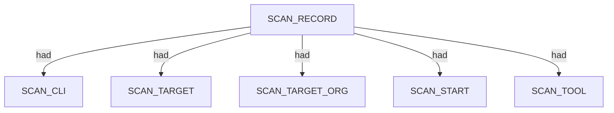
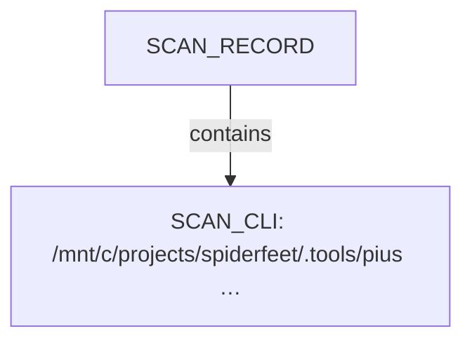
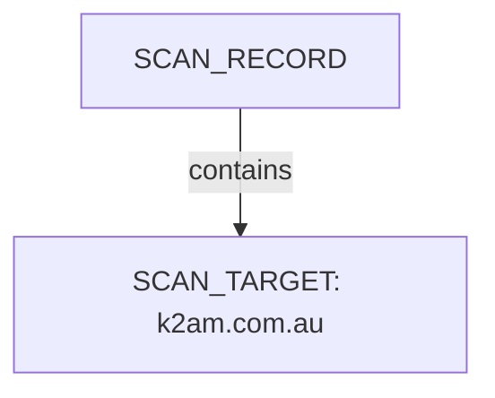
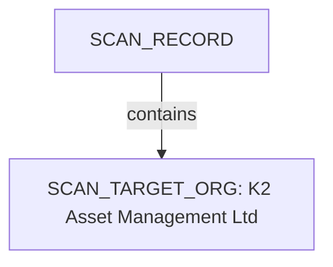
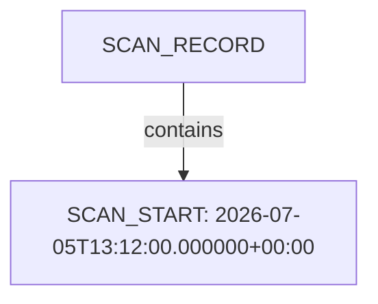
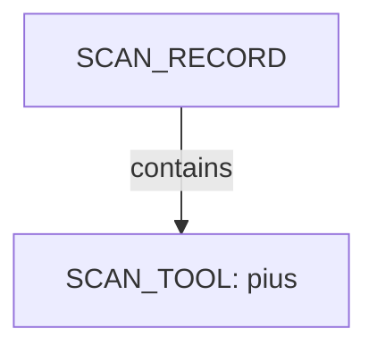
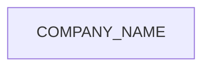

# Pius scan narrative — `corporate_k2am_ndjson`

## Introduction

Organizational attack-surface findings are grouped under the head company, with domains, affiliates, and unresolved research leads emitted per 08 rules.

## Scan

Every examination has one SCAN_RECORD with scan descriptors linked via had. This scan includes **1** Scan root node(s) (e.g. `pius:K2 Asset Management Ltd:/mnt/c/projects/spiderfeet/.tools/pius run --org "K2 Asset Management Ltd" --domain www.k2am.com.au --plugins gleif,wikidata,whois,crt-sh --output ndjson`). Linked structures: `SCAN_CLI`, `SCAN_TARGET`, `SCAN_TARGET_ORG`, `SCAN_START`, `SCAN_TOOL`.

### Structure overview

### `SCAN_CLI`

| Nugget | Value |
| --- | --- |
| `SCAN_CLI` | `/mnt/c/projects/spiderfeet/.tools/pius run --org "K2 Asset Management Ltd" --domain www.k2am.com.au --plugins gleif,wikidata,whois,crt-sh --output ndjson` |

### `SCAN_TARGET`

| Nugget | Value |
| --- | --- |
| `SCAN_TARGET` | `k2am.com.au` |

### `SCAN_TARGET_ORG`

| Nugget | Value |
| --- | --- |
| `SCAN_TARGET_ORG` | `K2 Asset Management Ltd` |

### `SCAN_START`

| Nugget | Value |
| --- | --- |
| `SCAN_START` | `2026-07-05T13:12:00.000000+00:00` |

### `SCAN_TOOL`

| Nugget | Value |
| --- | --- |
| `SCAN_TOOL` | `pius` |

## Organization

Organisation scans root at COMPANY_NAME with category buckets for domains, netblocks, and research leads. This scan includes **1** Organization root node(s) (e.g. `K2 Asset Management Ltd`). Linked structures: no child categories.

### Structure overview

### Values

| Nugget | Value |
| --- | --- |
| `COMPANY_NAME` | `K2 Asset Management Ltd` |

## Conclusion

See the appendix for the full node and edge inventory.

## Appendix

### Nodes

| Nugget | Value |
| --- | --- |
| `COMPANY_NAME` | `K2 Asset Management Ltd` |
| `SCAN_CLI` | `/mnt/c/projects/spiderfeet/.tools/pius run --org "K2 Asset Management Ltd" --domain www.k2am.com.au --plugins gleif,wikidata,whois,crt-sh --output ndjson` |
| `SCAN_RECORD` | `pius:K2 Asset Management Ltd:/mnt/c/projects/spiderfeet/.tools/pius run --org "K2 Asset Management Ltd" --domain www.k2am.com.au --plugins gleif,wikidata,whois,crt-sh --output ndjson` |
| `SCAN_START` | `2026-07-05T13:12:00.000000+00:00` |
| `SCAN_TARGET` | `k2am.com.au` |
| `SCAN_TARGET_ORG` | `K2 Asset Management Ltd` |
| `SCAN_TOOL` | `pius` |

### Edges

| Source | Relation | Target |
| --- | --- | --- |
| `SCAN_RECORD` | `had` | `SCAN_CLI` |
| `SCAN_RECORD` | `had` | `SCAN_TARGET` |
| `SCAN_RECORD` | `had` | `SCAN_TARGET_ORG` |
| `SCAN_RECORD` | `had` | `SCAN_START` |
| `SCAN_RECORD` | `had` | `SCAN_TOOL` |
| `SCAN_RECORD` | `contains` | `COMPANY_NAME` |
---

*OS-Intel Scan*
