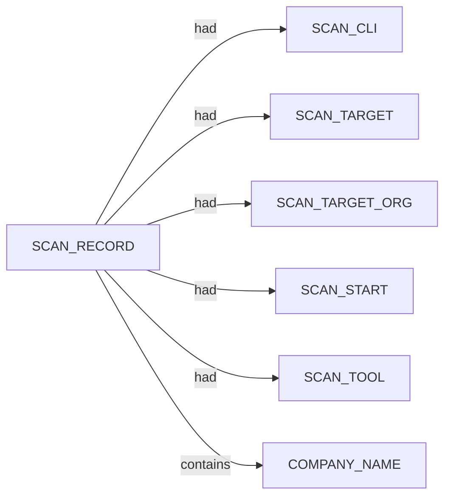

# Pius scan narrative — `corporate_k2am_ndjson`

## Introduction

Organizational attack-surface findings are grouped under the head company, with domains, affiliates, and unresolved research leads emitted per 08 rules.

## Organization

- `K2 Asset Management Ltd`

## Domains

- (none)

## Graph structure (types)

## Trace

_Trace section omitted when no TRACE nodes present._

## Appendix

### Nodes

- `COMPANY_NAME`: K2 Asset Management Ltd
- `SCAN_CLI`: /mnt/c/projects/spiderfeet/.tools/pius run --org "K2 Asset Management Ltd" --domain www.k2am.com.au --plugins gleif,wikidata,whois,crt-sh --output ndjson
- `SCAN_RECORD`: pius:K2 Asset Management Ltd:/mnt/c/projects/spiderfeet/.tools/pius run --org "K2 Asset Management Ltd" --domain www.k2am.com.au --plugins gleif,wikidata,whois,crt-sh --output ndjson
- `SCAN_START`: 2026-07-05T13:12:00.000000+00:00
- `SCAN_TARGET`: k2am.com.au
- `SCAN_TARGET_ORG`: K2 Asset Management Ltd
- `SCAN_TOOL`: pius

### Edges

- `SCAN_RECORD` `had` `SCAN_CLI`
- `SCAN_RECORD` `had` `SCAN_TARGET`
- `SCAN_RECORD` `had` `SCAN_TARGET_ORG`
- `SCAN_RECORD` `had` `SCAN_START`
- `SCAN_RECORD` `had` `SCAN_TOOL`
- `SCAN_RECORD` `contains` `COMPANY_NAME`
---

*OS-Intel Scan*
